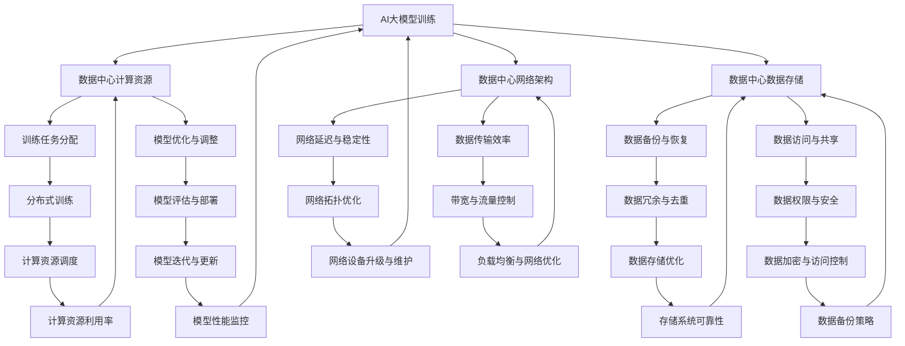
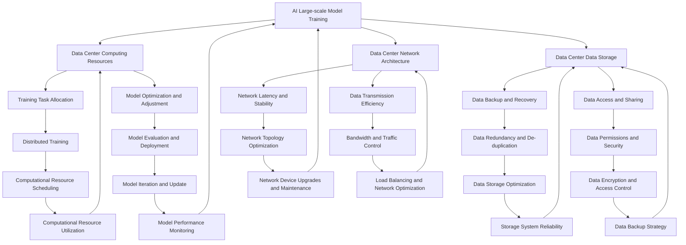

                 

### AI大模型与数据中心：背景介绍

#### AI大模型的发展历程

人工智能（AI）作为计算机科学的一个重要分支，其发展历程可追溯到20世纪50年代。最初，AI的探索主要集中在规则推理和简单任务的学习上。然而，随着计算能力的提升和大数据技术的普及，AI逐渐向复杂、高效的方向发展。特别是深度学习技术的突破，使得AI在图像识别、自然语言处理、推荐系统等方面取得了显著的成果。

大模型，即大型深度神经网络模型，是当前AI领域的一个重要趋势。从早期的DNN（深度神经网络）到CNN（卷积神经网络）、RNN（循环神经网络），再到Transformer架构的广泛应用，AI大模型在规模和性能上不断突破。以GPT-3、BERT等为代表的预训练模型，凭借其数十亿甚至数万亿参数，展现出了惊人的表现。

#### 数据中心的崛起

数据中心作为计算和数据存储的核心枢纽，其重要性日益凸显。随着云计算、大数据、物联网等技术的发展，数据中心的规模和复杂度也在不断提升。数据中心不仅是企业信息化的重要支撑，也是社会运行的关键基础设施。

数据中心的发展历程可以分为几个阶段：从最初的单一服务器部署，到分布式计算和存储架构的普及；再到如今的虚拟化和容器化技术的应用。数据中心的技术进步，不仅提高了系统的可靠性、灵活性和可扩展性，也推动了AI大模型的应用和部署。

#### AI大模型与数据中心的关系

AI大模型与数据中心之间存在着紧密的联系。首先，数据中心为AI大模型提供了必要的计算资源和数据存储空间。大模型的训练和推理需要大量的计算资源和存储空间，数据中心为此提供了坚实的基础。

其次，数据中心的架构和性能对AI大模型的性能有着直接的影响。例如，数据中心的网络架构、存储系统、服务器性能等，都会影响大模型的训练和推理速度。因此，优化数据中心的架构和性能，对于提升AI大模型的应用效果具有重要意义。

此外，AI大模型的发展也反过来推动了数据中心的升级和优化。例如，为了更好地支持AI大模型的计算需求，数据中心需要引入更高效的服务器、网络设备和存储系统。同时，AI大模型的数据存储和管理也对数据中心的架构提出了新的要求，推动了数据中心的智能化和自动化发展。

#### 目标与意义

本文旨在探讨AI大模型在数据中心的应用，以及数据中心领导力的发展。具体而言，我们将从以下几个方面展开讨论：

1. **核心概念与联系**：介绍AI大模型和数据中心的基本概念，并展示它们之间的联系。
2. **核心算法原理 & 具体操作步骤**：详细讲解AI大模型的训练和推理算法，以及数据中心的相关操作步骤。
3. **数学模型和公式 & 详细讲解 & 举例说明**：分析AI大模型涉及的数学模型和公式，并通过实例进行说明。
4. **项目实战：代码实际案例和详细解释说明**：通过实际项目案例，展示AI大模型在数据中心的应用过程。
5. **实际应用场景**：分析AI大模型在数据中心的不同应用场景，以及面临的挑战和解决方案。
6. **工具和资源推荐**：推荐学习AI大模型和数据中心的相关工具和资源。
7. **总结：未来发展趋势与挑战**：总结AI大模型和数据中心的发展趋势，以及面临的挑战。

通过本文的探讨，希望能够为数据中心领导和从业者提供一些有价值的参考和启示，推动AI大模型在数据中心的应用和发展。

> **Keywords:** AI, Large-scale Models, Data Centers, Leadership, Algorithm, Mathematics, Applications, Tools, Trends

> **Abstract:**
This article explores the relationship between AI large-scale models and data centers, discussing the development history of AI large-scale models, the rise of data centers, and the significance of their relationship. The article aims to provide insights into the application of AI large-scale models in data centers and the development of leadership in this field. Through a detailed analysis of core concepts, algorithms, mathematical models, practical cases, and application scenarios, the article aims to offer valuable references for data center leaders and professionals.

## 2. 核心概念与联系

在本节中，我们将详细介绍AI大模型和数据中心的基本概念，并展示它们之间的联系。

### AI大模型

#### 定义

AI大模型是指具有数十亿甚至数万亿参数的大型深度神经网络模型。这些模型通过大量的训练数据，学习到复杂的特征表示和模式识别能力，从而在图像识别、自然语言处理、推荐系统等任务中表现出色。

#### 关键技术

AI大模型的发展离不开以下几个关键技术：

1. **深度学习**：深度学习是构建AI大模型的核心技术，通过多层神经网络的组合，实现复杂函数的逼近和特征提取。
2. **数据增强**：为了提高模型的泛化能力，数据增强技术通过旋转、缩放、裁剪等操作，生成更多的训练样本。
3. **分布式训练**：大模型的训练需要大量的计算资源和时间，分布式训练技术通过将训练任务分解到多个计算节点上，实现并行训练，提高训练效率。
4. **优化算法**：为了加快训练速度和提高模型性能，优化算法如Adam、AdamW等被广泛应用于大模型的训练过程。

### 数据中心

#### 定义

数据中心（Data Center）是指集中存放计算机设备、网络设备、存储设备的建筑或场所，用于提供计算、存储、网络等服务。

#### 关键组成部分

数据中心主要由以下几个部分组成：

1. **服务器**：服务器是数据中心的计算核心，负责处理数据和运行应用程序。
2. **网络设备**：包括路由器、交换机等，用于实现数据中心的内部网络连接和外部网络连接。
3. **存储系统**：包括磁盘阵列、闪存等，用于存储数据和文件。
4. **电源和制冷系统**：为数据中心提供稳定的电力和冷却系统，保证设备的正常运行。

### AI大模型与数据中心的联系

AI大模型和数据中心之间的联系主要体现在以下几个方面：

1. **计算资源**：数据中心为AI大模型提供了必要的计算资源，包括服务器、GPU、TPU等。这些计算资源是实现大模型训练和推理的关键。
2. **数据存储**：数据中心提供了大模型所需的大量数据存储空间，包括HDD、SSD等。数据存储和管理对于大模型的训练和部署至关重要。
3. **网络架构**：数据中心的网络架构决定了大模型的数据传输速度和可靠性。高性能的网络设备和服务保证了数据中心的网络稳定性和低延迟。
4. **运维管理**：数据中心的运维管理对于AI大模型的应用效果具有重要影响。良好的运维管理可以提高数据中心的运行效率和稳定性，保障大模型的正常运行。

### Mermaid 流程图

以下是AI大模型与数据中心之间的Mermaid流程图，展示了它们之间的关键环节和联系：

通过上述流程图，我们可以清晰地看到AI大模型与数据中心之间的紧密联系，以及数据中心在支持AI大模型应用过程中所扮演的重要角色。

---

In this section, we will delve into the basic concepts of AI large-scale models and data centers, and demonstrate their connections.

#### AI Large-scale Models

##### Definition

AI large-scale models refer to large-scale deep neural network models with hundreds of millions or even trillions of parameters. These models learn complex feature representations and pattern recognition capabilities through vast amounts of training data, demonstrating outstanding performance in tasks such as image recognition, natural language processing, and recommendation systems.

##### Key Technologies

The development of AI large-scale models relies on several key technologies:

1. **Deep Learning**: Deep learning is the core technology for building AI large-scale models, achieving complex function approximation and feature extraction through the combination of multi-layer neural networks.
2. **Data Augmentation**: To improve model generalization, data augmentation techniques generate more training samples through operations such as rotation, scaling, and cropping.
3. **Distributed Training**: Large-scale model training requires significant computational resources and time. Distributed training techniques decompose training tasks into multiple computational nodes to achieve parallel training, improving training efficiency.
4. **Optimization Algorithms**: To accelerate training and improve model performance, optimization algorithms such as Adam and AdamW are widely used in the training process of large-scale models.

#### Data Centers

##### Definition

A data center (Data Center) is a building or facility that houses computer equipment, network equipment, and storage systems, providing computing, storage, and network services.

##### Key Components

A data center consists of several key components:

1. **Servers**: Servers are the computing core of the data center, responsible for processing data and running applications.
2. **Network Equipment**: Includes routers, switches, etc., used for internal data center network connections and external network connections.
3. **Storage Systems**: Include disk arrays, flash memory, etc., used for storing data and files.
4. **Power and Cooling Systems**: Provide stable power and cooling systems for the data center, ensuring the normal operation of equipment.

#### Connections between AI Large-scale Models and Data Centers

The connection between AI large-scale models and data centers is mainly reflected in the following aspects:

1. **Computational Resources**: Data centers provide the necessary computing resources for AI large-scale models, including servers, GPUs, TPUs, etc., which are essential for large-scale model training and inference.
2. **Data Storage**: Data centers offer vast data storage space for large-scale models, including HDDs, SSDs, etc., which are crucial for model training and deployment.
3. **Network Architecture**: The network architecture of the data center determines the data transmission speed and reliability of the large-scale model. High-performance network devices and services ensure the stability and low latency of the data center network.
4. **Operations Management**: The operations management of the data center has a significant impact on the application effects of AI large-scale models. Good operations management improves the operation efficiency and stability of the data center, ensuring the normal operation of large-scale models.

### Mermaid Flowchart

Here is a Mermaid flowchart illustrating the key processes and connections between AI large-scale models and data centers:

Through this flowchart, we can clearly see the close connections between AI large-scale models and data centers, as well as the crucial role data centers play in supporting the application of AI large-scale models.

