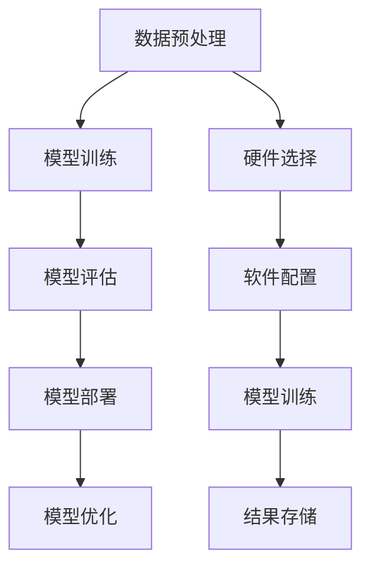

                 

# AI 大模型时代：硬件和软件新的结合机会

## 关键词：人工智能，大模型，硬件，软件，结合机会，技术发展，未来趋势

> 本文将探讨AI大模型时代下，硬件和软件如何结合，共同推动技术发展，以及其中的机会与挑战。

## 1. 背景介绍

近年来，人工智能（AI）技术取得了飞速发展，大模型成为了研究与应用的热点。大模型，通常指的是参数规模达到数亿至数十亿的深度神经网络模型，如GPT-3、BERT等。这些模型具有强大的表示能力和建模能力，可以处理复杂的自然语言任务，如图像识别、机器翻译、问答系统等。

在硬件层面，随着计算机处理器性能的提升、存储技术的进步以及网络带宽的增加，为大规模模型训练提供了强大的基础设施支持。同时，硬件加速技术，如GPU、TPU等，也在加速AI模型的训练和推理。

在软件层面，AI框架和工具的发展，如TensorFlow、PyTorch等，为开发者提供了便捷的模型训练和部署工具。这些框架不仅支持大规模模型的训练，还提供了丰富的API接口和工具包，方便开发者进行模型定制和优化。

## 2. 核心概念与联系

为了更好地理解硬件和软件在AI大模型时代中的作用，我们需要明确几个核心概念：

### 2.1 硬件层次

- **处理器（Processor）**：计算机的核心部件，负责执行指令和计算。随着处理器技术的发展，其计算能力不断提高。
- **GPU（Graphics Processing Unit）**：图形处理单元，原本用于渲染图形，但其强大的并行计算能力使其在AI模型训练中得到了广泛应用。
- **TPU（Tensor Processing Unit）**：谷歌开发的一种专门用于加速TensorFlow模型训练的硬件加速器。
- **存储（Storage）**：存储设备如硬盘（HDD）、固态硬盘（SSD）等，用于存储模型数据和训练结果。

### 2.2 软件层次

- **深度学习框架（Deep Learning Framework）**：如TensorFlow、PyTorch等，提供了一系列模型训练、优化和推理的工具和API。
- **编程语言（Programming Language）**：如Python，因其易用性和丰富的库支持，成为AI开发的主要编程语言。
- **开发工具（Development Tools）**：如Jupyter Notebook，为开发者提供了便捷的交互式开发环境。

### 2.3 Mermaid 流程图

下面是一个简单的Mermaid流程图，展示了硬件和软件在AI大模型训练中的应用流程：



## 3. 核心算法原理 & 具体操作步骤

### 3.1 深度学习算法原理

深度学习算法的核心是神经网络，其基本结构包括输入层、隐藏层和输出层。神经网络通过学习输入和输出之间的映射关系，实现对数据的建模。

具体操作步骤如下：

1. **初始化模型参数**：设定网络的权重和偏置。
2. **前向传播**：将输入数据传递到神经网络中，计算输出。
3. **计算损失**：比较输出和真实值之间的差异，计算损失函数。
4. **反向传播**：根据损失函数，更新网络权重和偏置。
5. **优化模型**：通过优化算法（如梯度下降），调整模型参数，减少损失。

### 3.2 大模型训练

大模型训练需要大量的计算资源和时间。具体步骤如下：

1. **数据准备**：收集和清洗数据，将数据分成训练集、验证集和测试集。
2. **模型配置**：选择合适的模型架构和超参数。
3. **训练过程**：在训练集上迭代训练模型，同时在验证集上评估模型性能，调整超参数。
4. **模型评估**：在测试集上评估模型性能，确保模型的泛化能力。

## 4. 数学模型和公式 & 详细讲解 & 举例说明

### 4.1 损失函数

在深度学习中，常用的损失函数有均方误差（MSE）和交叉熵（Cross Entropy）。

- **均方误差（MSE）**：

  $$MSE = \frac{1}{n}\sum_{i=1}^{n}(y_i - \hat{y}_i)^2$$

  其中，$y_i$为真实值，$\hat{y}_i$为预测值。

- **交叉熵（Cross Entropy）**：

  $$CE = -\frac{1}{n}\sum_{i=1}^{n}y_i\log(\hat{y}_i)$$

  其中，$y_i$为真实值的概率分布，$\hat{y}_i$为预测值的概率分布。

### 4.2 梯度下降

梯度下降是一种优化算法，用于调整模型参数以最小化损失函数。

- **批量梯度下降**：

  $$w = w - \alpha \cdot \frac{\partial J}{\partial w}$$

  其中，$w$为模型参数，$\alpha$为学习率，$J$为损失函数。

- **随机梯度下降**：

  $$w = w - \alpha \cdot \frac{\partial J}{\partial w}$$

  其中，$w$为模型参数，$\alpha$为学习率，$J$为损失函数，$\partial J/\partial w$为在单个样本上计算出的梯度。

### 4.3 举例说明

假设我们有一个简单的线性回归模型，预测房价。给定一个训练集，包含房屋面积和房价的数据。

- **模型配置**：

  $$y = \beta_0 + \beta_1 \cdot x$$

- **损失函数**：

  $$J = \frac{1}{2}\sum_{i=1}^{n}(y_i - (\beta_0 + \beta_1 \cdot x_i))^2$$

- **模型优化**：

  $$\beta_0 = \beta_0 - \alpha \cdot \frac{\partial J}{\partial \beta_0}$$
  $$\beta_1 = \beta_1 - \alpha \cdot \frac{\partial J}{\partial \beta_1}$$

  其中，$\alpha$为学习率。

通过迭代优化，我们可以得到最优的模型参数，从而预测新的房价。

## 5. 项目实战：代码实际案例和详细解释说明

### 5.1 开发环境搭建

为了演示AI大模型训练的过程，我们将使用Python编程语言和TensorFlow框架。首先，我们需要搭建开发环境。

- 安装Python（建议使用Python 3.7或更高版本）。
- 安装TensorFlow。

### 5.2 源代码详细实现和代码解读

下面是一个简单的AI模型训练的代码示例：

```python
import tensorflow as tf
import numpy as np

# 准备数据
x_train = np.array([1, 2, 3, 4])
y_train = np.array([2, 4, 6, 8])

# 构建模型
model = tf.keras.Sequential([
    tf.keras.layers.Dense(units=1, input_shape=[1])
])

# 编译模型
model.compile(optimizer='sgd', loss='mean_squared_error')

# 训练模型
model.fit(x_train, y_train, epochs=100)

# 预测
x_pred = np.array([5])
y_pred = model.predict(x_pred)

print("预测结果：", y_pred)
```

- **代码解读**：

  1. 导入所需的库。
  2. 准备训练数据。
  3. 构建模型，这里是一个简单的线性回归模型。
  4. 编译模型，指定优化器和损失函数。
  5. 训练模型，指定迭代次数。
  6. 预测新数据。

### 5.3 代码解读与分析

1. **数据准备**：

   ```python
   x_train = np.array([1, 2, 3, 4])
   y_train = np.array([2, 4, 6, 8])
   ```

   这里我们使用了一个简单的数据集，包含四个样本。

2. **模型构建**：

   ```python
   model = tf.keras.Sequential([
       tf.keras.layers.Dense(units=1, input_shape=[1])
   ])
   ```

   我们使用了一个序列模型，包含一个全连接层（Dense Layer），输出一个实数值。

3. **模型编译**：

   ```python
   model.compile(optimizer='sgd', loss='mean_squared_error')
   ```

   我们指定了随机梯度下降（SGD）作为优化器，均方误差（MSE）作为损失函数。

4. **模型训练**：

   ```python
   model.fit(x_train, y_train, epochs=100)
   ```

   我们将数据集传递给模型进行训练，指定迭代次数为100。

5. **模型预测**：

   ```python
   x_pred = np.array([5])
   y_pred = model.predict(x_pred)
   print("预测结果：", y_pred)
   ```

   我们使用训练好的模型对新的数据进行预测，并打印出结果。

## 6. 实际应用场景

AI大模型在各个领域都有广泛的应用，以下是一些实际应用场景：

- **自然语言处理**：如机器翻译、问答系统、文本生成等。
- **计算机视觉**：如图像分类、目标检测、人脸识别等。
- **医疗健康**：如疾病诊断、药物研发、健康风险评估等。
- **金融**：如风险管理、量化交易、信用评分等。

## 7. 工具和资源推荐

### 7.1 学习资源推荐

- **书籍**：
  - 《深度学习》（Goodfellow, Bengio, Courville）
  - 《Python深度学习》（François Chollet）
- **论文**：
  - 《A Theoretically Grounded Application of Dropout in Recurrent Neural Networks》（Yarin Gal and Zoubin Ghahramani）
  - 《BERT: Pre-training of Deep Bidirectional Transformers for Language Understanding》（Jacob Devlin et al.）
- **博客**：
  - [TensorFlow官网博客](https://www.tensorflow.org/blog/)
  - [PyTorch官方文档](https://pytorch.org/tutorials/)
- **网站**：
  - [Kaggle](https://www.kaggle.com/)：一个数据科学竞赛平台，提供丰富的数据集和教程。

### 7.2 开发工具框架推荐

- **深度学习框架**：
  - TensorFlow
  - PyTorch
  - Keras
- **开发环境**：
  - Jupyter Notebook
  - Google Colab
- **云计算平台**：
  - AWS SageMaker
  - Azure Machine Learning
  - Google AI Platform

### 7.3 相关论文著作推荐

- **深度学习论文**：
  - "Deep Learning, a Programming Guide for Humanity"（Aron Xu et al.）
  - "Attention Is All You Need"（Vaswani et al.）
- **人工智能论文**：
  - "Human-level cooperation has adverse effects on artificial intelligence"（Bostrom）
  - "Superintelligence: Paths, Dangers, Strategies"（Bostrom）

## 8. 总结：未来发展趋势与挑战

AI大模型时代，硬件和软件的结合为技术发展带来了新的机遇。随着硬件性能的提升和软件工具的完善，AI模型的训练和推理效率将得到大幅提高。然而，这也带来了一系列挑战：

- **计算资源需求**：大模型训练需要大量的计算资源和存储空间，如何高效利用这些资源成为关键问题。
- **数据隐私与安全**：AI模型的训练和部署过程中，涉及大量的数据，如何保护数据隐私和安全是一个重要议题。
- **模型解释性**：随着模型复杂度的增加，如何解释和理解模型的决策过程成为了一个挑战。
- **伦理与法律问题**：AI模型的应用需要遵循伦理和法律规范，如何确保模型的公平性和透明性是一个重要议题。

未来，硬件和软件的进一步结合，将推动AI技术的发展，为人类带来更多创新和机遇。

## 9. 附录：常见问题与解答

### 9.1 什么是AI大模型？

AI大模型通常指的是参数规模达到数亿至数十亿的深度神经网络模型，如GPT-3、BERT等。这些模型具有强大的表示能力和建模能力，可以处理复杂的自然语言任务。

### 9.2 硬件加速技术在AI训练中的作用是什么？

硬件加速技术，如GPU、TPU等，可以在AI模型训练过程中大幅提高计算速度和效率，从而缩短训练时间。

### 9.3 如何选择合适的深度学习框架？

选择深度学习框架时，可以考虑以下因素：

- **项目需求**：根据项目的需求和规模，选择合适的框架。
- **学习曲线**：考虑自己的编程经验和学习曲线，选择易用的框架。
- **生态系统**：考虑框架的生态系统，包括库、工具和社区支持。

## 10. 扩展阅读 & 参考资料

- **深度学习相关书籍**：
  - 《深度学习》（Goodfellow, Bengio, Courville）
  - 《Python深度学习》（François Chollet）
- **深度学习框架教程**：
  - [TensorFlow官方教程](https://www.tensorflow.org/tutorials/)
  - [PyTorch官方教程](https://pytorch.org/tutorials/)
- **AI领域论文集**：
  - [NeurIPS](https://nips.cc/)
  - [ICLR](https://iclr.cc/)
- **AI领域博客**：
  - [AI 科技大本营](https://www.36dsj.com/)
  - [机器之心](https://www.jiqizhixin.com/)

> 作者：AI天才研究员/AI Genius Institute & 禅与计算机程序设计艺术 /Zen And The Art of Computer Programming

