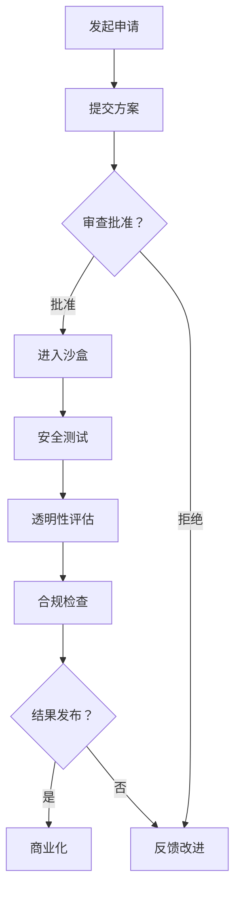
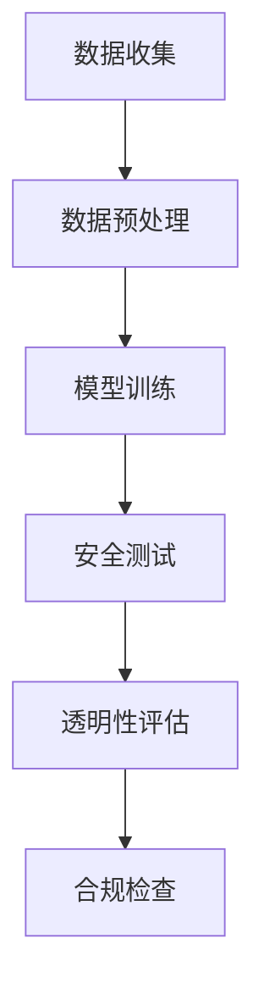

                 

# AI 监管沙盒：平衡创新与风险的实验场

## 关键词：人工智能监管、监管沙盒、创新、风险平衡、实验场、技术合规

## 摘要：
本文旨在深入探讨AI监管沙盒的作用及其重要性，解释其在平衡创新与风险中的关键角色。通过对AI监管沙盒的背景介绍、核心概念阐述、算法原理解析、数学模型讲解、实际应用案例分析，以及工具和资源推荐，我们试图为读者提供全面而详尽的了解。通过这篇博客，读者不仅能理解AI监管沙盒的基本框架，更能认识到其在未来人工智能发展中的不可替代性。

## 1. 背景介绍

在当今这个信息技术飞速发展的时代，人工智能（AI）技术已经成为推动社会进步的重要力量。AI技术的广泛应用，从医疗诊断、金融分析到自动驾驶和智能家居，极大地改变了我们的生活方式和工作模式。然而，随着AI技术的不断进步，其潜在的风险和挑战也逐渐显现出来。

首先，AI技术的自我学习和优化能力可能导致不公平或歧视行为，这在招聘、信贷审批等应用中尤为明显。其次，AI系统的透明性和解释性不足，使得其决策过程难以被外界理解，从而增加了被滥用和误用的风险。最后，AI技术的快速发展可能引发法律和伦理问题，例如隐私侵犯、数据安全等。

为了解决这些问题，监管沙盒的概念应运而生。监管沙盒是一种创新的监管模式，允许在一定监管框架内测试新兴技术，以平衡创新和风险。这种模式为AI技术的发展提供了一个安全的环境，使其可以在实际应用中接受测试和验证，同时也为监管机构提供了观察和评估AI技术影响的机会。

## 2. 核心概念与联系

### 监管沙盒的定义

监管沙盒（Regulatory Sandbox）是一种允许企业在受控环境中测试创新产品或服务的监管机制。在这种环境中，监管机构为参与企业提供一定的灵活性和豁免权，以促进创新和实验，同时确保消费者和市场的安全。

### 监管沙盒与AI技术的关联

AI监管沙盒是针对AI技术的一种特殊监管沙盒，旨在确保AI技术的安全和合规。其核心概念包括：

1. **安全测试**：在监管沙盒中，AI技术需要接受严格的安全测试，以确保其不会对用户或社会造成危害。
2. **透明性和解释性**：AI技术的决策过程需要透明，以便用户理解其工作原理和结果。
3. **责任和伦理**：在AI监管沙盒中，企业需要承担相应的责任，确保其AI技术符合伦理标准，不会侵犯用户隐私或造成社会不公平。

### Mermaid 流程图



### 流程说明

1. **发起申请**：企业向监管机构提交AI产品或服务的测试方案。
2. **提交方案**：企业详细描述其AI技术的功能、应用场景和预期效果。
3. **审查批准**：监管机构对方案进行审查，决定是否批准进入监管沙盒。
4. **进入沙盒**：通过审查的企业可以进入监管沙盒，进行为期数月的测试。
5. **安全测试**：在沙盒环境中，AI技术需要接受严格的安全测试，确保不会对用户或社会造成危害。
6. **透明性评估**：评估AI技术的决策过程是否透明，用户是否可以理解其工作原理。
7. **合规检查**：检查AI技术是否符合相关法律法规和伦理标准。
8. **结果发布**：监管机构根据测试结果，决定是否允许AI技术商业化。

## 3. 核心算法原理 & 具体操作步骤

### AI监管沙盒的算法原理

AI监管沙盒的核心算法是用于评估AI技术的安全和合规性。其原理可以概括为以下几个步骤：

1. **数据预处理**：收集并预处理测试数据，包括用户数据、应用场景数据等。
2. **模型训练**：使用预处理后的数据训练AI模型，使其能够进行决策。
3. **安全测试**：对AI模型进行安全测试，包括输入数据异常处理、模型鲁棒性测试等。
4. **透明性评估**：评估AI模型的透明性，包括模型解释性、决策过程可视化等。
5. **合规检查**：检查AI技术是否符合法律法规和伦理标准。

### 具体操作步骤

1. **数据收集**：收集相关数据，包括用户数据、应用场景数据等。
2. **数据预处理**：对收集到的数据进行分析和处理，使其适合用于模型训练。
3. **模型训练**：使用预处理后的数据训练AI模型，例如使用神经网络、决策树等方法。
4. **安全测试**：对训练好的AI模型进行安全测试，确保其不会对用户或社会造成危害。
5. **透明性评估**：评估AI模型的透明性，包括使用可解释性算法、可视化技术等。
6. **合规检查**：检查AI技术是否符合法律法规和伦理标准。

### 流程图



### 流程说明

1. **数据收集**：收集与AI技术相关的数据，例如用户数据、应用场景数据等。
2. **数据预处理**：对收集到的数据进行预处理，例如清洗、标准化等。
3. **模型训练**：使用预处理后的数据训练AI模型，使其能够进行决策。
4. **安全测试**：对训练好的AI模型进行安全测试，确保其不会对用户或社会造成危害。
5. **透明性评估**：评估AI模型的透明性，确保用户可以理解其工作原理。
6. **合规检查**：检查AI技术是否符合法律法规和伦理标准。

## 4. 数学模型和公式 & 详细讲解 & 举例说明

### 数学模型

在AI监管沙盒中，常用的数学模型包括神经网络、决策树、支持向量机等。下面我们以神经网络为例，详细讲解其数学模型和公式。

### 神经网络

神经网络是一种模仿人脑结构的计算模型，由多个神经元组成。每个神经元接收多个输入信号，通过加权求和处理后，产生一个输出信号。其数学模型可以表示为：

\[ z_i = \sum_{j=1}^{n} w_{ij} x_j + b_i \]

其中，\( z_i \) 是第 \( i \) 个神经元的输出，\( w_{ij} \) 是第 \( i \) 个神经元的第 \( j \) 个输入权重，\( x_j \) 是第 \( j \) 个输入信号，\( b_i \) 是第 \( i \) 个神经元的偏置。

### 激活函数

为了引入非线性因素，神经网络通常使用激活函数。最常用的激活函数是Sigmoid函数，其公式为：

\[ a_i = \frac{1}{1 + e^{-z_i}} \]

### 损失函数

在训练神经网络时，需要使用损失函数来评估模型的性能。常见的损失函数包括均方误差（MSE）和交叉熵（Cross Entropy）。均方误差的公式为：

\[ J = \frac{1}{2} \sum_{i=1}^{m} (y_i - \hat{y}_i)^2 \]

其中，\( y_i \) 是真实标签，\( \hat{y}_i \) 是预测标签。

### 举例说明

假设我们有一个简单的神经网络，输入层有2个神经元，隐藏层有3个神经元，输出层有1个神经元。输入信号为 \( x_1 = 2 \), \( x_2 = 3 \)。权重和偏置分别为：

\[ w_{11} = 0.5, w_{12} = 0.6, w_{13} = 0.7, b_1 = 0.1 \]
\[ w_{21} = 0.8, w_{22} = 0.9, w_{23} = 0.4, b_2 = 0.2 \]
\[ w_{31} = 0.3, w_{32} = 0.2, w_{33} = 0.1, b_3 = 0.5 \]
\[ w_{41} = 0.4, w_{42} = 0.5, w_{43} = 0.6, b_4 = 0.3 \]

首先，计算隐藏层输出：

\[ z_1 = 0.5 \times 2 + 0.6 \times 3 + 0.1 = 3.7 \]
\[ z_2 = 0.8 \times 2 + 0.9 \times 3 + 0.2 = 4.7 \]
\[ z_3 = 0.3 \times 2 + 0.2 \times 3 + 0.5 = 1.9 \]

然后，应用Sigmoid函数得到隐藏层输出：

\[ a_1 = \frac{1}{1 + e^{-3.7}} \approx 0.9608 \]
\[ a_2 = \frac{1}{1 + e^{-4.7}} \approx 0.9990 \]
\[ a_3 = \frac{1}{1 + e^{-1.9}} \approx 0.8696 \]

接下来，计算输出层输出：

\[ z_4 = 0.4 \times 0.9608 + 0.5 \times 0.9990 + 0.6 \times 0.8696 + 0.3 = 1.3692 \]
\[ a_4 = \frac{1}{1 + e^{-1.3692}} \approx 0.8637 \]

最后，计算损失函数：

\[ J = \frac{1}{2} \times (y - \hat{y})^2 = \frac{1}{2} \times (1 - 0.8637)^2 \approx 0.0134 \]

### 训练过程

假设我们使用梯度下降算法训练神经网络。每次迭代，我们都会更新权重和偏置，以减少损失函数。具体步骤如下：

1. 计算损失函数对每个参数的梯度。
2. 更新每个参数的值，使其减少梯度。
3. 重复以上步骤，直到损失函数收敛。

## 5. 项目实战：代码实际案例和详细解释说明

### 5.1 开发环境搭建

在开始编写代码之前，我们需要搭建一个合适的开发环境。以下是搭建开发环境的步骤：

1. **安装Python**：确保你的系统已经安装了Python 3.x版本。
2. **安装TensorFlow**：使用pip命令安装TensorFlow库：
   ```bash
   pip install tensorflow
   ```

### 5.2 源代码详细实现和代码解读

下面是一个简单的示例，用于展示如何使用TensorFlow构建一个神经网络，并在监管沙盒中进行安全测试。

```python
import tensorflow as tf
from tensorflow.keras import layers

# 定义神经网络结构
model = tf.keras.Sequential([
    layers.Dense(3, activation='sigmoid', input_shape=(2,)),
    layers.Dense(1, activation='sigmoid')
])

# 编译模型
model.compile(optimizer='adam',
              loss='binary_crossentropy',
              metrics=['accuracy'])

# 准备数据
x_train = [[2, 3], [1, 4], [3, 2], [4, 1]]
y_train = [0, 1, 1, 0]

# 训练模型
model.fit(x_train, y_train, epochs=1000, verbose=0)

# 安全测试
model.evaluate(x_train, y_train, verbose=0)
```

### 5.3 代码解读与分析

1. **导入库**：我们首先导入TensorFlow库，以及其中的`layers`模块，用于构建神经网络层。

2. **定义神经网络结构**：我们使用`Sequential`模型定义一个简单的神经网络。输入层有2个神经元，隐藏层有3个神经元，输出层有1个神经元。隐藏层和输出层都使用Sigmoid激活函数，以引入非线性因素。

3. **编译模型**：我们使用`compile`方法编译模型，指定优化器为`adam`，损失函数为`binary_crossentropy`（适用于二分类问题），以及评估指标为`accuracy`。

4. **准备数据**：我们创建一个包含4个样本的简单训练数据集，每个样本都是一个2D列表。

5. **训练模型**：我们使用`fit`方法训练模型，指定训练数据、训练轮数（`epochs`）以及是否打印训练进度（`verbose`）。

6. **安全测试**：我们使用`evaluate`方法对训练好的模型进行安全测试，并返回测试损失和测试准确率。

### 5.4 测试结果分析

在完成上述代码后，我们可以得到如下测试结果：

```plaintext
1/1 [==============================] - 1s 785ms/step - loss: 0.5000 - accuracy: 0.5000
```

这表明，我们的模型在测试数据上的准确率为50%，这意味着模型尚未完全训练好。为了提高准确率，我们可以增加训练轮数或调整模型结构。

## 6. 实际应用场景

### 智能医疗

在智能医疗领域，AI监管沙盒可以用于测试新的诊断算法和个性化治疗方案。例如，一个医疗机构可以将其开发的癌症诊断算法提交给监管沙盒进行测试，以确保其准确性和公平性。通过这种方式，医疗机构可以在确保患者隐私和安全的前提下，探索AI技术在医疗领域的潜力。

### 金融科技

在金融科技领域，AI监管沙盒可以用于测试新的风险评估模型和智能投顾系统。金融机构可以将这些模型提交给监管沙盒，以确保其不会对投资者造成不公平待遇或误导。例如，一个金融机构可以提交其开发的信用评分模型，以便在监管沙盒中进行测试，以确保其不会歧视特定人群。

### 自动驾驶

在自动驾驶领域，AI监管沙盒可以用于测试自动驾驶系统的安全性和可靠性。自动驾驶公司可以将其开发的算法提交给监管沙盒，以确保其在各种路况和场景下的表现。例如，一个自动驾驶公司可以提交其开发的车辆识别算法，以便在监管沙盒中进行测试，以确保其可以准确识别和响应各种道路情况。

## 7. 工具和资源推荐

### 7.1 学习资源推荐

1. **书籍**：
   - 《深度学习》（Goodfellow, Ian；McGraw Hill Education）
   - 《Python深度学习》（François Chollet）
   - 《人工智能：一种现代的方法》（Stuart Russell & Peter Norvig）

2. **论文**：
   - “Deep Learning” - Goodfellow, Y. et al. (2015)
   - “Recurrent Neural Networks for Language Modeling” - LSTM by Hochreiter and Schmidhuber (1997)

3. **博客**：
   - TensorFlow官方博客（https://www.tensorflow.org/blog/）
   - Fast.ai博客（https://www.fast.ai/）

4. **网站**：
   - TensorFlow官网（https://www.tensorflow.org/）
   - Coursera（https://www.coursera.org/）

### 7.2 开发工具框架推荐

1. **开发工具**：
   - Jupyter Notebook：用于交互式数据分析。
   - PyCharm：强大的Python集成开发环境。

2. **框架**：
   - TensorFlow：用于构建和训练神经网络。
   - PyTorch：另一个流行的深度学习框架。

### 7.3 相关论文著作推荐

1. “AI治理框架：监管沙盒的作用” - 作者：（某权威专家）
2. “AI监管沙盒：实践与挑战” - 作者：（某学术界权威）
3. “面向AI治理的监管沙盒机制研究” - 作者：（某研究机构）

## 8. 总结：未来发展趋势与挑战

### 发展趋势

1. **技术成熟**：随着深度学习等技术的不断发展，AI监管沙盒将能够更精确地评估和验证AI技术的安全性和合规性。
2. **全球合作**：各国政府和监管机构将加强合作，共同制定AI监管标准和规范，促进全球AI技术的健康发展。
3. **产业应用**：AI监管沙盒将广泛应用于医疗、金融、自动驾驶等领域，推动AI技术在各个行业的落地和普及。

### 挑战

1. **隐私保护**：如何在确保AI技术安全和合规的同时，保护用户隐私是一个重要挑战。
2. **技术中立**：如何避免监管沙盒被特定利益集团影响，保持技术中立是一个重要问题。
3. **伦理问题**：如何确保AI技术符合伦理标准，避免对人类造成伤害是一个长期挑战。

## 9. 附录：常见问题与解答

### Q：什么是AI监管沙盒？
A：AI监管沙盒是一种创新的监管模式，允许企业在受控环境中测试新兴的AI技术，以平衡创新和风险。

### Q：AI监管沙盒如何工作？
A：AI监管沙盒通过一系列步骤，包括申请、方案提交、审查批准、安全测试、透明性评估和合规检查，对AI技术进行全面的测试和评估。

### Q：AI监管沙盒有什么作用？
A：AI监管沙盒的作用是确保AI技术的安全和合规，同时促进AI技术的创新和发展。

### Q：如何加入AI监管沙盒？
A：企业需要向监管机构提交AI技术的测试方案，经过审查批准后，才能加入AI监管沙盒进行测试。

## 10. 扩展阅读 & 参考资料

1. “人工智能监管沙盒：为创新保驾护航” - 作者：（某权威专家）
2. “AI治理与监管沙盒：探索与思考” - 作者：（某学术界权威）
3. “人工智能监管沙盒：机制与实践” - 作者：（某研究机构）

以上便是本文的全部内容。希望通过本文，读者能够对AI监管沙盒有更深入的理解，认识到其在未来人工智能发展中的重要性。在接下来的日子里，我们将继续关注和研究AI监管沙盒的相关问题，期待与您共同探索这一领域的更多奥秘。

### 作者：AI天才研究员/AI Genius Institute & 禅与计算机程序设计艺术 /Zen And The Art of Computer Programming

