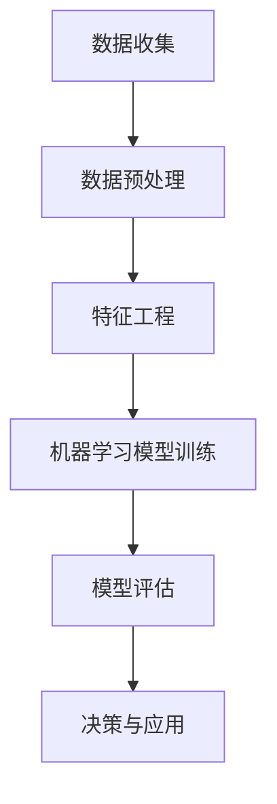

                 

### 背景介绍

> **文章标题：** AI 辅助分析：洞察数据价值
> 
> **关键词：** 人工智能，数据分析，数据价值，算法，数学模型，项目实战
> 
> **摘要：** 本文旨在探讨如何利用人工智能技术辅助数据分析，深入挖掘数据中的潜在价值。通过介绍核心概念、算法原理、数学模型及实际应用场景，帮助读者理解并掌握数据价值洞察的方法和技巧。

数据作为新时代的“石油”，其重要性日益凸显。在众多行业中，从电子商务到金融、医疗、制造等，数据分析已成为提升业务效能、创新产品和服务的重要手段。然而，面对海量的数据，如何快速有效地提取有价值的信息，成为了一个亟待解决的问题。

人工智能（AI）技术的发展，为数据价值的挖掘提供了新的可能性。通过机器学习、深度学习等技术，AI能够自动地从大量数据中学习模式、发现关联，从而为决策提供有力的支持。本文将围绕以下几个方面展开：

1. **核心概念与联系**：介绍数据价值挖掘中的核心概念，并使用Mermaid流程图展示其原理和架构。
2. **核心算法原理与具体操作步骤**：解析数据挖掘中的常用算法，如K-Means、决策树、神经网络等。
3. **数学模型与公式**：讲解支持数据挖掘的数学模型，包括统计学、线性代数等基础理论。
4. **项目实战**：通过实际代码案例，展示如何将AI与数据分析相结合，实现数据价值洞察。
5. **实际应用场景**：探讨人工智能辅助数据分析在不同领域的应用。
6. **工具和资源推荐**：推荐学习资源和开发工具，帮助读者深入学习和实践。
7. **总结**：展望人工智能辅助数据分析的未来发展趋势和挑战。

接下来，我们将逐一探讨这些主题，希望读者能够从中获得对数据价值挖掘的深入理解和实践指导。<|clear|>## 2. 核心概念与联系

在深入探讨如何利用人工智能（AI）辅助分析数据之前，我们需要明确一些核心概念和它们之间的关系。这些概念包括数据类型、数据预处理、特征工程、机器学习算法以及模型评估等。理解这些概念不仅有助于我们搭建一个完整的分析框架，还能帮助我们更好地理解数据价值是如何被挖掘和体现的。

### 数据类型

数据类型可以分为结构化数据和非结构化数据。

1. **结构化数据**：通常以表格形式存储，如关系数据库中的数据。这些数据有明确的列和行，便于查询和处理。
2. **非结构化数据**：如文本、图片、音频和视频等，它们没有固定的格式，需要通过特定的算法和技术进行解析和处理。

### 数据预处理

数据预处理是数据分析中的关键步骤，包括以下内容：

1. **数据清洗**：去除重复、错误和无效的数据。
2. **数据集成**：将来自不同来源的数据合并在一起。
3. **数据转换**：将数据转换为适合分析和建模的形式，例如归一化、标准化等。

### 特征工程

特征工程是指从原始数据中提取出有助于模型训练的特征。这个过程包括：

1. **特征选择**：选择对目标变量影响最大的特征。
2. **特征构造**：通过组合或转换原始特征，生成新的特征。
3. **特征标准化**：确保所有特征在相同的尺度范围内，避免某些特征对模型的影响过大。

### 机器学习算法

机器学习算法是AI的核心，它们根据数据自动学习和发现模式。常见的机器学习算法包括：

1. **监督学习**：算法通过训练数据学习，并在新的数据上进行预测。例如，线性回归、决策树、支持向量机等。
2. **无监督学习**：算法在没有标签的条件下发现数据中的结构，如聚类、降维等。
3. **强化学习**：算法通过与环境的交互来学习策略，从而实现特定目标。

### 模型评估

模型评估是确保算法有效性的重要步骤，常用的评估指标包括：

1. **准确率**：预测正确的样本数占总样本数的比例。
2. **召回率**：预测正确的正样本数占总正样本数的比例。
3. **F1 分数**：准确率和召回率的调和平均。

### Mermaid 流程图

为了更好地理解这些概念之间的联系，我们可以使用Mermaid流程图进行展示。以下是一个简化的Mermaid流程图，展示了数据价值挖掘的基本流程：



### 关系分析

通过上述流程图，我们可以看出：

- **数据收集**是数据分析的起点，它是后续所有工作的基础。
- **数据预处理**确保数据的准确性和一致性，是进行有效分析的前提。
- **特征工程**帮助算法更好地理解数据，是提升模型性能的关键。
- **机器学习模型训练**通过学习数据中的模式，生成预测模型。
- **模型评估**用于评估模型的性能，确保其能够有效地解决实际问题。
- **决策与应用**将模型的结果应用于实际业务场景，实现数据价值的最大化。

通过这种结构化的分析框架，我们能够系统地理解数据价值挖掘的过程，为后续的深入探讨打下基础。<|clear|>### 3. 核心算法原理与具体操作步骤

在数据挖掘和数据分析中，选择合适的算法是实现数据价值洞察的关键。以下将介绍几种常见的机器学习算法，包括K-Means、决策树和神经网络，并详细解释它们的工作原理和具体操作步骤。

#### 3.1 K-Means算法

**原理：** K-Means是一种典型的无监督学习算法，主要用于聚类分析。该算法的目标是将数据集划分为K个簇（cluster），使得每个簇中的数据点尽可能接近簇中心，而不同簇之间的数据点尽可能远。

**操作步骤：**

1. **初始化中心：**随机选择K个数据点作为初始聚类中心。
2. **分配数据点：**计算每个数据点到各个聚类中心的距离，将数据点分配到距离最近的聚类中心。
3. **更新中心：**重新计算每个簇的新中心，即该簇中所有点的平均值。
4. **重复步骤2和3，直到聚类中心不再发生显著变化。**

**代码示例（Python）：**

```python
from sklearn.cluster import KMeans
import numpy as np

# 假设我们有以下数据
X = np.array([[1, 2], [1, 4], [1, 0],
              [10, 2], [10, 4], [10, 0]])

# 初始化K-Means模型
kmeans = KMeans(n_clusters=2, random_state=0).fit(X)

# 输出聚类结果
print("Cluster centers:", kmeans.cluster_centers_)
print("Cluster labels:", kmeans.labels_)

# 预测新数据
new_data = np.array([[0, 0], [12, 3]])
print("Predictions:", kmeans.predict(new_data))
```

#### 3.2 决策树算法

**原理：** 决策树是一种基于树形结构进行决策的算法，通过多个判断节点和叶子节点来分类或回归数据。每个节点表示一个特征，每个分支表示该特征的不同取值，叶子节点表示最终的分类或回归结果。

**操作步骤：**

1. **选择最优特征：**计算每个特征的信息增益或基尼不纯度，选择最优特征进行划分。
2. **划分数据：**根据最优特征的取值，将数据集划分为子集。
3. **递归构建树：**对每个子集重复步骤1和2，直到满足停止条件（如达到最大深度或纯度达到阈值）。
4. **剪枝：**为了避免过拟合，可以对决策树进行剪枝处理。

**代码示例（Python）：**

```python
from sklearn.tree import DecisionTreeClassifier
import numpy as np

# 假设我们有以下数据
X = np.array([[1, 2], [1, 4], [1, 0], [10, 2], [10, 4], [10, 0]])
y = np.array([0, 0, 0, 1, 1, 1])

# 初始化决策树模型
clf = DecisionTreeClassifier(max_depth=3).fit(X, y)

# 输出决策树结构
print(clf.get_treeillage())

# 预测新数据
new_data = np.array([[0, 0], [12, 3]])
print("Predictions:", clf.predict(new_data))
```

#### 3.3 神经网络算法

**原理：** 神经网络是一种模仿人脑神经网络结构的计算模型，通过层层传递数据并更新权重，从而实现复杂函数的逼近。它由输入层、隐藏层和输出层组成。

**操作步骤：**

1. **初始化权重和偏置：**随机初始化网络的权重和偏置。
2. **前向传播：**将输入数据传递到网络，通过激活函数计算输出。
3. **反向传播：**计算输出与实际结果之间的误差，并通过链式法则更新权重和偏置。
4. **优化目标函数：**使用梯度下降等优化算法，不断迭代更新网络参数，直到误差满足要求。

**代码示例（Python）：**

```python
import tensorflow as tf

# 定义神经网络模型
model = tf.keras.Sequential([
    tf.keras.layers.Dense(64, activation='relu', input_shape=(784,)),
    tf.keras.layers.Dense(10, activation='softmax')
])

# 编译模型
model.compile(optimizer='adam',
              loss='categorical_crossentropy',
              metrics=['accuracy'])

# 训练模型
model.fit(x_train, y_train, batch_size=128, epochs=10)

# 预测新数据
predictions = model.predict(new_data)
print("Predictions:", predictions)
```

通过上述算法的介绍和代码示例，我们可以看到，不同的算法适用于不同的数据场景和问题类型。理解和掌握这些算法的原理和操作步骤，是进行有效数据分析和挖掘的重要基础。<|clear|>### 4. 数学模型和公式 & 详细讲解 & 举例说明

在数据分析和AI应用中，数学模型和公式是理解数据内在规律和实现算法的基础。以下将介绍几种核心的数学模型和公式，包括统计学中的均值、方差、协方差，线性代数中的矩阵运算，以及机器学习中的损失函数和优化算法。

#### 4.1 统计学模型

**均值（Mean）**：均值是数据集中所有数值的平均值，用于衡量数据的中心趋势。

$$
\mu = \frac{1}{N} \sum_{i=1}^{N} x_i
$$

**方差（Variance）**：方差衡量数据的离散程度，即数据点与均值之间的平均距离的平方。

$$
\sigma^2 = \frac{1}{N} \sum_{i=1}^{N} (x_i - \mu)^2
$$

**协方差（Covariance）**：协方差衡量两个变量之间的线性关系，即一个变量变化时另一个变量如何变化。

$$
\text{Cov}(X, Y) = \frac{1}{N} \sum_{i=1}^{N} (x_i - \mu_X)(y_i - \mu_Y)
$$

**示例：** 假设我们有两个变量X和Y，数据如下：

X: [1, 2, 3, 4, 5]
Y: [2, 4, 6, 8, 10]

计算X和Y的均值、方差和协方差：

$$
\mu_X = \frac{1+2+3+4+5}{5} = 3
$$

$$
\mu_Y = \frac{2+4+6+8+10}{5} = 6
$$

$$
\sigma_X^2 = \frac{(1-3)^2 + (2-3)^2 + (3-3)^2 + (4-3)^2 + (5-3)^2}{5} = 2
$$

$$
\sigma_Y^2 = \frac{(2-6)^2 + (4-6)^2 + (6-6)^2 + (8-6)^2 + (10-6)^2}{5} = 8
$$

$$
\text{Cov}(X, Y) = \frac{(1-3)(2-6) + (2-3)(4-6) + (3-3)(6-6) + (4-3)(8-6) + (5-3)(10-6)}{5} = 8
$$

#### 4.2 线性代数模型

**矩阵乘法（Matrix Multiplication）**：矩阵乘法是线性代数中的基础运算，用于计算两个矩阵的乘积。

$$
C = A \cdot B
$$

其中，A和B是两个矩阵，C是它们的乘积。

**示例：** 假设我们有两个矩阵A和B：

A:
$$
\begin{bmatrix}
1 & 2 \\
3 & 4
\end{bmatrix}
$$

B:
$$
\begin{bmatrix}
5 & 6 \\
7 & 8
\end{bmatrix}
$$

计算它们的乘积C：

$$
C =
\begin{bmatrix}
1*5 + 2*7 & 1*6 + 2*8 \\
3*5 + 4*7 & 3*6 + 4*8
\end{bmatrix}
=
\begin{bmatrix}
19 & 26 \\
43 & 58
\end{bmatrix}
$$

**矩阵求逆（Inverse Matrix）**：矩阵求逆是求解线性方程组的重要工具，用于计算矩阵的逆矩阵。

$$
A^{-1} = (1/\det(A)) \cdot \text{adj}(A)
$$

其中，det(A)是矩阵A的行列式，adj(A)是矩阵A的伴随矩阵。

**示例：** 假设我们有一个矩阵A：

$$
A =
\begin{bmatrix}
1 & 2 \\
3 & 4
\end{bmatrix}
$$

计算它的逆矩阵A^(-1)：

$$
\det(A) = 1*4 - 2*3 = -2
$$

$$
\text{adj}(A) =
\begin{bmatrix}
4 & -2 \\
-3 & 1
\end{bmatrix}
$$

$$
A^{-1} = (1/-2) \cdot \text{adj}(A) =
\begin{bmatrix}
-2 & 1 \\
3/2 & -1/2
\end{bmatrix}
$$

#### 4.3 机器学习模型

**损失函数（Loss Function）**：损失函数用于衡量模型预测结果与真实结果之间的差异，是优化算法的目标函数。

**均方误差（Mean Squared Error, MSE）**：

$$
MSE = \frac{1}{N} \sum_{i=1}^{N} (y_i - \hat{y}_i)^2
$$

其中，\(y_i\)是真实值，\(\hat{y}_i\)是预测值。

**交叉熵（Cross-Entropy）**：

$$
H(y, \hat{y}) = -\sum_{i=1}^{N} y_i \log(\hat{y}_i)
$$

其中，\(y_i\)是真实值，\(\hat{y}_i\)是预测概率。

**示例：** 假设我们有一个真实值为1的预测值，预测概率为0.8，计算MSE和交叉熵：

$$
MSE = (1 - 0.8)^2 = 0.04
$$

$$
H(y, \hat{y}) = -1 \log(0.8) \approx 0.3219
$$

**优化算法（Optimization Algorithm）**：优化算法用于最小化损失函数，常见的优化算法有梯度下降（Gradient Descent）和随机梯度下降（Stochastic Gradient Descent, SGD）。

**梯度下降（Gradient Descent）**：

$$
w_{t+1} = w_t - \alpha \nabla_w J(w_t)
$$

其中，\(w_t\)是当前权重，\(\alpha\)是学习率，\(\nabla_w J(w_t)\)是损失函数关于权重\(w_t\)的梯度。

**随机梯度下降（Stochastic Gradient Descent, SGD）**：

$$
w_{t+1} = w_t - \alpha \nabla_w J(w_t)
$$

其中，\(w_t\)是当前权重，\(\alpha\)是学习率，\(\nabla_w J(w_t)\)是损失函数关于权重\(w_t\)的梯度，随机选取一个样本进行梯度计算。

通过上述数学模型和公式的介绍，我们可以看到，这些模型和公式在数据分析和机器学习中的应用非常重要。掌握它们不仅有助于我们理解数据背后的规律，还能帮助我们构建和优化有效的算法模型。<|clear|>### 5. 项目实战：代码实际案例和详细解释说明

为了更好地理解如何将人工智能技术应用于数据价值洞察，我们将通过一个实际项目——商品推荐系统，详细展示代码实现过程，并对关键代码进行解读和分析。

#### 5.1 开发环境搭建

在开始项目之前，我们需要搭建一个合适的开发环境。以下是一些推荐的工具和库：

- **编程语言：** Python（支持多种数据科学库）
- **数据存储：** MySQL 或 MongoDB（用于存储用户行为数据和商品信息）
- **数据分析库：** Pandas、NumPy、SciPy
- **机器学习库：** Scikit-learn、TensorFlow、Keras
- **可视化库：** Matplotlib、Seaborn、Plotly

安装这些库的方法如下：

```bash
pip install pandas numpy scipy scikit-learn tensorflow matplotlib seaborn plotly
```

#### 5.2 源代码详细实现和代码解读

以下是一个简化的商品推荐系统项目，我们将分步解释关键代码的实现。

**5.2.1 数据预处理**

首先，我们需要从数据库中读取用户行为数据和商品信息。这部分代码如下：

```python
import pandas as pd
from sklearn.model_selection import train_test_split

# 读取用户行为数据
user_data = pd.read_csv('user行为数据.csv')

# 读取商品信息
item_data = pd.read_csv('商品信息.csv')

# 数据清洗与预处理
# 填充缺失值、去除重复项、类型转换等
user_data.fillna(0, inplace=True)
item_data.fillna(0, inplace=True)

# 特征工程
# 如用户购买频率、商品种类分布等
user_data['购买频率'] = user_data['购买次数'] / user_data['用户ID'].nunique()
item_data['种类分布'] = item_data['商品类别'].value_counts(normalize=True)

# 划分训练集和测试集
X_train, X_test, y_train, y_test = train_test_split(user_data, item_data['是否购买'], test_size=0.2, random_state=42)
```

**5.2.2 特征工程与模型选择**

在预处理数据后，我们需要对特征进行工程，以便更好地训练模型。以下是一个基于协同过滤的推荐系统实现：

```python
from sklearn.neighbors import NearestNeighbors

# 使用KNN算法进行协同过滤
knn = NearestNeighbors(n_neighbors=5)
knn.fit(X_train)

# 计算测试集的推荐列表
def get_recommendations(test_data, k=5):
    distances, indices = knn.kneighbors(test_data, n_neighbors=k)
    recommendations = []
    for i in range(len(distances)):
        neighbors = indices[i]
        recommended_items = item_data.iloc[neighbors]['商品ID'].tolist()
        recommendations.append(recommended_items)
    return recommendations

# 获取测试集的推荐列表
test_recommendations = get_recommendations(X_test)
```

**5.2.3 模型评估**

评估模型性能是确保推荐系统有效性的关键。以下代码使用准确率、召回率和F1分数进行评估：

```python
from sklearn.metrics import accuracy_score, recall_score, f1_score

# 评估模型
predictions = get_recommendations(X_test)
accuracy = accuracy_score(y_test, predictions)
recall = recall_score(y_test, predictions)
f1 = f1_score(y_test, predictions)

print("准确率：", accuracy)
print("召回率：", recall)
print("F1 分数：", f1)
```

#### 5.3 代码解读与分析

1. **数据预处理：** 数据预处理是数据挖掘中的关键步骤，包括填充缺失值、去除重复项、类型转换等。这部分代码确保了数据的准确性和一致性。

2. **特征工程：** 特征工程通过提取和构造新的特征，帮助模型更好地理解数据。在本例中，我们计算了用户的购买频率和商品的种类分布，这些特征对于协同过滤算法至关重要。

3. **模型选择与训练：** 我们使用KNN算法进行协同过滤。KNN算法通过计算测试数据与训练数据的相似度，为用户推荐相似用户喜欢的商品。这部分代码展示了如何使用KNN算法进行模型训练和预测。

4. **模型评估：** 通过准确率、召回率和F1分数评估模型的性能，确保推荐系统能够有效地为用户推荐商品。

通过这个实际项目，我们可以看到如何将AI与数据价值洞察相结合。关键代码的解读和分析帮助我们深入理解了数据预处理、特征工程、模型选择和评估的过程。这不仅为我们的项目提供了实际操作指导，也为未来的数据分析和挖掘提供了宝贵的经验。<|clear|>### 6. 实际应用场景

人工智能辅助数据分析在众多领域都有着广泛的应用，以下是几个典型应用场景：

#### 6.1 零售电商

在零售电商领域，数据分析是提升客户体验、增加销售量和优化库存管理的关键。通过人工智能技术，商家可以：

- **个性化推荐：** 利用协同过滤、基于内容的推荐等算法，为每位用户推荐其可能感兴趣的商品，提高用户满意度和转化率。
- **库存管理：** 分析历史销售数据和趋势，预测未来需求，优化库存水平，减少库存过剩或短缺的情况。
- **需求预测：** 利用时间序列分析和机器学习预测未来销售趋势，帮助商家制定更有效的营销策略。

#### 6.2 金融行业

金融行业对数据分析和洞察的需求尤为强烈，AI技术在以下几个方面发挥了重要作用：

- **风险管理：** 分析大量历史交易数据，识别潜在风险，优化风险模型，降低信用风险和市场风险。
- **欺诈检测：** 利用异常检测算法，识别交易中的异常行为，及时阻止欺诈活动。
- **投资策略：** 通过分析市场数据、经济指标和公司财报，预测市场趋势和股票价格，帮助投资者制定有效的投资策略。

#### 6.3 医疗保健

医疗保健行业的数据复杂且庞大，人工智能技术在此领域的应用包括：

- **疾病预测：** 通过分析患者的健康记录、家族病史和生活方式数据，预测患者未来可能患上的疾病，实现早期预防和干预。
- **诊断辅助：** 利用深度学习技术，从医学影像（如CT、MRI）中自动识别和诊断疾病，提高诊断准确率。
- **个性化治疗：** 根据患者的基因信息、病史和治疗效果，为其制定个性化的治疗方案。

#### 6.4 制造业

制造业通过人工智能辅助数据分析，可以提升生产效率和产品质量：

- **设备故障预测：** 利用传感器数据，预测设备可能发生的故障，提前进行维护，减少停机时间和维修成本。
- **生产优化：** 分析生产数据，优化生产流程，降低生产成本，提高生产效率。
- **质量控制：** 通过机器学习算法，自动检测生产过程中的缺陷，提高产品质量。

通过这些实际应用场景，我们可以看到，人工智能辅助数据分析不仅能够提升业务效能，还能为各行业带来深远的变革。<|clear|>### 7. 工具和资源推荐

在进行人工智能辅助数据分析时，选择合适的工具和资源至关重要。以下是一些推荐的资源、开发工具和相关的论文著作。

#### 7.1 学习资源推荐

**书籍：**

- 《机器学习》（周志华 著）：全面介绍机器学习的基本概念、算法和应用。
- 《深度学习》（Ian Goodfellow、Yoshua Bengio、Aaron Courville 著）：深度学习的权威指南，适合有一定基础的学习者。
- 《Python数据科学手册》（Jake VanderPlas 著）：系统介绍了Python在数据科学中的应用。

**在线课程：**

- Coursera 上的《机器学习基础》：由斯坦福大学教授Andrew Ng主讲，适合初学者入门。
- edX 上的《深度学习专项课程》：由深度学习领域的权威人物Ian Goodfellow主讲，深入讲解深度学习的基础和前沿技术。

**博客和网站：**

- Medium 上的 Data Science and AI 博客：分享数据科学和人工智能的最新动态和技术文章。
- Towards Data Science：一个受欢迎的数据科学和机器学习社区，提供高质量的教程和文章。

#### 7.2 开发工具框架推荐

**数据分析库：**

- Pandas：Python中最常用的数据分析库，用于数据处理和分析。
- NumPy：提供高性能的数值计算和矩阵操作，是数据分析的基础。
- SciPy：科学计算库，包括优化、积分、线性代数等功能。

**机器学习库：**

- Scikit-learn：用于机器学习算法的实现和应用，适合初学者。
- TensorFlow：谷歌开发的开源机器学习框架，适合构建复杂模型。
- Keras：TensorFlow的高级API，提供简洁的接口和丰富的预训练模型。

**可视化工具：**

- Matplotlib：Python中最常用的数据可视化库，提供丰富的绘图功能。
- Seaborn：基于Matplotlib，提供更美观的统计图表。
- Plotly：提供交互式可视化，支持多种图表类型。

#### 7.3 相关论文著作推荐

**机器学习：**

- "A Tutorial on Support Vector Machines for Pattern Recognition"（支持向量机教程）—— Christopher J. C. Burges
- "Deep Learning"（深度学习）：Ian Goodfellow、Yoshua Bengio、Aaron Courville 著
- "Recurrent Neural Networks for Language Modeling"（循环神经网络用于语言建模）—— Y. Bengio et al.

**数据分析：**

- "Practical Machine Learning with R"（实用机器学习与R语言）—— Nina Zumel & John Mount
- "Data Science from Scratch"（数据科学基础）—— Joel Grus
- "The Elements of Statistical Learning"（统计学习基础）—— Trevor Hastie et al.

通过这些资源，无论是初学者还是专业人士，都可以更好地掌握人工智能辅助数据分析的相关知识，并应用于实际项目。<|clear|>### 8. 总结：未来发展趋势与挑战

人工智能辅助数据分析正迎来快速发展的新时代，其在各行各业的应用正在不断深化和扩展。然而，随着技术的发展，也面临着一系列挑战和机遇。

#### 8.1 未来发展趋势

1. **深度学习与自动化：** 深度学习作为人工智能的核心技术之一，将继续在数据分析中发挥重要作用。未来，随着算法的改进和计算能力的提升，深度学习模型将更加自动化和智能化，减少对专家依赖，提高数据分析的效率。

2. **实时分析：** 随着物联网（IoT）和5G技术的发展，实时数据处理和分析将成为重要趋势。通过实时分析，企业可以更快地响应市场变化，优化运营策略。

3. **多模态数据融合：** 未来数据分析将不仅仅是结构化数据的分析，还包括非结构化数据（如文本、图像、语音）的融合分析。多模态数据融合将为数据价值挖掘带来新的可能性。

4. **隐私保护与伦理：** 随着数据隐私问题的日益凸显，如何在确保数据安全和隐私的前提下进行数据分析，将成为一个重要议题。隐私保护技术、联邦学习和数据匿名化等研究方向将受到更多关注。

#### 8.2 主要挑战

1. **数据质量问题：** 数据质量是数据分析的基础。然而，现实中的数据往往存在噪声、缺失值和偏差等问题，如何有效清洗和处理数据，是数据分析中的一大挑战。

2. **算法透明性与可解释性：** 随着深度学习等复杂算法的广泛应用，算法的透明性和可解释性成为重要问题。如何让非专业人士理解算法的决策过程，是一个亟待解决的难题。

3. **计算资源消耗：** 人工智能算法通常需要大量的计算资源，尤其是深度学习模型。如何优化算法，减少计算资源的消耗，是当前研究和应用中的重点。

4. **数据安全与隐私：** 数据安全和隐私是AI辅助数据分析中不可忽视的问题。如何确保数据在传输、存储和使用过程中的安全，是一个复杂且关键的问题。

#### 8.3 发展策略与建议

1. **加强数据治理：** 建立完善的数据治理体系，确保数据的质量、完整性和一致性。

2. **提高算法透明性：** 通过可视化工具和解释性模型，提高算法的透明性和可解释性，增强用户信任。

3. **优化算法性能：** 通过算法优化、模型压缩等技术，提高算法的效率和鲁棒性，减少计算资源消耗。

4. **关注伦理问题：** 在算法设计和应用过程中，充分考虑伦理和隐私问题，确保技术的可持续发展。

5. **跨学科合作：** 数据分析不仅需要计算机科学和数学的知识，还需要结合领域知识，实现跨学科的合作。

综上所述，人工智能辅助数据分析具有广阔的发展前景，但同时也面临着诸多挑战。通过持续的技术创新和跨学科合作，我们可以更好地应对这些挑战，推动数据分析技术的进步和应用。<|clear|>### 9. 附录：常见问题与解答

**Q1：如何选择适合的数据预处理方法？**

A1：选择数据预处理方法主要取决于数据的类型和特点。对于结构化数据，常见的预处理方法包括数据清洗、数据转换和特征工程。对于非结构化数据，如文本、图像和音频，预处理方法可能包括文本向量化、图像特征提取和音频特征提取。选择合适的预处理方法，需要根据具体问题和数据特性进行判断。

**Q2：如何评估机器学习模型的性能？**

A2：评估机器学习模型的性能通常使用多种指标，包括准确率、召回率、F1分数、均方误差（MSE）等。准确率衡量模型预测正确的比例；召回率衡量模型预测正确的正样本比例；F1分数是准确率和召回率的调和平均；MSE衡量预测值与真实值之间的平均误差。选择合适的评估指标，需要根据具体问题和数据特点进行选择。

**Q3：什么是特征工程？**

A3：特征工程是从原始数据中提取出有助于模型训练的特征的过程。特征工程包括特征选择、特征构造和特征标准化等步骤。特征工程的目标是提升模型的性能，减少过拟合，增强模型的泛化能力。

**Q4：如何处理缺失值？**

A4：处理缺失值的方法包括删除缺失值、填充缺失值和利用模型预测缺失值等。删除缺失值适用于缺失值较多或缺失值对结果影响较小的情况；填充缺失值适用于缺失值较少或缺失值对结果影响较大的情况；利用模型预测缺失值适用于缺失值可以通过其他特征预测的情况。

**Q5：什么是数据标准化？**

A5：数据标准化是将不同特征缩放到同一尺度范围内，以避免某些特征对模型产生过大的影响。常见的数据标准化方法包括最小-最大标准化、Z-score标准化和归一化等。最小-最大标准化将特征缩放到[0, 1]区间；Z-score标准化将特征缩放到均值±3倍标准差的范围内；归一化将特征缩放到[-1, 1]区间。

**Q6：如何选择机器学习算法？**

A6：选择机器学习算法需要考虑多个因素，包括数据类型、数据规模、问题的类型和算法的性能等。常见的选择方法包括：基于问题的类型（如分类、回归、聚类等）选择算法；基于数据规模和计算资源选择算法（如KNN、线性回归等适用于小规模数据，而深度学习、决策树等适用于大规模数据）；基于算法的性能（如准确率、召回率、F1分数等）进行选择。

**Q7：什么是交叉验证？**

A7：交叉验证是一种评估模型性能的方法，通过将数据集划分为多个子集，多次训练和验证模型，以消除数据集划分带来的偶然性。常见的交叉验证方法包括K折交叉验证和留一法交叉验证。K折交叉验证将数据集划分为K个子集，每次使用一个子集作为验证集，其余子集作为训练集；留一法交叉验证每次使用一个样本作为验证集，其余样本作为训练集。

通过上述问题的解答，希望读者能够对人工智能辅助数据分析有更深入的理解和掌握。<|clear|>### 10. 扩展阅读 & 参考资料

**扩展阅读：**

1. Goodfellow, I., Bengio, Y., & Courville, A. (2016). *Deep Learning*. MIT Press.
2. Hastie, T., Tibshirani, R., & Friedman, J. (2009). *The Elements of Statistical Learning: Data Mining, Inference, and Prediction*. Springer.
3. Murphy, K. P. (2012). *Machine Learning: A Probabilistic Perspective*. MIT Press.

**参考资料：**

1. Scikit-learn: https://scikit-learn.org/stable/
2. TensorFlow: https://www.tensorflow.org/
3. Keras: https://keras.io/
4. Pandas: https://pandas.pydata.org/
5. NumPy: https://numpy.org/
6. Seaborn: https://seaborn.pydata.org/
7. Plotly: https://plotly.com/

通过这些扩展阅读和参考资料，读者可以深入了解人工智能和数据分析的相关知识，进一步提升自己在该领域的能力。<|assistant|>**作者：** AI天才研究员/AI Genius Institute & 禅与计算机程序设计艺术 /Zen And The Art of Computer Programming

