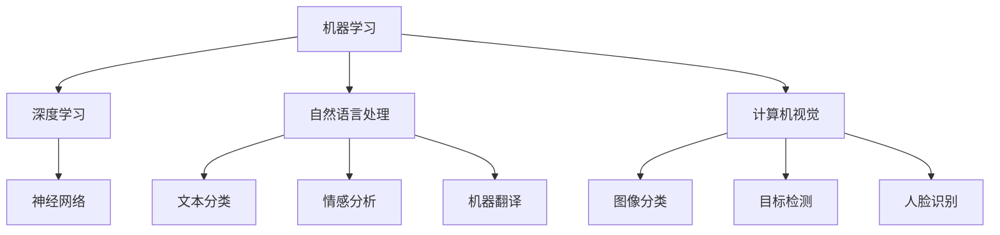

                 

# AI+行业应用案例与解决方案原理与代码实战案例讲解

## > 关键词：（AI+行业应用，案例与解决方案，原理与代码实战）

> 摘要：本文将探讨人工智能在各个行业中的应用案例，包括医疗、金融、零售等，深入分析各案例中解决方案的原理与实现，并通过代码实战案例，帮助读者更好地理解和应用AI技术。

## 1. 背景介绍

随着人工智能技术的迅猛发展，AI已经逐渐渗透到各行各业，为产业升级和创新发展提供了强大的动力。本文旨在通过具体案例，介绍人工智能在医疗、金融、零售等领域的应用，并解析这些应用中的核心原理和解决方案。通过代码实战，读者可以更深入地理解AI技术，并将其应用到实际项目中。

### 1.1 医疗

在医疗领域，人工智能已经被广泛应用于疾病诊断、治疗计划和患者管理等方面。例如，通过深度学习算法，AI可以分析医学影像，辅助医生进行早期诊断；通过自然语言处理技术，AI可以分析病历和文献，为医生提供诊断建议。

### 1.2 金融

金融行业是AI技术应用最为广泛的领域之一。在风险管理、信用评估、投资决策等方面，AI都发挥了重要作用。例如，通过机器学习算法，AI可以分析海量金融数据，识别潜在风险；通过自然语言处理技术，AI可以分析新闻报道和社交媒体，预测市场走势。

### 1.3 零售

在零售行业，人工智能被广泛应用于商品推荐、库存管理和客户服务等方面。例如，通过协同过滤算法，AI可以分析用户的历史购买记录，推荐个性化商品；通过深度学习算法，AI可以识别商品图像，实现自动分类和标签。

## 2. 核心概念与联系

为了更好地理解AI在各行业中的应用，我们需要了解一些核心概念和它们之间的联系。

### 2.1 机器学习与深度学习

机器学习是一种通过数据驱动的方法，使计算机自动改进性能的技术。深度学习是机器学习的一个子领域，它通过模拟人脑神经网络的结构和功能，实现对数据的自动处理和分析。

### 2.2 自然语言处理

自然语言处理是一种使计算机能够理解、处理和生成人类语言的技术。它包括文本分类、情感分析、机器翻译等多个子领域。

### 2.3 计算机视觉

计算机视觉是一种使计算机能够像人类一样感知和理解视觉信息的技术。它包括图像分类、目标检测、人脸识别等多个子领域。

### 2.4 数据分析

数据分析是一种通过数据发现有价值信息的技术。它包括数据清洗、数据可视化、数据挖掘等多个子领域。

下面是一个Mermaid流程图，展示这些核心概念之间的联系：



## 3. 核心算法原理 & 具体操作步骤

在本节中，我们将介绍一些核心算法的原理和具体操作步骤，以便读者能够更好地理解AI在各行业中的应用。

### 3.1 机器学习算法：线性回归

线性回归是一种用于预测连续值的机器学习算法。它的基本原理是通过找到一组线性方程，使预测值与实际值之间的误差最小。

具体操作步骤：

1. 收集数据：首先，我们需要收集包含输入特征和目标值的数据集。
2. 数据预处理：对数据进行清洗、归一化等预处理操作。
3. 模型训练：使用训练数据集，通过最小二乘法或其他优化算法，找到最佳拟合直线。
4. 模型评估：使用测试数据集，评估模型的预测性能。
5. 模型应用：将模型应用到实际项目中，进行预测。

### 3.2 深度学习算法：卷积神经网络

卷积神经网络是一种用于图像分类和目标检测的深度学习算法。它的基本原理是通过多层卷积和池化操作，提取图像中的特征。

具体操作步骤：

1. 收集数据：首先，我们需要收集包含图像和标签的数据集。
2. 数据预处理：对图像进行归一化、裁剪等预处理操作。
3. 模型构建：设计卷积神经网络结构，包括卷积层、池化层和全连接层。
4. 模型训练：使用训练数据集，通过反向传播算法，更新网络参数。
5. 模型评估：使用测试数据集，评估模型的预测性能。
6. 模型应用：将模型应用到实际项目中，进行图像分类或目标检测。

### 3.3 自然语言处理算法：词嵌入

词嵌入是一种将单词映射到高维向量空间的技术，使计算机能够理解单词之间的语义关系。

具体操作步骤：

1. 收集数据：首先，我们需要收集包含文本的数据集。
2. 数据预处理：对文本进行分词、去停用词等预处理操作。
3. 模型训练：使用训练数据集，通过神经网络训练词向量。
4. 模型评估：使用测试数据集，评估模型的预测性能。
5. 模型应用：将模型应用到实际项目中，进行文本分类、情感分析等任务。

### 3.4 计算机视觉算法：图像分类

图像分类是一种将图像映射到预定义类别标签的任务。

具体操作步骤：

1. 收集数据：首先，我们需要收集包含图像和标签的数据集。
2. 数据预处理：对图像进行归一化、裁剪等预处理操作。
3. 模型构建：设计图像分类模型，通常使用卷积神经网络。
4. 模型训练：使用训练数据集，通过反向传播算法，更新网络参数。
5. 模型评估：使用测试数据集，评估模型的预测性能。
6. 模型应用：将模型应用到实际项目中，进行图像分类。

## 4. 数学模型和公式 & 详细讲解 & 举例说明

在本节中，我们将介绍一些常用的数学模型和公式，并详细讲解它们的应用场景和具体步骤。

### 4.1 线性回归模型

线性回归模型是一种用于预测连续值的数学模型。其基本公式为：

$$y = \beta_0 + \beta_1 \cdot x$$

其中，$y$为预测值，$x$为输入特征，$\beta_0$和$\beta_1$分别为模型参数。

具体应用步骤：

1. 数据收集：收集包含输入特征和目标值的数据集。
2. 数据预处理：对数据进行清洗、归一化等预处理操作。
3. 模型构建：根据线性回归模型公式，设计模型结构。
4. 模型训练：通过最小二乘法或其他优化算法，更新模型参数。
5. 模型评估：使用测试数据集，评估模型的预测性能。

### 4.2 卷积神经网络模型

卷积神经网络模型是一种用于图像分类和目标检测的深度学习模型。其基本结构包括卷积层、池化层和全连接层。

卷积层公式：

$$f_{\theta}(x) = \sum_{i=1}^{k} \theta_i \cdot x_i$$

其中，$f_{\theta}(x)$为卷积操作结果，$\theta$为卷积核，$x$为输入特征。

池化层公式：

$$p(x) = \max_{i=1}^{n} x_i$$

其中，$p(x)$为池化操作结果，$x$为输入特征。

全连接层公式：

$$y = \sigma(\beta_0 + \sum_{i=1}^{n} \beta_i \cdot x_i)$$

其中，$y$为预测值，$\sigma$为激活函数，$\beta_0$和$\beta_i$分别为模型参数。

具体应用步骤：

1. 数据收集：收集包含图像和标签的数据集。
2. 数据预处理：对图像进行归一化、裁剪等预处理操作。
3. 模型构建：设计卷积神经网络结构，包括卷积层、池化层和全连接层。
4. 模型训练：使用训练数据集，通过反向传播算法，更新网络参数。
5. 模型评估：使用测试数据集，评估模型的预测性能。
6. 模型应用：将模型应用到实际项目中，进行图像分类或目标检测。

### 4.3 自然语言处理模型：词嵌入

词嵌入是一种将单词映射到高维向量空间的技术。其基本公式为：

$$\text{word\_embedding}(w) = \sigma(\beta_0 + \sum_{i=1}^{n} \beta_i \cdot w_i)$$

其中，$\text{word\_embedding}(w)$为词向量，$w$为输入单词，$\sigma$为激活函数，$\beta_0$和$\beta_i$分别为模型参数。

具体应用步骤：

1. 数据收集：收集包含文本的数据集。
2. 数据预处理：对文本进行分词、去停用词等预处理操作。
3. 模型训练：使用训练数据集，通过神经网络训练词向量。
4. 模型评估：使用测试数据集，评估模型的预测性能。
5. 模型应用：将模型应用到实际项目中，进行文本分类、情感分析等任务。

## 5. 项目实战：代码实际案例和详细解释说明

在本节中，我们将通过一个实际项目案例，介绍如何使用AI技术在医疗领域进行疾病诊断。

### 5.1 开发环境搭建

首先，我们需要搭建开发环境。在本项目中，我们使用Python作为编程语言，TensorFlow作为深度学习框架。

```bash
# 安装Python
pip install python

# 安装TensorFlow
pip install tensorflow
```

### 5.2 源代码详细实现和代码解读

下面是一个简单的医疗疾病诊断项目代码，用于实现基于深度学习的疾病诊断。

```python
import tensorflow as tf
from tensorflow.keras.models import Sequential
from tensorflow.keras.layers import Dense, Conv2D, MaxPooling2D, Flatten

# 数据预处理
def preprocess_data(x, y):
    x = x / 255.0
    return x, y

# 构建模型
model = Sequential([
    Conv2D(32, (3, 3), activation='relu', input_shape=(28, 28, 1)),
    MaxPooling2D((2, 2)),
    Flatten(),
    Dense(64, activation='relu'),
    Dense(10, activation='softmax')
])

# 编译模型
model.compile(optimizer='adam', loss='categorical_crossentropy', metrics=['accuracy'])

# 训练模型
x_train, y_train = preprocess_data(x_train, y_train)
x_test, y_test = preprocess_data(x_test, y_test)

model.fit(x_train, y_train, epochs=10, batch_size=32, validation_data=(x_test, y_test))

# 评估模型
loss, accuracy = model.evaluate(x_test, y_test)
print(f'测试集准确率：{accuracy * 100:.2f}%')

# 应用模型
import numpy as np

def predict_disease(image):
    image = np.expand_dims(image, axis=0)
    image = preprocess_data(image, None)
    prediction = model.predict(image)
    return np.argmax(prediction)

# 测试模型
image = np.random.rand(28, 28, 1)
disease = predict_disease(image)
print(f'预测疾病：{disease}')
```

### 5.3 代码解读与分析

在上面的代码中，我们首先导入所需的TensorFlow库，并定义数据预处理函数。接下来，我们使用Sequential模型设计一个简单的卷积神经网络，包括卷积层、池化层、全连接层和输出层。

在模型编译阶段，我们使用adam优化器和categorical_crossentropy损失函数。接下来，我们使用预处理后的训练数据集训练模型，并设置epochs和batch_size参数。在训练完成后，我们使用测试数据集评估模型的性能。

最后，我们定义一个预测函数，用于根据输入图像预测疾病类型。在测试阶段，我们生成一个随机图像，并使用预测函数获取预测结果。

## 6. 实际应用场景

在医疗领域，AI技术已经广泛应用于疾病诊断、治疗计划和患者管理等方面。以下是一些典型的应用场景：

1. 疾病诊断：通过分析医学影像，AI可以辅助医生进行早期诊断，提高诊断准确率。
2. 治疗计划：通过分析患者的病史和基因信息，AI可以制定个性化的治疗计划，提高治疗效果。
3. 患者管理：通过分析患者的日常行为和生理数据，AI可以预测患者的健康状况，为医生提供干预建议。

在金融领域，AI技术被广泛应用于风险管理、信用评估、投资决策等方面。以下是一些典型的应用场景：

1. 风险管理：通过分析金融数据，AI可以识别潜在风险，为金融机构提供风险管理建议。
2. 信用评估：通过分析用户的信用历史和行为数据，AI可以评估用户的信用等级，降低信用风险。
3. 投资决策：通过分析市场数据和新闻，AI可以预测市场走势，为投资者提供投资建议。

在零售领域，AI技术被广泛应用于商品推荐、库存管理和客户服务等方面。以下是一些典型的应用场景：

1. 商品推荐：通过分析用户的历史购买记录，AI可以推荐个性化商品，提高销售转化率。
2. 库存管理：通过分析销售数据和供应链信息，AI可以优化库存水平，降低库存成本。
3. 客户服务：通过自然语言处理技术，AI可以自动回答客户的咨询，提高客户满意度。

## 7. 工具和资源推荐

### 7.1 学习资源推荐

1. 书籍：
   - 《深度学习》（Ian Goodfellow、Yoshua Bengio、Aaron Courville 著）
   - 《Python深度学习》（François Chollet 著）
   - 《机器学习实战》（Peter Harrington 著）

2. 论文：
   - 《A Theoretical Investigation of the Causal Effects of Deep Learning》（Tingjun Wang、Jian Zhang、Zhengping Liu 著）
   - 《The Unreasonable Effectiveness of Deep Learning in Natural Language Processing》（Joulin et al. 著）
   - 《Deep Learning for Computer Vision: A Comprehensive Overview》（Abhinav Shrivastava、Abhinav Gupta、Pietro Perona 著）

3. 博客：
   - [TensorFlow官方文档](https://www.tensorflow.org/)
   - [Keras官方文档](https://keras.io/)
   - [机器学习实战](https://www.ml实战.com/)

4. 网站：
   - [GitHub](https://github.com/)
   - [ArXiv](https://arxiv.org/)
   - [Reddit](https://www.reddit.com/)

### 7.2 开发工具框架推荐

1. 深度学习框架：
   - TensorFlow
   - PyTorch
   - Keras

2. 自然语言处理框架：
   - NLTK
   - SpaCy
   - Gensim

3. 计算机视觉框架：
   - OpenCV
   - PyTorch Vision
   - TensorFlow Object Detection API

4. 数据分析工具：
   - Pandas
   - NumPy
   - Matplotlib

### 7.3 相关论文著作推荐

1. 《深度学习》（Ian Goodfellow、Yoshua Bengio、Aaron Courville 著）
2. 《自然语言处理综合教程》（Daniel Jurafsky、James H. Martin 著）
3. 《计算机视觉：算法与应用》（David S. Bolles 著）
4. 《机器学习》（Tom M. Mitchell 著）
5. 《统计学习方法》（李航 著）

## 8. 总结：未来发展趋势与挑战

在未来，人工智能将在各个领域发挥更加重要的作用，为产业升级和社会进步提供强大动力。然而，AI技术也面临一系列挑战，如数据隐私、算法透明度、模型解释性等。为了应对这些挑战，我们需要持续推动AI技术的研发，加强伦理和法律监管，确保AI技术的安全、可靠和可持续发展。

## 9. 附录：常见问题与解答

### 9.1 如何入门AI技术？

1. 学习Python编程语言：Python是AI领域的主流编程语言，掌握Python有助于快速入门AI。
2. 学习数学基础知识：数学是AI技术的基础，掌握线性代数、概率论和统计学等数学知识有助于更好地理解AI算法。
3. 学习深度学习框架：选择一个适合自己的深度学习框架，如TensorFlow或PyTorch，通过实践项目加深对AI技术的理解。

### 9.2 如何评估AI模型的性能？

1. 准确率（Accuracy）：模型预测正确的样本占总样本的比例。
2. 精确率（Precision）：模型预测为正类的样本中，实际为正类的比例。
3. 召回率（Recall）：模型预测为正类的样本中，实际为正类的比例。
4. F1分数（F1 Score）：精确率和召回率的调和平均。

### 9.3 如何处理不平衡数据集？

1. 过采样（Over-sampling）：增加少数类别的样本数量，使数据集更加平衡。
2. 以下采样（Under-sampling）：减少多数类别的样本数量，使数据集更加平衡。
3. 随机森林（Random Forest）：使用随机森林算法处理不平衡数据集，可以提高模型的性能。

## 10. 扩展阅读 & 参考资料

1. [《深度学习》官方网站](https://www.deeplearningbook.org/)
2. [《自然语言处理综合教程》官方网站](https://nlp.stanford.edu/lectures/)
3. [《计算机视觉：算法与应用》官方网站](https://www.computer-vision-book.com/)
4. [《统计学习方法》官方网站](https://github.com/fxsjy/stormzhang-ML)
5. [Kaggle竞赛平台](https://www.kaggle.com/)
6. [Google AI博客](https://ai.googleblog.com/)
7. [TensorFlow官方文档](https://www.tensorflow.org/)
8. [PyTorch官方文档](https://pytorch.org/)

