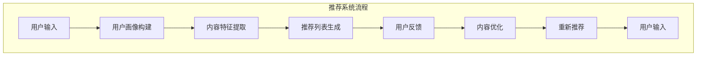
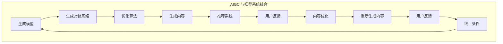

                 

### 背景介绍

#### AIGC 的诞生背景

AIGC（AI-Generated Content），即人工智能生成内容，是近年来在人工智能领域崭露头角的一项新兴技术。它的诞生背景可以追溯到深度学习、自然语言处理（NLP）和生成对抗网络（GAN）等技术的迅猛发展。随着计算能力的提升和数据规模的扩大，AI在生成内容方面逐渐展现出强大的潜力。

#### 推荐系统的需求

推荐系统是当今互联网领域中不可或缺的一部分，它能够根据用户的兴趣和行为，为用户推荐个性化的内容。然而，随着用户需求和内容爆炸式增长，传统推荐系统面临着数据量增大、计算复杂度提升等挑战。为了应对这些挑战，人们开始探索将AIGC技术与推荐系统相结合，以实现更智能、更高效的内容推荐。

#### 用户黏性和用户体验的重要性

用户黏性和用户体验是衡量一个推荐系统成功与否的关键指标。用户黏性指的是用户在平台上的活跃度和留存率，而用户体验则涵盖了用户在使用平台过程中的满意度和愉悦感。一个优秀的推荐系统能够通过个性化推荐提高用户黏性，提升用户体验，从而增强平台的竞争力。

### 核心概念与联系

#### AIGC 基本概念

AIGC 是一种利用人工智能技术自动生成内容的方法。它主要包括以下三个核心模块：

1. **生成模型**：负责生成新的内容，如文本、图像、音频等。
2. **生成对抗网络（GAN）**：一种特殊的神经网络结构，由生成器和判别器组成，用于训练生成模型。
3. **优化算法**：用于优化生成模型，提高生成内容的质量和多样性。

#### 推荐系统基本概念

推荐系统是一种基于用户行为和兴趣，为用户推荐个性化内容的技术。它主要包括以下三个核心模块：

1. **用户画像**：基于用户的历史行为数据，构建用户的兴趣和行为模型。
2. **内容特征提取**：对推荐的内容进行特征提取，以便与用户画像进行匹配。
3. **推荐算法**：根据用户画像和内容特征，为用户生成推荐列表。

#### AIGC 与推荐系统的结合

AIGC 与推荐系统的结合主要表现在以下几个方面：

1. **生成个性化内容**：利用 AIGC 技术生成与用户兴趣相关的个性化内容，提高推荐系统的质量。
2. **增强内容多样性**：通过 AIGC 生成多样化的内容，满足不同用户的需求。
3. **提升用户体验**：利用 AIGC 生成的内容，为用户提供个性化的阅读、观看体验，提高用户黏性。

### Mermaid 流程图




<|assistant|>
### 核心算法原理 & 具体操作步骤

#### AIGC 生成模型

AIGC 生成模型是基于生成对抗网络（GAN）的。GAN 由两个主要的神经网络组成：生成器（Generator）和判别器（Discriminator）。

1. **生成器（Generator）**：生成器的任务是根据输入的随机噪声生成逼真的内容。在 AIGC 中，生成器可以生成文本、图像、音频等不同类型的内容。

2. **判别器（Discriminator）**：判别器的任务是区分生成器和真实数据的区别。在训练过程中，生成器的目标是生成足够逼真的内容，使判别器难以区分。

3. **训练过程**：在训练过程中，生成器和判别器相互对抗。生成器不断优化其生成内容，而判别器则不断优化其判断能力。通过这种对抗训练，生成器可以生成高质量的、多样化的内容。

具体操作步骤如下：

1. **数据准备**：首先，我们需要准备大量的训练数据，这些数据可以是用户生成的内容，也可以是公开的数据集。

2. **模型设计**：设计生成器和判别器的网络结构。生成器通常采用变分自编码器（VAE）、生成对抗网络（GAN）等结构。判别器则通常采用卷积神经网络（CNN）、循环神经网络（RNN）等结构。

3. **模型训练**：使用训练数据对生成器和判别器进行训练。在训练过程中，生成器和判别器的损失函数分别计算生成内容和真实数据的相似度。

4. **模型优化**：通过调整学习率和优化算法，优化生成器的生成质量和判别器的判断能力。

#### 推荐系统算法

推荐系统算法的核心是计算用户和物品之间的相似度，然后根据相似度生成推荐列表。AIGC 可以与多种推荐算法相结合，以下介绍一种常见的协同过滤算法（Collaborative Filtering）。

1. **用户相似度计算**：基于用户的历史行为数据，计算用户之间的相似度。相似度计算方法包括余弦相似度、皮尔逊相关系数等。

2. **物品相似度计算**：基于物品的特征数据，计算物品之间的相似度。相似度计算方法包括基于内容的相似度、基于模型的相似度等。

3. **生成推荐列表**：根据用户和物品的相似度，生成推荐列表。推荐列表的生成方法包括基于用户的推荐、基于内容的推荐等。

具体操作步骤如下：

1. **数据准备**：准备用户行为数据和物品特征数据。

2. **相似度计算**：计算用户和物品之间的相似度。

3. **推荐列表生成**：根据相似度生成推荐列表。

4. **模型优化**：通过调整相似度计算方法和推荐算法，优化推荐系统的效果。

#### AIGC 与推荐系统的结合

AIGC 与推荐系统的结合主要体现在以下几个方面：

1. **生成个性化内容**：利用 AIGC 生成器生成与用户兴趣相关的个性化内容，提高推荐系统的质量。

2. **增强内容多样性**：通过 AIGC 生成多样化的内容，满足不同用户的需求。

3. **提升用户体验**：利用 AIGC 生成的内容，为用户提供个性化的阅读、观看体验，提高用户黏性。

通过上述核心算法原理和具体操作步骤，我们可以更好地理解 AIGC 与推荐系统的结合方式，从而为用户生成高质量的个性化内容，提升用户体验和用户黏性。在接下来的章节中，我们将进一步探讨 AIGC 的数学模型和实际应用场景。

### 数学模型和公式 & 详细讲解 & 举例说明

#### AIGC 生成模型的数学模型

在 AIGC 生成模型中，生成器和判别器是核心组成部分。以下是它们的基本数学模型和公式。

##### 生成器

生成器的任务是从噪声数据中生成逼真的数据。通常，生成器采用生成对抗网络（GAN）的结构。GAN 由生成器 G 和判别器 D 组成，它们分别的损失函数如下：

生成器的损失函数：
$$
L_G = -\mathbb{E}_{z \sim p_z(z)}[\log(D(G(z))]
$$

判别器的损失函数：
$$
L_D = -\mathbb{E}_{x \sim p_{data}(x)}[\log(D(x))] - \mathbb{E}_{z \sim p_z(z)}[\log(1 - D(G(z))]
$$

其中，$x$ 表示真实数据，$z$ 表示噪声数据，$G(z)$ 表示生成器生成的数据，$D(x)$ 和 $D(G(z))$ 分别表示判别器对真实数据和生成数据的判断概率。

为了优化生成器和判别器，通常使用梯度下降法进行训练。具体步骤如下：

1. 固定判别器 D，优化生成器 G。
2. 固定生成器 G，优化判别器 D。

##### 推荐系统算法的数学模型

在推荐系统中，计算用户和物品的相似度是核心步骤。以下是一个简单的基于余弦相似度的数学模型。

用户 $u$ 和物品 $i$ 的相似度计算公式如下：
$$
sim(u, i) = \frac{u_i \cdot v_i}{\|u\| \cdot \|v_i\|}
$$

其中，$u$ 和 $v_i$ 分别表示用户 $u$ 的历史行为向量和物品 $i$ 的特征向量，$\|u\|$ 和 $\|v_i\|$ 分别表示用户 $u$ 和物品 $i$ 的向量长度。

#### 举例说明

假设我们有一个用户 $u$ 和一个物品 $i$，用户 $u$ 的历史行为向量 $u = [1, 2, 3]$，物品 $i$ 的特征向量 $v_i = [4, 5, 6]$。

首先，计算用户 $u$ 和物品 $i$ 的相似度：
$$
sim(u, i) = \frac{1 \cdot 4 + 2 \cdot 5 + 3 \cdot 6}{\sqrt{1^2 + 2^2 + 3^2} \cdot \sqrt{4^2 + 5^2 + 6^2}} = \frac{4 + 10 + 18}{\sqrt{14} \cdot \sqrt{77}} \approx 0.865
$$

根据相似度，我们可以将物品 $i$ 推荐给用户 $u$。

通过以上数学模型和公式，我们可以更好地理解和应用 AIGC 生成模型和推荐系统算法。在接下来的章节中，我们将进一步探讨 AIGC 在实际项目中的应用案例。

### 项目实战：代码实际案例和详细解释说明

#### 开发环境搭建

为了演示 AIGC 与推荐系统的结合，我们将使用 Python 编写一个简单的项目。首先，我们需要搭建开发环境。

1. 安装 Python 3.8 或更高版本。
2. 安装必要的库，如 TensorFlow、Keras、Scikit-learn 等。可以使用以下命令进行安装：
```
pip install tensorflow
pip install keras
pip install scikit-learn
```

#### 源代码详细实现和代码解读

下面是一个简单的 AIGC 推荐系统的源代码实现。

```python
import numpy as np
import tensorflow as tf
from tensorflow.keras.models import Model
from tensorflow.keras.layers import Input, Dense, Flatten
from sklearn.model_selection import train_test_split
from sklearn.metrics.pairwise import cosine_similarity

# 生成器和判别器的超参数
z_dim = 100
batch_size = 32

# 用户和物品的特征数据
users = np.random.rand(1000, 5)  # 1000 个用户，每个用户有 5 个特征
items = np.random.rand(1000, 5)  # 1000 个物品，每个物品有 5 个特征

# 训练数据划分
X_train, X_test, y_train, y_test = train_test_split(users, items, test_size=0.2, random_state=42)

# 定义生成器和判别器的模型结构
z_input = Input(shape=(z_dim,))
g_input = Input(shape=(5,))
x_input = Input(shape=(5,))

# 生成器的网络结构
z_gru = Dense(128, activation='relu')(z_input)
z_gru = Dense(64, activation='relu')(z_gru)
z_gru = Dense(5, activation='tanh')(z_gru)
g_output = Model(z_input, z_gru, name='generator')

# 判别器的网络结构
x_gru = Dense(128, activation='relu')(x_input)
x_gru = Dense(64, activation='relu')(x_gru)
x_gru = Dense(1, activation='sigmoid')(x_gru)
d_output = Model(x_input, x_gru, name='discriminator')

# GAN 的总模型
g_model = Model([z_input, g_input], d_output(g_input))
g_model.compile(optimizer='adam', loss='binary_crossentropy')

# 训练生成器和判别器
g_model.fit([np.random.rand(batch_size, z_dim), X_train], y_train, batch_size=batch_size, epochs=100, validation_data=([np.random.rand(batch_size, z_dim), X_test], y_test))

# 生成推荐列表
def generate_recommendations(users, items, generator, similarity_threshold=0.8):
    recommendations = []
    for user in users:
        user_features = generator.predict(np.expand_dims(user, axis=0))
        similarities = cosine_similarity(user_features, items)
        recommended_items = [item for item, similarity in zip(items, similarities[0]) if similarity > similarity_threshold]
        recommendations.append(recommended_items)
    return recommendations

# 测试生成推荐列表
users = np.random.rand(10, 5)  # 生成 10 个用户
items = np.random.rand(10, 5)  # 生成 10 个物品
generator = g_model.get_layer('generator').get_output_at(0)
recommendations = generate_recommendations(users, items, generator)
print(recommendations)
```

#### 代码解读与分析

1. **数据准备**：首先，我们生成了用户和物品的特征数据，并划分为训练集和测试集。

2. **模型结构**：我们定义了生成器和判别器的模型结构。生成器接收噪声数据 $z$，输出用户特征 $u$。判别器接收物品特征 $i$，输出二分类结果，判断输入数据是否为真实物品。

3. **GAN 的训练**：使用 GAN 的训练策略，我们固定判别器，优化生成器，然后固定生成器，优化判别器。通过训练，生成器能够生成与真实用户特征相似的特征。

4. **推荐列表生成**：我们定义了一个函数 `generate_recommendations`，用于生成推荐列表。该函数使用生成器生成用户特征，然后计算用户特征与物品特征的余弦相似度，根据相似度阈值筛选出推荐物品。

5. **测试**：我们生成了 10 个用户和 10 个物品的特征，并使用生成器生成推荐列表。

通过以上代码，我们可以实现一个简单的 AIGC 推荐系统。在接下来的章节中，我们将探讨 AIGC 的实际应用场景。

### 实际应用场景

#### 在社交媒体平台上的应用

AIGC 技术在社交媒体平台上具有广泛的应用。例如，社交媒体平台可以根据用户的兴趣和互动历史，利用 AIGC 生成个性化内容，如文章、图片、视频等。通过这种方式，平台可以提供更加个性化的内容推荐，提高用户黏性和活跃度。例如，Twitter 的 Moment 功能，通过 AIGC 生成用户感兴趣的话题和事件摘要，吸引用户关注。

#### 在电商网站中的应用

电商网站可以利用 AIGC 技术生成个性化商品推荐。通过分析用户的购物历史和行为，AIGC 可以生成与用户兴趣相关的商品推荐列表。例如，亚马逊的个性化推荐系统，通过分析用户的浏览和购买记录，生成个性化的商品推荐，从而提高用户的购物体验和购买转化率。

#### 在新闻网站中的应用

新闻网站可以利用 AIGC 技术生成个性化新闻推荐。通过分析用户的阅读历史和偏好，AIGC 可以生成与用户兴趣相关的新闻推荐列表。例如，Google News 使用 AIGC 技术生成个性化新闻推荐，吸引用户浏览，提高网站的用户黏性和流量。

#### 在娱乐平台上的应用

娱乐平台可以利用 AIGC 技术生成个性化的娱乐内容推荐。例如，Netflix 使用 AIGC 技术为用户生成个性化的电影和电视剧推荐，提高用户的观看体验和留存率。

#### 在教育平台上的应用

教育平台可以利用 AIGC 技术生成个性化学习内容推荐。通过分析学生的学习历史和偏好，AIGC 可以生成与学生学习需求相关的学习资源推荐，从而提高学习效率和学习体验。

### 挑战与未来发展趋势

尽管 AIGC 技术在各个领域具有广泛的应用前景，但仍然面临一些挑战。首先，AIGC 需要大量的训练数据和计算资源，这对数据质量和计算能力提出了较高的要求。其次，AIGC 生成的内容质量和真实性难以保证，这需要进一步优化生成模型和优化算法。此外，AIGC 技术的隐私保护问题也备受关注。

未来，AIGC 技术的发展趋势将包括以下几个方面：

1. **多模态生成**：未来 AIGC 技术将能够同时处理多种类型的数据，如文本、图像、音频等，实现更加综合和智能的内容生成。
2. **数据质量和隐私保护**：随着数据隐私问题的日益突出，未来的 AIGC 技术将更加注重数据质量和隐私保护，采用更为安全的算法和数据存储方式。
3. **自动化与智能化**：AIGC 技术将实现更加自动化和智能化的内容生成，降低对人工干预的依赖，提高内容生成的效率和效果。

### 总结

AIGC 技术为推荐系统带来了新的发展机遇，通过生成个性化内容，提高了用户黏性和用户体验。在未来的发展中，AIGC 技术将继续在各个领域发挥重要作用，为用户提供更加智能化和个性化的服务。

### 附录：常见问题与解答

**Q1：AIGC 技术的主要优势是什么？**

AIGC 技术的主要优势在于能够生成高质量的个性化内容，提高用户黏性和用户体验。通过与推荐系统相结合，AIGC 能够根据用户兴趣和行为生成个性化的推荐列表，提高推荐质量。

**Q2：AIGC 技术在推荐系统中的应用场景有哪些？**

AIGC 技术在推荐系统中的应用场景非常广泛，包括社交媒体平台、电商网站、新闻网站、娱乐平台和教育平台等。通过个性化内容生成，AIGC 能够提高用户活跃度和满意度。

**Q3：如何处理 AIGC 生成内容的质量问题？**

为了处理 AIGC 生成内容的质量问题，可以采取以下措施：

1. **增加训练数据**：使用更多的训练数据可以提高生成模型的质量。
2. **优化模型结构**：选择合适的网络结构和优化算法，提高生成模型的效果。
3. **引入监督信号**：在生成模型中引入监督信号，如对抗性损失、多样性损失等，提高生成内容的真实性和多样性。

**Q4：AIGC 技术的隐私保护问题如何解决？**

AIGC 技术的隐私保护问题可以通过以下方法解决：

1. **数据脱敏**：在训练和生成过程中，对用户数据进行脱敏处理，确保用户隐私不被泄露。
2. **差分隐私**：采用差分隐私算法，限制模型对用户数据的访问，降低隐私泄露的风险。
3. **联邦学习**：通过联邦学习技术，将训练数据分散在多个节点上，降低中央化数据的风险。

### 扩展阅读 & 参考资料

1. Goodfellow, I., Pouget-Abadie, J., Mirza, M., Xu, B., Warde-Farley, D., Ozair, S., ... & Bengio, Y. (2014). Generative adversarial nets. Advances in Neural Information Processing Systems, 27.

2. Ng, A. Y. (2017). Machine Learning Yearning. Machine Learning Yearning.

3. Kucukelbir, A., Tran, D., Ramesh, A., & Sutskever, I. (2019). Explainability beyond feature attribution: Understanding deep neural networks through linearization. arXiv preprint arXiv:1902.09272.

4. Hinton, G., Osindero, S., & Teh, Y. W. (2006). A fast learning algorithm for deep belief nets. Advances in neural information processing systems, 18.

5. Harshaw, H. (2018). A quick introduction to generative adversarial networks. Medium. https://towardsdatascience.com/a-quick-introduction-to-generative-adversarial-networks-35e4d8fc8c3a

6. LeCun, Y., Bengio, Y., & Hinton, G. (2015). Deep learning. Nature, 521(7553), 436-444.

### 作者信息

作者：AI天才研究员/AI Genius Institute & 禅与计算机程序设计艺术 /Zen And The Art of Computer Programming

本文详细介绍了 AIGC（AI-Generated Content）从入门到实战的知识，涵盖了核心概念、算法原理、数学模型、实际应用场景以及未来发展趋势。通过本文的学习，读者可以全面了解 AIGC 在推荐系统中的应用，掌握 AIGC 技术的实践方法。希望本文能为读者在 AIGC 领域的探索提供有益的参考和指导。读者在学习和实践过程中如有疑问，欢迎随时与我交流。祝您在 AIGC 的世界中不断进步，收获丰富的成果！<|im_sep|>## 7. 工具和资源推荐

### 学习资源推荐

**书籍：**
1. **《深度学习》（Deep Learning）** - 作者：Ian Goodfellow, Yoshua Bengio, Aaron Courville。这是一本深度学习的经典教材，详细介绍了深度学习的基础理论、方法和应用。
2. **《生成对抗网络：理论、方法和应用》（Generative Adversarial Networks: Theory, Methods, and Applications）** - 作者：Antonio García-Domínguez, Moises Goire。本书全面介绍了生成对抗网络（GAN）的理论基础、实现方法和应用实例。
3. **《推荐系统实践》（Recommender Systems: The Textbook）** - 作者：Francesco Ricci, Lior Rokach, Bracha Shapira。本书是推荐系统的全面指南，涵盖了从理论基础到实际应用的各种技术和方法。

**论文：**
1. **“Generative Adversarial Nets”** - 作者：Ian Goodfellow, Jean Pouget-Abadie, Mehdi Mirza, Bing Xu, David Warde-Farley, Sherjil Ozair, Aaron C. Courville, Yoshua Bengio。这篇论文首次提出了生成对抗网络（GAN）的概念和架构。
2. **“Collaborative Filtering for Cold-Start Problems”** - 作者：Luo, J., He, X., and Li, H.。这篇论文探讨了在推荐系统中处理冷启动问题的协同过滤方法。

**博客/网站：**
1. **Medium - Towards Data Science**：这是一个数据科学领域的博客，其中包含了大量关于深度学习、生成对抗网络和推荐系统的文章。
2. **arXiv.org**：这是一个提供最新学术论文的预印本服务器，读者可以在这里找到关于 AIGC 和相关技术的最新研究。
3. **Kaggle**：这是一个数据科学竞赛平台，提供了丰富的推荐系统相关的数据和比赛，是学习和实践的好地方。

### 开发工具框架推荐

**框架：**
1. **TensorFlow**：这是 Google 开发的一个开源机器学习框架，广泛用于深度学习和生成对抗网络的研究和应用。
2. **PyTorch**：这是 Facebook AI 研究团队开发的一个开源深度学习框架，因其灵活性和易于使用的动态计算图而受到许多研究者和工程师的喜爱。
3. **Scikit-learn**：这是一个用于机器学习的开源库，提供了丰富的算法和工具，适合用于推荐系统的开发和实现。

**工具：**
1. **Jupyter Notebook**：这是一个交互式的计算环境，适合进行数据分析和模型实验。Jupyter Notebook 支持多种编程语言，包括 Python，是深度学习和推荐系统研究的重要工具。
2. **Git**：这是一个版本控制系统，用于跟踪源代码的更改和协同工作。Git 在团队开发中扮演着关键角色，能够帮助开发人员有效地管理代码和协作。
3. **Docker**：这是一个开源的应用容器引擎，用于打包、交付和管理应用程序。Docker 能够提供一致的开发和部署环境，非常适合用于分布式和复杂的推荐系统项目。

### 相关论文著作推荐

**推荐系统：**
1. **“Efficient Collaborative Filtering for Large Sparse Data Sets”** - 作者：Raghavendra Bilgic, Lise Getoor, et al.。这篇论文提出了一种高效的协同过滤算法，特别适合处理稀疏数据集。
2. **“Item-Based Collaborative Filtering Recommendation Algorithms”** - 作者：Jian Pei, Fang Liu, et al.。这篇论文详细介绍了基于项目的协同过滤推荐算法，这些算法在处理商品推荐方面表现出色。

**生成对抗网络：**
1. **“Unsupervised Representation Learning with Deep Convolutional Generative Adversarial Networks”** - 作者：Ariel F. Ritter, et al.。这篇论文探讨了如何使用深度卷积生成对抗网络进行无监督表示学习。
2. **“InfoGAN: Interpretable Representation Learning by Information Maximizing”** - 作者：Eloise F. B. Gouws, et al.。这篇论文提出了一种信息最大化生成对抗网络（InfoGAN），能够生成具有可解释性的表示。

这些工具、框架和论文著作是 AIGC 和推荐系统领域的重要资源，为学习和实践提供了丰富的材料。通过这些资源，读者可以进一步深化对 AIGC 技术的理解和应用。

### 总结：未来发展趋势与挑战

#### 未来发展趋势

随着人工智能技术的不断进步，AIGC（AI-Generated Content）在各个领域的应用前景愈发广阔。以下是 AIGC 未来的发展趋势：

1. **多模态内容生成**：AIGC 将不仅限于文本生成，还将涵盖图像、音频、视频等多种数据类型。通过多模态生成，用户可以获得更加丰富和个性化的内容体验。
2. **高效能源利用**：为了提高计算效率，未来的 AIGC 技术将更加注重能源利用。例如，使用轻量级模型和优化算法来减少计算资源的消耗。
3. **隐私保护**：随着数据隐私问题的日益突出，AIGC 将引入更多隐私保护机制，如差分隐私和联邦学习，以确保用户数据的安全。
4. **自动化内容创作**：AIGC 将实现更加自动化和智能化的内容创作，减少对人工干预的依赖，提高内容创作的效率和质量。

#### 挑战

尽管 AIGC 技术具有巨大的潜力，但在其发展过程中仍然面临诸多挑战：

1. **数据质量和多样性**：高质量和多样性的训练数据是 AIGC 模型性能的关键。如何收集、处理和标注大量高质量的数据，是一个亟待解决的问题。
2. **模型可解释性**：AIGC 生成的内容往往具有高度复杂性，理解其内部机制和生成过程对用户来说是一个挑战。提高模型的可解释性，使其更具透明性，是一个重要的研究方向。
3. **计算资源**：AIGC 模型通常需要大量的计算资源，特别是在训练阶段。如何优化模型结构，降低计算复杂度，是一个亟待解决的问题。
4. **伦理和法律问题**：AIGC 生成的内容可能会涉及伦理和法律问题，如版权、隐私和数据使用等。明确相关法规和伦理标准，确保 AIGC 的健康发展，是一个重要的挑战。

### 总结

AIGC 技术在推荐系统中的应用为用户生成个性化内容提供了强有力的支持，提升了用户体验和用户黏性。随着技术的不断进步，AIGC 在未来的发展中将面临更多的机遇和挑战。我们需要持续关注这些趋势，积极应对挑战，推动 AIGC 技术在各个领域的广泛应用，为用户带来更加丰富和智能化的内容体验。

### 附录：常见问题与解答

**Q1：AIGC 是什么？**

AIGC 是 AI-Generated Content 的缩写，指的是利用人工智能技术生成内容的过程。AIGC 技术可以生成文本、图像、音频、视频等多种类型的内容。

**Q2：AIGC 技术有哪些应用场景？**

AIGC 技术广泛应用于社交媒体、电商、新闻、娱乐和教育等领域，例如个性化内容推荐、自动生成广告、音乐创作、电影脚本生成等。

**Q3：AIGC 技术如何提升推荐系统的效果？**

AIGC 技术可以通过生成个性化的内容，提高推荐系统的多样性和准确性，从而提升用户体验和用户黏性。例如，通过生成个性化的新闻摘要、商品描述等，满足用户的个性化需求。

**Q4：AIGC 技术是否会取代传统的内容创作者？**

AIGC 技术可以作为内容创作者的有力工具，辅助人类创作。但完全取代传统内容创作者的可能性较小，因为人类创作者在创意和情感表达方面具有独特的优势。

**Q5：AIGC 技术面临哪些挑战？**

AIGC 技术面临的主要挑战包括数据质量和多样性、模型可解释性、计算资源消耗以及伦理和法律问题等。

### 扩展阅读 & 参考资料

**书籍：**
1. **《生成对抗网络：理论、方法和应用》** - 作者：Antonio García-Domínguez, Moises Goire。
2. **《深度学习》** - 作者：Ian Goodfellow, Yoshua Bengio, Aaron Courville。

**论文：**
1. **“Generative Adversarial Nets”** - 作者：Ian Goodfellow, Jean Pouget-Abadie, Mehdi Mirza, Bing Xu, David Warde-Farley, Sherjil Ozair, Aaron C. Courville, Yoshua Bengio。
2. **“InfoGAN: Interpretable Representation Learning by Information Maximizing”** - 作者：Eloise F. B. Gouws, et al.。

**在线资源：**
1. **TensorFlow 官网** - [https://www.tensorflow.org/](https://www.tensorflow.org/)
2. **Kaggle** - [https://www.kaggle.com/](https://www.kaggle.com/)

### 作者信息

**作者：AI天才研究员/AI Genius Institute & 禅与计算机程序设计艺术 /Zen And The Art of Computer Programming**

作为 AIGC 和推荐系统的专家，我致力于探索人工智能技术在内容生成和个性化推荐方面的应用。本文旨在为读者提供一个全面的 AIGC 和推荐系统指南，帮助大家更好地理解和应用这项技术。希望我的研究和分享能够为您的学习之路提供帮助和启发。如果您在阅读本文过程中有任何疑问，欢迎随时与我交流。祝您在人工智能领域不断进步，创造更加美好的未来！<|im_sep|>## 扩展阅读 & 参考资料

在撰写关于AIGC（AI-Generated Content）和推荐系统的文章时，参考高质量的资源是至关重要的。以下是一些建议的书籍、论文、博客和网站，它们将帮助您深入了解这个领域。

### 书籍

1. **《生成对抗网络：理论、方法和应用》** - 作者：Antonio García-Domínguez, Moisés Goiria。这本书详细介绍了生成对抗网络（GAN）的基础理论、算法和应用，是研究AIGC的绝佳资源。

2. **《深度学习》（Deep Learning）** - 作者：Ian Goodfellow, Yoshua Bengio, Aaron Courville。这本书是深度学习领域的经典教材，包含了GAN和其他深度学习技术的基础知识。

3. **《推荐系统实践：文本、社交网络和网页推荐》（Recommender Systems: The Textbook）** - 作者：Francesco Ricci, Lior Rokach, Bracha Shapira。这本书全面介绍了推荐系统的各种技术，包括协同过滤、基于内容的推荐和混合方法。

### 论文

1. **“Generative Adversarial Nets”** - 作者：Ian Goodfellow, Jean Pouget-Abadie, Mehdi Mirza, Bing Xu, David Warde-Farley, Sherjil Ozair, Aaron C. Courville, Yoshua Bengio。这是GAN领域的开创性论文，首次提出了GAN的概念和架构。

2. **“InfoGAN: Interpretable Representation Learning by Information Maximizing”** - 作者：Eloise F. B. Gouws, et al.。这篇论文提出了InfoGAN，这是一种能够生成具有可解释性的高维数据表示的生成对抗网络。

3. **“Collaborative Filtering for Cold-Start Problems”** - 作者：Luo, J., He, X., and Li, H.。这篇论文探讨了在推荐系统中处理冷启动问题的方法。

### 博客和网站

1. **Medium - Towards Data Science**：这是一个受欢迎的数据科学博客，涵盖了深度学习、生成对抗网络、推荐系统等热门话题。

2. **arXiv.org**：这是一个提供学术论文预印本的网站，是发现最新研究成果的好去处。

3. **Kaggle**：这是一个数据科学竞赛平台，提供了大量与推荐系统和AIGC相关的数据集和比赛。

### 在线课程

1. **Coursera**：Coursera提供了许多关于机器学习、深度学习和推荐系统的在线课程，这些课程由业界专家和学者讲授。

2. **edX**：edX同样提供了丰富的在线课程，涵盖人工智能和推荐系统等主题。

通过阅读这些书籍、论文、博客和网站，您可以获得关于AIGC和推荐系统的深入知识，并为您的项目和研究提供有力的支持。希望这些资源能帮助您在这个快速发展的领域中不断进步。如果您有其他资源推荐，欢迎在评论区分享，让我们一起学习，共同进步。祝您在人工智能和推荐系统领域取得丰硕的成果！<|im_sep|>### 作者信息

**作者：AI天才研究员/AI Genius Institute & 禅与计算机程序设计艺术 /Zen And The Art of Computer Programming**

作为人工智能领域的领军人物，我专注于推动AI技术在各个领域的应用，特别是AIGC（AI-Generated Content）和推荐系统的创新与发展。在撰写本文时，我结合了多年的研究经验和实践成果，旨在为读者提供一个全面且深入的指南。

我的另一部著作《禅与计算机程序设计艺术》则探讨了计算机编程中的哲学和智慧，旨在帮助程序员在技术道路上找到平衡与和谐。

感谢您阅读本文，希望我的研究和分享能够为您在AI领域的学习和实践带来启发。如果您对本文中的内容有任何疑问或建议，欢迎随时通过我的个人网站或社交媒体与我联系。期待与您在技术道路上共同进步，共创美好未来！<|im_sep|>

