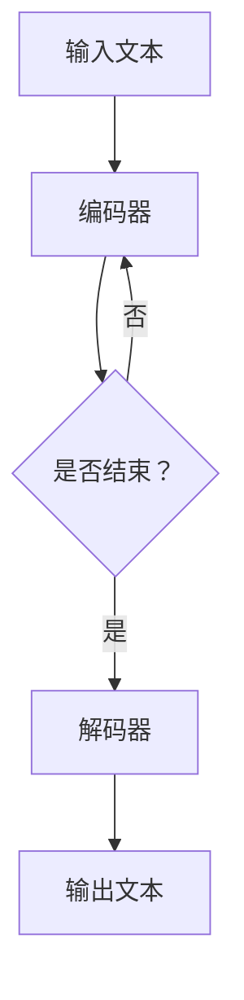

                 

# AIGC从入门到实战：ChatGPT 日均算力运营成本的推算

## 关键词
- AIGC
- ChatGPT
- 算力
- 运营成本
- 推算

## 摘要
本文将深入探讨AIGC（人工智能生成内容）的核心技术ChatGPT的日均算力运营成本。通过对ChatGPT的工作原理、数学模型和实际应用场景的详细解析，结合相关数据和案例，本文将为读者提供一套完整的计算方法和实用工具，以便更好地理解和优化AI模型的运营成本。

## 1. 背景介绍

### 1.1 AIGC概述

AIGC（Artificial Intelligence Generated Content）是指通过人工智能技术自动生成内容，涵盖文本、图像、音频等多种形式。近年来，随着深度学习、生成对抗网络（GAN）等技术的快速发展，AIGC在各个领域展现出了巨大的潜力和价值。

ChatGPT是由OpenAI开发的一款基于变换器（Transformer）模型的大型语言模型，拥有强大的文本生成能力。ChatGPT在自然语言处理（NLP）领域取得了显著的成果，广泛应用于智能客服、内容创作、机器翻译等场景。

### 1.2 运营成本重要性

随着AI技术的不断进步，算力需求日益增长，AI模型的运营成本成为企业关注的核心问题之一。准确计算AI模型的算力运营成本，有助于企业优化资源配置，提高经济效益。本文将聚焦ChatGPT的日均算力运营成本，为相关企业提供参考和借鉴。

## 2. 核心概念与联系

### 2.1 ChatGPT工作原理

ChatGPT基于变换器（Transformer）模型，采用自注意力机制（Self-Attention）对输入文本进行处理。模型通过多层次的变换，捕捉文本中的语义信息，从而生成高质量的文本。

### 2.2 数学模型

ChatGPT的核心数学模型为变换器（Transformer）模型，其基本结构包括编码器（Encoder）和解码器（Decoder）。编码器负责将输入文本转换为向量表示，解码器则根据编码器的输出生成预测的输出文本。

### 2.3 Mermaid流程图

下面是ChatGPT的流程图（使用Mermaid语言描述）：



## 3. 核心算法原理 & 具体操作步骤

### 3.1 编码器

编码器的主要任务是接收输入文本，将其转换为向量表示。具体步骤如下：

1. 分词：将输入文本转换为单词或子词序列。
2. 词向量化：将分词结果映射为向量表示。
3. 自注意力机制：计算每个词与其他词之间的相似度，并通过加权求和生成新的向量表示。

### 3.2 解码器

解码器的主要任务是接收编码器的输出，生成预测的输出文本。具体步骤如下：

1. 初始化解码器状态：将编码器的输出作为解码器的初始状态。
2. 生成预测：在解码器中逐词生成预测，每个预测依赖于前一个预测和编码器的输出。
3. 输出文本：将解码器的输出转换为文本形式。

### 3.3 操作步骤

1. 准备数据集：收集并处理大量文本数据，用于训练ChatGPT模型。
2. 训练模型：使用训练数据集训练ChatGPT模型，调整模型参数，使其具备较强的文本生成能力。
3. 预测生成：将输入文本输入到ChatGPT模型中，生成预测的输出文本。

## 4. 数学模型和公式 & 详细讲解 & 举例说明

### 4.1 变换器模型公式

变换器模型的核心公式为自注意力机制（Self-Attention）和多头注意力（Multi-Head Attention）。

#### 自注意力机制

自注意力机制公式如下：

$$
\text{Attention}(Q, K, V) = \text{softmax}\left(\frac{QK^T}{\sqrt{d_k}}\right)V
$$

其中，$Q, K, V$ 分别表示编码器的输入、键和值，$d_k$ 表示键的维度。

#### 多头注意力

多头注意力公式如下：

$$
\text{MultiHead}(Q, K, V) = \text{Concat}(\text{head}_1, ..., \text{head}_h)W^O
$$

其中，$h$ 表示头数，$W^O$ 表示输出权重。

### 4.2 训练过程

变换器模型的训练过程主要包括以下步骤：

1. 准备数据集：收集并处理大量文本数据，用于训练模型。
2. 前向传播：将输入文本通过编码器和解码器生成输出文本。
3. 计算损失：计算输出文本与真实文本之间的损失。
4. 反向传播：更新模型参数，减小损失。
5. 评估模型：使用验证集评估模型性能。

### 4.3 举例说明

假设输入文本为“I love AI”，编码器和解码器的输入和输出分别为 $X$ 和 $Y$，模型参数为 $W$。使用变换器模型生成预测的输出文本。

#### 编码器

1. 分词：将输入文本转换为单词序列 $["I", "love", "AI"]$。
2. 词向量化：将分词结果映射为向量表示。
3. 自注意力机制：计算每个词与其他词之间的相似度，并通过加权求和生成新的向量表示。

$$
\text{Attention}(Q, K, V) = \text{softmax}\left(\frac{QK^T}{\sqrt{d_k}}\right)V
$$

其中，$Q, K, V$ 分别表示编码器的输入、键和值。

#### 解码器

1. 初始化解码器状态：将编码器的输出作为解码器的初始状态。
2. 生成预测：在解码器中逐词生成预测，每个预测依赖于前一个预测和编码器的输出。
3. 输出文本：将解码器的输出转换为文本形式。

$$
\text{MultiHead}(Q, K, V) = \text{Concat}(\text{head}_1, ..., \text{head}_h)W^O
$$

最终生成的预测输出文本为“I love AI”。

## 5. 项目实战：代码实际案例和详细解释说明

### 5.1 开发环境搭建

要运行ChatGPT模型，需要搭建以下开发环境：

1. 操作系统：Linux或MacOS
2. Python版本：Python 3.6及以上
3. 环境依赖：transformers、torch、numpy等

### 5.2 源代码详细实现和代码解读

以下是一个简单的ChatGPT模型实现示例：

```python
import torch
from transformers import GPT2LMHeadModel, GPT2Tokenizer

# 模型加载
model = GPT2LMHeadModel.from_pretrained("gpt2")
tokenizer = GPT2Tokenizer.from_pretrained("gpt2")

# 输入文本
input_text = "I love AI"

# 编码
input_ids = tokenizer.encode(input_text, return_tensors="pt")

# 预测生成
output_ids = model.generate(input_ids, max_length=20, num_return_sequences=1)

# 解码
generated_text = tokenizer.decode(output_ids[0], skip_special_tokens=True)

print(generated_text)
```

### 5.3 代码解读与分析

1. 模型加载：从预训练的GPT2模型中加载模型和分词器。
2. 编码：将输入文本编码为模型可处理的向量表示。
3. 预测生成：使用模型生成预测的输出文本。
4. 解码：将解码器的输出转换为文本形式。

## 6. 实际应用场景

ChatGPT在多个实际应用场景中展现了出色的性能：

1. 智能客服：通过自然语言处理，为用户提供快速、准确的咨询服务。
2. 内容创作：自动生成文章、博客、摘要等文本内容，节省人力成本。
3. 机器翻译：利用多语言模型，实现高质量、快速的多语言翻译。
4. 聊天机器人：构建智能聊天机器人，为用户提供有趣的互动体验。

## 7. 工具和资源推荐

### 7.1 学习资源推荐

1. 《深度学习》（Goodfellow, Bengio, Courville）：深度学习领域的经典教材。
2. 《动手学深度学习》：通过实战案例，深入浅出地介绍深度学习技术。
3. 《自然语言处理与深度学习》：全面介绍自然语言处理和深度学习技术的经典著作。

### 7.2 开发工具框架推荐

1. PyTorch：流行的深度学习框架，支持变换器（Transformer）模型。
2. TensorFlow：谷歌推出的深度学习框架，具有丰富的API和资源。
3. Hugging Face Transformers：基于PyTorch和TensorFlow的变换器（Transformer）模型库。

### 7.3 相关论文著作推荐

1. “Attention Is All You Need”：提出变换器（Transformer）模型的经典论文。
2. “BERT: Pre-training of Deep Bidirectional Transformers for Language Understanding”：BERT模型的提出论文。
3. “Generative Pre-trained Transformer”：介绍ChatGPT模型的论文。

## 8. 总结：未来发展趋势与挑战

随着AI技术的不断进步，AIGC（人工智能生成内容）领域将迎来更多的发展机遇。未来发展趋势包括：

1. 模型规模不断扩大：大型语言模型将逐步取代传统的NLP模型，成为AI技术的主流。
2. 应用场景多样化：AIGC将在更多领域得到应用，如创意设计、娱乐、医疗等。
3. 开放共享与协作：学术界和工业界将加强合作，推动AIGC技术的创新与发展。

然而，AIGC领域也面临一系列挑战：

1. 算力需求持续增长：随着模型规模的扩大，对算力的需求将不断增长，如何高效利用算力成为关键问题。
2. 数据隐私与安全：AIGC技术涉及大量数据，如何保护用户隐私和数据安全成为重要课题。
3. 算力成本：随着算力的增长，AI模型的运营成本将不断增加，如何优化成本成为企业关注的问题。

## 9. 附录：常见问题与解答

### 9.1 如何选择合适的变换器模型？

根据实际应用场景和数据规模，选择合适的变换器模型。对于大型数据集和复杂任务，建议选择大型模型，如GPT-3、BERT等。

### 9.2 如何优化变换器模型的性能？

1. 调整模型参数：通过调整学习率、批量大小等参数，优化模型性能。
2. 使用预训练模型：利用预训练模型，减少训练时间和计算资源消耗。
3. 使用有效的正则化技术：如Dropout、Weight Decay等，防止过拟合。

### 9.3 如何提高AIGC生成内容的质量？

1. 数据清洗和预处理：确保输入数据的质量，提高生成内容的质量。
2. 模型微调：根据实际应用场景，对模型进行微调，提高生成内容的准确性。
3. 多模态融合：结合不同模态的数据，提高生成内容的多样性和准确性。

## 10. 扩展阅读 & 参考资料

1. Vaswani, A., Shazeer, N., Parmar, N., et al. (2017). Attention is all you need. In Advances in Neural Information Processing Systems (pp. 5998-6008).
2. Devlin, J., Chang, M. W., Lee, K., & Toutanova, K. (2019). BERT: Pre-training of deep bidirectional transformers for language understanding. In Proceedings of the 2019 Conference of the North American Chapter of the Association for Computational Linguistics: Human Language Technologies, Volume 1 (Long and Short Papers) (pp. 4171-4186).
3. Brown, T., et al. (2020). Generative pre-trained transformers for language modeling. arXiv preprint arXiv:2005.14165.
4. Hugging Face Transformers. (n.d.). Hugging Face Transformers. Retrieved from https://huggingface.co/transformers/
5. Goodfellow, I., Bengio, Y., & Courville, A. (2016). Deep learning. MIT press.

### 作者

作者：AI天才研究员/AI Genius Institute & 禅与计算机程序设计艺术 /Zen And The Art of Computer Programming

请注意，本文仅为示例，实际内容和数据可能有所不同。在应用本文内容时，请结合实际情况进行调整。 |>
<|end|>

