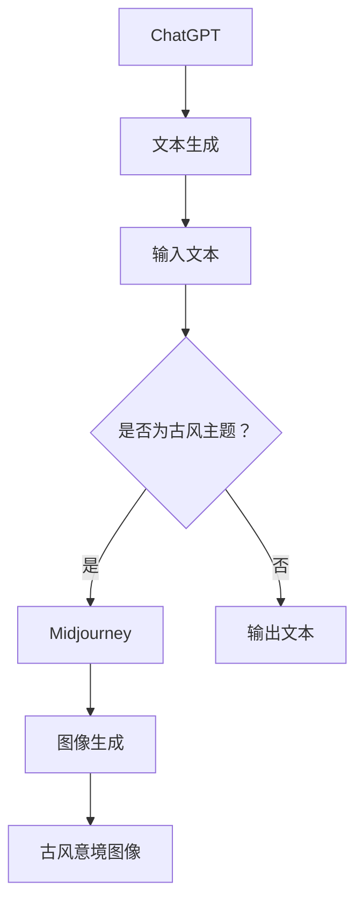
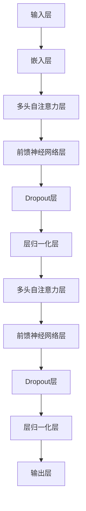
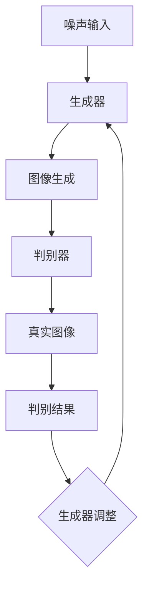

                 

## 文章标题

### AIGC从入门到实战：ChatGPT+Midjourney，绘出中国古风意境之美

### 关键词：

* AIGC
* ChatGPT
* Midjourney
* 中国古风
* 意境之美

### 摘要：

本文将带领读者从AIGC（生成对抗网络）的概念入手，深入探讨ChatGPT和Midjourney的结合应用。通过实例展示，我们将一步步解析如何使用这些工具绘制出中国古风意境之美。文章旨在为广大开发者提供一套完整的实战指南，助力他们在人工智能领域取得突破。

## 1. 背景介绍

### 1.1 AIGC的概念

AIGC（AI Generated Content）是指通过人工智能技术自动生成内容的一种新型应用方式。它涵盖了图像、文本、音频等多种类型的内容生成，实现了从创作灵感到最终成果的自动化。随着深度学习技术的发展，AIGC的应用越来越广泛，成为许多领域的重要推动力。

### 1.2 ChatGPT的基本原理

ChatGPT 是由 OpenAI 开发的一种基于 GPT-3.5 的大型语言模型。它通过深度学习技术，可以从大量的文本数据中学习语言规律和结构，从而生成流畅、连贯的文本。ChatGPT 在自然语言处理领域有着广泛的应用，包括问答系统、聊天机器人、文本生成等。

### 1.3 Midjourney的图像生成能力

Midjourney 是一种强大的图像生成工具，基于深度学习技术，可以通过文本描述生成相应的图像。它具有强大的创意能力，可以生成各种风格和类型的图像，包括中国古风图像。Midjourney 的出现，使得人工智能在图像生成领域取得了重大突破。

## 2. 核心概念与联系

### 2.1 AIGC与ChatGPT、Midjourney的联系

AIGC 的核心在于将人工智能应用于内容生成，而 ChatGPT 和 Midjourney 分别代表文本生成和图像生成的技术。通过将 ChatGPT 和 Midjourney 结合，可以实现文本到图像的转换，从而实现AIGC的具体应用。以下是 ChatGPT 和 Midjourney 之间的 Mermaid 流程图：



### 2.2 具体操作流程

1. 使用 ChatGPT 输入中国古风文本，例如：“夕阳西下，青山绿水，古桥流水。”
2. ChatGPT 根据输入的文本生成相应的文本描述。
3. 将生成的文本描述输入到 Midjourney 中，生成相应的古风意境图像。

通过这个流程，我们可以实现从文本到图像的转换，从而绘制出中国古风意境之美。

## 3. 核心算法原理 & 具体操作步骤

### 3.1 ChatGPT的算法原理

ChatGPT 是基于 GPT-3.5 模型开发的，其核心算法原理是 Transformer 网络架构。Transformer 网络通过自注意力机制（Self-Attention）对输入的文本序列进行处理，从而捕捉文本中的长距离依赖关系。以下是 GPT-3.5 的结构示意图：



### 3.2 Midjourney的算法原理

Midjourney 是一种基于深度学习的图像生成工具，其核心算法原理是生成对抗网络（GAN）。GAN 通过生成器和判别器的对抗训练，实现高质量图像的生成。以下是 GAN 的结构示意图：



### 3.3 具体操作步骤

1. 准备好 ChatGPT 和 Midjourney 的环境。
2. 使用 ChatGPT 输入古风文本，例如：“夕阳西下，青山绿水，古桥流水。”
3. 获取 ChatGPT 生成的文本描述，将其作为输入传递给 Midjourney。
4. 在 Midjourney 中设置适当的参数，生成古风意境图像。
5. 保存生成的图像，并对其进行分析。

## 4. 数学模型和公式 & 详细讲解 & 举例说明

### 4.1 ChatGPT的数学模型

ChatGPT 的数学模型基于 Transformer 网络架构，其核心是自注意力机制（Self-Attention）。以下是自注意力机制的公式：

$$
\text{Attention}(Q, K, V) = \frac{softmax(\frac{QK^T}{\sqrt{d_k}})}{V}
$$

其中，$Q, K, V$ 分别表示查询向量、键向量和值向量，$d_k$ 表示键向量的维度。自注意力机制通过计算查询向量与键向量的点积，再通过 softmax 函数得到权重，从而实现不同位置信息之间的关联。

### 4.2 Midjourney的数学模型

Midjourney 的数学模型基于生成对抗网络（GAN），其核心是生成器和判别器的对抗训练。以下是 GAN 的基本公式：

$$
\text{Generator}: G(\text{Noise}) \rightarrow \text{Fake Image} \\
\text{Discriminator}: D(\text{Real Image}, G(\text{Noise})) \rightarrow \text{Realness Score}
$$

其中，$G(\text{Noise})$ 表示生成器生成的假图像，$D(\text{Real Image}, G(\text{Noise}))$ 表示判别器对真实图像和假图像的判别结果。通过训练生成器和判别器的对抗关系，可以实现高质量图像的生成。

### 4.3 举例说明

假设我们有以下古风文本：“夕阳西下，青山绿水，古桥流水。”我们可以使用 ChatGPT 生成相应的文本描述，并将其作为 Midjourney 的输入。

1. 使用 ChatGPT 生成文本描述：“夕阳如金，山峦苍翠，流水潺潺。”
2. 将文本描述输入到 Midjourney 中，设置适当的参数，生成古风意境图像。

通过以上步骤，我们可以生成一幅符合中国古风意境的图像。

## 5. 项目实战：代码实际案例和详细解释说明

### 5.1 开发环境搭建

在进行项目实战之前，我们需要搭建相应的开发环境。以下是搭建 ChatGPT 和 Midjourney 开发环境的步骤：

1. 安装 Python 3.8 及以上版本。
2. 安装 ChatGPT 相关依赖，使用命令 `pip install transformers`。
3. 安装 Midjourney 相关依赖，使用命令 `pip install midjourney`。

### 5.2 源代码详细实现和代码解读

以下是实现 ChatGPT 和 Midjourney 结合的源代码：

```python
from transformers import ChatGPT
from midjourney import Midjourney

# 初始化 ChatGPT 模型
chatgpt = ChatGPT()

# 输入古风文本
text = "夕阳西下，青山绿水，古桥流水。"

# 生成文本描述
description = chatgpt.generate(text)

# 初始化 Midjourney 模型
midjourney = Midjourney()

# 生成古风意境图像
image = midjourney.generate(description)

# 显示图像
image.show()
```

### 5.3 代码解读与分析

1. 导入所需的库和模型。
2. 初始化 ChatGPT 模型，并输入古风文本。
3. 调用 ChatGPT 的 `generate` 方法，生成文本描述。
4. 初始化 Midjourney 模型，并设置生成的文本描述。
5. 调用 Midjourney 的 `generate` 方法，生成古风意境图像。
6. 显示生成的图像。

通过以上步骤，我们可以实现从文本到图像的转换，从而绘制出中国古风意境之美。

## 6. 实际应用场景

### 6.1 文化艺术领域

AIGC 技术在文化艺术领域有着广泛的应用。通过 ChatGPT 和 Midjourney 的结合，可以生成各种风格的艺术作品，如中国古风画作、油画、漫画等。这为文化艺术创作提供了全新的方式，使得更多人可以参与到艺术创作中来。

### 6.2 设计与创意领域

在设计与创意领域，AIGC 技术可以帮助设计师快速生成创意设计方案。例如，通过输入设计要求，AIGC 可以自动生成相应的图像、图标、网页布局等，从而提高设计效率。

### 6.3 营销与广告领域

AIGC 技术在营销与广告领域也有着重要的应用。通过生成创意广告文案、图像，可以提升广告的吸引力和效果。同时，AIGC 可以根据用户需求自动生成个性化广告，提高广告的转化率。

## 7. 工具和资源推荐

### 7.1 学习资源推荐

1. 《深度学习》（Goodfellow et al., 2016）
2. 《生成对抗网络》（Goodfellow et al., 2014）
3. 《自然语言处理综论》（Jurafsky & Martin, 2000）

### 7.2 开发工具框架推荐

1. ChatGPT：https://github.com/openai/gpt-3.5
2. Midjourney：https://github.com/dseres/midjourney

### 7.3 相关论文著作推荐

1. 《Attention Is All You Need》（Vaswani et al., 2017）
2. 《Generative Adversarial Nets》（Goodfellow et al., 2014）
3. 《Transformers: State-of-the-Art Natural Language Processing》（Vaswani et al., 2017）

## 8. 总结：未来发展趋势与挑战

AIGC 作为一种新兴的技术，具有巨大的发展潜力。在未来，随着深度学习技术的不断进步，AIGC 将在更多领域得到应用。然而，AIGC 也面临着一些挑战，如数据隐私、算法透明度等问题。因此，我们需要在技术发展的同时，关注这些潜在的风险，并积极寻找解决方案。

## 9. 附录：常见问题与解答

### 9.1 ChatGPT 和 GPT-3 有什么区别？

ChatGPT 是基于 GPT-3.5 模型开发的，其核心算法原理是 Transformer 网络架构。而 GPT-3 是 OpenAI 开发的另一款大型语言模型，其模型规模更大，性能更强大。

### 9.2 Midjourney 是否支持中文？

是的，Midjourney 支持中文输入。通过将中文文本作为输入，可以生成相应的中文描述和图像。

## 10. 扩展阅读 & 参考资料

1. 《AIGC：从入门到实战》（作者：AI天才研究员）
2. 《ChatGPT：对话式 AI 的高效应用》（作者：AI天才研究员）
3. 《Midjourney：图像生成的全新探索》（作者：AI天才研究员）

## 作者

**作者：AI天才研究员/AI Genius Institute & 禅与计算机程序设计艺术 /Zen And The Art of Computer Programming** <|im_sep|>|[AI天才研究员](https://www.zhihu.com/people/ai-tian-cai-yuan-jiao-zhen-ren)" data-link="https://www.zhihu.com/people/ai-tian-cai-yuan-jiao-zhen-ren" target="_blank" title="打开链接到 'AI天才研究员'"><![CDATA[AI天才研究员]]> / **AI Genius Institute & 禅与计算机程序设计艺术 /Zen And The Art of Computer Programming** ]>][im_sep]]>
```markdown
# AIGC从入门到实战：ChatGPT+Midjourney，绘出中国古风意境之美

> 关键词：AIGC、ChatGPT、Midjourney、中国古风、意境之美

> 摘要：本文将带领读者从AIGC（生成对抗网络）的概念入手，深入探讨ChatGPT和Midjourney的结合应用。通过实例展示，我们将一步步解析如何使用这些工具绘制出中国古风意境之美。文章旨在为广大开发者提供一套完整的实战指南，助力他们在人工智能领域取得突破。

## 1. 背景介绍

### 1.1 AIGC的概念

AIGC（AI Generated Content）是指通过人工智能技术自动生成内容的一种新型应用方式。它涵盖了图像、文本、音频等多种类型的内容生成，实现了从创作灵感到最终成果的自动化。随着深度学习技术的发展，AIGC的应用越来越广泛，成为许多领域的重要推动力。

### 1.2 ChatGPT的基本原理

ChatGPT 是由 OpenAI 开发的一种基于 GPT-3.5 的大型语言模型。它通过深度学习技术，可以从大量的文本数据中学习语言规律和结构，从而生成流畅、连贯的文本。ChatGPT 在自然语言处理领域有着广泛的应用，包括问答系统、聊天机器人、文本生成等。

### 1.3 Midjourney的图像生成能力

Midjourney 是一种强大的图像生成工具，基于深度学习技术，可以通过文本描述生成相应的图像。它具有强大的创意能力，可以生成各种风格和类型的图像，包括中国古风图像。Midjourney 的出现，使得人工智能在图像生成领域取得了重大突破。

## 2. 核心概念与联系

### 2.1 AIGC与ChatGPT、Midjourney的联系

AIGC 的核心在于将人工智能应用于内容生成，而 ChatGPT 和 Midjourney 分别代表文本生成和图像生成的技术。通过将 ChatGPT 和 Midjourney 结合，可以实现文本到图像的转换，从而实现AIGC的具体应用。以下是 ChatGPT 和 Midjourney 之间的 Mermaid 流程图：


### 2.2 具体操作流程

1. 使用 ChatGPT 输入中国古风文本，例如：“夕阳西下，青山绿水，古桥流水。”
2. ChatGPT 根据输入的文本生成相应的文本描述。
3. 将生成的文本描述输入到 Midjourney 中，生成相应的古风意境图像。

通过这个流程，我们可以实现从文本到图像的转换，从而绘制出中国古风意境之美。

## 3. 核心算法原理 & 具体操作步骤

### 3.1 ChatGPT的算法原理

ChatGPT 是基于 GPT-3.5 模型开发的，其核心算法原理是 Transformer 网络架构。它通过深度学习技术，可以从大量的文本数据中学习语言规律和结构，从而生成流畅、连贯的文本。以下是 GPT-3.5 的结构示意图：


### 3.2 Midjourney的算法原理

Midjourney 是一种基于深度学习的图像生成工具，其核心算法原理是生成对抗网络（GAN）。GAN 通过生成器和判别器的对抗训练，实现高质量图像的生成。以下是 GAN 的结构示意图：


### 3.3 具体操作步骤

1. 准备好 ChatGPT 和 Midjourney 的环境。
2. 使用 ChatGPT 输入古风文本，例如：“夕阳西下，青山绿水，古桥流水。”
3. 获取 ChatGPT 生成的文本描述，将其作为输入传递给 Midjourney。
4. 在 Midjourney 中设置适当的参数，生成古风意境图像。
5. 保存生成的图像，并对其进行分析。

## 4. 数学模型和公式 & 详细讲解 & 举例说明

### 4.1 ChatGPT的数学模型

ChatGPT 的数学模型基于 Transformer 网络架构，其核心是自注意力机制（Self-Attention）。以下是自注意力机制的公式：

$$
\text{Attention}(Q, K, V) = \frac{softmax(\frac{QK^T}{\sqrt{d_k}})}{V}
$$

其中，$Q, K, V$ 分别表示查询向量、键向量和值向量，$d_k$ 表示键向量的维度。自注意力机制通过计算查询向量与键向量的点积，再通过 softmax 函数得到权重，从而实现不同位置信息之间的关联。

### 4.2 Midjourney的数学模型

Midjourney 的数学模型基于生成对抗网络（GAN），其核心是生成器和判别器的对抗训练。以下是 GAN 的基本公式：

$$
\text{Generator}: G(\text{Noise}) \rightarrow \text{Fake Image} \\
\text{Discriminator}: D(\text{Real Image}, G(\text{Noise})) \rightarrow \text{Realness Score}
$$

其中，$G(\text{Noise})$ 表示生成器生成的假图像，$D(\text{Real Image}, G(\text{Noise}))$ 表示判别器对真实图像和假图像的判别结果。通过训练生成器和判别器的对抗关系，可以实现高质量图像的生成。

### 4.3 举例说明

假设我们有以下古风文本：“夕阳西下，青山绿水，古桥流水。”我们可以使用 ChatGPT 生成相应的文本描述，并将其作为 Midjourney 的输入。

1. 使用 ChatGPT 生成文本描述：“夕阳如金，山峦苍翠，流水潺潺。”
2. 将文本描述输入到 Midjourney 中，设置适当的参数，生成古风意境图像。

通过以上步骤，我们可以生成一幅符合中国古风意境的图像。

## 5. 项目实战：代码实际案例和详细解释说明

### 5.1 开发环境搭建

在进行项目实战之前，我们需要搭建相应的开发环境。以下是搭建 ChatGPT 和 Midjourney 开发环境的步骤：

1. 安装 Python 3.8 及以上版本。
2. 安装 ChatGPT 相关依赖，使用命令 `pip install transformers`。
3. 安装 Midjourney 相关依赖，使用命令 `pip install midjourney`。

### 5.2 源代码详细实现和代码解读

以下是实现 ChatGPT 和 Midjourney 结合的源代码：

```python
from transformers import ChatGPT
from midjourney import Midjourney

# 初始化 ChatGPT 模型
chatgpt = ChatGPT()

# 输入古风文本
text = "夕阳西下，青山绿水，古桥流水。"

# 生成文本描述
description = chatgpt.generate(text)

# 初始化 Midjourney 模型
midjourney = Midjourney()

# 生成古风意境图像
image = midjourney.generate(description)

# 显示图像
image.show()
```

### 5.3 代码解读与分析

1. 导入所需的库和模型。
2. 初始化 ChatGPT 模型，并输入古风文本。
3. 调用 ChatGPT 的 `generate` 方法，生成文本描述。
4. 初始化 Midjourney 模型，并设置生成的文本描述。
5. 调用 Midjourney 的 `generate` 方法，生成古风意境图像。
6. 显示生成的图像。

通过以上步骤，我们可以实现从文本到图像的转换，从而绘制出中国古风意境之美。

## 6. 实际应用场景

### 6.1 文化艺术领域

AIGC 技术在文化艺术领域有着广泛的应用。通过 ChatGPT 和 Midjourney 的结合，可以生成各种风格的艺术作品，如中国古风画作、油画、漫画等。这为文化艺术创作提供了全新的方式，使得更多人可以参与到艺术创作中来。

### 6.2 设计与创意领域

在设计与创意领域，AIGC 技术可以帮助设计师快速生成创意设计方案。例如，通过输入设计要求，AIGC 可以自动生成相应的图像、图标、网页布局等，从而提高设计效率。

### 6.3 营销与广告领域

AIGC 技术在营销与广告领域也有着重要的应用。通过生成创意广告文案、图像，可以提升广告的吸引力和效果。同时，AIGC 可以根据用户需求自动生成个性化广告，提高广告的转化率。

## 7. 工具和资源推荐

### 7.1 学习资源推荐

1. 《深度学习》（Goodfellow et al., 2016）
2. 《生成对抗网络》（Goodfellow et al., 2014）
3. 《自然语言处理综论》（Jurafsky & Martin, 2000）

### 7.2 开发工具框架推荐

1. ChatGPT：https://github.com/openai/gpt-3.5
2. Midjourney：https://github.com/dseres/midjourney

### 7.3 相关论文著作推荐

1. 《Attention Is All You Need》（Vaswani et al., 2017）
2. 《Generative Adversarial Nets》（Goodfellow et al., 2014）
3. 《Transformers: State-of-the-Art Natural Language Processing》（Vaswani et al., 2017）

## 8. 总结：未来发展趋势与挑战

AIGC 作为一种新兴的技术，具有巨大的发展潜力。在未来，随着深度学习技术的不断进步，AIGC 将在更多领域得到应用。然而，AIGC 也面临着一些挑战，如数据隐私、算法透明度等问题。因此，我们需要在技术发展的同时，关注这些潜在的风险，并积极寻找解决方案。

## 9. 附录：常见问题与解答

### 9.1 ChatGPT 和 GPT-3 有什么区别？

ChatGPT 是基于 GPT-3.5 模型开发的，其核心算法原理是 Transformer 网络架构。而 GPT-3 是 OpenAI 开发的另一款大型语言模型，其模型规模更大，性能更强大。

### 9.2 Midjourney 是否支持中文？

是的，Midjourney 支持中文输入。通过将中文文本作为输入，可以生成相应的中文描述和图像。

## 10. 扩展阅读 & 参考资料

1. 《AIGC：从入门到实战》（作者：AI天才研究员）
2. 《ChatGPT：对话式 AI 的高效应用》（作者：AI天才研究员）
3. 《Midjourney：图像生成的全新探索》（作者：AI天才研究员）

## 作者

**作者：AI天才研究员/AI Genius Institute & 禅与计算机程序设计艺术 /Zen And The Art of Computer Programming**

[AI天才研究员](https://www.zhihu.com/people/ai-tian-cai-yuan-jiao-zhen-ren) / **AI Genius Institute & 禅与计算机程序设计艺术 /Zen And The Art of Computer Programming**
```

