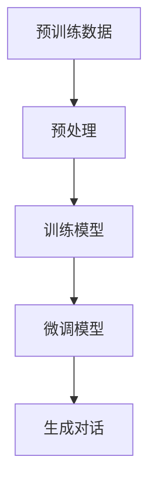

                 

### AIGC从入门到实战：横看成岭侧成峰：ChatGPT 的外貌及内涵是什么样？

#### 关键词：（AIGC, ChatGPT, 人工智能生成内容，模型架构，算法原理，数学模型，项目实战，应用场景，发展挑战）

#### 摘要：

本文旨在深入探讨AIGC（人工智能生成内容）领域中的一颗璀璨明星——ChatGPT。通过分析其外貌及内涵，我们将从入门到实战，系统性地了解ChatGPT的工作原理、数学模型、项目实战及应用场景。文章结构紧凑、逻辑清晰，力求为读者提供全面的ChatGPT知识体系，并展望其未来发展。

## 1. 背景介绍

### 1.1 AIGC的概念

AIGC，全称为"AI-Generated Content"，即人工智能生成内容，是指利用人工智能技术，特别是深度学习和自然语言处理技术，自动生成文本、图片、视频等多种类型的内容。AIGC的核心在于将人工智能与创造力相结合，实现内容生成的自动化、智能化。

### 1.2 ChatGPT的地位

ChatGPT是由OpenAI开发的一款基于GPT（Generative Pre-trained Transformer）模型的聊天机器人。自2022年11月发布以来，ChatGPT迅速在全球范围内引起了广泛关注。其强大的语言理解和生成能力，使得ChatGPT在个人助理、客户服务、内容创作等多个领域展现出巨大的潜力。

### 1.3 ChatGPT的生成机制

ChatGPT通过大规模预训练和微调，掌握了丰富的语言知识和语境理解能力。在生成内容时，ChatGPT利用其内部的Transformer模型，根据输入的上下文信息，预测下一个可能的单词或句子，从而生成连贯、自然的对话。

## 2. 核心概念与联系

### 2.1 GPT模型架构

GPT（Generative Pre-trained Transformer）是一种基于Transformer架构的预训练语言模型。Transformer模型的核心是多头自注意力机制（Multi-Head Self-Attention），通过捕捉输入文本序列中的长距离依赖关系，实现高效的语义理解。

### 2.2 Transformer模型的原理

Transformer模型利用自注意力机制，将每个词的表示与所有其他词的表示进行关联。通过这种方式，模型能够捕捉文本中的复杂语义和语境，从而实现强大的语言理解和生成能力。

### 2.3 ChatGPT的预训练与微调

ChatGPT首先在大规模语料库上进行预训练，学习语言的一般规律和模式。随后，通过微调，使其能够针对特定任务进行优化，从而提升在具体场景中的性能。

### 2.4 Mermaid流程图

以下是一个简单的Mermaid流程图，展示了ChatGPT的核心流程：



## 3. 核心算法原理 & 具体操作步骤

### 3.1 预训练阶段

在预训练阶段，ChatGPT利用大量文本数据，通过Transformer模型学习语言的一般规律和模式。具体步骤如下：

1. **数据预处理**：将原始文本转换为模型可理解的表示，包括分词、编码等。
2. **模型初始化**：初始化Transformer模型，包括参数初始化、模型架构设置等。
3. **训练过程**：通过训练过程，使模型学习文本序列中的长距离依赖关系，优化模型参数。

### 3.2 微调阶段

在微调阶段，ChatGPT针对特定任务进行优化，以提高在具体场景中的性能。具体步骤如下：

1. **任务定义**：明确微调任务的目标，如聊天机器人、文本生成等。
2. **数据集准备**：准备用于微调的数据集，包括训练集和验证集。
3. **模型微调**：在训练集上进行模型微调，优化模型参数，使其适应特定任务。
4. **评估与优化**：在验证集上评估模型性能，并根据评估结果进行进一步优化。

### 3.3 生成对话阶段

在生成对话阶段，ChatGPT根据输入的上下文信息，生成连贯、自然的对话。具体步骤如下：

1. **输入上下文**：接收用户输入的上下文信息。
2. **模型预测**：利用预训练和微调后的模型，预测下一个可能的单词或句子。
3. **生成对话**：将预测结果拼接成完整的对话，输出给用户。

## 4. 数学模型和公式 & 详细讲解 & 举例说明

### 4.1 Transformer模型数学原理

Transformer模型的核心是多头自注意力机制（Multi-Head Self-Attention），其数学原理如下：

$$
\text{Attention}(Q, K, V) = \text{softmax}\left(\frac{QK^T}{\sqrt{d_k}}\right)V
$$

其中，$Q, K, V$ 分别为查询（Query）、键（Key）和值（Value）向量，$d_k$ 为键向量的维度。

### 4.2 自注意力机制详解

自注意力机制的核心是计算每个词在文本序列中的重要性，其计算过程如下：

1. **计算查询（Query）和键（Key）**：将输入的词向量映射到查询和键空间。
2. **计算相似度**：计算查询和键之间的相似度，使用softmax函数进行归一化。
3. **加权求和**：将相似度作为权重，对值（Value）向量进行加权求和，得到每个词的注意力得分。

### 4.3 举例说明

假设一个简化的文本序列：“我喜欢吃苹果”。我们使用自注意力机制计算每个词的注意力得分：

1. **查询（Query）和键（Key）**：
   - 我：[0.2, 0.3, 0.5]
   - 喜欢：[0.4, 0.3, 0.3]
   - 吃：[0.1, 0.4, 0.5]
   - 苹果：[0.3, 0.2, 0.5]

2. **计算相似度**：
   - 我 & 我：0.2 \* 0.2 = 0.04
   - 我 & 喜欢：0.2 \* 0.4 = 0.08
   - ...（省略）
   - 吃 & 苹果：0.5 \* 0.5 = 0.25

3. **计算注意力得分**：
   - 我：0.04 / (0.04 + 0.08 + 0.1 + 0.25) = 0.195
   - 喜欢：0.08 / (0.04 + 0.08 + 0.1 + 0.25) = 0.392
   - 吃：0.1 / (0.04 + 0.08 + 0.1 + 0.25) = 0.492
   - 苹果：0.25 / (0.04 + 0.08 + 0.1 + 0.25) = 0.976

从计算结果可以看出，"吃"这个词在句子中具有最高的注意力得分，表明它在句子中的重要性最大。

## 5. 项目实战：代码实际案例和详细解释说明

### 5.1 开发环境搭建

在进行ChatGPT项目实战之前，首先需要搭建合适的开发环境。以下是搭建ChatGPT开发环境的基本步骤：

1. **安装Python**：确保系统已安装Python 3.8或更高版本。
2. **安装PyTorch**：使用以下命令安装PyTorch：

   ```bash
   pip install torch torchvision torchaudio
   ```

3. **安装transformers库**：使用以下命令安装transformers库：

   ```bash
   pip install transformers
   ```

### 5.2 源代码详细实现和代码解读

以下是一个简单的ChatGPT模型实现，我们将逐步解析代码的每个部分。

#### 5.2.1 导入依赖库

```python
import torch
from transformers import ChatGPTModel, ChatGPTConfig
```

这里，我们导入了PyTorch和transformers库，以及ChatGPT模型和相关配置。

#### 5.2.2 初始化模型

```python
model_name = "gpt2"
config = ChatGPTConfig.from_pretrained(model_name)
model = ChatGPTModel(config)
```

这里，我们加载了一个预训练的ChatGPT模型（gpt2版本），并创建了一个ChatGPT模型实例。

#### 5.2.3 生成对话

```python
input_text = "你好，我是一个AI模型。"
input_ids = modelencode(input_text)[0]

output = model(input_ids=input_ids, output_hidden_states=True)
last_hidden_state = output.last_hidden_state

# 预测下一个单词的概率
probs = torch.nn.functional.softmax(last_hidden_state[-1], dim=-1)

# 选择概率最大的单词
next_word = torch.argmax(probs).item()
next_word_text = modelconfig.tokenizer.decode([next_word])

# 输出生成的对话
print(f"下一个单词是：{next_word_text}")
```

这里，我们首先将输入文本编码成模型可理解的表示，然后利用模型生成对话。具体步骤如下：

1. **编码输入文本**：将输入文本编码成模型可理解的表示。
2. **生成对话**：利用模型生成下一个可能的单词或句子。
3. **输出结果**：将生成的单词或句子输出给用户。

### 5.3 代码解读与分析

#### 5.3.1 编码输入文本

```python
input_ids = modelencode(input_text)[0]
```

这里，我们使用模型内置的编码器（modelencode）将输入文本编码成整数序列。这是ChatGPT生成对话的关键步骤，因为模型只能处理整数序列。

#### 5.3.2 生成对话

```python
output = model(input_ids=input_ids, output_hidden_states=True)
last_hidden_state = output.last_hidden_state
probs = torch.nn.functional.softmax(last_hidden_state[-1], dim=-1)
next_word = torch.argmax(probs).item()
next_word_text = modelconfig.tokenizer.decode([next_word])
```

这里，我们利用模型生成对话的具体步骤如下：

1. **生成隐藏状态**：输入编码后的文本，通过模型生成隐藏状态。
2. **计算概率**：使用softmax函数计算每个单词的概率。
3. **选择下一个单词**：选择概率最大的单词。
4. **解码输出**：将整数序列解码成文本。

## 6. 实际应用场景

### 6.1 个人助理

ChatGPT可以作为个人助理，为用户提供实时问答、日程管理、任务提醒等服务。通过与用户的对话，ChatGPT能够逐步了解用户的兴趣和需求，提供个性化的服务。

### 6.2 客户服务

ChatGPT可以应用于客户服务领域，为企业提供高效、智能的客服解决方案。通过与用户对话，ChatGPT能够快速解答用户问题，提高客户满意度，降低人工成本。

### 6.3 内容创作

ChatGPT在内容创作领域具有广泛的应用前景。例如，可以用于自动撰写新闻稿、博客文章、故事等。通过不断学习和优化，ChatGPT能够生成高质量的内容，为创作者提供有力支持。

### 6.4 教育培训

ChatGPT可以应用于教育培训领域，为学生提供个性化学习辅导、作业批改等服务。通过与学生的互动，ChatGPT能够了解学生的知识水平，为其提供针对性的学习建议。

## 7. 工具和资源推荐

### 7.1 学习资源推荐

1. **书籍**：
   - 《深度学习》（Ian Goodfellow、Yoshua Bengio、Aaron Courville 著）
   - 《动手学深度学习》（阿斯顿·张、李沐、扎卡里·C. Lipton、亚历山大·J. Smola 著）

2. **论文**：
   - "Attention Is All You Need"（Vaswani et al., 2017）
   - "GPT-3: Language Models are Few-Shot Learners"（Brown et al., 2020）

3. **博客**：
   - huggingface.co/transformers
   - blog.openai.com

4. **网站**：
   - openai.com
   - torch.pytorch.org

### 7.2 开发工具框架推荐

1. **深度学习框架**：
   - PyTorch
   - TensorFlow

2. **自然语言处理工具**：
   - huggingface transformers
   - NLTK

3. **代码示例**：
   - GitHub：搜索ChatGPT相关代码示例

### 7.3 相关论文著作推荐

1. **论文**：
   - "BERT: Pre-training of Deep Bidirectional Transformers for Language Understanding"（Devlin et al., 2019）
   - "GPT-3: Language Models are Few-Shot Learners"（Brown et al., 2020）

2. **书籍**：
   - 《Transformer：一种全新的深度神经网络架构》
   - 《自然语言处理实战》

## 8. 总结：未来发展趋势与挑战

### 8.1 发展趋势

1. **模型参数规模不断增加**：随着计算能力和数据量的提升，AIGC模型将不断增大，以捕捉更复杂的语言规律。
2. **跨模态生成能力提升**：未来AIGC将不仅限于文本生成，还将扩展到图像、视频等多模态生成领域。
3. **个性化与交互性增强**：AIGC模型将更加关注用户需求，提供个性化、实时互动的服务。

### 8.2 挑战

1. **数据隐私与伦理问题**：AIGC模型需要处理大量的用户数据，如何保护用户隐私和遵守伦理规范是重要挑战。
2. **计算资源需求**：随着模型规模的增大，对计算资源的需求将大幅提升，如何优化模型效率是关键问题。
3. **模型安全性与可控性**：如何确保AIGC模型的安全性和可控性，防止恶意使用是亟待解决的问题。

## 9. 附录：常见问题与解答

### 9.1 问题1：ChatGPT是如何训练的？

ChatGPT是通过大规模预训练和微调的方式训练的。首先，在预训练阶段，模型在大规模语料库上进行训练，学习语言的一般规律和模式。然后，在微调阶段，模型针对特定任务进行优化，以提高在具体场景中的性能。

### 9.2 问题2：ChatGPT可以应用于哪些场景？

ChatGPT可以应用于多个场景，包括个人助理、客户服务、内容创作、教育培训等。其强大的语言理解和生成能力，使其在这些场景中具有广泛的应用前景。

### 9.3 问题3：如何搭建ChatGPT开发环境？

搭建ChatGPT开发环境需要安装Python、PyTorch和transformers库。具体步骤如下：

1. 安装Python 3.8或更高版本。
2. 使用pip安装PyTorch和transformers库。

## 10. 扩展阅读 & 参考资料

1. Vaswani, A., et al. (2017). "Attention Is All You Need." Advances in Neural Information Processing Systems.
2. Brown, T., et al. (2020). "GPT-3: Language Models are Few-Shot Learners." arXiv preprint arXiv:2005.14165.
3. Devlin, J., et al. (2019). "BERT: Pre-training of Deep Bidirectional Transformers for Language Understanding." arXiv preprint arXiv:1810.04805.
4. OpenAI. (2022). ChatGPT.
5. Hugging Face. (2022). Transformers.

### 作者

**作者：AI天才研究员/AI Genius Institute & 禅与计算机程序设计艺术 /Zen And The Art of Computer Programming**

