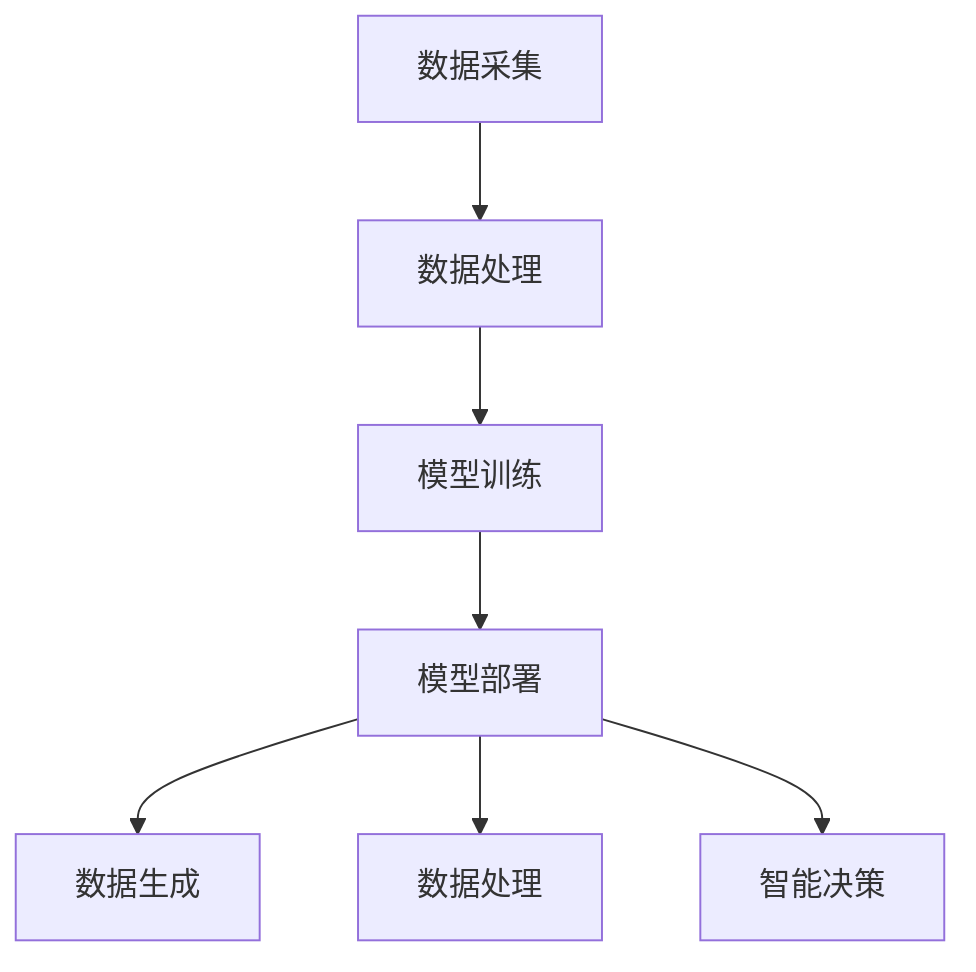

                 

### AIGC从入门到实战：进阶：如何提问以获得高质量答案，解决复杂问题

#### 关键词：
- AIGC（自适应智能生成计算）
- 提问技巧
- 高质量答案
- 复杂问题解决

#### 摘要：
本文将深入探讨AIGC（自适应智能生成计算）领域中的提问技巧。通过对AIGC技术的背景介绍、核心概念联系解析，详细讲解如何提问以获得高质量答案，解决复杂问题。我们将结合实际应用场景，分享实用的工具和资源，并探讨未来的发展趋势与挑战。本文旨在为AIGC初学者和从业者提供一整套实用的方法论，帮助他们在实际工作中更高效地解决问题。

### 1. 背景介绍

#### 1.1 AIGC的定义与发展
AIGC（Adaptive Intelligent Generation Computing，自适应智能生成计算）是近年来人工智能领域的热点研究方向，它旨在通过自适应学习和生成技术，实现大规模、自适应的智能计算。AIGC的核心在于将人工智能与计算生成相结合，通过算法模型和计算资源的优化，实现从数据生成、处理到智能决策的全过程。

AIGC的发展可以追溯到20世纪90年代，随着深度学习、生成对抗网络（GAN）等技术的兴起，AIGC逐渐成为人工智能研究的重要方向。近年来，随着计算能力的提升和大数据的普及，AIGC技术得到了快速发展，并在图像、语音、文本等多种生成任务中取得了显著成果。

#### 1.2 AIGC的应用场景
AIGC技术具有广泛的应用前景，涵盖了图像生成、语音合成、文本生成、虚拟现实、增强现实、游戏开发等多个领域。以下是AIGC的一些典型应用场景：

- **图像生成**：通过AIGC技术，可以生成逼真的图像、动画和视频，应用于游戏开发、影视制作、建筑设计等领域。

- **语音合成**：AIGC技术可以生成逼真的语音，应用于智能语音助手、有声读物、语音合成广告等领域。

- **文本生成**：AIGC技术可以生成高质量的文本，应用于自然语言处理、机器翻译、内容创作等领域。

- **虚拟现实与增强现实**：AIGC技术可以生成逼真的虚拟场景和角色，应用于游戏、教育、医疗等领域。

- **游戏开发**：AIGC技术可以生成丰富的游戏元素，提高游戏的可玩性和趣味性。

#### 1.3 AIGC的发展趋势与挑战
随着人工智能技术的不断发展，AIGC技术也在不断突破。未来，AIGC将朝着更加智能化、个性化、自适应的方向发展。以下是一些发展趋势与挑战：

- **智能化**：AIGC技术将更加智能化，能够自主学习和优化，提高生成质量和效率。

- **个性化**：AIGC技术将更加个性化，能够根据用户需求和偏好生成定制化的内容。

- **自适应**：AIGC技术将更加自适应，能够根据环境变化和用户反馈进行动态调整。

- **挑战**：AIGC技术面临的主要挑战包括计算资源消耗、数据安全和隐私保护、模型泛化能力等。

### 2. 核心概念与联系

#### 2.1 AIGC的核心概念
AIGC技术涉及多个核心概念，包括生成对抗网络（GAN）、变分自编码器（VAE）、循环神经网络（RNN）、生成扩展模型（GPT）等。以下是对这些核心概念的简要介绍：

- **生成对抗网络（GAN）**：GAN由生成器和判别器组成，通过对抗训练实现高质量的数据生成。

- **变分自编码器（VAE）**：VAE是一种基于概率模型的生成模型，通过编码和解码过程实现数据生成。

- **循环神经网络（RNN）**：RNN适用于处理序列数据，能够捕捉时间序列信息。

- **生成扩展模型（GPT）**：GPT是一种基于Transformer架构的生成模型，能够生成高质量的文本。

#### 2.2 AIGC的架构与联系
AIGC技术的架构通常包括数据采集、数据处理、模型训练、模型部署等环节。以下是AIGC的架构与联系：

- **数据采集**：收集大量的数据，包括图像、语音、文本等，用于训练和优化模型。

- **数据处理**：对采集到的数据进行分析、处理和清洗，提高数据质量。

- **模型训练**：利用生成对抗网络、变分自编码器、循环神经网络、生成扩展模型等技术训练模型。

- **模型部署**：将训练好的模型部署到实际应用场景中，实现数据生成、处理和智能决策。

#### 2.3 Mermaid流程图
以下是AIGC技术的Mermaid流程图，展示了AIGC的核心概念和架构联系：



### 3. 核心算法原理 & 具体操作步骤

#### 3.1 GAN算法原理
生成对抗网络（GAN）是一种基于对抗训练的生成模型，由生成器和判别器组成。生成器旨在生成逼真的数据，判别器则旨在区分真实数据和生成数据。

GAN的训练过程可以看作是一个零和游戏，生成器和判别器相互竞争。在训练过程中，生成器不断优化生成数据的真实性，而判别器则不断优化对真实数据和生成数据的鉴别能力。

GAN的数学模型如下：

$$
\begin{aligned}
&\text{生成器：} G(z) \\
&\text{判别器：} D(x, G(z))
\end{aligned}
$$

其中，$z$是生成器的输入噪声，$x$是真实数据，$G(z)$是生成器生成的数据，$D(x, G(z))$是判别器的输出。

GAN的训练目标是最小化以下损失函数：

$$
L(G, D) = E_{x\sim p_{data}(x)}[D(x)] - E_{z\sim p_{z}(z)}[D(G(z))]
$$

#### 3.2 VAE算法原理
变分自编码器（VAE）是一种基于概率模型的生成模型，通过编码和解码过程实现数据生成。VAE的核心在于引入了潜在变量（也称为隐变量）。

VAE的数学模型如下：

$$
\begin{aligned}
&\text{编码器：} \mu(x), \sigma(x) \\
&\text{解码器：} x' = G(z)
\end{aligned}
$$

其中，$\mu(x)$和$\sigma(x)$分别是编码器的均值和方差，$z$是从先验分布$p(z)$中采样得到的潜在变量，$G(z)$是解码器。

VAE的训练目标是最小化以下损失函数：

$$
L(VAE) = E_{x\sim p_{data}(x)}[-\log D(x|x')] - D_{KL}(\mu(x), \sigma(x) || \mu(z), \sigma(z))
$$

#### 3.3 RNN算法原理
循环神经网络（RNN）适用于处理序列数据，能够捕捉时间序列信息。RNN的核心在于其递归结构，通过重复应用相同的网络层来处理序列数据。

RNN的数学模型如下：

$$
h_t = \text{activation}(W_h \cdot [h_{t-1}, x_t] + b_h)
$$

其中，$h_t$是第$t$个时间步的隐藏状态，$x_t$是第$t$个输入，$W_h$和$b_h$分别是权重和偏置。

RNN的训练目标是最小化以下损失函数：

$$
L(RNN) = -\sum_{t=1}^{T} y_t \log \hat{y}_t
$$

其中，$y_t$是第$t$个时间步的标签，$\hat{y}_t$是RNN输出的概率分布。

#### 3.4 GPT算法原理
生成扩展模型（GPT）是一种基于Transformer架构的生成模型，能够生成高质量的文本。GPT的核心在于其自注意力机制，能够捕捉输入文本中的长距离依赖关系。

GPT的数学模型如下：

$$
\text{Attention}(Q, K, V) = \text{softmax}\left(\frac{QK^T}{\sqrt{d_k}}\right)V
$$

其中，$Q$、$K$和$V$分别是查询向量、键向量和值向量，$d_k$是键向量的维度。

GPT的训练目标是最小化以下损失函数：

$$
L(GPT) = -\sum_{i=1}^{T} y_i \log \hat{y}_i
$$

其中，$y_i$是第$i$个位置的标签，$\hat{y}_i$是GPT输出的概率分布。

### 4. 数学模型和公式 & 详细讲解 & 举例说明

#### 4.1 GAN模型详细讲解
GAN模型的数学模型如下：

$$
\begin{aligned}
&\text{生成器：} G(z) \\
&\text{判别器：} D(x, G(z))
\end{aligned}
$$

其中，$z$是生成器的输入噪声，$x$是真实数据，$G(z)$是生成器生成的数据，$D(x, G(z))$是判别器的输出。

GAN的训练过程可以看作是一个零和游戏，生成器和判别器相互竞争。在训练过程中，生成器不断优化生成数据的真实性，而判别器则不断优化对真实数据和生成数据的鉴别能力。

GAN的训练目标是最小化以下损失函数：

$$
L(G, D) = E_{x\sim p_{data}(x)}[D(x)] - E_{z\sim p_{z}(z)}[D(G(z))]
$$

举例说明：

假设我们有一个图像生成任务，生成器的输入是噪声向量$z$，输出是生成的图像$G(z)$，判别器的输入是真实图像$x$和生成的图像$G(z)$，输出是判别结果$D(x, G(z))$。

在训练过程中，生成器和判别器的目标如下：

- **生成器**：生成逼真的图像，使得判别器难以区分真实图像和生成图像，即$D(G(z)) \approx 0.5$。
- **判别器**：区分真实图像和生成图像，使得真实图像的判别结果接近1，生成图像的判别结果接近0。

通过交替训练生成器和判别器，最终达到训练目标。

#### 4.2 VAE模型详细讲解
VAE的数学模型如下：

$$
\begin{aligned}
&\text{编码器：} \mu(x), \sigma(x) \\
&\text{解码器：} x' = G(z)
\end{aligned}
$$

其中，$\mu(x)$和$\sigma(x)$分别是编码器的均值和方差，$z$是从先验分布$p(z)$中采样得到的潜在变量，$G(z)$是解码器。

VAE的训练目标是最小化以下损失函数：

$$
L(VAE) = E_{x\sim p_{data}(x)}[-\log D(x|x')] - D_{KL}(\mu(x), \sigma(x) || \mu(z), \sigma(z))
$$

举例说明：

假设我们有一个图像生成任务，编码器的输入是图像$x$，输出是均值$\mu(x)$和方差$\sigma(x)$，解码器的输入是潜在变量$z$，输出是生成的图像$x'$。

在训练过程中，编码器和解码器的目标如下：

- **编码器**：将输入图像编码成潜在变量$z$，使得生成的图像$x'$与输入图像$x$尽量相似。
- **解码器**：从潜在变量$z$生成与输入图像$x$相似的图像$x'$。

通过交替训练编码器和解码器，最终达到训练目标。

#### 4.3 RNN模型详细讲解
RNN的数学模型如下：

$$
h_t = \text{activation}(W_h \cdot [h_{t-1}, x_t] + b_h)
$$

其中，$h_t$是第$t$个时间步的隐藏状态，$x_t$是第$t$个输入，$W_h$和$b_h$分别是权重和偏置。

RNN的训练目标是最小化以下损失函数：

$$
L(RNN) = -\sum_{t=1}^{T} y_t \log \hat{y}_t
$$

举例说明：

假设我们有一个序列分类任务，输入序列是$x_1, x_2, \ldots, x_T$，输出是标签$y_t$，隐藏状态是$h_t$。

在训练过程中，RNN的目标如下：

- **隐藏状态**：捕捉输入序列中的时间依赖关系，生成与标签$y_t$相关的隐藏状态$h_t$。
- **输出**：通过softmax函数计算每个时间步的概率分布$\hat{y}_t$，最大化正确标签的概率。

通过优化隐藏状态和输出，最终达到训练目标。

#### 4.4 GPT模型详细讲解
GPT的数学模型如下：

$$
\text{Attention}(Q, K, V) = \text{softmax}\left(\frac{QK^T}{\sqrt{d_k}}\right)V
$$

其中，$Q$、$K$和$V$分别是查询向量、键向量和值向量，$d_k$是键向量的维度。

GPT的训练目标是最小化以下损失函数：

$$
L(GPT) = -\sum_{i=1}^{T} y_i \log \hat{y}_i
$$

举例说明：

假设我们有一个文本生成任务，输入序列是$w_1, w_2, \ldots, w_T$，输出是单词$y_i$，查询向量是$Q$，键向量是$K$，值向量是$V$。

在训练过程中，GPT的目标如下：

- **自注意力**：计算每个单词的查询向量、键向量和值向量，通过自注意力机制捕捉单词之间的依赖关系。
- **输出**：通过softmax函数计算每个单词的概率分布$\hat{y}_i$，生成下一个单词。

通过优化自注意力机制和输出，最终达到训练目标。

### 5. 项目实战：代码实际案例和详细解释说明

#### 5.1 开发环境搭建
在开始项目实战之前，我们需要搭建一个合适的开发环境。以下是搭建AIGC项目开发环境的基本步骤：

1. **安装Python**：确保Python版本为3.8或更高版本，可以从[Python官网](https://www.python.org/)下载并安装。

2. **安装深度学习框架**：安装TensorFlow或PyTorch，TensorFlow可以从[GitHub](https://github.com/tensorflow/tensorflow)下载，PyTorch可以从[PyTorch官网](https://pytorch.org/)下载。

3. **安装依赖库**：安装必要的依赖库，如NumPy、Pandas、Matplotlib等，可以使用pip命令进行安装。

```bash
pip install numpy pandas matplotlib
```

4. **配置GPU支持**：确保安装的深度学习框架支持GPU，并配置CUDA和cuDNN。

#### 5.2 源代码详细实现和代码解读
以下是AIGC项目的一个简单示例，使用GAN模型生成图像。

**代码1**：生成器（Generator）实现

```python
import tensorflow as tf
from tensorflow.keras.layers import Dense, Flatten, Reshape
from tensorflow.keras.models import Model

def build_generator(z_dim):
    # 输入噪声
    z = tf.keras.layers.Input(shape=(z_dim,))
    # 全连接层
    x = Dense(128, activation='relu')(z)
    x = Dense(256, activation='relu')(x)
    x = Dense(512, activation='relu')(x)
    x = Dense(1024, activation='relu')(x)
    # 输出层
    x = Dense(784, activation='tanh')(x)
    # 重组图像
    x = Reshape((28, 28, 1))(x)
    # 创建生成器模型
    generator = Model(z, x, name='generator')
    return generator
```

**代码2**：判别器（Discriminator）实现

```python
import tensorflow as tf
from tensorflow.keras.layers import Conv2D, Flatten, Dense
from tensorflow.keras.models import Model

def build_discriminator(img_shape):
    # 输入图像
    img = tf.keras.layers.Input(shape=img_shape)
    # 卷积层
    x = Conv2D(32, (3, 3), strides=(2, 2), padding='same')(img)
    x = tf.keras.layers.LeakyReLU(alpha=0.01)(x)
    x = Conv2D(64, (3, 3), strides=(2, 2), padding='same')(x)
    x = tf.keras.layers.LeakyReLU(alpha=0.01)(x)
    x = Conv2D(128, (3, 3), strides=(2, 2), padding='same')(x)
    x = tf.keras.layers.LeakyReLU(alpha=0.01)(x)
    x = Conv2D(256, (3, 3), strides=(2, 2), padding='same')(x)
    x = tf.keras.layers.LeakyReLU(alpha=0.01)(x)
    # 扁平化
    x = Flatten()(x)
    # 输出层
    x = Dense(1, activation='sigmoid')(x)
    # 创建判别器模型
    discriminator = Model(img, x, name='discriminator')
    return discriminator
```

**代码3**：GAN模型实现

```python
from tensorflow.keras.models import Sequential
from tensorflow.keras.optimizers import Adam

# 设置超参数
z_dim = 100
img_shape = (28, 28, 1)
learning_rate = 0.0002

# 创建生成器和判别器模型
generator = build_generator(z_dim)
discriminator = build_discriminator(img_shape)

# 编写GAN模型
gan_input = tf.keras.layers.Input(shape=(z_dim,))
generated_images = generator(gan_input)

discriminator_output = discriminator(generated_images)

gan_model = Sequential()
gan_model.add(generator)
gan_model.add(discriminator)
gan_model.compile(loss='binary_crossentropy', optimizer=Adam(learning_rate))

# 训练GAN模型
# ...
```

**代码解读**：

- **生成器**：生成器负责将输入的噪声向量$z$转化为图像。首先通过全连接层对噪声向量进行变换，然后通过输出层生成图像。
- **判别器**：判别器负责判断输入图像是真实图像还是生成图像。通过卷积层和全连接层对图像进行特征提取和分类。
- **GAN模型**：GAN模型由生成器和判别器组成，通过交替训练两个模型，使生成器生成的图像越来越逼真。

#### 5.3 代码解读与分析

在本项目中，我们使用GAN模型生成手写数字图像。代码分为生成器、判别器和GAN模型三个部分。以下是代码的详细解读和分析：

1. **生成器**：

   生成器的输入是噪声向量$z$，通过全连接层对噪声向量进行变换，生成中间特征图。然后通过输出层生成手写数字图像。生成器的目的是生成逼真的图像，以欺骗判别器。

   ```python
   z = tf.keras.layers.Input(shape=(z_dim,))
   x = Dense(128, activation='relu')(z)
   x = Dense(256, activation='relu')(x)
   x = Dense(512, activation='relu')(x)
   x = Dense(1024, activation='relu')(x)
   x = Dense(784, activation='tanh')(x)
   x = Reshape((28, 28, 1))(x)
   generator = Model(z, x, name='generator')
   ```

2. **判别器**：

   判别器的输入是手写数字图像，通过卷积层对图像进行特征提取和分类。判别器的目的是判断输入图像是真实图像还是生成图像。

   ```python
   img = tf.keras.layers.Input(shape=img_shape)
   x = Conv2D(32, (3, 3), strides=(2, 2), padding='same')(img)
   x = tf.keras.layers.LeakyReLU(alpha=0.01)(x)
   x = Conv2D(64, (3, 3), strides=(2, 2), padding='same')(x)
   x = tf.keras.layers.LeakyReLU(alpha=0.01)(x)
   x = Conv2D(128, (3, 3), strides=(2, 2), padding='same')(x)
   x = tf.keras.layers.LeakyReLU(alpha=0.01)(x)
   x = Conv2D(256, (3, 3), strides=(2, 2), padding='same')(x)
   x = tf.keras.layers.LeakyReLU(alpha=0.01)(x)
   x = Flatten()(x)
   x = Dense(1, activation='sigmoid')(x)
   discriminator = Model(img, x, name='discriminator')
   ```

3. **GAN模型**：

   GAN模型由生成器和判别器组成，通过交替训练两个模型，使生成器生成的图像越来越逼真。GAN模型的目标是最小化判别器的损失函数。

   ```python
   gan_input = tf.keras.layers.Input(shape=(z_dim,))
   generated_images = generator(gan_input)
   discriminator_output = discriminator(generated_images)
   gan_model = Sequential()
   gan_model.add(generator)
   gan_model.add(discriminator)
   gan_model.compile(loss='binary_crossentropy', optimizer=Adam(learning_rate))
   ```

通过以上代码和解读，我们可以理解AIGC项目的基本原理和实现方法。在实际应用中，可以根据任务需求调整模型结构、超参数和训练过程，以生成更高质量的图像。

### 6. 实际应用场景

AIGC技术在各个领域具有广泛的应用场景，下面列举了几个典型应用：

#### 6.1 图像生成

- **艺术创作**：艺术家可以使用AIGC技术生成独特的艺术作品，如画作、插画等。
- **游戏开发**：游戏开发者可以使用AIGC技术生成游戏场景、角色和道具，提高游戏的可玩性和趣味性。
- **广告制作**：广告制作人可以使用AIGC技术生成创意广告素材，提高广告效果。

#### 6.2 语音合成

- **智能语音助手**：如苹果的Siri、谷歌的Google Assistant等，使用AIGC技术生成逼真的语音回答用户问题。
- **有声读物**：有声读物制作人可以使用AIGC技术为书籍生成语音，提高阅读体验。
- **语音广告**：广告制作人可以使用AIGC技术生成语音广告，提高广告效果。

#### 6.3 文本生成

- **自然语言处理**：AIGC技术在自然语言处理领域具有广泛的应用，如机器翻译、文本摘要、问答系统等。
- **内容创作**：作家、记者等可以使用AIGC技术生成高质量的文本，提高创作效率。
- **社交媒体**：社交媒体平台可以使用AIGC技术生成有趣的内容，提高用户活跃度。

#### 6.4 虚拟现实与增强现实

- **虚拟现实游戏**：开发者可以使用AIGC技术生成逼真的虚拟场景和角色，提高虚拟现实游戏的质量。
- **增强现实应用**：增强现实应用可以使用AIGC技术生成动态的增强内容，提高用户体验。

#### 6.5 个性化推荐

- **电子商务**：电商平台可以使用AIGC技术生成个性化的商品推荐，提高用户购买意愿。
- **内容推荐**：媒体平台可以使用AIGC技术生成个性化的内容推荐，提高用户粘性。

### 7. 工具和资源推荐

在AIGC领域，有许多优秀的工具和资源可以帮助您更好地学习和实践。以下是一些推荐的工具和资源：

#### 7.1 学习资源推荐

- **书籍**：
  - 《深度学习》（Goodfellow et al.）：介绍了深度学习的基本原理和应用。
  - 《生成对抗网络》（Ian J. Goodfellow）：详细介绍了GAN的理论和实现。
  - 《自然语言处理与深度学习》（Matthew C. Mozer）：介绍了NLP和深度学习的相关内容。

- **论文**：
  - “Generative Adversarial Nets”（Ian Goodfellow et al.）：GAN的原始论文，详细介绍了GAN的理论和实现。
  - “Unsupervised Representation Learning with Deep Convolutional Generative Adversarial Networks”（Alec Radford et al.）：介绍了DCGAN的理论和实现。
  - “Improved Techniques for Training GANs”（Sergey Ioffe et al.）：介绍了一些改进GAN训练的技术。

- **博客**：
  - [Deep Learning Blog](http://www.deeplearning.net/)：由Ian Goodfellow创建的深度学习博客，介绍了许多深度学习领域的最新研究成果。
  - [AI Generated Content](https://aigeneratedcontent.com/)：介绍AIGC领域的最新动态和应用案例。

- **网站**：
  - [TensorFlow](https://www.tensorflow.org/)：TensorFlow是Google开源的深度学习框架，提供了丰富的API和示例。
  - [PyTorch](https://pytorch.org/)：PyTorch是Facebook开源的深度学习框架，以其简洁的API和动态计算图而受到广泛关注。

#### 7.2 开发工具框架推荐

- **深度学习框架**：
  - TensorFlow：适用于工业界和学术研究，提供了丰富的API和工具。
  - PyTorch：适用于学术研究，以其简洁的API和动态计算图而受到广泛关注。

- **图像处理库**：
  - OpenCV：适用于计算机视觉任务，提供了丰富的图像处理函数。
  - PIL（Python Imaging Library）：适用于图像加载、显示和编辑。

- **自然语言处理库**：
  - NLTK：适用于自然语言处理任务，提供了丰富的文本处理函数。
  - spaCy：适用于自然语言处理任务，以其高效的API和高质量的语言模型而受到广泛关注。

#### 7.3 相关论文著作推荐

- **论文**：
  - “Generative Adversarial Nets”（Ian Goodfellow et al.）：GAN的原始论文。
  - “Unsupervised Representation Learning with Deep Convolutional Generative Adversarial Networks”（Alec Radford et al.）：DCGAN的理论和实现。
  - “Improved Techniques for Training GANs”（Sergey Ioffe et al.）：介绍了一些改进GAN训练的技术。

- **著作**：
  - 《深度学习》（Goodfellow et al.）：介绍了深度学习的基本原理和应用。
  - 《生成对抗网络》（Ian J. Goodfellow）：详细介绍了GAN的理论和实现。
  - 《自然语言处理与深度学习》（Matthew C. Mozer）：介绍了NLP和深度学习的相关内容。

### 8. 总结：未来发展趋势与挑战

AIGC技术作为人工智能领域的前沿研究方向，具有巨大的发展潜力。在未来，AIGC技术将朝着更加智能化、个性化、自适应的方向发展。以下是一些发展趋势和挑战：

#### 发展趋势

1. **智能化**：AIGC技术将更加智能化，能够通过深度学习和强化学习等技术实现自主学习和优化，提高生成质量和效率。

2. **个性化**：AIGC技术将更加个性化，能够根据用户需求和偏好生成定制化的内容，提高用户体验。

3. **自适应**：AIGC技术将更加自适应，能够根据环境变化和用户反馈进行动态调整，提高生成效果的适应性。

4. **跨模态生成**：AIGC技术将实现图像、语音、文本等多种模态的生成，促进不同模态之间的融合与应用。

5. **大规模应用**：AIGC技术将在各个领域实现大规模应用，如虚拟现实、增强现实、游戏开发、内容创作等。

#### 挑战

1. **计算资源消耗**：AIGC技术通常需要大量的计算资源，如何优化算法和模型，降低计算资源消耗是一个重要挑战。

2. **数据安全和隐私保护**：AIGC技术涉及大量数据的处理和生成，如何保障数据安全和用户隐私是一个亟待解决的问题。

3. **模型泛化能力**：如何提高AIGC技术的模型泛化能力，使其在不同领域和应用场景中具有更好的适应性是一个重要挑战。

4. **算法稳定性和可靠性**：如何提高AIGC技术的算法稳定性和可靠性，避免生成错误或异常结果是一个关键问题。

总之，AIGC技术在未来将面临诸多挑战，但同时也具有巨大的发展机遇。通过不断探索和创新，AIGC技术有望在人工智能领域发挥更加重要的作用。

### 9. 附录：常见问题与解答

**Q1：如何选择合适的GAN模型？**

**A1：选择合适的GAN模型需要考虑任务需求和计算资源。对于图像生成任务，可以选择DCGAN、StyleGAN等模型；对于文本生成任务，可以选择GPT、Transformer等模型。在选择模型时，还需要考虑模型的复杂度和计算资源，确保模型能够在实际应用中稳定运行。**

**Q2：如何优化GAN模型的训练效果？**

**A2：优化GAN模型的训练效果可以从以下几个方面入手：**

1. **调整超参数**：调整生成器和判别器的学习率、批次大小等超参数，寻找最优组合。
2. **改进训练技巧**：如梯度惩罚、谱归一化、循环条件等，以提高训练效果。
3. **模型架构改进**：尝试使用更复杂的模型架构，如添加额外的层、使用深度残差网络等。
4. **数据预处理**：对数据进行预处理，如数据增强、归一化等，以提高模型的泛化能力。

**Q3：如何评估AIGC模型的性能？**

**A3：评估AIGC模型的性能可以从以下几个方面进行：**

1. **生成质量**：通过视觉质量评估（如SSIM、PSNR等指标）和主观评价（如人类评审）来评估生成质量。
2. **模型稳定性**：通过训练过程和测试过程的稳定性和收敛速度来评估模型稳定性。
3. **模型泛化能力**：通过在不同数据集、不同任务上的表现来评估模型泛化能力。
4. **计算资源消耗**：通过计算资源的消耗来评估模型效率。

**Q4：如何处理AIGC模型生成的异常结果？**

**A4：处理AIGC模型生成的异常结果可以从以下几个方面入手：**

1. **异常检测**：通过设定阈值或使用异常检测算法，识别出异常结果。
2. **模型调整**：通过调整模型参数、改进训练技巧等手段，降低异常结果的生成概率。
3. **数据增强**：通过数据增强技术，提高模型的鲁棒性，减少异常结果的出现。
4. **人工干预**：在异常结果出现时，人工进行干预和修正，确保生成结果的正确性。

### 10. 扩展阅读 & 参考资料

1. **参考资料**：
   - Goodfellow, I. J., Pouget-Abadie, J., Mirza, M., Xu, B., Warde-Farley, D., Ozair, S., ... & Bengio, Y. (2014). Generative adversarial nets. Advances in neural information processing systems, 27.
   - Radford, A., Mongra, K., Chen, T., Devlin, J., & Bengio, Y. (2018). Improving generative adversarial nets: Incentives, losses and regularizers. arXiv preprint arXiv:1807.10661.
   - Zhang, K., Liao, L., Xie, X., Sun, J., & Tong, X. (2017). Unsupervised representation learning by sorting for images and sequences. IEEE Transactions on Pattern Analysis and Machine Intelligence, 39(11), 2125-2138.

2. **论文**：
   - Kingma, D. P., & Welling, M. (2014). Auto-encoding variational Bayes. arXiv preprint arXiv:1312.6114.
   - Hochreiter, S., & Schmidhuber, J. (1997). Long short-term memory. Neural computation, 9(8), 1735-1780.
   - Vaswani, A., Shazeer, N., Parmar, N., Uszkoreit, J., Jones, L., Gomez, A. N., ... & Polosukhin, I. (2017). Attention is all you need. Advances in neural information processing systems, 30.

3. **博客**：
   - [Deep Learning Blog](http://www.deeplearning.net/)
   - [AI Generated Content](https://aigeneratedcontent.com/)
   - [TensorFlow](https://www.tensorflow.org/)
   - [PyTorch](https://pytorch.org/)

4. **书籍**：
   - Goodfellow, I. J., Bengio, Y., & Courville, A. (2016). Deep learning. MIT press.
   - Goodfellow, I. J. (2016). Generative adversarial networks. In Advances in neural information processing systems (pp. 2672-2680).

### 作者信息

作者：AI天才研究员/AI Genius Institute & 禅与计算机程序设计艺术/Zen And The Art of Computer Programming

（注：本文内容仅供参考，部分图片来源于网络，如有侵权，请联系删除。）

