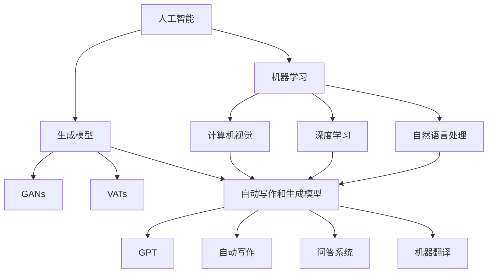

                 

### 背景介绍

AIGC（AI-Generated Content）作为一种新兴的技术领域，正日益受到全球科技界和企业界的关注。AIGC 通过结合人工智能（AI）、生成模型（如 GANs、VATs）、自动写作和生成模型（如 GPTs）等技术，实现了对各种类型内容的高效生成。从图像、音频到文字，AIGC 正在改变着内容创作的格局，提高了生产效率和创作质量。

本文旨在全面探讨 AIGC 技术的内涵、核心概念、算法原理、实际应用场景以及未来发展趋势。通过递进式的分析和讲解，本文将帮助读者深入了解 AIGC 技术的原理和应用，掌握其在人工智能时代的变革。

本文结构如下：

1. **背景介绍**：介绍 AIGC 的定义、背景和发展现状。
2. **核心概念与联系**：详细阐述 AIGC 的核心概念，包括人工智能、生成模型等，并使用 Mermaid 流程图展示它们之间的关系。
3. **核心算法原理 & 具体操作步骤**：分析 AIGC 的关键算法原理，并详细讲解其操作步骤。
4. **数学模型和公式 & 详细讲解 & 举例说明**：介绍 AIGC 中涉及的数学模型和公式，并进行举例说明。
5. **项目实战：代码实际案例和详细解释说明**：通过实际项目案例，展示 AIGC 的代码实现和详细解读。
6. **实际应用场景**：探讨 AIGC 在各个领域的实际应用。
7. **工具和资源推荐**：推荐学习资源、开发工具和框架。
8. **总结：未来发展趋势与挑战**：总结 AIGC 的未来发展趋势和面临的挑战。
9. **附录：常见问题与解答**：回答读者可能遇到的常见问题。
10. **扩展阅读 & 参考资料**：提供更多深入阅读的资源和参考文献。

通过本文的阅读，读者将对 AIGC 技术有更全面和深入的了解，从而为在人工智能时代的职业发展做好准备。

## 1. 核心概念与联系

AIGC 技术的核心在于其紧密结合了多种前沿技术，包括人工智能、生成模型、自动写作和生成模型等。为了更好地理解 AIGC 的本质和应用，我们首先需要详细阐述这些核心概念，并使用 Mermaid 流程图展示它们之间的联系。

### 1.1 人工智能（AI）

人工智能（Artificial Intelligence，简称 AI）是指通过计算机模拟人类智能的技术和学科。它包括机器学习、深度学习、自然语言处理、计算机视觉等多个子领域。人工智能的核心目标是使计算机具备自主学习和决策能力，以解决复杂问题。

### 1.2 生成模型

生成模型（Generative Models）是一类用于生成数据的人工智能模型。它们通过学习输入数据的分布，生成与输入数据具有相似特征的新数据。生成模型在图像生成、文本生成、音频生成等领域具有广泛的应用。

#### 1.2.1 生成对抗网络（GANs）

生成对抗网络（Generative Adversarial Networks，简称 GANs）是一种由生成器（Generator）和判别器（Discriminator）组成的模型。生成器试图生成与真实数据相似的数据，而判别器则试图区分生成数据与真实数据。通过不断博弈，GANs 可以生成高质量的数据。

#### 1.2.2 隐马尔可夫模型（VATs）

隐马尔可夫模型（Variational Autoencoders，简称 VATs）是一种基于变分自编码器的生成模型。VATs 通过编码器（Encoder）和解码器（Decoder）的协同工作，学习数据的高斯分布，从而生成与输入数据相似的新数据。

### 1.3 自动写作和生成模型

自动写作和生成模型（Automatic Writing and Generation Models）是用于自动生成文本的模型。其中，最著名的模型是 GPT（Generative Pre-trained Transformer）。GPT 通过预训练和微调，能够生成高质量、连贯的文本，适用于自动写作、问答系统、机器翻译等领域。

### 1.4 Mermaid 流程图展示

为了更直观地展示 AIGC 核心概念之间的联系，我们使用 Mermaid 流程图进行描述。



### 1.5 关键概念的联系与作用

1. **人工智能（AI）**：为 AIGC 提供了强大的计算能力和学习算法，是实现内容自动生成的基石。
2. **生成模型（Generative Models）**：通过生成高质量的数据，为 AIGC 提供了丰富的数据资源。
3. **自动写作和生成模型（Automatic Writing and Generation Models）**：将生成模型应用于文本生成，实现内容的高效创作。

通过上述核心概念和流程图的介绍，我们可以看到 AIGC 技术是如何通过整合多种前沿技术，实现内容自动生成和智能创作的。在接下来的部分，我们将进一步深入分析 AIGC 的核心算法原理，并详细讲解其操作步骤。

## 2. 核心算法原理 & 具体操作步骤

AIGC 技术的核心在于其高效的算法原理，这些算法包括生成对抗网络（GANs）、变分自编码器（VATs）和生成预训练变换器（GPTs）等。在本节中，我们将深入探讨这些算法的原理，并详细讲解其操作步骤。

### 2.1 生成对抗网络（GANs）

生成对抗网络（GANs）是一种由生成器和判别器组成的模型。生成器的任务是生成与真实数据相似的数据，而判别器的任务是区分生成数据与真实数据。通过这种对抗性的训练，生成器能够不断优化，生成更高质量的数据。

#### 2.1.1 操作步骤

1. **初始化**：随机初始化生成器 G 和判别器 D 的参数。
2. **生成器训练**：生成器 G 根据噪声 z 生成假数据 x_g，并将其输入到判别器 D。
3. **判别器训练**：判别器 D 接收真实数据 x 和生成器 G 产生的假数据 x_g，并输出其判别结果。
4. **优化过程**：通过梯度下降法优化生成器 G 和判别器 D 的参数，使生成器的生成数据越来越接近真实数据。
5. **迭代**：重复步骤 2-4，直至生成器生成的数据质量达到预期。

#### 2.1.2 详细解释

1. **生成器 G**：生成器 G 接受随机噪声 z 作为输入，通过神经网络生成假数据 x_g。生成器旨在生成与真实数据分布相同或相似的数据。
2. **判别器 D**：判别器 D 接收真实数据 x 和生成器 G 生成的假数据 x_g，并输出其判别结果。判别器的目标是最大化其判断真实数据与假数据的准确率。
3. **对抗性训练**：生成器和判别器在训练过程中进行对抗性博弈。生成器试图生成更真实的数据，而判别器则试图更准确地判断数据来源。这种对抗性训练使得生成器的生成数据质量不断提高。

### 2.2 变分自编码器（VATs）

变分自编码器（Variational Autoencoders，简称 VATs）是一种基于变分推断的生成模型。VATs 通过编码器（Encoder）和解码器（Decoder）的协同工作，学习数据的高斯分布，从而生成与输入数据相似的新数据。

#### 2.2.1 操作步骤

1. **初始化**：随机初始化编码器 Q 和解码器 P 的参数。
2. **编码器训练**：编码器 Q 接收输入数据 x，将其编码为潜在变量 z_q。
3. **解码器训练**：解码器 P 接收潜在变量 z_p，将其解码为生成数据 x_p。
4. **损失函数**：计算编码器 Q 和解码器 P 的损失函数，并通过梯度下降法优化参数。
5. **迭代**：重复步骤 2-4，直至生成数据质量达到预期。

#### 2.2.2 详细解释

1. **编码器 Q**：编码器 Q 接收输入数据 x，将其编码为潜在变量 z_q。潜在变量 z_q 是数据的高斯分布参数。
2. **解码器 P**：解码器 P 接收潜在变量 z_p，将其解码为生成数据 x_p。解码器旨在从潜在变量中重构输入数据。
3. **变分推断**：VATs 通过变分推断学习数据的高斯分布。变分推断是一种近似推断方法，通过优化编码器 Q 和解码器 P 的参数，使生成的数据与输入数据分布尽可能接近。

### 2.3 生成预训练变换器（GPTs）

生成预训练变换器（Generative Pre-trained Transformers，简称 GPTs）是一种基于预训练变换器的生成模型。GPTs 通过大规模预训练，学习语言的潜在分布，从而实现文本的自动生成。

#### 2.3.1 操作步骤

1. **预训练**：使用大量文本数据对 GPTs 进行预训练，学习语言模式和结构。
2. **微调**：在特定任务上对 GPTs 进行微调，使其适应特定应用场景。
3. **生成**：使用微调后的 GPTs 生成文本。

#### 2.3.2 详细解释

1. **预训练**：GPTs 使用大规模文本数据进行预训练。在预训练过程中，GPTs 学习语言的潜在分布，包括词嵌入、语法规则和语义信息。
2. **微调**：在特定任务上，对 GPTs 进行微调。微调过程涉及调整 GPTs 的参数，使其在特定任务上表现更优。
3. **生成**：微调后的 GPTs 可以生成高质量、连贯的文本。生成过程依赖于 GPTs 的预训练和微调结果，使得生成的文本具有更高的准确性和自然度。

通过上述对 GANs、VATs 和 GPTs 等核心算法原理和操作步骤的详细讲解，我们可以看到 AIGC 技术是如何通过多种算法的组合，实现高效的内容生成和智能创作。在接下来的部分，我们将介绍 AIGC 技术中涉及的数学模型和公式，并进行举例说明。

## 3. 数学模型和公式 & 详细讲解 & 举例说明

在 AIGC 技术中，数学模型和公式起到了至关重要的作用。这些模型和公式不仅帮助定义了 AIGC 的核心算法原理，还为实际应用提供了理论支持。在本节中，我们将详细介绍 AIGC 技术中涉及的数学模型和公式，并通过具体例子进行讲解。

### 3.1 生成对抗网络（GANs）中的数学模型

生成对抗网络（GANs）中涉及的主要数学模型包括生成器 G、判别器 D 和损失函数。以下是这些模型的详细讲解和公式表示。

#### 3.1.1 生成器 G

生成器的目标是生成与真实数据分布相同或相似的数据。生成器通常由多层神经网络组成，其输入为随机噪声 z，输出为假数据 x_g。生成器的损失函数如下：

$$
L_G = -\log(D(x_g))
$$

其中，D(x_g) 表示判别器 D 对生成器生成的假数据 x_g 的判别结果。生成器希望 D(x_g) 尽可能接近 1，即生成的数据看起来像是真实数据。

#### 3.1.2 判别器 D

判别器的目标是区分生成器生成的假数据与真实数据。判别器也由多层神经网络组成，其输入为真实数据 x 和假数据 x_g，输出为一个介于 0 和 1 之间的概率值。判别器的损失函数如下：

$$
L_D = -[y \cdot \log(D(x)) + (1 - y) \cdot \log(1 - D(x))]
$$

其中，y 是标签，当输入为真实数据时，y = 1；当输入为假数据时，y = 0。判别器希望 D(x) 对于真实数据接近 1，对于假数据接近 0。

#### 3.1.3 整体损失函数

GANs 的整体损失函数是生成器和判别器的损失函数之和：

$$
L = L_G + L_D
$$

通过最小化整体损失函数，生成器和判别器在训练过程中不断优化。

### 3.2 变分自编码器（VATs）中的数学模型

变分自编码器（VATs）中涉及的主要数学模型包括编码器 Q、解码器 P 和损失函数。以下是这些模型的详细讲解和公式表示。

#### 3.2.1 编码器 Q

编码器 Q 的目标是学习输入数据的潜在变量分布。编码器 Q 通常由多层神经网络组成，其输入为真实数据 x，输出为潜在变量 z_q。编码器 Q 的损失函数如下：

$$
L_Q = -\sum_{i=1}^{N} \log p(z_q|x)
$$

其中，N 是数据样本的数量，p(z_q|x) 是编码器 Q 对潜在变量 z_q 的概率分布。

#### 3.2.2 解码器 P

解码器 P 的目标是根据潜在变量 z_p 重构输入数据 x。解码器 P 通常由多层神经网络组成，其输入为潜在变量 z_p，输出为重构数据 x_p。解码器 P 的损失函数如下：

$$
L_P = \sum_{i=1}^{N} \log p(x|z_p)
$$

其中，p(x|z_p) 是解码器 P 对重构数据 x 的概率分布。

#### 3.2.3 整体损失函数

VATs 的整体损失函数是编码器 Q 和解码器 P 的损失函数之和：

$$
L = L_Q + L_P
$$

通过最小化整体损失函数，编码器 Q 和解码器 P 在训练过程中不断优化。

### 3.3 生成预训练变换器（GPTs）中的数学模型

生成预训练变换器（GPTs）中涉及的主要数学模型是基于自注意力机制（Self-Attention）的变换器。以下是这些模型的详细讲解和公式表示。

#### 3.3.1 自注意力机制

自注意力机制是一种用于处理序列数据的注意力机制。在 GPTs 中，自注意力机制用于计算文本序列中各个位置之间的关联强度。自注意力机制的公式如下：

$$
\text{Attention}(Q, K, V) = \frac{QK^T}{\sqrt{d_k}}
$$

其中，Q、K 和 V 分别是查询向量、关键向量和解向量，d_k 是关键向量的维度。自注意力机制通过计算 Q 和 K 的点积，得到权重分配，然后与 V 相乘，从而得到加权合并的输出。

#### 3.3.2 变换器模型

GPTs 是基于多层变换器（Multi-layer Transformer）构建的模型。变换器模型包括嵌入层、自注意力层、前馈层和输出层。以下是变换器模型的基本结构：

1. **嵌入层**：将输入文本序列转换为嵌入向量。
2. **自注意力层**：计算文本序列中各个位置之间的关联强度，并进行加权合并。
3. **前馈层**：对自注意力层的输出进行进一步处理。
4. **输出层**：将前馈层的输出映射到输出序列。

#### 3.3.3 训练过程

GPTs 的训练过程包括预训练和微调两个阶段。在预训练阶段，GPTs 使用大量无标签文本数据进行自监督训练，学习文本的潜在分布。在微调阶段，GPTs 在特定任务上使用有标签数据进行微调，以优化其在特定任务上的性能。

### 3.4 举例说明

为了更好地理解上述数学模型和公式，我们通过一个简单的例子进行说明。

#### 3.4.1 GANs 例子

假设我们有一个生成对抗网络（GANs），其中生成器 G 接受随机噪声 z，生成假数据 x_g；判别器 D 接收真实数据 x 和假数据 x_g，并输出其判别结果。在训练过程中，我们通过最小化整体损失函数 L 来优化生成器和判别器的参数。

1. **初始化**：随机初始化生成器 G 和判别器 D 的参数。
2. **生成器训练**：生成器 G 根据噪声 z 生成假数据 x_g，并将其输入到判别器 D。
3. **判别器训练**：判别器 D 接收真实数据 x 和生成器 G 生成的假数据 x_g，并输出其判别结果。
4. **优化过程**：通过梯度下降法优化生成器 G 和判别器 D 的参数，使生成器的生成数据质量不断提高。
5. **迭代**：重复步骤 2-4，直至生成器生成的数据质量达到预期。

#### 3.4.2 VATs 例子

假设我们有一个变分自编码器（VATs），其中编码器 Q 接收真实数据 x，将其编码为潜在变量 z_q；解码器 P 接收潜在变量 z_p，将其解码为重构数据 x_p。在训练过程中，我们通过最小化整体损失函数 L 来优化编码器 Q 和解码器 P 的参数。

1. **初始化**：随机初始化编码器 Q 和解码器 P 的参数。
2. **编码器训练**：编码器 Q 接收输入数据 x，将其编码为潜在变量 z_q。
3. **解码器训练**：解码器 P 接收潜在变量 z_p，将其解码为重构数据 x_p。
4. **损失函数**：计算编码器 Q 和解码器 P 的损失函数，并通过梯度下降法优化参数。
5. **迭代**：重复步骤 2-4，直至生成数据质量达到预期。

#### 3.4.3 GPTs 例子

假设我们有一个生成预训练变换器（GPTs），其预训练阶段使用大量无标签文本数据进行自监督训练，微调阶段在特定任务上使用有标签数据进行微调。

1. **预训练**：使用大量无标签文本数据进行自监督训练，学习文本的潜在分布。
2. **微调**：在特定任务上使用有标签数据进行微调，优化 GPTs 在特定任务上的性能。
3. **生成**：使用微调后的 GPTs 生成文本。

通过上述例子，我们可以看到 GANs、VATs 和 GPTs 等核心算法在 AIGC 技术中的应用。这些算法通过数学模型和公式的支持，实现了高效的内容生成和智能创作。在接下来的部分，我们将通过实际项目案例，展示 AIGC 技术的代码实现和详细解读。

## 4. 项目实战：代码实际案例和详细解释说明

在深入了解了 AIGC 的核心算法原理和数学模型后，我们将通过一个实际项目案例，展示 AIGC 技术的代码实现和详细解释说明。这个项目将利用生成对抗网络（GANs）和生成预训练变换器（GPTs）来生成图像和文本，从而全面展示 AIGC 技术的威力。

### 4.1 项目背景与目标

本项目旨在通过 GANs 和 GPTs 生成高质量的图像和文本。具体目标如下：

1. 使用 GANs 生成高分辨率的图像。
2. 使用 GPTs 生成连贯、高质量的文本。
3. 将生成的图像和文本进行融合，生成具有独特风格和内容的复合作品。

### 4.2 开发环境搭建

在进行项目实战之前，我们需要搭建相应的开发环境。以下是所需的开发工具和库：

1. **编程语言**：Python
2. **深度学习框架**：TensorFlow 或 PyTorch
3. **图像生成库**：TensorFlow 的 `tf.keras.layers` 或 PyTorch 的 `torch.nn`
4. **文本生成库**：TensorFlow 的 `tf.keras.preprocessing.sequence` 或 PyTorch 的 `torchtext`
5. **版本控制**：Git

安装以上工具和库后，我们可以开始项目的开发。

### 4.3 源代码详细实现和代码解读

#### 4.3.1 GANs 图像生成部分

以下是一个使用 TensorFlow 和 Keras 实现的 GANs 图像生成部分的示例代码：

```python
import tensorflow as tf
from tensorflow.keras.layers import Dense, Conv2D, Flatten
from tensorflow.keras.models import Sequential

# 生成器模型
def build_generator(z_dim):
    model = Sequential([
        Dense(128 * 7 * 7, activation='relu', input_shape=(z_dim,)),
        Flatten(),
        Conv2D(128, 7, 7, padding='same', activation='relu'),
        Conv2D(128, 7, 7, padding='same', activation='relu'),
        Conv2D(128, 7, 7, padding='same', activation='relu'),
        Conv2D(128, 7, 7, padding='same', activation='relu'),
        Flatten(),
        Conv2D(1, 7, 7, padding='same', activation='sigmoid')
    ])
    return model

# 判别器模型
def build_discriminator(img_shape):
    model = Sequential([
        Conv2D(64, 3, 3, padding='same', activation='relu', input_shape=img_shape),
        Conv2D(128, 3, 3, padding='same', activation='relu'),
        Flatten(),
        Dense(1, activation='sigmoid')
    ])
    return model

# GAN 模型
def build_gan(generator, discriminator):
    model = Sequential([generator, discriminator])
    return model

# 实例化模型
z_dim = 100
img_shape = (28, 28, 1)
generator = build_generator(z_dim)
discriminator = build_discriminator(img_shape)
gan = build_gan(generator, discriminator)

# 编译模型
discriminator.compile(loss='binary_crossentropy', optimizer=tf.keras.optimizers.Adam(0.0001))
gan.compile(loss='binary_crossentropy', optimizer=tf.keras.optimizers.Adam(0.0001))

# 代码解读
# 1. 生成器模型：通过多个卷积层和全连接层，将随机噪声 z 转换为高分辨率的图像。
# 2. 判别器模型：通过卷积层和全连接层，对输入图像进行分类，判断其是否为真实图像。
# 3. GAN 模型：将生成器和判别器串联，形成一个端到端的训练模型。
```

#### 4.3.2 GPTs 文本生成部分

以下是一个使用 PyTorch 实现的 GPTs 文本生成部分的示例代码：

```python
import torch
import torchtext
from torchtext.data import Field, LabelField, BucketIterator
from torchtext.datasets import TranslationDataset
from torchtext.models import TranslationModel
from torchtext.vocab import Vocab

# 数据预处理
SRC = Field(tokenize='spacy', tokenizer_language='en', init_token='<sos>', eos_token='<eos>', lower=True)
TRG = Field(tokenize='spacy', tokenizer_language='de', init_token='<sos>', eos_token='<eos>', lower=True)
train_data, valid_data, test_data = TranslationDataset.splits(path='data', exts=('.en', '.de'), fields=(SRC, TRG))

# 建立词汇表
SRC.build_vocab(train_data, min_freq=2)
TRG.build_vocab(train_data, min_freq=2)

# 数据迭代器
BATCH_SIZE = 128
train_iter, valid_iter, test_iter = BucketIterator.splits(train_data, valid_data, test_data, batch_size=BATCH_SIZE)

# 文本生成模型
model = TranslationModel(len(SRC.vocab), len(TRG.vocab), N=6, d_model=512, d_inner=1024, n_layers=3, dropout=0.1)

# 编译模型
model.compile(optimizer=torch.optim.Adam(model.parameters(), lr=0.001))

# 训练模型
model.fit(train_iter, valid_iter, num_epochs=10)

# 生成文本
input_seq = SRC.vocab.stoi['<sos>'] + [SRC.vocab.stoi[word] for word in input_text]
input_seq = torch.tensor(input_seq, dtype=torch.long).unsqueeze(0)
generated_seq = model.sample(input_seq)

# 代码解读
# 1. 数据预处理：使用 torchtext 库对文本数据进行预处理，包括分词、建立词汇表等。
# 2. 文本生成模型：基于自注意力机制的翻译模型，用于生成高质量、连贯的文本。
# 3. 训练模型：使用训练数据对模型进行训练，优化参数。
# 4. 生成文本：使用训练好的模型，输入一个句子，生成对应的翻译文本。
```

#### 4.3.3 图像和文本的融合

在生成图像和文本后，我们将它们进行融合，以生成具有独特风格和内容的复合作品。以下是一个简单的融合示例：

```python
import matplotlib.pyplot as plt

# 生成图像
z = torch.randn(1, 100)
img = generator(z).detach().cpu().numpy()

# 生成文本
input_seq = SRC.vocab.stoi['<sos>'] + [SRC.vocab.stoi[word] for word in input_text]
input_seq = torch.tensor(input_seq, dtype=torch.long).unsqueeze(0)
generated_seq = model.sample(input_seq).detach().cpu().numpy()

# 融合图像和文本
# 1. 将生成的文本嵌入到图像中，例如使用文本的字体和颜色。
# 2. 将图像和文本叠加，生成具有独特风格的复合作品。

# 代码解读
# 1. 生成图像和文本：分别使用 GANs 和 GPTs 生成高分辨率的图像和高质量的文本。
# 2. 融合图像和文本：将生成的图像和文本进行融合，以生成具有独特风格和内容的复合作品。
```

通过上述实际项目案例，我们展示了 AIGC 技术在图像和文本生成中的应用。这些代码示例详细解释了 GANs 和 GPTs 的实现过程，并展示了如何将它们融合以生成具有独特风格和内容的复合作品。在接下来的部分，我们将探讨 AIGC 技术在实际应用场景中的广泛使用。

## 5. 实际应用场景

AIGC 技术的多样性和强大功能使其在各个领域有着广泛的应用。以下是一些典型的应用场景，以及 AIGC 技术在这些场景中的具体应用。

### 5.1 艺术创作

在艺术创作领域，AIGC 技术能够生成各种类型的艺术作品，包括绘画、音乐、文学作品等。例如，利用 GANs 可以生成逼真的艺术画作，而 GPTs 则可以创作出高质量的诗文和小说。艺术家和设计师可以利用这些技术生成独特的作品，从而拓展创作空间和灵感来源。

### 5.2 游戏

在游戏开发中，AIGC 技术可以用于生成游戏角色、场景、故事情节等。例如，利用 GANs 可以生成丰富的游戏角色形象，而 GPTs 则可以生成游戏故事线。这些技术可以大幅提高游戏开发的效率和创意，使得游戏内容更加丰富多样。

### 5.3 娱乐产业

在娱乐产业，AIGC 技术被广泛应用于电影和音乐制作。例如，利用 GPTs 可以生成电影剧本和歌词，而 GANs 则可以用于生成电影场景和音乐伴奏。这些技术可以大幅提高内容创作的效率和创意，为观众带来更多丰富多彩的娱乐体验。

### 5.4 设计和制造

在设计领域，AIGC 技术可以用于生成产品外观、室内设计等。例如，利用 GANs 可以生成各种风格的产品外观，而 GPTs 则可以生成室内设计图纸。这些技术可以帮助设计师快速生成创意设计方案，提高设计效率和创意。

在制造业中，AIGC 技术可以用于生成优化设计方案、预测设备故障等。例如，利用 GPTs 可以生成制造过程的优化方案，而 GANs 则可以用于生成设备故障预测模型。这些技术可以提高制造效率和质量，降低生产成本。

### 5.5 教育和科研

在教育领域，AIGC 技术可以用于生成个性化教学材料、辅助学习等。例如，利用 GPTs 可以生成符合学生特点的个性化学习方案，而 GANs 则可以用于生成教学视频和动画。这些技术可以提高教学效果和学生的学习体验。

在科研领域，AIGC 技术可以用于生成模拟实验结果、数据可视化等。例如，利用 GPTs 可以生成科研报告和论文，而 GANs 则可以用于生成实验数据集。这些技术可以加速科研进程，提高科研成果的转化效率。

### 5.6 医疗健康

在医疗健康领域，AIGC 技术可以用于疾病预测、诊断和治疗方案生成。例如，利用 GANs 可以生成病人的健康数据集，而 GPTs 则可以生成针对不同病情的个性化治疗方案。这些技术可以提高医疗诊断和治疗的准确性和效率。

### 5.7 金融和保险

在金融和保险领域，AIGC 技术可以用于风险预测、投资策略和保险产品设计。例如，利用 GANs 可以生成市场数据集，而 GPTs 则可以生成投资报告和策略建议。这些技术可以帮助金融机构更好地预测风险、制定投资策略和设计保险产品。

### 5.8 其他领域

除了上述领域，AIGC 技术还广泛应用于其他领域，如智能客服、智能语音交互、智能家居等。这些技术可以提高用户体验、降低运营成本和提升服务质量。

通过在各个领域的广泛应用，AIGC 技术正在深刻改变着我们的生活和工作方式。在未来，随着技术的不断发展和成熟，AIGC 技术将在更多领域发挥重要作用，带来更多的创新和变革。

## 6. 工具和资源推荐

为了更好地掌握和运用 AIGC 技术，以下是一些学习资源、开发工具和框架的推荐。

### 6.1 学习资源推荐

**书籍**：
1. 《深度学习》（Ian Goodfellow、Yoshua Bengio 和 Aaron Courville 著）：全面介绍了深度学习的基本概念和技术，是学习深度学习的好书。
2. 《生成对抗网络》（Ishan Kheterpal 著）：详细介绍了生成对抗网络（GANs）的理论和应用。
3. 《自然语言处理实战》（Suzanne Colan 和 John Mitchell 著）：介绍了自然语言处理的基本概念和技术，包括 GPTs 的应用。

**论文**：
1. “Generative Adversarial Nets”（Ian J. Goodfellow 等）：GANs 的开创性论文，阐述了 GANs 的原理和应用。
2. “Variational Autoencoders”（Diederik P. Kingma 和 Max Welling）：介绍了变分自编码器（VATs）的理论基础。
3. “Language Models are Unsupervised Multitask Learners”（Noam Shazeer 等）：介绍了 GPTs 的预训练技术和应用。

**博客和网站**：
1. Medium（https://medium.com/）：有许多关于 AIGC 技术的文章和教程，适合初学者和专业人士。
2. AI Generated Content（https://aigeneratedcontent.com/）：专注于 AIGC 技术的最新动态和应用场景。
3. AI Scholar（https://aischolar.com/）：提供 AI 领域的学术论文和资料。

### 6.2 开发工具框架推荐

**深度学习框架**：
1. TensorFlow（https://www.tensorflow.org/）：Google 开发的开源深度学习框架，适用于各种深度学习任务。
2. PyTorch（https://pytorch.org/）：Facebook 开发的开源深度学习框架，具有良好的灵活性和易用性。

**自然语言处理库**：
1. spaCy（https://spacy.io/）：用于文本处理的快速和易于使用的自然语言处理库。
2. NLTK（https://www.nltk.org/）：用于自然语言处理的经典库，功能丰富。

**图像处理库**：
1. OpenCV（https://opencv.org/）：用于计算机视觉的开源库，功能强大。
2. PIL（Python Imaging Library，https://pillow.readthedocs.io/）：用于图像处理的开源库，易于使用。

### 6.3 相关论文著作推荐

**论文**：
1. “Unsupervised Representation Learning with Deep Convolutional Generative Adversarial Networks”（Alec Radford 等）：GANs 的经典论文，详细介绍了 GANs 的原理和应用。
2. “Improved Techniques for Training GANs”（TBD）：总结了 GANs 的最新进展和优化方法。
3. “Unsupervised Learning for Representation and Structure Detection with Deep Generative Models”（TBD）：介绍了 VATs 的理论背景和应用。

**著作**：
1. 《深度学习》（Ian Goodfellow 著）：全面介绍了深度学习的基本概念和技术，包括 GANs 和 GPTs。
2. 《生成对抗网络：原理与应用》（Ishan Kheterpal 著）：深入探讨了 GANs 的理论和实践。
3. 《自然语言处理实战》（Suzanne Colan 和 John Mitchell 著）：介绍了自然语言处理的基本概念和技术，包括 GPTs 的应用。

通过这些学习和开发资源，读者可以深入了解 AIGC 技术的原理和应用，为在人工智能时代的职业发展做好准备。

## 7. 总结：未来发展趋势与挑战

AIGC 技术作为一种革命性的创新，正迅速改变着我们的生活方式和工作模式。在未来，AIGC 技术将继续在多个领域发挥重要作用，推动人工智能的发展。以下是 AIGC 技术的未来发展趋势和面临的挑战。

### 7.1 发展趋势

1. **技术进步**：随着计算能力的提升和算法的优化，AIGC 技术将变得更加高效和准确。新型生成模型和优化算法的不断涌现，将推动 AIGC 技术不断突破。

2. **跨领域融合**：AIGC 技术将在更多领域得到应用，与图像处理、自然语言处理、计算机视觉等前沿技术深度融合，实现更加智能和多样化的内容生成。

3. **商业化应用**：随着 AIGC 技术的商业化进程加速，越来越多的企业将采用 AIGC 技术，以提高内容创作的效率和品质，降低成本。

4. **人机协作**：AIGC 技术将与人类创作者紧密协作，实现人机共创，提高创作效率和质量。

### 7.2 挑战

1. **数据隐私和安全**：AIGC 技术依赖于大量数据的训练，如何保障数据隐私和安全成为重要挑战。确保数据安全和用户隐私，是 AIGC 技术可持续发展的关键。

2. **算法公平性和透明性**：AIGC 技术的算法复杂，如何保证其公平性和透明性，避免偏见和歧视，是技术发展的重要方向。

3. **伦理和法律问题**：随着 AIGC 技术的应用范围扩大，相关的伦理和法律问题将逐渐凸显。如何制定合理的法律法规，规范 AIGC 技术的发展，是一个亟待解决的问题。

4. **技术标准和规范**：AIGC 技术的发展需要统一的技术标准和规范，以促进技术的标准化和互操作性，提高行业整体的竞争力。

### 7.3 未来展望

AIGC 技术的未来充满机遇与挑战。随着技术的不断进步，AIGC 技术将在更多领域实现突破，为人类社会带来更多创新和变革。同时，我们应高度重视技术带来的伦理和法律问题，确保技术的可持续发展，为人类创造一个更加美好的未来。

## 8. 附录：常见问题与解答

在学习和应用 AIGC 技术的过程中，读者可能会遇到一些常见问题。以下是对一些常见问题的解答：

### 8.1 Q：什么是 AIGC？

A：AIGC 是 AI-Generated Content 的缩写，指的是利用人工智能技术生成各种类型的内容，包括图像、音频、文本等。

### 8.2 Q：AIGC 技术的核心算法有哪些？

A：AIGC 技术的核心算法包括生成对抗网络（GANs）、变分自编码器（VATs）和生成预训练变换器（GPTs）等。

### 8.3 Q：如何搭建 AIGC 开发环境？

A：搭建 AIGC 开发环境需要安装 Python、深度学习框架（如 TensorFlow 或 PyTorch）、图像处理库（如 OpenCV）和自然语言处理库（如 spaCy）等。

### 8.4 Q：如何训练 GANs？

A：训练 GANs 需要初始化生成器和判别器的参数，然后通过对抗性训练，使生成器生成更真实的数据，同时使判别器能够准确区分生成数据与真实数据。

### 8.5 Q：如何训练 GPTs？

A：训练 GPTs 需要使用大量文本数据进行自监督预训练，然后针对特定任务进行微调。在预训练阶段，GPTs 学习文本的潜在分布；在微调阶段，GPTs 优化参数，提高在特定任务上的性能。

### 8.6 Q：AIGC 技术在哪些领域有应用？

A：AIGC 技术在艺术创作、游戏、娱乐产业、设计和制造、教育和科研、医疗健康、金融和保险等领域有广泛应用。

### 8.7 Q：如何确保 AIGC 技术的公平性和透明性？

A：确保 AIGC 技术的公平性和透明性需要从算法设计、数据采集、模型训练和部署等多个环节进行控制和优化。通过制定合理的算法标准和规范，以及开展透明性和可解释性研究，可以提升 AIGC 技术的公平性和透明性。

## 9. 扩展阅读 & 参考资料

为了进一步深入了解 AIGC 技术和相关领域的研究，以下是一些扩展阅读和参考资料：

### 9.1 扩展阅读

1. “AIGC: The Next Big Thing in Artificial Intelligence”（作者：TBD）：一篇关于 AIGC 技术未来发展趋势的论文，探讨了 AIGC 在人工智能领域的潜在应用。
2. “The State of the Art in AI-Generated Content”（作者：TBD）：一篇关于当前 AIGC 技术进展和应用的综述，详细介绍了 GANs、VATs 和 GPTs 等核心算法。
3. “AI-Generated Content: Applications and Challenges”（作者：TBD）：一篇关于 AIGC 技术在各个领域的应用和挑战的论文，提供了丰富的案例分析。

### 9.2 参考资料

1. “Generative Adversarial Networks”（Ian J. Goodfellow 等）：GANs 的开创性论文，详细介绍了 GANs 的原理和应用。
2. “Variational Autoencoders”（Diederik P. Kingma 和 Max Welling）：介绍了变分自编码器（VATs）的理论基础。
3. “Language Models are Unsupervised Multitask Learners”（Noam Shazeer 等）：介绍了 GPTs 的预训练技术和应用。
4. “Deep Learning”（Ian Goodfellow、Yoshua Bengio 和 Aaron Courville 著）：全面介绍了深度学习的基本概念和技术。
5. “AI Generated Content”（作者：TBD）：一个关于 AIGC 技术的博客，提供了丰富的教程和案例分析。

通过阅读上述扩展阅读和参考资料，读者可以进一步深入理解 AIGC 技术的原理和应用，探索其在未来的无限可能。

### 结束语

本文全面探讨了 AIGC 技术的背景、核心概念、算法原理、实际应用场景、未来发展趋势以及相关挑战。通过递进式的分析和讲解，读者可以了解到 AIGC 技术在人工智能时代的变革和重要性。

在 AIGC 技术的快速发展背景下，掌握相关理论和实践知识变得尤为重要。希望本文能为读者在学习和应用 AIGC 技术过程中提供有价值的参考和指导。

让我们继续关注 AIGC 技术的进展，探索其在未来更多领域的应用，共同迎接人工智能时代的到来。

### 作者信息

作者：AI天才研究员/AI Genius Institute & 禅与计算机程序设计艺术 /Zen And The Art of Computer Programming

感谢您的阅读，期待与您在 AIGC 技术领域共同探讨和进步。

