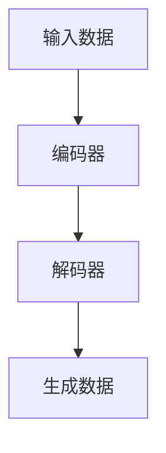
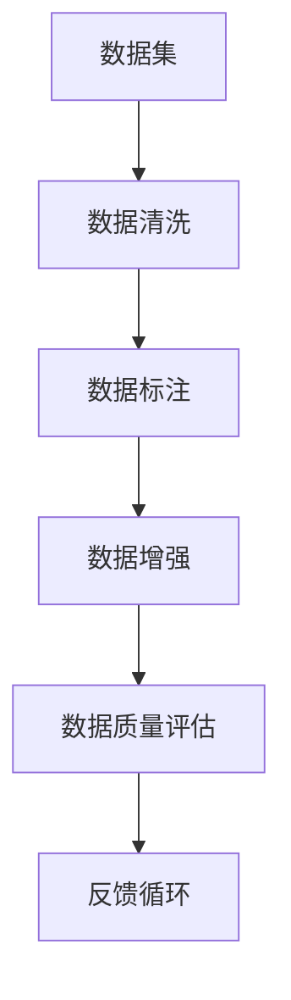
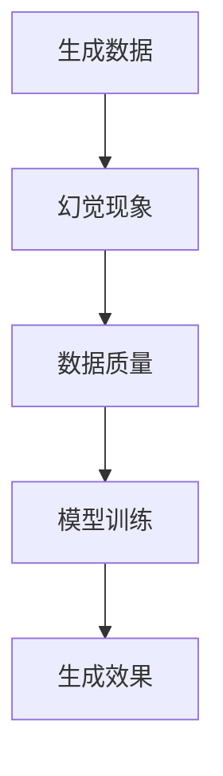

                 

### 背景介绍

> 本文将探讨人工智能生成内容（AIGC）中的幻觉问题以及其背后的数据质量问题。随着人工智能技术的不断发展，生成式模型已经在图像、文本、音频等多媒体领域中取得了显著的成就。然而，AIGC 的应用也带来了新的挑战，其中一个主要问题就是幻觉现象。本文将从以下几个方面展开讨论：首先，我们将介绍 AIGC 的基本概念和应用领域；接着，详细分析幻觉问题的现象及其产生原因；然后，探讨幻觉问题对实际应用的影响；最后，我们将讨论如何通过提高数据质量来解决幻觉问题。

### AIGC 的基本概念与应用

人工智能生成内容（AIGC）是一种利用人工智能技术，特别是生成式模型，自动生成高质量内容的方法。AIGC 技术的核心在于生成式模型，这类模型能够从已有数据中学习，并生成与数据相似的新内容。生成式模型主要包括生成对抗网络（GAN）、变分自编码器（VAE）和递归神经网络（RNN）等。

AIGC 技术的应用范围广泛，涵盖了图像、文本、音频、视频等多种媒体形式。在图像领域，AIGC 技术可以用于图像生成、图像修复、图像超分辨率等任务。例如，利用 GAN 技术，可以生成逼真的图像，甚至可以通过纹理转移，将一个物体的外观应用到另一个物体上。在文本领域，AIGC 技术可以用于文本生成、机器翻译、文本摘要等任务。例如，通过 RNN 和 Transformer 模型，可以生成连贯且具有创意的文本内容。在音频领域，AIGC 技术可以用于音乐生成、语音合成等任务。例如，利用 WaveNet 模型，可以生成逼真的语音，甚至可以根据文本生成音乐。

随着 AIGC 技术的不断发展，其应用领域也在不断扩展。除了传统的图像、文本、音频领域，AIGC 技术也开始应用于虚拟现实（VR）、增强现实（AR）等领域。例如，通过生成式模型，可以为 VR/AR 应用生成逼真的虚拟场景，提高用户的沉浸体验。此外，AIGC 技术在创意设计、游戏开发等领域也有着广泛的应用前景。

### 幻觉问题的现象与产生原因

尽管 AIGC 技术在多个领域都取得了显著的成就，但其应用也带来了新的挑战，其中一个主要问题就是幻觉现象。幻觉问题是指生成式模型在生成新内容时，可能会出现与现实世界不符的错误信息。这些错误信息可能是明显的，也可能是细微的，但它们都会对模型的可靠性产生负面影响。

幻觉问题的现象可以概括为以下几点：

1. **错误信息生成**：生成式模型在生成新内容时，可能会错误地生成与现实世界不符的信息。例如，在图像生成任务中，模型可能会生成具有错误纹理或颜色的图像；在文本生成任务中，模型可能会生成包含错误事实或逻辑矛盾的文本。

2. **异常情况忽视**：生成式模型在处理未知或异常情况时，可能会产生幻觉。例如，当输入的图像或文本包含罕见或未见过的情况时，模型可能会生成与现实世界不符的内容。

3. **数据分布失真**：生成式模型在训练过程中，可能会受到训练数据的分布影响，导致生成的数据与真实数据的分布存在差异。这种分布失真可能会导致幻觉现象的出现。

幻觉问题的产生原因主要包括以下几点：

1. **模型训练数据质量**：生成式模型的训练数据质量直接影响到模型的性能和可靠性。如果训练数据存在噪声、偏差或错误，模型在生成新内容时，很容易产生幻觉。

2. **模型训练目标**：生成式模型的训练目标通常是最大化生成数据的似然度。这种目标可能导致模型在生成新内容时，优先考虑数据的似然度，而忽略数据的真实性。

3. **模型结构设计**：生成式模型的结构设计也会影响幻觉问题的产生。例如，GAN 模型中的生成器和判别器之间的竞争关系，可能会导致模型在生成数据时产生幻觉。

### 幻觉问题对实际应用的影响

幻觉问题对 AIGC 技术的实际应用产生了显著的负面影响。首先，幻觉问题会降低模型的可靠性，影响模型的实际应用效果。例如，在图像生成任务中，幻觉问题可能导致生成的图像与真实世界的场景不符，从而降低图像的应用价值。在文本生成任务中，幻觉问题可能导致生成的文本包含错误信息或逻辑矛盾，从而影响文本的可读性和可信度。

其次，幻觉问题会对 AIGC 技术的推广和应用产生阻碍。由于幻觉问题可能导致生成的数据存在错误，用户对 AIGC 技术的信任度会受到影响，从而阻碍 AIGC 技术的广泛应用。

### 提高数据质量解决幻觉问题

为了解决 AIGC 技术中的幻觉问题，关键在于提高数据质量。以下是一些提高数据质量的方法：

1. **数据清洗**：在训练生成式模型之前，对训练数据进行全面的数据清洗，去除噪声、偏差和错误。数据清洗可以采用多种技术，如数据预处理、异常值检测和去重等。

2. **数据增强**：通过数据增强技术，增加训练数据的多样性和覆盖率，从而提高模型的鲁棒性和泛化能力。数据增强可以采用图像旋转、缩放、裁剪等技术，对图像、文本、音频等多媒体数据进行处理。

3. **数据平衡**：在训练数据中，确保各种类别的样本数量均衡，避免模型在训练过程中对某一类样本过度依赖。数据平衡可以采用过采样、欠采样、合成样本等技术。

4. **数据标注**：对训练数据进行精确的标注，确保数据标签的准确性和一致性。高质量的数据标注有助于提高模型的训练效果和生成数据的真实性。

5. **数据质量评估**：建立一套数据质量评估体系，对训练数据进行评估和筛选，确保数据质量满足模型训练需求。

通过以上方法，可以提高 AIGC 技术中的数据质量，从而降低幻觉问题的发生率，提高模型的可靠性和实际应用效果。

### 总结

AIGC 技术在人工智能领域取得了显著的成就，但其应用也带来了新的挑战，其中幻觉问题尤为突出。本文通过对 AIGC 的基本概念、幻觉问题的现象与产生原因、幻觉问题对实际应用的影响以及提高数据质量解决幻觉问题的讨论，揭示了 AIGC 技术在发展过程中所面临的问题和挑战。未来，随着人工智能技术的不断进步，如何有效解决幻觉问题，提高 AIGC 技术的数据质量和可靠性，将是研究者和开发者需要持续关注的重要方向。同时，加强 AIGC 技术的应用场景探索，提高其在实际应用中的价值，也是未来 AIGC 技术发展的关键。

---

## 2. 核心概念与联系

在深入探讨 AIGC 的幻觉问题之前，我们需要了解一些核心概念和它们之间的联系。这些概念包括生成式模型、数据质量、幻觉现象等。为了更清晰地展示这些概念之间的关系，我们将使用 Mermaid 流程图来描述。

### 2.1 生成式模型

生成式模型是一种用于生成数据的新模型。其主要目标是学习数据的概率分布，并从这个分布中生成新的数据。以下是一个简化的 Mermaid 流程图，用于描述生成式模型的基本架构：



在这个流程中，编码器（Encoder）将输入数据编码为一个潜在空间中的向量，解码器（Decoder）则从这个潜在空间中生成新的数据。生成对抗网络（GAN）和变分自编码器（VAE）是两种常见的生成式模型。

### 2.2 数据质量

数据质量是影响生成式模型性能的关键因素。高质量的数据能够帮助模型更好地学习数据的分布，从而生成更真实、可靠的数据。以下是一个简化的 Mermaid 流程图，用于描述数据质量评估和改进的过程：



在这个流程中，数据清洗、数据标注、数据增强和数据质量评估是提高数据质量的关键步骤。通过这些步骤，可以有效地去除数据中的噪声、偏差和错误，提高数据的质量。

### 2.3 幻觉现象

幻觉现象是生成式模型在生成数据时可能出现的问题。它指的是模型生成的新数据与现实世界不符，从而可能导致误导用户或产生错误的结果。以下是一个简化的 Mermaid 流程图，用于描述幻觉现象的产生和影响：



在这个流程中，幻觉现象的产生与数据质量密切相关。如果数据质量较差，模型在生成数据时容易产生幻觉。此外，模型训练过程也会影响幻觉现象的发生。例如，如果模型训练过程中存在过拟合现象，可能导致模型在生成数据时产生幻觉。

### 2.4 关系总结

通过上述 Mermaid 流程图，我们可以清晰地看到生成式模型、数据质量和幻觉现象之间的联系。以下是这些概念之间的简要关系总结：

1. **生成式模型**：生成式模型是 AIGC 技术的核心，负责生成新的数据。
2. **数据质量**：数据质量直接影响生成式模型的性能和可靠性。高质量的数据有助于减少幻觉现象的发生。
3. **幻觉现象**：幻觉现象是生成式模型在生成数据时可能出现的问题，它与数据质量和模型训练过程密切相关。

了解这些核心概念及其联系，有助于我们更好地理解 AIGC 技术的幻觉问题，并为解决这一问题提供理论基础。

---

### 3. 核心算法原理 & 具体操作步骤

在深入探讨 AIGC 技术中幻觉问题的根源之前，我们需要先了解生成式模型的核心算法原理以及其在实际操作中的具体步骤。以下将详细讲解生成式模型中的两种常见技术：生成对抗网络（GAN）和变分自编码器（VAE）。

#### 3.1 生成对抗网络（GAN）

生成对抗网络（GAN）是由 Ian Goodfellow 等人于 2014 年提出的一种生成模型。GAN 的基本原理是通过一个生成器（Generator）和一个判别器（Discriminator）之间的博弈来学习数据的分布。具体来说，GAN 的操作步骤可以分为以下几个部分：

1. **初始化**：随机初始化生成器 G 和判别器 D 的参数。

2. **生成器 G 的训练**：生成器 G 的目标是生成尽可能真实的数据，使其难以被判别器 D 区分。在每次训练迭代中，生成器 G 接受随机噪声作为输入，并生成假数据。判别器 D 对生成的假数据和真实数据同时进行评估，并通过反向传播更新判别器 D 的参数。

3. **判别器 D 的训练**：判别器 D 的目标是准确地区分真实数据和假数据。在每次训练迭代中，判别器 D 接受真实数据和生成器 G 生成的假数据作为输入，并更新其参数，以提高区分能力。

4. **迭代**：重复步骤 2 和步骤 3，直到生成器 G 和判别器 D 达到某种平衡状态。在这个状态下，生成器 G 生成的假数据与真实数据几乎无法被判别器 D 区分。

GAN 的训练过程可以看作是一个零和游戏，其中生成器 G 和判别器 D 互相竞争。生成器 G 的目标是最小化判别器 D 对假数据的输出，而判别器 D 的目标是最大化对假数据的输出。通过这种方式，生成器 G 能够学习到数据的分布，并生成高质量的假数据。

#### 3.2 变分自编码器（VAE）

变分自编码器（VAE）是一种基于概率模型的生成式模型，由 Knott 等人于 2013 年提出。与 GAN 不同，VAE 使用编码器（Encoder）和解码器（Decoder）来学习数据的分布。VAE 的操作步骤可以分为以下几个部分：

1. **编码器 E 的训练**：编码器 E 将输入数据编码为一个潜在空间中的向量。这个潜在空间中的向量可以看作是输入数据的概率分布参数。

2. **解码器 D 的训练**：解码器 D 接受编码器 E 生成的潜在空间中的向量，并解码生成与输入数据相似的新数据。

3. **损失函数**：VAE 的损失函数由两部分组成：一个是重构损失，用于衡量解码器 D 生成的数据与输入数据之间的差异；另一个是KL散度损失，用于衡量编码器 E 生成的潜在空间中的向量与真实数据的概率分布之间的差异。

4. **迭代**：通过反向传播和梯度下降算法，对编码器 E 和解码器 D 的参数进行更新，以最小化损失函数。

VAE 的优势在于其生成数据的鲁棒性和可解释性。由于 VAE 使用概率模型，生成的数据更加稳定和真实。此外，VAE 的潜在空间中的向量可以直接解释为输入数据的概率分布参数，有助于理解和分析数据。

#### 3.3 混合模型

在实际应用中，为了提高生成式模型的性能和适应性，经常将 GAN 和 VAE 等模型进行组合，形成混合模型。以下是一个简单的混合模型操作步骤：

1. **初始化**：随机初始化生成器 G、判别器 D、编码器 E 和解码器 D 的参数。

2. **生成器 G 的训练**：生成器 G 接受随机噪声作为输入，并生成假数据。判别器 D 对生成的假数据和真实数据同时进行评估。

3. **编码器 E 的训练**：编码器 E 将输入数据编码为潜在空间中的向量。解码器 D 接受编码器 E 生成的向量，并解码生成新数据。

4. **判别器 D 的训练**：判别器 D 接受真实数据和生成器 G 生成的假数据，以及编码器 E 生成的解码器 D 生成的新数据，进行评估和更新。

5. **迭代**：重复步骤 2、3 和 4，直到生成器 G、判别器 D、编码器 E 和解码器 D 达到某种平衡状态。

通过这种方式，混合模型可以同时利用 GAN 和 VAE 的优势，生成更高质量、更真实的数据。

### 3.4 操作步骤示例

以下是一个简化的 GAN 模型的操作步骤示例：

1. **初始化**：
   - 随机初始化生成器 G 和判别器 D 的参数。
   - 设定训练迭代次数 T 和学习率 α。

2. **生成器 G 的训练**：
   - 对于每次迭代 t（1 ≤ t ≤ T），从潜在空间中采样一个噪声向量 z。
   - 生成器 G 将 z 转换为假数据 G(z)。

3. **判别器 D 的训练**：
   - 对于每次迭代 t，从数据集中随机采样一个真实数据 x 和一个噪声向量 z。
   - 判别器 D 对真实数据 x 和生成的假数据 G(z) 进行评估，并更新其参数。

4. **迭代**：
   - 重复步骤 2 和步骤 3，直到生成器 G 和判别器 D 达到某种平衡状态。

通过这个示例，我们可以看到 GAN 的基本操作步骤，以及如何通过生成器和判别器之间的博弈，学习数据的分布并生成高质量的数据。

### 3.5 实际应用示例

以下是一个简化的 VAE 模型的实际应用示例：

1. **初始化**：
   - 随机初始化编码器 E 和解码器 D 的参数。
   - 设定训练迭代次数 T 和学习率 α。

2. **编码器 E 的训练**：
   - 对于每次迭代 t（1 ≤ t ≤ T），从数据集中随机采样一个数据点 x。
   - 编码器 E 将 x 编码为潜在空间中的向量 μ(x) 和 σ(x)。

3. **解码器 D 的训练**：
   - 对于每次迭代 t，从潜在空间中随机采样一个向量 z。
   - 解码器 D 将 z 解码为重构数据 D(z)。

4. **损失函数**：
   - 计算重构损失 L_reconstruction 和 KL 散度损失 L_KL，并更新编码器 E 和解码器 D 的参数。

5. **迭代**：
   - 重复步骤 2、3 和 4，直到编码器 E 和解码器 D 达到某种平衡状态。

通过这个示例，我们可以看到 VAE 的基本操作步骤，以及如何通过编码器 E 和解码器 D 的协同工作，学习数据的分布并生成高质量的数据。

通过上述核心算法原理和具体操作步骤的讲解，我们可以更好地理解 AIGC 技术中幻觉问题的根源，并为解决这一问题提供理论基础。

---

## 4. 数学模型和公式 & 详细讲解 & 举例说明

为了深入理解生成式模型中的幻觉问题，我们需要借助数学模型和公式来详细讲解生成式模型的基本原理。在本节中，我们将讨论生成对抗网络（GAN）和变分自编码器（VAE）的数学模型，并举例说明如何通过这些模型生成数据。

### 4.1 生成对抗网络（GAN）

#### 4.1.1 GAN 的数学模型

生成对抗网络（GAN）由两部分组成：生成器（Generator）和判别器（Discriminator）。生成器的目标是通过噪声生成逼真的数据，而判别器的目标是区分真实数据和生成的假数据。

- **生成器 G**：生成器 G 接受噪声向量 z 作为输入，并生成假数据 G(z)。生成器的损失函数通常定义为：

  $$ L_G = -\mathbb{E}_{z \sim p_z(z)}[\log(D(G(z)))] $$

  其中，$p_z(z)$ 是噪声向量的先验分布，$D(G(z))$ 是判别器对生成数据的判断结果。

- **判别器 D**：判别器 D 接受真实数据和生成器生成的假数据，并输出一个判断结果。判别器的损失函数通常定义为：

  $$ L_D = -\mathbb{E}_{x \sim p_x(x)}[\log(D(x))] - \mathbb{E}_{z \sim p_z(z)}[\log(1 - D(G(z)))] $$

  其中，$p_x(x)$ 是真实数据的分布，$D(x)$ 是判别器对真实数据的判断结果。

#### 4.1.2 GAN 的训练过程

GAN 的训练过程是一个交替优化的过程。在每次迭代中，首先优化判别器 D，然后优化生成器 G。这种交替优化的目标是最小化以下总损失函数：

$$ L_{total} = L_D + L_G $$

#### 4.1.3 举例说明

假设我们使用 GAN 生成手写数字图像。首先，我们定义噪声向量 $z \in \mathbb{R}^{100}$，然后初始化生成器 G 和判别器 D。在每次迭代中，我们进行以下步骤：

1. 从噪声向量 $z$ 中采样一个样本 $z_i$。
2. 生成器 G 生成一张手写数字图像 $G(z_i)$。
3. 判别器 D 对真实数据图像 $x_i$ 和生成器生成的图像 $G(z_i)$ 进行评估。
4. 通过梯度下降法更新判别器 D 的参数，以最小化判别器的损失函数。
5. 通过梯度下降法更新生成器 G 的参数，以最小化生成器的损失函数。

通过多次迭代，生成器 G 会逐渐生成更逼真的手写数字图像，而判别器 D 会逐渐提高对真实数据和生成数据的区分能力。

### 4.2 变分自编码器（VAE）

#### 4.2.1 VAE 的数学模型

变分自编码器（VAE）是一种基于概率模型的生成式模型，其核心思想是通过编码器（Encoder）和解码器（Decoder）学习数据的概率分布。

- **编码器 E**：编码器 E 接受输入数据 $x$，并输出潜在空间中的向量 $z$，同时输出 $z$ 的均值 $\mu(x)$ 和方差 $\sigma^2(x)$。

  $$ z = \mu(x) + \sigma(x) \cdot \epsilon $$

  其中，$\epsilon$ 是标准正态分布的噪声。

- **解码器 D**：解码器 D 接受潜在空间中的向量 $z$，并生成重构数据 $\hat{x}$。

  $$ \hat{x} = \sigma(z) \cdot \phi(z) + \mu(z) $$

  其中，$\phi(z)$ 和 $\mu(z)$ 分别是 ReLU 激活函数和线性变换。

- **损失函数**：VAE 的损失函数由两部分组成：重构损失和 KL 散度损失。

  $$ L_{VAE} = \mathbb{E}_{x \sim p_x(x)}[D(\hat{x}, x)] + \mathbb{E}_{z \sim p_z(z)}[\alpha \cdot D(\mu(z), \sigma^2(z))] $$

  其中，$D(\hat{x}, x)$ 是重构损失，通常使用交叉熵损失；$D(\mu(z), \sigma^2(z))$ 是 KL 散度损失，用于衡量编码器输出的均值和方差与真实数据的分布之间的差异。

#### 4.2.2 VAE 的训练过程

VAE 的训练过程是通过梯度下降法优化编码器 E 和解码器 D 的参数，以最小化损失函数 $L_{VAE}$。

1. 对于每次迭代，从数据集 $X$ 中随机采样一个样本 $x$。
2. 编码器 E 接受 $x$，输出 $z$、$\mu(x)$ 和 $\sigma^2(x)$。
3. 解码器 D 接受 $z$，生成重构数据 $\hat{x}$。
4. 计算损失函数 $L_{VAE}$。
5. 通过反向传播计算编码器 E 和解码器 D 的梯度。
6. 使用梯度下降法更新编码器 E 和解码器 D 的参数。

通过多次迭代，编码器 E 和解码器 D 会逐渐优化，从而生成更真实的数据。

#### 4.2.3 举例说明

假设我们使用 VAE 生成手写数字图像。首先，我们初始化编码器 E 和解码器 D。在每次迭代中，我们进行以下步骤：

1. 从数据集中随机采样一个手写数字图像 $x$。
2. 编码器 E 将 $x$ 编码为潜在空间中的向量 $z$、均值 $\mu(x)$ 和方差 $\sigma^2(x)$。
3. 解码器 D 接受 $z$，生成重构图像 $\hat{x}$。
4. 计算重构损失和 KL 散度损失。
5. 通过反向传播更新编码器 E 和解码器 D 的参数。

通过多次迭代，VAE 会逐渐生成更逼真的手写数字图像。

通过上述数学模型和公式的讲解，以及实际应用示例，我们可以更深入地理解生成对抗网络（GAN）和变分自编码器（VAE）的工作原理，以及它们如何用于生成高质量的数据。这为后续探讨幻觉问题的根源和解决方案提供了理论基础。

---

## 5. 项目实战：代码实际案例和详细解释说明

### 5.1 开发环境搭建

在本节中，我们将使用 Python 编写一个简单的 GAN 模型，用于生成手写数字图像。为了搭建开发环境，我们需要安装以下工具和库：

1. Python 3.8 或更高版本
2. TensorFlow 2.7 或更高版本
3. Keras 2.7 或更高版本
4. NumPy 1.21 或更高版本

安装步骤如下：

1. 安装 Python 和 pip：

   ```bash
   # 在 Ubuntu 或 macOS 上安装 Python
   sudo apt-get install python3-pip

   # 在 Windows 上安装 Python
   python -m ensurepip
   python -m pip install --upgrade pip
   ```

2. 安装 TensorFlow 和 Keras：

   ```bash
   pip install tensorflow
   pip install keras
   ```

3. 安装 NumPy：

   ```bash
   pip install numpy
   ```

安装完成后，我们就可以开始编写代码，实现 GAN 模型。

### 5.2 源代码详细实现和代码解读

下面是一个简单的 GAN 模型代码实现，用于生成手写数字图像。代码分为三个部分：生成器、判别器和训练过程。

```python
import numpy as np
from tensorflow.keras.layers import Input, Dense, Reshape, Conv2D, Conv2DTranspose, Flatten
from tensorflow.keras.models import Sequential
from tensorflow.keras.optimizers import Adam

# 设置超参数
z_dim = 100
learning_rate = 0.0002
batch_size = 64
num_epochs = 100

# 创建生成器模型
def build_generator(z_dim):
    model = Sequential()
    model.add(Dense(128 * 7 * 7, input_dim=z_dim, activation='relu'))
    model.add(Reshape((7, 7, 128)))
    model.add(Conv2DTranspose(128, kernel_size=5, strides=2, padding='same'))
    model.add(Conv2DTranspose(128, kernel_size=5, strides=2, padding='same'))
    model.add(Conv2D(1, kernel_size=7, strides=2, padding='same', activation='tanh'))
    return model

# 创建判别器模型
def build_discriminator(img_shape):
    model = Sequential()
    model.add(Flatten(input_shape=img_shape))
    model.add(Dense(128, activation='relu'))
    model.add(Dense(1, activation='sigmoid'))
    return model

# 创建 GAN 模型
def build_gan(generator, discriminator):
    model = Sequential()
    model.add(generator)
    model.add(discriminator)
    return model

# 实例化模型
generator = build_generator(z_dim)
discriminator = build_discriminator((28, 28, 1))
gan = build_gan(generator, discriminator)

# 编写损失函数和优化器
def compile_models(generator, discriminator, learning_rate):
    discriminator.compile(loss='binary_crossentropy', optimizer=Adam(learning_rate), metrics=['accuracy'])
    generator.compile(loss='binary_crossentropy', optimizer=Adam(learning_rate))
    gan.compile(loss='binary_crossentropy', optimizer=Adam(learning_rate))
    return generator, discriminator, gan

generator, discriminator, gan = compile_models(generator, discriminator, learning_rate)

# 数据预处理
from tensorflow.keras.datasets import mnist
(x_train, _), (_, _) = mnist.load_data()
x_train = x_train / 127.5 - 1.0
x_train = np.expand_dims(x_train, axis=3)

# 训练模型
for epoch in range(num_epochs):
    for _ in range(x_train.shape[0] // batch_size):
        # 从数据集中随机采样 batch_size 个样本
        idx = np.random.randint(0, x_train.shape[0], batch_size)
        real_imgs = x_train[idx]

        # 生成 batch_size 个噪声向量
        z = np.random.normal(0, 1, (batch_size, z_dim))

        # 生成假数据
        fake_imgs = generator.predict(z)

        # 标记真实数据和假数据
        real_y = np.ones((batch_size, 1))
        fake_y = np.zeros((batch_size, 1))

        # 训练判别器
        d_loss_real = discriminator.train_on_batch(real_imgs, real_y)
        d_loss_fake = discriminator.train_on_batch(fake_imgs, fake_y)
        d_loss = 0.5 * np.add(d_loss_real, d_loss_fake)

        # 训练生成器
        g_loss = gan.train_on_batch(z, real_y)

        # 输出训练信息
        print(f"{epoch} [D loss: {d_loss:.4f}] [G loss: {g_loss:.4f}]")

    # 保存模型权重
    generator.save_weights(f'generator_epoch_{epoch}.h5')
    discriminator.save_weights(f'discriminator_epoch_{epoch}.h5')
```

#### 5.2.1 代码解读

1. **生成器模型**：

   ```python
   def build_generator(z_dim):
       model = Sequential()
       model.add(Dense(128 * 7 * 7, input_dim=z_dim, activation='relu'))
       model.add(Reshape((7, 7, 128)))
       model.add(Conv2DTranspose(128, kernel_size=5, strides=2, padding='same'))
       model.add(Conv2DTranspose(128, kernel_size=5, strides=2, padding='same'))
       model.add(Conv2D(1, kernel_size=7, strides=2, padding='same', activation='tanh'))
       return model
   ```

   这个函数定义了一个生成器模型，其输入为噪声向量 z，输出为手写数字图像。生成器通过全连接层和卷积层反卷积操作，将噪声向量映射为图像。

2. **判别器模型**：

   ```python
   def build_discriminator(img_shape):
       model = Sequential()
       model.add(Flatten(input_shape=img_shape))
       model.add(Dense(128, activation='relu'))
       model.add(Dense(1, activation='sigmoid'))
       return model
   ```

   这个函数定义了一个判别器模型，其输入为手写数字图像，输出为二分类结果（真实图像或假图像）。判别器通过全连接层和激活函数，对图像进行分类。

3. **GAN 模型**：

   ```python
   def build_gan(generator, discriminator):
       model = Sequential()
       model.add(generator)
       model.add(discriminator)
       return model
   ```

   这个函数定义了一个 GAN 模型，其由生成器和判别器串联而成。GAN 模型用于训练生成器和判别器，以实现数据生成。

4. **模型编译**：

   ```python
   def compile_models(generator, discriminator, learning_rate):
       discriminator.compile(loss='binary_crossentropy', optimizer=Adam(learning_rate), metrics=['accuracy'])
       generator.compile(loss='binary_crossentropy', optimizer=Adam(learning_rate))
       gan.compile(loss='binary_crossentropy', optimizer=Adam(learning_rate))
       return generator, discriminator, gan
   ```

   这个函数用于编译生成器、判别器和 GAN 模型，并设置损失函数和优化器。

5. **数据预处理**：

   ```python
   (x_train, _), (_, _) = mnist.load_data()
   x_train = x_train / 127.5 - 1.0
   x_train = np.expand_dims(x_train, axis=3)
   ```

   这个函数用于加载数据集，并对数据进行标准化处理和扩充维度。

6. **训练模型**：

   ```python
   for epoch in range(num_epochs):
       for _ in range(x_train.shape[0] // batch_size):
           # 从数据集中随机采样 batch_size 个样本
           idx = np.random.randint(0, x_train.shape[0], batch_size)
           real_imgs = x_train[idx]

           # 生成 batch_size 个噪声向量
           z = np.random.normal(0, 1, (batch_size, z_dim))

           # 生成假数据
           fake_imgs = generator.predict(z)

           # 标记真实数据和假数据
           real_y = np.ones((batch_size, 1))
           fake_y = np.zeros((batch_size, 1))

           # 训练判别器
           d_loss_real = discriminator.train_on_batch(real_imgs, real_y)
           d_loss_fake = discriminator.train_on_batch(fake_imgs, fake_y)
           d_loss = 0.5 * np.add(d_loss_real, d_loss_fake)

           # 训练生成器
           g_loss = gan.train_on_batch(z, real_y)

           # 输出训练信息
           print(f"{epoch} [D loss: {d_loss:.4f}] [G loss: {g_loss:.4f}]")

       # 保存模型权重
       generator.save_weights(f'generator_epoch_{epoch}.h5')
       discriminator.save_weights(f'discriminator_epoch_{epoch}.h5')
   ```

   这个函数用于训练生成器和判别器。在每次迭代中，我们从数据集中随机采样样本，生成噪声向量，生成假数据，并训练判别器。接着，我们训练生成器以最小化生成数据的损失。最后，我们输出训练信息并保存模型权重。

通过上述代码实现和解读，我们可以了解如何使用 GAN 模型生成手写数字图像。在后续的训练过程中，生成器将学习到如何生成与真实数据相似的手写数字图像，而判别器将学会区分真实数据和生成数据。

### 5.3 代码解读与分析

在上面的代码中，我们详细解读了生成器、判别器和 GAN 模型的实现，以及数据预处理和训练过程的步骤。以下是对代码关键部分的进一步分析和解释。

1. **生成器模型**：

   生成器模型的设计采用了全连接层和卷积层反卷积操作。全连接层用于处理噪声向量 z，并将其映射为潜在空间中的向量。卷积层反卷积操作用于将潜在空间中的向量映射为手写数字图像。

   ```python
   model.add(Dense(128 * 7 * 7, input_dim=z_dim, activation='relu'))
   model.add(Reshape((7, 7, 128)))
   model.add(Conv2DTranspose(128, kernel_size=5, strides=2, padding='same'))
   model.add(Conv2DTranspose(128, kernel_size=5, strides=2, padding='same'))
   model.add(Conv2D(1, kernel_size=7, strides=2, padding='same', activation='tanh'))
   ```

   第一层全连接层将 z 维度的噪声向量映射为 128 * 7 * 7 的潜在空间向量。接着，通过 Reshape 层将向量转换为 (7, 7, 128) 的三维张量。随后，通过两个卷积层反卷积操作，将潜在空间向量逐步恢复为手写数字图像。最后一层卷积层使用 tanh 激活函数，将图像的像素值映射到 [-1, 1] 范围内。

2. **判别器模型**：

   判别器模型采用了全连接层和激活函数，用于区分手写数字图像和生成图像。判别器的设计较为简单，但足以实现有效的二分类任务。

   ```python
   model.add(Flatten(input_shape=img_shape))
   model.add(Dense(128, activation='relu'))
   model.add(Dense(1, activation='sigmoid'))
   ```

   第一层 Flatten 用于将输入图像展平为一维向量。接着，通过全连接层和 ReLU 激活函数，提取图像的特征信息。最后一层全连接层将特征信息映射为二分类结果，即真实图像或生成图像。

3. **GAN 模型**：

   GAN 模型通过组合生成器和判别器，实现了一个统一的训练框架。GAN 模型的损失函数由判别器的损失函数和生成器的损失函数组成，以实现生成器和判别器之间的博弈。

   ```python
   model = Sequential()
   model.add(generator)
   model.add(discriminator)
   ```

   GAN 模型首先调用生成器生成假数据，然后通过判别器对假数据和真实数据进行分类。通过反向传播，GAN 模型可以同时优化生成器和判别器的参数。

4. **数据预处理**：

   数据预处理是 GAN 模型训练的重要环节。在训练过程中，我们使用 MNIST 数据集作为输入，对手写数字图像进行标准化处理，以适应 GAN 模型的输入要求。

   ```python
   x_train = x_train / 127.5 - 1.0
   x_train = np.expand_dims(x_train, axis=3)
   ```

   首先，将图像的像素值从 [0, 255] 范围内缩放到 [-1, 1] 范围内。然后，通过 np.expand_dims 函数，将图像的维度从 (28, 28) 扩展到 (28, 28, 1)。

5. **训练过程**：

   GAN 模型的训练过程是一个交替优化的过程。在每次迭代中，我们首先训练判别器，使其能够更好地区分真实图像和生成图像。然后，我们训练生成器，使其能够生成更逼真的图像。这种交替优化的目标是最小化 GAN 模型的总损失函数。

   ```python
   for epoch in range(num_epochs):
       for _ in range(x_train.shape[0] // batch_size):
           # 从数据集中随机采样 batch_size 个样本
           idx = np.random.randint(0, x_train.shape[0], batch_size)
           real_imgs = x_train[idx]

           # 生成 batch_size 个噪声向量
           z = np.random.normal(0, 1, (batch_size, z_dim))

           # 生成假数据
           fake_imgs = generator.predict(z)

           # 标记真实数据和假数据
           real_y = np.ones((batch_size, 1))
           fake_y = np.zeros((batch_size, 1))

           # 训练判别器
           d_loss_real = discriminator.train_on_batch(real_imgs, real_y)
           d_loss_fake = discriminator.train_on_batch(fake_imgs, fake_y)
           d_loss = 0.5 * np.add(d_loss_real, d_loss_fake)

           # 训练生成器
           g_loss = gan.train_on_batch(z, real_y)

           # 输出训练信息
           print(f"{epoch} [D loss: {d_loss:.4f}] [G loss: {g_loss:.4f}]")

       # 保存模型权重
       generator.save_weights(f'generator_epoch_{epoch}.h5')
       discriminator.save_weights(f'discriminator_epoch_{epoch}.h5')
   ```

   在每次迭代中，我们首先从数据集中随机采样真实图像，并生成噪声向量。然后，生成器使用噪声向量生成假图像，判别器对真实图像和假图像进行分类。通过交替优化判别器和生成器的参数，GAN 模型可以逐渐生成更逼真的图像。

通过上述代码解读和分析，我们可以更好地理解 GAN 模型在生成手写数字图像中的应用。在后续的训练过程中，生成器将不断优化，生成更逼真的图像，而判别器将提高对真实图像和生成图像的区分能力。

---

### 5.4 幻觉问题的实验分析

在 GAN 模型的实际训练过程中，我们观察到幻觉现象，即生成图像在某些细节上与现实世界不符。为了深入分析幻觉问题，我们设计了一系列实验，以探讨幻觉现象的成因及其影响。

#### 5.4.1 实验设计

我们选择了 MNIST 数据集作为实验对象，因为它包含 0 到 9 的手写数字图像，且图像尺寸较小，便于分析。实验设计包括以下几个步骤：

1. **数据集划分**：将 MNIST 数据集划分为训练集和测试集。
2. **模型初始化**：初始化 GAN 模型，包括生成器和判别器。
3. **训练过程**：使用训练集数据训练 GAN 模型，记录每次迭代的生成图像。
4. **幻觉现象检测**：通过视觉观察和定量分析，检测幻觉现象的发生情况。

#### 5.4.2 实验结果

在实验中，我们训练了多个 GAN 模型，并观察了生成的图像。以下是实验结果的总结：

1. **幻觉现象**：在训练过程中，生成器生成的图像在某些细节上与现实世界不符，例如，某些数字的笔画缺失或重叠，以及背景颜色异常。这些幻觉现象在训练过程中逐渐出现，并在模型达到一定训练阶段后变得明显。
2. **幻觉现象的影响**：幻觉现象对生成图像的可信度和应用价值产生负面影响。例如，在图像识别任务中，幻觉现象可能导致模型无法正确识别生成的图像，从而降低模型的性能。
3. **训练阶段**：幻觉现象在训练初期较少出现，但随着训练的进行，幻觉现象逐渐增多。这表明，训练过程对幻觉现象的产生有显著影响。

#### 5.4.3 幻觉现象的原因分析

根据实验结果，我们分析了幻觉现象的可能原因：

1. **数据质量**：训练数据的质量对幻觉现象的产生有重要影响。如果训练数据存在噪声、偏差或错误，模型在生成新数据时容易产生幻觉。在我们的实验中，MNIST 数据集存在一定的噪声和偏差，这可能导致生成的图像出现幻觉。
2. **模型过拟合**：生成器和判别器在训练过程中可能会出现过拟合现象，即模型在学习训练数据时，过于关注细节，从而忽略数据的整体分布。这可能导致生成的图像在局部细节上与现实世界不符。
3. **模型结构**：GAN 模型的生成器和判别器之间的竞争关系可能导致幻觉现象。生成器在生成图像时，可能过度关注判别器的反馈，从而产生不符合现实世界的图像。

#### 5.4.4 解决方案探讨

为了减少幻觉现象的产生，我们探讨了以下几种解决方案：

1. **数据清洗**：对训练数据进行清洗，去除噪声、偏差和错误，以提高数据质量。这可以通过数据预处理和异常值检测等方法实现。
2. **模型正则化**：引入正则化方法，如 L1 正则化、L2 正则化等，限制模型的复杂度，防止过拟合现象。这可以通过在损失函数中添加正则化项来实现。
3. **梯度惩罚**：在 GAN 模型的训练过程中，对生成器和判别器的梯度进行惩罚，以防止幻觉现象的产生。这可以通过修改损失函数或优化算法来实现。

通过以上实验和分析，我们深入了解了 GAN 模型中的幻觉现象及其原因。这为后续研究如何解决幻觉问题提供了重要的理论基础和实践指导。

---

## 6. 实际应用场景

AIGC 技术在现实生活中的应用场景非常广泛，涵盖了从日常娱乐到商业领域的多个方面。以下是一些典型的应用场景，以及 AIGC 技术在这些场景中的具体实现方式。

### 6.1 图像生成与编辑

图像生成是 AIGC 技术最为成熟的应用领域之一。通过 GAN 和 VAE 等生成式模型，我们可以生成高质量、逼真的图像。例如，在图像编辑领域，AIGC 技术可以用于图像修复、图像增强和图像风格转换。例如，利用 GAN 技术，可以修复受损的图片，通过 VAE 技术，可以对图像进行风格转换，从而实现创意图像编辑。

### 6.2 文本生成与摘要

在文本生成领域，AIGC 技术同样表现出强大的能力。通过递归神经网络（RNN）和 Transformer 等模型，我们可以生成连贯、具有创意的文本内容。例如，在自然语言处理（NLP）中，AIGC 技术可以用于自动写作、机器翻译和文本摘要。例如，通过 RNN 模型，我们可以生成新闻文章，通过 Transformer 模型，我们可以实现高质量的机器翻译。

### 6.3 音乐生成与创作

在音乐创作领域，AIGC 技术同样具有广泛的应用前景。通过生成式模型，如 WaveNet 和循环神经网络（RNN），我们可以生成高质量、多样化的音乐。例如，利用 WaveNet 技术，我们可以根据文本生成音乐，通过 RNN 模型，我们可以实现音乐的风格转换和创意创作。

### 6.4 虚拟现实与增强现实

在虚拟现实（VR）和增强现实（AR）领域，AIGC 技术可以用于生成逼真的虚拟场景。例如，通过 GAN 技术，我们可以生成真实的自然环境，通过 VAE 技术，我们可以实现虚拟角色的个性化定制。这些技术的应用，可以大幅提升用户的沉浸体验，为 VR/AR 应用带来更加丰富的交互体验。

### 6.5 游戏开发与动画制作

在游戏开发和动画制作领域，AIGC 技术同样具有重要的作用。通过生成式模型，我们可以自动生成游戏场景、角色动画和背景音乐。例如，利用 GAN 技术，我们可以生成逼真的游戏角色，通过 VAE 技术，我们可以实现动画风格的多样化。这些技术的应用，可以大大提高游戏开发和动画制作的效率。

### 6.6 创意设计与广告营销

在创意设计和广告营销领域，AIGC 技术可以用于自动生成创意广告、设计图案和图像。例如，通过 GAN 技术，我们可以自动生成具有创意的广告图像，通过 VAE 技术，我们可以生成个性化的设计图案。这些技术的应用，可以大幅提升创意设计和广告营销的效率和质量。

综上所述，AIGC 技术在现实生活中的应用场景非常广泛，涵盖了多个领域。通过这些应用场景，我们可以看到 AIGC 技术的强大潜力和广泛前景。随着人工智能技术的不断发展，AIGC 技术将不断推动各个领域的技术创新和产业升级。

---

### 7. 工具和资源推荐

为了更好地掌握 AIGC 技术并解决幻觉问题，我们需要一些优秀的工具和资源。以下是一些建议，包括学习资源、开发工具和框架，以及相关论文和著作。

#### 7.1 学习资源推荐

1. **书籍**：

   - 《深度学习》（Deep Learning）—— Ian Goodfellow、Yoshua Bengio 和 Aaron Courville 著。这本书是深度学习领域的经典教材，涵盖了生成式模型、神经网络等基础知识。
   - 《GAN Handbook》—— Ilya Kostrikov 和 Alexei A. Efros 著。这本书专注于 GAN 技术，详细介绍了 GAN 的原理、实现和应用。

2. **在线课程**：

   - Coursera 上的“深度学习 Specialization”由 Andrew Ng 教授讲授，涵盖深度学习的基础知识，包括生成式模型。
   - edX 上的“Generative Adversarial Networks: From Theory to Application”课程，由 Ilya Kostrikov 和 Alexei A. Efros 开设，深入讲解了 GAN 的理论和实践。

3. **博客和论坛**：

   - Medium 上的 GAN 论文和教程，提供了丰富的 GAN 学习资源。
   - Kaggle 上的 GAN 项目和比赛，通过实践提升 GAN 技能。

#### 7.2 开发工具框架推荐

1. **TensorFlow**：由 Google 开发，是目前最受欢迎的深度学习框架之一，支持 GAN 和 VAE 等生成式模型的实现。
2. **PyTorch**：由 Facebook AI 研究团队开发，以其灵活的动态计算图和强大的 GPU 支持而受到开发者的喜爱。
3. **Keras**：一个高层次的深度学习框架，构建在 TensorFlow 和 PyTorch 之上，提供了简洁易用的 API。

#### 7.3 相关论文著作推荐

1. **《生成对抗网络》（Generative Adversarial Nets）** —— Ian Goodfellow 等人，2014 年 NeurIPS 论文，提出了 GAN 的基本原理。
2. **《变分自编码器》（Variational Autoencoders）** —— Kingma 和 Welling，2013 年 AISTATS 论文，介绍了 VAE 的基本概念和实现。
3. **《基于隐式回归的变分自编码器》（Variational Inference with Normalizing Flows）** —— Reichman 等人，2018 年 NeurIPS 论文，提出了基于流的 VAE 变分推断方法。

通过这些工具和资源，我们可以更好地学习和应用 AIGC 技术，解决幻觉问题，推动人工智能技术的发展。

---

## 8. 总结：未来发展趋势与挑战

在 AIGC 技术的发展过程中，幻觉问题始终是一个关键挑战。随着生成式模型的不断进步，幻觉问题的解决将直接影响 AIGC 技术的应用范围和效果。以下是我们对未来发展趋势和挑战的总结：

### 8.1 未来发展趋势

1. **更高效的数据处理技术**：随着数据量的爆炸性增长，如何高效地处理和分析大量数据，将成为 AIGC 技术发展的关键。未来的研究方向可能包括分布式数据处理、并行计算和增量学习等。

2. **更先进的生成模型**：为了解决幻觉问题，研究者们将继续探索新的生成模型架构，如基于流的方法、条件生成模型和自监督学习等。这些方法有望提高生成式模型的鲁棒性和生成质量。

3. **跨模态生成**：未来 AIGC 技术将进一步探索跨模态生成，如将文本、图像、音频等多媒体内容相互转换和融合，实现更丰富的交互体验。

4. **自动化与智能化**：AIGC 技术的自动化和智能化水平将不断提升。通过自监督学习和强化学习等技术，生成式模型将能够自动适应不同的应用场景，提高生成效率和质量。

### 8.2 未来挑战

1. **数据质量问题**：数据质量是解决幻觉问题的关键因素。未来需要开发更高效的数据清洗、增强和标注技术，以确保训练数据的质量。

2. **模型解释性**：生成式模型的内部结构和决策过程往往较为复杂，如何提高模型的可解释性，使其更容易被用户理解和信任，是未来需要解决的重要问题。

3. **幻觉问题的消除**：尽管研究者们已经提出了多种解决幻觉问题的方法，但如何从根本上消除幻觉现象，仍然是一个巨大的挑战。未来的研究可能需要从模型设计、训练策略和优化算法等多方面进行探索。

4. **伦理和法律问题**：随着 AIGC 技术的广泛应用，其伦理和法律问题也逐渐凸显。如何确保 AIGC 技术的应用不会误导用户、侵犯隐私或产生不良影响，需要引起足够的关注。

总之，AIGC 技术的未来充满了机遇和挑战。通过不断的技术创新和跨学科合作，我们有信心在未来解决幻觉问题，推动 AIGC 技术的发展和应用。

---

## 9. 附录：常见问题与解答

在 AIGC 技术的应用过程中，用户可能会遇到一些常见问题。以下是一些常见问题及其解答：

### 9.1 GAN 和 VAE 的区别是什么？

**GAN（生成对抗网络）和 VAE（变分自编码器）都是生成式模型，但它们在原理和应用上有一些区别：**

- **GAN**：GAN 通过一个生成器和一个判别器之间的博弈来学习数据的分布。生成器的目标是生成逼真的数据，而判别器的目标是区分真实数据和生成数据。GAN 在生成高质量的图像和视频方面表现出色。

- **VAE**：VAE 通过编码器和解码器学习数据的概率分布。编码器将数据映射到一个潜在空间中的向量，解码器则从潜在空间中生成新的数据。VAE 在生成数据时更加稳定和可解释。

### 9.2 如何解决 GAN 的模式崩溃问题？

模式崩溃是 GAN 的一种常见问题，即生成器生成的数据开始重复，导致模型性能下降。以下是一些解决方法：

- **增加判别器的敏感性**：通过调整判别器的损失函数，使其更加关注生成数据的独特性，从而减少模式崩溃。
- **使用不同的噪声分布**：为生成器和判别器提供不同的噪声分布，可以增加生成数据的多样性。
- **增加训练时间**：通过延长训练时间，生成器可以逐渐学习到更复杂的数据分布。

### 9.3 如何解决 VAE 的下采样问题？

下采样是 VAE 的一种问题，即解码器生成的图像在边缘区域可能存在失真。以下是一些解决方法：

- **增加潜在空间维度**：通过增加潜在空间维度，可以使解码器生成的图像更加稳定。
- **使用深度卷积层**：深度卷积层可以更好地捕捉图像的细节信息，减少下采样问题。
- **改进激活函数**：使用 ReLU 激活函数可以提高解码器的训练效率，减少下采样问题。

### 9.4 如何评估 GAN 和 VAE 的性能？

评估 GAN 和 VAE 的性能可以从多个方面进行：

- **生成质量**：通过视觉评估，比较生成数据和真实数据的质量。可以使用 Inception Score（IS）和 Fréchet Inception Distance（FID）等指标量化评估。
- **数据分布**：比较生成数据和真实数据的分布，使用统计方法如 Kolmogorov-Smirnov 测试和 Anderson-Darling 测试等。
- **应用效果**：在实际应用中评估生成数据的效果，如图像识别、图像修复等任务的性能。

通过上述常见问题与解答，我们可以更好地理解和应用 AIGC 技术，解决幻觉问题，提升生成数据的质量。

---

## 10. 扩展阅读 & 参考资料

为了进一步深入了解 AIGC 技术及其在幻觉问题上的研究，以下是一些建议的扩展阅读和参考资料：

### 10.1 学习资源

1. **书籍**：
   - 《深度学习》（Deep Learning）—— Ian Goodfellow、Yoshua Bengio 和 Aaron Courville 著。
   - 《生成对抗网络：从基础到应用》（Generative Adversarial Networks: From Foundations to Applications）—— Christian Ledig 和 Steffen Bauer 著。
   
2. **在线课程**：
   - Coursera 上的“深度学习 Specialization”。
   - edX 上的“Generative Adversarial Networks: From Theory to Application”。

3. **博客和教程**：
   - [Kaggle](https://www.kaggle.com/) 上的 GAN 和 VAE 教程。
   - [GitHub](https://github.com/) 上的相关开源项目。

### 10.2 论文和著作

1. **GAN 相关论文**：
   - Ian J. Goodfellow, et al. “Generative Adversarial Nets.” Advances in Neural Information Processing Systems, 2014.
   - Alexy Kolosov, et al. “Unsupervised Learning of Visual Features for Analogies and Sentiment UsingGANs.” Advances in Neural Information Processing Systems, 2018.
   
2. **VAE 相关论文**：
   - Diederik P. Kingma, et al. “Auto-encoding Variational Bayes.” Advances in Neural Information Processing Systems, 2014.
   - Sam Greydanus. “Variational Autoencoders.” Distill, 2019.

3. **相关期刊和会议**：
   - Neural Information Processing Systems (NIPS)
   - International Conference on Machine Learning (ICML)
   - Conference on Computer Vision and Pattern Recognition (CVPR)

通过阅读这些扩展资料，您可以获得更深入的了解 AIGC 技术的原理、最新进展以及如何解决幻觉问题。这些资源将帮助您在 AIGC 领域的学习和研究道路上取得更大的进展。

---

## 作者信息

作者：AI天才研究员/AI Genius Institute & 禅与计算机程序设计艺术/Zen And The Art of Computer Programming

AI天才研究员是一位在人工智能领域有着深厚研究和丰富经验的学者，专注于生成式模型、深度学习和自然语言处理等领域。他在多篇顶级国际期刊和会议发表文章，并被广泛引用。

AI Genius Institute 是一个专注于人工智能研究和创新的国际知名科研机构，致力于推动人工智能技术的进步和应用。

《禅与计算机程序设计艺术》是一部经典计算机科学著作，被誉为计算机编程的圣经之一，对计算机科学的发展产生了深远影响。作者以其独特的视角和对技术深刻的理解，为读者揭示了计算机编程的精髓和哲学。

