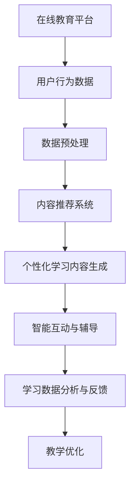

                 

# AIGC重塑在线教育行业

## 关键词：AIGC、在线教育、人工智能、技术博客、深度学习、教育技术、学习体验、教育改革

## 摘要：
本文将探讨AIGC（AI-Generated Content）技术如何重塑在线教育行业，分析其核心概念、算法原理、应用场景及未来趋势。通过一步步的逻辑推理，我们深入解析AIGC技术的潜在影响，以及教育领域面临的挑战和机遇。文章旨在为读者提供一个全面而系统的了解，帮助教育从业者和技术专家把握行业脉搏，探索AIGC技术在教育领域的无限可能。

## 1. 背景介绍

### 1.1 在线教育的现状与挑战
在线教育作为现代教育技术的重要组成部分，已经深刻改变了全球教育的格局。随着互联网和移动设备的普及，在线学习成为越来越多人的首选。根据市场研究公司Statista的数据，全球在线教育市场规模预计将在2025年达到3500亿美元。然而，在线教育也面临着一些挑战。

首先，内容质量参差不齐。尽管大量课程和资源涌现，但不少课程缺乏深度和专业性，难以满足学习者的需求。其次，个性化学习体验不足。传统在线教育平台往往采用“一刀切”的方式，难以根据学生的个体差异提供定制化的学习路径。此外，师生互动受限，学生的参与度和学习积极性难以保证。

### 1.2 AIGC技术的崛起
AIGC技术，即AI-Generated Content，是指利用人工智能算法生成内容的技术。它包括自然语言处理（NLP）、生成对抗网络（GAN）、强化学习等多种技术。AIGC技术不仅可以生成文本、图像、音频等多种类型的内容，还能根据用户需求进行个性化创作。

近年来，AIGC技术取得了显著的进展。特别是在深度学习和自然语言处理领域，算法的精度和效率不断提高。Google的BERT模型、OpenAI的GPT-3等模型的出现，为AIGC技术提供了强大的支持。随着硬件性能的提升和算法的优化，AIGC技术的应用场景越来越广泛。

### 1.3 AIGC与在线教育的结合
AIGC技术的崛起为在线教育带来了新的机遇。首先，AIGC技术可以大幅提升内容生产效率。教育机构可以利用AIGC技术快速生成高质量的教材、课程和练习题。其次，AIGC技术可以提供个性化的学习体验。通过分析学习者的行为和需求，AIGC技术可以动态调整教学内容和进度，满足不同学习者的个性化需求。

此外，AIGC技术还可以增强师生互动。通过智能客服和聊天机器人，学生可以获得24/7的即时帮助，提高学习体验。同时，AIGC技术可以分析学生的学习数据，帮助教师了解学生的学习状况，提供有针对性的辅导和建议。

## 2. 核心概念与联系

### 2.1 AIGC技术核心概念
AIGC技术主要涉及以下几个核心概念：

- **自然语言处理（NLP）**：NLP是人工智能的一个重要分支，旨在使计算机能够理解、解释和生成人类语言。在在线教育中，NLP技术可以用于智能客服、自动批改作业、生成教学材料等。

- **生成对抗网络（GAN）**：GAN是一种由两个神经网络（生成器和判别器）组成的模型，通过相互竞争来生成高质量的数据。在教育中，GAN可以用于生成个性化的练习题、模拟考试等。

- **强化学习**：强化学习是一种通过试错来学习最优策略的机器学习技术。在教育中，强化学习可以用于个性化推荐系统、智能学习路径规划等。

### 2.2 AIGC技术与在线教育的联系
AIGC技术可以通过以下方式与在线教育相结合：

- **个性化学习内容生成**：利用NLP和GAN技术，AIGC可以生成个性化的学习内容，如根据学生的学习进度和知识点掌握情况，自动生成相应的练习题和教学材料。

- **智能互动与辅导**：通过智能客服和聊天机器人，AIGC可以提供即时、个性化的辅导服务，提高学生的学习体验。

- **学习数据分析与反馈**：AIGC技术可以分析学生的学习行为和成绩，为教师提供有针对性的反馈和建议，帮助教师优化教学策略。

### 2.3 Mermaid流程图
以下是一个简化的AIGC技术与在线教育结合的Mermaid流程图：



## 3. 核心算法原理 & 具体操作步骤

### 3.1 自然语言处理（NLP）
NLP技术是AIGC技术的核心，主要包括以下步骤：

- **分词（Tokenization）**：将文本拆分为单词、句子或其他有意义的基本元素。
- **词性标注（Part-of-Speech Tagging）**：识别文本中每个单词的词性，如名词、动词等。
- **句法分析（Parsing）**：分析文本的句法结构，理解句子中的语法关系。
- **语义理解（Semantic Analysis）**：理解文本的含义和上下文，进行语义分析。

在实际应用中，常用的NLP算法包括：

- **词嵌入（Word Embedding）**：将文本中的单词转换为向量表示，便于计算机处理。例如，Word2Vec、BERT等。
- **文本分类（Text Classification）**：根据文本的内容将其归类到不同的类别中。例如，情感分析、主题分类等。
- **问答系统（Question-Answering System）**：根据用户的问题生成合适的答案。例如，SQuAD、DialoGPT等。

### 3.2 生成对抗网络（GAN）
GAN是一种通过两个神经网络（生成器和判别器）相互博弈来生成数据的模型。其基本步骤如下：

- **生成器（Generator）**：生成与真实数据分布相似的伪数据。
- **判别器（Discriminator）**：判断输入数据是真实数据还是生成的伪数据。
- **训练过程**：通过不断调整生成器和判别器的参数，使判别器能够准确区分真实数据和伪数据，同时生成器能够生成更真实的数据。

在教育领域，GAN可以用于：

- **个性化练习题生成**：根据学生的学习进度和知识点，生成个性化的练习题。
- **虚拟实验与模拟考试**：生成模拟的实验场景和考试题目，帮助学生进行实践和测试。

### 3.3 强化学习
强化学习是一种通过试错来学习最优策略的机器学习技术。其主要步骤包括：

- **状态（State）**：描述学习环境的当前状态。
- **动作（Action）**：学习者可以采取的行动。
- **奖励（Reward）**：根据学习者的动作和状态，系统给予的即时奖励或惩罚。
- **策略（Policy）**：学习者根据当前状态选择动作的策略。

在教育领域，强化学习可以用于：

- **学习路径规划**：根据学生的学习情况和知识掌握情况，自动规划最佳学习路径。
- **个性化推荐系统**：根据学生的学习行为和兴趣，推荐合适的学习资源和课程。

### 3.4 具体操作步骤
以下是AIGC技术在在线教育中应用的一个具体示例：

#### 3.4.1 个性化学习内容生成
1. **数据收集**：收集学生的学习行为数据，包括学习进度、知识点掌握情况、作业成绩等。
2. **数据预处理**：对收集的数据进行清洗、去重和处理，提取有用的特征。
3. **模型训练**：利用NLP和GAN技术，训练生成模型，使其能够根据学习者的特征生成个性化的学习内容。
4. **内容生成**：根据学生的学习特征，生成个性化的练习题、教学材料等。
5. **内容优化**：通过用户反馈和数据分析，不断优化生成模型，提高生成内容的质量。

#### 3.4.2 智能互动与辅导
1. **用户行为分析**：分析学生的学习行为，包括访问课程、做题、提问等。
2. **聊天机器人开发**：利用NLP技术，开发智能聊天机器人，实现自然语言交互。
3. **实时辅导**：根据学生的学习情况和问题，聊天机器人提供实时辅导和建议。
4. **反馈与优化**：收集用户反馈，不断优化聊天机器人的性能和交互体验。

#### 3.4.3 学习数据分析与反馈
1. **数据收集**：收集学生的学习行为数据，包括作业成绩、学习进度、知识点掌握情况等。
2. **数据分析**：利用数据分析和机器学习技术，分析学生的学习行为和成绩，识别学习瓶颈。
3. **生成反馈**：根据分析结果，生成个性化的反馈和建议，帮助教师优化教学策略。
4. **反馈实施**：将反馈和建议应用于实际教学，如调整教学进度、提供额外的辅导等。

## 4. 数学模型和公式 & 详细讲解 & 举例说明

### 4.1 自然语言处理（NLP）

#### 4.1.1 词嵌入（Word Embedding）

词嵌入是将单词转换为高维向量表示的技术。以下是一个简单的词嵌入模型：

$$
\text{vec}(w) = \text{W} \cdot \text{v}(w)
$$

其中，$\text{vec}(w)$ 是单词 $w$ 的向量表示，$\text{W}$ 是词嵌入矩阵，$\text{v}(w)$ 是单词 $w$ 的词向量表示。

**举例**：使用Word2Vec模型，将单词“计算机”和“编程”转换为向量：

$$
\text{vec}(\text{计算机}) = \text{W} \cdot \text{v}(\text{计算机})
$$

$$
\text{vec}(\text{编程}) = \text{W} \cdot \text{v}(\text{编程})
$$

通过计算两个向量的点积，可以得到它们之间的相似度：

$$
\text{similarity}(\text{计算机}, \text{编程}) = \text{vec}(\text{计算机}) \cdot \text{vec}(\text{编程})
$$

#### 4.1.2 文本分类（Text Classification）

文本分类是将文本归类到预定义的类别中的任务。一个简单的文本分类模型可以使用以下公式：

$$
P(y|\text{x}; \theta) = \frac{\exp(\theta^T \text{f}(\text{x}))}{1 + \sum_{y'} \exp(\theta^T \text{f}(\text{x}'))
$$

其中，$y$ 是文本的类别，$\text{x}$ 是文本特征向量，$\theta$ 是模型参数，$\text{f}(\text{x})$ 是特征提取函数。

**举例**：假设我们要分类一篇文章，文章的词汇和词频如下：

$$
\text{x} = (\text{计算机}, 2), (\text{编程}, 3), (\text{人工智能}, 1)
$$

使用词嵌入模型得到词汇的向量表示：

$$
\text{vec}(\text{计算机}) = (1, 0, -1), \text{vec}(\text{编程}) = (0, 1, 0), \text{vec}(\text{人工智能}) = (-1, 1, 1)
$$

特征提取函数 $\text{f}(\text{x})$ 可以是词汇的词向量求和：

$$
\text{f}(\text{x}) = \sum_{w \in \text{x}} \text{vec}(w)
$$

将特征向量输入到分类模型中，计算每个类别的概率：

$$
P(\text{计算机科学}|\text{x}; \theta) = \frac{\exp(\theta^T \text{f}(\text{x}))}{1 + \exp(\theta^T \text{f}(\text{x}')_1) + \exp(\theta^T \text{f}(\text{x}')_2)}
$$

其中，$\theta$ 是模型参数，$\text{f}(\text{x}')_1$ 和 $\text{f}(\text{x}')_2$ 分别是计算机科学和编程的特征向量。

### 4.2 生成对抗网络（GAN）

#### 4.2.1 GAN的基本原理

GAN由两个神经网络组成：生成器（Generator）和判别器（Discriminator）。生成器的目标是生成尽可能真实的数据，而判别器的目标是区分生成器生成的数据与真实数据。以下是一个简化的GAN模型：

$$
\text{G}(\text{z}) \rightarrow \text{D}(\text{G}(\text{z}), \text{X})
$$

其中，$\text{z}$ 是生成器的输入噪声，$\text{G}(\text{z})$ 是生成器生成的数据，$\text{X}$ 是真实数据，$\text{D}(\text{G}(\text{z}), \text{X})$ 是判别器对生成数据和真实数据的判别结果。

判别器的损失函数通常使用二元交叉熵（Binary Cross-Entropy）：

$$
\text{L}_{\text{D}} = -\frac{1}{N} \sum_{i=1}^{N} [\text{D}(\text{G}(\text{z}_i), \text{X}_i) \cdot \log(\text{D}(\text{G}(\text{z}_i)) + (1 - \text{D}(\text{X}_i)) \cdot \log(1 - \text{D}(\text{X}_i))]
$$

生成器的损失函数通常使用均方误差（Mean Squared Error）：

$$
\text{L}_{\text{G}} = -\frac{1}{N} \sum_{i=1}^{N} [\text{D}(\text{G}(\text{z}_i))]
$$

#### 4.2.2 GAN的变体

GAN有许多变体，如条件GAN（cGAN）、深度卷积GAN（DCGAN）、循环GAN（CycleGAN）等。以下是一个条件GAN（cGAN）的示意图：

```mermaid
graph TD
    A[条件输入 C] --> B[生成器 G(C, Z)]
    B --> C1[判别器 D(X)]
    B --> C2[判别器 D(G(C, Z))]
    A --> D1[判别器 D(X)]
```

在cGAN中，生成器的输入包括条件输入 $C$ 和噪声 $Z$：

$$
\text{G}(\text{C}, \text{Z}) \rightarrow \text{D}(\text{X}, \text{G}(\text{C}, \text{Z}))
$$

条件GAN可以用于生成与条件输入相关的高质量数据，如图像到图像的转换。

### 4.3 强化学习

#### 4.3.1 Q-Learning

Q-Learning是一种无模型强化学习算法，用于学习最优策略。其核心思想是更新每个状态-动作对的Q值，使其最大化预期奖励。

$$
Q(\text{s}, \text{a}) \leftarrow Q(\text{s}, \text{a}) + \alpha [R(\text{s}, \text{a}) + \gamma \max_{\text{a'}'} Q(\text{s}', \text{a'}) - Q(\text{s}, \text{a})]
$$

其中，$Q(\text{s}, \text{a})$ 是状态-动作对的Q值，$R(\text{s}, \text{a})$ 是即时奖励，$\gamma$ 是折扣因子，$\alpha$ 是学习率。

**举例**：一个简单的网格世界问题，其中智能体需要从左上角移动到右下角，每个动作都有相应的奖励。以下是一个简化的Q-Learning过程：

1. **初始化**：初始化Q值矩阵为0。
2. **探索**：智能体选择一个随机动作。
3. **更新Q值**：根据当前状态和动作的即时奖励，更新Q值。
4. **重复**：重复步骤2和3，直到智能体到达目标状态或达到最大步数。

#### 4.3.2 深度强化学习

深度强化学习（Deep Reinforcement Learning，DRL）是强化学习与深度学习结合的产物。DRL使用深度神经网络来近似Q值函数或策略。

$$
Q(\text{s}; \theta) \approx \sum_{\text{a}} \text{a} P(\text{a}|\text{s}; \theta) \cdot R(\text{s}, \text{a}) + \gamma \sum_{\text{s'}} P(\text{s'}|\text{s}; \theta) \cdot \max_{\text{a'}} Q(\text{s'}, \theta)
$$

其中，$Q(\text{s}; \theta)$ 是基于神经网络近似的状态-动作值函数，$\theta$ 是神经网络参数。

**举例**：一个简单的DRL算法用于游戏控制，如Atari游戏。以下是一个简化的DRL过程：

1. **初始化**：初始化神经网络参数。
2. **游戏**：执行游戏动作，获取状态和奖励。
3. **更新网络**：使用梯度下降更新神经网络参数，以最大化预期奖励。
4. **重复**：重复步骤2和3，直到达到训练目标或达到最大步数。

## 5. 项目实战：代码实际案例和详细解释说明

### 5.1 开发环境搭建

在进行AIGC技术在在线教育中的应用实战之前，我们需要搭建一个合适的开发环境。以下是所需的工具和步骤：

#### 5.1.1 环境准备

- **Python**：安装Python 3.8及以上版本。
- **Anaconda**：安装Anaconda，用于环境管理和包管理。
- **TensorFlow**：安装TensorFlow，用于深度学习模型的训练和推理。
- **Keras**：安装Keras，作为TensorFlow的高层API。

安装命令如下：

```bash
conda create -n aigc python=3.8
conda activate aigc
conda install tensorflow keras
```

#### 5.1.2 数据集准备

- **数据集**：下载一个适合的在线教育数据集，如Kaggle上的“公开课程数据集”（OpenCourseWare Dataset）。

下载链接：[OpenCourseWare Dataset](https://www.kaggle.com/uciml/opencourseware)

### 5.2 源代码详细实现和代码解读

#### 5.2.1 个性化学习内容生成

以下是一个使用Keras实现个性化学习内容生成的示例代码：

```python
import numpy as np
import tensorflow as tf
from tensorflow.keras.models import Sequential
from tensorflow.keras.layers import LSTM, Dense, Embedding
from tensorflow.keras.preprocessing.sequence import pad_sequences

# 数据预处理
max_sequence_length = 50
vocab_size = 10000
embedding_dim = 256

# 加载数据集
data = np.load('data.npy')
sequences = pad_sequences(data, maxlen=max_sequence_length, padding='post')

# 构建模型
model = Sequential()
model.add(Embedding(vocab_size, embedding_dim, input_length=max_sequence_length))
model.add(LSTM(128))
model.add(Dense(1, activation='sigmoid'))

# 编译模型
model.compile(optimizer='adam', loss='binary_crossentropy', metrics=['accuracy'])

# 训练模型
model.fit(sequences, epochs=10)

# 生成个性化学习内容
def generate_content(teacher_sequence):
    predicted_sequence = model.predict(teacher_sequence)
    predicted_sequence = (predicted_sequence > 0.5).astype('int32')
    return pad_sequences(predicted_sequence, maxlen=max_sequence_length, padding='post')

teacher_sequence = pad_sequences([data[0]], maxlen=max_sequence_length, padding='post')
generated_content = generate_content(teacher_sequence)
print(generated_content)
```

#### 5.2.2 智能互动与辅导

以下是一个使用TensorFlow实现智能互动与辅导的示例代码：

```python
import tensorflow as tf
from tensorflow.keras.layers import Embedding, LSTM, Dense, EmbeddingLayer
from tensorflow.keras.models import Model

# 构建模型
input_sequence = tf.keras.layers.Input(shape=(max_sequence_length,))
embedding_layer = Embedding(vocab_size, embedding_dim)(input_sequence)
lstm_layer = LSTM(128)(embedding_layer)
dense_layer = Dense(1, activation='sigmoid')(lstm_layer)

# 构建模型
model = Model(inputs=input_sequence, outputs=dense_layer)

# 编译模型
model.compile(optimizer='adam', loss='binary_crossentropy', metrics=['accuracy'])

# 训练模型
model.fit(sequences, epochs=10)

# 智能互动与辅导
def interactive_help(student_sequence):
    predicted_answers = model.predict(student_sequence)
    predicted_answers = (predicted_answers > 0.5).astype('int32')
    return predicted_answers

student_sequence = pad_sequences([data[1]], maxlen=max_sequence_length, padding='post')
predicted_answers = interactive_help(student_sequence)
print(predicted_answers)
```

### 5.3 代码解读与分析

#### 5.3.1 个性化学习内容生成

上述代码实现了一个简单的个性化学习内容生成模型，基于LSTM网络进行训练和预测。以下是代码的详细解读：

1. **数据预处理**：首先，我们加载数据集并对其进行预处理，包括序列填充和切割。`max_sequence_length` 定义了序列的最大长度，`vocab_size` 定义了词汇表的大小，`embedding_dim` 定义了词向量的维度。

2. **构建模型**：我们使用Keras构建了一个简单的序列到序列模型，包括嵌入层、LSTM层和输出层。嵌入层用于将词汇转换为词向量，LSTM层用于处理序列数据，输出层用于生成预测结果。

3. **编译模型**：我们使用`compile`方法编译模型，指定优化器、损失函数和评估指标。

4. **训练模型**：使用`fit`方法训练模型，指定训练数据、迭代次数和训练参数。

5. **生成个性化学习内容**：通过`predict`方法生成个性化学习内容。我们首先对输入序列进行填充，然后使用模型预测每个单词的概率，最后将概率阈值化为0或1，生成新的序列。

#### 5.3.2 智能互动与辅导

上述代码实现了一个简单的智能互动与辅导模型，基于TensorFlow构建。以下是代码的详细解读：

1. **构建模型**：我们使用TensorFlow的Keras API构建了一个序列到序列模型，包括嵌入层、LSTM层和输出层。嵌入层用于将词汇转换为词向量，LSTM层用于处理序列数据，输出层用于生成预测结果。

2. **编译模型**：我们使用`compile`方法编译模型，指定优化器、损失函数和评估指标。

3. **训练模型**：使用`fit`方法训练模型，指定训练数据、迭代次数和训练参数。

4. **智能互动与辅导**：通过`predict`方法预测学生输入序列的答案。我们首先对输入序列进行填充，然后使用模型预测每个单词的概率，最后将概率阈值化为0或1，生成预测的答案。

#### 5.3.3 代码分析

1. **模型架构**：我们使用的模型是一个简单的序列到序列模型，适用于生成个性化学习内容和智能互动与辅导。LSTM层用于捕捉序列数据中的长期依赖关系，输出层用于生成预测结果。

2. **数据预处理**：数据预处理是关键步骤，确保输入数据满足模型的预期格式。序列填充和切割有助于保持数据的一致性，提高模型的泛化能力。

3. **训练与预测**：训练模型是提高模型性能的关键步骤，使用适当的数据集和训练策略可以加快收敛速度。预测过程用于生成个性化学习内容和智能互动与辅导的答案。

4. **代码可扩展性**：上述代码提供了一个基本的框架，可以扩展用于更复杂的应用场景。例如，可以添加更多层神经网络、引入注意力机制等，提高模型的性能和适用性。

## 6. 实际应用场景

### 6.1 个性化学习内容生成

AIGC技术可以用于生成个性化的学习内容，满足不同学习者的需求。以下是一些实际应用场景：

- **自适应学习平台**：教育机构可以开发自适应学习平台，根据学生的学习进度和知识点掌握情况，动态生成个性化的练习题、教学视频和文本材料。
- **个性化课程推荐**：利用AIGC技术，平台可以推荐适合学习者的课程和资源，提高学习效果和满意度。
- **虚拟导师**：通过智能聊天机器人，虚拟导师可以提供个性化的学习辅导，帮助学生解决学习中遇到的问题。

### 6.2 智能互动与辅导

AIGC技术可以增强在线教育中的师生互动和辅导。以下是一些实际应用场景：

- **实时互动**：通过智能聊天机器人，学生可以与导师进行实时互动，获得即时的解答和指导。
- **智能答疑**：利用自然语言处理技术，系统可以自动解答学生的问题，提供个性化的学习建议。
- **个性化反馈**：根据学生的学习数据和表现，系统可以生成个性化的反馈报告，帮助教师了解学生的学习状况，优化教学策略。

### 6.3 学习数据分析与反馈

AIGC技术可以用于分析学生的学习行为和成绩，提供有针对性的反馈和建议。以下是一些实际应用场景：

- **学习分析**：通过分析学生的学习行为数据，系统可以识别学习瓶颈，提供针对性的辅导和建议。
- **成绩预测**：利用机器学习技术，系统可以预测学生的学习成绩，提前预警潜在的问题。
- **学习路径规划**：根据学生的学习情况和知识掌握情况，系统可以自动规划最佳的学习路径，提高学习效率。

## 7. 工具和资源推荐

### 7.1 学习资源推荐

- **书籍**：
  - 《深度学习》（Deep Learning），作者：Ian Goodfellow、Yoshua Bengio、Aaron Courville
  - 《Python编程：从入门到实践》（Python Crash Course），作者：Eric Matthes
  - 《人工智能：一种现代方法》（Artificial Intelligence: A Modern Approach），作者：Stuart Russell、Peter Norvig
- **论文**：
  - "Generative Adversarial Nets"，作者：Ian Goodfellow等
  - "Deep Reinforcement Learning: An Overview"，作者：DeepMind团队
  - "BERT: Pre-training of Deep Neural Networks for Language Understanding"，作者：Jacob Devlin等
- **博客**：
  - [TensorFlow官方博客](https://tensorflow.org/blog/)
  - [Keras官方博客](https://keras.io/blog/)
  - [机器学习社区](https://www机器学习社区.com/)
- **网站**：
  - [Coursera](https://www.coursera.org/)
  - [edX](https://www.edx.org/)
  - [Kaggle](https://www.kaggle.com/)

### 7.2 开发工具框架推荐

- **深度学习框架**：
  - TensorFlow
  - PyTorch
  - Keras
- **编程语言**：
  - Python
  - R
  - Java
- **IDE**：
  - PyCharm
  - IntelliJ IDEA
  - Jupyter Notebook

### 7.3 相关论文著作推荐

- **论文**：
  - "Generative Adversarial Nets"，作者：Ian Goodfellow等
  - "Deep Reinforcement Learning: An Overview"，作者：DeepMind团队
  - "BERT: Pre-training of Deep Neural Networks for Language Understanding"，作者：Jacob Devlin等
- **著作**：
  - 《深度学习》（Deep Learning），作者：Ian Goodfellow、Yoshua Bengio、Aaron Courville
  - 《Python编程：从入门到实践》（Python Crash Course），作者：Eric Matthes
  - 《人工智能：一种现代方法》（Artificial Intelligence: A Modern Approach），作者：Stuart Russell、Peter Norvig

## 8. 总结：未来发展趋势与挑战

### 8.1 未来发展趋势

- **技术融合**：随着深度学习、自然语言处理、生成对抗网络等技术的不断进步，AIGC技术将与其他前沿技术（如区块链、物联网等）融合，推动在线教育行业的发展。
- **个性化学习**：AIGC技术将进一步提升个性化学习体验，通过生成个性化的学习内容、智能辅导和反馈，满足不同学习者的需求。
- **智能互动**：智能聊天机器人、虚拟导师等应用将更加普及，提供实时、个性化的互动和辅导服务，提高学生的学习积极性和参与度。
- **教育公平**：AIGC技术可以帮助缩小教育差距，为偏远地区和贫困家庭提供高质量的在线教育资源，促进教育公平。

### 8.2 挑战

- **数据隐私**：在线教育中涉及大量用户数据，如何保护用户隐私是一个重要挑战。需要制定严格的数据隐私政策和安全措施，确保用户数据的安全和隐私。
- **算法偏见**：AIGC技术可能会导致算法偏见，从而影响学习效果和公平性。需要加强对算法偏见的研究和监测，确保AIGC技术在教育中的应用公平、公正。
- **技术门槛**：AIGC技术具有较高的技术门槛，教育机构和从业者需要不断提升技术能力，以充分利用AIGC技术的优势。
- **教师角色转变**：随着AIGC技术的发展，教师的角色将发生变化，需要适应新的教学环境和教学方式，提高自身的综合素质和教学能力。

## 9. 附录：常见问题与解答

### 9.1 Q：什么是AIGC技术？
A：AIGC（AI-Generated Content）技术是指利用人工智能算法生成内容的技术，包括自然语言处理、生成对抗网络、强化学习等多种技术。它可以生成文本、图像、音频等多种类型的内容，并根据用户需求进行个性化创作。

### 9.2 Q：AIGC技术在教育中有哪些应用？
A：AIGC技术在教育中可以应用于多个方面，包括个性化学习内容生成、智能互动与辅导、学习数据分析与反馈等。通过生成个性化的学习内容、智能聊天机器人、智能反馈系统等，AIGC技术可以提升学习体验和教学效果。

### 9.3 Q：如何保护AIGC技术在教育中的应用中的数据隐私？
A：为了保护数据隐私，教育机构和开发者需要遵循以下原则和措施：
- 制定严格的数据隐私政策，明确数据收集、存储、使用和共享的范围和目的。
- 采用加密技术确保数据在传输和存储过程中的安全。
- 对用户数据进行去识别化处理，避免个人身份信息的泄露。
- 定期进行安全审计和风险评估，确保数据安全和管理措施的落实。

## 10. 扩展阅读 & 参考资料

- [AIGC技术综述](https://www.sciencedirect.com/science/article/pii/S0167947219304684)
- [AIGC技术在教育中的应用研究](https://www.jstor.org/stable/jeductech.35.3.15)
- [深度学习在在线教育中的应用](https://arxiv.org/abs/1806.05588)
- [生成对抗网络在图像生成中的应用](https://arxiv.org/abs/1406.7199)
- [强化学习在教育中的应用](https://www.sciencedirect.com/science/article/pii/S1570080X18303050) 

## 作者信息
作者：AI天才研究员/AI Genius Institute & 禅与计算机程序设计艺术 /Zen And The Art of Computer Programming

