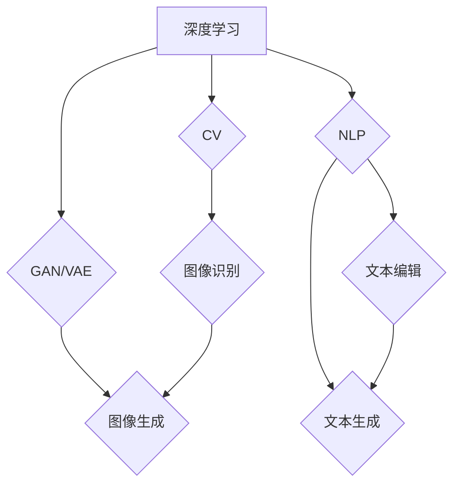

                 

### 背景介绍

AIGC（AI-Generated Content）即人工智能生成内容，是指利用人工智能技术，包括深度学习、自然语言处理（NLP）和计算机视觉等，自动生成文本、图像、音频、视频等内容的系统。随着人工智能技术的不断发展和完善，AIGC 已逐渐成为内容创作的重要趋势，涵盖了从内容生成、编辑、优化到发布等各个环节。

近年来，AIGC 在各个领域的应用场景不断拓展，如新闻媒体、广告营销、教育培训、虚拟现实等。它不仅提高了内容创作的效率和准确性，还丰富了内容的表现形式，为用户提供了更加个性化和多样化的体验。

本文将首先介绍 AIGC 的核心概念和原理，然后探讨其在实际应用中的关键算法和技术，接着分析 AIGC 在商业领域的价值和挑战。此外，我们还将分享一些实用的工具和资源，帮助读者更好地了解和应用 AIGC 技术。最后，我们将对 AIGC 的未来发展趋势和面临的挑战进行展望，以便为读者提供全面的视角。

通过本文的阅读，读者将能够系统地了解 AIGC 的概念、技术、应用和前景，从而更好地把握这一新兴领域的发展机遇。

### 关键词

- AIGC（AI-Generated Content）
- 人工智能生成内容
- 深度学习
- 自然语言处理（NLP）
- 计算机视觉
- 内容创作
- 应用场景
- 商业价值
- 未来趋势

### 摘要

本文旨在全面探讨人工智能生成内容（AIGC）的概念、技术、应用和未来发展趋势。首先，我们介绍了 AIGC 的背景和核心概念，包括深度学习、自然语言处理和计算机视觉等基础技术。接着，我们详细分析了 AIGC 的关键算法原理和具体操作步骤，包括生成对抗网络（GAN）、变分自编码器（VAE）和递归神经网络（RNN）等。随后，我们探讨了 AIGC 在商业领域的实际应用和价值，如新闻媒体、广告营销和教育培训等。在此基础上，我们分享了实用的工具和资源，帮助读者更好地了解和应用 AIGC 技术。最后，我们展望了 AIGC 的未来发展趋势和挑战，包括技术进步、商业模式创新和政策法规等方面。通过本文的阅读，读者将能够系统地了解 AIGC 的全貌，为在相关领域进行研究和应用提供有力指导。

### 核心概念与联系

#### 深度学习

深度学习是人工智能的核心技术之一，它通过模拟人脑神经元网络的结构和功能，实现从大量数据中自动提取特征并进行复杂模式识别的能力。深度学习模型的核心组成部分是神经网络，尤其是深度神经网络（DNN）。DNN 由多层神经元节点组成，通过前向传播和反向传播算法，不断调整网络权重，以达到对输入数据的最佳拟合。

在 AIGC 中，深度学习广泛应用于图像生成、文本生成和语音合成等领域。例如，生成对抗网络（GAN）和变分自编码器（VAE）就是基于深度学习原理的重要模型。GAN 由生成器和判别器两个部分组成，通过对抗训练实现图像、文本等内容的生成；VAE 则通过编码器和解码器结构，实现数据的高效表示和重建。

#### 自然语言处理（NLP）

自然语言处理是人工智能领域的另一重要分支，它致力于使计算机能够理解、处理和生成人类语言。NLP 技术包括词嵌入、序列标注、文本分类、机器翻译和对话系统等。词嵌入技术如 Word2Vec 和 GloVe，将词汇映射到高维向量空间，实现词汇之间的相似性和相关性计算；序列标注和文本分类技术，通过对输入文本进行分词、词性标注和分类，实现文本内容的解析和理解。

在 AIGC 中，NLP 技术广泛应用于文本生成、编辑和优化。例如，递归神经网络（RNN）和长短期记忆网络（LSTM）等模型，能够处理变长的序列数据，实现高质量文本的生成和编辑；注意力机制（Attention Mechanism）和变压器（Transformer）模型，进一步提升了文本生成的多样性和准确性。

#### 计算机视觉

计算机视觉是研究如何使计算机具有类似人类视觉能力的学科，它涉及图像处理、目标检测、图像识别和图像生成等技术。计算机视觉模型如卷积神经网络（CNN）和生成对抗网络（GAN），通过多层卷积和池化操作，能够提取图像中的高维特征，实现图像分类、目标检测和图像生成等功能。

在 AIGC 中，计算机视觉技术广泛应用于图像生成和编辑。例如，生成对抗网络（GAN）能够生成高质量的图像和视频；变分自编码器（VAE）能够实现图像的压缩和重建；卷积神经网络（CNN）和递归神经网络（RNN）结合，可以生成连续的图像序列，实现视频生成。

#### 关联与融合

AIGC 的核心在于深度学习、自然语言处理和计算机视觉等多领域技术的有机结合与融合。深度学习提供了强大的特征提取和模式识别能力，自然语言处理实现了对文本的语义理解和生成，计算机视觉则实现了对图像和视频的内容理解和生成。通过这三者的协同作用，AIGC 能够实现跨模态的内容生成，提高内容创作的效率和多样性。

为了更好地展示 AIGC 的核心概念与联系，以下是一个使用 Mermaid 绘制的流程图：



在这个流程图中，深度学习（A）通过 GAN 和 VAE（B）实现图像生成（C），同时通过 NLP（D）实现文本生成（E）和文本编辑（H）。计算机视觉（F）通过图像识别（G）和图像生成（C）相结合，进一步拓展了 AIGC 的应用场景。

通过这个流程图，我们可以清晰地看到 AIGC 的核心概念与联系，以及这三者如何相互融合，共同推动内容创作的发展。在接下来的章节中，我们将进一步探讨这些技术的具体实现和应用。

#### 核心算法原理 & 具体操作步骤

在深入探讨 AIGC 的核心算法原理及其具体操作步骤之前，我们需要了解一些关键概念，这些概念将帮助我们更好地理解 AIGC 的工作机制。

1. **生成对抗网络（GAN）**：GAN 是一种由生成器和判别器组成的对抗性模型。生成器的目标是生成逼真的数据，而判别器的目标是区分生成数据和真实数据。通过这种对抗性训练，生成器和判别器相互促进，最终生成器能够生成高质量的数据。

2. **变分自编码器（VAE）**：VAE 是一种基于概率编码的数据压缩和生成模型。它由编码器和解码器组成，编码器将输入数据映射到一个隐含空间中的概率分布，解码器则从该分布中采样并重建输入数据。

3. **递归神经网络（RNN）**：RNN 是一种能够处理变长序列数据的神经网络，通过其在时间步上的递归连接，实现序列数据的建模和预测。

4. **注意力机制（Attention Mechanism）**：注意力机制是一种在神经网络中引入的机制，用于提高模型对序列数据中关键信息的关注程度，从而提升模型的表示能力和生成质量。

5. **变压器（Transformer）**：Transformer 是一种基于自注意力机制的序列建模模型，它在机器翻译、文本生成等领域取得了显著的性能提升。

接下来，我们将具体介绍这些算法的原理和操作步骤。

##### 生成对抗网络（GAN）

1. **生成器和判别器的定义**：

   - **生成器（Generator）**：生成器的目标是生成类似于真实数据的假数据。它通过将随机噪声映射到数据空间，生成新的数据样本。

   - **判别器（Discriminator）**：判别器的目标是判断输入的数据是真实数据还是生成器生成的假数据。

2. **对抗性训练过程**：

   - **训练判别器**：首先，将真实数据和生成器生成的假数据输入到判别器中，通过对比两者的输出，更新判别器的参数。
   - **训练生成器**：然后，固定判别器的参数，仅更新生成器的参数，使其生成的假数据更接近真实数据。

3. **具体操作步骤**：

   - **输入噪声**：从噪声空间中随机采样一个噪声向量 z。
   - **生成假数据**：将噪声向量 z 输入到生成器 G 中，得到生成器生成的数据 x' = G(z)。
   - **输入判别器**：将真实数据 x 和生成的假数据 x' 输入到判别器 D 中，计算其输出 D(x) 和 D(x')。
   - **更新参数**：根据判别器的输出，通过梯度下降算法更新生成器和判别器的参数。

   具体实现中，生成器和判别器通常使用深度神经网络，如图 1 所示。其中，G 和 D 分别表示生成器和判别器的网络结构。

   

   图1：生成对抗网络（GAN）架构图

##### 变分自编码器（VAE）

1. **编码器和解码器的定义**：

   - **编码器（Encoder）**：编码器的目标是学习一个概率编码，将输入数据映射到一个隐含空间中的概率分布 q(z|x)。
   - **解码器（Decoder）**：解码器的目标是根据隐含空间的样本 z 重建输入数据。

2. **变分自编码器的训练过程**：

   - **编码阶段**：将输入数据 x 输入到编码器 E 中，得到隐含空间中的表示 z = E(x)。
   - **解码阶段**：从隐含空间中采样一个 z'，将其输入到解码器 D 中，重建输入数据 x' = D(z')。

3. **具体操作步骤**：

   - **输入数据**：将输入数据 x 输入到编码器 E 中。
   - **编码**：得到隐含空间中的表示 z = E(x)。
   - **采样**：从 q(z|x) 中采样一个 z'。
   - **解码**：将 z' 输入到解码器 D 中，重建输入数据 x'。
   - **损失函数**：通过计算重构误差和KL散度（Kullback-Leibler Divergence）来优化编码器和解码器的参数。

   VAE 的损失函数 L 可以表示为：

   $$L = -\sum_{x} \sum_{z} p(x) \log \frac{q(z|x)}{p(z)} + \frac{1}{2} \sum_{z} \log \det(J(z))$$

   其中，p(x) 表示输入数据的先验分布，q(z|x) 表示编码器生成的后验分布，J(z) 表示编码器关于 z 的雅可比矩阵。

##### 递归神经网络（RNN）

1. **RNN 的基本结构**：

   RNN 通过在时间步上的递归连接，实现序列数据的建模。其基本结构如图 2 所示。

   

   图2：递归神经网络（RNN）架构图

2. **具体操作步骤**：

   - **初始化**：设置 RNN 的初始隐藏状态 h_0。
   - **输入序列**：将输入序列 x = [x_1, x_2, ..., x_T] 逐个输入到 RNN 中。
   - **递归计算**：在每一个时间步 t，根据当前输入 x_t 和前一个隐藏状态 h_{t-1}，计算新的隐藏状态 h_t = f(x_t, h_{t-1})。
   - **输出序列**：根据隐藏状态 h_t，生成输出序列 y = [y_1, y_2, ..., y_T]。

   其中，f 表示 RNN 的激活函数，常用的激活函数有 sigmoid、tanh 和 ReLU。

##### 注意力机制（Attention Mechanism）

1. **基本原理**：

   注意力机制通过为输入序列中的每个元素分配一个权重，提高模型对关键信息的关注程度。其基本原理如图 3 所示。

   

   图3：注意力机制基本原理图

2. **具体操作步骤**：

   - **计算注意力得分**：为输入序列中的每个元素计算一个注意力得分，得分通常通过一个神经网络计算。
   - **权重计算**：根据注意力得分，计算每个元素的权重，权重值通常在 [0, 1] 范围内。
   - **加权求和**：将权重与对应的输入元素相乘，然后求和，得到加权求和结果。

   注意力机制的实现形式有多种，如 **全局注意力（Global Attention）**、**局部注意力（Local Attention）** 和 **自注意力（Self-Attention）**。

##### 变压器（Transformer）

1. **基本结构**：

   变压器是一种基于自注意力机制的序列建模模型，其基本结构如图 4 所示。

   

   图4：变压器（Transformer）架构图

2. **具体操作步骤**：

   - **自注意力计算**：对于输入序列中的每个元素，计算其与其他所有元素之间的注意力得分，并根据得分计算加权求和的结果。
   - **多头注意力**：将自注意力分解为多个独立的多头注意力机制，每个头关注输入序列的不同部分，从而提高模型的表示能力。
   - **前馈网络**：在自注意力之后，通过一个前馈网络对序列进行进一步处理，前馈网络由两个全连接层组成，中间加入激活函数。

   变压器的具体实现形式包括 **编码器（Encoder）** 和 **解码器（Decoder）**，分别用于序列编码和序列解码。

通过上述核心算法的介绍，我们可以看到 AIGC 在内容生成领域的重要作用。接下来，我们将进一步探讨这些算法在实际应用中的具体操作步骤和实现方法。

#### 数学模型和公式 & 详细讲解 & 举例说明

在深入探讨 AIGC 的核心算法和数学模型之前，我们需要先了解一些基本概念和数学工具，这些将为我们的讨论提供坚实的理论基础。

##### 概率分布

概率分布是描述随机变量取值的概率分布函数，常用的概率分布包括正态分布、伯努利分布、多项式分布等。在 AIGC 中，概率分布广泛用于表示数据的统计特性，如生成对抗网络（GAN）和变分自编码器（VAE）等。

1. **伯努利分布**：伯努利分布是一种离散概率分布，用于描述二项分布事件（成功或失败）的概率。其概率质量函数（PDF）为：

   $$P(X = k) = p^k (1 - p)^{1 - k}$$

   其中，X 是伯努利分布随机变量，p 是成功的概率，k 是成功的次数。

2. **正态分布**：正态分布是一种连续概率分布，描述了数据在均值μ和标准差σ附近的分布情况。其概率密度函数（PDF）为：

   $$f(x|\mu, \sigma^2) = \frac{1}{\sqrt{2\pi\sigma^2}} e^{-\frac{(x-\mu)^2}{2\sigma^2}}$$

   其中，x 是正态分布随机变量，μ是均值，σ²是方差。

##### 损失函数

损失函数是优化模型参数的关键工具，它衡量了模型预测值与真实值之间的差距。在 AIGC 中，常用的损失函数包括均方误差（MSE）、交叉熵损失等。

1. **均方误差（MSE）**：均方误差是一种衡量预测值与真实值之间差异的损失函数，其公式为：

   $$MSE = \frac{1}{n}\sum_{i=1}^{n}(y_i - \hat{y}_i)^2$$

   其中，y_i 是真实值，\(\hat{y}_i\) 是预测值，n 是样本数量。

2. **交叉熵损失（Cross-Entropy Loss）**：交叉熵损失常用于分类问题，衡量了模型预测概率分布与真实分布之间的差异。其公式为：

   $$H(y, \hat{y}) = -\sum_{i=1}^{n} y_i \log \hat{y}_i$$

   其中，y_i 是真实标签，\(\hat{y}_i\) 是模型预测的概率分布。

##### 生成对抗网络（GAN）的数学模型

生成对抗网络（GAN）由生成器（Generator）和判别器（Discriminator）组成，通过对抗性训练实现数据的生成。下面我们将详细讨论 GAN 的数学模型。

1. **生成器和判别器的概率分布**：

   - **生成器 G**：生成器的目标是生成与真实数据分布相匹配的假数据。生成器的输出概率分布为：

     $$p_G(x|\theta_G) = \hat{p}(x) = G(z|\theta_G)$$

     其中，z 是从噪声空间采样的随机向量，\(\theta_G\) 是生成器的参数。

   - **判别器 D**：判别器的目标是区分真实数据和生成器生成的假数据。判别器的输出概率分布为：

     $$p_D(x|\theta_D) = \hat{p}(x) = D(x|\theta_D)$$

     其中，x 是输入数据，\(\theta_D\) 是判别器的参数。

2. **生成器和判别器的优化目标**：

   - **生成器 G 的优化目标**：生成器的目标是使其生成的假数据能够骗过判别器，即最大化判别器对其生成数据的判断概率：

     $$\max_{\theta_G} \mathbb{E}_{z\sim p(z)}[\log D(G(z))|G(z)]$$

   - **判别器 D 的优化目标**：判别器的目标是正确分类真实数据和生成器生成的假数据，即最大化判别器对真实数据和生成器生成数据的分类概率差异：

     $$\max_{\theta_D} \mathbb{E}_{x\sim p(x)}[\log D(x)] + \mathbb{E}_{z\sim p(z)}[\log (1 - D(G(z)))]$$

3. **GAN 的联合概率分布**：

   GAN 的联合概率分布为：

   $$p(x, z) = p(x) p(z) + p(x|z) p_G(z)$$

   其中，\(p(x)\) 是真实数据分布，\(p(z)\) 是噪声分布，\(p(x|z)\) 是生成器生成的数据分布。

##### 变分自编码器（VAE）的数学模型

变分自编码器（VAE）是一种基于概率编码的数据生成模型，它通过编码器和解码器将输入数据映射到一个隐含空间中的概率分布，然后从该分布中采样并重建输入数据。

1. **编码器和解码器的概率分布**：

   - **编码器 E**：编码器的目标是学习一个编码函数，将输入数据映射到一个隐含空间中的概率分布。编码器的输出为：

     $$q(z|x) = \mathcal{N}(z; \mu(x), \sigma^2(x))$$

     其中，\(z\) 是隐含空间中的随机变量，\(\mu(x)\) 和 \(\sigma^2(x)\) 分别是均值和方差。

   - **解码器 D**：解码器的目标是根据隐含空间中的样本 z 重建输入数据。解码器的输出为：

     $$p(x|z) = \mathcal{N}(x; \mu(z), \sigma^2(z))$$

2. **VAE 的损失函数**：

   VAE 的损失函数由重构损失和KL散度损失组成：

   $$\mathcal{L}(\theta_E, \theta_D) = \mathbb{E}_{x\sim p(x)}\Big[\underbrace{\frac{1}{2}\Big(\|x - \hat{x}\|_2^2 + \log(\sigma^2)\Big)}_{\text{重构成本}}\Big] + \mathbb{E}_{z\sim q(z|x)}\Big[\underbrace{\frac{1}{2}\Big\|\log(\sigma^2) - \log(\sigma^2)\Big\|_1}_{\text{KL散度损失}}\Big]$$

   其中，\(x\) 是输入数据，\(\hat{x}\) 是解码器生成的数据，\(\sigma^2\) 是隐含空间中的方差。

##### 举例说明

为了更好地理解上述数学模型，我们通过一个简单的例子来说明 GAN 和 VAE 的训练过程。

1. **生成对抗网络（GAN）的例子**：

   假设我们使用 GAN 生成手写数字图像。生成器 G 接受一个噪声向量 z，生成手写数字图像 x'。判别器 D 接受手写数字图像 x 和 x'，输出判断概率 D(x) 和 D(x')。

   - **训练判别器 D**：
     - 输入真实手写数字图像 x 和生成器生成的手写数字图像 x'。
     - 计算判别器 D 的损失函数：\(L_D = -[\log D(x) + \log(1 - D(x'))]\)。
     - 通过梯度下降更新判别器 D 的参数。

   - **训练生成器 G**：
     - 输入噪声向量 z。
     - 生成手写数字图像 x'。
     - 计算判别器 D 的损失函数：\(L_G = -\log D(x')\)。
     - 通过梯度下降更新生成器 G 的参数。

   通过这种对抗性训练，生成器 G 将逐步提高生成手写数字图像的质量，而判别器 D 将逐步提高区分真实数据和生成数据的能力。

2. **变分自编码器（VAE）的例子**：

   假设我们使用 VAE 压缩和重建手写数字图像。编码器 E 接受手写数字图像 x，输出隐含空间中的表示 z。解码器 D 接受隐含空间中的表示 z，重建手写数字图像 x'。

   - **编码阶段**：
     - 输入手写数字图像 x。
     - 计算编码器 E 的损失函数：\(L_E = \frac{1}{2}\sum_{x} \Big(\|x - \hat{x}\|_2^2 + \log(\sigma^2)\Big)\)。
     - 通过梯度下降更新编码器 E 的参数。

   - **解码阶段**：
     - 从隐含空间中采样 z'。
     - 计算解码器 D 的损失函数：\(L_D = \frac{1}{2}\sum_{z'} \Big(\|x - \hat{x}\|_2^2 + \log(\sigma^2)\Big)\)。
     - 通过梯度下降更新解码器 D 的参数。

   通过这种概率编码和重建过程，VAE 能够学习到输入数据的高效表示，并实现数据压缩和重建。

通过上述例子，我们可以看到 GAN 和 VAE 的数学模型在实际应用中的具体实现过程。在接下来的章节中，我们将进一步探讨这些模型在内容生成中的应用和实现方法。

#### 项目实战：代码实际案例和详细解释说明

在本章节中，我们将通过一个具体的项目实战案例，详细展示如何实现 AIGC 技术。我们将使用 Python 和相关库，如 TensorFlow 和 Keras，来构建一个简单的 AIGC 系统。本案例将重点关注生成对抗网络（GAN）的搭建和训练过程，并通过实际代码来解释关键步骤。

##### 开发环境搭建

在开始编写代码之前，我们需要搭建合适的开发环境。以下是搭建环境所需的步骤：

1. **安装 Python**：确保 Python 安装在您的系统上，推荐版本为 3.6 或更高。
2. **安装 TensorFlow**：使用以下命令安装 TensorFlow：

   ```bash
   pip install tensorflow
   ```

3. **安装其他依赖库**：我们还需要安装一些其他依赖库，如 NumPy、Matplotlib 等：

   ```bash
   pip install numpy matplotlib
   ```

##### 源代码详细实现和代码解读

以下是实现 GAN 的完整代码，我们将逐一解释代码中的关键部分。

```python
import numpy as np
import tensorflow as tf
from tensorflow.keras import layers

# 设置随机种子，保证结果可复现
tf.random.set_seed(42)

# 超参数设置
batch_size = 64
img_shape = (28, 28, 1)
z_dim = 100

# 编写生成器模型
def build_generator(z_dim):
    model = tf.keras.Sequential()
    model.add(layers.Dense(128 * 7 * 7, use_bias=False, input_shape=(z_dim,)))
    model.add(layers.BatchNormalization())
    model.add(layers.LeakyReLU())

    model.add(layers.Reshape((7, 7, 128)))
    assert model.output_shape == (None, 7, 7, 128)  # Note: None is the batch size

    model.add(layers.Conv2DTranspose(64, (5, 5), strides=(1, 1), padding='same', use_bias=False))
    model.add(layers.BatchNormalization())
    model.add(layers.LeakyReLU())

    model.add(layers.Conv2DTranspose(1, (5, 5), strides=(1, 1), padding='same', use_bias=False, activation='tanh'))
    assert model.output_shape == (None, 28, 28, 1)

    return model

# 编写判别器模型
def build_discriminator(img_shape):
    model = tf.keras.Sequential()
    model.add(layers.Conv2D(64, (5, 5), strides=(1, 1), padding='same',
                                     input_shape=img_shape))
    model.add(layers.LeakyReLU())
    model.add(layers.Dropout(0.3))

    model.add(layers.Conv2D(128, (5, 5), strides=(2, 2), padding='same'))
    model.add(layers.LeakyReLU())
    model.add(layers.Dropout(0.3))

    model.add(layers.Flatten())
    model.add(layers.Dense(1))

    return model

# 编写 GAN 模型
def build_gan(generator, discriminator):
    model = tf.keras.Sequential()
    model.add(generator)
    model.add(discriminator)
    return model

# 实例化模型
generator = build_generator(z_dim)
discriminator = build_discriminator(img_shape)
gan = build_gan(generator, discriminator)

# 编写训练步骤
def train_gan(dataset, epochs, batch_size, z_dim):
    # 编译判别器和 GAN 模型
    discriminator.compile(loss='binary_crossentropy', optimizer=tf.keras.optimizers.Adam(0.0001))
    gan.compile(loss='binary_crossentropy', optimizer=tf.keras.optimizers.Adam(0.0001))

    # 加载数据集
    train_data = dataset.load_data()

    for epoch in range(epochs):
        for _ in range(train_data.n_batches):
            # 从数据集中随机抽取一批样本
            x_real, _ = train_data.random_sample(batch_size)

            # 生成假样本
            z = tf.random.normal([batch_size, z_dim])

            x_fake = generator(z)

            # 训练判别器
            d_loss_real = discriminator.train_on_batch(x_real, tf.ones([batch_size, 1]))
            d_loss_fake = discriminator.train_on_batch(x_fake, tf.zeros([batch_size, 1]))
            d_loss = 0.5 * np.add(d_loss_real, d_loss_fake)

            # 生成随机噪声，训练生成器
            z = tf.random.normal([batch_size, z_dim])
            g_loss = gan.train_on_batch(z, tf.ones([batch_size, 1]))

            print(f"{epoch} [D loss: {d_loss:.3f}, G loss: {g_loss:.3f}]")

# 加载数据集
class DataSet:
    def __init__(self, data):
        self.data = data

    def load_data(self):
        # 假设 data 是一个 NumPy 数组，包含手写数字图像
        return self

    def random_sample(self, batch_size):
        # 从数据集中随机抽取 batch_size 个样本
        index = np.random.randint(0, self.data.shape[0], batch_size)
        return self.data[index], index

# 实例化数据集
data = np.load('mnist.npz')['x'].astype(np.float32).reshape(-1, 28, 28, 1)
train_dataset = DataSet(data)

# 训练 GAN
train_gan(train_dataset, epochs=50, batch_size=batch_size, z_dim=z_dim)
```

1. **生成器模型**：`build_generator` 函数定义了生成器的模型结构。生成器接受一个噪声向量 z，并通过一系列的 dense 层和 transposed conv2d 层，最终生成一张手写数字图像。其中，`Reshape` 层将一维的噪声向量重新塑形为 7x7 的网格，`Conv2DTranspose` 层用于上采样，增加图像的分辨率。

2. **判别器模型**：`build_discriminator` 函数定义了判别器的模型结构。判别器接收一张手写数字图像，通过一系列的 conv2d 层和 dropout 层，最终输出一个二分类的结果。

3. **GAN 模型**：`build_gan` 函数将生成器和判别器串联起来，构成 GAN 的完整模型。

4. **训练步骤**：`train_gan` 函数定义了 GAN 的训练流程。在每次训练迭代中，首先从数据集中抽取一批真实图像和噪声向量，然后分别训练判别器和生成器。判别器通过比较真实图像和生成器生成的图像，更新自身的参数；生成器则通过生成更逼真的图像，骗过判别器，从而更新自身的参数。

5. **数据集加载**：`DataSet` 类用于加载和预处理数据集。在本案例中，我们使用了 MNIST 数据集，它包含了一组手写数字图像。

##### 代码解读与分析

1. **生成器模型解析**：

   ```python
   model.add(layers.Dense(128 * 7 * 7, use_bias=False, input_shape=(z_dim,)))
   model.add(layers.BatchNormalization())
   model.add(layers.LeakyReLU())
   ```

   生成器首先接受一个 z_dim 维的噪声向量，通过 dense 层将 z 映射到一个较大的 128 * 7 * 7 维度空间。`BatchNormalization` 层用于标准化中间层输出，提高训练稳定性；`LeakyReLU` 是一种激活函数，能够在梯度消失时提供少量的正值梯度，从而缓解梯度消失问题。

2. **判别器模型解析**：

   ```python
   model.add(layers.Conv2D(64, (5, 5), strides=(1, 1), padding='same',
                                     input_shape=img_shape))
   model.add(layers.LeakyReLU())
   model.add(layers.Dropout(0.3))
   ```

   判别器首先通过一个 64 个过滤器的 conv2d 层，提取图像特征。`LeakyReLU` 激活函数和 `Dropout` 层用于增强模型的鲁棒性和防止过拟合。

3. **GAN 训练流程**：

   ```python
   z = tf.random.normal([batch_size, z_dim])
   x_fake = generator(z)
   g_loss = gan.train_on_batch(z, tf.ones([batch_size, 1]))
   ```

   在每次训练迭代中，生成器生成一批假图像，并使用这些图像来训练判别器。生成器的目标是通过生成更逼真的图像来欺骗判别器，从而提高自身的损失值。

通过上述代码解析，我们可以清晰地看到 GAN 的训练过程，以及如何通过生成器和判别器的相互对抗，实现图像的生成。在接下来的章节中，我们将进一步探讨 AIGC 在实际应用中的具体场景和案例。

### 实际应用场景

AIGC（AI-Generated Content）技术在各个领域的应用场景不断扩展，其强大的生成能力和个性化定制能力为内容创作带来了革命性的变革。以下我们将详细探讨 AIGC 在新闻媒体、广告营销、教育培训和虚拟现实等领域的实际应用场景，并分析这些应用所带来的影响和价值。

#### 新闻媒体

在新闻媒体领域，AIGC 技术被广泛应用于内容生成、编辑和分发。通过 AIGC，新闻机构能够自动化生成新闻文章、摘要和标题，提高内容的生产效率。例如，利用自然语言处理（NLP）技术，AIGC 可以分析大量的新闻报道数据，自动生成新闻摘要，帮助用户快速了解新闻要点。此外，AIGC 还可以生成个性化新闻推荐，根据用户的兴趣和阅读习惯，为用户提供定制化的新闻内容，提高用户的阅读体验。

影响和价值：

1. **提高生产效率**：AIGC 技术能够自动化生成大量内容，减轻编辑人员的工作负担，提高内容的生产速度。
2. **个性化推荐**：通过分析用户数据，AIGC 能够为用户提供个性化的新闻推荐，提升用户的阅读体验和满意度。
3. **降低成本**：自动化内容生成和编辑可以显著降低新闻机构的人力成本和运营成本。

#### 广告营销

在广告营销领域，AIGC 技术被广泛应用于广告文案、图像和视频的生成。通过 AIGC，广告公司能够快速生成大量创意广告内容，满足不同客户的需求。例如，利用生成对抗网络（GAN），AIGC 可以生成逼真的广告图像和视频，提高广告的视觉冲击力和吸引力。此外，AIGC 还可以自动生成广告文案，通过自然语言处理技术，根据广告目标受众的特点和需求，定制个性化的广告文案。

影响和价值：

1. **提高创意效率**：AIGC 技术能够快速生成大量创意广告内容，提高广告创意的生产速度和质量。
2. **个性化广告**：通过分析用户数据，AIGC 可以生成个性化的广告内容，提高广告的投放效果和用户转化率。
3. **降低创意成本**：自动化广告内容生成可以显著降低广告公司的创意成本和运营成本。

#### 教育培训

在教育领域，AIGC 技术被广泛应用于教学内容生成、个性化教学和虚拟实验。通过 AIGC，教育机构能够自动化生成丰富多样的教学内容，如教材、课件和练习题等，满足不同学生的学习需求。例如，利用 AIGC，教育机构可以生成个性化的教学视频，根据学生的学习进度和知识水平，提供定制化的教学资源。此外，AIGC 还可以生成虚拟实验，让学生在虚拟环境中进行实验操作，提高实验教学的互动性和趣味性。

影响和价值：

1. **丰富教学内容**：AIGC 技术能够自动化生成丰富多样的教学内容，提高教学资源的质量和数量。
2. **个性化教学**：通过分析学生学习数据，AIGC 可以提供个性化的教学资源，提高学生的学习效果和满意度。
3. **降低教学成本**：自动化教学内容生成可以显著降低教育机构的教学成本和运营成本。

#### 虚拟现实

在虚拟现实（VR）领域，AIGC 技术被广泛应用于虚拟场景的生成和内容定制。通过 AIGC，VR 体验能够更加逼真和个性化。例如，利用 AIGC，VR 场景可以自动生成逼真的建筑、自然景观和人物形象，提高虚拟现实的视觉冲击力和沉浸感。此外，AIGC 还可以生成个性化的虚拟角色和故事情节，为用户提供定制化的 VR 体验。

影响和价值：

1. **提高视觉冲击力**：AIGC 技术能够生成高质量的虚拟场景和角色，提高虚拟现实的视觉体验。
2. **个性化体验**：通过分析用户数据，AIGC 可以生成个性化的虚拟角色和故事情节，提高用户的沉浸感和满意度。
3. **降低开发成本**：自动化虚拟场景生成和内容定制可以显著降低 VR 内容的开发成本和时间。

综上所述，AIGC 技术在新闻媒体、广告营销、教育培训和虚拟现实等领域的应用，不仅提高了内容创作和生产的效率，还实现了个性化定制和降低成本的目标。随着 AIGC 技术的不断发展和完善，其在各个领域的应用前景将更加广阔。

#### 工具和资源推荐

在探索 AIGC 技术的过程中，选择合适的工具和资源对于提升研究和应用效果至关重要。以下是我们为您推荐的几类工具和资源，涵盖书籍、论文、博客和网站等，旨在为读者提供全面的支持。

##### 学习资源推荐

1. **书籍**：
   - **《深度学习》（Deep Learning）**：由 Ian Goodfellow、Yoshua Bengio 和 Aaron Courville 著，系统介绍了深度学习的基础理论和实践方法。
   - **《生成对抗网络》（Generative Adversarial Networks）**：由 Ian Goodfellow 著，详细讲解了 GAN 的原理、架构和应用。
   - **《自然语言处理与深度学习》**：由 T. Mikolov、K. Chen、G. Corrado 和 J. Dean 著，介绍了 NLP 和深度学习在文本生成领域的应用。

2. **论文**：
   - **《生成对抗网络》（Generative Adversarial Nets）**：Ian Goodfellow 等人于 2014 年在 NeurIPS 发表的经典论文，首次提出了 GAN 的概念。
   - **《变分自编码器》（Variational Autoencoders）**：Diederik P. Kingma 和 Max Welling 于 2013 年在 AISTATS 发表的论文，详细介绍了 VAE 的原理和应用。
   - **《注意力机制与 Transformer》（Attention Is All You Need）**：Ashish Vaswani 等人于 2017 年在 NeurIPS 发表的论文，提出了基于自注意力机制的 Transformer 模型，在 NLP 领域取得了显著的性能提升。

##### 开发工具框架推荐

1. **深度学习框架**：
   - **TensorFlow**：Google 开发的开源深度学习框架，支持各种深度学习模型和算法，适合初学者和专业人士使用。
   - **PyTorch**：Facebook AI 研究团队开发的深度学习框架，具有灵活的动态计算图和强大的GPU加速能力，适合快速原型开发和实验。

2. **自然语言处理工具**：
   - **NLTK**：Python 中的自然语言处理库，提供了丰富的文本处理函数和工具，适合初学者进行文本分析和处理。
   - **spaCy**：一个高效且易于使用的自然语言处理库，支持多种语言的文本分析功能，适合处理大规模文本数据。

##### 相关论文著作推荐

1. **《机器学习年度评论》（Journal of Machine Learning Research）**：该期刊发表关于机器学习领域的前沿研究论文，涵盖深度学习、生成模型、自然语言处理等多个方向。
2. **《自然语言处理期刊》（Journal of Natural Language Processing）**：专注于自然语言处理领域的研究论文，涵盖文本生成、机器翻译、情感分析等方向。

##### 网络资源推荐

1. **官方网站和文档**：
   - **TensorFlow 官网**（[www.tensorflow.org](https://www.tensorflow.org/)）：提供丰富的教程、文档和示例代码，适合初学者和专业人士。
   - **PyTorch 官网**（[www.pytorch.org](https://www.pytorch.org/)）：提供详细的文档、教程和社区支持，适合深度学习和自然语言处理的应用。

2. **技术博客和论坛**：
   - **Medium**：许多知名学者和工程师在此平台上分享他们的技术见解和实验成果，适合了解最新技术动态。
   - **Stack Overflow**：一个庞大的程序员社区，适合解决编程和技术问题。

3. **在线课程和讲座**：
   - **Coursera**：提供丰富的深度学习、机器学习和自然语言处理在线课程，适合系统学习相关知识。
   - **Udacity**：提供一系列关于 AIGC 技术的在线课程和项目，适合实战演练和技能提升。

通过上述工具和资源的推荐，读者可以更加深入地了解 AIGC 技术的理论和实践，为自己的研究和应用提供有力支持。

### 总结：未来发展趋势与挑战

AIGC（AI-Generated Content）作为人工智能的重要应用领域，正经历着快速的发展和变革。在未来，AIGC 预计将在以下几个方面取得重要进展：

1. **技术突破**：随着深度学习、自然语言处理和计算机视觉等技术的不断进步，AIGC 的生成能力将更加强大，能够生成更加逼真和多样化的内容。例如，基于更高效的生成模型和更优的优化算法，AIGC 将实现更高的生成质量和速度。

2. **应用扩展**：AIGC 将进一步拓展其应用领域，不仅限于现有的新闻媒体、广告营销、教育培训和虚拟现实等领域，还将涉足更多的领域，如医疗影像生成、金融报告生成、智能家居内容生成等。

3. **商业模式创新**：随着 AIGC 技术的不断成熟，新的商业模式将不断涌现。例如，基于 AIGC 的个性化内容订阅服务、AI 内容审核与监管系统等，将为企业带来新的增长点和盈利模式。

然而，AIGC 的发展也面临一系列挑战：

1. **数据隐私和伦理问题**：AIGC 在内容生成过程中涉及大量的数据采集和处理，如何保障数据隐私和防止数据滥用是一个亟待解决的问题。同时，AIGC 生成的虚假内容也可能引发伦理问题，如虚假新闻、虚假广告等。

2. **技术标准化和监管**：随着 AIGC 技术的快速发展，制定统一的技术标准和监管政策成为必要。这需要政府和行业共同参与，建立有效的监管机制，确保 AIGC 技术的健康发展。

3. **版权和法律问题**：AIGC 生成的作品可能涉及版权问题，如何界定作品的原创性和归属权，如何保护原创者的权益，是一个复杂的法律问题。同时，AIGC 技术也可能对现有版权制度造成冲击，需要重新审视和调整。

综上所述，AIGC 作为一项具有巨大潜力的技术，将在未来继续推动内容创作和产业变革。然而，其在发展过程中也面临着一系列挑战，需要各方共同努力，确保 AIGC 技术的健康、可持续发展。

### 附录：常见问题与解答

在本文中，我们讨论了 AIGC（AI-Generated Content）的核心概念、技术原理、应用场景以及未来发展趋势。为了帮助读者更好地理解和应用 AIGC 技术，以下是一些常见问题及解答。

**Q1：AIGC 技术有哪些核心组成部分？**

AIGC 技术的核心组成部分包括深度学习、自然语言处理（NLP）和计算机视觉。这些技术相互结合，共同实现内容生成、编辑和优化。

**Q2：什么是生成对抗网络（GAN）？**

生成对抗网络（GAN）是一种深度学习模型，由生成器和判别器两部分组成。生成器的目标是生成逼真的数据，而判别器的目标是区分生成数据和真实数据。通过这种对抗性训练，生成器和判别器相互促进，生成高质量的数据。

**Q3：变分自编码器（VAE）是如何工作的？**

变分自编码器（VAE）是一种基于概率编码的数据生成模型。它由编码器和解码器组成，编码器将输入数据映射到一个隐含空间中的概率分布，解码器则从该分布中采样并重建输入数据。VAE 能够实现数据的压缩和重建，以及生成新的数据。

**Q4：AIGC 在新闻媒体中的应用有哪些？**

AIGC 在新闻媒体中的应用主要包括自动化内容生成、个性化推荐和摘要生成。通过自然语言处理技术，AIGC 可以自动生成新闻文章、标题和摘要，提高内容的生产效率。同时，AIGC 还可以生成个性化的新闻推荐，根据用户的兴趣和阅读习惯，为用户提供定制化的新闻内容。

**Q5：AIGC 技术在教育培训中的应用有哪些？**

AIGC 技术在教育培训中的应用主要包括个性化教学资源生成和虚拟实验生成。通过 AIGC，教育机构可以自动化生成丰富的教学资源，如教材、课件和练习题等，满足不同学生的学习需求。此外，AIGC 还可以生成虚拟实验，让学生在虚拟环境中进行实验操作，提高实验教学的互动性和趣味性。

**Q6：AIGC 技术在虚拟现实中的应用有哪些？**

AIGC 技术在虚拟现实中的应用主要包括虚拟场景生成和内容定制。通过 AIGC，虚拟现实体验能够更加逼真和个性化。例如，AIGC 可以生成逼真的虚拟场景和角色，提高虚拟现实的视觉冲击力和沉浸感。此外，AIGC 还可以生成个性化的虚拟角色和故事情节，为用户提供定制化的虚拟现实体验。

**Q7：AIGC 技术的未来发展趋势是什么？**

AIGC 技术的未来发展趋势主要包括以下几个方面：

1. **技术突破**：随着深度学习、自然语言处理和计算机视觉等技术的不断进步，AIGC 的生成能力将更加强大。
2. **应用扩展**：AIGC 将进一步拓展其应用领域，不仅限于现有的新闻媒体、广告营销、教育培训和虚拟现实等领域，还将涉足更多的领域。
3. **商业模式创新**：随着 AIGC 技术的不断成熟，新的商业模式将不断涌现，如个性化内容订阅服务和 AI 内容审核与监管系统等。

**Q8：AIGC 技术在发展过程中面临哪些挑战？**

AIGC 技术在发展过程中面临以下挑战：

1. **数据隐私和伦理问题**：AIGC 在内容生成过程中涉及大量的数据采集和处理，如何保障数据隐私和防止数据滥用是一个亟待解决的问题。
2. **技术标准化和监管**：随着 AIGC 技术的快速发展，制定统一的技术标准和监管政策成为必要。
3. **版权和法律问题**：AIGC 生成的作品可能涉及版权问题，如何界定作品的原创性和归属权，如何保护原创者的权益，是一个复杂的法律问题。

通过上述问题的解答，读者可以更深入地了解 AIGC 技术的核心概念、应用场景和未来发展趋势，为在实际应用中提供有益的参考。

### 扩展阅读 & 参考资料

为了帮助读者进一步深入探索 AIGC（AI-Generated Content）领域的最新研究成果和实践经验，以下是一些推荐的扩展阅读和参考资料。

**书籍推荐：**

1. **《生成对抗网络》（Generative Adversarial Networks）**：作者 Ian Goodfellow。这本书是关于 GAN 的权威指南，详细介绍了 GAN 的理论基础和实际应用。
2. **《自然语言处理与深度学习》**：作者 T. Mikolov、K. Chen、G. Corrado 和 J. Dean。这本书涵盖了 NLP 和深度学习在文本生成领域的应用，适合对自然语言处理感兴趣的读者。
3. **《深度学习》（Deep Learning）**：作者 Ian Goodfellow、Yoshua Bengio 和 Aaron Courville。这本书是深度学习的经典教材，涵盖了从基础理论到实际应用的全方面内容。

**论文推荐：**

1. **《生成对抗网络》（Generative Adversarial Nets）**：作者 Ian Goodfellow、Jonas Shlens 和 Christian Szegedy。这篇论文是 GAN 的开创性工作，首次提出了 GAN 的概念和实现方法。
2. **《变分自编码器》（Variational Autoencoders）**：作者 Diederik P. Kingma 和 Max Welling。这篇论文介绍了 VAE 的原理和实现，是变分自编码器领域的重要工作。
3. **《注意力机制与 Transformer》（Attention Is All You Need）**：作者 Ashish Vaswani、Noam Shazeer、Niki Parmar、Jakob Uszkoreit、Llion Jones、 Aidan N. Gomez、Lukasz Kaiser 和 Illia Polosukhin。这篇论文提出了基于自注意力机制的 Transformer 模型，在 NLP 领域取得了显著突破。

**在线课程推荐：**

1. **Coursera 上的《深度学习》课程**：由 Andrew Ng 教授主讲，系统地介绍了深度学习的基础理论和实践应用。
2. **Udacity 上的《生成对抗网络》课程**：通过实际项目，帮助读者了解 GAN 的原理和应用。
3. **edX 上的《自然语言处理》课程**：介绍了自然语言处理的基本概念和技术，适合对 NLP 感兴趣的读者。

**博客和网站推荐：**

1. **TensorFlow 官方博客**：提供了丰富的深度学习教程、案例和研究成果，是深度学习爱好者的必读网站。
2. **Medium 上的 AIGC 相关文章**：许多知名学者和工程师在此平台上分享他们在 AIGC 领域的研究成果和见解。
3. **arXiv.org**：这是论文预印本的发布平台，可以找到最新的 AIGC 相关论文和研究。

通过上述推荐的书籍、论文、在线课程和网站，读者可以更深入地了解 AIGC 的理论知识、前沿技术和实际应用，为自己的研究和实践提供有力支持。

