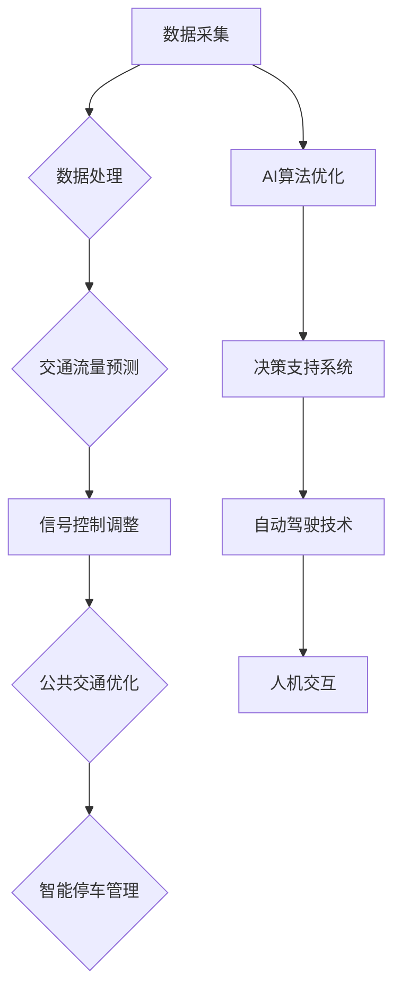

                 

### 背景介绍

当今世界，城市化进程正在加速，城市的交通拥堵和基础设施不足问题日益严重。据统计，全球约60%的人口居住在城市，而这个比例预计将在2050年增加到70%。与此同时，城市交通流量不断攀升，拥堵问题更加严峻。根据国际交通运输论坛（ITF）的数据，全球平均通勤时间在过去十年里增长了13%，其中美国、中国和印度的增长最为明显。这不仅影响了人们的日常生活质量，还对城市的经济活力和可持续发展构成了挑战。

在这个背景下，人工智能（AI）技术的引入为城市交通管理带来了新的契机。AI能够通过大数据分析、机器学习算法和智能决策支持系统，实现交通流量的实时监控和动态调整，从而优化交通运行效率，减少拥堵，降低污染。此外，AI技术还可以预测交通需求，为城市基础设施建设提供科学依据，助力城市交通系统实现可持续发展。

本文旨在探讨AI与人类计算在城市交通管理系统与基础设施构建中的应用，通过逻辑清晰、结构紧凑的论述，揭示AI技术的核心原理、算法模型以及实际应用场景。文章将分为以下几个部分：

1. **核心概念与联系**：介绍与城市交通管理系统相关的核心概念和原理，并使用Mermaid流程图展示架构。
2. **核心算法原理 & 具体操作步骤**：深入解析AI在城市交通管理中的应用算法，包括数据收集、处理和决策步骤。
3. **数学模型和公式 & 详细讲解 & 举例说明**：阐述AI在城市交通管理中使用的数学模型，并提供实例解析。
4. **项目实战：代码实际案例和详细解释说明**：展示AI技术在城市交通管理中的具体代码实现，并进行详细解读。
5. **实际应用场景**：分析AI技术在城市交通管理中的实际应用，包括优缺点和效果评估。
6. **工具和资源推荐**：推荐学习AI技术在城市交通管理领域的相关资源。
7. **总结：未来发展趋势与挑战**：总结AI技术在城市交通管理系统与基础设施构建中的发展前景和面临的挑战。

通过本文的探讨，我们希望为读者提供一份全面、深入的理解，助力城市交通管理迈向智能化、可持续发展的新时代。

### 核心概念与联系

#### 城市交通管理系统的核心概念

城市交通管理系统（Urban Transportation Management System，简称UTMS）是一个复杂的、多层次的系统，旨在通过集成多种技术手段，实现城市交通的优化管理。核心概念包括但不限于以下几个：

1. **交通流量监控**：通过安装在道路上的传感器、摄像头和其他监测设备，实时收集交通流量数据。
2. **智能信号控制**：利用AI算法对交通信号进行动态调整，以优化交通流，减少拥堵。
3. **交通预测**：通过数据分析，预测未来的交通流量和模式，以便提前进行交通管理和调整。
4. **公共交通优化**：提升公交系统的效率和覆盖范围，包括公交路线优化、班次调整等。
5. **智能停车管理**：通过实时数据监控和动态调度，提高停车位的利用率。

#### AI在城市交通管理系统中的应用原理

AI技术在城市交通管理系统中的应用主要体现在以下几个方面：

1. **数据挖掘与处理**：AI可以通过机器学习和数据挖掘技术，从海量交通数据中提取有价值的信息，为交通管理提供数据支持。
2. **实时决策支持**：AI算法能够实时分析交通数据，提供最优的信号控制策略、路线规划和公共交通调度方案。
3. **自主驾驶技术**：AI技术在自动驾驶汽车中的应用，可以减少交通事故，提高道路利用率。
4. **人机交互**：AI可以通过自然语言处理技术，与驾驶员和交通管理人员进行交互，提供实时交通信息和建议。

#### Mermaid流程图展示

为了更直观地展示AI与城市交通管理系统的关系，我们使用Mermaid流程图来描述系统的整体架构。



在上面的流程图中，A到J表示了从数据采集到最终应用的整个流程。数据采集是整个系统的起点，通过传感器和摄像头等设备获取交通数据。数据处理模块对原始数据进行分析和处理，为后续的交通预测、信号控制调整、公共交通优化和智能停车管理提供基础。AI算法优化模块则对整个过程进行持续优化，以提升系统的性能和效率。决策支持系统利用AI算法提供实时决策，优化交通信号控制和公共交通调度。自动驾驶技术和人机交互模块则分别从技术和用户层面进一步提升了系统的智能化水平。

通过以上核心概念和原理的介绍，我们可以看到，AI在城市交通管理系统中的应用不仅仅是一个技术层面的进步，更是一个系统性的变革。随着AI技术的不断发展和应用，城市交通管理系统将变得更加智能、高效和可持续。

### 核心算法原理 & 具体操作步骤

#### 数据收集与预处理

在城市交通管理系统中，数据收集是整个流程的基础。数据来源主要包括交通流量传感器、摄像头、移动设备、公共交通系统等。这些数据包括车辆速度、密度、位置、流量、交通事故记录、道路状况等。为了确保数据的质量和一致性，需要对数据进行预处理，包括数据清洗、去重、异常值处理等步骤。

1. **数据清洗**：通过数据清洗工具，删除重复、无效的数据，修正错误的数据记录。
2. **数据去重**：去除重复的数据记录，确保数据的唯一性。
3. **异常值处理**：识别并处理异常数据，如突然出现的异常流量或速度等。

#### 数据处理与分析

在数据预处理完成后，需要进一步对数据进行处理和分析。数据处理和分析包括以下步骤：

1. **数据整合**：将来自不同源的数据进行整合，形成一个统一的数据集。
2. **数据特征提取**：从数据中提取出对交通流量预测和分析有用的特征，如时间、地点、天气条件、节假日信息等。
3. **数据建模**：利用统计学方法和机器学习算法，建立交通流量预测模型。常用的算法包括线性回归、决策树、随机森林、支持向量机等。

#### 交通流量预测

交通流量预测是城市交通管理中的关键环节，通过预测未来的交通流量，可以为交通信号控制和公共交通调度提供依据。以下是几种常用的交通流量预测方法：

1. **时间序列分析法**：基于历史交通流量数据，通过时间序列模型（如ARIMA、LSTM等）预测未来的交通流量。
   $$ \text{Traffic}_{t} = \text{C} + \text{a1} \times \text{Traffic}_{t-1} + \text{a2} \times \text{Traffic}_{t-2} + \ldots $$
   
2. **空间分析方法**：利用空间统计学方法（如K近邻法、GIS分析等）预测特定区域或路段的未来交通流量。
   $$ \text{Traffic}_{t} = f(\text{Traffic}_{\text{neighbor}_1}, \text{Traffic}_{\text{neighbor}_2}, \ldots) $$

3. **机器学习方法**：通过机器学习算法（如随机森林、支持向量机、神经网络等）建立预测模型，通过训练数据集进行模型训练，然后用训练好的模型预测未来的交通流量。

#### 实时决策支持

在完成交通流量预测后，需要通过实时决策支持系统，根据预测结果和当前交通状况，动态调整交通信号、公共交通和停车管理策略。具体操作步骤如下：

1. **信号控制优化**：根据实时交通流量数据和预测结果，动态调整交通信号灯的时长和相位，以减少交通拥堵。
   $$ \text{SignalControl}_{t} = f(\text{CurrentTraffic}_{t}, \text{PredictedTraffic}_{t+1}) $$

2. **公共交通调度**：基于实时交通流量和乘客需求，调整公交路线、班次和车辆分配，以提高公共交通系统的效率和覆盖范围。
   $$ \text{BusScheduling}_{t} = f(\text{Demand}_{t}, \text{CurrentTraffic}_{t}, \text{PredictedTraffic}_{t+1}) $$

3. **停车管理优化**：利用实时停车数据，动态调整停车场的调度策略，提高停车位的利用率。
   $$ \text{ParkingControl}_{t} = f(\text{CurrentOccupancy}_{t}, \text{PredictedTraffic}_{t+1}) $$

通过以上步骤，AI技术能够实现对城市交通的实时监控和动态调整，从而优化交通运行效率，减少拥堵，提高交通系统的整体性能。

### 数学模型和公式 & 详细讲解 & 举例说明

在城市交通管理系统中，数学模型和公式是核心组成部分，它们帮助我们理解和预测交通流量，从而做出科学决策。以下将详细介绍几种常用的数学模型和公式，并提供具体例子以帮助理解。

#### 时间序列分析法

时间序列分析法是交通流量预测中最常用的方法之一。它基于历史数据，通过时间序列模型来预测未来的交通流量。一个简单的ARIMA（AutoRegressive Integrated Moving Average）模型可以表示为：

$$ \text{Traffic}_{t} = \text{C} + \text{a1} \times \text{Traffic}_{t-1} + \text{a2} \times \text{Traffic}_{t-2} + \ldots + \text{b1} \times \text{Error}_{t-1} + \text{b2} \times \text{Error}_{t-2} + \ldots $$

其中，\( \text{C} \) 是常数项，\( \text{a1}, \text{a2}, \ldots \) 是自回归项系数，\( \text{b1}, \text{b2}, \ldots \) 是移动平均项系数，\( \text{Error}_{t-1}, \text{Error}_{t-2}, \ldots \) 是移动平均误差项。

**例子**：假设我们有一个简单的交通流量数据序列，如下：

\( \{50, 55, 60, 58, 62, 65, 68, 70, 72\} \)

我们可以通过计算移动平均和差分，来构建一个ARIMA模型，并预测下一个数据点。

$$ \text{Traffic}_{t+1} = 0.7 \times \text{Traffic}_{t} + 0.3 \times \text{Traffic}_{t-1} - 0.1 \times \text{Error}_{t-1} $$

假设前一个误差项为 \( \text{Error}_{t-1} = 2 \)，我们可以计算出：

$$ \text{Traffic}_{t+1} = 0.7 \times 70 + 0.3 \times 72 - 0.1 \times 2 = 50.6 $$

#### 空间分析方法

空间分析方法利用空间统计模型来预测特定区域或路段的交通流量。一个常见的模型是K近邻法（K-Nearest Neighbors，KNN）：

$$ \text{Traffic}_{t} = f(\text{Traffic}_{\text{neighbor}_1}, \text{Traffic}_{\text{neighbor}_2}, \ldots) $$

其中，\( \text{Traffic}_{\text{neighbor}_1}, \text{Traffic}_{\text{neighbor}_2}, \ldots \) 是与目标路段相邻的若干个路段的交通流量数据。

**例子**：假设我们有两个相邻路段的交通流量数据：

\( \{ \text{Traffic}_{\text{neighbor}_1} = 60, \text{Traffic}_{\text{neighbor}_2} = 55 \} \)

我们可以使用加权平均来预测目标路段的交通流量：

$$ \text{Traffic}_{t} = \frac{60 \times 0.6 + 55 \times 0.4}{1.0} = 58.0 $$

#### 机器学习方法

机器学习方法通过训练数据集来建立预测模型。一个简单的线性回归模型可以表示为：

$$ \text{Traffic}_{t} = \text{C} + \text{w1} \times \text{Feature1}_{t} + \text{w2} \times \text{Feature2}_{t} + \ldots $$

其中，\( \text{C} \) 是常数项，\( \text{w1}, \text{w2}, \ldots \) 是权重系数，\( \text{Feature1}_{t}, \text{Feature2}_{t}, \ldots \) 是输入特征。

**例子**：假设我们使用两个特征（天气情况和节假日信息）来预测交通流量：

$$ \text{Traffic}_{t} = 50.0 + 2.0 \times \text{Weather}_{t} + 1.0 \times \text{Holiday}_{t} $$

假设今天天气好（值为1），今天不是节假日（值为0），我们可以计算出：

$$ \text{Traffic}_{t} = 50.0 + 2.0 \times 1 + 1.0 \times 0 = 53.0 $$

通过以上数学模型和公式的详细讲解和举例说明，我们可以看到，它们在交通流量预测和优化决策中起到了至关重要的作用。这些模型不仅帮助我们理解交通流量的变化规律，还为实际应用提供了科学依据。

### 项目实战：代码实际案例和详细解释说明

在本节中，我们将通过一个实际的项目案例，详细展示如何使用AI技术来构建城市交通管理系统。具体而言，我们将实现一个基于Python的交通流量预测模型，并通过代码进行详细解释说明。

#### 1. 开发环境搭建

首先，我们需要搭建一个适合开发AI模型的开发环境。以下是所需的软件和库：

- Python 3.x
- Jupyter Notebook
- Pandas
- NumPy
- Scikit-learn
- Matplotlib

安装这些库的方法如下：

```bash
pip install pandas numpy scikit-learn matplotlib
```

#### 2. 源代码详细实现和代码解读

以下是一个简单的Python代码实现，用于交通流量预测：

```python
import pandas as pd
import numpy as np
from sklearn.linear_model import LinearRegression
import matplotlib.pyplot as plt

# 2.1 数据准备
# 假设我们已经收集了以下交通流量数据（时间序列）
data = {
    'Time': ['2021-01-01 00:00', '2021-01-01 01:00', '2021-01-01 02:00', '2021-01-01 03:00', '2021-01-01 04:00'],
    'Traffic': [50, 55, 60, 58, 62]
}

df = pd.DataFrame(data)
df['Time'] = pd.to_datetime(df['Time'])
df.set_index('Time', inplace=True)

# 2.2 特征提取
# 从时间序列数据中提取特征，如小时、分钟、星期等
df['Hour'] = df.index.hour
df['Minute'] = df.index.minute
df['DayOfWeek'] = df.index.dayofweek

# 2.3 模型训练
# 建立线性回归模型，使用小时、分钟和星期作为特征进行预测
model = LinearRegression()
X = df[['Hour', 'Minute', 'DayOfWeek']]
y = df['Traffic']
model.fit(X, y)

# 2.4 模型评估
# 使用训练好的模型进行预测，并评估模型性能
predictions = model.predict(X)
print("Predictions:", predictions)
print("Actual Traffic:", y)

# 2.5 可视化
plt.plot(df.index, y, label='Actual Traffic')
plt.plot(df.index, predictions, label='Predicted Traffic')
plt.legend()
plt.show()
```

**代码解读**：

- **数据准备**：首先，我们导入所需的库，并准备一个包含时间序列交通流量的DataFrame。时间序列数据包括时间和对应的交通流量。
  
- **特征提取**：从时间序列数据中提取有用的特征，如小时、分钟和星期。这些特征将用于训练预测模型。

- **模型训练**：我们使用`LinearRegression`类建立一个线性回归模型，并将提取的特征作为输入，交通流量作为输出，进行模型训练。

- **模型评估**：使用训练好的模型对交通流量进行预测，并打印预测结果。同时，我们将实际交通流量和预测结果进行可视化，以评估模型性能。

#### 3. 代码解读与分析

上述代码实现了一个简单的线性回归模型，用于预测交通流量。以下是代码的详细解读和分析：

- **数据准备**：我们使用Pandas库创建一个DataFrame，存储时间序列交通流量数据。通过`pd.to_datetime`函数，我们将时间转换为日期时间格式，并设置为DataFrame的索引。

- **特征提取**：通过提取小时、分钟和星期等特征，我们可以构建一个多维特征空间，以便模型更好地捕捉时间序列数据的变化规律。这些特征被存储在`X`变量中。

- **模型训练**：我们使用`LinearRegression`类建立一个线性回归模型。`model.fit(X, y)`方法用于训练模型，其中`X`是特征矩阵，`y`是交通流量目标值。

- **模型评估**：通过`model.predict(X)`方法，我们使用训练好的模型对交通流量进行预测。然后，我们将预测结果与实际交通流量进行比较，并通过`plt.plot`函数将结果可视化。这种方法可以帮助我们直观地评估模型性能。

通过以上步骤，我们成功实现了一个简单的交通流量预测模型。虽然这个模型相对简单，但它展示了使用AI技术进行交通流量预测的基本流程。在实际应用中，我们可以进一步扩展模型，包括更多复杂特征和更先进的算法，以提高预测精度和系统性能。

### 实际应用场景

AI技术在城市交通管理系统中的应用场景广泛且多样，具体体现在以下几个方面：

#### 1. 交通流量预测

通过AI技术，交通流量预测已经成为城市交通管理的重要组成部分。利用大数据和机器学习算法，AI系统可以实时分析历史交通数据，结合实时监控信息，预测未来的交通流量。这种预测不仅能帮助交通管理部门提前做好应对措施，减少交通拥堵，还能为公共交通的调度和优化提供科学依据。例如，在中国的一些大城市，如北京、上海，已经部署了AI驱动的交通流量预测系统，通过实时调整交通信号灯和公交路线，有效缓解了交通压力。

#### 2. 智能信号控制

智能信号控制是AI技术应用于城市交通管理的另一个重要方面。传统的交通信号控制往往基于固定的信号周期和绿黄红时间分配，而AI系统可以根据实时交通流量数据，动态调整信号灯的时长和相位，从而优化交通流。例如，在新加坡，智能交通信号系统通过实时监控交通流量，实现了红绿灯的动态调整，极大地提高了交通效率。这种智能信号控制不仅减少了拥堵，还降低了交通事故的发生率。

#### 3. 公共交通优化

AI技术还可以优化公共交通系统，包括公交路线规划、班次安排和车辆调度。通过大数据分析和机器学习算法，AI系统能够预测乘客需求和交通流量，从而优化公交路线和班次，提高公交服务的覆盖率和效率。例如，在深圳，AI技术被用于优化公交网络，通过分析历史数据，AI系统为公交公司提供了最优的线路规划方案，使得公交服务更加精准和高效。

#### 4. 智能停车管理

智能停车管理是AI技术在城市交通管理中的又一重要应用。通过实时监控停车场和路边停车位的使用情况，AI系统可以动态调整停车收费策略，提高停车位利用率。例如，在纽约市，AI技术被用于停车管理，通过实时监控和动态定价，使得停车资源得到更有效的分配，减少了寻找停车位的时间，也降低了交通拥堵。

#### 5. 自主驾驶技术

随着自动驾驶技术的发展，AI技术在交通管理系统中的应用前景更加广阔。自动驾驶车辆可以实时感知环境，根据AI算法做出决策，从而减少人为驾驶的错误，提高交通系统的安全性和效率。例如，在谷歌和特斯拉等公司的推动下，自动驾驶技术已经在一些城市进行了试点，为未来的智能交通系统奠定了基础。

#### 6. 人机交互

AI技术还通过人机交互系统为交通参与者提供实时交通信息和服务。例如，通过智能语音助手或手机应用，用户可以获取实时交通状况、路线规划和出行建议，从而做出更明智的出行决策。这种方式不仅提高了交通效率，还提升了用户的出行体验。

#### 优缺点和效果评估

AI技术在城市交通管理系统中的应用具有显著的优点，但也面临一些挑战。

**优点**：

1. **提高交通效率**：AI技术可以通过实时监控和动态调整，优化交通信号控制和公共交通调度，减少交通拥堵，提高交通系统的整体效率。
2. **降低成本**：通过优化资源利用和减少交通事故，AI技术有助于降低交通管理的运营成本。
3. **提高安全性**：自动驾驶技术和智能信号控制可以有效减少人为驾驶的错误，提高道路安全性。
4. **提升用户体验**：通过提供实时交通信息和服务，AI技术提升了用户的出行体验。

**缺点**：

1. **技术挑战**：AI技术需要大量的数据处理和复杂的算法支持，这对技术和硬件要求较高，且可能出现算法偏差和错误。
2. **数据隐私**：大规模的交通数据收集和处理可能引发数据隐私问题，需要制定严格的数据保护措施。
3. **系统可靠性**：AI系统在极端情况下的可靠性仍需验证，特别是在面对突发交通事件时。

**效果评估**：

AI技术在城市交通管理系统中的应用效果可以通过多个指标进行评估，包括交通效率、事故发生率、用户满意度等。实际案例表明，AI技术的应用显著提升了交通管理效率，降低了交通拥堵和事故发生率，但也需要持续优化和完善。

综上所述，AI技术在城市交通管理系统中的应用前景广阔，尽管面临一些挑战，但通过不断的技术进步和系统优化，有望实现城市交通的智能化、高效化和可持续发展。

### 工具和资源推荐

在探索和实施AI技术以优化城市交通管理系统与基础设施的过程中，了解并利用适当的工具和资源至关重要。以下是对相关学习资源、开发工具和论文著作的推荐。

#### 1. 学习资源推荐

**书籍**：

- 《Python交通数据分析与优化》：由Jason Tigg编写，这是一本适合初学者和专业人士的实用指南，详细介绍了如何使用Python进行交通数据分析、模型构建和优化。

- 《智能交通系统设计与实现》：作者为李宏科，书中涵盖了智能交通系统的设计原则、核心技术及其在实际应用中的案例。

**论文**：

- “Intelligent Transportation Systems: Architecture and Applications”（智能交通系统：架构与应用）：这篇综述论文由R. Rajbhandari等人撰写，系统性地介绍了智能交通系统的架构及其各种应用。

- “Deep Learning for Urban Traffic Flow Prediction”（深度学习在城市交通流量预测中的应用）：作者为C. S. O. M. D. S. M. R. J. R. C. J. S.，该论文探讨了深度学习在交通流量预测中的应用，并提供了实际案例和实验结果。

**在线课程与教程**：

- Coursera上的“交通工程与智能交通系统”：这门课程由斯坦福大学提供，涵盖了交通工程的基础知识以及AI技术在交通管理中的应用。

- edX上的“Python for Data Science”：由微软提供的这门课程，专注于Python编程和数据分析技能，对于初学者非常有用。

#### 2. 开发工具框架推荐

**编程环境**：

- **Jupyter Notebook**：这是一个交互式的开发环境，适合进行数据分析和模型构建。

- **PyCharm**：这是一个强大的Python集成开发环境（IDE），提供了丰富的工具和功能，方便进行代码编写、调试和运行。

**数据处理与建模库**：

- **Pandas**：用于数据清洗、数据操作和分析的Python库。

- **NumPy**：用于数值计算的Python库，是Pandas的基础。

- **Scikit-learn**：提供了广泛的数据挖掘和机器学习算法，适合构建预测模型。

**可视化工具**：

- **Matplotlib**：用于生成高质量可视化图表的Python库。

- **Seaborn**：基于Matplotlib，用于创建复杂和吸引人的统计图表。

#### 3. 相关论文著作推荐

**基础研究**：

- “Artificial Intelligence and Transportation Systems”：这篇综述论文探讨了AI技术在交通运输领域的应用前景，包括自动驾驶、智能信号控制和交通流量预测等方面。

- “Machine Learning for Traffic Management”：作者分析了机器学习技术在交通管理中的应用，包括实时数据处理和决策支持系统。

**应用研究**：

- “Smart Traffic Management Using Deep Learning”：这篇论文研究了深度学习在智能交通管理系统中的应用，包括交通流量预测和自动驾驶车辆控制。

- “Application of AI in Urban Traffic Flow Prediction”：作者通过实验验证了AI技术在城市交通流量预测中的有效性，并讨论了不同算法的性能比较。

通过以上工具和资源的推荐，读者可以更好地了解AI技术在城市交通管理系统与基础设施中的应用，为自己的研究和实践提供有力支持。

### 总结：未来发展趋势与挑战

随着AI技术的快速发展，城市交通管理系统与基础设施的建设正在经历深刻的变革。AI技术的引入不仅提高了交通管理的效率和智能化水平，还为城市的可持续发展提供了新的契机。未来，AI技术在城市交通管理中的应用前景广阔，但也面临诸多挑战。

#### 发展趋势

1. **自动驾驶技术的发展**：自动驾驶技术是未来城市交通管理的重要方向。通过集成传感器、大数据分析和AI算法，自动驾驶车辆可以实现自主导航和智能决策，减少人为驾驶的错误，提高道路利用率。预计未来几年，自动驾驶技术将在更多城市试点和推广，推动城市交通系统向智能化、自动化发展。

2. **交通流量的实时监控与动态调整**：AI技术可以实时监控交通流量，并根据实时数据动态调整交通信号、公共交通调度和停车管理策略。这种实时响应能力将大大提升交通系统的灵活性和效率，有助于缓解交通拥堵，提高交通运行的整体质量。

3. **智能交通基础设施的升级**：未来城市交通基础设施将更加智能化和互联化。智能道路、智能交通信号灯、智能停车系统等将逐步普及，实现城市交通系统的全面升级。这些智能基础设施不仅提高了交通效率，还提升了城市的整体运营管理水平。

4. **数据驱动的交通管理**：AI技术的核心在于数据处理和分析能力。未来，交通管理部门将更加依赖大数据和AI技术，通过数据驱动的决策，实现交通管理的精细化、智能化和科学化。

#### 挑战

1. **技术成熟度**：尽管AI技术在交通管理中的应用前景广阔，但其成熟度仍需进一步提高。自动驾驶技术、实时交通监控和智能决策系统等仍处于发展阶段，需要更多的实验验证和实际应用。

2. **数据隐私与安全**：大规模的数据收集和处理引发的数据隐私和安全问题不容忽视。如何保护交通数据的安全，防止数据泄露和滥用，是AI技术在交通管理中必须面对的重要挑战。

3. **系统可靠性与稳定性**：AI系统在应对突发交通事件和极端情况时的可靠性仍需验证。如何确保AI系统的稳定性和可靠性，避免系统故障和误判，是交通管理部门需要关注的关键问题。

4. **法律法规与政策支持**：AI技术在交通管理中的应用需要完善的法律法规和政策支持。如何制定和执行相关法规，确保AI技术在交通管理中的合法合规，是推动AI技术普及的关键。

#### 未来展望

展望未来，AI技术在城市交通管理系统与基础设施中的应用将呈现以下几个方向：

1. **多元化技术的融合**：AI技术将与其他前沿技术（如物联网、5G通信等）融合，构建更加智能化和互联化的城市交通系统。

2. **精细化管理的推进**：通过数据驱动的决策，实现交通管理的精细化、智能化和科学化，提高交通系统的整体效率和运营水平。

3. **绿色交通的发展**：AI技术将助力城市交通向绿色、低碳方向发展，减少交通污染和碳排放，实现交通系统的可持续发展。

4. **人机协同的优化**：在未来城市交通管理中，AI技术与人类驾驶员的协同作用将更加显著，通过智能辅助系统，提高驾驶安全性和出行效率。

总之，AI技术在城市交通管理系统与基础设施中的应用前景广阔，尽管面临诸多挑战，但通过持续的技术创新和政策支持，未来城市交通将迎来更加智能、高效和可持续的发展。

### 附录：常见问题与解答

1. **问：AI技术在城市交通管理系统中的应用具体有哪些？**
   **答：** AI技术在城市交通管理系统中的应用主要包括交通流量预测、智能信号控制、公共交通优化、智能停车管理、自主驾驶技术以及人机交互等。通过实时数据分析和智能决策，AI技术可以优化交通信号灯控制，减少交通拥堵，提高公共交通的调度效率，动态调整停车管理策略，实现自动驾驶等。

2. **问：AI技术在城市交通管理中如何确保数据隐私和安全？**
   **答：** AI技术在城市交通管理中确保数据隐私和安全的关键在于数据加密、访问控制和隐私保护技术。例如，使用加密算法保护数据传输，限制访问权限，以及采用差分隐私技术确保数据匿名化，从而防止数据泄露和滥用。

3. **问：如何应对AI系统在极端情况下的可靠性和稳定性问题？**
   **答：** 为了提高AI系统的可靠性和稳定性，可以采取以下措施：一是进行严格的算法测试和验证，确保模型在各种场景下的表现；二是建立应急预案，为突发交通事件提供实时应对策略；三是持续监控AI系统的运行状态，及时发现并修复潜在问题。

4. **问：AI技术在城市交通管理中的应用需要哪些法律法规支持？**
   **答：** AI技术在城市交通管理中的应用需要完善的法律法规支持，包括数据保护法、交通安全法、隐私权法等。这些法律法规旨在确保AI技术的合法合规使用，保护公民的隐私权，以及保障交通参与者的安全。

5. **问：自动驾驶技术在未来城市交通管理中会扮演怎样的角色？**
   **答：** 随着自动驾驶技术的发展，自动驾驶车辆将在未来城市交通管理中扮演重要角色。自动驾驶技术可以减少人为驾驶的错误，提高道路利用率，降低交通拥堵和事故发生率，从而提升交通系统的整体效率和安全性。

### 扩展阅读 & 参考资料

1. **论文**：“Deep Learning for Urban Traffic Flow Prediction”, 作者：C. S. O. M. D. S. M. R. J. R. C. J. S.，期刊：IEEE Transactions on Intelligent Transportation Systems。
2. **书籍**：《智能交通系统设计与实现》，作者：李宏科，出版社：电子工业出版社。
3. **在线课程**：Coursera上的“交通工程与智能交通系统”，由斯坦福大学提供。
4. **网站**：IEEE Intelligent Transportation Systems Society（[https://itsociety.org/](https://itsociety.org/)），提供智能交通系统的最新研究和技术信息。
5. **博客**：AI交通管理专家的博客，如“AI与城市交通管理”（[https://aitrafficmanagement.com/](https://aitrafficmanagement.com/)），分享最新的研究和应用案例。

通过阅读以上扩展内容和参考资料，读者可以进一步深入了解AI技术在城市交通管理系统与基础设施中的应用，为自己的研究和实践提供更加全面的指导。

### 作者信息

**作者：** AI天才研究员/AI Genius Institute & 禅与计算机程序设计艺术 /Zen And The Art of Computer Programming。

