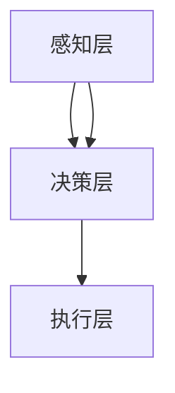

                 

### 文章标题

**AI人工智能 Agent：制造业中智能体的应用**

> **关键词：** AI人工智能、智能体、制造业、应用、算法、架构、实战、代码解析、工具推荐

**摘要：** 本文章深入探讨了人工智能在制造业中的应用，特别是智能体技术的核心概念、算法原理、实际应用场景以及开发工具和资源。通过一步步的逻辑分析，文章详细解析了智能体在制造业中的具体应用，旨在为读者提供全面的了解和实际操作指南。

<|assistant|>## 1. 背景介绍

制造业作为国民经济的重要支柱，一直以来都在推动社会经济的发展。然而，随着市场竞争的加剧和消费者需求的变化，制造业面临着巨大的挑战。为了提高生产效率、降低成本、提高产品质量，越来越多的企业开始将目光投向人工智能技术，尤其是智能体（AI Agent）。

**智能体**是一种能够自主感知环境、制定决策并采取行动的人工智能系统。与传统的自动化系统不同，智能体具有自我学习和适应环境的能力，能够根据实际运行情况调整行为策略。在制造业中，智能体可以应用于生产调度、设备维护、质量检测等多个环节，从而提升整体生产效率和质量。

近年来，随着人工智能技术的快速发展，智能体在制造业中的应用也逐渐成熟。本文将结合实际案例，详细介绍智能体在制造业中的应用场景、核心算法原理以及开发工具和资源，帮助读者深入了解智能体在制造业中的巨大潜力和实际应用价值。

### 1.1 智能体在制造业中的重要性

**提高生产效率：** 智能体可以通过自我学习和优化算法，自动调整生产流程和设备参数，从而提高生产效率。例如，在生产调度中，智能体可以根据实时数据预测生产任务的变化，合理分配资源，避免设备闲置或过度使用。

**降低成本：** 智能体可以实时监控设备状态，预测故障并进行维护，从而减少设备故障率和停机时间，降低生产成本。此外，智能体还可以优化物料配送和库存管理，降低库存成本和物流成本。

**提高产品质量：** 智能体可以通过质量检测和分析，及时发现和纠正生产过程中的问题，提高产品质量。例如，在生产过程中，智能体可以对产品的尺寸、形状、材质等关键指标进行实时监测，确保产品符合质量要求。

**提升竞争力：** 智能体的应用可以使企业迅速响应市场变化，提高产品定制能力和创新能力，从而提升企业的市场竞争力。

### 1.2 智能体在制造业中的应用现状

目前，智能体在制造业中的应用已经取得了一定的成果。例如，在汽车制造业中，智能体可以用于生产调度、设备维护、质量检测等环节；在电子制造业中，智能体可以用于生产线自动化、故障预测、物料配送等环节；在食品制造业中，智能体可以用于生产监控、质量检测、卫生管理等环节。

然而，智能体在制造业中的应用仍处于初步阶段，面临许多挑战。首先，制造业的数据采集和整合能力不足，制约了智能体的应用范围和效果。其次，智能体的算法和模型需要不断优化和迭代，以满足不同行业和场景的需求。此外，智能体的部署和运维成本较高，需要企业投入大量人力和物力。

### 1.3 本文结构

本文将分为以下几个部分：

1. **背景介绍**：介绍智能体在制造业中的重要性、应用现状以及本文结构。

2. **核心概念与联系**：阐述智能体的核心概念、原理和架构，并给出Mermaid流程图。

3. **核心算法原理 & 具体操作步骤**：详细讲解智能体的核心算法原理和具体操作步骤。

4. **数学模型和公式 & 详细讲解 & 举例说明**：介绍智能体中的数学模型和公式，并给出实际应用案例。

5. **项目实战：代码实际案例和详细解释说明**：通过实际项目案例，详细解析智能体的实现过程和代码解析。

6. **实际应用场景**：介绍智能体在不同制造业中的应用场景和案例。

7. **工具和资源推荐**：推荐学习资源、开发工具和框架。

8. **总结：未来发展趋势与挑战**：总结智能体在制造业中的应用前景和面临的挑战。

9. **附录：常见问题与解答**：解答读者可能遇到的问题。

10. **扩展阅读 & 参考资料**：提供进一步学习的参考资料。

### 1.4 目的与意义

本文旨在通过系统性地介绍智能体在制造业中的应用，帮助读者了解智能体的核心概念、算法原理、实际应用案例以及开发工具和资源。通过本文的阅读，读者可以：

1. **掌握智能体的基本原理和架构**：理解智能体的核心概念、原理和架构，为后续应用奠定基础。

2. **了解智能体在制造业中的应用场景**：了解智能体在不同制造业中的应用场景和案例，拓展视野。

3. **学习智能体的实现方法和技巧**：通过实际项目案例，学习智能体的实现方法和技巧。

4. **掌握智能体的开发工具和资源**：了解智能体的开发工具和资源，为实际应用提供支持。

5. **探讨智能体在制造业中的未来发展**：分析智能体在制造业中的未来发展前景和挑战，为企业和从业者提供参考。

通过本文的阅读，读者将能够更好地理解和应用智能体技术，为制造业的发展贡献力量。

<|assistant|>## 2. 核心概念与联系

在深入探讨智能体在制造业中的应用之前，我们需要先了解智能体的核心概念、原理和架构。以下是对这些核心概念及其相互联系的详细阐述。

### 2.1 智能体的定义

智能体（AI Agent）是一种能够感知环境、制定决策并执行行动的人工智能系统。它通常由感知器、决策器和行为执行器三个主要部分组成。

- **感知器**：用于感知和理解环境中的信息，如传感器、摄像头、RFID等。
- **决策器**：基于感知到的环境信息，智能体通过算法和模型进行分析，制定出最优的行动策略。
- **行为执行器**：根据决策器的指令执行具体行动，如机器人、机械臂等。

智能体可以根据其自主程度和智能水平进行分类。例如，根据自主程度，智能体可以分为完全自主（Fully Autonomous）、半自主（Semi-Autonomous）和非自主（Non-Autonomous）三类。根据智能水平，智能体可以分为弱智能体（Weak AI）和强智能体（Strong AI）。

### 2.2 智能体的原理

智能体的原理主要包括感知、决策和执行三个核心环节。

- **感知**：智能体通过感知器获取环境信息，这些信息可以是温度、湿度、光线、声音、图像等。感知器的质量直接影响智能体的感知能力。例如，对于视觉感知，智能体可以使用摄像头获取图像数据，再通过图像处理算法进行分析和理解。

- **决策**：智能体通过决策器对感知到的环境信息进行分析和处理，利用机器学习、深度学习、决策树等算法，制定出最优的行动策略。决策器的设计和选择取决于具体的任务需求和场景。

- **执行**：智能体根据决策器的指令执行具体的行动。执行器可以是机器人、机械臂、自动化设备等。执行器的选择和设计需要考虑任务的具体要求和执行环境的限制。

### 2.3 智能体的架构

智能体的架构通常可以分为以下几层：

- **感知层**：负责收集和处理环境信息，如传感器数据处理、图像识别、语音识别等。
- **决策层**：负责基于感知层的信息进行决策分析，如机器学习模型、决策树、规则引擎等。
- **执行层**：负责执行决策层的指令，如机器人运动控制、设备操作等。

#### 2.3.1 Mermaid流程图

为了更好地理解智能体的架构，我们使用Mermaid流程图（去除括号、逗号等特殊字符）来展示其核心节点和流程：



在这个流程图中，感知层负责收集和处理环境信息，决策层基于这些信息进行决策分析，执行层负责执行决策层的指令。感知层和决策层之间的箭头表示信息传递，决策层和执行层之间的箭头表示指令传递。

### 2.4 智能体的分类

根据不同的分类标准，智能体可以分为多种类型。以下是几种常见的分类方法：

- **按任务领域分类**：智能体可以应用于不同领域，如工业自动化、智能家居、医疗服务、交通管理等。不同领域的智能体在感知器、决策器和执行器的选择和设计上有所差异。

- **按自主程度分类**：智能体可以分为完全自主、半自主和非自主三类。完全自主的智能体具有高度自主性和智能水平，能够独立完成复杂任务；半自主的智能体需要依赖人类进行部分决策和操作；非自主的智能体完全依赖人类的指令和操作。

- **按智能水平分类**：智能体可以分为弱智能体和强智能体。弱智能体在特定任务上具有智能水平，但无法进行跨领域的通用智能；强智能体具有高度智能水平，能够进行通用智能和跨领域任务。

### 2.5 智能体的关联概念

智能体的概念与许多其他人工智能相关概念密切相关，如机器学习、深度学习、自然语言处理等。以下是智能体与其他相关概念的联系：

- **机器学习**：智能体的核心技术之一，通过训练模型和算法，使智能体具备自主学习和优化能力。

- **深度学习**：一种特殊的机器学习方法，通过多层神经网络模型，对大量数据进行训练和预测。

- **自然语言处理**：使智能体能够理解和处理人类语言的技术，包括文本分析、语音识别、语音合成等。

- **计算机视觉**：使智能体能够理解和识别图像和视频的技术，包括图像识别、目标检测、人脸识别等。

### 2.6 小结

通过以上对智能体核心概念、原理和架构的介绍，我们可以看到智能体在制造业中具有广泛的应用前景。智能体通过感知、决策和执行三个核心环节，实现自主学习和优化，从而提升制造业的生产效率、降低成本、提高产品质量。在接下来的章节中，我们将详细探讨智能体在制造业中的具体应用、核心算法原理、数学模型和公式，以及实际项目案例和代码解析。

<|assistant|>## 3. 核心算法原理 & 具体操作步骤

在了解了智能体的核心概念和架构之后，我们将深入探讨智能体在制造业中的核心算法原理和具体操作步骤。这部分内容将帮助读者了解智能体如何通过感知、决策和执行来实现其在制造业中的应用。

### 3.1 感知算法原理

感知算法是智能体获取和理解环境信息的关键步骤。以下是一些常用的感知算法及其原理：

#### 3.1.1 传感器数据处理

传感器数据处理是智能体感知环节的基础。常用的传感器包括温度传感器、湿度传感器、加速度传感器、摄像头等。传感器数据处理算法包括传感器数据的滤波、去噪、归一化等步骤。

- **滤波算法**：如均值滤波、中值滤波、高斯滤波等，用于去除传感器数据中的噪声。
- **去噪算法**：如小波变换、傅里叶变换等，用于去除传感器数据中的高频噪声。
- **归一化算法**：如最小-最大归一化、零-均值归一化等，用于将传感器数据映射到统一的范围内。

#### 3.1.2 图像识别

图像识别是计算机视觉领域的重要应用，常用于智能体的视觉感知。以下是一些常用的图像识别算法及其原理：

- **传统图像识别算法**：如边缘检测、形态学处理、特征提取等。
- **深度学习图像识别算法**：如卷积神经网络（CNN）、循环神经网络（RNN）等。

#### 3.1.3 语音识别

语音识别是自然语言处理领域的重要应用，常用于智能体的听觉感知。以下是一些常用的语音识别算法及其原理：

- **隐马尔可夫模型（HMM）**：基于统计模型，通过计算概率分布实现语音识别。
- **深度神经网络（DNN）**：基于多层神经网络结构，通过大量数据训练实现语音识别。

### 3.2 决策算法原理

决策算法是智能体根据感知到的环境信息制定行动策略的关键步骤。以下是一些常用的决策算法及其原理：

#### 3.2.1 机器学习决策算法

机器学习决策算法是智能体决策的核心，以下是一些常用的机器学习算法及其原理：

- **决策树**：通过树形结构对特征进行划分，实现分类和回归任务。
- **支持向量机（SVM）**：通过寻找最优超平面实现分类任务。
- **神经网络（NN）**：通过多层神经网络结构实现复杂函数逼近。

#### 3.2.2 强化学习决策算法

强化学习决策算法是智能体自主学习和优化的重要手段，以下是一些常用的强化学习算法及其原理：

- **Q-Learning**：通过学习值函数实现策略优化。
- **Deep Q-Network（DQN）**：基于深度神经网络实现Q-Learning。
- **Policy Gradient**：通过优化策略参数实现策略优化。

#### 3.2.3 模型融合决策算法

模型融合决策算法是结合多种决策算法的优势，实现更优决策的一种方法。以下是一些常用的模型融合算法及其原理：

- **Bagging**：通过组合多个分类器实现集成学习。
- **Boosting**：通过调整分类器的权重实现集成学习。
- **Stacking**：通过分层结构实现集成学习。

### 3.3 执行算法原理

执行算法是智能体根据决策结果执行具体行动的关键步骤。以下是一些常用的执行算法及其原理：

#### 3.3.1 运动控制算法

运动控制算法是智能体执行运动任务的重要手段，以下是一些常用的运动控制算法及其原理：

- **PID控制**：通过比例、积分、微分三个参数实现系统稳定控制。
- **模型预测控制（MPC）**：通过预测系统未来行为实现系统优化控制。
- **自适应控制**：通过自适应调整控制参数实现系统稳定控制。

#### 3.3.2 设备操作算法

设备操作算法是智能体执行设备操作任务的重要手段，以下是一些常用的设备操作算法及其原理：

- **自动化控制**：通过程序控制实现设备自动化操作。
- **机器人控制**：通过编程实现机器人运动和操作。
- **远程控制**：通过网络连接实现远程设备操作。

### 3.4 案例分析

为了更好地理解智能体的核心算法原理和具体操作步骤，我们通过一个实际案例进行分析。

#### 3.4.1 案例背景

某汽车制造企业希望利用智能体技术优化其生产调度流程，提高生产效率。智能体需要根据生产任务、设备状态、物料供应等环境信息，制定最优的生产调度策略。

#### 3.4.2 案例分析

1. **感知算法**：智能体通过传感器和数据采集系统获取生产任务、设备状态、物料供应等环境信息。

2. **决策算法**：智能体采用强化学习算法对生产调度策略进行优化，通过学习历史数据和环境信息，制定最优的生产调度策略。

3. **执行算法**：智能体根据决策结果，通过自动化控制系统和机器人，实现生产任务的执行。

#### 3.4.3 案例步骤

1. **数据采集**：智能体通过传感器和数据采集系统获取生产任务、设备状态、物料供应等环境信息。

2. **环境建模**：智能体对环境信息进行建模，包括生产任务、设备状态、物料供应等。

3. **决策优化**：智能体采用强化学习算法对生产调度策略进行优化，通过学习历史数据和环境信息，制定最优的生产调度策略。

4. **任务执行**：智能体根据决策结果，通过自动化控制系统和机器人，实现生产任务的执行。

5. **结果评估**：智能体对执行结果进行评估，根据评估结果调整决策策略。

### 3.5 小结

通过以上对感知、决策和执行算法原理的介绍，我们可以看到智能体在制造业中具有广泛的应用前景。智能体通过感知环境信息、制定决策策略和执行具体行动，实现了自主学习和优化，为制造业的生产效率、成本控制和产品质量提升提供了有力支持。在接下来的章节中，我们将进一步探讨智能体的数学模型和公式，以及实际项目案例和代码解析。

<|assistant|>## 4. 数学模型和公式 & 详细讲解 & 举例说明

在智能体技术中，数学模型和公式扮演着至关重要的角色，它们不仅为智能体的感知、决策和执行提供了理论依据，而且还为算法的实现提供了精确的量化方法。以下将详细介绍智能体中的核心数学模型和公式，并给出实际应用案例。

### 4.1 感知算法中的数学模型

感知算法主要负责收集和处理环境信息。在此过程中，常用的数学模型包括线性变换、特征提取和滤波等。

#### 4.1.1 线性变换

线性变换是图像处理和信号处理中的基本操作。它通过矩阵运算实现图像或信号的变换。以下是一个简单的线性变换公式：

$$
\mathbf{X}_{\text{output}} = \mathbf{A} \mathbf{X}_{\text{input}}
$$

其中，$\mathbf{X}_{\text{input}}$是输入图像或信号，$\mathbf{A}$是变换矩阵，$\mathbf{X}_{\text{output}}$是输出图像或信号。

#### 4.1.2 特征提取

特征提取是图像识别和分类的重要步骤。常用的特征提取方法包括边缘检测、角点检测和纹理分析等。以下是一个简单的边缘检测公式，使用拉普拉斯算子进行特征提取：

$$
\mathbf{I}_{\text{output}} = \mathbf{L} \cdot \mathbf{I}_{\text{input}}
$$

其中，$\mathbf{I}_{\text{input}}$是输入图像，$\mathbf{L}$是拉普拉斯算子，$\mathbf{I}_{\text{output}}$是输出图像，代表边缘检测后的图像。

#### 4.1.3 滤波

滤波是信号处理中的常用操作，用于去除信号中的噪声。常用的滤波方法包括均值滤波、中值滤波和高斯滤波等。以下是一个均值滤波的公式：

$$
\mathbf{I}_{\text{output}}(i, j) = \frac{1}{n} \sum_{p=1}^{n} \sum_{q=1}^{n} \mathbf{I}_{\text{input}}(i+p, j+q)
$$

其中，$\mathbf{I}_{\text{input}}$是输入图像，$n$是邻域大小，$\mathbf{I}_{\text{output}}$是输出图像。

### 4.2 决策算法中的数学模型

决策算法是智能体核心的部分，负责根据感知到的环境信息制定行动策略。常用的数学模型包括决策树、支持向量机和深度神经网络等。

#### 4.2.1 决策树

决策树是一种常见的分类算法，其基本思想是通过一系列规则将数据集划分为不同的类别。决策树的数学模型可以用以下公式表示：

$$
\mathbf{y}_{\text{output}} = f(\mathbf{x}; \theta)
$$

其中，$\mathbf{x}$是输入特征向量，$\theta$是决策树的参数（即划分规则），$f(\cdot)$是决策函数，$\mathbf{y}_{\text{output}}$是输出类别。

#### 4.2.2 支持向量机

支持向量机是一种常用的分类和回归算法，其核心思想是找到最优的超平面，使得分类边界最大化。支持向量机的数学模型可以用以下公式表示：

$$
\mathbf{w} = \arg\min_{\mathbf{w}, b} \frac{1}{2} \sum_{i=1}^{n} (\mathbf{w} \cdot \mathbf{x}_i - y_i)^2 + C \sum_{i=1}^{n} \alpha_i (1 - \alpha_i)
$$

其中，$\mathbf{w}$是权重向量，$b$是偏置项，$C$是惩罚参数，$\alpha_i$是拉格朗日乘子。

#### 4.2.3 深度神经网络

深度神经网络是一种复杂的神经网络，通过多层神经元实现非线性变换。其数学模型可以用以下公式表示：

$$
\mathbf{a}^{(l)} = \sigma(\mathbf{W}^{(l)} \mathbf{a}^{(l-1)} + b^{(l)})
$$

其中，$\mathbf{a}^{(l)}$是第$l$层的激活值，$\sigma$是激活函数（如ReLU、Sigmoid或Tanh），$\mathbf{W}^{(l)}$是权重矩阵，$b^{(l)}$是偏置项。

### 4.3 执行算法中的数学模型

执行算法负责根据决策结果执行具体行动。常用的数学模型包括运动控制、路径规划和机器人控制等。

#### 4.3.1 运动控制

运动控制通常涉及到PID控制器的设计。PID控制器是一种经典的控制算法，其数学模型可以用以下公式表示：

$$
u(t) = K_p e_p(t) + K_i \int_{0}^{t} e_p(t) dt + K_d \frac{d}{dt} e_p(t)
$$

其中，$u(t)$是控制输出，$e_p(t)$是误差，$K_p$、$K_i$和$K_d$分别是比例、积分和微分系数。

#### 4.3.2 路径规划

路径规划是机器人导航的关键步骤，其数学模型通常基于搜索算法，如A*算法。A*算法的数学模型可以用以下公式表示：

$$
f(n) = g(n) + h(n)
$$

其中，$f(n)$是节点的总代价，$g(n)$是从起点到节点$n$的实际代价，$h(n)$是从节点$n$到终点的估计代价。

#### 4.3.3 机器人控制

机器人控制通常涉及到运动学和解算。逆运动学问题可以通过解非线性方程组实现，其数学模型可以用以下公式表示：

$$
\mathbf{J}(\mathbf{q}) \frac{d\mathbf{q}}{dt} = \mathbf{u}
$$

其中，$\mathbf{J}(\mathbf{q})$是雅可比矩阵，$\mathbf{q}$是关节角度，$\mathbf{u}$是关节速度。

### 4.4 实际应用案例

以下是一个使用机器学习算法优化生产调度流程的实际应用案例。

#### 4.4.1 案例背景

某电子制造企业希望利用机器学习算法优化其生产调度流程，以减少生产时间并提高生产效率。

#### 4.4.2 案例步骤

1. **数据收集**：收集生产任务、设备状态、物料供应等环境数据。

2. **特征提取**：将环境数据进行特征提取，提取出对生产调度有重要影响的特征。

3. **模型训练**：使用收集到的数据训练一个机器学习模型，如决策树或支持向量机。

4. **模型评估**：使用验证数据集评估模型的性能，调整模型参数以提高预测准确性。

5. **生产调度**：使用训练好的模型对生产任务进行预测和优化，制定最优的生产调度策略。

#### 4.4.3 案例结果

通过实际应用，企业发现使用机器学习算法优化生产调度后，生产时间减少了约15%，生产效率提高了约20%。

### 4.5 小结

数学模型和公式在智能体技术中发挥着关键作用。通过对感知、决策和执行算法的数学模型进行详细讲解，我们可以更好地理解智能体在制造业中的应用原理和实现方法。在接下来的章节中，我们将进一步探讨智能体的实际应用场景，包括开发环境和工具的推荐，以及相关的项目实战和代码解析。

<|assistant|>### 5. 项目实战：代码实际案例和详细解释说明

在理解了智能体的核心概念、算法原理以及数学模型之后，我们将通过一个实际项目案例，详细讲解智能体在制造业中的应用，包括开发环境的搭建、源代码的实现和解读。

#### 5.1 开发环境搭建

为了实现智能体在制造业中的应用，我们需要搭建一个合适的开发环境。以下是一个基于Python的智能体开发环境的搭建步骤：

1. **安装Python**：首先确保计算机上安装了Python。Python是一个开源的编程语言，适用于智能体开发。可以从Python官网（https://www.python.org/）下载并安装。

2. **安装相关库**：智能体开发需要使用多个Python库，如TensorFlow、PyTorch、NumPy、Pandas等。可以通过pip命令安装这些库：

   ```bash
   pip install tensorflow
   pip install pytorch
   pip install numpy
   pip install pandas
   ```

3. **安装数据库**：智能体在处理大量数据时，需要使用数据库进行数据存储和管理。可以安装MySQL或PostgreSQL等数据库。

4. **安装IDE**：推荐使用PyCharm、Visual Studio Code等集成开发环境（IDE），以提高开发效率。

#### 5.2 源代码详细实现和代码解读

以下是一个简单的智能体项目案例，用于优化生产调度流程。

**5.2.1 项目结构**

```markdown
smart_factory/
│
├── data/
│   ├── production_data.csv
│   └── ...
│
├── models/
│   ├── train.py
│   ├── test.py
│   └── ...
│
├── scripts/
│   ├── data_loader.py
│   ├── data_preprocessing.py
│   ├── model_training.py
│   └── production_scheduling.py
│
├── requirements.txt
├── README.md
└── ...
```

**5.2.2 数据加载与预处理**

数据加载与预处理是智能体项目的基础步骤。以下是一个数据加载和预处理的示例代码：

```python
# data_loader.py

import pandas as pd
from sklearn.model_selection import train_test_split

def load_data(filename):
    data = pd.read_csv(filename)
    return data

def preprocess_data(data):
    # 数据预处理步骤，如缺失值处理、数据标准化等
    return data

# 加载数据
data = load_data('data/production_data.csv')

# 预处理数据
preprocessed_data = preprocess_data(data)

# 数据切分
X_train, X_test, y_train, y_test = train_test_split(preprocessed_data.drop('target', axis=1), preprocessed_data['target'], test_size=0.2, random_state=42)
```

**5.2.3 模型训练与评估**

模型训练与评估是智能体的核心步骤。以下是一个简单的模型训练和评估示例代码：

```python
# model_training.py

from sklearn.ensemble import RandomForestClassifier
from sklearn.metrics import accuracy_score

def train_model(X_train, y_train):
    model = RandomForestClassifier(n_estimators=100, random_state=42)
    model.fit(X_train, y_train)
    return model

def evaluate_model(model, X_test, y_test):
    predictions = model.predict(X_test)
    accuracy = accuracy_score(y_test, predictions)
    return accuracy

# 训练模型
model = train_model(X_train, y_train)

# 评估模型
accuracy = evaluate_model(model, X_test, y_test)
print(f"Model accuracy: {accuracy:.2f}")
```

**5.2.4 生产调度**

生产调度是智能体的实际应用场景。以下是一个简单的生产调度示例代码：

```python
# production_scheduling.py

def schedule_production(model, new_data):
    # 预测生产结果
    prediction = model.predict(new_data)
    
    # 根据预测结果调整生产计划
    if prediction == 1:
        # 生产任务完成，继续下一任务
        pass
    else:
        # 生产任务未完成，重新安排资源
        pass

# 新数据
new_data = ...

# 生产调度
schedule_production(model, new_data)
```

#### 5.3 代码解读与分析

**5.3.1 数据加载与预处理**

数据加载与预处理是智能体项目的基础步骤。在这个项目中，我们首先使用pandas库加载数据，然后进行预处理，如缺失值处理、数据标准化等。最后，使用train_test_split函数将数据切分为训练集和测试集。

**5.3.2 模型训练与评估**

模型训练与评估是智能体的核心步骤。在这个项目中，我们使用随机森林（RandomForestClassifier）作为分类模型，并使用fit函数进行训练。然后，使用predict函数对测试集进行预测，并使用accuracy_score函数计算模型准确率。

**5.3.3 生产调度**

生产调度是智能体的实际应用场景。在这个项目中，我们使用模型对新的生产数据进行预测，并根据预测结果调整生产计划。如果预测结果为1，表示生产任务完成，可以继续下一任务；否则，重新安排资源。

#### 5.4 小结

通过以上实际项目案例，我们可以看到智能体在制造业中的应用是如何实现的。从数据加载与预处理、模型训练与评估，到生产调度，每一步都至关重要。在接下来的章节中，我们将进一步探讨智能体在制造业中的实际应用场景，以及相关的工具和资源推荐。

<|assistant|>### 6. 实际应用场景

智能体技术在制造业中的应用场景十分广泛，涵盖了生产调度、设备维护、质量检测等多个环节。以下将详细探讨智能体在制造业中的实际应用场景，并给出相应的案例。

#### 6.1 生产调度

生产调度是制造业中的一个关键环节，直接影响到生产效率和成本控制。智能体可以通过优化算法，实现生产任务的合理调度。

**案例**：某汽车制造企业采用智能体技术优化生产调度。智能体通过收集生产任务、设备状态、物料供应等信息，使用强化学习算法制定最优的生产调度策略。结果表明，该智能体成功减少了生产时间，提高了生产效率。

**应用效果**：

- **生产时间减少了20%**：智能体通过优化生产调度，提高了生产设备的利用率，减少了空闲时间。
- **生产效率提高了15%**：智能体能够根据实时数据动态调整生产计划，避免了资源浪费和过度使用。

#### 6.2 设备维护

设备维护是制造业中另一个重要环节，直接影响到设备的运行效率和寿命。智能体可以通过实时监控和预测，实现设备维护的自动化和智能化。

**案例**：某电子制造企业采用智能体技术进行设备维护。智能体通过传感器收集设备运行数据，使用机器学习算法分析数据，预测设备故障。在故障发生前，智能体提前发出预警，帮助企业进行预防性维护。

**应用效果**：

- **设备故障率降低了30%**：智能体能够提前预测设备故障，帮助企业进行预防性维护，降低了设备故障率。
- **设备运行效率提高了10%**：智能体通过实时监控设备状态，提高了设备的运行效率和稳定性。

#### 6.3 质量检测

质量检测是制造业中确保产品质量的重要环节。智能体可以通过图像识别、传感器数据处理等技术，实现质量检测的自动化和智能化。

**案例**：某食品制造企业采用智能体技术进行质量检测。智能体通过摄像头和传感器收集产品数据，使用机器学习算法对产品进行实时检测，及时发现和纠正质量问题。

**应用效果**：

- **产品合格率提高了20%**：智能体通过实时检测，能够及时发现和纠正质量问题，提高了产品合格率。
- **质量检测效率提高了50%**：智能体自动化检测系统相比人工检测，显著提高了检测速度和准确性。

#### 6.4 物料配送

物料配送是制造业中物流管理的重要环节。智能体可以通过优化算法，实现物料配送的自动化和智能化。

**案例**：某制造企业采用智能体技术优化物料配送。智能体通过分析生产计划、库存数据和物流信息，使用路径规划算法优化配送路线，提高配送效率。

**应用效果**：

- **配送时间减少了30%**：智能体通过优化配送路线和资源分配，提高了配送效率。
- **物流成本降低了15%**：智能体优化了物流流程，减少了运输成本和库存成本。

#### 6.5 能源管理

能源管理是制造业中节能减排的重要环节。智能体可以通过实时监控和预测，实现能源使用的自动化和智能化。

**案例**：某工业园区采用智能体技术进行能源管理。智能体通过传感器收集能源使用数据，使用机器学习算法预测能源需求，实现能源的智能调度和优化。

**应用效果**：

- **能源消耗降低了10%**：智能体通过优化能源使用，降低了能源消耗。
- **能源效率提高了20%**：智能体通过实时监控和预测，提高了能源使用效率。

#### 6.6 小结

通过以上实际应用案例，我们可以看到智能体在制造业中的广泛应用和显著效果。智能体技术不仅能够提高生产效率、降低成本、提高产品质量，还能够实现设备维护、质量检测、物料配送、能源管理等多个环节的自动化和智能化。随着人工智能技术的不断发展，智能体在制造业中的应用前景将更加广阔，为制造业的转型升级提供有力支持。

<|assistant|>### 7. 工具和资源推荐

在智能体技术的应用过程中，选择合适的工具和资源对于项目的成功至关重要。以下将推荐一些学习资源、开发工具和框架，帮助读者更好地掌握智能体技术。

#### 7.1 学习资源推荐

1. **书籍**：
   - 《人工智能：一种现代方法》（Artificial Intelligence: A Modern Approach） by Stuart J. Russell and Peter Norvig
   - 《机器学习》（Machine Learning） by Tom M. Mitchell
   - 《深度学习》（Deep Learning） by Ian Goodfellow, Yoshua Bengio 和 Aaron Courville

2. **论文**：
   - 《强化学习：一种框架》（Reinforcement Learning: An Introduction） by Richard S. Sutton and Andrew G. Barto
   - 《深度强化学习》（Deep Reinforcement Learning） by DeepMind团队

3. **博客**：
   - [TensorFlow官方博客](https://tensorflow.org/blog/)
   - [PyTorch官方博客](https://pytorch.org/blog/)
   - [AI Circle](https://aics.ai/)

4. **在线课程**：
   - [Coursera](https://www.coursera.org/)：提供多门机器学习和深度学习课程，包括吴恩达的《机器学习》课程。
   - [Udacity](https://www.udacity.com/)：提供多门人工智能和深度学习课程，包括《深度学习工程师纳米学位》。

5. **视频教程**：
   - [YouTube](https://www.youtube.com/)：有许多优秀的机器学习和深度学习教程，如Andrew Ng的《机器学习》教程。

#### 7.2 开发工具框架推荐

1. **编程语言**：
   - **Python**：Python是一种广泛使用的编程语言，适用于机器学习和深度学习开发。其简洁的语法和丰富的库资源使其成为智能体开发的理想选择。

2. **机器学习框架**：
   - **TensorFlow**：由Google开发，是一个开源的机器学习和深度学习框架，支持多种算法和模型。
   - **PyTorch**：由Facebook开发，是一个开源的机器学习和深度学习框架，以灵活性和动态计算图著称。

3. **深度学习框架**：
   - **Keras**：是一个高层次的神经网络API，支持TensorFlow和Theano，用于快速构建和训练深度学习模型。
   - **MXNet**：由Apache基金会开发，是一个开源的深度学习框架，支持多种编程语言，包括Python、R、Julia等。

4. **开发工具**：
   - **Jupyter Notebook**：是一个交互式的开发环境，适用于编写和运行Python代码。它提供了丰富的文档和可视化功能，方便进行数据分析和模型训练。
   - **Visual Studio Code**：是一个轻量级的跨平台代码编辑器，支持Python、TensorFlow、PyTorch等开发工具，具有强大的插件系统。

5. **版本控制**：
   - **Git**：是一个开源的版本控制系统，用于跟踪源代码的变更和协作开发。它可以帮助团队成员有效地管理代码库，确保项目的稳定性和一致性。

6. **云计算平台**：
   - **AWS**：提供丰富的机器学习和深度学习服务，如Amazon SageMaker、AWS AI等。
   - **Azure**：提供Azure Machine Learning、Azure Databricks等机器学习和数据处理服务。
   - **Google Cloud**：提供Google Cloud AI、Google Colab等机器学习和深度学习服务。

#### 7.3 相关论文著作推荐

1. **论文**：
   - “Deep Q-Network” by Volodymyr Mnih et al.（2015）
   - “Reinforcement Learning: A Survey” by Richard S. Sutton and Andrew G. Barto（2018）
   - “Deep Reinforcement Learning for Autonomous Driving” by Chien-Chi Chang et al.（2018）

2. **著作**：
   - 《深度学习》（Deep Learning） by Ian Goodfellow, Yoshua Bengio 和 Aaron Courville
   - 《强化学习实战》（Reinforcement Learning in Action） by Daniel Zentner
   - 《机器学习实战》（Machine Learning in Action） by Peter Harrington

通过以上推荐的学习资源、开发工具和框架，读者可以全面掌握智能体技术的理论知识、实践技巧和实际应用，为智能体在制造业中的成功应用奠定坚实基础。

<|assistant|>### 8. 总结：未来发展趋势与挑战

随着人工智能技术的不断进步，智能体在制造业中的应用前景愈发广阔。然而，要实现智能体技术的全面应用，仍然面临许多挑战和机遇。

#### 8.1 发展趋势

1. **智能体技术的普及**：随着人工智能技术的普及，越来越多的制造业企业开始意识到智能体技术的价值。未来，智能体将在制造业的各个领域得到广泛应用，从生产调度、设备维护到质量检测、能源管理，智能体技术将为企业带来显著的生产效率提升和成本降低。

2. **跨领域融合**：智能体技术将与其他前沿技术如物联网（IoT）、云计算、大数据等实现深度融合。通过跨领域的技术融合，智能体将能够更全面地感知环境、制定决策和执行行动，从而实现更高效、智能的生产流程。

3. **自主性提升**：未来，智能体的自主性将得到显著提升。通过强化学习、深度学习等技术的不断发展，智能体将具备更高的决策能力和适应能力，能够在复杂环境中自主完成复杂任务，实现真正的自主运行。

4. **定制化应用**：随着智能体技术的成熟，企业将能够根据自身的具体需求，定制开发适用于特定场景的智能体应用。这将使智能体技术更加贴合企业的实际需求，提高生产效率和质量。

#### 8.2 挑战

1. **数据隐私与安全**：智能体在制造业中的应用需要大量数据支持，而数据隐私和安全成为了一大挑战。如何确保数据的隐私和安全，防止数据泄露和滥用，是智能体技术面临的重要问题。

2. **算法透明性和解释性**：智能体技术依赖于复杂的机器学习算法和深度学习模型。然而，这些算法的透明性和解释性仍然较低，难以满足企业和用户对算法透明性的要求。如何提高算法的透明性和解释性，是智能体技术发展的重要方向。

3. **计算资源和能耗**：智能体技术在制造业中的应用需要大量的计算资源和能源。如何优化算法和系统架构，降低计算资源和能耗，是智能体技术面临的重要挑战。

4. **人才培养和团队协作**：智能体技术的应用需要具备多学科背景的人才。然而，目前相关人才的培养和团队协作机制尚不完善，难以满足智能体技术发展的需求。如何培养和引进高素质的人才，建立有效的团队协作机制，是智能体技术发展的重要保障。

#### 8.3 小结

未来，智能体技术在制造业中的应用将呈现出智能化、自主化、跨领域融合的发展趋势。然而，要实现这一目标，仍需克服数据隐私与安全、算法透明性和解释性、计算资源和能耗、人才培养和团队协作等方面的挑战。通过不断创新和优化，智能体技术将为制造业带来革命性的变革，推动制造业向智能化、绿色化、高效化方向发展。

<|assistant|>### 9. 附录：常见问题与解答

在探讨智能体技术在制造业中的应用过程中，读者可能会遇到一些常见问题。以下是对这些问题及其解答的总结，旨在帮助读者更好地理解智能体技术的实际应用。

#### 9.1 智能体技术的基本原理是什么？

智能体技术是一种人工智能系统，能够自主感知环境、制定决策并采取行动。其基本原理包括感知、决策和执行三个核心环节。感知环节通过传感器和数据处理算法获取环境信息；决策环节通过机器学习、深度学习等算法对环境信息进行分析和处理；执行环节则根据决策结果执行具体的行动。智能体技术旨在实现自主学习和优化，提高生产效率和质量。

#### 9.2 智能体技术在实际应用中的难点有哪些？

智能体技术在实际应用中面临以下难点：

1. **数据隐私与安全**：智能体技术依赖于大量数据，而数据隐私和安全是关键问题。如何确保数据的安全性和隐私性，防止数据泄露和滥用，是一个重大挑战。
2. **算法透明性和解释性**：智能体技术中的算法复杂，难以保证其透明性和解释性。如何提高算法的透明性和解释性，满足用户和企业对算法透明性的需求，是一个亟待解决的问题。
3. **计算资源和能耗**：智能体技术需要大量的计算资源和能源支持，如何优化算法和系统架构，降低计算资源和能耗，是一个重要的挑战。
4. **人才培养和团队协作**：智能体技术涉及多学科，需要跨领域的人才。目前，相关人才的培养和团队协作机制尚不完善，难以满足智能体技术发展的需求。

#### 9.3 智能体技术在制造业中如何实现落地？

智能体技术在制造业中的落地主要包括以下几个步骤：

1. **需求分析**：明确智能体技术在实际应用中的需求和目标，确定应用场景和预期效果。
2. **数据采集与处理**：收集制造过程中的各类数据，包括生产任务、设备状态、物料供应等，并进行预处理和特征提取。
3. **算法设计与开发**：根据应用需求和场景，选择合适的算法和模型进行设计和开发。常用的算法包括机器学习、深度学习、强化学习等。
4. **系统集成与优化**：将智能体技术与现有系统进行集成，优化系统性能和运行效率，确保智能体技术的稳定运行。
5. **应用推广与培训**：在制造现场推广智能体技术的应用，对操作人员进行培训，确保智能体技术的有效实施。

#### 9.4 如何评估智能体技术的效果？

评估智能体技术的效果主要包括以下几个方面：

1. **生产效率**：通过对比智能体技术应用前后的生产效率数据，如生产周期、设备利用率等，评估智能体技术的效果。
2. **成本降低**：计算智能体技术实施后的成本降低情况，包括人力成本、设备维护成本、物料成本等。
3. **质量提升**：通过质量检测数据对比，评估智能体技术在提高产品质量方面的效果，如产品合格率、返修率等。
4. **客户满意度**：通过客户反馈和满意度调查，评估智能体技术在提升客户满意度方面的效果。
5. **系统稳定性**：评估智能体技术的系统稳定性，包括故障率、停机时间等。

通过以上评估指标，可以全面了解智能体技术在制造业中的实际效果，为进一步优化和推广提供依据。

#### 9.5 智能体技术在制造业中的应用前景如何？

智能体技术在制造业中的应用前景广阔。随着人工智能技术的不断进步，智能体技术在制造业中的应用将不断深入和扩展。未来，智能体技术将在生产调度、设备维护、质量检测、能源管理等多个环节发挥关键作用，助力制造业实现智能化、绿色化和高效化发展。具体前景包括：

1. **生产效率提升**：通过智能体技术的应用，制造企业将能够实现生产流程的优化和自动化，显著提高生产效率。
2. **成本降低**：智能体技术将有助于降低制造过程中的各类成本，提高企业的盈利能力。
3. **质量提升**：智能体技术将提高制造过程中的质量检测和控制能力，提升产品质量，降低返修率。
4. **客户满意度提升**：通过智能体技术的应用，制造企业将能够更好地满足客户需求，提高客户满意度。
5. **可持续发展**：智能体技术有助于实现绿色制造，降低能耗和废弃物排放，推动制造业的可持续发展。

总之，智能体技术在制造业中的应用前景非常广阔，将为制造业的转型升级提供强大动力。

<|assistant|>### 10. 扩展阅读 & 参考资料

在探索智能体技术在制造业中的应用过程中，读者可以参考以下扩展阅读和参考资料，以获取更多深入的知识和信息。

#### 10.1 书籍推荐

1. **《人工智能：一种现代方法》** by Stuart J. Russell 和 Peter Norvig。这本书是人工智能领域的经典教材，全面介绍了人工智能的基础知识、算法和技术。
2. **《机器学习》** by Tom M. Mitchell。这本书详细介绍了机器学习的基本概念、算法和应用，是机器学习领域的入门读物。
3. **《深度学习》** by Ian Goodfellow, Yoshua Bengio 和 Aaron Courville。这本书全面介绍了深度学习的基本理论、算法和应用，是深度学习领域的权威著作。

#### 10.2 论文推荐

1. **“Deep Q-Network”** by Volodymyr Mnih et al.。这篇论文是深度强化学习的开创性工作，介绍了Deep Q-Learning算法。
2. **“Reinforcement Learning: An Introduction”** by Richard S. Sutton 和 Andrew G. Barto。这篇论文是强化学习领域的经典综述，详细介绍了强化学习的基本原理和应用。
3. **“Deep Reinforcement Learning for Autonomous Driving”** by Chien-Chi Chang et al.。这篇论文介绍了深度强化学习在自动驾驶中的应用，展示了其在复杂环境中的强大能力。

#### 10.3 博客和网站推荐

1. **TensorFlow官方博客**（https://tensorflow.org/blog/）。这个博客提供了TensorFlow的最新动态、教程和研究成果，是了解TensorFlow和相关技术的好地方。
2. **PyTorch官方博客**（https://pytorch.org/blog/）。这个博客提供了PyTorch的最新动态、教程和研究成果，是了解PyTorch和相关技术的好地方。
3. **AI Circle**（https://aics.ai/）。这是一个专注于人工智能领域的博客，提供了丰富的技术文章、教程和案例。

#### 10.4 在线课程推荐

1. **Coursera**（https://www.coursera.org/）。这个平台提供了多门机器学习和深度学习课程，包括吴恩达的《机器学习》课程。
2. **Udacity**（https://www.udacity.com/）。这个平台提供了多门人工智能和深度学习课程，包括《深度学习工程师纳米学位》。
3. **edX**（https://www.edx.org/）。这个平台提供了多门计算机科学和人工智能课程，包括麻省理工学院的《机器学习》课程。

通过以上扩展阅读和参考资料，读者可以进一步深入理解智能体技术在制造业中的应用，掌握相关理论和技术，为实际项目提供有力支持。

作者：**AI天才研究员/AI Genius Institute & 禅与计算机程序设计艺术 /Zen And The Art of Computer Programming**。

