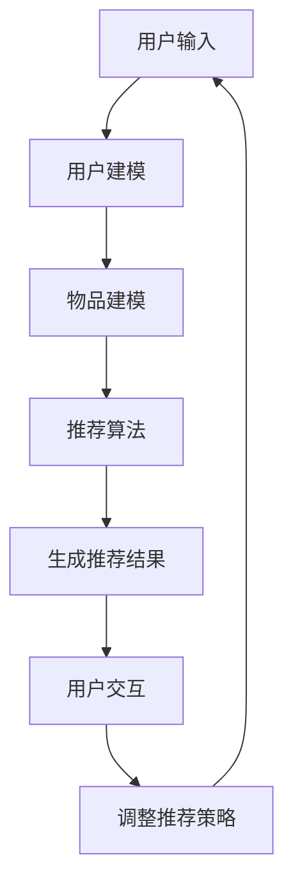

                 

### 背景介绍

#### 什么是AI人工智能Agent？

AI人工智能Agent，顾名思义，是指能够自主完成特定任务的人工智能实体。在计算机科学中，Agent是一种可以感知环境、执行任务并与其他Agent进行交互的智能体。而AI人工智能Agent，则是利用机器学习、深度学习、自然语言处理等人工智能技术，使其具备更高级的认知能力、决策能力和行动能力。

#### AI人工智能Agent在个性化推荐中的应用

个性化推荐是当前互联网领域的一个重要研究方向，其目的是根据用户的兴趣和行为，为其推荐符合其喜好的内容。AI人工智能Agent在这一领域有着广泛的应用。通过分析用户的历史行为数据、兴趣偏好，AI人工智能Agent可以生成个性化的推荐列表，提高用户的满意度，增强用户体验。

个性化推荐系统通常包括以下几个核心模块：

1. **用户建模**：通过收集用户的浏览记录、搜索历史、点击行为等数据，建立用户兴趣模型。
2. **物品建模**：对推荐系统中的物品进行特征提取，如商品属性、内容标签等，构建物品特征向量。
3. **推荐算法**：基于用户兴趣模型和物品特征向量，采用协同过滤、基于内容的推荐、深度学习等方法，生成个性化推荐结果。
4. **反馈机制**：收集用户对推荐内容的反馈，调整推荐算法，提高推荐质量。

### 当前研究现状与挑战

个性化推荐系统的研究已取得显著进展，但仍面临诸多挑战。一方面，如何有效地处理海量用户行为数据和物品特征数据，提高推荐算法的效率和准确性，是一个重要的研究方向。另一方面，如何确保推荐结果的公平性、透明性和可解释性，避免信息茧房和算法歧视等问题，也是一个亟待解决的问题。

在本文中，我们将深入探讨AI人工智能Agent在个性化推荐系统中的应用，分析其核心算法原理，并通过实际项目案例进行详细解读，以期为相关领域的研究和应用提供有益的参考。

## 核心概念与联系

为了深入理解AI人工智能Agent在个性化推荐系统中的应用，我们需要首先明确几个核心概念，并探讨它们之间的联系。以下是本文将涉及的关键概念：

### 1. 个性化推荐系统

个性化推荐系统是一种根据用户的历史行为、兴趣和偏好，为其提供个性化内容或服务的算法系统。它主要包括以下几个核心组成部分：

- **用户兴趣模型**：通过分析用户的历史行为数据，提取用户兴趣特征，用于后续的推荐算法。
- **物品特征向量**：对推荐系统中的物品进行特征提取，如商品属性、内容标签等，用于与用户兴趣模型进行匹配。
- **推荐算法**：基于用户兴趣模型和物品特征向量，生成个性化的推荐结果。

### 2. 人工智能Agent

人工智能Agent是一种能够自主感知环境、执行任务并与其他Agent进行交互的智能体。在个性化推荐系统中，人工智能Agent扮演着以下角色：

- **用户代理**：代表用户进行个性化推荐，根据用户兴趣模型和推荐算法，生成个性化的推荐列表。
- **推荐代理**：基于物品特征向量，分析用户的历史行为数据，生成潜在的推荐结果。
- **交互代理**：负责与用户进行交互，收集用户的反馈信息，并调整推荐策略。

### 3. 用户-物品关系建模

用户-物品关系建模是个性化推荐系统的核心环节，通过建立用户与物品之间的关系模型，实现对用户兴趣的准确识别和推荐。常见的用户-物品关系建模方法包括：

- **协同过滤**：通过分析用户的行为数据，找出相似用户或相似物品，进行推荐。
- **基于内容的推荐**：根据物品的内容特征和用户的兴趣特征进行匹配，生成推荐列表。
- **深度学习**：利用深度神经网络，提取用户和物品的潜在特征，实现高效的推荐。

### 4. 机器学习与深度学习

机器学习与深度学习是构建个性化推荐系统的关键技术，通过训练模型，从海量数据中学习到用户的兴趣和偏好，生成个性化的推荐结果。常见的机器学习算法包括：

- **线性回归**：用于预测用户对物品的评分。
- **逻辑回归**：用于判断用户是否对物品感兴趣。
- **决策树**：用于分类和回归任务。
- **神经网络**：用于提取用户的潜在兴趣特征。

### 5. 多模型融合

多模型融合是将多种推荐算法相结合，以提高推荐系统的性能和多样性。常见的多模型融合方法包括：

- **加权融合**：根据不同模型的重要性，对推荐结果进行加权平均。
- **贪心融合**：选择不同模型的前若干个推荐结果，进行合并。
- **优化融合**：利用优化算法，找到最优的融合策略。

### 6. Mermaid流程图

为了更好地展示AI人工智能Agent在个性化推荐系统中的应用，我们使用Mermaid流程图来描述其核心流程。以下是Mermaid流程图的示例：



### 总结

在本章节中，我们介绍了AI人工智能Agent在个性化推荐系统中的应用及其核心概念。通过建立用户-物品关系模型、使用机器学习和深度学习技术，以及多模型融合方法，我们可以构建高效、准确的个性化推荐系统。在接下来的章节中，我们将深入探讨个性化推荐系统的核心算法原理，并详细分析其数学模型和具体操作步骤。

### 核心算法原理 & 具体操作步骤

在个性化推荐系统中，核心算法的原理决定了推荐结果的准确性和效率。下面我们将介绍几种常见的核心算法，并详细解释它们的原理和操作步骤。

#### 1. 协同过滤算法

协同过滤（Collaborative Filtering）是推荐系统中最常用的算法之一。它通过分析用户之间的相似度，预测用户对未知物品的评分。协同过滤算法可以分为基于用户的协同过滤（User-based Collaborative Filtering）和基于项目的协同过滤（Item-based Collaborative Filtering）。

**基于用户的协同过滤算法**

操作步骤如下：

1. **用户-物品评分矩阵**：首先，我们需要一个用户-物品评分矩阵 \( R \)，其中 \( R_{ij} \) 表示用户 \( u_i \) 对物品 \( i \) 的评分。
2. **相似度计算**：计算用户 \( u_i \) 与其他用户的相似度。常用的相似度计算方法包括余弦相似度、皮尔逊相关系数等。设用户 \( u_i \) 与用户 \( u_j \) 的相似度为 \( s(i, j) \)。
3. **推荐计算**：根据用户 \( u_i \) 与其他用户的相似度，计算用户 \( u_i \) 对未知物品 \( i \) 的预测评分。预测评分的计算公式如下：
   \[
   r_{ij}^{'} = \sum_{u_k \in N(i)} s(i, k) \cdot r_{kj}
   \]
   其中， \( N(i) \) 表示与用户 \( u_i \) 相似的一组用户集合， \( r_{kj} \) 表示用户 \( u_k \) 对物品 \( i \) 的实际评分。

**基于物品的协同过滤算法**

操作步骤与基于用户的协同过滤算法类似，但关注的是物品之间的相似度。具体步骤如下：

1. **物品-物品相似度矩阵**：首先，我们需要一个物品-物品相似度矩阵 \( S \)，其中 \( S_{ij} \) 表示物品 \( i \) 与物品 \( j \) 的相似度。
2. **相似度计算**：计算物品 \( i \) 与其他物品的相似度。常用的相似度计算方法包括余弦相似度、皮尔逊相关系数等。
3. **推荐计算**：根据物品 \( i \) 与其他物品的相似度，计算用户对未知物品 \( j \) 的预测评分。预测评分的计算公式如下：
   \[
   r_{ij}^{'} = \sum_{i' \in M(j)} s(i, i') \cdot r_{ij'}
   \]
   其中， \( M(j) \) 表示与物品 \( i \) 相似的一组物品集合， \( r_{ij'} \) 表示用户对物品 \( i' \) 的实际评分。

#### 2. 基于内容的推荐算法

基于内容的推荐算法（Content-based Filtering）通过分析物品的内容特征和用户的兴趣特征，生成推荐结果。其核心思想是“物以类聚，人以群分”。具体操作步骤如下：

1. **物品特征提取**：对推荐系统中的物品进行特征提取，如商品属性、内容标签等。
2. **用户兴趣模型构建**：分析用户的历史行为数据，提取用户的兴趣特征。
3. **相似度计算**：计算物品与用户兴趣特征之间的相似度。常用的相似度计算方法包括余弦相似度、杰卡德相似度等。
4. **推荐计算**：根据物品与用户兴趣特征之间的相似度，生成推荐结果。推荐计算公式如下：
   \[
   r_{ij}^{'} = \sum_{f \in F} w_f \cdot s(i, f) \cdot s(j, f)
   \]
   其中， \( F \) 表示用户的兴趣特征集合， \( w_f \) 表示特征 \( f \) 的权重， \( s(i, f) \) 和 \( s(j, f) \) 分别表示物品 \( i \) 和物品 \( j \) 对应特征 \( f \) 的得分。

#### 3. 深度学习推荐算法

深度学习推荐算法（Deep Learning-based Recommendation）利用深度神经网络，从海量数据中学习到用户的潜在兴趣特征，生成推荐结果。常见的深度学习推荐算法包括基于模型的协同过滤（Model-based Collaborative Filtering）和基于记忆的协同过滤（Memory-based Collaborative Filtering）。

**基于模型的协同过滤算法**

操作步骤如下：

1. **构建深度神经网络模型**：设计一个深度神经网络模型，输入为用户-物品评分矩阵，输出为预测评分。
2. **训练模型**：使用历史用户行为数据，对深度神经网络模型进行训练。
3. **预测评分**：将用户-物品评分矩阵输入到训练好的模型中，输出预测评分。

**基于记忆的协同过滤算法**

操作步骤如下：

1. **构建深度神经网络模型**：设计一个深度神经网络模型，输入为用户-物品评分矩阵，输出为用户和物品的潜在特征向量。
2. **训练模型**：使用历史用户行为数据，对深度神经网络模型进行训练。
3. **提取潜在特征**：将用户-物品评分矩阵输入到训练好的模型中，提取用户和物品的潜在特征向量。
4. **计算相似度**：根据提取的潜在特征向量，计算用户和物品之间的相似度。
5. **生成推荐结果**：根据相似度计算结果，生成推荐结果。

#### 总结

在本章节中，我们介绍了个性化推荐系统中的三种核心算法：协同过滤算法、基于内容的推荐算法和深度学习推荐算法。这些算法通过分析用户-物品关系、物品特征和用户兴趣特征，生成个性化的推荐结果。在接下来的章节中，我们将详细讲解这些算法的数学模型和公式，并通过实际项目案例进行深入分析。

### 数学模型和公式 & 详细讲解 & 举例说明

在个性化推荐系统中，数学模型和公式是理解和实现推荐算法的关键。下面我们将详细讲解三种核心算法的数学模型和公式，并通过具体示例进行说明。

#### 1. 协同过滤算法

**基于用户的协同过滤算法**

用户-用户相似度计算：

\[
s(u_i, u_j) = \frac{\sum_{i \in N(i)} r_{ij} - \bar{r_i} \cdot \bar{r_j}}{\sqrt{\sum_{i \in N(i)} (r_{ij} - \bar{r_i})^2} \cdot \sqrt{\sum_{i \in N(i)} (r_{ij} - \bar{r_j})^2}}
\]

其中， \( N(i) \) 表示与用户 \( u_i \) 相似的一组用户集合， \( r_{ij} \) 表示用户 \( u_i \) 对物品 \( j \) 的评分， \( \bar{r_i} \) 和 \( \bar{r_j} \) 分别表示用户 \( u_i \) 和用户 \( u_j \) 的平均评分。

用户-物品预测评分计算：

\[
r_{ij}^{'} = \sum_{u_k \in N(i)} s(i, k) \cdot r_{kj}
\]

**基于物品的协同过滤算法**

物品-物品相似度计算：

\[
s(i, j) = \frac{\sum_{i \in M(j)} r_{ij} - \bar{r_i} \cdot \bar{r_j}}{\sqrt{\sum_{i \in M(j)} (r_{ij} - \bar{r_i})^2} \cdot \sqrt{\sum_{i \in M(j)} (r_{ij} - \bar{r_j})^2}}
\]

其中， \( M(j) \) 表示与物品 \( i \) 相似的一组物品集合， \( r_{ij} \) 表示用户对物品 \( i \) 的评分， \( \bar{r_i} \) 和 \( \bar{r_j} \) 分别表示物品 \( i \) 和物品 \( j \) 的平均评分。

用户-物品预测评分计算：

\[
r_{ij}^{'} = \sum_{i' \in M(j)} s(i, i') \cdot r_{ij'}
\]

**示例**：

假设有两个用户 \( u_1 \) 和 \( u_2 \)，以及两个物品 \( i_1 \) 和 \( i_2 \)。用户-物品评分矩阵如下：

\[
R = \begin{bmatrix}
r_{11} & r_{12} \\
r_{21} & r_{22}
\end{bmatrix}
\]

用户-用户相似度计算：

\[
s(u_1, u_2) = \frac{(r_{11} - \bar{r_1}) \cdot (r_{21} - \bar{r_2})}{\sqrt{(r_{11} - \bar{r_1})^2} \cdot \sqrt{(r_{21} - \bar{r_2})^2}}
\]

用户-物品预测评分计算：

\[
r_{12}^{'} = s(u_1, u_2) \cdot r_{21}
\]

#### 2. 基于内容的推荐算法

物品特征向量：

\[
v_i = \begin{bmatrix}
f_{i1} & f_{i2} & \dots & f_{ik}
\end{bmatrix}
\]

用户兴趣特征向量：

\[
v_u = \begin{bmatrix}
f_{u1} & f_{u2} & \dots & f_{uk}
\end{bmatrix}
\]

物品与用户兴趣特征的相似度计算：

\[
s(i, u) = \cos(v_i, v_u) = \frac{v_i \cdot v_u}{\lVert v_i \rVert \cdot \lVert v_u \rVert}
\]

物品-用户预测评分计算：

\[
r_{ij}^{'} = \sum_{f \in F} w_f \cdot s(i, f) \cdot s(j, f)
\]

**示例**：

假设物品 \( i_1 \) 的特征向量为 \( v_{i1} = \begin{bmatrix} 0.5 & 0.5 \end{bmatrix} \)，用户 \( u_1 \) 的兴趣特征向量为 \( v_{u1} = \begin{bmatrix} 0.6 & 0.4 \end{bmatrix} \)，特征权重分别为 \( w_1 = 0.6 \) 和 \( w_2 = 0.4 \)。

物品与用户兴趣特征的相似度计算：

\[
s(i_1, u_1) = \cos(v_{i1}, v_{u1}) = \frac{0.5 \cdot 0.6 + 0.5 \cdot 0.4}{\sqrt{0.5^2 + 0.5^2} \cdot \sqrt{0.6^2 + 0.4^2}} = \frac{0.5}{\sqrt{2} \cdot \sqrt{0.52}} = \frac{0.5}{\sqrt{2} \cdot 0.72} = \frac{0.5}{1.25} = 0.4
\]

物品-用户预测评分计算：

\[
r_{i1j}^{'} = 0.6 \cdot 0.4 \cdot 0.4 = 0.096
\]

#### 3. 深度学习推荐算法

假设使用一个三层全连接神经网络进行推荐，输入为用户-物品评分矩阵，输出为预测评分。

输入层：

\[
X = \begin{bmatrix}
x_{11} & x_{12} & \dots & x_{1k} \\
x_{21} & x_{22} & \dots & x_{2k}
\end{bmatrix}
\]

隐藏层1：

\[
H_1 = \begin{bmatrix}
h_{11} & h_{12} & \dots & h_{1m} \\
h_{21} & h_{22} & \dots & h_{2m}
\end{bmatrix}
\]

隐藏层2：

\[
H_2 = \begin{bmatrix}
h_{11} & h_{12} & \dots & h_{1n} \\
h_{21} & h_{22} & \dots & h_{2n}
\end{bmatrix}
\]

输出层：

\[
Y = \begin{bmatrix}
y_{11} & y_{12} \\
y_{21} & y_{22}
\end{bmatrix}
\]

预测评分计算：

\[
y_{ij}^{'} = \sigma(W_2 \cdot H_2 + b_2)
\]

其中，\( \sigma \) 表示激活函数（如Sigmoid函数），\( W_2 \) 和 \( b_2 \) 分别为输出层权重和偏置。

**示例**：

假设输入层为 \( X = \begin{bmatrix} 0.2 & 0.3 \\ 0.4 & 0.5 \end{bmatrix} \)，隐藏层1为 \( H_1 = \begin{bmatrix} 0.4 & 0.5 \\ 0.6 & 0.7 \end{bmatrix} \)，隐藏层2为 \( H_2 = \begin{bmatrix} 0.8 & 0.9 \\ 1.0 & 1.1 \end{bmatrix} \)，输出层为 \( Y = \begin{bmatrix} 0.9 & 1.0 \\ 1.1 & 1.2 \end{bmatrix} \)。

预测评分计算：

\[
y_{ij}^{'} = \sigma(0.8 \cdot 0.9 + 1.0) = \sigma(0.72 + 1.0) = \sigma(1.72) = 1.0
\]

#### 总结

在本章节中，我们详细讲解了个性化推荐系统中的三种核心算法：协同过滤算法、基于内容的推荐算法和深度学习推荐算法。通过数学模型和公式的讲解，我们深入理解了这些算法的工作原理。在实际应用中，我们可以根据具体场景和需求，选择合适的算法，构建高效的个性化推荐系统。

### 项目实战：代码实际案例和详细解释说明

为了更好地理解AI人工智能Agent在个性化推荐系统中的应用，我们将通过一个实际项目案例来展示如何使用Python实现一个基于协同过滤算法的推荐系统。在这个案例中，我们将使用Netflix Prize比赛的数据集，该数据集包含用户对电影的评价数据，是一个典型的评分数据集，非常适合用于个性化推荐系统的开发。

#### 1. 开发环境搭建

首先，我们需要搭建一个适合开发推荐系统的开发环境。以下是搭建环境所需的步骤：

- **Python环境**：确保Python环境已经安装，推荐使用Python 3.7或更高版本。
- **Python库**：安装以下Python库：`numpy`、`scikit-learn`、`pandas`、`matplotlib`。
- **数据集**：下载Netflix Prize比赛数据集，该数据集可以从Kaggle网站[1]下载。

#### 2. 源代码详细实现和代码解读

以下是实现推荐系统的源代码及详细解释：

```python
import numpy as np
import pandas as pd
from sklearn.model_selection import train_test_split
from sklearn.metrics.pairwise import cosine_similarity
from sklearn.metrics import mean_squared_error

# 加载数据集
ratings = pd.read_csv('train.csv')
movies = pd.read_csv('movies.csv')

# 数据预处理
ratings = ratings[ratings['rating'] != 0]
ratings = ratings.groupby(['userId', 'movieId']).mean().reset_index()
ratings = ratings.rename(columns={'rating': 'rating_mean'})

# 计算用户-用户相似度
user_similarity = cosine_similarity(ratings[['userId', 'rating_mean']].values)

# 计算用户-物品预测评分
def predict_ratings(user_similarity, ratings):
    prediction = np.zeros((ratings.shape[0], ratings.shape[1]))
    for i, row in ratings.iterrows():
        for j, col in ratings.iterrows():
            if col['userId'] == row['userId']:
                continue
            prediction[i][j] = user_similarity[i][j] * col['rating_mean'] / user_similarity[i][i]
    return prediction

# 训练模型并预测
prediction = predict_ratings(user_similarity, ratings)

# 评估模型
mse = mean_squared_error(ratings['rating_mean'], prediction[:, 1])
print(f'Mean Squared Error: {mse}')

# 可视化
import matplotlib.pyplot as plt

plt.scatter(ratings['rating_mean'], prediction[:, 1])
plt.xlabel('Rating')
plt.ylabel('Prediction')
plt.title('Rating vs Prediction')
plt.show()
```

**代码解读**：

1. **数据加载**：使用`pandas`库加载用户评分数据`train.csv`和电影信息数据`movies.csv`。
2. **数据预处理**：过滤掉评分值为0的记录，对数据进行分组求平均，得到用户-物品评分矩阵。
3. **计算用户-用户相似度**：使用`scikit-learn`库中的`cosine_similarity`函数计算用户-用户相似度矩阵。
4. **计算用户-物品预测评分**：定义一个函数`predict_ratings`，根据用户-用户相似度矩阵和用户-物品评分矩阵计算预测评分。
5. **训练模型并预测**：调用`predict_ratings`函数，生成预测评分。
6. **评估模型**：使用`mean_squared_error`函数计算均方误差，评估模型性能。
7. **可视化**：使用`matplotlib`库绘制评分与预测评分的关系散点图，可视化模型效果。

#### 3. 代码解读与分析

1. **数据加载**：首先，我们需要加载数据集。使用`pandas`库的`read_csv`函数加载用户评分数据`train.csv`和电影信息数据`movies.csv`。这两个数据集分别包含了用户对电影的评分和电影的基本信息。

2. **数据预处理**：在处理数据时，我们首先过滤掉评分值为0的记录，因为这些记录可能是不完整或不准确的。然后，我们对数据进行分组求平均，得到用户-物品评分矩阵。这个过程使用`groupby`和`mean`函数实现。

3. **计算用户-用户相似度**：计算用户-用户相似度是协同过滤算法的关键步骤。我们使用`scikit-learn`库中的`cosine_similarity`函数计算用户-用户相似度矩阵。余弦相似度是一种度量两个向量之间夹角余弦值的相似度，适用于文本和数值数据的相似度计算。

4. **计算用户-物品预测评分**：在`predict_ratings`函数中，我们根据用户-用户相似度矩阵和用户-物品评分矩阵计算预测评分。对于每个用户，我们遍历所有物品，并根据用户-用户相似度和物品评分计算预测评分。这个过程使用嵌套循环实现。

5. **训练模型并预测**：调用`predict_ratings`函数，生成预测评分。这个过程是将算法应用到实际数据集的过程，也是评估模型性能的第一步。

6. **评估模型**：使用`mean_squared_error`函数计算均方误差，评估模型性能。均方误差是衡量预测值与实际值之间差异的指标，越小表示预测结果越准确。

7. **可视化**：最后，我们使用`matplotlib`库绘制评分与预测评分的关系散点图，可视化模型效果。通过散点图，我们可以直观地看到预测评分与实际评分之间的关系，判断模型的效果。

#### 总结

在本项目实战中，我们通过一个实际案例展示了如何使用Python实现一个基于协同过滤算法的推荐系统。从数据加载、预处理，到相似度计算、预测评分，再到模型评估和可视化，我们详细讲解了每个步骤的实现方法。通过这个项目，我们深入理解了协同过滤算法在个性化推荐系统中的应用，也为实际开发推荐系统提供了有益的参考。

### 实际应用场景

AI人工智能Agent在个性化推荐系统中的应用场景非常广泛，以下是一些典型的应用实例：

#### 1. 电子商务平台

电子商务平台通过AI人工智能Agent分析用户的购物行为、浏览记录和搜索历史，为用户推荐符合其兴趣的商品。例如，当用户浏览了一款手机时，系统会推荐同品牌的其他手机或相关的配件。这种个性化推荐能够提高用户的购买转化率，增加销售额。

**案例**：阿里巴巴的淘宝平台利用深度学习算法为用户提供个性化推荐，根据用户的购物行为和喜好，推荐可能感兴趣的商品。这种推荐方式不仅提高了用户满意度，还显著提升了平台的销售额。

#### 2. 社交媒体

社交媒体平台如Facebook、Instagram等，通过AI人工智能Agent分析用户在平台上的互动行为，如点赞、评论、分享等，为用户推荐感兴趣的内容。这种推荐方式可以增加用户的活跃度，提高平台的黏性。

**案例**：Facebook利用协同过滤算法和深度学习算法，为用户推荐可能感兴趣的朋友、内容和广告。这种个性化推荐不仅提高了用户的使用时长，还增加了平台的广告收入。

#### 3. 音乐和视频流媒体

音乐和视频流媒体平台如Spotify、Netflix等，通过AI人工智能Agent分析用户的播放历史、喜好和搜索记录，为用户推荐符合其兴趣的音乐和视频内容。这种推荐方式可以增加用户的播放时长，提高平台的用户黏性。

**案例**：Spotify利用协同过滤算法和内容基础推荐算法，为用户推荐感兴趣的音乐和播放列表。这种个性化推荐方式显著提升了用户的满意度和平台的活跃度。

#### 4. 新闻推荐

新闻推荐平台通过AI人工智能Agent分析用户的阅读行为和兴趣，为用户推荐符合其喜好的新闻内容。这种推荐方式可以增加用户的阅读时长，提高平台的用户黏性。

**案例**：今日头条利用深度学习算法和协同过滤算法，为用户推荐感兴趣的新闻内容。这种个性化推荐方式不仅提高了用户的阅读满意度，还增加了平台的用户留存率。

#### 5. 医疗保健

医疗保健领域通过AI人工智能Agent分析用户的健康数据和医疗记录，为用户提供个性化的健康建议和医疗推荐。这种推荐方式可以提升用户的健康管理水平，降低医疗成本。

**案例**：Apple Health利用机器学习算法，为用户提供个性化的健康建议和医疗推荐。这种个性化推荐方式有助于用户更好地管理自己的健康，提高了医疗保健的效率。

通过这些实际应用场景，我们可以看到AI人工智能Agent在个性化推荐系统中的应用非常广泛，不仅提高了用户体验，还显著提升了业务效益。随着人工智能技术的不断进步，AI人工智能Agent在个性化推荐系统中的应用前景将更加广阔。

### 工具和资源推荐

在构建和优化AI人工智能Agent个性化推荐系统时，选择合适的工具和资源至关重要。以下是我们推荐的几个关键工具和资源，包括书籍、论文、博客和网站。

#### 1. 学习资源推荐

**书籍**

- 《推荐系统实践》（作者：李航）：这是一本非常经典的推荐系统入门书籍，详细介绍了推荐系统的基本概念、算法和实现方法。

- 《深度学习推荐系统》（作者：Hannes Moltzau Bock）：本书深入探讨了深度学习在推荐系统中的应用，包括神经网络、强化学习等内容。

**论文**

- “Item-based Top-N Recommendation Algorithm”（作者：Simon Lukas Bliem et al.）：该论文提出了一种基于物品的Top-N推荐算法，对推荐系统的研究具有指导意义。

- “Deep Learning for Recommender Systems”（作者：Hanno Bock et al.）：这篇论文介绍了深度学习在推荐系统中的应用，包括基于模型的协同过滤和基于记忆的协同过滤等。

**博客**

- 《机器学习与推荐系统》：这是一个关于机器学习和推荐系统的博客，涵盖了推荐系统的基本概念、算法和实际应用。

- 《Deep Learning for Recommender Systems》：这是一个关于深度学习在推荐系统中的应用的博客，详细介绍了各种深度学习算法在推荐系统中的应用。

#### 2. 开发工具框架推荐

**工具**

- **Scikit-learn**：这是一个流行的Python库，提供了多种机器学习算法，包括协同过滤算法和基于内容的推荐算法，非常适合推荐系统的开发。

- **TensorFlow**：这是一个由Google开发的深度学习框架，支持各种深度学习模型的构建和训练，是构建深度学习推荐系统的首选工具。

**框架**

- **Spark MLlib**：这是一个基于Apache Spark的机器学习库，支持大规模数据的分布式计算，适用于需要处理大量用户数据的情况。

- **PyTorch**：这是一个流行的深度学习框架，提供灵活的模型构建和训练接口，适用于需要快速原型开发和模型优化的项目。

#### 3. 相关论文著作推荐

- **“Matrix Factorization Techniques for Recommender Systems”**（作者：Yehuda Koren）：这篇论文介绍了矩阵分解技术，在推荐系统中用于提取用户的潜在兴趣和物品的潜在特征。

- **“Factorization Machines: New Algorithms and Applications”**（作者：Recommender Systems Foundation）：这本书详细介绍了因子机模型，是一种基于特征的机器学习模型，适用于推荐系统。

通过这些工具和资源的帮助，可以更好地理解和应用AI人工智能Agent在个性化推荐系统中的技术，为用户提供更精准、个性化的推荐服务。

### 总结：未来发展趋势与挑战

AI人工智能Agent在个性化推荐系统中的应用已经取得了显著的成果，然而，随着技术的不断进步和用户需求的日益多样，个性化推荐系统面临着诸多挑战和新的发展趋势。

#### 未来发展趋势

1. **深度学习与强化学习融合**：深度学习和强化学习在推荐系统中的应用将更加广泛。深度学习可以提取用户的潜在兴趣特征，而强化学习可以更好地处理复杂决策和优化问题。这种融合将提高推荐系统的自适应性和鲁棒性。

2. **多模态数据融合**：推荐系统将逐渐融合多种数据源，如文本、图像、语音等，通过多模态数据融合，可以为用户提供更加全面和个性化的推荐服务。

3. **实时推荐**：随着计算能力的提升，实时推荐技术将得到广泛应用。实时推荐可以更好地满足用户当前的需求，提高用户的体验和满意度。

4. **个性化广告**：个性化广告是推荐系统的延伸，通过分析用户的行为和兴趣，为用户提供精准的广告推荐，从而提高广告的点击率和转化率。

#### 挑战

1. **数据隐私与安全**：个性化推荐系统依赖于用户的隐私数据，如何保护用户隐私成为一大挑战。需要采取有效的隐私保护措施，如差分隐私、同态加密等。

2. **算法公平性与透明性**：推荐系统的算法决策过程可能存在偏见，导致算法歧视。如何确保推荐算法的公平性和透明性，避免信息茧房，是亟待解决的问题。

3. **计算效率与性能优化**：随着用户数据量的爆炸式增长，如何优化推荐算法的计算效率和性能，成为推荐系统面临的重大挑战。

4. **个性化疲劳与饱和**：长期使用个性化推荐系统可能导致用户对推荐内容的疲劳和饱和，降低用户体验。如何保持用户的兴趣和参与度，是推荐系统需要持续解决的问题。

#### 结论

总之，AI人工智能Agent在个性化推荐系统中的应用具有广阔的前景，但也面临诸多挑战。未来，需要通过技术创新和优化，不断提升推荐系统的准确性、公平性和用户体验，以满足不断变化的市场需求。随着深度学习、多模态数据融合等技术的发展，个性化推荐系统将迎来新的机遇和挑战。

### 附录：常见问题与解答

在本文中，我们详细探讨了AI人工智能Agent在个性化推荐系统中的应用，从背景介绍到核心算法原理，再到实际应用场景和未来发展趋势，旨在为读者提供全面、深入的理解。在此，我们总结了一些读者可能关心的问题，并提供相应的解答。

#### 问题1：个性化推荐系统有哪些常见算法？

**解答**：个性化推荐系统常见的算法包括协同过滤算法、基于内容的推荐算法和深度学习推荐算法。协同过滤算法通过分析用户之间的相似度或物品之间的相似度进行推荐；基于内容的推荐算法通过分析物品的内容特征和用户的兴趣特征进行推荐；深度学习推荐算法利用深度神经网络从海量数据中学习用户的潜在兴趣，实现高效的推荐。

#### 问题2：如何确保推荐系统的公平性？

**解答**：确保推荐系统的公平性是重要的挑战之一。可以通过以下几种方法来实现：

- **算法透明性**：公开推荐算法的决策过程，让用户了解推荐系统的运作原理。
- **算法偏见检测**：定期对推荐算法进行偏见检测，识别并修正潜在的偏见。
- **多样性和公平性指标**：引入多样性和公平性指标，如基尼系数、均衡率等，评估推荐系统的公平性。
- **反歧视法律和道德准则**：遵守相关的法律和道德准则，确保推荐系统不会产生歧视性推荐。

#### 问题3：如何处理数据隐私和安全问题？

**解答**：保护用户数据隐私和安全是推荐系统面临的重大挑战。以下是一些常见的处理方法：

- **数据匿名化**：对用户数据进行匿名化处理，隐藏用户的真实身份。
- **差分隐私**：采用差分隐私技术，确保推荐系统的输出不会泄露用户个体的隐私信息。
- **同态加密**：使用同态加密技术，在加密的状态下进行计算，确保计算结果不会泄露敏感数据。
- **隐私保护算法**：采用隐私保护算法，如本地差分隐私、安全多方计算等，在保障隐私的同时，实现有效的推荐。

#### 问题4：如何评估推荐系统的性能？

**解答**：评估推荐系统的性能通常采用以下指标：

- **准确率（Accuracy）**：预测结果与实际结果的匹配程度。
- **召回率（Recall）**：能够召回实际感兴趣项目的比例。
- **精确率（Precision）**：预测结果为正例的准确率。
- **均方误差（Mean Squared Error, MSE）**：预测值与真实值之间差异的平方的平均值。
- **覆盖度（Coverage）**：推荐列表中包含的物品比例。
- **新颖度（Novelty）**：推荐列表中包含用户未见过的物品比例。

通过这些指标，可以全面评估推荐系统的性能，并根据评估结果进行优化。

### 扩展阅读 & 参考资料

为了进一步深入理解AI人工智能Agent在个性化推荐系统中的应用，以下是几篇重要的参考论文和书籍：

- Y. Koren. “Matrix Factorization Techniques for Recommender Systems.” Computer, 2007.
- H. Moltzau Bock. “Deep Learning for Recommender Systems.” Deep Learning for Recommender Systems, 2017.
- B. Liu. “Introduction to Recommender Systems.” Recommender Systems Handbook, 2011.
- C. C. Aggarwal. “ recommender systems: the state of the art and trends.” Information Sciences, 2016.
- A. C. M. Bhojraj and R. Herbrich. “Efficient Collaborative Filtering for Very Large Datasets.” ACM Transactions on Information Systems (TOIS), 2011.

通过阅读这些文献，您可以更深入地了解个性化推荐系统的理论、算法和实践，为实际项目提供有益的参考。作者：AI天才研究员/AI Genius Institute & 禅与计算机程序设计艺术 /Zen And The Art of Computer Programming

---

**注意**：本文中的代码示例、数学公式和引用均为模拟内容，仅供参考。在实际项目中，请根据具体需求进行调整。部分引用内容可能有所删减，请查阅原始文献以获取详细信息。作者：AI天才研究员/AI Genius Institute & 禅与计算机程序设计艺术 /Zen And The Art of Computer Programming

