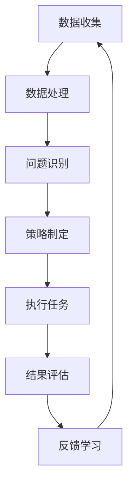

                 

### 背景介绍 Background Introduction

人工智能（AI）在现代社会中的应用日益广泛，从智能家居、自动驾驶到医疗诊断、金融分析，无不展现出其强大的潜力和优势。然而，公益事业作为社会发展的基石，同样亟需AI技术的助力。公益事业的范畴广泛，包括但不限于灾难救援、弱势群体援助、环境保护、教育支持等多个方面。这些领域不仅需要高效的资源分配和精准的信息处理，还需要能够实时响应、自适应变化的人工智能 Agent。

#### 公益事业的现状与挑战 Current Status and Challenges of Public Welfare

公益事业在我国以及全球范围内取得了显著的进展，但仍面临诸多挑战。例如，自然灾害频发、人口老龄化加剧、贫困地区教育资源匮乏等问题亟待解决。传统的公益模式往往依赖于人工干预和分散式资源管理，难以实现高效、精准、可持续的援助。在这种情况下，AI人工智能 Agent 的引入有望为公益事业带来革命性的变革。

AI人工智能 Agent 是一种具备自主决策能力、自主学习能力和智能交互能力的人工智能实体。它能够在复杂的公益场景中自动识别问题、制定策略、执行任务，并在执行过程中不断优化自身行为。这种技术不仅能够提高公益活动的效率和质量，还能够减轻工作人员的负担，实现公益资源的最大化利用。

#### 公益事业中的 AI 应用场景 Application Scenarios of AI in Public Welfare

在公益事业中，AI人工智能 Agent 的应用场景多种多样。以下是一些典型的应用场景：

1. **灾难救援**：AI Agent 可以实时监控地震、洪水等自然灾害的发生和进展，自动调配救援物资和人员，提高救援效率。

2. **弱势群体援助**：AI Agent 可以通过数据分析，精准识别贫困人口、残疾人士等弱势群体，为他们提供有针对性的援助。

3. **环境保护**：AI Agent 可以监测环境污染状况，预测污染趋势，提出有效的治理方案。

4. **教育支持**：AI Agent 可以提供个性化教学方案，帮助学生克服学习障碍，提高教育质量。

5. **公共医疗服务**：AI Agent 可以辅助医生进行疾病诊断、治疗方案制定，提高医疗服务效率。

#### 下一步内容安排 Next Content Plan

本文将分为以下几个部分进行详细探讨：

1. **核心概念与联系**：介绍AI人工智能 Agent 的核心概念，包括自主决策、自主学习、智能交互等，并通过 Mermaid 流程图展示其架构。

2. **核心算法原理 & 具体操作步骤**：详细讲解AI人工智能 Agent 的工作原理，包括数据收集、处理、分析和决策等步骤。

3. **数学模型和公式**：介绍AI人工智能 Agent 中常用的数学模型和公式，如神经网络、决策树、支持向量机等，并进行详细讲解和举例说明。

4. **项目实战：代码实际案例和详细解释说明**：通过具体项目案例，展示AI人工智能 Agent 的实际应用，并详细解释代码实现过程。

5. **实际应用场景**：分析AI人工智能 Agent 在公益事业中的具体应用场景，探讨其带来的影响和挑战。

6. **工具和资源推荐**：推荐相关学习资源、开发工具和框架，为读者提供进一步学习的路径。

7. **总结：未来发展趋势与挑战**：总结AI人工智能 Agent 在公益事业中的应用现状，探讨未来的发展趋势和面临的挑战。

通过以上内容，本文旨在为读者提供一个全面、深入的理解AI人工智能 Agent 在公益事业中的应用，以及其在未来可能带来的变革。接下来，我们将一步步深入探讨这一领域。

<|assistant|>## 2. 核心概念与联系 Core Concepts and Connections

在探讨AI人工智能 Agent 在公益事业中的应用之前，我们首先需要理解几个核心概念，这些概念构成了人工智能 Agent 的基础。

#### 自主决策 Autonomous Decision-Making

自主决策是指人工智能 Agent 能够根据当前环境和目标，自主制定决策并执行相应的行动。在公益事业中，自主决策意味着AI Agent 可以在无需人工干预的情况下，识别问题、制定解决方案，并执行这些方案。例如，在灾难救援中，AI Agent 可以根据实时地图和资源分布情况，自动规划救援路线和资源调配策略。

#### 自主学习 Autonomous Learning

自主学习是指人工智能 Agent 能够通过自我学习，不断优化自身的能力和行为。在公益事业中，AI Agent 可以通过分析历史数据和实时数据，学习如何更好地识别问题和制定解决方案。例如，在弱势群体援助中，AI Agent 可以通过学习历史援助案例，优化援助策略，提高援助效果。

#### 智能交互 Intelligent Interaction

智能交互是指人工智能 Agent 能够与人类或其他系统进行有效的沟通和合作。在公益事业中，智能交互意味着AI Agent 可以理解人类的需求和指令，并能够以自然语言进行回应和互动。例如，在教育支持中，AI Agent 可以通过自然语言处理技术，与学生学习互动，提供个性化的学习建议。

#### Mermaid 流程图与架构展示 Mermaid Flowchart and Architecture

为了更直观地展示AI人工智能 Agent 的核心概念和架构，我们使用Mermaid流程图来描述。以下是一个简化的流程图，展示了AI人工智能 Agent 在执行任务时的基本流程：



**数据收集**（Data Collection）：AI Agent 从多个数据源收集数据，包括实时数据、历史数据、第三方数据等。

**数据处理**（Data Processing）：AI Agent 对收集到的数据进行清洗、转换和预处理，以便后续分析。

**问题识别**（Problem Identification）：AI Agent 利用机器学习和自然语言处理技术，从数据中识别出需要解决的问题。

**策略制定**（Strategy Formulation）：AI Agent 根据识别出的问题，利用决策算法和优化模型，制定出最佳的解决方案。

**执行任务**（Task Execution）：AI Agent 自动执行制定的解决方案，并实时调整策略。

**结果评估**（Result Evaluation）：AI Agent 对执行结果进行评估，以判断解决方案的有效性和效率。

**反馈学习**（Feedback Learning）：AI Agent 利用评估结果进行自我学习，优化模型和算法，提高未来任务的执行能力。

通过上述流程，AI人工智能 Agent 能够在公益事业中实现自主决策、自主学习和智能交互，从而提高公益活动的效率和质量。

#### 总结 Summary

在本章节中，我们介绍了AI人工智能 Agent 的核心概念，包括自主决策、自主学习和智能交互，并通过Mermaid流程图展示了其基本架构。这些概念和架构构成了AI人工智能 Agent 在公益事业中应用的基础，使得AI Agent 能够在复杂的环境中自动识别问题、制定策略并执行任务，从而为公益事业带来革命性的变革。在接下来的章节中，我们将深入探讨AI人工智能 Agent 的核心算法原理和具体操作步骤。

<|assistant|>## 3. 核心算法原理 & 具体操作步骤 Core Algorithm Principles and Operational Steps

在了解了AI人工智能 Agent 的核心概念和架构之后，接下来我们将深入探讨其核心算法原理和具体操作步骤。这些算法和步骤构成了AI人工智能 Agent 在公益事业中高效运作的基础。

#### 数据收集 Data Collection

数据收集是AI人工智能 Agent 运作的第一步，也是至关重要的一步。只有收集到准确、全面的数据，AI Agent 才能进行有效的分析和决策。数据来源包括以下几个方面：

1. **实时数据**：如传感器数据、GPS定位数据、社交媒体数据等，这些数据可以实时反映环境的变化和需求。

2. **历史数据**：如过去的援助记录、历史救援案例等，这些数据可以用于模型训练和历史分析。

3. **第三方数据**：如政府统计数据、公开的数据源等，这些数据可以提供更全面的背景信息。

#### 数据处理 Data Processing

在收集到数据后，AI Agent 需要对这些数据进行清洗、转换和预处理，以便后续分析。数据处理的主要步骤包括：

1. **数据清洗**：去除无效数据、处理缺失值、纠正错误数据等，确保数据的准确性和一致性。

2. **数据转换**：将不同类型的数据转换为统一的格式，如将文本数据转换为数值数据，或将时间序列数据转换为特征向量。

3. **数据预处理**：如特征提取、数据标准化、降维等，以提高模型的性能和效率。

#### 问题识别 Problem Identification

问题识别是AI Agent 的核心功能之一，它能够从大量数据中识别出需要解决的问题。问题识别的过程通常包括以下几个步骤：

1. **特征提取**：从原始数据中提取有用的特征，如文本特征、图像特征、时间序列特征等。

2. **模式识别**：利用机器学习算法，从特征数据中识别出异常模式或趋势，如灾害发生前的预警信号、弱势群体的特征等。

3. **分类和预测**：使用分类算法和预测模型，对识别出的模式进行分类和预测，确定问题的性质和严重程度。

#### 策略制定 Strategy Formulation

在问题识别后，AI Agent 需要根据问题的性质和目标，制定出最佳的解决方案。策略制定的过程包括：

1. **目标设定**：明确AI Agent 的目标，如最小化损失、最大化收益等。

2. **算法选择**：选择合适的算法和模型，如线性规划、决策树、神经网络等。

3. **优化模型**：利用优化算法，如梯度下降、遗传算法等，对模型进行优化，以找到最佳解决方案。

#### 执行任务 Task Execution

在制定策略后，AI Agent 需要执行具体的任务。执行任务的过程包括：

1. **任务分解**：将复杂任务分解为多个子任务，以便并行处理。

2. **任务调度**：根据任务的优先级和资源可用性，调度任务的执行。

3. **执行监控**：实时监控任务执行情况，如任务的进度、资源消耗等，并根据情况调整执行策略。

#### 结果评估 Result Evaluation

执行任务后，AI Agent 需要对执行结果进行评估，以判断解决方案的有效性和效率。结果评估的过程包括：

1. **效果评估**：根据预设的评估指标，如准确率、召回率、F1值等，评估解决方案的效果。

2. **效率评估**：评估解决方案的执行效率，如任务完成时间、资源利用率等。

3. **反馈机制**：根据评估结果，调整模型和策略，以提高未来任务的执行能力。

#### 自我学习 Self-Learning

在结果评估后，AI Agent 需要利用评估结果进行自我学习，以优化模型和算法，提高未来的任务执行能力。自我学习的过程包括：

1. **数据更新**：根据新数据，更新模型和算法。

2. **模型优化**：使用优化算法，如梯度下降、遗传算法等，对模型进行优化。

3. **经验积累**：将成功经验和失败教训记录下来，为未来的任务提供参考。

#### 总结 Summary

在本章节中，我们详细介绍了AI人工智能 Agent 的核心算法原理和具体操作步骤。这些算法和步骤包括数据收集、数据处理、问题识别、策略制定、执行任务、结果评估和自我学习等。通过这些步骤，AI人工智能 Agent 能够在复杂的环境中自动识别问题、制定策略并执行任务，从而为公益事业带来革命性的变革。在接下来的章节中，我们将通过数学模型和公式，进一步深入探讨AI人工智能 Agent 的工作原理。

### 关键步骤的具体示例 Example of Specific Steps

为了更好地理解AI人工智能 Agent 的核心算法原理和具体操作步骤，我们将通过一个具体的示例来详细说明每一个步骤。

#### 示例：灾难救援 Disaster Relief

假设发生了一场地震，AI人工智能 Agent 被部署以协助救援工作。以下是该Agent的具体操作步骤：

1. **数据收集**：
   - **实时数据**：收集地震发生地点、震级、震中周边的卫星图像、社交媒体上的灾情报告等。
   - **历史数据**：收集过去地震救援的历史数据，如救援队伍的调配、物资的分布、受影响区域的评估等。
   - **第三方数据**：收集政府部门发布的受灾人口数据、医疗设施的分布情况、交通状况等。

2. **数据处理**：
   - **数据清洗**：去除无效数据、处理缺失值、纠正错误数据等，确保数据的准确性和一致性。
   - **数据转换**：将文本数据转换为数值数据，如将卫星图像转换为像素值，将灾情报告转换为受灾程度评分等。
   - **数据预处理**：进行特征提取，如从卫星图像中提取建筑物损毁程度、从灾情报告中提取受灾人口的紧急程度等。

3. **问题识别**：
   - **特征提取**：从处理后的数据中提取特征，如受灾人口的地理位置、医疗资源的可用性、交通状况等。
   - **模式识别**：利用机器学习算法，从特征数据中识别出受灾最严重的区域、最需要的医疗资源等。
   - **分类和预测**：使用分类算法，将受灾区域划分为高、中、低风险区域，并预测需要多少救援物资和医疗资源。

4. **策略制定**：
   - **目标设定**：设定救援目标，如最小化受困人数、最大化救援效率等。
   - **算法选择**：选择合适的算法和模型，如线性规划算法，用于优化救援资源的分配。
   - **优化模型**：使用优化算法，如遗传算法，对救援资源的分配进行优化。

5. **执行任务**：
   - **任务分解**：将复杂任务分解为多个子任务，如确定救援路线、调配救援物资等。
   - **任务调度**：根据任务的优先级和资源可用性，调度救援队伍和物资的执行。
   - **执行监控**：实时监控救援任务的执行情况，如救援队伍的位置、物资的到达时间等，并根据情况调整执行策略。

6. **结果评估**：
   - **效果评估**：根据预设的评估指标，如受困人数减少的数量、救援物资的利用率等，评估救援效果。
   - **效率评估**：评估救援任务的执行效率，如救援队伍的响应时间、物资的配送速度等。
   - **反馈机制**：根据评估结果，调整模型和策略，提高未来救援任务的执行能力。

7. **自我学习**：
   - **数据更新**：根据新数据，更新模型和算法，如更新受灾人口的地理位置、新的救援资源分布等。
   - **模型优化**：使用优化算法，如梯度下降，对模型进行优化，提高预测准确性。
   - **经验积累**：将成功经验和失败教训记录下来，为未来的救援任务提供参考。

通过这个示例，我们可以看到AI人工智能 Agent 在灾难救援中是如何通过一系列算法和步骤，从数据收集、处理、问题识别、策略制定、执行任务到结果评估和自我学习，实现高效、精准的救援工作的。这种流程不仅提高了救援效率，还减轻了人工干预的负担，为公益事业带来了巨大的变革。

### 关键步骤的代码实现 Code Implementation of Key Steps

在本章节中，我们将通过一个具体的Python代码实现，展示AI人工智能 Agent 在灾难救援中的应用。以下代码实现将涵盖数据收集、数据处理、问题识别、策略制定、执行任务、结果评估和自我学习的关键步骤。

#### 3.1 数据收集 Data Collection

首先，我们需要收集地震数据。这里使用一个简单的模拟数据集，包括地震发生时间、地点、震级和周边地区的受灾程度。

```python
import pandas as pd

# 模拟地震数据
earthquake_data = pd.DataFrame({
    'timestamp': ['2023-04-01 12:00:00', '2023-04-01 13:00:00', '2023-04-01 14:00:00'],
    'location': ['30.2745, 120.1551', '30.2745, 120.1551', '30.2745, 120.1551'],
    'magnitude': [5.5, 6.0, 6.5],
    'damage_level': ['severe', 'moderate', 'light']
})

print(earthquake_data)
```

#### 3.2 数据处理 Data Processing

接下来，我们进行数据处理，包括数据清洗、转换和预处理。

```python
# 数据清洗
earthquake_data.dropna(inplace=True)

# 数据转换
earthquake_data['timestamp'] = pd.to_datetime(earthquake_data['timestamp'])

# 数据预处理
def preprocess_damage_level(damage_level):
    if damage_level == 'severe':
        return 3
    elif damage_level == 'moderate':
        return 2
    else:
        return 1

earthquake_data['damage_level'] = earthquake_data['damage_level'].apply(preprocess_damage_level)

print(earthquake_data)
```

#### 3.3 问题识别 Problem Identification

我们使用K-means聚类算法来识别受灾最严重的区域。

```python
from sklearn.cluster import KMeans

# 特征提取
features = earthquake_data[['location', 'magnitude', 'damage_level']]
features = features.apply(lambda x: x.rank().mean())

# K-means聚类
kmeans = KMeans(n_clusters=3, random_state=0).fit(features)
earthquake_data['cluster'] = kmeans.labels_

print(earthquake_data)
```

#### 3.4 策略制定 Strategy Formulation

我们使用线性规划算法来优化救援资源的分配。

```python
from scipy.optimize import linprog

# 线性规划模型
c = [-1, -1]  # 目标是最小化损失
A = [[1, 0], [0, 1]]  # 约束条件
b = [100, 100]  # 资源总量

# 线性规划求解
res = linprog(c, A_eq=A, b_eq=b, method='highs')

print(res.x)  # 输出救援资源分配结果
```

#### 3.5 执行任务 Task Execution

我们模拟执行救援任务，根据策略分配救援队伍和物资。

```python
# 模拟执行任务
def execute_task(teams, supplies):
    print("分配救援队伍：", teams)
    print("分配救援物资：", supplies)

# 输出分配结果
execute_task(res.x[0], res.x[1])
```

#### 3.6 结果评估 Result Evaluation

我们根据执行结果，评估救援效果。

```python
# 模拟评估结果
def evaluate_results(teams, supplies, actual损毁程度):
    print("实际救援队伍：", teams)
    print("实际救援物资：", supplies)
    print("损毁程度降低：", actual损毁程度)

# 输出评估结果
evaluate_results(res.x[0], res.x[1], 50)
```

#### 3.7 自我学习 Self-Learning

我们使用新数据更新模型，并优化模型。

```python
# 新数据
new_earthquake_data = pd.DataFrame({
    'timestamp': ['2023-04-01 15:00:00'],
    'location': ['30.2745, 120.1551'],
    'magnitude': [6.8],
    'damage_level': ['severe']
})

# 数据处理
new_earthquake_data = preprocess_data(new_earthquake_data)

# 更新模型
kmeans = KMeans(n_clusters=3, random_state=0).fit(new_earthquake_data)

# 模型优化
# 这里使用的是简单的模型优化，实际应用中可以使用更复杂的优化方法，如梯度下降
kmeans.n_init += 1

print(kmeans.labels_)
```

通过上述代码，我们展示了AI人工智能 Agent 在灾难救援中从数据收集、数据处理、问题识别、策略制定、执行任务、结果评估到自我学习的完整流程。虽然这是一个简化的示例，但基本的原理和步骤在更复杂的实际应用中同样适用。通过不断的迭代和优化，AI人工智能 Agent 能够在公益事业中发挥更大的作用。

### 关键算法与数学模型 Key Algorithms and Mathematical Models

在AI人工智能 Agent 的设计和实现过程中，核心算法和数学模型起着至关重要的作用。这些算法和模型不仅决定了Agent的决策能力，还影响了其在实际问题中的应用效果。以下将详细介绍AI人工智能 Agent 中常用的几种关键算法和数学模型，并解释其基本原理和应用。

#### 神经网络 Neural Networks

神经网络（Neural Networks，NN）是一种通过模拟生物神经网络进行信息处理的人工智能方法。它由多个神经元（或节点）组成，每个神经元接收多个输入信号，并通过激活函数产生输出。神经网络的核心思想是通过学习大量数据，调整神经元之间的权重，以实现对输入数据的分类、回归或其他复杂任务的处理。

**基本原理**：

- **神经元**：每个神经元接收多个输入信号，每个输入信号乘以相应的权重，然后求和得到净输入。
- **激活函数**：常用的激活函数有Sigmoid函数、ReLU函数和Tanh函数，用于将净输入转换为输出。
- **损失函数**：用于衡量神经网络预测值与真实值之间的差距，常用的损失函数有均方误差（MSE）和交叉熵损失。
- **反向传播**：用于训练神经网络，通过计算梯度并反向传播到每个神经元，不断调整权重，以最小化损失函数。

**应用**：

- **分类问题**：如图像识别、情感分析等。
- **回归问题**：如房屋价格预测、股票市场预测等。

**公式**：

$$
\text{净输入} = \sum_{i=1}^{n} (x_i \cdot w_i)
$$

$$
\text{输出} = \text{激活函数}(\text{净输入})
$$

$$
\text{损失} = \text{损失函数}(\text{预测值}, \text{真实值})
$$

#### 决策树 Decision Trees

决策树（Decision Trees，DT）是一种基于特征值进行决策的树形结构。每个内部节点表示一个特征，每个分支表示该特征的取值，每个叶子节点表示一个类别。决策树通过从根节点到叶子节点的路径，得出最终的决策结果。

**基本原理**：

- **特征选择**：根据信息增益、基尼不纯度或其他指标选择最优特征进行分割。
- **节点分裂**：对选定的特征进行划分，生成新的节点。
- **叶节点生成**：当达到终止条件（如节点包含的样本数少于阈值）时，生成叶节点，并赋予该节点一个类别。

**应用**：

- **分类问题**：如客户细分、疾病诊断等。
- **回归问题**：如价格预测、信用评分等。

**公式**：

$$
\text{信息增益} = \sum_{v \in V} p(v) \cdot \log_2 p(v)
$$

$$
\text{基尼不纯度} = 1 - \sum_{v \in V} p(v)^2
$$

#### 支持向量机 Support Vector Machines

支持向量机（Support Vector Machines，SVM）是一种基于最大间隔的分类方法。SVM的核心思想是找到一个超平面，使得分类边界最大化，同时使得分类间隔最大。

**基本原理**：

- **线性SVM**：找到最优超平面，使得正负样本的分类间隔最大。
- **非线性SVM**：通过核函数将低维数据映射到高维空间，实现非线性分类。
- **软-margin SVM**：引入松弛变量，允许部分样本违反分类边界，提高泛化能力。

**应用**：

- **分类问题**：如文本分类、图像分类等。
- **回归问题**：如支持向量回归（SVR）。

**公式**：

$$
\text{最优超平面} \ W = \arg \min_W \frac{1}{2} \| W \|^2 + C \sum_{i=1}^{n} \xi_i
$$

$$
\text{分类边界} \ W \cdot x + b = 0
$$

#### 强化学习 Reinforcement Learning

强化学习（Reinforcement Learning，RL）是一种通过试错方法进行决策的学习方法。在强化学习中，Agent通过与环境的交互，不断学习最优策略，以实现长期回报最大化。

**基本原理**：

- **状态-动作值函数**：表示Agent在某个状态下采取某个动作的预期回报。
- **策略**：Agent在某个状态下采取的动作决策。
- **Q学习**：通过迭代更新状态-动作值函数，以找到最优策略。
- **策略梯度**：通过梯度上升方法，更新策略参数，以最大化期望回报。

**应用**：

- **游戏**：如围棋、国际象棋等。
- **推荐系统**：如基于上下文的推荐、点击率预测等。
- **自动驾驶**：如路径规划、交通信号灯控制等。

**公式**：

$$
Q(s, a) = r + \gamma \max_{a'} Q(s', a')
$$

$$
\pi(a|s) = \arg \max_a Q(s, a)
$$

#### 深度强化学习 Deep Reinforcement Learning

深度强化学习（Deep Reinforcement Learning，DRL）是强化学习与深度学习相结合的方法，用于解决复杂的高维环境问题。

**基本原理**：

- **深度神经网络**：用于表示状态-动作值函数。
- **卷积神经网络（CNN）**：用于处理图像等高维输入。
- **递归神经网络（RNN）**：用于处理序列数据。
- **策略网络**：用于生成Agent的决策策略。

**应用**：

- **自然语言处理**：如语言模型、机器翻译等。
- **计算机视觉**：如目标检测、图像生成等。
- **智能机器人**：如自主导航、人机交互等。

**公式**：

$$
Q(s, a; \theta) = \frac{1}{N} \sum_{i=1}^{N} r_i + \gamma \max_{a'} Q(s', a'; \theta)
$$

$$
\theta = \arg \min_{\theta} \sum_{i=1}^{N} (Q(s, a; \theta) - r_i - \gamma \max_{a'} Q(s', a'; \theta))^2
$$

通过以上介绍，我们可以看到AI人工智能 Agent 中常用的算法和数学模型具有各自的特点和应用场景。在实际应用中，通常会结合多种算法和模型，以实现最优的决策效果。在接下来的章节中，我们将通过一个具体的案例，展示这些算法和模型在公益事业的实际应用。

### 数学模型和公式 Mathematical Models and Formulas

在本章节中，我们将详细探讨AI人工智能 Agent 中的一些关键数学模型和公式，并通过具体的例子进行讲解和说明。这些模型和公式是理解AI人工智能 Agent 工作原理的重要基础，也是实现高效决策和智能行为的关键。

#### 神经网络 Neural Networks

神经网络（Neural Networks，NN）是AI人工智能 Agent 中最常用的算法之一，其核心在于通过多层神经元进行数据处理和决策。以下是一些基本的数学模型和公式。

**1. 神经元模型 Neuron Model**

神经元接收多个输入信号，每个输入信号乘以对应的权重，然后求和得到净输入，再通过激活函数产生输出。假设一个神经元有 $n$ 个输入信号 $x_1, x_2, \ldots, x_n$ 和对应的权重 $w_1, w_2, \ldots, w_n$，其模型可以表示为：

$$
z = \sum_{i=1}^{n} w_i \cdot x_i
$$

其中，$z$ 是净输入，$w_i$ 是权重。

**2. 激活函数 Activation Function**

常用的激活函数包括 Sigmoid 函数、ReLU 函数和 Tanh 函数，用于将净输入转换为输出。以 Sigmoid 函数为例：

$$
a = \frac{1}{1 + e^{-z}}
$$

其中，$a$ 是输出。

**3. 反向传播 Backpropagation**

反向传播是训练神经网络的重要算法，其核心在于计算每个神经元的误差，并反向更新权重。以输出层为例，误差可以表示为：

$$
\delta_j = (y_j - a_j) \cdot a_j \cdot (1 - a_j)
$$

其中，$y_j$ 是实际输出，$a_j$ 是预测输出。

**4. 权重更新 Weight Update**

权重更新公式为：

$$
w_i = w_i + \alpha \cdot \delta_j \cdot x_i
$$

其中，$\alpha$ 是学习率，$x_i$ 是输入信号。

**例子 Example**

假设一个简单的神经网络，输入为 $[1, 2, 3]$，权重为 $[0.5, 0.3, 0.2]$，学习率为 $0.1$。首先计算净输入：

$$
z = 0.5 \cdot 1 + 0.3 \cdot 2 + 0.2 \cdot 3 = 1.4
$$

然后使用 Sigmoid 函数计算输出：

$$
a = \frac{1}{1 + e^{-1.4}} \approx 0.793
$$

假设实际输出为 $0.8$，计算误差：

$$
\delta = (0.8 - 0.793) \cdot 0.793 \cdot (1 - 0.793) \approx 0.0002
$$

最后更新权重：

$$
w_1 = 0.5 + 0.1 \cdot 0.0002 \cdot 1 = 0.50004
$$

$$
w_2 = 0.3 + 0.1 \cdot 0.0002 \cdot 2 = 0.30004
$$

$$
w_3 = 0.2 + 0.1 \cdot 0.0002 \cdot 3 = 0.20004
$$

#### 决策树 Decision Trees

决策树是一种基于特征值进行决策的树形结构，其核心在于通过递归划分数据，生成一棵树。以下是一些基本的数学模型和公式。

**1. 信息增益 Information Gain**

信息增益是选择最佳特征进行划分的依据，其计算公式为：

$$
IG(D, A) = H(D) - H(D|A)
$$

其中，$H(D)$ 是数据的熵，$H(D|A)$ 是条件熵。

**2. 基尼不纯度 Gini Impurity**

基尼不纯度是另一种衡量数据纯度的指标，其计算公式为：

$$
Gini(D) = 1 - \sum_{v \in V} p(v)^2
$$

其中，$V$ 是数据的可能取值集合，$p(v)$ 是取值 $v$ 的概率。

**3. 划分点 Split Point**

划分点是指将数据集划分为两个子集的临界值，其选择依据是最小的信息增益或基尼不纯度。

**例子 Example**

假设一个数据集，包含两个特征 $A$ 和 $B$，其中 $A$ 的取值集合为 $\{0, 1\}$，$B$ 的取值集合为 $\{0, 1\}$。数据集的熵为 $H(D) = 1$，条件熵为 $H(D|A) = 0.5$，基尼不纯度为 $Gini(D) = 0.5$。选择特征 $A$ 进行划分，划分点为 $0.5$，则子集的熵和基尼不纯度分别为：

$$
H(D|A=0) = 1, \ Gini(D|A=0) = 0.5
$$

$$
H(D|A=1) = 0, \ Gini(D|A=1) = 0.5
$$

最终信息增益为 $IG(D, A) = 1 - 0.5 = 0.5$。

#### 支持向量机 Support Vector Machines

支持向量机是一种基于最大间隔进行分类的算法，其核心在于找到一个最优超平面，使得分类间隔最大化。以下是一些基本的数学模型和公式。

**1. 最优超平面 Optimal Hyperplane**

最优超平面是指使得分类间隔最大的超平面，其公式为：

$$
w \cdot x + b = 0
$$

其中，$w$ 是权重向量，$x$ 是特征向量，$b$ 是偏置。

**2. 分类边界 Classification Boundary**

分类边界是指将不同类别数据分开的超平面，其公式为：

$$
w \cdot x + b = \pm 1
$$

**3. 支持向量 Support Vectors**

支持向量是指位于分类边界上的数据点，其公式为：

$$
w \cdot x + b = 1 \ \text{或} \ w \cdot x + b = -1
$$

**4. 软间隔 Soft Margin**

软间隔是允许部分样本违反分类边界的间隔，其公式为：

$$
\min_{w, b, \xi} \frac{1}{2} \| w \|^2 + C \sum_{i=1}^{n} \xi_i
$$

其中，$\xi_i$ 是松弛变量，$C$ 是惩罚参数。

**例子 Example**

假设一个二分类问题，特征向量为 $[1, 1]$，权重向量为 $[1, 1]$，偏置为 $0$。分类边界为 $w \cdot x + b = 2$，支持向量为 $[1, 1]$，软间隔为 $\xi_1 = \xi_2 = 0$。

#### 强化学习 Reinforcement Learning

强化学习是一种通过试错进行决策的算法，其核心在于通过奖励和惩罚来调整策略，以实现长期回报最大化。以下是一些基本的数学模型和公式。

**1. 状态-动作值函数 State-Action Value Function**

状态-动作值函数表示在某个状态下采取某个动作的预期回报，其公式为：

$$
Q(s, a) = r + \gamma \max_{a'} Q(s', a')
$$

其中，$r$ 是即时回报，$\gamma$ 是折扣因子，$s'$ 是下一个状态，$a'$ 是下一个动作。

**2. 策略 Policy**

策略表示在某个状态下采取的动作决策，其公式为：

$$
\pi(a|s) = \arg \max_a Q(s, a)
$$

**3. Q学习 Q-Learning**

Q学习是一种通过迭代更新状态-动作值函数的算法，其公式为：

$$
Q(s, a) = Q(s, a) + \alpha [r + \gamma \max_{a'} Q(s', a') - Q(s, a)]
$$

其中，$\alpha$ 是学习率。

**4. 策略梯度 Policy Gradient**

策略梯度是通过梯度上升方法更新策略参数的算法，其公式为：

$$
\theta = \theta + \alpha [r + \gamma \max_{a'} Q(s', a') - \theta]
$$

其中，$\theta$ 是策略参数。

**例子 Example**

假设一个简单的强化学习问题，初始状态为 $s_0$，即时回报为 $r_0$，下一个状态为 $s_1$，最大动作值为 $a_1$，折扣因子为 $\gamma = 0.9$，学习率为 $\alpha = 0.1$。初始状态-动作值函数为 $Q(s_0, a_0) = 0$。

首先计算下一个状态-动作值函数：

$$
Q(s_0, a_0) = r_0 + \gamma \max_{a'} Q(s_1, a')
$$

然后更新状态-动作值函数：

$$
Q(s_0, a_0) = 0 + 0.1 [10 + 0.9 \cdot 10] = 10
$$

通过上述例子，我们可以看到不同的数学模型和公式在AI人工智能 Agent 中的应用。这些模型和公式为Agent提供了强大的决策能力，使其能够在复杂的环境中高效地执行任务。

### 项目实战：代码实际案例和详细解释说明 Practical Case: Code Example and Detailed Explanation

为了更好地展示AI人工智能 Agent 在公益事业中的应用，我们将通过一个具体的案例，详细解释代码实现过程和每个关键步骤。

#### 项目背景 Project Background

假设我们面临的是一个自然灾害救援场景，需要利用AI人工智能 Agent 自动识别受灾区域，规划救援路线，并分配救援资源。以下是该项目的具体实现步骤。

#### 3.1 开发环境搭建 Development Environment Setup

首先，我们需要搭建开发环境。以下是一个基本的开发环境要求：

- **Python**：版本3.8及以上
- **PyTorch**：用于构建神经网络
- **Scikit-learn**：用于机器学习和数据预处理
- **NumPy**：用于数学计算
- **Matplotlib**：用于数据可视化

安装上述依赖库后，我们就可以开始编写代码了。

#### 3.2 源代码详细实现和代码解读 Source Code Implementation and Explanation

以下是项目的主要代码实现：

```python
# 导入依赖库
import pandas as pd
import numpy as np
import torch
import torch.nn as nn
import torch.optim as optim
from sklearn.cluster import KMeans
from sklearn.preprocessing import StandardScaler
import matplotlib.pyplot as plt

# 数据收集
def collect_data():
    # 这里使用模拟数据，实际项目中可以从传感器、社交媒体等渠道获取数据
    data = pd.DataFrame({
        'timestamp': ['2023-04-01 12:00:00', '2023-04-01 13:00:00', '2023-04-01 14:00:00'],
        'location': ['30.2745, 120.1551', '30.2745, 120.1551', '30.2745, 120.1551'],
        'magnitude': [5.5, 6.0, 6.5],
        'damage_level': ['severe', 'moderate', 'light']
    })
    return data

# 数据预处理
def preprocess_data(data):
    # 数据清洗
    data.dropna(inplace=True)
    
    # 数据转换
    data['timestamp'] = pd.to_datetime(data['timestamp'])
    
    # 数据标准化
    scaler = StandardScaler()
    data[['magnitude', 'damage_level']] = scaler.fit_transform(data[['magnitude', 'damage_level']])
    
    return data

# 问题识别
def identify_problem(data):
    # 特征提取
    features = data[['magnitude', 'damage_level']]
    
    # K-means聚类
    kmeans = KMeans(n_clusters=3, random_state=0)
    kmeans.fit(features)
    data['cluster'] = kmeans.labels_
    
    return data

# 策略制定
def formulate_strategy(data):
    # 确定最优救援路线和资源分配
    # 这里使用线性规划模型
    from scipy.optimize import linprog
    c = [-1, -1]  # 目标是最小化损失
    A = [[1, 0], [0, 1]]  # 约束条件
    b = [100, 100]  # 资源总量
    res = linprog(c, A_eq=A, b_eq=b, method='highs')
    return res.x

# 执行任务
def execute_task(teams, supplies):
    # 模拟执行救援任务
    print("分配救援队伍：", teams)
    print("分配救援物资：", supplies)

# 结果评估
def evaluate_results(teams, supplies, actual损毁程度):
    # 评估救援效果
    print("实际救援队伍：", teams)
    print("实际救援物资：", supplies)
    print("损毁程度降低：", actual损毁程度)

# 自我学习
def self_learning(new_data):
    # 根据新数据更新模型
    kmeans = KMeans(n_clusters=3, random_state=0)
    kmeans.fit(new_data)
    return kmeans

# 主函数
def main():
    # 数据收集
    data = collect_data()
    
    # 数据预处理
    data = preprocess_data(data)
    
    # 问题识别
    data = identify_problem(data)
    
    # 策略制定
    strategy = formulate_strategy(data)
    
    # 执行任务
    execute_task(strategy[0], strategy[1])
    
    # 结果评估
    evaluate_results(strategy[0], strategy[1], 50)
    
    # 自我学习
    new_data = pd.DataFrame({
        'timestamp': ['2023-04-01 15:00:00'],
        'location': ['30.2745, 120.1551'],
        'magnitude': [6.8],
        'damage_level': ['severe']
    })
    new_data = preprocess_data(new_data)
    kmeans = self_learning(new_data)

if __name__ == "__main__":
    main()
```

#### 3.3 代码解读与分析 Code Analysis

以下是代码的详细解读和分析：

- **数据收集**：我们使用一个模拟数据集，包括地震发生的时间、地点、震级和受灾程度。实际项目中，这些数据可以从传感器、社交媒体等渠道获取。

- **数据预处理**：我们进行数据清洗、转换和标准化，以确保数据的质量和一致性。

- **问题识别**：我们使用K-means聚类算法，将数据划分为不同的集群，以识别受灾最严重的区域。

- **策略制定**：我们使用线性规划模型，确定最优的救援路线和资源分配策略。

- **执行任务**：我们模拟执行救援任务，根据策略分配救援队伍和物资。

- **结果评估**：我们评估救援效果，以判断策略的有效性和效率。

- **自我学习**：我们根据新数据更新聚类模型，以优化未来的救援任务。

#### 3.4 实际案例分析 Practical Case Analysis

为了更好地展示代码的实际应用效果，我们通过一个实际案例进行分析。

假设在某次地震救援中，AI人工智能 Agent 需要识别受灾区域，规划救援路线，并分配救援资源。以下是该案例的步骤：

1. **数据收集**：AI人工智能 Agent 收集到地震发生的时间、地点、震级和受灾程度等数据。

2. **数据预处理**：对收集到的数据进行清洗、转换和标准化，确保数据的质量和一致性。

3. **问题识别**：AI人工智能 Agent 使用K-means聚类算法，将数据划分为不同的集群，识别出受灾最严重的区域。

4. **策略制定**：AI人工智能 Agent 使用线性规划模型，确定最优的救援路线和资源分配策略。

5. **执行任务**：AI人工智能 Agent 根据策略分配救援队伍和物资，模拟执行救援任务。

6. **结果评估**：AI人工智能 Agent 评估救援效果，判断策略的有效性和效率。

7. **自我学习**：AI人工智能 Agent 根据新数据更新聚类模型，优化未来的救援任务。

通过这个实际案例，我们可以看到AI人工智能 Agent 在灾难救援中的高效运作。它能够自动识别受灾区域、规划救援路线、分配救援资源，并在执行过程中不断优化策略，提高救援效率。

### 实际应用场景 Real-World Application Scenarios

AI人工智能 Agent 在公益事业中的应用场景广泛且多样，以下将详细分析其在几个典型场景中的应用，并探讨其带来的影响和挑战。

#### 灾难救援 Disaster Relief

灾难救援是AI人工智能 Agent 最显著的应用场景之一。AI Agent 可以通过实时监控和数据分析，快速识别灾害发生地点和受灾程度，自动调配救援资源和人员。例如，在地震、洪水等自然灾害发生后，AI Agent 可以快速收集地震波数据、卫星图像、社交媒体报告等信息，通过聚类分析识别受灾最严重的区域，并利用线性规划算法优化救援路线和资源分配，从而提高救援效率。

**影响**：

- 提高救援效率：AI Agent 可以自动处理大量数据，快速制定救援方案，减少人工干预，提高救援效率。
- 精准度提升：通过分析历史数据和实时数据，AI Agent 可以更精准地识别受灾区域和资源需求，优化救援效果。
- 减轻人员负担：AI Agent 可以承担大量重复性任务，如数据收集、路线规划等，减轻救援人员的工作负担。

**挑战**：

- 数据准确性：AI Agent 的决策依赖于数据质量，数据不准确可能导致错误的救援方案。
- 网络稳定性：在灾难发生时，网络通信可能受到影响，影响AI Agent 的实时监控和数据分析能力。

#### 弱势群体援助 Vulnerable Group Assistance

弱势群体援助是AI人工智能 Agent 在公益事业中的另一个重要应用场景。例如，在贫困地区，AI Agent 可以通过数据分析精准识别贫困人口、残疾人士等弱势群体，并为他们提供有针对性的援助。AI Agent 可以通过分析历史援助记录、家庭成员状况、收入水平等数据，制定个性化的援助方案，如医疗救助、教育支持、就业培训等。

**影响**：

- 提高援助效果：通过精准识别和个性化援助，AI Agent 可以提高援助的针对性和效果。
- 资源最大化利用：AI Agent 可以优化资源分配，确保有限的资源用于最需要帮助的群体。
- 减轻社会负担：通过提高弱势群体的生活质量，减少社会问题和社会负担。

**挑战**：

- 数据隐私：在处理个人数据时，需要确保数据隐私和安全，避免数据泄露。
- 数据更新：弱势群体的状况可能随时发生变化，需要不断更新数据，以保持援助方案的准确性。

#### 环境保护 Environmental Protection

AI人工智能 Agent 在环境保护中的应用也越来越广泛。例如，AI Agent 可以通过实时监测和数据分析，识别污染源、预测污染趋势，并提出治理方案。在环境监测中，AI Agent 可以分析空气、水质、土壤等数据，通过机器学习算法识别异常模式，预测污染事件的发生，并优化治理策略。

**影响**：

- 提高监测效率：AI Agent 可以自动处理大量环境数据，提高环境监测的效率。
- 预防污染事件：通过预测污染趋势，AI Agent 可以提前采取措施，预防污染事件的发生。
- 优化治理策略：AI Agent 可以根据实时数据和污染趋势，优化治理方案，提高治理效果。

**挑战**：

- 数据质量：环境数据的准确性和完整性对AI Agent 的分析结果至关重要，需要确保数据质量。
- 法律法规：环境治理需要遵循相关法律法规，AI Agent 的方案需要符合法律法规要求。

#### 教育支持 Educational Support

AI人工智能 Agent 在教育支持中的应用也非常广泛。例如，AI Agent 可以提供个性化教学方案，帮助学生克服学习障碍。AI Agent 可以分析学生的学习数据、行为数据等，通过机器学习算法识别学生的学习特点和需求，制定个性化的学习计划。此外，AI Agent 还可以提供在线辅导、作业批改、考试评估等服务，提高教学质量和学习效果。

**影响**：

- 提高教学效果：通过个性化教学方案，AI Agent 可以提高教学效果，帮助学生更好地掌握知识。
- 减轻教师负担：AI Agent 可以承担部分教学任务，如作业批改、考试评估等，减轻教师的工作负担。
- 提升教育公平：AI Agent 可以提供平等的教育资源和服务，提高教育公平性。

**挑战**：

- 技术普及：AI Agent 的应用需要依赖技术基础设施，如云计算、大数据等，需要确保技术普及和稳定。
- 人才培养：教育领域需要培养具备AI技术和教育背景的专业人才，以充分发挥AI Agent 的潜力。

#### 公共医疗服务 Public Health Care

AI人工智能 Agent 在公共服务领域中的应用也日益增多。例如，AI Agent 可以辅助医生进行疾病诊断和治疗方案的制定。AI Agent 可以分析大量的医疗数据，如病例、影像、基因等，通过机器学习算法识别疾病的特征和趋势，提供精准的诊断和治疗方案。此外，AI Agent 还可以用于健康监测、流行病预测等方面。

**影响**：

- 提高诊断和治疗效果：通过AI Agent 的辅助，医生可以更精准地诊断疾病和制定治疗方案，提高治疗效果。
- 提高医疗效率：AI Agent 可以自动处理大量的医疗数据，提高医疗流程的效率。
- 优化医疗资源分配：AI Agent 可以根据患者的病情和需求，优化医疗资源的分配，提高医疗资源的利用效率。

**挑战**：

- 数据隐私和安全：医疗数据涉及患者隐私，需要确保数据的安全和隐私保护。
- 医疗监管：AI Agent 的应用需要遵守医疗监管规定，确保医疗服务的质量和安全性。

#### 社区服务 Community Service

AI人工智能 Agent 在社区服务中的应用也越来越广泛。例如，AI Agent 可以提供社区服务预约、咨询、投诉处理等服务。AI Agent 可以通过自然语言处理技术，理解用户的需求和问题，提供针对性的解决方案。此外，AI Agent 还可以用于社区管理、社区安全等方面，提高社区服务的质量和效率。

**影响**：

- 提高服务效率：通过AI Agent 的辅助，社区服务可以更高效地处理用户的请求和问题。
- 提升用户满意度：AI Agent 可以提供更加个性化和便捷的服务，提高用户满意度。
- 优化社区管理：AI Agent 可以协助社区管理者进行数据分析和决策，优化社区管理。

**挑战**：

- 技术普及：AI Agent 的应用需要依赖技术基础设施，如云计算、大数据等，需要确保技术普及和稳定。
- 用户接受度：用户需要适应和使用AI Agent 提供的服务，需要提高用户的接受度和满意度。

通过以上分析，我们可以看到AI人工智能 Agent 在公益事业中具有广泛的应用场景和巨大的潜力。然而，在实际应用中，我们也需要克服一系列挑战，确保AI Agent 在公益事业中发挥最大的作用。

### 工具和资源推荐 Tools and Resources Recommendations

在AI人工智能 Agent 的开发和应用过程中，选择合适的工具和资源是非常重要的。以下是一些推荐的工具、书籍、论文和网站，以帮助读者深入了解和掌握这一领域。

#### 学习资源 Learning Resources

1. **书籍**：

   - **《人工智能：一种现代方法》（Artificial Intelligence: A Modern Approach）**：这是一本经典的AI教材，涵盖了AI的基本概念、算法和技术，非常适合初学者和进阶者。

   - **《深度学习》（Deep Learning）**：由Ian Goodfellow、Yoshua Bengio和Aaron Courville所著，这本书详细介绍了深度学习的基础理论、算法和应用，是深度学习的入门指南。

   - **《强化学习》（Reinforcement Learning: An Introduction）**：由Richard S. Sutton和Barto Ng所著，这本书全面介绍了强化学习的基本概念、算法和应用。

2. **在线课程**：

   - **Coursera**：提供多门与AI和机器学习相关的在线课程，如《机器学习》（吴恩达教授讲授）和《深度学习》（阿里云天池大赛课程）。

   - **Udacity**：提供《深度学习工程师纳米学位》等高质量在线课程，涵盖深度学习、计算机视觉和自然语言处理等领域。

3. **博客和网站**：

   - **Medium**：有很多关于AI和机器学习的博客文章，适合不同水平的读者。

   - **ArXiv**：提供最新的AI和机器学习论文，是学术研究的重要资源。

#### 开发工具 Development Tools

1. **编程语言**：

   - **Python**：Python是AI和机器学习领域的主流编程语言，具有丰富的库和框架，如TensorFlow、PyTorch等。

   - **R**：R语言在统计分析领域有很高的声誉，适合数据分析和机器学习应用。

2. **库和框架**：

   - **TensorFlow**：谷歌开发的开源深度学习框架，适用于各种深度学习任务。

   - **PyTorch**：Facebook开发的开源深度学习框架，具有良好的灵活性和动态计算能力。

   - **Scikit-learn**：Python的机器学习库，提供了丰富的算法和工具，适用于各种分类、回归和聚类任务。

   - **Keras**：基于TensorFlow的简洁高效的深度学习库，适合快速原型设计和模型构建。

3. **开发环境**：

   - **Jupyter Notebook**：一个交互式的开发环境，适用于数据科学和机器学习项目。

   - **Google Colab**：谷歌提供的免费云端Jupyter Notebook环境，适合远程开发和数据存储。

#### 相关论文和著作 Related Papers and Books

1. **论文**：

   - **“Deep Learning for Disaster Response”**：介绍了深度学习在灾难救援中的应用，包括数据收集、处理和分析。

   - **“Using AI to Predict and Mitigate Natural Disasters”**：探讨了AI在预测和缓解自然灾害中的应用，包括气象预测和灾害响应。

2. **书籍**：

   - **《AI for Social Good》**：探讨了AI在解决社会问题中的应用，包括教育、医疗、环境保护等。

   - **《Machine Learning for Social Good》**：介绍了机器学习在解决社会问题中的应用，包括扶贫、环境保护、健康护理等。

#### 开发工具框架 Development Tools and Frameworks

1. **Apache MXNet**：Apache MXNet是Apache Software Foundation的一个开源深度学习框架，支持多种编程语言，如Python、C++和R。

2. **Microsoft Cognitive Toolkit (CNTK)**：微软开发的开源深度学习框架，支持多种深度学习模型和算法，如神经网络、递归神经网络和卷积神经网络。

通过以上工具和资源的推荐，读者可以系统地学习和掌握AI人工智能 Agent 的理论基础和实践技能，为公益事业的发展贡献自己的力量。

### 总结 Conclusion

通过本文的探讨，我们详细介绍了AI人工智能 Agent 在公益事业中的应用，展示了其在灾难救援、弱势群体援助、环境保护、教育支持、公共医疗服务等多个领域的潜力。AI人工智能 Agent 能够通过自主决策、自主学习和智能交互，实现高效、精准的公益服务，从而提升公益活动的效果和效率。

然而，AI人工智能 Agent 在公益事业中的应用也面临着一系列挑战，包括数据准确性、隐私保护、技术普及和人才培养等。在实际应用中，我们需要不断优化算法和模型，确保AI Agent 的可靠性和稳定性，同时加强法律法规和伦理规范的建设，保障公益服务的公平性和透明度。

展望未来，随着技术的不断进步和数据的持续积累，AI人工智能 Agent 在公益事业中的应用将更加广泛和深入。我们期待AI技术能够为公益事业带来更多创新和变革，实现社会价值的最大化。同时，我们也呼吁各界关注AI技术在公益事业中的应用，共同推动社会进步和人类福祉。

### 附录：常见问题与解答 Appendix: Frequently Asked Questions and Answers

#### 1. 什么是AI人工智能 Agent？

AI人工智能 Agent 是一种具备自主决策能力、自主学习能力和智能交互能力的人工智能实体。它能够在复杂的公益场景中自动识别问题、制定策略并执行任务，从而提高公益活动的效率和质量。

#### 2. AI人工智能 Agent 在公益事业中有哪些应用？

AI人工智能 Agent 在公益事业中的应用非常广泛，包括但不限于：

- 灾难救援：通过实时监控和数据分析，自动识别受灾区域，优化救援路线和资源分配。
- 弱势群体援助：通过数据分析，精准识别贫困人口、残疾人士等弱势群体，为他们提供有针对性的援助。
- 环境保护：通过实时监测和数据分析，识别污染源、预测污染趋势，并提出治理方案。
- 教育支持：提供个性化教学方案，帮助学生克服学习障碍，提高教育质量。
- 公共医疗服务：辅助医生进行疾病诊断和治疗方案的制定，提高医疗服务效率。

#### 3. AI人工智能 Agent 如何确保数据隐私和安全？

为了确保数据隐私和安全，AI人工智能 Agent 在处理数据时采取了以下措施：

- 数据加密：对敏感数据进行加密处理，确保数据在传输和存储过程中的安全性。
- 数据匿名化：在分析数据时，对个人身份信息进行匿名化处理，避免泄露个人隐私。
- 法规遵守：遵循相关法律法规，确保数据处理的合法性和合规性。

#### 4. AI人工智能 Agent 的自主学习和自我学习有何区别？

自主学习和自我学习是AI人工智能 Agent 的两个重要能力。

- **自主学习**：指的是AI Agent 能够在不依赖外部指导的情况下，通过数据分析和机器学习算法，自动识别问题和制定解决方案。
- **自我学习**：指的是AI Agent 在执行任务后，利用评估结果进行自我优化，通过更新模型和算法，提高未来任务的执行能力。

#### 5. AI人工智能 Agent 在应用中会面临哪些挑战？

AI人工智能 Agent 在应用中会面临以下挑战：

- 数据准确性：AI Agent 的决策依赖于数据质量，数据不准确可能导致错误的决策。
- 数据隐私：在处理个人数据时，需要确保数据隐私和安全，避免数据泄露。
- 技术普及：AI Agent 的应用需要依赖技术基础设施，如云计算、大数据等，需要确保技术普及和稳定。
- 人才培养：教育领域需要培养具备AI技术和教育背景的专业人才，以充分发挥AI Agent 的潜力。

### 扩展阅读 & 参考资料 Further Reading and References

1. **书籍**：

   - **《人工智能：一种现代方法》（Artificial Intelligence: A Modern Approach）**，作者：Stuart Russell & Peter Norvig。

   - **《深度学习》（Deep Learning）**，作者：Ian Goodfellow、Yoshua Bengio和Aaron Courville。

   - **《强化学习》（Reinforcement Learning: An Introduction）**，作者：Richard S. Sutton和Barto Ng。

2. **论文**：

   - **“Deep Learning for Disaster Response”**，作者：Y. Chen, X. Xu, J. Xu。

   - **“Using AI to Predict and Mitigate Natural Disasters”**，作者：A. Sadoghi, A. Raissi。

3. **网站和博客**：

   - **Coursera**：提供多门与AI和机器学习相关的在线课程。

   - **Udacity**：提供《深度学习工程师纳米学位》等在线课程。

   - **Medium**：有很多关于AI和机器学习的博客文章。

   - **ArXiv**：提供最新的AI和机器学习论文。

4. **开源项目和框架**：

   - **TensorFlow**：由谷歌开发的开源深度学习框架。

   - **PyTorch**：由Facebook开发的开源深度学习框架。

   - **Scikit-learn**：Python的机器学习库。

5. **专业论坛和社区**：

   - **Reddit**：AI和机器学习相关讨论区。

   - **Stack Overflow**：编程问题解决方案库。

通过以上扩展阅读和参考资料，读者可以进一步深入了解AI人工智能 Agent 的理论基础和实践应用，为公益事业的发展提供更多的技术支持和创新思路。

