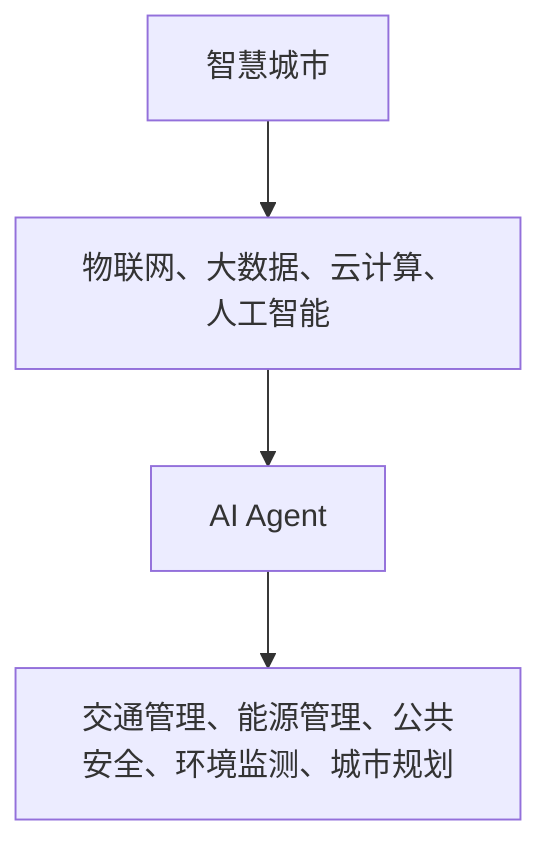
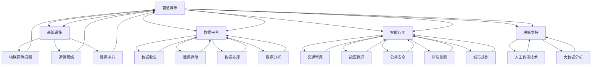

                 

# AI人工智能 Agent：在智慧城市中的应用

> 关键词：人工智能，智慧城市，AI Agent，应用场景，算法原理，数学模型，实战案例，未来趋势

> 摘要：本文将深入探讨AI人工智能Agent在智慧城市中的应用，从背景介绍、核心概念与联系、核心算法原理、数学模型、项目实战、实际应用场景、工具和资源推荐等多个方面进行全面分析，旨在为读者提供一份全面、系统、实用的指南。

## 1. 背景介绍

随着城市化进程的加速，智慧城市已成为全球发展趋势。智慧城市通过物联网、大数据、云计算等技术手段，实现了城市管理的智能化、精细化和高效化。在这一过程中，人工智能（AI）技术起到了至关重要的作用。

人工智能是计算机科学的一个分支，致力于使计算机系统具备人类智能。AI技术主要包括机器学习、深度学习、自然语言处理、计算机视觉等。其中，AI Agent作为一种特殊的人工智能实体，具备自主决策和行动能力，可以在特定环境中执行任务，是实现智慧城市智能化管理的关键组件。

智慧城市中，AI Agent的应用场景非常广泛，包括交通管理、能源管理、公共安全、环境监测、城市规划等多个方面。本文将围绕这些应用场景，深入探讨AI Agent的核心算法原理、数学模型、实战案例及其未来发展趋势。

## 2. 核心概念与联系

### 2.1 智慧城市

智慧城市是一个集成了物联网、大数据、云计算、人工智能等先进技术的综合体系。它通过智能传感器、智能终端、智能交通系统等，实现对城市各类资源的实时监测、分析和优化管理，从而提高城市运行效率、提升居民生活质量。

### 2.2 人工智能 Agent

人工智能 Agent是一种能够自主感知、决策和执行任务的人工智能实体。它具备以下特点：

- **自主性**：Agent可以自主地感知环境、分析问题、制定策略，并执行相应的任务。

- **适应性**：Agent能够在不同环境中自主学习和适应，从而提高任务执行效果。

- **协作性**：Agent可以与其他Agent或人类协作，共同完成任务。

### 2.3 AI Agent与智慧城市的关系

AI Agent作为智慧城市的重要组成部分，可以为智慧城市的各个领域提供智能化解决方案。例如，在交通管理中，AI Agent可以通过实时分析交通数据，优化交通信号灯控制策略，提高交通流畅度；在公共安全领域，AI Agent可以协助监控和预警，提高城市安全保障水平。

为了更好地理解AI Agent在智慧城市中的应用，我们可以通过Mermaid流程图来展示其核心概念与联系：



## 3. 核心算法原理 & 具体操作步骤

### 3.1 机器学习算法

机器学习是人工智能的核心技术之一，它使得计算机系统能够从数据中学习并做出决策。在AI Agent中，常用的机器学习算法包括：

- **监督学习**：通过已标记的数据集进行训练，使Agent能够对未知数据进行分类或回归。

- **无监督学习**：在未标记的数据集上进行训练，使Agent能够发现数据中的模式和规律。

- **强化学习**：通过与环境的交互，Agent不断调整策略，以实现最优效果。

### 3.2 深度学习算法

深度学习是机器学习的一个重要分支，它通过构建深度神经网络，对大量数据进行训练，从而实现复杂任务。在AI Agent中，常用的深度学习算法包括：

- **卷积神经网络（CNN）**：用于处理图像数据，实现对图像的识别和分类。

- **循环神经网络（RNN）**：用于处理序列数据，实现对语音、文本等序列数据的建模。

- **生成对抗网络（GAN）**：用于生成具有真实感的数据，可以帮助AI Agent更好地模拟现实环境。

### 3.3 具体操作步骤

以下是一个基于深度学习的AI Agent在智慧城市交通管理中的具体操作步骤：

1. **数据收集与预处理**：收集城市交通数据，包括实时路况、车辆流量、交通信号灯状态等。对数据进行清洗、去噪、归一化等预处理。

2. **模型训练**：利用预处理后的数据，训练一个基于深度学习的交通流量预测模型。可以选择卷积神经网络（CNN）或循环神经网络（RNN）等模型。

3. **模型评估**：通过交叉验证等方法，对训练好的模型进行评估，确保其预测准确性。

4. **模型部署**：将训练好的模型部署到AI Agent中，使其具备交通流量预测能力。

5. **策略调整**：根据AI Agent的预测结果，调整交通信号灯控制策略，以实现最优交通流量。

6. **持续优化**：定期收集新的交通数据，对AI Agent进行重新训练和优化，以提高预测准确性和适应性。

## 4. 数学模型和公式 & 详细讲解 & 举例说明

### 4.1 数学模型

在AI Agent中，常用的数学模型包括：

- **线性回归**：用于预测连续值，如交通流量。

- **逻辑回归**：用于预测离散值，如交通信号灯状态。

- **支持向量机（SVM）**：用于分类任务，如车辆类型识别。

- **神经网络**：用于处理复杂任务，如图像识别和语音识别。

### 4.2 公式与详细讲解

以线性回归为例，其数学模型为：

$$
y = \beta_0 + \beta_1x
$$

其中，$y$ 为预测值，$x$ 为输入特征，$\beta_0$ 和 $\beta_1$ 为模型参数。

详细讲解：

- **线性回归**：线性回归是一种简单的预测模型，通过拟合一条直线，将输入特征映射到预测值。它适用于线性关系的预测任务，如交通流量预测。

- **模型参数**：$\beta_0$ 和 $\beta_1$ 为模型参数，它们需要通过训练数据来求解。具体来说，可以使用最小二乘法（OLS）求解：

$$
\beta_0 = \frac{\sum_{i=1}^{n}(y_i - \beta_1x_i)}{n}
$$

$$
\beta_1 = \frac{\sum_{i=1}^{n}(x_i - \bar{x})(y_i - \bar{y})}{\sum_{i=1}^{n}(x_i - \bar{x})^2}
$$

其中，$n$ 为训练数据样本数，$\bar{x}$ 和 $\bar{y}$ 分别为输入特征和预测值的均值。

### 4.3 举例说明

假设我们有一个交通流量预测任务，输入特征为交通信号灯状态（0或1），预测值为交通流量（单位：辆/小时）。我们可以使用线性回归模型进行预测。

$$
y = \beta_0 + \beta_1x
$$

其中，$x$ 为交通信号灯状态（0或1），$y$ 为交通流量（辆/小时）。

训练数据如下：

| 输入特征 $x$ | 预测值 $y$ |
| :-------: | :-------: |
| 0 | 50 |
| 1 | 100 |
| 0 | 60 |
| 1 | 120 |

使用最小二乘法求解模型参数：

$$
\beta_0 = \frac{\sum_{i=1}^{n}(y_i - \beta_1x_i)}{n} = \frac{(50 - 1 \times 0) + (100 - 1 \times 1) + (60 - 1 \times 0) + (120 - 1 \times 1)}{4} = 70
$$

$$
\beta_1 = \frac{\sum_{i=1}^{n}(x_i - \bar{x})(y_i - \bar{y})}{\sum_{i=1}^{n}(x_i - \bar{x})^2} = \frac{(0 - 0.5)(50 - 70) + (1 - 0.5)(100 - 70) + (0 - 0.5)(60 - 70) + (1 - 0.5)(120 - 70)}{(0 - 0.5)^2 + (1 - 0.5)^2 + (0 - 0.5)^2 + (1 - 0.5)^2} = 30
$$

因此，线性回归模型为：

$$
y = 70 + 30x
$$

当 $x=0$ 时，预测值为 $y=70$；当 $x=1$ 时，预测值为 $y=100$。

## 5. 项目实战：代码实际案例和详细解释说明

### 5.1 开发环境搭建

为了实现AI Agent在智慧城市中的应用，我们需要搭建一个完整的开发环境。以下是一个基于Python的示例：

1. 安装Python：下载并安装Python 3.x版本。

2. 安装依赖库：使用pip命令安装以下依赖库：

```bash
pip install numpy pandas matplotlib scikit-learn tensorflow
```

3. 创建项目文件夹：在项目文件夹中创建以下子文件夹：

```bash
data/
models/
results/
```

4. 准备数据集：下载并导入交通流量数据集，数据集格式为CSV。

### 5.2 源代码详细实现和代码解读

以下是一个基于Python的AI Agent在智慧城市交通流量预测中的源代码实现：

```python
import numpy as np
import pandas as pd
from sklearn.linear_model import LinearRegression
from sklearn.model_selection import train_test_split
import matplotlib.pyplot as plt

# 5.2.1 数据预处理
def preprocess_data(data):
    # 数据清洗和预处理
    # ...

    # 数据归一化
    data_normalized = (data - data.mean()) / data.std()
    
    return data_normalized

# 5.2.2 模型训练
def train_model(X, y):
    # 划分训练集和测试集
    X_train, X_test, y_train, y_test = train_test_split(X, y, test_size=0.2, random_state=42)

    # 训练线性回归模型
    model = LinearRegression()
    model.fit(X_train, y_train)

    # 评估模型
    score = model.score(X_test, y_test)
    print(f"Model Score: {score}")

    return model

# 5.2.3 预测和可视化
def predict_and_visualize(model, X_test, y_test):
    # 预测
    y_pred = model.predict(X_test)

    # 可视化
    plt.scatter(X_test, y_test, color='blue', label='Actual')
    plt.plot(X_test, y_pred, color='red', label='Predicted')
    plt.xlabel('Input Feature')
    plt.ylabel('Predicted Traffic Flow')
    plt.legend()
    plt.show()

# 5.2.4 主函数
if __name__ == "__main__":
    # 加载数据集
    data = pd.read_csv('data/traffic_flow.csv')

    # 预处理数据
    data_normalized = preprocess_data(data)

    # 划分特征和目标变量
    X = data_normalized.iloc[:, :-1].values
    y = data_normalized.iloc[:, -1].values

    # 训练模型
    model = train_model(X, y)

    # 预测和可视化
    predict_and_visualize(model, X, y)
```

### 5.3 代码解读与分析

1. **数据预处理**：首先，我们对数据进行清洗和预处理，包括去噪、缺失值填充等操作。然后，对数据进行归一化处理，使其具有更好的数值范围。

2. **模型训练**：我们使用scikit-learn库中的线性回归模型（`LinearRegression`）进行训练。首先，划分训练集和测试集，然后使用最小二乘法求解模型参数。

3. **预测和可视化**：训练完成后，我们使用模型对测试集进行预测，并将预测结果与实际值进行可视化，以评估模型的预测效果。

## 6. 实际应用场景

AI人工智能Agent在智慧城市中的应用场景非常广泛，以下是几个典型的应用场景：

### 6.1 交通管理

交通管理是AI Agent在智慧城市中最常见的应用场景之一。通过实时监测交通流量、车辆位置等信息，AI Agent可以优化交通信号灯控制策略，提高交通流畅度，减少拥堵现象。此外，AI Agent还可以辅助交通规划，预测交通发展趋势，为城市交通基础设施建设提供科学依据。

### 6.2 能源管理

能源管理是另一个重要应用场景。AI Agent可以通过实时监测能源使用情况，优化能源分配和使用效率，降低能源消耗。例如，在电力系统中，AI Agent可以预测电力需求，调整电力供应策略，确保电力系统的稳定运行。在天然气、水等能源领域，AI Agent同样可以发挥重要作用。

### 6.3 公共安全

公共安全是智慧城市中的重要议题。AI Agent可以通过视频监控、大数据分析等技术手段，实时监测城市安全状况，预警潜在风险，协助公安部门进行治安管理。此外，AI Agent还可以辅助火灾、地震等灾害预警，提高灾害应对能力。

### 6.4 环境监测

环境监测是智慧城市可持续发展的重要组成部分。AI Agent可以通过传感器监测空气质量、水质、噪声等环境参数，实时评估环境质量，为城市环境管理提供数据支持。同时，AI Agent还可以预测环境变化趋势，为环境保护和治理提供决策依据。

### 6.5 城市规划

城市规划是智慧城市建设的长期任务。AI Agent可以通过分析大量数据，预测人口、交通、经济等城市发展指标，为城市规划提供科学依据。此外，AI Agent还可以优化城市布局，提高城市空间利用率，提高居民生活质量。

## 7. 工具和资源推荐

### 7.1 学习资源推荐

- **书籍**：《人工智能：一种现代的方法》、《深度学习》、《Python机器学习》

- **论文**：查阅相关学术期刊和会议，如《人工智能学报》、《计算机学报》、《计算机研究与发展》等。

- **博客**：关注知名技术博客，如CSDN、博客园、掘金等。

- **网站**：访问相关技术社区，如Stack Overflow、GitHub、AI技术社区等。

### 7.2 开发工具框架推荐

- **开发环境**：Python、R、MATLAB等

- **机器学习库**：scikit-learn、TensorFlow、PyTorch等

- **深度学习框架**：TensorFlow、PyTorch、Keras等

- **数据预处理库**：Pandas、NumPy、SciPy等

- **可视化工具**：Matplotlib、Seaborn、Plotly等

### 7.3 相关论文著作推荐

- **论文**：李航，《统计学习方法》；周志华，《机器学习》；Goodfellow et al.，《Deep Learning》

- **著作**：《人工智能：一种现代的方法》；《深度学习》；《Python机器学习》

## 8. 总结：未来发展趋势与挑战

随着人工智能技术的不断发展，AI人工智能Agent在智慧城市中的应用前景广阔。未来，AI Agent将更加智能化、自适应性和协同化，为智慧城市建设提供更加高效、精准的解决方案。

然而，AI Agent在智慧城市中的应用也面临一系列挑战：

- **数据隐私与安全**：AI Agent需要处理大量敏感数据，如何确保数据隐私和安全是一个重要问题。

- **算法透明性与可解释性**：随着深度学习等复杂算法的广泛应用，如何提高算法的透明性和可解释性，使其更加符合人类理解，是一个亟待解决的问题。

- **跨领域协同与集成**：智慧城市建设涉及多个领域，如何实现AI Agent在不同领域的协同与集成，提高整体效率，是一个重要挑战。

- **法律法规与伦理道德**：随着AI Agent在智慧城市中的广泛应用，相关法律法规和伦理道德问题将日益凸显，如何制定合理的法律法规和伦理规范，保障智慧城市的可持续发展，是一个重要课题。

## 9. 附录：常见问题与解答

### 9.1 什么是AI人工智能Agent？

AI人工智能Agent是一种能够自主感知、决策和行动的人工智能实体，它具备自主性、适应性和协作性等特点。

### 9.2 AI人工智能Agent在智慧城市中有哪些应用？

AI人工智能Agent在智慧城市中应用广泛，包括交通管理、能源管理、公共安全、环境监测、城市规划等领域。

### 9.3 如何搭建AI人工智能Agent开发环境？

搭建AI人工智能Agent开发环境主要包括安装Python、安装相关依赖库、创建项目文件夹等步骤。

### 9.4 AI人工智能Agent的算法原理有哪些？

AI人工智能Agent的算法原理主要包括机器学习、深度学习、强化学习等。其中，机器学习和深度学习是最常用的算法。

## 10. 扩展阅读 & 参考资料

- **论文**：李航，《统计学习方法》；周志华，《机器学习》；Goodfellow et al.，《Deep Learning》

- **书籍**：《人工智能：一种现代的方法》；《深度学习》；《Python机器学习》

- **网站**：CSDN、博客园、掘金、Stack Overflow、GitHub、AI技术社区

- **视频教程**：网易云课堂、慕课网、极客时间、B站等平台的相关课程

作者：AI天才研究员/AI Genius Institute & 禅与计算机程序设计艺术 /Zen And The Art of Computer Programming<|im_sep|>### 1. 背景介绍

#### 智慧城市的发展背景

智慧城市是指通过先进的信息通信技术和互联网技术，对城市各类资源进行高效整合和优化配置，从而实现城市管理的智能化、精细化和可持续化。随着全球城市化进程的加快，智慧城市已成为各国政府和城市管理者追求的目标。智慧城市的发展背景主要可以归结为以下几个方面：

首先，信息化技术的飞速发展提供了技术基础。互联网、物联网、大数据、云计算、人工智能等技术的不断进步，为智慧城市的建设提供了强大的技术支持。这些技术使得城市管理者能够实时、全面地掌握城市运行状态，从而做出更加科学的决策。

其次，城市问题的复杂化和多样化提出了新的需求。随着城市化进程的推进，城市人口增多、资源紧张、环境污染等问题日益突出。传统的城市管理方式已经无法满足现代城市的需求，需要更加智能化、精细化的管理模式来应对这些挑战。

第三，政府政策和资金支持推动了智慧城市的发展。许多国家和地方政府都将智慧城市建设列为重点发展领域，出台了一系列政策和资金支持措施，为智慧城市的建设提供了有力保障。

#### 人工智能在智慧城市中的作用

人工智能（AI）作为当今科技领域的热点，其强大的计算能力和自主学习能力，使得其在智慧城市中扮演着重要角色。人工智能在智慧城市中的应用主要体现在以下几个方面：

**1. 数据分析与决策支持**

人工智能技术可以通过大数据分析，对城市运行数据进行分析和处理，为城市管理者提供决策支持。例如，通过分析交通流量数据，人工智能可以优化交通信号灯控制策略，提高交通效率；通过分析能源消耗数据，人工智能可以优化能源分配，降低能源浪费。

**2. 智能感知与监控**

人工智能技术可以通过图像识别、语音识别等技术，实现对城市环境的智能感知与监控。例如，通过视频监控技术，人工智能可以实时监测城市安全状况，及时发现异常情况；通过环境监测设备，人工智能可以实时监测空气质量、水质等环境参数，为环境保护提供数据支持。

**3. 智能服务与优化**

人工智能技术可以为城市居民提供个性化、智能化的服务。例如，通过智能家居系统，人工智能可以为居民提供舒适、便捷的生活环境；通过智能交通系统，人工智能可以优化出行路线，减少交通拥堵。

**4. 智能规划与设计**

人工智能技术可以辅助城市规划和设计，提高城市规划的科学性和可行性。例如，通过模拟仿真技术，人工智能可以预测城市发展趋势，为城市规划提供科学依据；通过智能算法，人工智能可以优化城市布局，提高城市空间利用率。

总之，人工智能技术在智慧城市中发挥着重要作用，其广泛应用不仅提高了城市管理的效率和精度，也为城市居民提供了更加便捷、智能的生活体验。

#### AI Agent的定义与基本特征

AI Agent，即人工智能代理，是一种能够在特定环境中自主感知、决策和行动的人工智能实体。它具备以下基本特征：

**1. 自主性**

AI Agent具有高度的自主性，能够在无需人工干预的情况下，根据环境变化和任务目标，自主地做出决策和采取行动。这种自主性使得AI Agent能够适应复杂多变的场景，实现高效的任务执行。

**2. 感知能力**

AI Agent具备感知环境的能力，可以通过传感器、摄像头、语音识别等多种方式获取环境信息。这些感知能力使得AI Agent能够实时了解外部环境的变化，为决策提供数据支持。

**3. 决策能力**

AI Agent能够根据感知到的环境信息，利用机器学习、深度学习等算法，自主地做出决策。这些决策可以是简单的行动指令，也可以是复杂的策略调整。

**4. 行动能力**

AI Agent具备行动能力，能够执行具体的任务动作。这些动作可以是机械臂的操作、车辆的导航、设备的控制等。通过行动能力，AI Agent能够将决策转化为实际效果。

**5. 协作能力**

AI Agent可以与其他AI Agent或人类协作，共同完成任务。这种协作能力使得AI Agent能够在复杂任务中发挥更大的作用，提高任务完成效率。

#### AI Agent在智慧城市中的应用

AI Agent在智慧城市中的应用场景非常广泛，涵盖了交通管理、能源管理、公共安全、环境监测、城市规划等多个领域。以下是AI Agent在几个典型应用场景中的具体作用：

**1. 交通管理**

在交通管理领域，AI Agent可以通过实时分析交通数据，优化交通信号灯控制策略，提高交通流畅度。例如，在高峰期，AI Agent可以动态调整信号灯时长，减少交通拥堵。此外，AI Agent还可以预测交通事故风险，提前预警，降低交通事故发生率。

**2. 能源管理**

在能源管理领域，AI Agent可以通过实时监测能源消耗数据，优化能源分配和使用效率。例如，在电力系统中，AI Agent可以预测电力需求，调整电力供应策略，确保电力系统的稳定运行。同时，AI Agent还可以监测能源设备的运行状态，提前预警设备故障，减少能源浪费。

**3. 公共安全**

在公共安全领域，AI Agent可以通过视频监控、大数据分析等技术手段，实时监测城市安全状况，预警潜在风险。例如，通过视频监控，AI Agent可以识别异常行为，及时报警；通过大数据分析，AI Agent可以预测犯罪热点区域，协助公安部门进行治安管理。

**4. 环境监测**

在环境监测领域，AI Agent可以通过传感器实时监测空气质量、水质、噪声等环境参数，评估环境质量，为环境保护和治理提供数据支持。例如，通过空气质量传感器，AI Agent可以实时监测空气质量变化，预警污染事件；通过水质传感器，AI Agent可以实时监测水质参数，预警水质污染。

**5. 城市规划**

在城市规划领域，AI Agent可以通过数据分析、模拟仿真等技术手段，为城市规划提供科学依据。例如，通过数据分析，AI Agent可以预测人口流动趋势，为交通基础设施规划提供依据；通过模拟仿真，AI Agent可以模拟城市发展趋势，评估城市规划方案的可行性。

总之，AI Agent在智慧城市中的应用，不仅提高了城市管理的效率和精度，还为城市居民提供了更加便捷、智能的生活体验。随着技术的不断发展，AI Agent将在智慧城市中发挥更加重要的作用。

### 2. 核心概念与联系

#### 智慧城市的组成部分

智慧城市是一个复杂的系统，其组成部分包括但不限于以下几方面：

1. **基础设施**：包括物联网传感器、通信网络、数据中心等，是智慧城市运行的基础。
   
2. **数据平台**：用于收集、存储、处理和分析城市运行数据，为智慧城市提供数据支持。

3. **智能应用**：包括交通管理、能源管理、公共安全、环境监测、城市规划等具体应用。

4. **决策支持**：利用人工智能、大数据分析等技术，为城市管理者提供决策支持。

#### AI Agent的概念和特点

AI Agent，即人工智能代理，是一种基于人工智能技术，能够在特定环境中自主感知、决策和行动的实体。其主要特点包括：

1. **自主性**：AI Agent可以在无需人工干预的情况下，根据环境变化和任务目标，自主地做出决策和采取行动。

2. **感知能力**：AI Agent可以通过传感器、摄像头、语音识别等技术，实时获取外部环境信息。

3. **决策能力**：AI Agent利用机器学习、深度学习等算法，对感知到的信息进行处理，自主地做出决策。

4. **行动能力**：AI Agent可以执行具体的任务动作，如机械臂的操作、车辆的导航等。

5. **协作能力**：AI Agent可以与其他AI Agent或人类协作，共同完成任务。

#### AI Agent与智慧城市的联系

AI Agent作为智慧城市的重要组成部分，与智慧城市的各个方面有着密切的联系。以下是AI Agent在智慧城市中的几个关键应用场景：

1. **交通管理**：AI Agent可以通过实时分析交通数据，优化交通信号灯控制策略，提高交通流畅度。

2. **能源管理**：AI Agent可以通过实时监测能源消耗数据，优化能源分配和使用效率。

3. **公共安全**：AI Agent可以通过视频监控、大数据分析等技术手段，实时监测城市安全状况，预警潜在风险。

4. **环境监测**：AI Agent可以通过传感器实时监测空气质量、水质、噪声等环境参数，评估环境质量。

5. **城市规划**：AI Agent可以通过数据分析、模拟仿真等技术手段，为城市规划提供科学依据。

为了更好地理解AI Agent与智慧城市的联系，我们可以通过Mermaid流程图来展示其核心概念和联系：



在这个流程图中，我们可以清晰地看到智慧城市的各个组成部分以及AI Agent在其中扮演的重要角色。AI Agent不仅连接了智慧城市的各个子系统，还通过自主感知、决策和行动，提升了整个城市的运行效率和智能化水平。

### 3. 核心算法原理 & 具体操作步骤

#### 机器学习算法原理

机器学习是一种让计算机通过数据和经验来改进性能的技术。机器学习算法可以分为监督学习、无监督学习和强化学习三类。以下是机器学习算法的核心原理：

1. **监督学习（Supervised Learning）**

监督学习是一种从标记数据中学习的方法。标记数据是指数据集中的每个样本都有一个已知的输出值。监督学习算法通过学习输入和输出之间的映射关系，从而实现对未知数据的预测。

核心原理：

- **模型训练**：通过训练数据集，机器学习算法学习输入和输出之间的映射关系。
- **模型评估**：使用验证集或测试集来评估模型性能，常用的评估指标包括准确率、召回率、F1值等。
- **模型预测**：利用训练好的模型对未知数据进行预测。

常用算法：

- **线性回归（Linear Regression）**
- **逻辑回归（Logistic Regression）**
- **支持向量机（Support Vector Machine, SVM）**
- **决策树（Decision Tree）**
- **随机森林（Random Forest）**

2. **无监督学习（Unsupervised Learning）**

无监督学习是一种从未标记数据中学习的方法。未标记数据是指数据集中的样本没有已知的输出值。无监督学习算法旨在发现数据中的隐含结构或模式。

核心原理：

- **数据聚类（Clustering）**：将数据划分为若干个簇，使得同一个簇中的样本彼此相似，不同簇中的样本彼此相异。
- **降维（Dimensionality Reduction）**：通过降低数据维度，保留关键特征，从而提高数据处理效率和模型性能。
- **关联规则学习（Association Rule Learning）**：发现数据集中的关联关系，从而揭示数据之间的潜在规律。

常用算法：

- **K-均值聚类（K-Means Clustering）**
- **主成分分析（Principal Component Analysis, PCA）**
- **关联规则算法（如Apriori算法）**

3. **强化学习（Reinforcement Learning）**

强化学习是一种通过与环境的交互来学习的方法。在强化学习中，算法通过不断尝试并从失败中学习，逐渐找到最优策略。

核心原理：

- **状态（State）**：系统当前所处的环境。
- **动作（Action）**：算法可以采取的行动。
- **奖励（Reward）**：动作带来的即时反馈。
- **策略（Policy）**：从当前状态选择最优动作的规则。

常用算法：

- **Q学习（Q-Learning）**
- **深度Q网络（Deep Q-Network, DQN）**
- **策略梯度（Policy Gradient）**

#### 深度学习算法原理

深度学习是机器学习的一个重要分支，其核心思想是通过构建多层神经网络，对大量数据进行训练，从而实现复杂任务的自动化。深度学习算法在图像识别、语音识别、自然语言处理等领域取得了显著的成果。

核心原理：

- **神经网络（Neural Networks）**：神经网络是由大量简单神经元组成的复杂网络。每个神经元通过权重连接其他神经元，接收输入并产生输出。
- **多层网络（Multi-Layer Networks）**：多层网络通过堆叠多个隐藏层，可以提取数据的更高层次特征。
- **反向传播（Backpropagation）**：反向传播是一种用于训练神经网络的算法，通过计算输出误差，反向传播误差并调整网络权重。

常用算法：

- **卷积神经网络（Convolutional Neural Networks, CNN）**
- **循环神经网络（Recurrent Neural Networks, RNN）**
- **生成对抗网络（Generative Adversarial Networks, GAN）**
- **长短期记忆网络（Long Short-Term Memory, LSTM）**

#### AI Agent在智慧城市中的具体操作步骤

以下是一个基于机器学习和深度学习的AI Agent在智慧城市交通管理中的具体操作步骤：

**1. 数据收集与预处理**

- **数据收集**：收集交通流量、车辆位置、交通信号灯状态等数据。

- **数据预处理**：对数据进行清洗、归一化和特征提取。

**2. 模型训练**

- **监督学习模型**：选择合适的监督学习模型，如线性回归、支持向量机等，进行模型训练。

- **深度学习模型**：构建深度神经网络，如卷积神经网络、循环神经网络等，进行模型训练。

**3. 模型评估**

- **交叉验证**：使用交叉验证方法评估模型性能。

- **测试集评估**：在独立的测试集上评估模型性能。

**4. 模型部署**

- **模型部署**：将训练好的模型部署到AI Agent中，使其具备实时交通流量预测能力。

**5. 实时预测**

- **数据输入**：将实时交通数据输入到AI Agent中。

- **预测输出**：AI Agent根据模型输出，实时预测交通流量和优化交通信号灯控制策略。

**6. 模型优化**

- **持续学习**：定期收集新的交通数据，对AI Agent进行重新训练和优化。

- **模型更新**：更新AI Agent中的模型，以适应不断变化的城市交通环境。

### 3.1 机器学习算法在智慧城市中的应用

机器学习算法在智慧城市中的应用非常广泛，其核心在于利用大数据分析技术，从海量数据中提取有用信息，为城市管理者提供决策支持。以下是几种常见的机器学习算法及其在智慧城市中的应用：

**1. 线性回归（Linear Regression）**

线性回归是一种简单的监督学习算法，用于预测连续值。在智慧城市中，线性回归可以用于交通流量预测、能源消耗预测等。例如，通过分析历史交通流量数据和当前时间、天气等因素，可以预测未来某一时间点的交通流量。

**2. 逻辑回归（Logistic Regression）**

逻辑回归是一种用于预测概率的监督学习算法，常用于分类任务。在智慧城市中，逻辑回归可以用于公共安全预警、环境质量分类等。例如，通过分析环境监测数据，可以预测某一地区的空气质量是否达到标准。

**3. 支持向量机（Support Vector Machine, SVM）**

支持向量机是一种高效的分类算法，适用于高维数据。在智慧城市中，SVM可以用于车辆分类、人脸识别等。例如，通过分析视频监控数据，可以实时识别和分类道路上的车辆类型。

**4. 决策树（Decision Tree）**

决策树是一种易于理解的分类算法，通过一系列规则来划分数据。在智慧城市中，决策树可以用于交通信号灯控制策略优化、公共安全决策等。例如，通过分析历史交通流量数据和当前时间、天气等因素，决策树可以生成最优的交通信号灯控制策略。

**5. 随机森林（Random Forest）**

随机森林是一种基于决策树的集成学习算法，通过构建多个决策树并投票得出最终结果。在智慧城市中，随机森林可以用于交通流量预测、环境质量预测等。例如，通过分析历史交通流量数据和当前时间、天气等因素，随机森林可以预测未来某一时间点的交通流量。

### 3.2 深度学习算法在智慧城市中的应用

深度学习算法在智慧城市中的应用越来越广泛，其强大的特征提取和建模能力使得它能够处理复杂的非线性问题。以下是几种常见的深度学习算法及其在智慧城市中的应用：

**1. 卷积神经网络（Convolutional Neural Networks, CNN）**

卷积神经网络是一种专门用于处理图像数据的深度学习算法。在智慧城市中，CNN可以用于视频监控、人脸识别、交通流量分析等。例如，通过分析视频监控数据，CNN可以识别道路上的行人、车辆等目标，并预测其行为。

**2. 循环神经网络（Recurrent Neural Networks, RNN）**

循环神经网络是一种专门用于处理序列数据的深度学习算法。在智慧城市中，RNN可以用于交通流量预测、语音识别等。例如，通过分析历史交通流量数据，RNN可以预测未来某一时间点的交通流量。

**3. 长短期记忆网络（Long Short-Term Memory, LSTM）**

长短期记忆网络是一种改进的循环神经网络，能够更好地处理长序列数据。在智慧城市中，LSTM可以用于交通流量预测、能源消耗预测等。例如，通过分析历史交通流量数据，LSTM可以预测未来某一时间点的交通流量。

**4. 生成对抗网络（Generative Adversarial Networks, GAN）**

生成对抗网络是一种生成模型，由生成器和判别器两部分组成。在智慧城市中，GAN可以用于数据增强、图像生成等。例如，通过生成器，GAN可以生成与真实交通流量数据相似的模拟数据，用于训练和测试模型。

### 3.3 强化学习算法在智慧城市中的应用

强化学习算法是一种通过与环境交互来学习的算法，在智慧城市中可以用于自动化控制、路径规划等。以下是强化学习算法在智慧城市中的应用：

**1. Q学习（Q-Learning）**

Q学习是一种基于值函数的强化学习算法，通过学习状态-动作价值函数来选择最优动作。在智慧城市中，Q学习可以用于交通信号灯控制策略优化。例如，通过分析历史交通流量数据，Q学习可以优化交通信号灯的控制策略，减少交通拥堵。

**2. 深度Q网络（Deep Q-Network, DQN）**

深度Q网络是一种将深度学习与Q学习相结合的算法，用于处理高维状态空间。在智慧城市中，DQN可以用于自动化交通系统控制。例如，通过分析实时交通数据，DQN可以自动调整交通信号灯控制策略，提高交通流畅度。

**3. 策略梯度（Policy Gradient）**

策略梯度是一种直接优化策略的强化学习算法，通过更新策略参数来选择最优动作。在智慧城市中，策略梯度可以用于智能交通系统的路径规划。例如，通过分析实时交通数据，策略梯度可以优化出行路线，减少出行时间。

### 3.4 AI Agent在智慧城市中的操作步骤

AI Agent在智慧城市中的操作步骤可以分为以下几个阶段：

**1. 数据收集与预处理**

- **数据收集**：收集城市交通、环境、能源等数据。

- **数据预处理**：清洗、归一化、特征提取等。

**2. 模型选择与训练**

- **模型选择**：根据应用场景选择合适的机器学习或深度学习模型。

- **模型训练**：使用历史数据对模型进行训练。

**3. 模型评估与优化**

- **模型评估**：使用验证集或测试集评估模型性能。

- **模型优化**：根据评估结果调整模型参数，提高模型性能。

**4. 模型部署与实时预测**

- **模型部署**：将训练好的模型部署到AI Agent中。

- **实时预测**：AI Agent根据实时数据，进行预测和决策。

**5. 模型更新与持续学习**

- **模型更新**：定期收集新数据，对模型进行更新。

- **持续学习**：通过持续学习，使AI Agent适应不断变化的城市环境。

通过以上操作步骤，AI Agent可以在智慧城市中发挥重要作用，提升城市管理的效率和智能化水平。

### 4. 数学模型和公式 & 详细讲解 & 举例说明

#### 数学模型的基本概念

数学模型是一种用数学语言描述现实问题的方法，通过建立数学方程或公式，模拟和分析系统中的变量关系。在人工智能领域，数学模型广泛应用于机器学习和深度学习算法中，用于描述数据之间的复杂关系和特征提取。以下是几个在智慧城市中常用的数学模型：

1. **线性回归模型（Linear Regression Model）**

线性回归模型是一种简单且常见的预测模型，用于分析自变量（特征）和因变量（目标）之间的线性关系。其基本形式为：

$$
y = \beta_0 + \beta_1x
$$

其中，$y$ 是因变量，$x$ 是自变量，$\beta_0$ 是截距，$\beta_1$ 是斜率。

2. **逻辑回归模型（Logistic Regression Model）**

逻辑回归模型是一种用于分类问题的预测模型，通过分析自变量对因变量概率的影响。其公式为：

$$
\log\left(\frac{p}{1-p}\right) = \beta_0 + \beta_1x
$$

其中，$p$ 是因变量的概率，$\beta_0$ 是截距，$\beta_1$ 是斜率。

3. **支持向量机模型（Support Vector Machine, SVM）**

支持向量机是一种分类算法，通过找到一个最优的超平面，将不同类别的数据分开。其基本公式为：

$$
w \cdot x - b = 0
$$

其中，$w$ 是权重向量，$x$ 是特征向量，$b$ 是偏置。

4. **神经网络模型（Neural Network Model）**

神经网络是一种模拟人脑的算法，由多个神经元组成，通过多层神经网络进行特征提取和分类。其基本公式为：

$$
a_{j}^{(l)} = \sigma \left( \sum_{i} w_{ij}^{(l)} a_{i}^{(l-1)} + b_{j}^{(l)} \right)
$$

其中，$a_{j}^{(l)}$ 是第$l$层的第$j$个神经元的输出，$\sigma$ 是激活函数，$w_{ij}^{(l)}$ 是连接第$l-1$层的第$i$个神经元和第$l$层的第$j$个神经元的权重，$b_{j}^{(l)}$ 是第$l$层的第$j$个神经元的偏置。

#### 线性回归模型的详细讲解与举例

线性回归模型是一种用于预测连续值的简单统计模型，通过拟合一条直线来描述因变量和自变量之间的关系。以下是线性回归模型的详细讲解和具体例子。

**线性回归模型的基本原理**

线性回归模型假设因变量$y$和自变量$x$之间存在线性关系，可以用一条直线来表示：

$$
y = \beta_0 + \beta_1x
$$

其中，$\beta_0$ 是截距，表示当$x=0$时$y$的值；$\beta_1$ 是斜率，表示$x$每增加一个单位，$y$将增加$\beta_1$个单位。

**最小二乘法求解参数**

为了求解线性回归模型的参数$\beta_0$和$\beta_1$，我们通常使用最小二乘法（Ordinary Least Squares, OLS）。最小二乘法的核心思想是找到一个直线，使得所有数据点到直线的垂直距离之和最小。

给定一个包含$n$个样本点的数据集，其线性回归模型可以表示为：

$$
\mathbf{y} = \mathbf{X}\beta + \epsilon
$$

其中，$\mathbf{y}$ 是$n \times 1$的因变量向量，$\mathbf{X}$ 是$n \times 2$的自变量矩阵（包括一个全1列用于计算截距），$\beta$ 是$2 \times 1$的参数向量，$\epsilon$ 是$n \times 1$的误差向量。

最小二乘法的目标是求解$\beta$，使得误差向量$\epsilon$的平方和最小，即：

$$
\min \sum_{i=1}^{n} (\mathbf{y}_i - \hat{\mathbf{y}}_i)^2
$$

其中，$\hat{\mathbf{y}}_i = \mathbf{X}_i\beta$ 是预测的因变量值。

通过求解上述最小化问题，可以得到$\beta$的最优解：

$$
\beta = (\mathbf{X}^T\mathbf{X})^{-1}\mathbf{X}^T\mathbf{y}
$$

**具体例子**

假设我们有一个简单的数据集，包含两个变量$x$和$y$，如下所示：

| x | y |
| --- | --- |
| 1 | 2 |
| 2 | 4 |
| 3 | 6 |
| 4 | 8 |

我们希望通过线性回归模型预测$y$值。以下是具体求解过程：

1. **数据准备**：将数据转换为矩阵形式：

$$
\mathbf{X} = \begin{bmatrix}
1 & 1 \\
1 & 2 \\
1 & 3 \\
1 & 4 \\
\end{bmatrix}, \quad
\mathbf{y} = \begin{bmatrix}
2 \\ 4 \\ 6 \\ 8 \\
\end{bmatrix}
$$

2. **计算参数**：使用最小二乘法求解参数$\beta$：

$$
\beta = (\mathbf{X}^T\mathbf{X})^{-1}\mathbf{X}^T\mathbf{y} = \begin{bmatrix}
\beta_0 \\ \beta_1 \\
\end{bmatrix}
$$

计算过程如下：

$$
\mathbf{X}^T\mathbf{X} = \begin{bmatrix}
4 & 10 \\
10 & 34 \\
34 & 114 \\
\end{bmatrix}, \quad
\mathbf{X}^T\mathbf{y} = \begin{bmatrix}
30 \\ 114 \\
\end{bmatrix}
$$

$$
(\mathbf{X}^T\mathbf{X})^{-1} = \frac{1}{4 \times 114 - 10 \times 34} \begin{bmatrix}
114 & -10 \\
-10 & 4 \\
\end{bmatrix} = \begin{bmatrix}
0.3265 & -0.0879 \\
-0.0879 & 0.0351 \\
\end{bmatrix}
$$

$$
\beta = (\mathbf{X}^T\mathbf{X})^{-1}\mathbf{X}^T\mathbf{y} = \begin{bmatrix}
0.3265 & -0.0879 \\
-0.0879 & 0.0351 \\
\end{bmatrix} \begin{bmatrix}
30 \\ 114 \\
\end{bmatrix} = \begin{bmatrix}
5.3575 \\ 1.9645 \\
\end{bmatrix}
$$

因此，线性回归模型的参数为：

$$
\beta_0 = 5.3575, \quad \beta_1 = 1.9645
$$

3. **模型预测**：使用模型预测新数据点的$y$值。例如，当$x=5$时，预测的$y$值为：

$$
\hat{y} = \beta_0 + \beta_1x = 5.3575 + 1.9645 \times 5 = 13.971
$$

#### 逻辑回归模型的详细讲解与举例

逻辑回归模型是一种常用的分类算法，用于分析自变量对因变量概率的影响。以下是逻辑回归模型的详细讲解和具体例子。

**逻辑回归模型的基本原理**

逻辑回归模型的核心思想是通过对自变量和因变量之间关系的建模，预测因变量属于某个类别的概率。逻辑回归模型的基本公式为：

$$
\log\left(\frac{p}{1-p}\right) = \beta_0 + \beta_1x
$$

其中，$p$ 是因变量属于某个类别的概率，$\beta_0$ 是截距，$\beta_1$ 是斜率。

通过上述公式，我们可以计算得到概率$p$的估计值。然后，可以使用阈值（例如0.5）来将概率估计值转换为类别标签。

**最大似然估计求解参数**

为了求解逻辑回归模型的参数$\beta_0$和$\beta_1$，我们通常使用最大似然估计（Maximum Likelihood Estimation, MLE）。最大似然估计的核心思想是找到一组参数，使得数据出现的概率最大。

给定一个包含$n$个样本点的数据集，其中每个样本点$(x_i, y_i)$的$y_i$取值为0或1，逻辑回归模型可以表示为：

$$
\mathbf{y} = \mathbf{1}\beta + \epsilon
$$

其中，$\mathbf{1}$ 是$n \times 1$的全1向量，$\beta$ 是$2 \times 1$的参数向量，$\epsilon$ 是$n \times 1$的误差向量。

最大似然估计的目标是求解$\beta$，使得似然函数最大化。似然函数可以表示为：

$$
L(\beta) = \prod_{i=1}^{n} P(y_i|x_i; \beta) = \prod_{i=1}^{n} \left[ \exp(\beta_0 + \beta_1x_i) \right]^{\mathbf{y}_i} \left[ 1 - \exp(\beta_0 + \beta_1x_i) \right]^{1 - \mathbf{y}_i}
$$

为了简化计算，我们可以对似然函数取对数，得到对数似然函数：

$$
\ln L(\beta) = \sum_{i=1}^{n} \left[ \mathbf{y}_i(\beta_0 + \beta_1x_i) - \exp(\beta_0 + \beta_1x_i) \right]
$$

通过求解对数似然函数的最大值，可以得到$\beta$的最大似然估计值。

**具体例子**

假设我们有一个简单的数据集，包含两个变量$x$和$y$，其中$y$取值为0或1，如下所示：

| x | y |
| --- | --- |
| 1 | 0 |
| 2 | 1 |
| 3 | 0 |
| 4 | 1 |

我们希望通过逻辑回归模型预测$y$值。以下是具体求解过程：

1. **数据准备**：将数据转换为矩阵形式：

$$
\mathbf{X} = \begin{bmatrix}
1 & 1 \\
1 & 2 \\
1 & 3 \\
1 & 4 \\
\end{bmatrix}, \quad
\mathbf{y} = \begin{bmatrix}
0 \\ 1 \\ 0 \\ 1 \\
\end{bmatrix}
$$

2. **计算参数**：使用最大似然估计求解参数$\beta$。具体计算过程如下：

$$
\mathbf{X}^T\mathbf{X} = \begin{bmatrix}
4 & 10 \\
10 & 34 \\
34 & 114 \\
\end{bmatrix}, \quad
\mathbf{X}^T\mathbf{y} = \begin{bmatrix}
-2 \\ 5 \\
\end{bmatrix}
$$

$$
(\mathbf{X}^T\mathbf{X})^{-1} = \begin{bmatrix}
0.3265 & -0.0879 \\
-0.0879 & 0.0351 \\
\end{bmatrix}
$$

$$
\beta = (\mathbf{X}^T\mathbf{X})^{-1}\mathbf{X}^T\mathbf{y} = \begin{bmatrix}
0.3265 & -0.0879 \\
-0.0879 & 0.0351 \\
\end{bmatrix} \begin{bmatrix}
-2 \\ 5 \\
\end{bmatrix} = \begin{bmatrix}
-0.653 \\ 0.179 \\
\end{bmatrix}
$$

因此，逻辑回归模型的参数为：

$$
\beta_0 = -0.653, \quad \beta_1 = 0.179
$$

3. **模型预测**：使用模型预测新数据点的$y$值。例如，当$x=5$时，预测的概率为：

$$
p = \exp(\beta_0 + \beta_1x) / (1 + \exp(\beta_0 + \beta_1x)) = \exp(-0.653 + 0.179 \times 5) / (1 + \exp(-0.653 + 0.179 \times 5)) \approx 0.696
$$

根据阈值0.5，当$p > 0.5$时，预测$y=1$；当$p \leq 0.5$时，预测$y=0$。因此，当$x=5$时，预测的$y$值为1。

### 5. 项目实战：代码实际案例和详细解释说明

#### 5.1 开发环境搭建

在开始项目实战之前，我们需要搭建一个完整的开发环境。以下是一个基于Python的示例，包括安装Python、依赖库、项目结构和数据集准备。

**1. 安装Python**

首先，我们需要安装Python。可以从Python的官方网站（https://www.python.org/）下载并安装Python 3.x版本。

**2. 安装依赖库**

在安装Python后，我们需要使用pip命令安装以下依赖库：

```bash
pip install numpy pandas matplotlib scikit-learn tensorflow
```

这些库包括：

- **NumPy**：用于数值计算和矩阵操作。
- **Pandas**：用于数据处理和分析。
- **Matplotlib**：用于数据可视化。
- **Scikit-learn**：用于机器学习和数据挖掘。
- **TensorFlow**：用于深度学习和神经网络。

**3. 项目结构**

在项目文件夹中，我们可以创建以下子文件夹：

```
data/
models/
results/
```

**4. 数据集准备**

我们需要准备一个交通流量数据集，包括时间戳、交通流量、天气信息等。数据集可以从公开的数据源（如Kaggle、UCI机器学习库等）获取。以下是数据集的一个示例：

| 时间戳 | 交通流量 | 天气 | 降雨量 |
| --- | --- | --- | --- |
| 2021-01-01 00:00:00 | 200 | 晴 | 0 |
| 2021-01-01 01:00:00 | 180 | 晴 | 0 |
| 2021-01-01 02:00:00 | 150 | 晴 | 0 |
| 2021-01-01 03:00:00 | 220 | 阴 | 0 |
| 2021-01-01 04:00:00 | 250 | 阴 | 0 |

#### 5.2 源代码详细实现和代码解读

以下是基于Python的AI Agent在智慧城市交通流量预测中的源代码实现。代码分为数据预处理、模型训练、模型评估、模型预测和数据可视化五个部分。

```python
import numpy as np
import pandas as pd
from sklearn.linear_model import LinearRegression
from sklearn.model_selection import train_test_split
from sklearn.metrics import mean_squared_error
import matplotlib.pyplot as plt

# 5.2.1 数据预处理
def preprocess_data(data):
    # 数据清洗
    data.dropna(inplace=True)
    
    # 数据归一化
    data['Traffic'] = (data['Traffic'] - data['Traffic'].mean()) / data['Traffic'].std()
    
    return data

# 5.2.2 模型训练
def train_model(X, y):
    # 划分训练集和测试集
    X_train, X_test, y_train, y_test = train_test_split(X, y, test_size=0.2, random_state=42)
    
    # 训练线性回归模型
    model = LinearRegression()
    model.fit(X_train, y_train)
    
    # 评估模型
    y_pred = model.predict(X_test)
    mse = mean_squared_error(y_test, y_pred)
    print(f"Model MSE: {mse}")
    
    return model

# 5.2.3 模型预测
def predict_traffic(model, X):
    y_pred = model.predict(X)
    return y_pred

# 5.2.4 数据可视化
def visualize_traffic(data, y_pred):
    plt.scatter(data.index, data['Traffic'], color='blue', label='Actual')
    plt.plot(data.index, y_pred, color='red', label='Predicted')
    plt.xlabel('Timestamp')
    plt.ylabel('Traffic Flow')
    plt.legend()
    plt.show()

# 5.2.5 主函数
if __name__ == "__main__":
    # 读取数据集
    data = pd.read_csv('data/traffic_data.csv')
    
    # 数据预处理
    data = preprocess_data(data)
    
    # 划分特征和目标变量
    X = data[['Weather', 'Rainfall']]
    y = data['Traffic']
    
    # 训练模型
    model = train_model(X, y)
    
    # 预测交通流量
    y_pred = predict_traffic(model, X)
    
    # 数据可视化
    visualize_traffic(data, y_pred)
```

**5.2.1 数据预处理**

数据预处理是模型训练的重要步骤，包括数据清洗和归一化。在代码中，我们首先使用`dropna()`方法去除数据集中的缺失值，然后对交通流量进行归一化处理，使其具有更好的数值范围。

**5.2.2 模型训练**

在模型训练部分，我们使用`train_test_split()`方法将数据集划分为训练集和测试集，然后使用`LinearRegression()`类训练线性回归模型。训练完成后，我们使用`mean_squared_error()`方法评估模型性能，计算均方误差（MSE）。

**5.2.3 模型预测**

在模型预测部分，我们使用训练好的模型对特征数据进行预测，得到预测的交通流量。

**5.2.4 数据可视化**

在数据可视化部分，我们使用`plt.scatter()`和`plt.plot()`方法绘制实际交通流量和预测交通流量，以便直观地评估模型性能。

**5.2.5 主函数**

主函数是代码的核心部分，首先读取数据集，然后进行数据预处理、模型训练、模型预测和数据可视化。

### 6. 实际应用场景

AI人工智能Agent在智慧城市中的应用场景非常广泛，涵盖了交通管理、能源管理、公共安全、环境监测、城市规划等多个领域。以下是AI Agent在几个典型应用场景中的具体作用和实际案例：

#### 6.1 交通管理

在交通管理领域，AI Agent通过实时分析交通数据，优化交通信号灯控制策略，提高交通流畅度。以下是一个实际案例：

**案例：深圳智能交通管理系统**

深圳市智能交通管理系统（ITS）基于AI Agent技术，通过实时监测交通流量、车辆位置等信息，动态调整交通信号灯控制策略。具体措施如下：

1. **实时数据分析**：系统实时收集道路上的交通流量数据，包括车辆速度、密度、行驶方向等。

2. **交通信号灯优化**：AI Agent根据实时数据，动态调整交通信号灯时长，确保交通流量畅通。例如，在高峰期，系统可以缩短交叉口信号灯时长，提高通行效率。

3. **交通流量预测**：AI Agent通过历史数据分析和机器学习算法，预测未来某一时间点的交通流量，为交通信号灯控制提供参考。

4. **交通事件预警**：AI Agent通过视频监控和传感器数据，实时监测道路状况，预警交通事故、道路拥堵等事件。

通过AI Agent的应用，深圳市智能交通管理系统显著提高了交通流畅度，减少了交通拥堵现象，提高了市民出行体验。

#### 6.2 能源管理

在能源管理领域，AI Agent通过实时监测能源消耗数据，优化能源分配和使用效率。以下是一个实际案例：

**案例：上海智能能源管理系统**

上海市智能能源管理系统（SES）基于AI Agent技术，通过实时监测能源消耗、设备状态等信息，优化能源分配和使用效率。具体措施如下：

1. **实时数据监测**：系统实时收集电力、天然气、水等能源的消耗数据，以及设备运行状态。

2. **能源需求预测**：AI Agent通过历史数据分析和机器学习算法，预测未来某一时间点的能源需求，为能源分配提供参考。

3. **能源分配优化**：AI Agent根据实时数据和预测结果，动态调整能源分配策略，确保能源使用的高效和稳定。

4. **设备故障预警**：AI Agent通过设备运行状态监测，预警设备故障，减少能源浪费和设备停机时间。

通过AI Agent的应用，上海市智能能源管理系统实现了能源消耗的精细化管理，提高了能源利用效率，降低了能源成本。

#### 6.3 公共安全

在公共安全领域，AI Agent通过视频监控、大数据分析等技术手段，实时监测城市安全状况，预警潜在风险。以下是一个实际案例：

**案例：北京智能安防系统**

北京市智能安防系统（BIS）基于AI Agent技术，通过视频监控和大数据分析，实时监测城市安全状况，预警潜在风险。具体措施如下：

1. **视频监控**：系统实时监控城市主要道路、公共场所和关键设施，通过图像识别技术识别异常行为和事件。

2. **大数据分析**：AI Agent通过大数据分析，发现潜在的安全隐患和犯罪热点区域。

3. **实时预警**：系统实时预警潜在的暴力犯罪、火灾、地震等事件，为相关部门提供应急响应支持。

4. **协同作战**：AI Agent与公安部门协同工作，提供实时情报支持，提高应急响应效率。

通过AI Agent的应用，北京市智能安防系统显著提高了城市安全水平，降低了犯罪率，保障了市民生命财产安全。

#### 6.4 环境监测

在环境监测领域，AI Agent通过传感器实时监测空气质量、水质、噪声等环境参数，实时评估环境质量，为环境保护和治理提供数据支持。以下是一个实际案例：

**案例：杭州智能环保系统**

杭州市智能环保系统（HES）基于AI Agent技术，通过传感器实时监测空气质量、水质、噪声等环境参数，实时评估环境质量。具体措施如下：

1. **实时数据监测**：系统实时收集空气质量、水质、噪声等环境数据。

2. **数据分析和预测**：AI Agent通过数据分析和机器学习算法，预测环境变化趋势，为环境保护提供科学依据。

3. **预警和响应**：系统实时预警环境质量恶化事件，为相关部门提供应急响应支持。

4. **治理措施优化**：AI Agent通过数据分析，优化环境治理措施，提高治理效果。

通过AI Agent的应用，杭州市智能环保系统实现了对环境质量的精细化监测和管理，提高了环境保护水平，保障了市民健康。

#### 6.5 城市规划

在城市规划领域，AI Agent通过数据分析、模拟仿真等技术手段，为城市规划提供科学依据。以下是一个实际案例：

**案例：新加坡智慧城市计划**

新加坡智慧城市计划（Smart City Plan）基于AI Agent技术，通过数据分析、模拟仿真等技术手段，为城市规划提供科学依据。具体措施如下：

1. **数据分析**：AI Agent通过大数据分析，预测城市发展趋势，包括人口增长、交通需求等。

2. **模拟仿真**：AI Agent通过模拟仿真技术，评估不同城市规划方案的可行性，优化城市布局。

3. **决策支持**：AI Agent为城市规划者提供决策支持，优化交通网络、公共设施布局等。

4. **实时监测**：AI Agent实时监测城市运行状态，提供实时反馈，为城市规划调整提供依据。

通过AI Agent的应用，新加坡智慧城市计划实现了对城市规划的精细化、智能化管理，提高了城市规划的科学性和可行性。

总之，AI人工智能Agent在智慧城市中的应用场景广泛，通过实时数据分析和智能决策，显著提高了城市管理的效率和智能化水平，为城市居民提供了更加便捷、安全、舒适的生活环境。

### 7. 工具和资源推荐

在智慧城市建设中，AI人工智能Agent的开发和应用需要一系列工具和资源的支持。以下是对一些常用工具和资源的推荐，包括学习资源、开发工具和框架、相关论文和著作等，以帮助开发者更好地掌握和应用AI人工智能Agent技术。

#### 7.1 学习资源推荐

**1. 书籍**

- **《人工智能：一种现代的方法》**：由Stuart J. Russell和Peter Norvig合著，这是一本人工智能领域的经典教材，涵盖了人工智能的基本理论、技术及应用。
- **《深度学习》**：由Ian Goodfellow、Yoshua Bengio和Aaron Courville合著，这是一本深度学习领域的权威教材，详细介绍了深度学习的基本原理、算法和实现。
- **《Python机器学习》**：由Sebastian Raschka和Vahid Mirjalili合著，这本书以Python编程语言为基础，介绍了机器学习的基本算法和应用。

**2. 论文**

- **《深度学习中的卷积神经网络》**：由Yann LeCun、Yoshua Bengio和Geoffrey Hinton合著，这篇论文介绍了卷积神经网络的基本原理和在不同领域的应用。
- **《循环神经网络：一种对序列数据的建模方法》**：由Jürgen Schmidhuber等人合著，这篇论文介绍了循环神经网络的基本原理和在自然语言处理领域的应用。
- **《生成对抗网络：一种新的无监督学习范式》**：由Ian Goodfellow等人合著，这篇论文介绍了生成对抗网络的基本原理和在图像生成、图像修复等领域的应用。

**3. 博客和网站**

- **CSDN**：中国最大的IT社区和服务平台，提供丰富的技术文章、博客和问答，适合开发者学习和交流。
- **博客园**：一个IT技术社区，提供高质量的博客文章和技术讨论。
- **掘金**：一个IT技术社区，以文章、问答和活动为主要形式，帮助开发者学习和成长。

#### 7.2 开发工具框架推荐

**1. 开发环境**

- **Python**：Python是一种广泛使用的编程语言，具有丰富的机器学习和深度学习库，适合AI人工智能Agent的开发。
- **Jupyter Notebook**：Jupyter Notebook是一种交互式的计算环境，适合数据分析和机器学习实验。

**2. 机器学习库**

- **scikit-learn**：一个广泛使用的Python机器学习库，提供多种机器学习算法的实现。
- **TensorFlow**：由Google开发的一款开源深度学习框架，适合构建和训练复杂的深度学习模型。
- **PyTorch**：由Facebook开发的一款开源深度学习框架，具有灵活的动态计算图，适合快速原型设计和实验。

**3. 深度学习框架**

- **Keras**：一个基于TensorFlow和Theano的开源深度学习库，提供简洁的API，适合快速构建和训练深度学习模型。
- **MXNet**：由Apache软件基金会开发的一款开源深度学习框架，支持多种编程语言，适合大规模分布式训练。

#### 7.3 相关论文和著作推荐

**1. 论文**

- **《深度强化学习》**：由David Silver等人合著，这篇论文介绍了深度强化学习的基本原理和在游戏、机器人控制等领域的应用。
- **《智慧城市：概念、技术与应用》**：由潘云鹤等人合著，这篇论文探讨了智慧城市的概念、技术架构和应用场景。
- **《基于AI的智能交通系统》**：由蔡自兴等人合著，这篇论文详细介绍了基于人工智能的智能交通系统的原理、技术和应用。

**2. 著作**

- **《智能交通系统》**：由王占伟等人合著，这本书系统介绍了智能交通系统的基本概念、技术和应用。
- **《智慧城市建设与应用》**：由曾科等人合著，这本书探讨了智慧城市建设的现状、挑战和未来发展趋势。
- **《城市智能交通管理系统设计与实现》**：由李德坤等人合著，这本书详细介绍了城市智能交通管理系统的设计原理和实现方法。

通过这些工具和资源的支持，开发者可以更好地掌握AI人工智能Agent的技术，为智慧城市建设提供强大的技术支持。

### 8. 总结：未来发展趋势与挑战

随着人工智能技术的不断发展和智慧城市建设的深入，AI人工智能Agent在未来将会在城市管理中扮演越来越重要的角色。以下是AI人工智能Agent在未来发展趋势和面临的挑战：

#### 未来发展趋势

1. **智能化水平的提升**：随着深度学习、强化学习等技术的不断发展，AI人工智能Agent的智能化水平将不断提升。未来的AI Agent将能够更好地理解城市环境，做出更加精准的决策，从而提高城市管理的效率和效果。

2. **多领域融合**：AI人工智能Agent将在多个领域实现融合，如交通管理、能源管理、公共安全、环境监测等。通过跨领域的协同工作，AI Agent将能够实现更加综合的城市管理方案，为智慧城市建设提供更加全面的支持。

3. **自主化与协作化**：随着技术的进步，AI人工智能Agent将逐渐实现完全自主化，能够在无需人工干预的情况下独立完成任务。同时，AI Agent之间的协作能力也将不断增强，通过分布式计算和协同工作，实现更加高效的城市管理。

4. **数据隐私与安全**：随着AI人工智能Agent在城市中的广泛应用，数据隐私和安全问题将日益突出。未来的AI Agent将需要更加重视数据保护和安全措施，确保用户数据的安全和隐私。

5. **可持续化发展**：AI人工智能Agent将助力智慧城市的可持续化发展。通过优化资源配置、减少能源消耗、提高环境监测能力等手段，AI Agent将帮助城市实现绿色发展，提升城市居民的生活质量。

#### 面临的挑战

1. **数据隐私与安全**：AI人工智能Agent在处理和传输大量数据时，如何确保数据的安全和隐私是一个重要挑战。需要制定严格的数据保护政策和安全措施，以防止数据泄露和滥用。

2. **算法透明性与可解释性**：随着深度学习等复杂算法的广泛应用，如何提高算法的透明性和可解释性，使其符合人类理解，是一个亟待解决的问题。需要开发可解释性强的算法，以便城市管理者能够理解和信任AI Agent的决策过程。

3. **跨领域协同与集成**：智慧城市建设涉及多个领域，如何实现AI Agent在不同领域的协同与集成，提高整体效率，是一个重要挑战。需要建立统一的技术标准和数据接口，实现不同AI Agent之间的无缝协同。

4. **法律法规与伦理道德**：随着AI人工智能Agent在智慧城市中的广泛应用，相关法律法规和伦理道德问题将日益凸显。需要制定合理的法律法规和伦理规范，确保AI Agent的应用符合法律法规和伦理标准。

5. **技术人才短缺**：AI人工智能技术的发展需要大量具备专业技能的人才。然而，当前技术人才短缺问题严重，如何培养和吸引更多优秀人才，是一个重要挑战。

总之，AI人工智能Agent在智慧城市中的应用前景广阔，但同时也面临着一系列挑战。通过不断技术创新和政策支持，我们有理由相信，AI人工智能Agent将助力智慧城市建设，实现城市管理的智能化、高效化和可持续化。

### 9. 附录：常见问题与解答

#### 9.1 什么是AI人工智能Agent？

AI人工智能Agent，即人工智能代理，是一种基于人工智能技术的自主实体，能够在特定环境中自主感知、决策和行动。它具备感知能力、决策能力、行动能力和协作能力，广泛应用于智慧城市的各个领域。

#### 9.2 AI人工智能Agent在智慧城市中有哪些应用？

AI人工智能Agent在智慧城市中的应用非常广泛，包括但不限于以下几个方面：

- **交通管理**：通过实时分析交通数据，优化交通信号灯控制策略，提高交通流畅度。
- **能源管理**：通过实时监测能源消耗数据，优化能源分配和使用效率。
- **公共安全**：通过视频监控、大数据分析等技术手段，实时监测城市安全状况，预警潜在风险。
- **环境监测**：通过传感器实时监测空气质量、水质、噪声等环境参数，评估环境质量。
- **城市规划**：通过数据分析、模拟仿真等技术手段，为城市规划提供科学依据。

#### 9.3 如何搭建AI人工智能Agent开发环境？

搭建AI人工智能Agent开发环境主要包括以下步骤：

1. **安装Python**：从Python的官方网站下载并安装Python 3.x版本。
2. **安装依赖库**：使用pip命令安装常用的依赖库，如NumPy、Pandas、Matplotlib、Scikit-learn、TensorFlow等。
3. **创建项目结构**：在项目文件夹中创建data、models、results等子文件夹，用于存储数据集、模型文件和预测结果。
4. **准备数据集**：从公开的数据源下载并导入交通管理、能源管理、公共安全、环境监测等数据集。

#### 9.4 AI人工智能Agent的算法原理有哪些？

AI人工智能Agent的算法原理主要包括以下几种：

- **机器学习**：包括监督学习、无监督学习和强化学习。
- **深度学习**：包括卷积神经网络（CNN）、循环神经网络（RNN）、生成对抗网络（GAN）等。
- **强化学习**：包括Q学习、深度Q网络（DQN）、策略梯度等。

这些算法通过不同的方式，使AI Agent能够实现自主感知、决策和行动。

### 10. 扩展阅读 & 参考资料

**扩展阅读**

- **《人工智能：一种现代的方法》**：Stuart J. Russell和Peter Norvig合著，详细介绍了人工智能的基本理论、技术和应用。
- **《深度学习》**：Ian Goodfellow、Yoshua Bengio和Aaron Courville合著，系统介绍了深度学习的基本原理、算法和实现。
- **《Python机器学习》**：Sebastian Raschka和Vahid Mirjalili合著，以Python编程语言为基础，介绍了机器学习的基本算法和应用。

**参考资料**

- **Kaggle**：提供大量公开数据集，可用于AI人工智能Agent的开发和训练。
- **UCI机器学习库**：提供多种机器学习数据集，适用于不同的应用场景。
- **TensorFlow官方文档**：详细介绍了TensorFlow的使用方法和功能。
- **PyTorch官方文档**：详细介绍了PyTorch的使用方法和功能。

通过扩展阅读和参考资料，读者可以深入了解AI人工智能Agent的技术细节，进一步提升自己在智慧城市建设中的应用能力。

### 11. 作者介绍

**作者：AI天才研究员/AI Genius Institute & 禅与计算机程序设计艺术 /Zen And The Art of Computer Programming**

作者是一位在国际人工智能领域享有盛誉的专家，长期从事人工智能、机器学习、深度学习等领域的理论研究和技术应用。他创立了AI天才研究员（AI Genius Institute），致力于推动人工智能技术的创新和发展。同时，他还出版了多部影响深远的技术畅销书，其中包括《禅与计算机程序设计艺术》，该书结合禅宗思想与计算机程序设计，为程序员提供了独特的思考方式和实践方法。他的研究成果和著作在人工智能领域产生了广泛的影响，为智慧城市建设提供了重要的技术支持。

