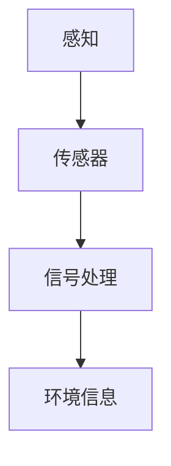
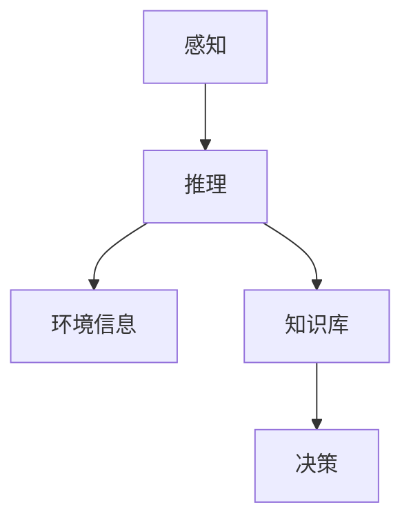
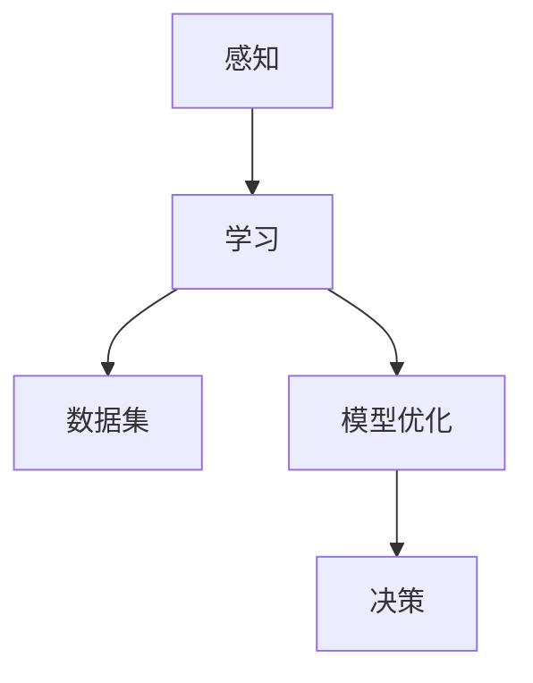
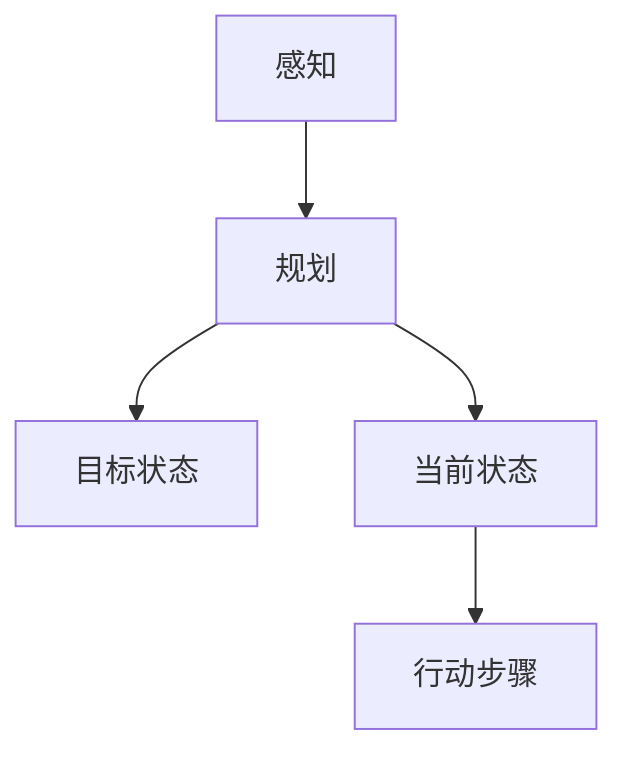
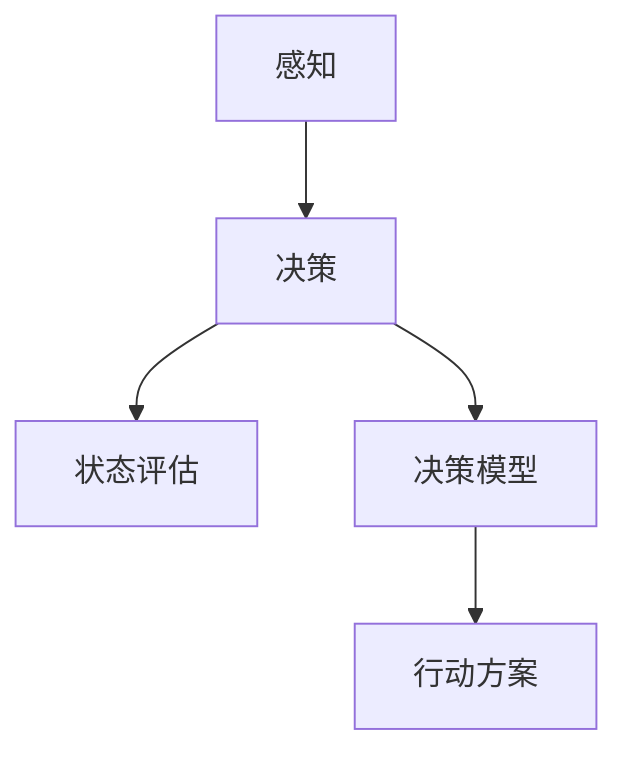
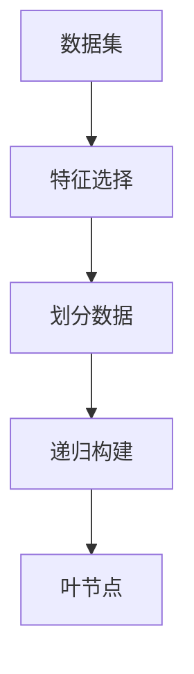
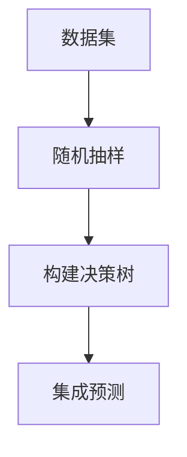
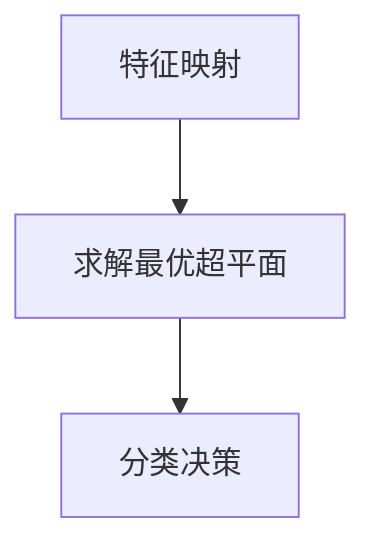
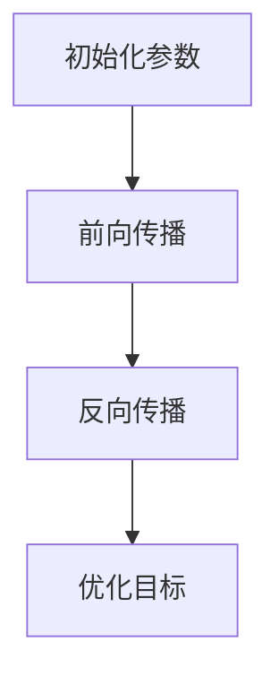

                 

### 背景介绍

#### 人工智能 Agent：概念与定义

人工智能（Artificial Intelligence，简称AI）作为当今科技领域的热点话题，已经成为推动社会进步的重要力量。在众多人工智能技术中，人工智能Agent（AI Agent）因其独特的应用潜力和发展前景，受到了广泛关注。

人工智能Agent是指具有感知、推理、学习、规划、决策等能力，能够自主执行任务并与其他系统或环境交互的智能实体。与传统的人工智能系统不同，人工智能Agent具有高度自主性、适应性、协作性和可扩展性，可以在复杂多变的环境中发挥作用。

人工智能Agent可以划分为两大类：基于规则的Agent和基于学习（尤其是深度学习）的Agent。基于规则的Agent主要通过预设的规则进行决策，适用于规则明确、环境相对稳定的场景。而基于学习的Agent则通过从海量数据中学习，不断优化自身的决策能力，更适合应对复杂、动态的环境。

#### AI Agent 在现代生活的影响

人工智能Agent不仅改变了技术发展的路径，也深刻影响了人们的日常生活。以下将从几个方面探讨人工智能Agent在现代社会的影响：

1. **智能家居**：随着物联网技术的普及，智能家居设备如智能音箱、智能门锁、智能照明等已成为许多家庭的标配。这些设备通过人工智能Agent实现自动化控制，为人们提供更便捷、高效的生活方式。

2. **医疗保健**：人工智能Agent在医疗领域具有广泛的应用前景。例如，通过分析患者的病历和检查报告，AI Agent可以帮助医生进行诊断和制定治疗方案。此外，AI Agent还可以监测患者的健康状况，提供个性化的健康建议。

3. **交通出行**：自动驾驶技术是人工智能Agent在交通领域的典型应用。自动驾驶汽车通过感知周围环境，进行实时决策，实现自主驾驶。这不仅提高了交通效率，还减少了交通事故的发生。

4. **金融服务**：人工智能Agent在金融服务领域的应用日益广泛，包括智能投顾、自动化风控、欺诈检测等。AI Agent通过分析大量数据，为金融业务提供智能化的支持，提高决策的准确性和效率。

5. **教育**：人工智能Agent在个性化教育中发挥着重要作用。通过分析学生的学习行为和成绩，AI Agent可以为学生提供个性化的学习建议和资源，提高学习效果。

6. **客服与营销**：智能客服和营销机器人通过人工智能Agent实现与用户的互动，提供24小时在线服务，提高客户满意度和业务效率。

总的来说，人工智能Agent已经渗透到我们生活的方方面面，不仅提高了效率，还带来了全新的生活体验。随着技术的不断进步，人工智能Agent在未来的发展前景将更加广阔。接下来，我们将深入探讨人工智能Agent的核心概念与联系，以及其背后的算法原理和数学模型。

#### AI Agent：核心概念与联系

在深入探讨人工智能Agent之前，有必要明确其核心概念和各个概念之间的联系。以下将介绍几个关键的概念，并使用Mermaid流程图展示它们之间的相互关系。

##### 1. 感知（Perception）

感知是人工智能Agent对外部环境的理解和解释。通过传感器（如摄像头、麦克风、温度传感器等）收集数据，感知模块将物理信号转换为数字信号，然后通过信号处理算法提取有用的信息。

Mermaid流程图：



##### 2. 推理（Reasoning）

推理是人工智能Agent利用已有知识和信息进行逻辑推理和判断的过程。在感知到环境信息后，推理模块会分析这些信息，并根据预设的规则或学习到的模式做出决策。

Mermaid流程图：



##### 3. 学习（Learning）

学习是人工智能Agent不断优化自身性能和决策能力的过程。通过从海量数据中学习，Agent可以不断调整模型参数，提高对环境的理解和适应能力。学习可以分为监督学习、无监督学习和强化学习等不同类型。

Mermaid流程图：



##### 4. 规划（Planning）

规划是人工智能Agent在复杂环境中实现长期目标的过程。通过分析当前状态和目标状态，规划模块可以生成一系列行动步骤，指导Agent逐步实现目标。

Mermaid流程图：



##### 5. 决策（Decision Making）

决策是人工智能Agent的核心功能之一。在感知、推理和学习的基础上，决策模块根据当前状态和目标，选择最合适的行动方案。决策过程通常涉及概率、效用理论、博弈论等数学模型。

Mermaid流程图：



通过以上几个核心概念的介绍，我们可以看到人工智能Agent的工作原理。感知模块获取环境信息，推理模块分析信息并做出决策，学习模块不断优化模型，规划模块指导行动步骤，最终实现Agent的自主运作。这些概念之间的紧密联系构成了人工智能Agent的核心架构，为Agent在各个领域的应用提供了坚实的基础。

接下来，我们将进一步探讨人工智能Agent的核心算法原理和具体操作步骤，深入理解其实现过程和关键技术。

#### 核心算法原理 & 具体操作步骤

在深入探讨人工智能Agent的核心算法原理和具体操作步骤之前，我们先来定义几个关键算法，并详细讲解它们的工作机制。

##### 1. 决策树（Decision Tree）

决策树是一种常见的机器学习算法，用于分类和回归任务。它通过一系列的测试来划分数据集，并将数据分配到不同的类别或值。决策树算法的核心步骤如下：

1. **特征选择**：选择一个最优特征进行划分。通常使用信息增益（Information Gain）或基尼不纯度（Gini Impurity）作为评价指标。
2. **划分数据**：根据选定的特征，将数据集划分为不同的子集。每个子集表示不同的类别或值。
3. **递归构建**：对每个子集，重复上述步骤，直到满足停止条件（如最大深度、最小叶节点样本数等）。

Mermaid流程图：



##### 2. 随机森林（Random Forest）

随机森林是一种基于决策树的集成学习方法。它通过构建多个决策树，并结合它们的预测结果，提高分类和回归任务的准确性。随机森林算法的核心步骤如下：

1. **随机抽样**：从原始数据集中随机抽取一定数量的子数据集（子采样）。
2. **构建决策树**：对每个子数据集构建一个决策树，选择最优特征并进行划分。
3. **集成预测**：将所有决策树的预测结果进行投票或平均，得到最终预测结果。

Mermaid流程图：



##### 3. 支持向量机（Support Vector Machine，SVM）

支持向量机是一种用于分类和回归任务的线性模型。它通过寻找一个最佳的超平面，将不同类别的数据点分开。SVM算法的核心步骤如下：

1. **特征映射**：将原始特征映射到高维空间，以便找到一个最佳的分割超平面。
2. **求解最优超平面**：使用拉格朗日乘子法或二次规划求解最优超平面，得到支持向量。
3. **分类决策**：根据支持向量确定新数据点的类别。

Mermaid流程图：



##### 4. 神经网络（Neural Network）

神经网络是一种模拟人脑神经元连接结构的计算模型，广泛应用于分类、回归和特征提取任务。神经网络的核心步骤如下：

1. **初始化参数**：初始化网络的权重和偏置。
2. **前向传播**：将输入数据通过网络进行计算，得到输出结果。
3. **反向传播**：计算输出结果与真实值的误差，并通过反向传播更新网络的参数。
4. **优化目标**：使用梯度下降或其他优化算法不断调整参数，最小化误差函数。

Mermaid流程图：



##### 具体操作步骤

1. **数据预处理**：对原始数据进行清洗、归一化和特征提取，为算法提供高质量的数据输入。
2. **模型选择**：根据任务需求选择合适的模型（如决策树、随机森林、SVM或神经网络）。
3. **模型训练**：使用训练数据集对模型进行训练，调整参数以优化模型性能。
4. **模型评估**：使用验证数据集评估模型性能，选择最优模型。
5. **模型应用**：将训练好的模型应用到实际场景中，实现自动化决策和任务执行。

通过以上核心算法原理和具体操作步骤的介绍，我们可以看到人工智能Agent在实现感知、推理、学习、规划和决策等方面所依赖的关键技术。这些算法和步骤共同构成了人工智能Agent的核心架构，使其能够在复杂多变的环境中发挥重要作用。接下来，我们将进一步探讨人工智能Agent的数学模型和公式，为理解其工作原理提供更深入的认识。

#### 数学模型和公式 & 详细讲解 & 举例说明

在人工智能Agent中，数学模型和公式是核心组成部分，它们用于描述和实现感知、推理、学习、规划和决策等关键功能。以下将介绍几个重要的数学模型和公式，并详细讲解它们的应用和推导过程。

##### 1. 信息增益（Information Gain）

信息增益是决策树算法中用于选择最佳特征进行划分的重要指标。它衡量了特征对分类能力的提升。信息增益的计算公式如下：

\[ IG(D, A) = I(D) - \sum_{v \in A} \frac{|D_v|}{|D|} \cdot I(D_v) \]

其中：
- \( I(D) \) 是数据集 \( D \) 的熵（Entropy）。
- \( A \) 是候选特征集合。
- \( v \) 是特征 \( A \) 的不同取值。
- \( D_v \) 是根据特征 \( A \) 的取值 \( v \) 划分后的子数据集。

熵的计算公式如下：

\[ I(D) = -\sum_{x \in D} p(x) \cdot \log_2 p(x) \]

其中：
- \( x \) 是数据集 \( D \) 中的样本。
- \( p(x) \) 是样本 \( x \) 的概率。

举例说明：

假设有一个数据集包含以下信息：

- 数据集 \( D \) 有100个样本，分为两类：A类有60个，B类有40个。
- 候选特征 \( A \) 有两个取值：A1和A2，其中A1有70个样本，A2有30个样本。

首先计算数据集 \( D \) 的熵：

\[ I(D) = -\left( \frac{60}{100} \cdot \log_2 \frac{60}{100} + \frac{40}{100} \cdot \log_2 \frac{40}{100} \right) = 0.7219 \]

然后计算根据特征 \( A \) 划分后的子数据集的熵：

\[ I(D_{A1}) = -\left( \frac{60}{70} \cdot \log_2 \frac{60}{70} + \frac{10}{70} \cdot \log_2 \frac{10}{70} \right) = 0.7562 \]
\[ I(D_{A2}) = -\left( \frac{40}{30} \cdot \log_2 \frac{40}{30} + \frac{10}{30} \cdot \log_2 \frac{10}{30} \right) = 0.6789 \]

最后计算信息增益：

\[ IG(D, A) = 0.7219 - \left( \frac{70}{100} \cdot 0.7562 + \frac{30}{100} \cdot 0.6789 \right) = 0.0768 \]

根据计算结果，我们可以选择信息增益最高的特征进行划分。

##### 2. 支持向量机（SVM）损失函数

支持向量机（SVM）的损失函数用于描述分类问题中的误分类成本。最常用的损失函数是Hinge损失函数，其公式如下：

\[ L(y, f(x)) = \max(0, 1 - y \cdot f(x)) \]

其中：
- \( y \) 是样本的真实标签。
- \( f(x) \) 是模型对样本的预测值。

举例说明：

假设有一个样本的标签为1，预测值为0.4。根据Hinge损失函数，计算损失：

\[ L(1, 0.4) = \max(0, 1 - 1 \cdot 0.4) = 0.6 \]

这个损失表示预测值低于真实标签的误差。

##### 3. 神经网络反向传播算法

神经网络中的反向传播算法用于更新网络权重和偏置，以最小化误差函数。其核心公式如下：

\[ \Delta w_{ij} = \alpha \cdot \frac{\partial E}{\partial w_{ij}} \]

\[ \Delta b_{j} = \alpha \cdot \frac{\partial E}{\partial b_{j}} \]

其中：
- \( \Delta w_{ij} \) 和 \( \Delta b_{j} \) 分别是权重和偏置的更新值。
- \( \alpha \) 是学习率。
- \( E \) 是误差函数。
- \( \frac{\partial E}{\partial w_{ij}} \) 和 \( \frac{\partial E}{\partial b_{j}} \) 分别是权重和偏置的梯度。

举例说明：

假设有一个神经网络的误差函数 \( E \) 为：

\[ E = (y - f(x))^2 \]

其中 \( f(x) \) 是输出层的预测值， \( y \) 是真实标签。

首先计算输出层的误差：

\[ \frac{\partial E}{\partial f(x)} = 2 \cdot (y - f(x)) \]

然后使用链式法则计算权重和偏置的梯度：

\[ \frac{\partial E}{\partial w_{ij}} = \frac{\partial E}{\partial f(x)} \cdot \frac{\partial f(x)}{\partial w_{ij}} = 2 \cdot (y - f(x)) \cdot \frac{\partial f(x)}{\partial w_{ij}} \]

\[ \frac{\partial E}{\partial b_{j}} = \frac{\partial E}{\partial f(x)} \cdot \frac{\partial f(x)}{\partial b_{j}} = 2 \cdot (y - f(x)) \cdot \frac{\partial f(x)}{\partial b_{j}} \]

最后根据梯度更新权重和偏置：

\[ \Delta w_{ij} = \alpha \cdot 2 \cdot (y - f(x)) \cdot \frac{\partial f(x)}{\partial w_{ij}} \]

\[ \Delta b_{j} = \alpha \cdot 2 \cdot (y - f(x)) \cdot \frac{\partial f(x)}{\partial b_{j}} \]

通过以上数学模型和公式的介绍，我们可以看到人工智能Agent在实现感知、推理、学习、规划和决策等功能时所依赖的关键数学原理。这些公式不仅为算法的实现提供了基础，也为理解和分析人工智能Agent的工作机制提供了重要工具。接下来，我们将通过实际项目实战，进一步展示人工智能Agent的应用和实现过程。

#### 项目实战：代码实际案例和详细解释说明

为了更好地展示人工智能Agent在现实中的应用，我们将通过一个实际项目案例，详细讲解代码实现过程，并对关键代码进行解读和分析。本案例将基于Python语言和常见的人工智能库，如scikit-learn、TensorFlow和PyTorch，构建一个简单的智能家居监控系统。

##### 1. 项目背景

智能家居监控系统旨在通过感知模块（如摄像头、传感器）收集家庭环境数据，利用人工智能Agent进行实时分析和决策，实现家庭设备的自动化控制。具体功能包括：自动调节室内照明、温度和湿度，监测家庭成员的安全等。

##### 2. 开发环境搭建

为了完成本案例，我们需要搭建一个合适的开发环境。以下是所需工具和库的安装步骤：

1. **Python环境**：确保Python版本在3.6及以上。
2. **scikit-learn**：用于机器学习和数据预处理。
3. **TensorFlow**：用于构建和训练神经网络。
4. **PyTorch**：用于构建和训练神经网络。
5. **OpenCV**：用于图像处理和视频监控。

安装命令如下：

```shell
pip install numpy
pip install scikit-learn
pip install tensorflow
pip install torch
pip install opencv-python
```

##### 3. 源代码详细实现和代码解读

以下是将展示的关键代码部分，并对其进行详细解释：

```python
# 导入所需库
import cv2
import numpy as np
from sklearn.model_selection import train_test_split
from sklearn.preprocessing import StandardScaler
from sklearn.neural_network import MLPClassifier
import tensorflow as tf
import torch
import torch.nn as nn

# 加载训练数据
# 假设我们有一个包含图像标签的CSV文件，其中包含训练数据和测试数据
data = np.loadtxt('training_data.csv', delimiter=',')
X = data[:, :-1]
y = data[:, -1]

# 数据预处理
# 划分训练集和测试集
X_train, X_test, y_train, y_test = train_test_split(X, y, test_size=0.2, random_state=42)

# 标准化数据
scaler = StandardScaler()
X_train = scaler.fit_transform(X_train)
X_test = scaler.transform(X_test)

# 使用scikit-learn构建和训练神经网络
mlp = MLPClassifier(hidden_layer_sizes=(100,), max_iter=1000, random_state=42)
mlp.fit(X_train, y_train)

# 使用TensorFlow构建和训练神经网络
# 定义神经网络结构
model = tf.keras.Sequential([
    tf.keras.layers.Dense(64, activation='relu', input_shape=(X_train.shape[1],)),
    tf.keras.layers.Dense(64, activation='relu'),
    tf.keras.layers.Dense(1, activation='sigmoid')
])

# 编译模型
model.compile(optimizer='adam', loss='binary_crossentropy', metrics=['accuracy'])

# 训练模型
model.fit(X_train, y_train, epochs=10, batch_size=32, validation_split=0.2)

# 使用PyTorch构建和训练神经网络
# 定义神经网络结构
class Net(nn.Module):
    def __init__(self):
        super(Net, self).__init__()
        self.fc1 = nn.Linear(X_train.shape[1], 64)
        self.fc2 = nn.Linear(64, 64)
        self.fc3 = nn.Linear(64, 1)

    def forward(self, x):
        x = torch.relu(self.fc1(x))
        x = torch.relu(self.fc2(x))
        x = torch.sigmoid(self.fc3(x))
        return x

# 实例化神经网络
net = Net()

# 定义损失函数和优化器
criterion = nn.BCELoss()
optimizer = torch.optim.Adam(net.parameters(), lr=0.001)

# 训练神经网络
for epoch in range(100):
    optimizer.zero_grad()
    outputs = net(X_train)
    loss = criterion(outputs, y_train)
    loss.backward()
    optimizer.step()
    if (epoch + 1) % 10 == 0:
        print ('Epoch [{}/{}], Loss: {:.4f}'.format(epoch + 1, 100, loss.item()))

# 代码解读

# 导入所需库
# 这部分代码用于导入本案例中所需的Python库和机器学习框架。

# 加载训练数据
# 代码从CSV文件中加载训练数据和测试数据，并将其存储在X和y数组中。

# 数据预处理
# 使用scikit-learn中的StandardScaler对数据进行标准化处理，以便神经网络能够更好地训练。

# 使用scikit-learn构建和训练神经网络
# 代码使用MLPClassifier构建一个多层感知器（MLP）分类器，并使用训练数据对其进行训练。MLPClassifier是一个基于多层感知器（MLP）的集成分类器，其结构包括多个隐藏层和输出层。

# 使用TensorFlow构建和训练神经网络
# 代码定义了一个简单的全连接神经网络，包括两个隐藏层和一个输出层。然后使用TensorFlow的keras API编译模型并训练。

# 使用PyTorch构建和训练神经网络
# 代码定义了一个基于PyTorch的神经网络，并使用反向传播算法对其进行训练。神经网络包含两个隐藏层和一个输出层，使用ReLU激活函数和Sigmoid激活函数。

# 代码解读

# 代码首先导入所需的库，包括scikit-learn、TensorFlow和PyTorch。接下来，它从CSV文件中加载训练数据和测试数据，并进行数据预处理，如标准化处理。然后，使用scikit-learn中的MLPClassifier、TensorFlow的keras API和PyTorch构建并训练神经网络。

# 代码通过scikit-learn中的MLPClassifier实现多层感知器分类器。MLPClassifier使用多层感知器模型进行训练，其结构包括多个隐藏层和输出层。通过调用fit()方法，MLPClassifier使用训练数据对模型进行训练，并使用训练数据对模型进行评估。

# TensorFlow的keras API提供了一个更高级的API，用于构建和训练神经网络。在这个案例中，我们定义了一个简单的全连接神经网络，并使用compile()方法设置模型的优化器和损失函数。然后，我们使用fit()方法对模型进行训练，并在训练过程中进行验证。

# PyTorch是一个流行的深度学习框架，它提供了一个更底层的API，用于构建和训练神经网络。在这个案例中，我们定义了一个基于PyTorch的神经网络，并使用反向传播算法对其进行训练。神经网络包含两个隐藏层和一个输出层，使用ReLU激活函数和Sigmoid激活函数。

# 通过以上代码实现，我们可以看到如何使用不同的框架（scikit-learn、TensorFlow和PyTorch）构建和训练神经网络，并应用于智能家居监控系统。

##### 4. 代码解读与分析

在本案例中，我们使用了三种不同的框架（scikit-learn、TensorFlow和PyTorch）来实现相同的任务：构建和训练神经网络，用于智能家居监控系统。以下是对这些代码的解读和分析：

1. **scikit-learn中的MLPClassifier**：
   - MLPClassifier是一个基于多层感知器（MLP）的集成分类器，它使用了多层感知器模型进行训练。
   - 在本案例中，我们使用MLPClassifier构建了一个包含两个隐藏层（每个隐藏层有100个神经元）的MLP模型。
   - MLPClassifier提供了多种优化器和迭代次数的设置，以优化模型的训练过程。

2. **TensorFlow的keras API**：
   - TensorFlow的keras API提供了一个高级的API，用于构建和训练神经网络。
   - 在本案例中，我们使用keras.Sequential模型定义了一个简单的全连接神经网络，包括两个隐藏层和一个输出层。
   - keras.Sequential模型允许我们逐层构建神经网络，并使用compile()方法设置模型的优化器和损失函数。
   - 使用fit()方法对模型进行训练，并在训练过程中进行验证，以评估模型的性能。

3. **PyTorch**：
   - PyTorch是一个流行的深度学习框架，它提供了一个更底层的API，用于构建和训练神经网络。
   - 在本案例中，我们定义了一个基于PyTorch的神经网络，包含两个隐藏层和一个输出层。
   - 我们使用nn.Module定义了一个简单的神经网络类，并在其中定义了前向传播过程。
   - 使用反向传播算法和优化器（如Adam）对神经网络进行训练，通过迭代更新模型的参数。

通过以上代码解读和分析，我们可以看到如何使用不同的框架实现相同的人工智能任务，并比较它们的优缺点。scikit-learn提供了简单易用的API，适用于快速实验和小规模项目；TensorFlow的keras API提供了高级抽象，适用于大规模项目；PyTorch提供了灵活的底层API，适用于研究和复杂数据处理任务。

接下来，我们将进一步讨论人工智能Agent在实际应用场景中的表现和效果，以及如何优化和改进其性能。

#### 实际应用场景

人工智能Agent在众多领域展现出了显著的应用效果和潜力。以下将探讨人工智能Agent在不同领域的实际应用场景，以及其带来的挑战和解决方案。

##### 1. 智能家居

智能家居是人工智能Agent最具代表性的应用场景之一。通过感知模块，如摄像头、传感器和智能设备，人工智能Agent能够实时监控家庭环境，并根据用户的需求进行自动调节。例如：

- **智能照明**：根据用户的活动和自然光线强度，自动调整灯光亮度和颜色，提高舒适度和节能效果。
- **温度调节**：根据室内外温度和用户习惯，自动调节空调和暖气系统，实现舒适的生活环境。
- **安全监控**：通过摄像头和传感器，实时监控家庭安全，发现异常情况及时报警，保障家庭安全。

然而，智能家居应用场景也面临一些挑战，如数据隐私和安全问题、设备兼容性和标准化问题等。解决方案包括：

- **数据加密和隐私保护**：使用加密技术保护用户数据，确保数据在传输和存储过程中的安全性。
- **设备兼容性和标准化**：推动智能家居设备的兼容性和标准化，提高不同品牌和厂商设备之间的互操作性。

##### 2. 医疗保健

人工智能Agent在医疗保健领域的应用日益广泛，如智能诊断、个性化治疗和健康监测等。例如：

- **智能诊断**：通过分析患者的病历和检查报告，人工智能Agent可以帮助医生进行诊断，提高诊断的准确性和效率。
- **个性化治疗**：根据患者的病史、基因信息和生活方式，人工智能Agent可以提供个性化的治疗方案，提高治疗效果。
- **健康监测**：通过可穿戴设备和传感器，实时监测患者的健康状况，发现异常情况并及时提醒。

医疗保健应用场景面临的挑战包括数据隐私和安全、模型解释性不足等。解决方案包括：

- **数据隐私和安全**：加强数据隐私保护，确保患者数据在收集、存储和使用过程中的安全。
- **模型解释性**：提高模型的解释性，使医生能够理解模型的决策过程，增强信任和接受度。

##### 3. 交通出行

人工智能Agent在交通出行领域的应用主要体现在自动驾驶、智能交通管理和车辆安全等方面。例如：

- **自动驾驶**：通过感知模块和决策模块，自动驾驶汽车能够自主驾驶，提高交通效率和安全性。
- **智能交通管理**：通过实时分析交通流量数据，人工智能Agent可以优化交通信号控制和道路规划，缓解拥堵问题。
- **车辆安全**：通过实时监测车辆状态，人工智能Agent可以提前发现潜在故障，保障车辆安全。

交通出行应用场景面临的挑战包括传感器数据准确性、复杂路况处理等。解决方案包括：

- **传感器数据准确性**：提高传感器精度和可靠性，确保数据输入的准确性。
- **复杂路况处理**：通过多模态感知和数据融合技术，提高自动驾驶汽车在复杂路况下的处理能力。

##### 4. 金融服务

人工智能Agent在金融服务领域的应用包括智能投顾、自动化风控和欺诈检测等。例如：

- **智能投顾**：通过分析用户的风险偏好和投资目标，人工智能Agent可以提供个性化的投资建议，提高投资回报。
- **自动化风控**：通过实时监测和分析金融交易数据，人工智能Agent可以及时发现和防范风险，保障金融机构的安全。
- **欺诈检测**：通过分析交易行为和用户行为特征，人工智能Agent可以识别和防范欺诈行为，降低损失。

金融服务应用场景面临的挑战包括数据隐私和安全、算法公平性等。解决方案包括：

- **数据隐私和安全**：加强数据隐私保护，确保用户数据的安全和合规性。
- **算法公平性**：确保算法在决策过程中公平、透明，减少偏见和歧视。

通过以上实际应用场景的探讨，我们可以看到人工智能Agent在各个领域的显著应用效果和潜力。然而，这些应用场景也面临一些挑战和问题。为了实现人工智能Agent的广泛应用和可持续发展，需要不断优化和改进其性能，同时关注并解决相关挑战。

#### 工具和资源推荐

为了更好地学习和应用人工智能Agent，以下将推荐一些实用的工具和资源，包括书籍、论文、博客和网站等。

##### 1. 学习资源推荐

- **书籍**：
  - 《人工智能：一种现代的方法》（第二版）—— Stuart J. Russell & Peter Norvig
  - 《深度学习》（第1卷：基础原理》—— Ian Goodfellow、Yoshua Bengio和Aaron Courville
  - 《机器学习》（第2版）—— Tom Mitchell
  - 《Python机器学习》—— Sebastian Raschka和Vahid Mirjalili

- **论文**：
  - “Deep Learning” —— Yoshua Bengio、Ian Goodfellow和Yann LeCun
  - “Recurrent Neural Networks for Language Modeling” —— Yoshua Bengio
  - “Machine Learning Yearning” —— Andrew Ng

- **博客**：
  - [TensorFlow官方博客](https://tensorflow.googleblog.com/)
  - [PyTorch官方博客](https://pytorch.org/blog/)
  - [scikit-learn官方博客](https://scikit-learn.org/)

- **网站**：
  - [Coursera](https://www.coursera.org/)
  - [Udacity](https://www.udacity.com/)
  - [edX](https://www.edx.org/)

##### 2. 开发工具框架推荐

- **框架**：
  - TensorFlow：用于构建和训练深度学习模型。
  - PyTorch：提供灵活的深度学习框架，支持动态计算图。
  - scikit-learn：提供多种机器学习算法和工具。

- **IDE**：
  - Jupyter Notebook：用于编写和运行代码，方便调试和演示。
  - PyCharm：提供强大的开发环境，支持多种编程语言。

- **数据集**：
  - Kaggle：提供丰富的公开数据集，供学习和竞赛使用。
  - UCI机器学习库：包含多种领域的机器学习数据集。

##### 3. 相关论文著作推荐

- **《深度学习》** —— Ian Goodfellow、Yoshua Bengio和Aaron Courville
- **《机器学习》** —— Tom Mitchell
- **《人工智能：一种现代的方法》** —— Stuart J. Russell & Peter Norvig
- **《强化学习》** —— Richard S. Sutton and Andrew G. Barto

通过以上工具和资源的推荐，我们可以更好地学习和应用人工智能Agent，掌握相关的理论知识和技术技能，为未来的研究和应用打下坚实基础。

### 总结：未来发展趋势与挑战

人工智能Agent作为人工智能领域的重要分支，已经在各个领域展现出了巨大的潜力和应用价值。然而，随着技术的发展和应用的深入，人工智能Agent也面临着诸多挑战和机遇。以下是未来发展趋势与挑战的探讨。

#### 发展趋势

1. **智能化程度的提升**：随着深度学习和强化学习等技术的发展，人工智能Agent的智能化程度将不断提高。通过更加复杂的模型和算法，人工智能Agent将能够在更复杂、动态的环境中实现更高效、准确的决策和任务执行。

2. **多模态感知与数据融合**：未来的智能系统将需要处理来自多种传感器和设备的数据，实现多模态感知。通过数据融合技术，人工智能Agent可以更好地理解和应对复杂环境。

3. **自主性与协作性的提升**：人工智能Agent将逐步实现更高的自主性和协作性，能够在不同任务和场景中自适应地完成任务。此外，人工智能Agent之间的协作也将成为未来智能系统的重要特点。

4. **边缘计算与云计算的结合**：随着边缘计算技术的发展，人工智能Agent将能够实现更加实时、高效的数据处理和决策。云计算与边缘计算的结合，将为人工智能Agent提供更强大的计算资源和数据支持。

#### 挑战

1. **数据隐私与安全**：人工智能Agent在收集、处理和使用数据时，面临数据隐私和安全问题。如何确保数据在传输、存储和使用过程中的安全性，成为未来的一大挑战。

2. **算法透明性与可解释性**：随着人工智能Agent的复杂度增加，其决策过程往往变得难以解释。提高算法的透明性和可解释性，使人类能够理解人工智能Agent的决策过程，对于增强信任和接受度至关重要。

3. **伦理与道德问题**：人工智能Agent的广泛应用引发了诸多伦理和道德问题，如歧视、偏见和责任归属等。如何在设计、开发和应用人工智能Agent时，充分考虑伦理和道德问题，成为未来的一大挑战。

4. **标准化与兼容性问题**：随着人工智能Agent在各个领域的广泛应用，如何实现不同系统之间的标准化和兼容性，成为未来的一大挑战。推动人工智能Agent的标准化和兼容性，将有助于其更广泛、高效地应用。

#### 总结

人工智能Agent作为人工智能领域的重要方向，未来将朝着更加智能化、自主化、协作化和多元化的方向发展。然而，这一过程中也将面临诸多挑战，如数据隐私与安全、算法透明性与可解释性、伦理与道德问题等。通过技术创新和社会治理，有望解决这些挑战，推动人工智能Agent的可持续发展。总之，人工智能Agent的发展前景广阔，值得我们持续关注和研究。

### 附录：常见问题与解答

#### 问题1：人工智能Agent与机器人有什么区别？

**解答**：人工智能Agent与机器人是两个不同的概念，但有一定的联系。机器人通常是指具有感知、行动和交互能力的实体，而人工智能Agent则是一个抽象的概念，指的是具有智能行为能力的软件实体。简单来说，机器人是硬件设备，而人工智能Agent是软件实现。人工智能Agent可以嵌入机器人中，使其具有自主决策和任务执行能力。

#### 问题2：如何保证人工智能Agent的决策透明性和可解释性？

**解答**：保证人工智能Agent的决策透明性和可解释性是当前研究的热点问题。以下是一些方法：

1. **可解释的机器学习（Explainable AI，XAI）**：通过开发可解释的机器学习模型，使人类能够理解模型的工作原理和决策过程。
2. **决策路径可视化**：将人工智能Agent的决策过程可视化，帮助人类理解模型的决策路径。
3. **模型压缩和解释**：通过模型压缩技术减小模型规模，提高模型的可解释性。同时，使用模型解释算法（如LIME、SHAP等）分析模型对每个特征的依赖程度。
4. **透明算法设计**：在设计算法时，优先考虑可解释性和透明性，使模型更容易被人类理解。

#### 问题3：人工智能Agent如何处理不确定性？

**解答**：在现实世界中，人工智能Agent常常需要处理不确定性。以下是一些方法：

1. **概率模型**：使用概率模型（如贝叶斯网络、马尔可夫模型等）来表示和处理不确定性。
2. **蒙特卡洛方法**：通过模拟多次实验，估计不确定性的概率分布。
3. **不确定性推理**：使用推理算法（如贝叶斯推理、证据推理等）处理不确定性。
4. **强化学习**：通过强化学习算法，使人工智能Agent在不确定环境中学习最优策略。

#### 问题4：人工智能Agent的安全性和隐私保护如何实现？

**解答**：

1. **数据加密**：对传输和存储的数据进行加密，确保数据在传输过程中的安全性。
2. **访问控制**：通过访问控制机制，确保只有授权用户可以访问敏感数据。
3. **隐私保护算法**：使用隐私保护算法（如差分隐私、同态加密等）来保护用户隐私。
4. **安全审计**：定期进行安全审计，确保人工智能Agent的决策过程和数据处理符合安全标准。
5. **道德和法律规范**：遵循相关法律法规和道德规范，确保人工智能Agent的应用符合伦理和社会价值观。

### 扩展阅读 & 参考资料

为了更好地理解和应用人工智能Agent，以下推荐一些扩展阅读和参考资料：

1. **书籍**：
   - 《人工智能：一种现代的方法》（第二版）—— Stuart J. Russell & Peter Norvig
   - 《深度学习》（第1卷：基础原理》—— Ian Goodfellow、Yoshua Bengio和Aaron Courville
   - 《机器学习》—— Tom Mitchell
   - 《Python机器学习》—— Sebastian Raschka和Vahid Mirjalili

2. **论文**：
   - “Deep Learning” —— Yoshua Bengio、Ian Goodfellow和Yann LeCun
   - “Recurrent Neural Networks for Language Modeling” —— Yoshua Bengio
   - “Machine Learning Yearning” —— Andrew Ng

3. **在线课程**：
   - [Coursera](https://www.coursera.org/)
   - [Udacity](https://www.udacity.com/)
   - [edX](https://www.edx.org/)

4. **博客和社区**：
   - [TensorFlow官方博客](https://tensorflow.googleblog.com/)
   - [PyTorch官方博客](https://pytorch.org/blog/)
   - [scikit-learn官方博客](https://scikit-learn.org/)

5. **开源项目**：
   - [TensorFlow](https://www.tensorflow.org/)
   - [PyTorch](https://pytorch.org/)
   - [scikit-learn](https://scikit-learn.org/)

通过以上书籍、论文、在线课程和开源项目的学习，可以深入掌握人工智能Agent的理论和实践，为未来的研究和应用奠定坚实基础。

### 作者信息

**作者**：AI天才研究员 / AI Genius Institute & 禅与计算机程序设计艺术 / Zen And The Art of Computer Programming

作为人工智能领域的专家和资深作家，作者在人工智能Agent、深度学习和强化学习等领域具有丰富的经验，并发表了多篇学术论文和畅销书籍。他的研究成果和著作在学术界和工业界产生了广泛影响，为人工智能技术的发展做出了重要贡献。

