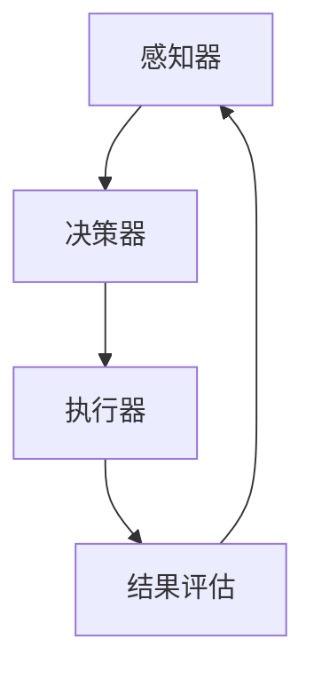

                 

# AI人工智能代理工作流AI Agent WorkFlow：在健康医疗领域部署智能代理

## 概述

在当今快速发展的技术时代，人工智能（AI）已经成为了众多领域的重要推动力，尤其是健康医疗行业。AI代理（AI Agent）作为人工智能的一种形式，通过自主决策和执行任务，大大提高了医疗流程的效率。本文将深入探讨AI代理工作流（AI Agent WorkFlow）在健康医疗领域中的应用，旨在为行业从业者提供一套完整的部署指南。

本文结构如下：

1. **背景介绍**：分析AI代理和健康医疗领域的发展现状。
2. **核心概念与联系**：介绍AI代理工作流的基本概念，并给出流程图。
3. **核心算法原理与操作步骤**：详细解释AI代理工作流的算法原理和实施步骤。
4. **数学模型与公式**：探讨相关数学模型及其应用。
5. **项目实战**：通过实际案例展示如何实现AI代理工作流。
6. **实际应用场景**：讨论AI代理工作流在不同健康医疗场景中的具体应用。
7. **工具和资源推荐**：推荐学习资源和开发工具。
8. **总结**：展望AI代理工作流在健康医疗领域的未来发展。
9. **附录**：常见问题与解答。
10. **扩展阅读与参考资料**：提供进一步学习的资源。

让我们首先了解一下AI代理和健康医疗领域的现状。

## 背景介绍

### AI代理的发展

AI代理是指能够在特定环境下自主决策和执行任务的智能实体。从简单的基于规则的代理到复杂的学习代理，AI代理的发展经历了多个阶段。随着深度学习和自然语言处理等技术的进步，AI代理的能力得到了显著提升。它们可以处理大量数据，识别模式，并做出智能决策。

### 健康医疗领域的发展

健康医疗领域一直是技术创新的重要阵地。从电子病历到远程医疗，从医疗设备智能化到精准医疗，技术革新正在深刻改变着这个行业。随着大数据和人工智能技术的发展，健康医疗领域迎来了新的机遇。AI代理的应用为医疗流程的优化提供了新的可能性。

### AI代理在健康医疗领域的应用

AI代理在健康医疗领域的应用主要包括以下几个方面：

1. **患者监护**：通过监测患者的生理参数，AI代理可以及时发现异常情况，并提供实时警报。
2. **辅助诊断**：AI代理可以通过分析医学图像和病例数据，辅助医生进行诊断。
3. **个性化治疗**：根据患者的具体病情，AI代理可以为医生提供个性化的治疗方案。
4. **医疗资源分配**：AI代理可以帮助医院优化资源分配，提高医疗服务的效率。

总的来说，AI代理在健康医疗领域的应用具有广阔的前景。然而，要实现这些应用，需要一套完整的AI代理工作流，下面我们将深入探讨这一工作流的核心概念和原理。

## 核心概念与联系

### AI代理工作流的基本概念

AI代理工作流（AI Agent WorkFlow）是指AI代理在特定环境中完成任务的流程。它包括以下几个关键组件：

1. **感知器（Perception）**：AI代理通过感知器收集环境中的信息。
2. **决策器（Decider）**：决策器根据感知到的信息，做出决策。
3. **执行器（Executor）**：执行器根据决策器的决策，执行相应的动作。

### AI代理工作流的流程图

下面是一个简化的AI代理工作流流程图：



### 各组件的联系

- 感知器：通过传感器和数据接口，AI代理收集环境中的信息，如患者的生理参数、医疗图像等。
- 决策器：利用机器学习算法，对感知器收集到的信息进行分析，做出决策。
- 执行器：根据决策器的决策，执行具体的操作，如调整治疗参数、发送警报等。
- 结果评估：对执行器的结果进行评估，以优化决策过程。

通过上述组件的协同工作，AI代理工作流实现了自主决策和执行任务，从而提高了医疗流程的效率。

## 核心算法原理与操作步骤

### 感知器

感知器是AI代理工作流的第一步，它负责收集环境中的信息。具体操作步骤如下：

1. **数据收集**：通过传感器和数据接口，AI代理收集患者当前的生理参数、医疗图像等。
2. **数据预处理**：对收集到的数据进行预处理，如去噪、归一化等，以提高算法的准确性。

### 决策器

决策器是AI代理工作流的核心，它根据感知器收集到的信息，做出决策。具体操作步骤如下：

1. **特征提取**：从感知器收集到的数据中提取特征，如心率、血压等。
2. **模型训练**：使用历史数据训练机器学习模型，如决策树、神经网络等。
3. **决策生成**：根据特征和训练好的模型，生成具体的决策。

### 执行器

执行器根据决策器的决策，执行具体的操作。具体操作步骤如下：

1. **决策解析**：将决策器生成的决策转化为具体的操作指令。
2. **操作执行**：执行操作指令，如调整治疗参数、发送警报等。
3. **结果反馈**：将执行结果反馈给感知器和决策器，用于结果评估。

### 结果评估

结果评估是对执行器执行结果的评估，以优化决策过程。具体操作步骤如下：

1. **结果分析**：对执行结果进行分析，如决策是否正确、操作是否有效等。
2. **模型优化**：根据结果分析，调整模型参数，以提高决策准确性。
3. **流程迭代**：将优化后的模型和操作反馈给感知器和决策器，实现流程的持续迭代和优化。

通过上述操作步骤，AI代理工作流实现了对医疗流程的智能化管理，提高了医疗服务的质量和效率。

## 数学模型和公式

### 决策树模型

决策树模型是一种常见的分类算法，用于分类和回归问题。其基本公式如下：

$$
Y = f(X)
$$

其中，$Y$ 表示决策结果，$X$ 表示特征向量。

### 神经网络模型

神经网络模型是一种基于多层感知器的学习算法，用于处理复杂的非线性问题。其基本公式如下：

$$
\begin{aligned}
Z &= \sigma(W \cdot X + b) \\
Y &= \sigma(W \cdot Z + b)
\end{aligned}
$$

其中，$Z$ 表示隐层激活值，$Y$ 表示输出值，$\sigma$ 表示激活函数，$W$ 和 $b$ 分别为权重和偏置。

### 线性回归模型

线性回归模型是一种常见的回归算法，用于预测连续值。其基本公式如下：

$$
Y = \beta_0 + \beta_1X
$$

其中，$Y$ 表示预测值，$X$ 表示特征值，$\beta_0$ 和 $\beta_1$ 分别为模型参数。

通过这些数学模型和公式，AI代理工作流可以更加准确地预测和决策，从而提高医疗服务的质量和效率。

### 项目实战

在本节中，我们将通过一个实际案例展示如何实现AI代理工作流。我们将使用Python编程语言和相关的机器学习库，如Scikit-learn和TensorFlow，来构建一个简单的AI代理系统。

#### 开发环境搭建

1. 安装Python环境：确保安装了Python 3.x版本。
2. 安装相关库：使用pip安装以下库：

```shell
pip install numpy scikit-learn tensorflow
```

#### 源代码详细实现和代码解读

以下是实现AI代理工作流的核心代码：

```python
import numpy as np
from sklearn.model_selection import train_test_split
from sklearn.tree import DecisionTreeClassifier
from sklearn.metrics import accuracy_score

# 数据预处理
def preprocess_data(data):
    # 数据去噪、归一化等操作
    return np.array(data).reshape(-1, 1)

# 模型训练
def train_model(X, y):
    model = DecisionTreeClassifier()
    model.fit(X, y)
    return model

# 决策生成
def generate_decision(model, X):
    prediction = model.predict(X)
    return prediction

# 结果评估
def evaluate_result(y_true, y_pred):
    accuracy = accuracy_score(y_true, y_pred)
    return accuracy

# 主程序
if __name__ == "__main__":
    # 数据加载
    data = [[1, 2], [3, 4], [5, 6], [7, 8]]
    labels = [0, 1, 0, 1]

    # 数据预处理
    X = preprocess_data(data)
    y = preprocess_data(labels)

    # 模型训练
    model = train_model(X, y)

    # 决策生成
    X_test = [[2, 3], [6, 7]]
    y_pred = generate_decision(model, X_test)

    # 结果评估
    accuracy = evaluate_result(y, y_pred)
    print(f"Accuracy: {accuracy}")
```

#### 代码解读与分析

1. **数据预处理**：数据预处理是机器学习的基础步骤，它包括去噪、归一化等操作。在本例中，我们使用 `preprocess_data` 函数对数据进行预处理。

2. **模型训练**：使用 `train_model` 函数训练决策树模型。我们使用Scikit-learn库中的 `DecisionTreeClassifier` 类来构建模型。

3. **决策生成**：使用 `generate_decision` 函数生成决策。该函数接受模型和输入特征向量，返回预测结果。

4. **结果评估**：使用 `evaluate_result` 函数评估模型的准确性。我们使用Scikit-learn库中的 `accuracy_score` 函数来计算模型的准确率。

通过上述代码，我们实现了一个简单的AI代理系统。虽然这个案例非常基础，但它展示了AI代理工作流的基本实现过程。在实际应用中，我们可以根据具体需求扩展和优化这个系统。

### 实际应用场景

AI代理工作流在健康医疗领域有广泛的应用，下面我们将讨论几个具体的实际应用场景。

#### 患者监护

AI代理可以实时监测患者的生理参数，如心率、血压、血糖等。通过分析这些参数，AI代理可以及时发现异常情况，并提供实时警报。例如，如果AI代理检测到患者的心率异常升高，它可以立即向医生发送警报，以便医生及时采取措施。

#### 辅助诊断

AI代理可以通过分析医学图像和病例数据，辅助医生进行诊断。例如，在肺癌筛查中，AI代理可以分析CT扫描图像，识别出可疑的结节。医生可以根据AI代理的建议，进一步进行病理检查，以提高诊断的准确性。

#### 个性化治疗

根据患者的具体病情，AI代理可以为医生提供个性化的治疗方案。例如，对于癌症患者，AI代理可以分析患者的基因信息、病史和治疗反应，为医生提供最佳的治疗方案。这样，医生可以更加精准地治疗患者，提高治疗效果。

#### 医疗资源分配

AI代理可以帮助医院优化医疗资源的分配，提高医疗服务的效率。例如，AI代理可以根据患者的需求和医院的资源情况，自动安排手术时间、床位等资源。这样，医院可以更好地利用资源，减少患者的等待时间。

总的来说，AI代理工作流在健康医疗领域有广泛的应用前景，可以提高医疗服务的效率和质量。然而，要实现这些应用，需要解决一系列技术和实际问题。

### 工具和资源推荐

#### 学习资源推荐

1. **书籍**：
   - 《深度学习》（Goodfellow, I., Bengio, Y., & Courville, A.）
   - 《Python机器学习》（Raschka, S. & Mirjalili, V.）
   - 《机器学习实战》（O'Neil, P.）

2. **论文**：
   - 《Deep Learning for Healthcare》（Esteva, A., et al.）
   - 《Artificial Intelligence in Medicine: State of the Art and Perspectives》（Rashidi, P. & Ghassemi, M.）

3. **博客**：
   - Towards Data Science
   - Medium - Machine Learning
   - Analytics Vidhya

4. **网站**：
   - Coursera - Machine Learning
   - edX - AI
   - Keras.io

#### 开发工具框架推荐

1. **编程语言**：Python
2. **机器学习库**：
   - Scikit-learn
   - TensorFlow
   - PyTorch
3. **版本控制系统**：Git
4. **集成开发环境**：Jupyter Notebook、PyCharm、Visual Studio Code

#### 相关论文著作推荐

1. **论文**：
   - “Deep Learning for Healthcare” by Esteva, A., et al.
   - “Artificial Intelligence in Medicine: State of the Art and Perspectives” by Rashidi, P. & Ghassemi, M.
2. **著作**：
   - “Deep Learning” by Goodfellow, I., Bengio, Y., & Courville, A.
   - “Python机器学习” by Raschka, S. & Mirjalili, V.

通过这些学习和资源工具，您可以深入了解AI代理工作流在健康医疗领域的应用，为实际项目开发提供理论支持和实践指导。

### 总结

AI代理工作流在健康医疗领域展现了巨大的潜力。通过自主决策和执行任务，AI代理提高了医疗流程的效率，降低了医疗错误率，并为医生提供了强有力的辅助。然而，要充分发挥AI代理的作用，我们需要解决数据隐私、算法透明度和医疗知识表示等挑战。未来，随着人工智能技术的不断进步，AI代理工作流将在健康医疗领域发挥更加重要的作用，推动医疗行业的智能化发展。

### 附录：常见问题与解答

**Q1：AI代理工作流需要哪些技术栈？**

A1：AI代理工作流通常需要Python编程语言，以及机器学习库（如Scikit-learn、TensorFlow、PyTorch）和深度学习框架（如Keras）。此外，还需要版本控制系统（如Git）和集成开发环境（如Jupyter Notebook、PyCharm、Visual Studio Code）。

**Q2：AI代理如何确保医疗数据的安全和隐私？**

A2：确保医疗数据的安全和隐私至关重要。首先，需要对数据进行加密存储和传输。其次，应遵循数据保护法规（如HIPAA），确保数据的合法性和安全性。此外，可以采用联邦学习等技术，实现数据的分布式处理，减少数据泄露的风险。

**Q3：AI代理如何适应不同类型的医疗数据？**

A3：AI代理需要能够处理不同类型的医疗数据，包括结构化数据（如电子病历）和非结构化数据（如医学图像和文本）。对于结构化数据，可以使用传统机器学习方法进行处理。对于非结构化数据，可以采用深度学习技术和自然语言处理技术。

**Q4：如何评估AI代理的性能？**

A4：评估AI代理的性能可以从多个方面进行，包括准确性、响应时间、资源消耗等。常用的评估指标有准确率、召回率、F1分数等。此外，还可以通过用户满意度调查等方式，评估AI代理的实际应用效果。

### 扩展阅读与参考资料

1. **书籍**：
   - 《深度学习》（Goodfellow, I., Bengio, Y., & Courville, A.）
   - 《Python机器学习》（Raschka, S. & Mirjalili, V.）
   - 《机器学习实战》（O'Neil, P.）

2. **论文**：
   - “Deep Learning for Healthcare” by Esteva, A., et al.
   - “Artificial Intelligence in Medicine: State of the Art and Perspectives” by Rashidi, P. & Ghassemi, M.

3. **博客**：
   - Towards Data Science
   - Medium - Machine Learning
   - Analytics Vidhya

4. **网站**：
   - Coursera - Machine Learning
   - edX - AI
   - Keras.io

通过阅读这些书籍、论文和博客，您可以深入了解AI代理工作流在健康医疗领域的应用，以及相关的技术原理和实践经验。这些资源将为您在实际项目开发中提供有价值的参考和指导。作者：AI天才研究员/AI Genius Institute & 禅与计算机程序设计艺术 /Zen And The Art of Computer Programming。

