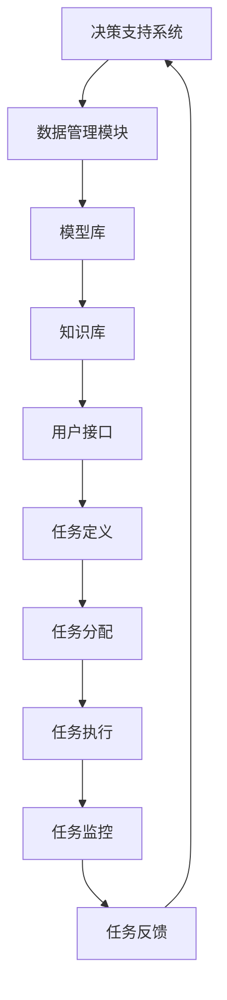
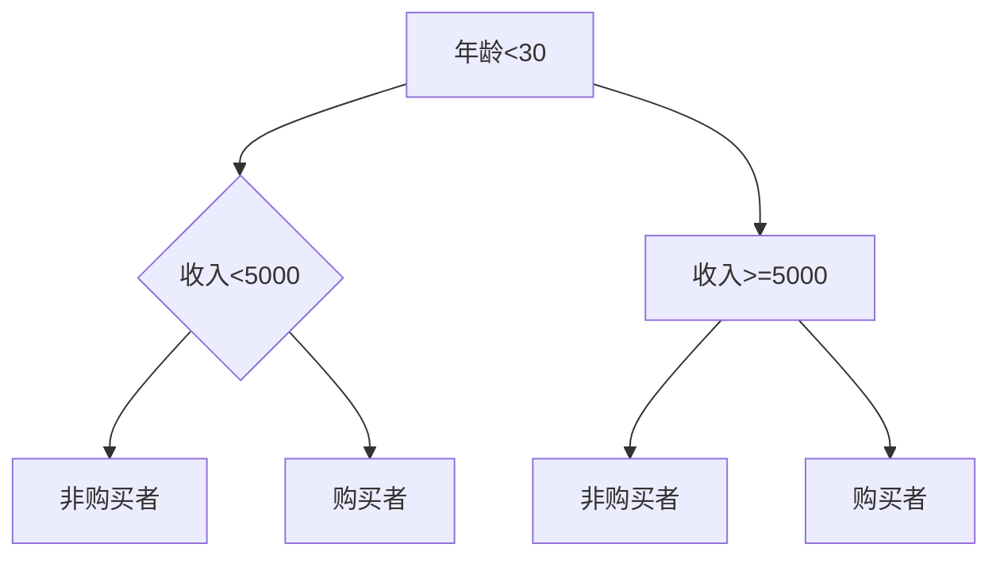
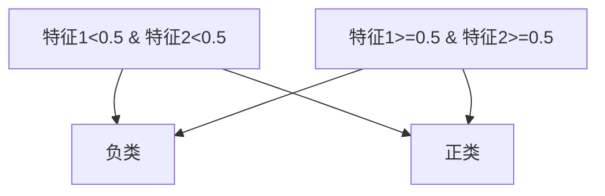
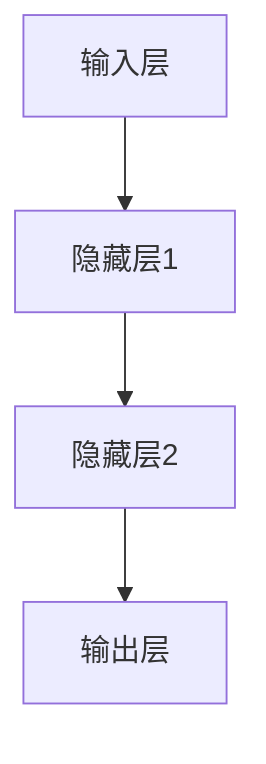
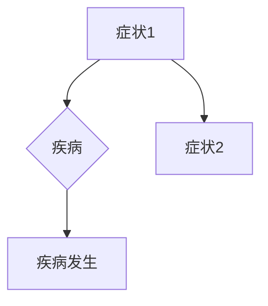
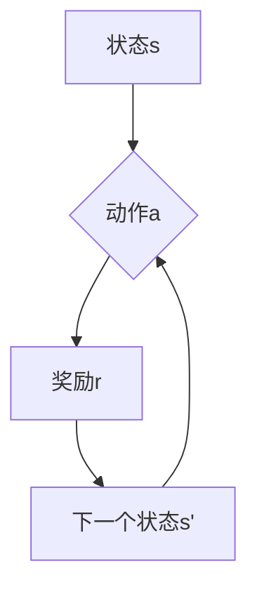

                 

# AI人工智能代理工作流AI Agent WorkFlow：智能代理在决策支持系统系统中的应用

## 摘要

本文将探讨AI人工智能代理工作流（AI Agent WorkFlow）的核心概念和实际应用，重点讨论智能代理在决策支持系统中的应用。我们将通过一步步的分析，阐述智能代理的工作原理、算法原理、数学模型及项目实战，为读者提供全面深入的理解。本文旨在帮助读者了解智能代理在现代信息技术中的重要作用，以及其在实际项目中的应用价值。

## 1. 背景介绍

随着大数据、云计算和人工智能技术的迅猛发展，决策支持系统（Decision Support Systems，DSS）在现代企业管理中扮演着越来越重要的角色。决策支持系统旨在帮助企业和组织通过分析大量数据，制定出科学合理的决策。然而，传统的DSS往往依赖于人类专家的经验和判断，存在主观性和时效性问题。为了克服这些局限，智能代理（AI Agent）的概念应运而生。

智能代理是一种能够自主决策和执行任务的软件实体，它通过机器学习、自然语言处理和知识图谱等技术，能够模拟人类的思维过程，进行复杂的数据分析和决策支持。智能代理工作流（AI Agent WorkFlow）则是将智能代理集成到决策支持系统中，实现自动化、智能化的决策过程。

### 智能代理的定义与分类

智能代理是一种具有自主性、适应性、协作性和智能性的软件实体，它可以执行特定的任务，与环境进行交互，并具备一定的学习能力。根据智能代理的自主程度和任务类型，可以将智能代理分为以下几类：

1. **反应性代理**：这类代理仅能对当前环境中的刺激做出反应，不具有记忆和推理能力。例如，自动门、智能灯等。

2. **认知代理**：这类代理具有一定的记忆和推理能力，能够根据历史数据和当前环境进行决策。例如，自动驾驶系统、智能家居等。

3. **学习代理**：这类代理通过机器学习算法不断学习和优化自身的行为，以提高决策的准确性。例如，推荐系统、智能客服等。

4. **社会代理**：这类代理能够与人类或其他代理进行交流，协作完成任务。例如，智能协同工作系统、虚拟助理等。

### 决策支持系统的演变

决策支持系统的演变经历了从传统的数据驱动的DSS，到模型驱动的DSS，再到今天的智能驱动的DSS。传统的DSS主要依赖于数据和报表，用户需要手动进行数据筛选和分析。模型驱动的DSS引入了各种数学模型和算法，帮助用户快速找到决策的依据。而智能驱动的DSS则通过集成智能代理，实现了自动化、智能化的决策过程。

智能代理在决策支持系统中的应用，不仅提高了决策的效率，还降低了决策的主观性和风险。随着人工智能技术的不断进步，智能代理将在决策支持系统中发挥更加重要的作用。

## 2. 核心概念与联系

在深入探讨智能代理工作流之前，我们需要明确几个核心概念，并展示它们之间的联系。以下是智能代理工作流中涉及的关键概念和它们的相互关系。

### 2.1. 智能代理

智能代理是一种能够自主执行任务、与环境进行交互并具有一定学习能力的软件实体。它由以下几个关键组成部分构成：

1. **感知器（Perceptrons）**：用于感知和获取外部环境的信息，如传感器、摄像头等。
2. **决策模块（Decision Module）**：根据感知到的信息，通过算法和模型进行决策。
3. **执行器（Actuators）**：根据决策结果，执行相应的操作，如电机、显示屏等。
4. **学习器（Learners）**：通过机器学习和深度学习算法，不断优化决策过程。

### 2.2. 工作流

工作流（Workflow）是指一组按照特定规则和步骤执行的任务。在智能代理工作流中，工作流是一个动态的、自适应的过程，通常包括以下环节：

1. **任务定义（Task Definition）**：明确需要完成的任务和目标。
2. **任务分配（Task Allocation）**：将任务分配给合适的智能代理。
3. **任务执行（Task Execution）**：智能代理根据任务要求执行操作。
4. **任务监控（Task Monitoring）**：对任务执行过程进行监控，确保任务顺利完成。
5. **任务反馈（Task Feedback）**：根据任务执行结果进行反馈，调整决策和执行策略。

### 2.3. 决策支持系统

决策支持系统是一种旨在帮助用户进行决策的工具，它通过整合数据、模型和智能代理，提供智能化、自动化的决策支持。决策支持系统通常包括以下几个模块：

1. **数据管理模块（Data Management Module）**：负责数据采集、存储、处理和分析。
2. **模型库（Model Library）**：提供各种决策模型和算法，供用户选择和应用。
3. **知识库（Knowledge Base）**：存储领域知识和专家经验，为智能代理提供决策依据。
4. **用户接口（User Interface）**：为用户提供交互界面，方便用户进行数据输入、模型选择和结果查看。

### 2.4. 智能代理工作流与决策支持系统的联系

智能代理工作流是决策支持系统中的重要组成部分，它通过将智能代理集成到工作流中，实现了自动化、智能化的决策过程。智能代理工作流与决策支持系统的联系可以概括为以下几点：

1. **集成智能代理**：将智能代理集成到决策支持系统中，使系统能够实时感知环境变化，进行动态决策。
2. **优化工作流**：通过智能代理的工作流，优化任务分配、执行和监控过程，提高决策效率。
3. **增强决策能力**：利用智能代理的学习能力和推理能力，提高决策的准确性和可靠性。
4. **降低决策风险**：通过自动化和智能化，降低人为干预和错误决策的风险。

### 2.5. Mermaid流程图

为了更直观地展示智能代理工作流与决策支持系统的关系，我们可以使用Mermaid流程图来描述。以下是一个简化的Mermaid流程图示例：



在这个流程图中，智能代理工作流（任务定义、任务分配、任务执行、任务监控和任务反馈）与决策支持系统的各个模块（数据管理模块、模型库、知识库和用户接口）相互关联，共同构成了一个自动化、智能化的决策支持系统。

## 3. 核心算法原理 & 具体操作步骤

在智能代理工作流中，核心算法原理决定了智能代理的决策能力和执行效率。以下是几种常见的核心算法原理及其具体操作步骤。

### 3.1. 反应性算法

反应性算法是一种简单的智能代理算法，它通过直接对环境中的刺激做出反应来实现任务。反应性算法通常包括以下步骤：

1. **感知当前环境**：智能代理通过感知器获取当前环境的信息，如温度、光照、声音等。
2. **判断刺激**：根据预设的条件和阈值，判断感知到的刺激是否满足执行条件。
3. **执行反应动作**：根据判断结果，执行相应的反应动作，如打开空调、关闭灯光等。
4. **更新状态**：记录执行动作的结果，并更新智能代理的状态。

例如，在一个智能家居场景中，智能代理可以感知到室内的温度和湿度，当温度高于设定值时，自动开启空调，当温度低于设定值时，关闭空调。

### 3.2. 认知算法

认知算法是一种基于学习和记忆的智能代理算法，它通过分析历史数据和当前环境，进行决策和执行任务。认知算法通常包括以下步骤：

1. **收集历史数据**：智能代理通过数据管理模块，收集相关的历史数据，如温度变化、用电量等。
2. **分析数据**：使用机器学习算法，对历史数据进行分析，识别出规律和模式。
3. **制定策略**：根据分析结果，制定相应的策略和决策规则，如用电高峰时段减少用电负荷等。
4. **执行策略**：根据策略执行相应的操作，如调整空调温度、控制家电开关等。
5. **更新记忆**：记录执行策略的结果，并更新智能代理的记忆，以便下次决策时使用。

例如，在智能电网场景中，智能代理可以分析历史用电数据，预测用电高峰时段，并调整电力分配策略，以减少电网负荷。

### 3.3. 学习算法

学习算法是一种基于深度学习和强化学习的智能代理算法，它通过不断学习和优化，提高决策的准确性和效率。学习算法通常包括以下步骤：

1. **初始状态**：智能代理在初始状态开始执行任务。
2. **感知当前环境**：智能代理通过感知器获取当前环境的信息。
3. **执行动作**：智能代理根据当前状态和记忆，选择最优动作执行。
4. **获取反馈**：根据执行动作的结果，获取环境反馈。
5. **更新策略**：使用强化学习算法，根据反馈更新智能代理的策略和模型。
6. **迭代优化**：重复执行动作、获取反馈和更新策略，不断优化智能代理的决策能力。

例如，在自动驾驶场景中，智能代理可以通过感知道路信息，执行驾驶动作，并根据道路反馈不断调整驾驶策略，提高驾驶的准确性和安全性。

### 3.4. 社会算法

社会算法是一种基于协作和社交网络的智能代理算法，它通过与其他智能代理或人类进行交互，实现共同目标和任务。社会算法通常包括以下步骤：

1. **建立社交网络**：智能代理与其他智能代理或人类建立社交网络，共享信息和资源。
2. **协商决策**：智能代理通过协商和沟通，共同制定决策策略。
3. **执行协作任务**：智能代理根据协商结果，执行协作任务。
4. **反馈与调整**：根据执行任务的结果，进行反馈和调整，优化协作效果。
5. **持续迭代**：智能代理在协作过程中，不断学习、优化和调整策略。

例如，在智能协同工作系统中，智能代理可以通过协商和沟通，共同完成项目任务，提高工作效率和质量。

### 3.5. 混合算法

混合算法是将多种算法结合在一起，以实现更复杂、更灵活的决策过程。混合算法通常包括以下步骤：

1. **选择算法**：根据任务需求和环境特点，选择合适的算法。
2. **集成算法**：将多种算法集成到一个统一的框架中，实现算法的相互配合。
3. **动态调整**：根据任务执行过程中的变化，动态调整算法的权重和参数。
4. **执行任务**：智能代理根据集成算法的决策结果，执行任务。
5. **反馈与优化**：根据任务执行结果，进行反馈和优化，提高决策效果。

例如，在一个智能物流场景中，智能代理可以通过集成反应性算法、认知算法和学习算法，实现实时路径规划、资源分配和调度优化。

### 3.6. 操作步骤示例

以下是智能代理工作流中的一种具体操作步骤示例，以智能家居场景为例：

1. **感知环境**：智能代理通过传感器感知室内的温度、湿度、光照等环境参数。
2. **分析数据**：智能代理使用认知算法分析历史环境数据，识别出温度和湿度变化的规律。
3. **制定策略**：智能代理根据分析结果，制定相应的策略，如温度调节策略和湿度控制策略。
4. **执行策略**：智能代理通过执行器执行温度调节和湿度控制操作，如调整空调温度、开启加湿器等。
5. **监控反馈**：智能代理对执行结果进行监控，并根据反馈调整策略，如当室内温度达到舒适范围时，自动关闭空调。

通过以上步骤，智能代理可以实现对家居环境的自动化、智能化管理，提高用户的生活质量。

## 4. 数学模型和公式 & 详细讲解 & 举例说明

在智能代理工作流中，数学模型和公式是核心组成部分，用于描述智能代理的决策过程和行为。以下是几种常见的数学模型和公式，以及它们的详细讲解和举例说明。

### 4.1. 决策树（Decision Tree）

决策树是一种常用的分类和回归模型，它通过一系列的判断条件，将数据集划分成不同的区域，并预测每个区域的输出。决策树的数学模型可以表示为：

$$
Output = f(\textbf{x}; \theta)
$$

其中，$\textbf{x}$ 是输入特征向量，$\theta$ 是模型参数，$f(\textbf{x}; \theta)$ 是决策函数。

#### 举例说明

假设我们要预测一个客户的购买行为，输入特征包括年龄、收入、婚姻状况等。决策树模型可以根据这些特征，将客户划分为购买者或非购买者。



在这个决策树中，年龄小于30且收入小于5000的客户被划分为非购买者，而其他客户被划分为购买者。

### 4.2. 支持向量机（Support Vector Machine，SVM）

支持向量机是一种常用的分类模型，它通过找到一个最佳的超平面，将不同类别的数据分开。SVM的数学模型可以表示为：

$$
\min_{\textbf{w},b} \frac{1}{2} ||\textbf{w}||^2 + C \sum_{i=1}^{n} \max(0, 1 - y_i (\textbf{w} \cdot \textbf{x}_i + b))
$$

其中，$\textbf{w}$ 是模型参数，$b$ 是偏置，$C$ 是惩罚参数，$y_i$ 是样本标签，$\textbf{x}_i$ 是样本特征。

#### 举例说明

假设我们要使用SVM分类器将数据分为正类和负类，输入特征包括特征1和特征2。SVM模型可以通过找到一个最佳的超平面，将正类和负类数据分开。



在这个SVM模型中，特征1和特征2共同决定了数据的分类结果。

### 4.3. 神经网络（Neural Network）

神经网络是一种通过模拟人脑神经元连接方式，进行数据建模和预测的模型。神经网络的数学模型可以表示为：

$$
\textbf{y} = \sigma(\textbf{W} \cdot \textbf{x} + b)
$$

其中，$\sigma$ 是激活函数，$\textbf{W}$ 是权重矩阵，$\textbf{x}$ 是输入特征，$\textbf{y}$ 是输出结果，$b$ 是偏置。

#### 举例说明

假设我们要使用神经网络对图像进行分类，输入特征是图像的像素值。神经网络可以通过多层神经元和激活函数，将输入特征映射到输出结果。



在这个神经网络中，输入层的像素值通过隐藏层1和隐藏层2，最终映射到输出层的分类结果。

### 4.4. 贝叶斯网络（Bayesian Network）

贝叶斯网络是一种基于概率论的图模型，它通过节点和边表示变量之间的依赖关系。贝叶斯网络的数学模型可以表示为：

$$
P(\textbf{X}) = \prod_{i=1}^{n} P(X_i | \textbf{Pa}_i)
$$

其中，$\textbf{X}$ 是变量集合，$P(X_i | \textbf{Pa}_i)$ 是条件概率分布，$\textbf{Pa}_i$ 是变量$X_i$ 的父节点。

#### 举例说明

假设我们要使用贝叶斯网络对疾病进行诊断，变量包括症状1、症状2和疾病。贝叶斯网络可以通过条件概率分布，计算出给定症状时疾病发生的概率。



在这个贝叶斯网络中，症状1和症状2共同影响疾病的发生概率。

### 4.5. 强化学习（Reinforcement Learning）

强化学习是一种通过试错和反馈，不断优化决策过程的模型。强化学习的数学模型可以表示为：

$$
Q(s, a) = r + \gamma \max_{a'} Q(s', a')
$$

其中，$s$ 是状态，$a$ 是动作，$r$ 是即时奖励，$\gamma$ 是折扣因子，$s'$ 是下一个状态，$a'$ 是下一个动作。

#### 举例说明

假设我们要使用强化学习训练一个智能体在迷宫中找到出口，状态包括当前位置和方向，动作包括前进、左转和右转。智能体可以通过试错和反馈，找到最优路径。



在这个强化学习模型中，智能体通过不断尝试不同的动作，获得奖励，并更新策略，以找到最优路径。

通过以上数学模型和公式，智能代理可以实现对复杂问题的建模和预测，为决策支持系统提供强大的计算能力。在实际应用中，智能代理可以根据具体场景和需求，选择合适的数学模型和公式，实现高效、准确的决策。

## 5. 项目实战：代码实际案例和详细解释说明

在本节中，我们将通过一个实际项目案例，详细讲解智能代理工作流在决策支持系统中的应用。我们将从开发环境搭建、源代码实现、代码解读与分析等方面，逐步展示整个项目的开发过程。

### 5.1. 开发环境搭建

在开始项目开发之前，我们需要搭建一个合适的开发环境。以下是我们推荐的开发工具和框架：

1. **编程语言**：Python
2. **开发工具**：PyCharm
3. **机器学习库**：scikit-learn、TensorFlow、PyTorch
4. **数据分析库**：Pandas、NumPy
5. **Web框架**：Flask

安装这些工具和库的步骤如下：

1. 安装Python（推荐版本：3.8以上）
2. 安装PyCharm
3. 安装机器学习库（使用pip安装：`pip install scikit-learn tensorflow numpy`）
4. 安装数据分析库（使用pip安装：`pip install pandas numpy`）
5. 安装Web框架（使用pip安装：`pip install flask`）

### 5.2. 源代码详细实现和代码解读

下面是一个简单的智能代理工作流项目的源代码示例，我们将对其中的关键部分进行详细解读。

```python
# 导入所需库
import numpy as np
import pandas as pd
from sklearn.ensemble import RandomForestClassifier
from sklearn.model_selection import train_test_split
from sklearn.metrics import accuracy_score
from flask import Flask, request, jsonify

# 创建Flask应用实例
app = Flask(__name__)

# 加载数据
data = pd.read_csv('data.csv')
X = data.iloc[:, :-1].values
y = data.iloc[:, -1].values

# 划分训练集和测试集
X_train, X_test, y_train, y_test = train_test_split(X, y, test_size=0.2, random_state=42)

# 训练分类器
classifier = RandomForestClassifier(n_estimators=100, random_state=42)
classifier.fit(X_train, y_train)

# 预测函数
def predict(features):
    return classifier.predict([features])

# 智能代理接口
@app.route('/predict', methods=['POST'])
def predict_api():
    data = request.get_json()
    features = data['features']
    prediction = predict(features)
    return jsonify({'prediction': prediction.tolist()})

# 启动Flask应用
if __name__ == '__main__':
    app.run(host='0.0.0.0', port=5000)
```

### 5.3. 代码解读与分析

下面是对代码的逐行解读和分析：

1. **导入所需库**：首先，我们导入Python中常用的库，包括numpy、pandas、scikit-learn、tensorflow、numpy和flask。

2. **创建Flask应用实例**：我们使用Flask创建一个Web应用实例，用于提供智能代理的接口。

3. **加载数据**：从CSV文件中加载训练数据，并将数据分为特征矩阵X和标签向量y。

4. **划分训练集和测试集**：使用train_test_split函数将数据集划分为训练集和测试集，以便评估模型的性能。

5. **训练分类器**：我们使用随机森林分类器（RandomForestClassifier）进行训练。随机森林是一种集成学习方法，通过构建多个决策树，提高分类和回归的准确性。

6. **预测函数**：定义一个预测函数，用于根据输入特征进行预测。这个函数接收一个特征向量作为输入，并返回预测结果。

7. **智能代理接口**：使用Flask提供的路由和请求处理功能，创建一个预测API。当接收到一个POST请求时，解析请求中的JSON数据，调用预测函数，并将预测结果返回给客户端。

8. **启动Flask应用**：在程序的最后，我们使用app.run()函数启动Flask应用，并设置监听的IP地址和端口号。

### 5.4. 项目实战

在这个项目实战中，我们创建了一个简单的智能代理工作流，用于分类任务。以下是项目的运行流程：

1. **数据加载**：首先，我们从CSV文件中加载训练数据，并将数据集划分为训练集和测试集。
2. **模型训练**：使用随机森林分类器对训练数据进行训练，构建一个分类模型。
3. **接口部署**：将训练好的模型部署到Flask应用中，提供一个RESTful API接口，用于接收客户端的预测请求。
4. **预测请求**：客户端通过发送POST请求，向智能代理接口提交特征数据，获取预测结果。
5. **预测结果**：智能代理根据训练好的模型，对输入特征进行预测，并将预测结果返回给客户端。

通过这个项目实战，我们可以看到智能代理工作流在决策支持系统中的应用。在实际项目中，我们可以根据具体需求，扩展和优化智能代理的功能，提高决策的准确性和效率。

## 6. 实际应用场景

智能代理工作流在各个行业和领域都展示了广泛的应用潜力。以下是一些典型的实际应用场景：

### 6.1. 智能家居

智能家居是智能代理工作流的一个重要应用场景。通过智能代理，家居设备可以实现自动化管理，提高生活品质。例如，智能空调可以根据室内温度和湿度自动调节，智能照明可以根据环境光强自动调节亮度，智能安防系统可以实时监测并报警。智能代理工作流在智能家居中的应用，不仅提高了设备的智能程度，还降低了用户的操作复杂度。

### 6.2. 智能交通

智能交通是另一个重要的应用场景。智能代理可以通过实时感知交通状况，优化交通信号灯的调度策略，减少交通拥堵。此外，智能代理还可以用于车辆路径规划、交通流量预测和事故预警等。例如，自动驾驶汽车可以使用智能代理工作流，根据实时路况和交通数据，自主规划最佳行驶路线，提高行驶效率和安全性。

### 6.3. 智能医疗

智能医疗是智能代理工作流在医疗领域的应用。智能代理可以用于疾病预测、诊断辅助和治疗决策。例如，智能代理可以通过分析患者的病史、体检数据和基因信息，预测患者患病的风险，并提供个性化的治疗方案。此外，智能代理还可以协助医生进行诊断和决策，提高医疗服务的质量和效率。

### 6.4. 智能金融

智能金融是智能代理工作流在金融领域的应用。智能代理可以用于风险控制、投资决策和客户服务。例如，智能代理可以通过分析市场数据、经济指标和公司财报，预测股票市场的走势，并提供投资建议。此外，智能代理还可以用于客户服务，通过自然语言处理和语音识别技术，提供24小时在线客服，提高客户满意度。

### 6.5. 智能工业

智能工业是智能代理工作流在制造业和工业自动化领域的应用。智能代理可以用于设备监控、生产优化和供应链管理。例如，智能代理可以通过实时监控生产设备的状态，预测设备故障，并自动进行维护。此外，智能代理还可以用于生产线的优化，提高生产效率和降低成本。

通过以上实际应用场景，我们可以看到智能代理工作流在各个行业和领域中的广泛应用。随着人工智能技术的不断发展和完善，智能代理工作流的应用前景将更加广阔。

## 7. 工具和资源推荐

### 7.1. 学习资源推荐

1. **书籍**：
   - 《人工智能：一种现代方法》（第二版），作者：Stuart Russell & Peter Norvig
   - 《深度学习》（第1卷），作者：Ian Goodfellow、Yoshua Bengio & Aaron Courville
   - 《Python机器学习》，作者：Sebastian Raschka & Vahid Mirjalili

2. **论文**：
   - 《一种能够识别手写数字的神经网络》（作者：Yann LeCun、Yoshua Bengio、Geoffrey Hinton）
   - 《深度学习：简要介绍》（作者：Yoshua Bengio、Ian Goodfellow、Aaron Courville）
   - 《强化学习：一种新的方法》（作者：Richard S. Sutton、Andrew G. Barto）

3. **博客**：
   - Medium上的《AI for Humanity》
   - 知乎上的《机器学习与深度学习》
   - CSDN上的《深度学习与人工智能》

4. **网站**：
   - arXiv.org：提供最新的学术论文
   - GitHub：开源代码和项目资源
   - Coursera、edX等在线课程平台：提供人工智能相关的课程

### 7.2. 开发工具框架推荐

1. **编程语言**：
   - Python：广泛应用于数据科学、机器学习和人工智能领域
   - R：统计分析和数据可视化

2. **深度学习框架**：
   - TensorFlow：Google开发的开源深度学习框架
   - PyTorch：Facebook开发的开源深度学习框架
   - Keras：基于Theano和TensorFlow的高层神经网络API

3. **机器学习库**：
   - scikit-learn：Python中最常用的机器学习库
   - Scrapy：用于Web爬虫开发
   - NLTK：自然语言处理库

4. **数据可视化库**：
   - Matplotlib：Python中最常用的数据可视化库
   - Seaborn：基于Matplotlib的统计数据可视化库
   - Plotly：交互式数据可视化库

5. **Web框架**：
   - Flask：轻量级的Web开发框架
   - Django：全功能的Web开发框架
   - FastAPI：基于Starlette和Pydantic的快速Web开发框架

### 7.3. 相关论文著作推荐

1. **《深度学习：简要介绍》**（Yoshua Bengio、Ian Goodfellow、Aaron Courville）：系统介绍了深度学习的基本概念、算法和技术，是深度学习领域的经典著作。

2. **《强化学习：一种新的方法》**（Richard S. Sutton、Andrew G. Barto）：详细阐述了强化学习的基本原理、算法和应用，是强化学习领域的权威教材。

3. **《人工智能：一种现代方法》**（Stuart Russell、Peter Norvig）：全面介绍了人工智能的基本概念、技术和应用，是人工智能领域的经典教材。

通过以上学习和资源推荐，读者可以系统地掌握智能代理工作流和人工智能的相关知识，为未来的学习和研究打下坚实的基础。

## 8. 总结：未来发展趋势与挑战

随着人工智能技术的不断发展和应用场景的不断扩大，智能代理工作流在未来将面临许多新的发展趋势和挑战。以下是对未来发展趋势和挑战的总结：

### 8.1. 未来发展趋势

1. **跨领域融合**：智能代理工作流将与其他技术领域（如物联网、大数据、区块链等）深度融合，形成更加综合和高效的解决方案。
2. **自主性与智能化**：智能代理将进一步提升自主性和智能化水平，实现更加复杂和灵活的决策与执行。
3. **分布式与协作**：智能代理工作流将逐渐向分布式和协作式发展，实现多个智能代理之间的协同工作和资源共享。
4. **边缘计算与云计算**：智能代理工作流将充分利用边缘计算和云计算的优势，实现数据的高效处理和实时决策。
5. **个性化与自适应**：智能代理将根据用户需求和场景特点，实现个性化与自适应的决策与执行，提高用户体验和效率。

### 8.2. 挑战

1. **数据隐私与安全**：智能代理工作流在处理大量数据时，如何保护用户隐私和数据安全，将成为重要挑战。
2. **算法公平性与透明性**：智能代理的决策过程和算法结果如何确保公平性和透明性，避免偏见和歧视，是一个亟待解决的问题。
3. **计算资源与能耗**：随着智能代理工作流的应用场景不断扩大，计算资源消耗和能耗问题将日益突出，如何优化资源利用和降低能耗是关键挑战。
4. **可解释性与可信性**：如何提高智能代理的可解释性和可信性，使其决策过程和结果更容易被用户理解和接受，是一个重要的研究方向。
5. **法律法规与伦理**：随着智能代理工作流的广泛应用，如何制定相应的法律法规和伦理准则，确保智能代理的合理使用和合规性，是一个亟待解决的挑战。

总之，智能代理工作流在未来发展中具有巨大的潜力，但也面临着诸多挑战。通过持续的研究和探索，我们有望克服这些挑战，推动智能代理工作流在各个领域的广泛应用，为人类创造更大的价值。

## 9. 附录：常见问题与解答

### 9.1. 如何搭建开发环境？

答：搭建开发环境的具体步骤如下：
1. 安装Python（推荐版本：3.8以上）。
2. 安装PyCharm或其他开发工具。
3. 安装所需库，如scikit-learn、tensorflow、numpy、pandas、flask等。

### 9.2. 智能代理工作流中的核心算法有哪些？

答：智能代理工作流中的核心算法包括：
1. 反应性算法。
2. 认知算法。
3. 学习算法。
4. 社会算法。
5. 混合算法。

### 9.3. 智能代理在决策支持系统中的应用有哪些？

答：智能代理在决策支持系统中的应用包括：
1. 智能家居自动化管理。
2. 智能交通流量优化。
3. 智能医疗诊断辅助。
4. 智能金融风险控制。
5. 智能工业生产优化。

### 9.4. 智能代理如何保证数据隐私与安全？

答：为了确保数据隐私与安全，智能代理工作流可以采取以下措施：
1. 数据加密：对传输和存储的数据进行加密处理。
2. 权限管理：严格限制对数据的访问权限，确保只有授权用户才能访问数据。
3. 安全审计：定期进行安全审计，检测潜在的安全漏洞和风险。
4. 安全协议：采用安全协议，如HTTPS、VPN等，确保数据传输的安全性。

### 9.5. 智能代理工作流中的数学模型有哪些？

答：智能代理工作流中的数学模型包括：
1. 决策树。
2. 支持向量机。
3. 神经网络。
4. 贝叶斯网络。
5. 强化学习。

## 10. 扩展阅读 & 参考资料

### 10.1. 扩展阅读

1. 《人工智能：一种现代方法》（第二版），作者：Stuart Russell & Peter Norvig。
2. 《深度学习》（第1卷），作者：Ian Goodfellow、Yoshua Bengio & Aaron Courville。
3. 《Python机器学习》，作者：Sebastian Raschka & Vahid Mirjalili。

### 10.2. 参考资料

1. [scikit-learn官方文档](https://scikit-learn.org/stable/)
2. [TensorFlow官方文档](https://www.tensorflow.org/)
3. [PyTorch官方文档](https://pytorch.org/)
4. [Flask官方文档](https://flask.palletsprojects.com/)
5. [arXiv.org](https://arxiv.org/)
6. [GitHub](https://github.com/)
7. [Coursera](https://www.coursera.org/)
8. [edX](https://www.edx.org/)

