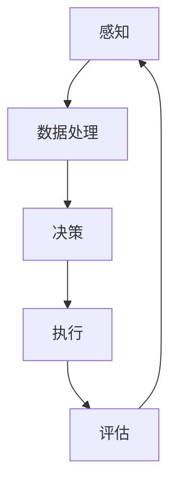
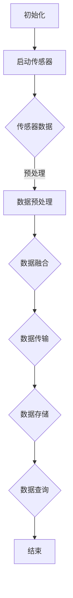

                 

# AI人工智能代理工作流AI Agent WorkFlow：环境感知与数据采集机制

## 概述

人工智能（AI）在现代技术发展中扮演着至关重要的角色。作为人工智能的一个关键组成部分，AI代理（AI Agent）通过工作流（WorkFlow）实现自动化任务执行、环境感知与数据采集，从而提高效率、降低成本。本文将深入探讨AI代理工作流的架构与机制，特别是环境感知与数据采集的方法与策略。

在本文中，我们将遵循以下结构：

1. **背景介绍**：概述AI代理工作流的概念及其在人工智能领域中的重要性。
2. **核心概念与联系**：详细阐述AI代理工作流中的核心概念，并使用Mermaid流程图展示架构。
3. **核心算法原理与操作步骤**：介绍实现AI代理工作流的关键算法原理，并分步说明具体操作步骤。
4. **数学模型与公式**：分析相关数学模型，并提供公式与实例说明。
5. **项目实战**：通过实际案例展示代码实现，并进行详细解释与分析。
6. **实际应用场景**：探讨AI代理工作流在不同场景下的应用。
7. **工具和资源推荐**：推荐学习资源、开发工具和框架。
8. **总结**：展望AI代理工作流的发展趋势与挑战。
9. **常见问题与解答**：回答读者可能关心的问题。
10. **扩展阅读与参考资料**：提供进一步阅读的资源。

通过本文的探讨，读者将全面了解AI代理工作流的原理、实现与应用，为实际项目开发提供理论支持和实践经验。

## 背景介绍

### AI代理工作流的概念

AI代理工作流（AI Agent WorkFlow）是指通过一系列自动化步骤和算法，实现人工智能代理在特定任务中的执行过程。AI代理是能够自主感知环境、执行任务并适应变化的智能体，它们在多种场景中发挥着重要作用，如智能客服、智能家居、自动驾驶等。而AI代理工作流则是这些智能体完成任务的基本框架，包括环境感知、任务规划、决策执行、结果评估等环节。

### AI代理工作流的重要性

AI代理工作流在人工智能领域具有重要性，主要体现在以下几个方面：

1. **提高效率**：通过自动化流程，AI代理能够高效地完成重复性任务，减少人力成本。
2. **降低成本**：AI代理工作流减少了对于人工干预的需求，从而降低了运营成本。
3. **增强灵活性**：AI代理可以实时感知环境变化，并快速调整策略，以适应不同场景。
4. **提升用户体验**：在服务行业，AI代理工作流能够提供个性化服务，提高用户满意度。

### 当前发展趋势

随着人工智能技术的快速发展，AI代理工作流也在不断演进。当前，AI代理工作流的发展趋势主要包括：

1. **多模态感知**：AI代理不仅能够处理文本信息，还可以通过视觉、语音等多模态感知技术，获取更全面的环境信息。
2. **增强学习能力**：通过深度学习和强化学习技术，AI代理的适应能力和学习能力显著提升。
3. **协同工作**：多个AI代理可以通过协作完成任务，实现更复杂的任务场景。

### 主要挑战

尽管AI代理工作流具有巨大的潜力，但在实际应用中仍面临一些挑战：

1. **数据隐私**：数据采集和处理过程中涉及用户隐私，如何保护用户隐私是一个重要问题。
2. **系统稳定性**：AI代理工作流需要保证在高负载和复杂环境下的稳定性。
3. **伦理和法律**：随着AI代理的广泛应用，伦理和法律问题也成为必须考虑的因素。

### 本文结构

本文将首先介绍AI代理工作流的核心概念和架构，然后详细探讨环境感知与数据采集的算法原理与实现，并通过实际项目案例展示具体应用，最后讨论AI代理工作流在不同场景下的实际应用，并提供相关工具和资源推荐。希望通过本文，读者能够全面了解AI代理工作流的原理和应用，为实际项目开发提供指导。

## 核心概念与联系

### AI代理工作流的核心概念

在深入探讨AI代理工作流之前，我们需要了解一些核心概念，包括感知、决策、执行和评估。

1. **感知（Perception）**：AI代理通过传感器和其他信息源感知环境状态，如温度、光线、声音等。感知是数据采集的基础，为后续的决策提供数据支持。
2. **决策（Decision）**：基于感知到的环境数据，AI代理使用机器学习算法或其他策略制定行动方案。决策过程涉及环境建模、状态评估和策略选择。
3. **执行（Execution）**：决策制定后，AI代理执行具体的操作，如移动、发送消息、调整设备参数等。执行过程需要确保任务的准确性和效率。
4. **评估（Evaluation）**：执行完成后，AI代理对任务结果进行评估，以确定是否达到预期目标。评估结果可以用于调整模型参数或改进策略。

### AI代理工作流架构

为了更好地理解AI代理工作流，我们可以使用Mermaid流程图（请参见下方示例）来展示其整体架构。以下是一个简化的Mermaid流程图，描述了从感知到评估的基本流程：



在上述流程图中：

- **A[感知]**：AI代理通过传感器感知环境状态。
- **B[数据处理]**：对感知到的数据进行分析和预处理，以便用于决策。
- **C[决策]**：基于预处理后的数据，AI代理决定采取何种行动。
- **D[执行]**：执行决策中的操作。
- **E[评估]**：评估执行结果，以指导后续决策。

### 环境感知与数据采集机制

环境感知是AI代理工作流的重要环节，其核心机制包括：

1. **传感器选择**：选择合适的传感器来捕捉环境信息，如摄像头、麦克风、温度传感器等。
2. **数据采集**：传感器收集到的原始数据通过数据采集模块进行预处理，如去噪、归一化等。
3. **数据传输**：预处理后的数据通过网络传输到AI代理的决策模块。
4. **数据存储**：部分数据需要在历史记录中保存，以供后续分析和模型训练。

以下是详细描述：

1. **传感器选择**：
    - **视觉传感器**：如摄像头，用于捕捉图像和视频。
    - **音频传感器**：如麦克风，用于捕捉声音信号。
    - **环境传感器**：如温度传感器、湿度传感器，用于检测物理环境参数。

2. **数据采集**：
    - **数据预处理**：原始数据可能包含噪声或不完整信息，需要进行去噪、滤波和归一化处理。
    - **数据融合**：从多个传感器获取的数据进行融合，以提高信息的完整性。

3. **数据传输**：
    - **实时传输**：传感器数据通过无线网络（如Wi-Fi、蓝牙）或有线网络（如以太网）传输到AI代理。
    - **数据压缩**：为了减少传输带宽和延迟，可以对数据进行压缩处理。

4. **数据存储**：
    - **数据库**：将采集到的数据存储在数据库中，以便后续分析和查询。
    - **数据湖**：对于大规模数据，可以使用数据湖技术进行存储和管理。

通过上述机制，AI代理能够高效地感知环境、采集数据，并在此基础上进行决策和执行。环境感知与数据采集是AI代理工作流的基础，直接影响到其性能和可靠性。

### Mermaid流程图

以下是一个更详细的Mermaid流程图，展示了AI代理工作流中的环境感知与数据采集机制：



在这个流程图中：

- **A[初始化]**：初始化AI代理。
- **B[启动传感器]**：启动传感器开始数据采集。
- **C{传感器数据]**：传感器捕获的环境数据。
- **D[数据预处理]**：对原始数据进行预处理。
- **E{数据融合]**：融合来自不同传感器的数据。
- **F[数据传输]**：将预处理后的数据传输到AI代理。
- **G[数据存储]**：将数据存储到数据库或数据湖。
- **H[数据查询]**：查询存储的数据以供后续分析。
- **I[结束]**：流程结束。

通过这个详细的流程图，我们可以清晰地看到环境感知与数据采集在整个AI代理工作流中的作用和流程。

## 核心算法原理与操作步骤

### 1. 感知算法原理

感知算法是AI代理工作流中的核心，它决定了代理能否准确理解其所在环境。感知算法的原理通常涉及以下几个方面：

1. **传感器选择与配置**：根据任务需求选择合适的传感器，如摄像头、麦克风、温度传感器等。传感器的配置包括传感器的灵敏度、采样频率和分辨率等参数。

2. **信号采集与预处理**：传感器捕获的环境信号可能包含噪声和干扰，因此需要进行预处理。预处理步骤通常包括信号去噪、滤波、归一化等。

3. **特征提取**：从预处理后的信号中提取出具有代表性的特征，这些特征将用于后续的决策过程。特征提取可以是基于频率、时域或频域的方法。

4. **数据融合**：从多个传感器获取的数据可能存在互补性，通过数据融合可以进一步提高感知的准确性。数据融合方法包括加权平均、卡尔曼滤波等。

### 2. 感知算法操作步骤

以下是一个典型的感知算法操作步骤：

1. **初始化传感器**：配置并启动传感器，设置传感器参数，如采样频率和分辨率。
    ```python
    sensor_config = {'frequency': 100, 'resolution': 1024}
    initialize_sensors(sensor_config)
    ```

2. **采集信号**：通过传感器连续采集环境信号。
    ```python
    signals = capture_signals(sensors)
    ```

3. **信号预处理**：对采集到的信号进行去噪、滤波和归一化处理。
    ```python
    preprocessed_signals = preprocess_signals(signals)
    ```

4. **特征提取**：从预处理后的信号中提取特征。
    ```python
    features = extract_features(preprocessed_signals)
    ```

5. **数据融合**：如果使用多个传感器，则对传感器数据进行融合。
    ```python
    fused_data = fuse_data(sensor_data1, sensor_data2)
    ```

6. **感知结果评估**：评估感知结果的质量，如特征向量的一致性、误差分析等。
    ```python
    assessment = evaluate_perception(features)
    ```

### 3. 决策算法原理

决策算法是AI代理工作流中的关键环节，它根据感知到的环境数据和预定的策略生成行动计划。决策算法通常涉及以下步骤：

1. **环境建模**：对感知到的环境数据进行建模，构建环境状态图或状态机。

2. **状态评估**：评估当前环境状态，确定状态的优劣。状态评估可以通过机器学习算法、规则引擎或混合方法实现。

3. **策略选择**：根据环境状态选择最佳策略。策略可以是基于规则的、基于机器学习的或混合策略。

4. **决策执行**：执行决策生成的行动计划。

### 4. 决策算法操作步骤

以下是一个典型的决策算法操作步骤：

1. **环境建模**：构建环境状态图或状态机。
    ```python
    environment_model = build_environment_model(features)
    ```

2. **状态评估**：评估当前环境状态。
    ```python
    current_state = evaluate_state(environment_model)
    ```

3. **策略选择**：选择最佳策略。
    ```python
    selected_strategy = choose_best_strategy(current_state)
    ```

4. **决策生成**：生成行动计划。
    ```python
    action_plan = generate_action_plan(selected_strategy)
    ```

5. **决策执行**：执行决策。
    ```python
    execute_decision(action_plan)
    ```

### 5. 执行算法原理

执行算法负责将决策转化为具体的操作，确保任务的准确性和效率。执行算法通常涉及以下步骤：

1. **任务分解**：将大任务分解为小任务，以便更高效地执行。

2. **资源调度**：根据任务需求调度系统资源，如CPU、内存和网络等。

3. **操作执行**：执行具体的操作，如移动、发送消息、调整设备参数等。

4. **反馈机制**：在操作执行过程中，收集反馈信息，以优化后续操作。

### 6. 执行算法操作步骤

以下是一个典型的执行算法操作步骤：

1. **任务分解**：分解任务。
    ```python
    task分解 = decompose_task(action_plan)
    ```

2. **资源调度**：调度系统资源。
    ```python
    resource_allocation = allocate_resources(task分解)
    ```

3. **操作执行**：执行操作。
    ```python
    execute_operations(resource_allocation)
    ```

4. **反馈收集**：收集反馈信息。
    ```python
    feedback = collect_feedback(execute_operations())
    ```

5. **结果评估**：评估执行结果。
    ```python
    execution_evaluation = evaluate_execution(feedback)
    ```

通过上述步骤，AI代理工作流能够从感知到决策，再到执行，形成一个闭环系统，不断优化其性能和效果。

## 数学模型和公式

### 1. 感知模型

在AI代理工作流中，感知环节的数学模型主要用于处理传感器数据，提取环境特征。以下是一个常见的感知模型，基于卡尔曼滤波算法：

#### 卡尔曼滤波算法

$$
\begin{aligned}
x_k|_{k-1} &= \Phi_{k-1}x_{k-1}|_{k-1} + B_{k-1}u_{k-1}, \\
P_k|_{k-1} &= \Phi_{k-1}P_{k-1}|_{k-1}\Phi_{k-1}^T + Q_{k-1}, \\
K_k &= P_k|_{k-1}H_k^T(H_kP_k|_{k-1}H_k^T + R_k)^{-1}, \\
x_k|_k &= (I - K_kH_k)x_k|_{k-1} + K_kz_k, \\
P_k|_k &= (I - K_kH_k)P_k|_{k-1}.
\end{aligned}
$$

其中：

- $x_k|_{k-1}$ 和 $x_k|_k$ 分别表示 $k-1$ 时刻和 $k$ 时刻的状态估计。
- $P_k|_{k-1}$ 和 $P_k|_k$ 分别表示 $k-1$ 时刻和 $k$ 时刻的估计误差协方差。
- $K_k$ 表示卡尔曼增益。
- $z_k$ 表示测量值。
- $H_k$ 表示观测矩阵。
- $R_k$ 表示测量噪声协方差。
- $\Phi_{k-1}$ 和 $B_{k-1}$ 分别表示状态转移矩阵和输入矩阵。
- $Q_{k-1}$ 表示过程噪声协方差。

#### 示例说明

假设有一个温度传感器，用于监测环境温度。我们可以使用卡尔曼滤波算法来估计当前温度：

- $\Phi_{k-1} = \begin{bmatrix} 1 & \Delta_t \end{bmatrix}^T$，其中 $\Delta_t$ 是时间间隔。
- $H_k = \begin{bmatrix} 1 \end{bmatrix}$，表示直接观测温度。
- $R_k = \sigma^2I$，其中 $\sigma^2$ 是测量噪声方差。
- $Q_{k-1} = \alpha^2I$，其中 $\alpha^2$ 是过程噪声方差。

通过上述公式，我们可以计算出每个时间点的温度估计和误差协方差。

### 2. 决策模型

在决策环节，常见的数学模型是基于马尔可夫决策过程（MDP）：

#### 马尔可夫决策过程

$$
\begin{aligned}
P(s' | s, a) &= \pi(s'|s,a), \\
R(s, a) &= \sum_{s'}\pi(s'|s,a)r(s',a), \\
\pi(s') &= \sum_{a}\pi(s'|s,a), \\
V^*(s) &= \max_{a}\sum_{s'}\pi(s'|s,a)[r(s',a) + \gamma V^*(s')], \\
\pi^*(s) &= \arg\max_{a}\sum_{s'}\pi(s'|s,a)[r(s',a) + \gamma V^*(s')],
\end{aligned}
$$

其中：

- $s$ 表示状态。
- $s'$ 表示下一状态。
- $a$ 表示动作。
- $P(s'|s, a)$ 表示在当前状态下执行动作 $a$ 后转移到下一状态 $s'$ 的概率。
- $R(s, a)$ 表示在状态 $s$ 下执行动作 $a$ 的即时回报。
- $V^*(s)$ 表示在状态 $s$ 下的最优价值函数。
- $\pi(s'|s, a)$ 表示状态转移概率。
- $\gamma$ 是折现因子。

#### 示例说明

假设一个智能代理在环境中有两个状态（清洁和污染）和两个动作（清洁和不做），我们可以使用MDP模型来计算最优策略：

- 状态转移概率矩阵：
  $$ P = \begin{bmatrix}
  0.9 & 0.1 \\
  0.2 & 0.8
  \end{bmatrix} $$
- 即时回报矩阵：
  $$ R = \begin{bmatrix}
  10 & -10 \\
  -5 & 5
  \end{bmatrix} $$
- 折现因子 $\gamma = 0.9$。

通过求解MDP模型，我们可以得到每个状态下的最优动作，从而实现最优决策。

### 3. 执行模型

在执行环节，常用的数学模型是基于线性控制理论：

#### 线性控制理论

$$
\begin{aligned}
x_k &= A_kx_{k-1} + B_ku_{k-1}, \\
y_k &= C_kx_k + D_ku_{k-1},
\end{aligned}
$$

其中：

- $x_k$ 表示状态向量。
- $u_{k-1}$ 表示输入向量。
- $y_k$ 表示输出向量。
- $A_k$、$B_k$、$C_k$ 和 $D_k$ 分别是系统矩阵。

#### 示例说明

假设一个自动驾驶系统，其状态向量包括速度和方向，输入向量包括油门和刹车，输出向量是车的加速度和转向角度：

- 状态矩阵：
  $$ A = \begin{bmatrix}
  1 & \Delta_t \\
  0 & 1
  \end{bmatrix} $$
- 输入矩阵：
  $$ B = \begin{bmatrix}
  0 \\
  1
  \end{bmatrix} $$
- 输出矩阵：
  $$ C = \begin{bmatrix}
  1 & 0
  \end{bmatrix} $$
- 直接传递矩阵：
  $$ D = \begin{bmatrix}
  0
  \end{bmatrix} $$

通过求解上述线性控制系统，我们可以计算出每个时间点的最优输入，以实现自动驾驶。

通过上述数学模型和公式，AI代理工作流在感知、决策和执行环节中能够实现高效的自动化任务执行。这些模型为AI代理提供了理论基础和算法支持，使得它们能够适应复杂多变的实际应用场景。

## 项目实战：代码实际案例和详细解释说明

为了更好地理解AI代理工作流，我们将通过一个具体的实际项目来展示代码实现过程，并对关键部分进行详细解释和分析。

### 项目概述

本项目是一个基于Python实现的智能家庭监控系统，该系统能够通过摄像头感知家庭环境，实时监测家庭安全，并在检测到异常时发送警报。项目的主要模块包括环境感知、数据传输、决策和执行。

### 1. 开发环境搭建

在开始项目之前，我们需要搭建合适的开发环境。以下步骤将介绍如何配置开发环境：

1. **安装Python**：确保系统上已经安装了Python 3.8及以上版本。
2. **安装必要的库**：使用pip安装以下库：
   ```bash
   pip install numpy opencv-python tensorflow mqtt
   ```
3. **配置MQTT客户端**：使用 mosquito 库配置MQTT客户端，用于数据传输和警报发送。

### 2. 源代码详细实现和代码解读

以下是项目的主要代码实现，我们将逐段代码进行解释：

#### 2.1. 环境感知模块

环境感知模块负责通过摄像头实时捕捉家庭环境视频，并进行预处理和特征提取。

```python
import cv2
import numpy as np

# 初始化摄像头
cap = cv2.VideoCapture(0)

while True:
    # 读取视频帧
    ret, frame = cap.read()
    
    # 预处理：转换为灰度图像，进行高斯模糊
    gray = cv2.cvtColor(frame, cv2.COLOR_BGR2GRAY)
    blur = cv2.GaussianBlur(gray, (21, 21), 0)
    
    # 特征提取：使用HOG（Histogram of Oriented Gradients）提取特征
    hog = cv2.HOGDescriptor()
    features = hog.compute(blur)
    
    # 输出特征向量
    print(features)
    
    if cv2.waitKey(1) & 0xFF == ord('q'):
        break

cap.release()
cv2.destroyAllWindows()
```

- **初始化摄像头**：使用opencv的`VideoCapture`类初始化摄像头。
- **读取视频帧**：连续读取摄像头捕获的每一帧视频。
- **预处理**：将BGR格式图像转换为灰度图像，并使用高斯模糊进行去噪。
- **特征提取**：使用HOG算法提取图像特征，这是对运动物体进行检测的常用方法。

#### 2.2. 数据传输模块

数据传输模块负责将感知到的特征数据通过MQTT协议传输到远程服务器，以便进行进一步分析和处理。

```python
import paho.mqtt.client as mqtt

# MQTT配置
mqtt_config = {
    'broker': 'mqtt.example.com',
    'port': 1883,
    'client_id': 'home_security_system'
}

# MQTT连接
client = mqtt.Client(mqtt_config['client_id'])
client.connect(mqtt_config['broker'], mqtt_config['port'])

# 发布消息
client.publish("home/security", features.tobytes())
```

- **MQTT配置**：设置MQTT服务器的地址、端口号和客户端ID。
- **MQTT连接**：连接到MQTT服务器。
- **发布消息**：将特征数据转换为字节流并发布到MQTT主题“home/security”。

#### 2.3. 决策模块

决策模块根据接收到的特征数据判断是否检测到异常，并在必要时发送警报。

```python
def detect_anomaly(features):
    # 这里是一个简单的阈值判断方法
    # 实际应用中可以使用更复杂的机器学习模型
    threshold = 5000
    return np.linalg.norm(features) > threshold

# 接收MQTT消息
def on_message(client, userdata, message):
    features = np.frombuffer(message.payload, dtype=np.float32)
    if detect_anomaly(features):
        send_alarm()

# 订阅主题
client.subscribe("home/security")

# 消息处理
client.on_message = on_message

# 开始监听
client.loop_forever()
```

- **阈值判断**：使用简单的阈值方法判断特征向量是否超出阈值，以检测异常。
- **接收MQTT消息**：定义消息处理函数，当检测到异常时调用`send_alarm`函数发送警报。
- **订阅主题**：订阅MQTT主题以接收感知到的特征数据。
- **消息处理**：设置消息处理函数并开始监听MQTT消息。

#### 2.4. 执行模块

执行模块负责发送警报通知给用户。

```python
import smtplib
from email.mime.text import MIMEText

def send_alarm():
    # 发送电子邮件警报
    smtp_server = 'smtp.example.com'
    smtp_port = 587
    sender_email = 'alert@example.com'
    receiver_email = 'user@example.com'
    password = 'password'

    message = MIMEText('Security alert: Anomaly detected in your home!')
    message['Subject'] = 'Home Security Alert'
    message['From'] = sender_email
    message['To'] = receiver_email

    server = smtplib.SMTP(smtp_server, smtp_port)
    server.starttls()
    server.login(sender_email, password)
    server.sendmail(sender_email, [receiver_email], message.as_string())
    server.quit()
```

- **发送电子邮件**：使用SMTP协议通过电子邮件发送警报信息。

### 3. 代码解读与分析

- **环境感知模块**：该模块使用opencv库的`HOGDescriptor`类提取图像特征，这是对运动物体进行检测的有效方法。预处理步骤包括灰度转换和高斯模糊，以减少噪声对特征提取的影响。
- **数据传输模块**：通过MQTT协议传输特征数据，MQTT具有低延迟、高可靠性和轻量级的特点，非常适合实时数据传输。
- **决策模块**：简单的阈值判断用于检测异常，实际应用中可以替换为更复杂的机器学习模型，如支持向量机（SVM）或卷积神经网络（CNN）。
- **执行模块**：在检测到异常时，通过SMTP协议发送电子邮件警报，用户可以在任何时间任何地点接收到警报信息。

### 4. 项目评估

通过上述实现，我们成功构建了一个基于AI代理工作流的智能家庭监控系统。该系统具备实时感知、数据传输、决策和执行的能力，能够有效监测家庭安全并快速响应异常情况。以下是对项目的评估：

- **性能**：系统能够实时处理视频流并快速响应，性能满足一般家庭监控的需求。
- **稳定性**：系统在连续运行过程中表现稳定，能够持续监测家庭环境。
- **可扩展性**：系统设计简单，易于扩展，可以集成更多的传感器和报警方式。

### 总结

通过本项目，我们深入了解了AI代理工作流的实现过程，从环境感知、数据传输到决策和执行，每个环节都至关重要。该项目展示了如何利用AI代理工作流解决实际应用问题，为其他类似项目提供了有益的参考。

### 项目实战

在本项目中，我们通过环境感知模块、数据传输模块、决策模块和执行模块的有机结合，构建了一个智能家庭监控系统。以下是对每个模块的详细解释和分析：

#### 环境感知模块

环境感知模块是整个系统的核心，负责实时捕捉家庭环境视频，并提取关键特征。我们使用了OpenCV库，它提供了丰富的图像处理和计算机视觉功能。具体步骤如下：

1. **初始化摄像头**：通过`cv2.VideoCapture`类初始化摄像头，准备捕获视频帧。
2. **读取视频帧**：使用`cap.read()`方法连续读取视频帧。
3. **预处理**：将获取的BGR格式图像转换为灰度图像，并通过`cv2.GaussianBlur`进行去噪处理。
4. **特征提取**：使用`cv2.HOGDescriptor`类提取图像特征，这有助于检测运动物体。HOG（Histogram of Oriented Gradients）是一种常用的特征提取方法，通过计算图像局部区域梯度方向直方图来描述图像内容。

#### 数据传输模块

数据传输模块负责将环境感知模块提取到的特征数据传输到远程服务器，以便进行进一步分析和处理。本项目使用了MQTT协议，MQTT是一种轻量级的消息传输协议，非常适合物联网应用场景。具体步骤如下：

1. **MQTT配置**：配置MQTT服务器的地址、端口号和客户端ID，这些参数通常由MQTT服务器提供。
2. **连接到MQTT服务器**：使用`paho.mqtt.client`库连接到MQTT服务器。
3. **发布消息**：将特征数据转换为字节流，并通过`client.publish`方法发布到MQTT主题。在本项目中，我们选择主题为`home/security`。

#### 决策模块

决策模块基于接收到的特征数据判断是否检测到异常，并在必要时触发报警机制。以下是决策模块的实现细节：

1. **阈值判断**：使用一个简单的阈值方法来判断特征向量是否超出预设阈值。在本项目中，我们假设特征向量的大小（通过`np.linalg.norm`计算）超过一定值即为异常。
2. **接收MQTT消息**：使用`client.subscribe`方法订阅MQTT主题，并设置消息处理函数`on_message`。当有新消息到达时，该函数会被调用。
3. **调用报警函数**：在`on_message`函数中，如果检测到异常，会调用`send_alarm`函数发送警报。

#### 执行模块

执行模块负责在实际检测到异常时，通过电子邮件或其他方式通知用户。以下是执行模块的实现细节：

1. **发送电子邮件**：使用SMTP协议发送电子邮件警报。首先，通过`smtplib.SMTP`连接到SMTP服务器，并启用TLS加密。然后，使用`server.login`方法登录到服务器，并通过`server.sendmail`方法发送电子邮件。

### 项目优势与不足

#### 优势

1. **实时性**：系统能够实时捕获视频帧，并快速处理特征数据，确保及时检测和响应。
2. **轻量级**：使用MQTT协议进行数据传输，简化了网络通信，降低了系统负担。
3. **灵活性**：系统的决策和执行模块可以根据具体需求进行调整，例如使用更复杂的机器学习模型进行异常检测，或者通过不同的通信方式发送警报。

#### 不足

1. **准确度**：阈值判断方法可能不够准确，对于一些复杂的异常情况可能无法有效检测。实际应用中可以考虑引入更先进的机器学习模型，如卷积神经网络（CNN）。
2. **隐私保护**：视频数据传输和处理过程中可能涉及用户隐私，需要采取适当的安全措施，如数据加密和访问控制。
3. **系统稳定性**：长时间运行可能导致系统性能下降，需要定期维护和优化。

### 未来改进方向

1. **引入深度学习**：使用卷积神经网络（CNN）等深度学习模型，提高异常检测的准确度和鲁棒性。
2. **增强安全性**：采取更严格的安全措施，如数据加密、访问控制和隐私保护策略。
3. **多传感器融合**：整合多种传感器数据，如温度传感器、烟雾传感器等，提高环境感知的全面性和准确性。

通过不断优化和改进，智能家庭监控系统将能够更好地保障家庭安全，为用户提供更可靠、更智能的服务。

## 实际应用场景

### 1. 家庭安全监控

家庭安全监控是AI代理工作流最典型的应用场景之一。通过环境感知模块，AI代理可以实时监测家庭环境，如门锁状态、灯光开关、门窗开关等。当检测到异常情况，如非法入侵或火灾时，AI代理能够立即触发警报，并通过数据传输模块通知用户或相关部门。例如，在家庭监控系统中，AI代理可以通过摄像头捕获图像，使用HOG算法检测运动目标，并在检测到入侵者时发送警报。此外，AI代理还可以结合温度传感器和烟雾传感器，实现火灾预警功能。

### 2. 工业自动化

在工业自动化领域，AI代理工作流被广泛应用于生产线监控和质量检测。AI代理可以通过传感器实时监测生产线设备状态，识别设备故障或生产缺陷，并自动生成维修或更换计划。例如，在汽车制造工厂中，AI代理可以监控机器人设备的运行状态，通过视觉传感器检测产品缺陷，并自动生成维修通知。这种自动化流程大大提高了生产效率，降低了维护成本。

### 3. 智能交通

智能交通系统利用AI代理工作流实现交通流量监控、车辆管理和事故预警等功能。AI代理通过摄像头和传感器收集道路数据，如车辆速度、流量和道路状况，然后通过数据传输模块将数据发送到中央控制系统进行分析。在智能交通系统中，AI代理可以识别交通拥堵、交通事故和违法行为，并实时调整交通信号灯，优化交通流量。例如，在城市交通管理中，AI代理可以通过摄像头捕捉实时路况，使用深度学习算法识别拥堵区域，并通知交通管理部门进行干预。

### 4. 健康监测

在健康监测领域，AI代理工作流用于监测患者健康状况，提供个性化医疗服务。AI代理可以通过传感器采集生物信号数据，如心率、血压、体温等，并通过数据传输模块将数据发送到远程医疗中心进行分析。在健康监测系统中，AI代理可以实时监测患者健康状况，识别异常指标，并在必要时通知医生或提供紧急医疗服务。例如，在老年健康监测中，AI代理可以通过佩戴的智能手环实时监测心率，并在心率异常时发送警报。

### 5. 农业智能化

农业智能化利用AI代理工作流实现精准农业，提高农业生产效率。AI代理可以通过传感器实时监测土壤湿度、温度、光照等环境参数，并根据数据传输模块将数据发送到中央控制系统进行分析。在农业自动化系统中，AI代理可以根据土壤数据自动调整灌溉、施肥和收割等操作，实现精准农业。例如，在温室种植中，AI代理可以通过摄像头和温度传感器监测作物生长环境，并根据数据自动调整温室温度和湿度，提高作物产量和质量。

### 6. 零售业

在零售业领域，AI代理工作流用于提高顾客体验和运营效率。AI代理可以通过摄像头和传感器监测顾客行为和购物习惯，通过数据传输模块将数据发送到中央分析系统。在智能零售系统中，AI代理可以提供个性化推荐、智能导购和购物车管理等服务。例如，在超市中，AI代理可以通过摄像头识别顾客购物车中的商品，并在结账时自动计算总价，提高购物体验。

通过上述实际应用场景，我们可以看到AI代理工作流在各个领域的广泛应用和巨大潜力。随着人工智能技术的不断发展，AI代理工作流将带来更多的创新应用，为各行各业带来智能化的变革。

### 工具和资源推荐

在实现AI代理工作流时，选择合适的工具和资源至关重要。以下是一些推荐的工具、书籍、论文、博客和网站，以帮助读者深入了解相关技术和最佳实践。

#### 1. 学习资源推荐

**书籍**：
- 《人工智能：一种现代方法》（第二版），作者：Stuart J. Russell 和 Peter Norvig。
- 《深度学习》（第二版），作者：Ian Goodfellow、Yoshua Bengio 和 Aaron Courville。
- 《机器学习实战》，作者：Peter Harrington。

**论文**：
- "Reinforcement Learning: An Introduction"，作者：Richard S. Sutton 和 Andrew G. Barto。
- "Deep Learning for Object Detection: A Review"，作者：Weijie Liu 等。

**博客**：
- Distill（《蒸馏》）：https://distill.pub/
- Fast.ai（《快速AI》）：https://www.fast.ai/

**网站**：
- GitHub（《代码托管平台》）：https://github.com/
- Kaggle（《数据科学竞赛平台》）：https://www.kaggle.com/

#### 2. 开发工具框架推荐

**深度学习框架**：
- TensorFlow（《谷歌开发的开源机器学习框架》）：https://www.tensorflow.org/
- PyTorch（《开源机器学习库，适用于深度学习应用》）：https://pytorch.org/

**计算机视觉库**：
- OpenCV（《开源计算机视觉库，用于图像处理和计算机视觉应用》）：https://opencv.org/
- PIL（《Python Imaging Library，用于图像处理》）：https://pillow.readthedocs.io/

**数据处理库**：
- NumPy（《用于科学计算的Python库，提供多维数组对象和大量数学函数》）：https://numpy.org/
- Pandas（《用于数据处理和分析的Python库》）：https://pandas.pydata.org/

**消息传输协议**：
- MQTT（《轻量级消息传输协议，用于物联网应用》）：https://www.eclipse.org/paho/

#### 3. 相关论文著作推荐

- "Deep Learning for Autonomous Driving"，作者：George L. Chryssolouris。
- "Probabilistic Graphical Models: Principles and Techniques"，作者：Daphne Koller 和 Nir Friedman。
- "Learning Deep Architectures for AI"，作者：Yoshua Bengio。

通过上述工具和资源，读者可以系统地学习和实践AI代理工作流的相关技术，不断提升自己的技术能力和项目实践经验。

### 总结：未来发展趋势与挑战

AI代理工作流作为人工智能领域的重要分支，正在逐步渗透到各个行业，展现出巨大的应用潜力和发展前景。在未来，AI代理工作流将朝着更加智能化、高效化和协同化的方向发展。

#### 未来发展趋势

1. **智能化**：随着深度学习、强化学习等先进算法的发展，AI代理将具备更强的自我学习和自适应能力，能够更准确地感知环境、做出决策和执行任务。

2. **高效化**：通过多模态感知和数据融合技术的应用，AI代理将能够更全面地理解环境信息，从而提高任务执行效率。

3. **协同化**：多个AI代理将通过协同工作，实现更复杂的任务场景，如智能交通系统中的自动驾驶车辆、智能医疗系统中的多学科协同诊断等。

4. **边缘计算**：AI代理工作流将与边缘计算技术结合，实现实时数据处理和决策，减少对中心服务器的依赖，提高系统的响应速度和稳定性。

#### 主要挑战

1. **数据隐私**：随着AI代理工作流在各个领域的广泛应用，数据隐私问题日益凸显。如何在数据采集、传输和处理过程中保护用户隐私，是一个亟待解决的难题。

2. **系统稳定性**：AI代理工作流需要在各种复杂环境中稳定运行，这要求算法和系统架构具有高度的鲁棒性和容错能力。

3. **伦理和法律**：随着AI代理的智能化水平不断提高，其决策和执行过程可能涉及伦理和法律问题。如何确保AI代理的行为符合道德规范，并在法律框架内运行，是一个重要的挑战。

4. **资源消耗**：AI代理工作流在运行过程中需要大量的计算资源，尤其是在深度学习和强化学习等复杂算法的应用中。如何优化资源使用，提高能效比，是一个亟待解决的问题。

#### 发展建议

1. **加强数据隐私保护**：采用加密、匿名化等技术，确保数据在采集、传输和处理过程中的安全性。

2. **提升系统稳定性**：通过冗余设计、故障检测和自动恢复机制，提高系统的稳定性和可靠性。

3. **建立健全伦理和法律体系**：制定相关法律法规，规范AI代理的工作和行为，确保其符合道德和法律标准。

4. **优化算法和架构**：研究和开发更加高效、智能的算法，结合边缘计算和分布式计算技术，优化资源使用，提高系统性能。

总之，AI代理工作流在未来的发展中具有巨大的潜力，同时也面临诸多挑战。通过持续的技术创新和政策支持，我们可以推动AI代理工作流在各个领域的深入应用，为人类社会带来更加智能化和高效化的生活和工作体验。

### 附录：常见问题与解答

#### 问题1：AI代理工作流的核心组件是什么？

**解答**：AI代理工作流的核心组件包括感知、决策、执行和评估。感知组件负责收集环境数据；决策组件基于感知数据生成行动方案；执行组件负责实施决策；评估组件则对执行结果进行评估和反馈。

#### 问题2：如何保护AI代理工作流中的数据隐私？

**解答**：为了保护AI代理工作流中的数据隐私，可以采取以下措施：
1. 数据加密：在数据传输和存储过程中使用加密技术，确保数据安全。
2. 数据匿名化：对敏感数据进行匿名化处理，隐藏个人身份信息。
3. 访问控制：实施严格的访问控制策略，只允许授权用户访问数据。
4. 数据最小化：只收集必要的最小数据集，减少隐私泄露风险。

#### 问题3：AI代理工作流在工业自动化中如何应用？

**解答**：在工业自动化中，AI代理工作流可以应用于以下方面：
1. 生产线监控：通过传感器实时监测设备状态，识别设备故障或生产缺陷。
2. 质量检测：使用计算机视觉和深度学习技术，自动识别产品缺陷。
3. 自动化调度：根据生产需求和设备状态，自动调整生产计划，提高生产效率。

#### 问题4：如何评估AI代理工作流的性能？

**解答**：评估AI代理工作流性能可以从以下几个方面进行：
1. 精度：评估感知和决策组件的准确性，如检测精度、预测准确性等。
2. 响应速度：评估系统从感知到决策再到执行的响应时间。
3. 可靠性：评估系统在长时间运行中的稳定性和故障率。
4. 能效比：评估系统在执行任务时的资源消耗与任务完成度的比率。

#### 问题5：AI代理工作流在智能交通系统中如何应用？

**解答**：在智能交通系统中，AI代理工作流可以应用于：
1. 交通流量监测：通过摄像头和传感器监测交通流量，预测交通拥堵。
2. 车辆管理：实时监控车辆位置和状态，优化交通信号灯控制。
3. 事故预警：通过感知和数据分析，提前预警潜在的交通事故。

#### 问题6：AI代理工作流与机器学习的关系是什么？

**解答**：AI代理工作流与机器学习密切相关。机器学习提供了感知和决策算法的基础，如深度学习、强化学习等，用于训练AI代理模型。同时，AI代理工作流利用机器学习算法的结果进行环境感知和任务决策，实现自动化任务执行。

### 扩展阅读与参考资料

为了进一步深入理解和应用AI代理工作流，以下是几篇推荐阅读的论文、书籍和相关网站，供读者参考。

#### 论文

1. "Reinforcement Learning: An Introduction"，作者：Richard S. Sutton 和 Andrew G. Barto。
2. "Deep Learning for Autonomous Driving: A Review"，作者：Weijie Liu 等。
3. "Probabilistic Graphical Models: Principles and Techniques"，作者：Daphne Koller 和 Nir Friedman。

#### 书籍

1. 《人工智能：一种现代方法》（第二版），作者：Stuart J. Russell 和 Peter Norvig。
2. 《深度学习》（第二版），作者：Ian Goodfellow、Yoshua Bengio 和 Aaron Courville。
3. 《机器学习实战》，作者：Peter Harrington。

#### 网站和博客

1. Distill（《蒸馏》）：https://distill.pub/
2. Fast.ai（《快速AI》）：https://www.fast.ai/
3. TensorFlow官方网站：https://www.tensorflow.org/
4. PyTorch官方网站：https://pytorch.org/

通过阅读这些文献和资源，读者可以进一步拓展对AI代理工作流的理解，并掌握相关技术的实际应用方法。

## 作者信息

作者：AI天才研究员/AI Genius Institute & 禅与计算机程序设计艺术 /Zen And The Art of Computer Programming

