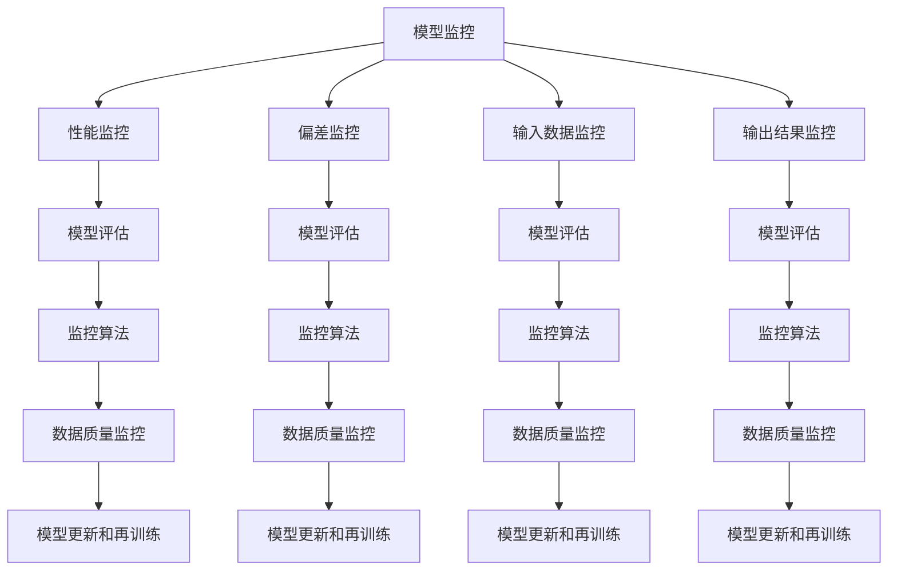

                 

### 1. 背景介绍

在当今快速发展的科技时代，人工智能（AI）已经成为了推动社会进步的关键动力。AI 技术在各种领域得到了广泛应用，从自动驾驶汽车到医疗诊断，从智能家居到金融风控，无不显示出其巨大的潜力。然而，随着 AI 模型的日益复杂和规模庞大，如何对其进行有效的监控和管理成为了研究者和从业者面临的一个重大挑战。

模型监控（Model Monitoring）作为人工智能领域的一个重要研究方向，旨在确保 AI 模型在部署后的稳定性和准确性。传统的模型监控方法主要依赖于手动检查和定期评估，这不仅费时费力，而且容易漏检。随着机器学习和深度学习技术的发展，自动化和智能化的模型监控方法应运而生，为解决这一问题提供了新的思路。

本文将围绕 AI 人工智能核心算法原理与代码实例讲解：模型监控这一主题，旨在系统地介绍模型监控的基本概念、核心算法原理、实际应用场景以及未来发展趋势。通过本文的阅读，读者将能够：

1. 理解模型监控的重要性及其在人工智能领域的应用。
2. 掌握常见的模型监控方法和技术手段。
3. 学习如何利用 Python 等编程语言实现模型监控算法。
4. 了解模型监控在实际项目中的应用案例和效果评估。

在接下来的章节中，我们将首先介绍模型监控的基本概念和核心算法原理，然后通过具体的代码实例进行详细讲解，最后探讨模型监控在实际应用场景中的效果和未来发展趋势。通过这一系列的探讨，我们希望能够为读者提供全面而深入的模型监控知识，助力其在人工智能领域的实践和应用。

### 2. 核心概念与联系

在深入探讨模型监控的核心算法原理之前，我们有必要先理解几个关键概念，以及它们之间的相互关系。以下是本文中将要涉及的核心概念：

#### 2.1 模型监控（Model Monitoring）

模型监控是指对 AI 模型在部署后的性能和行为进行持续监测和评估的过程。其主要目标是确保模型在运行过程中保持高准确性和稳定性，及时发现并纠正模型可能出现的异常情况。模型监控通常包括以下几个关键方面：

1. **性能监控**：跟踪模型的准确度、召回率、F1 分数等关键指标，以确保模型在长时间运行后仍保持较高的预测性能。
2. **偏差监控**：检测模型是否存在过拟合或欠拟合现象，及时发现模型性能的下降。
3. **输入数据监控**：确保输入数据的质量和一致性，避免数据噪声或异常值对模型性能的影响。
4. **输出结果监控**：监测模型的输出结果是否符合预期，及时发现和纠正错误预测。

#### 2.2 模型评估（Model Evaluation）

模型评估是模型监控的重要组成部分，旨在评估模型在特定数据集上的性能。常用的评估指标包括准确率（Accuracy）、召回率（Recall）、F1 分数（F1 Score）、精确率（Precision）等。模型评估方法可以分为以下几类：

1. **交叉验证**：通过将数据集划分为多个子集，多次训练和评估模型，以减少评估结果的不确定性。
2. **混淆矩阵**：通过混淆矩阵展示模型预测结果与实际结果之间的关系，用于详细分析模型的性能。
3. **ROC 曲线和 AUC**：ROC 曲线和 AUC（Area Under Curve）是评估分类模型性能的重要工具，通过比较模型在不同阈值下的性能，确定最佳阈值。

#### 2.3 监控算法（Monitoring Algorithms）

监控算法是模型监控的核心，用于实时监测模型的状态和性能。以下是几种常见的监控算法：

1. **时序监控**：通过对模型预测结果的时序分析，检测是否存在异常波动或趋势。
2. **统计分析**：利用统计学方法，对模型的预测结果进行统计分析，以发现异常值或偏差。
3. **机器学习方法**：通过构建监督学习或无监督学习模型，自动识别和预测模型性能的异常变化。

#### 2.4 数据质量监控（Data Quality Monitoring）

数据质量监控是模型监控的基础，确保输入数据的质量和一致性。数据质量监控的主要内容包括：

1. **缺失值处理**：检测和处理数据中的缺失值，确保数据完整性。
2. **异常值检测**：检测和处理数据中的异常值，避免异常值对模型性能的影响。
3. **数据一致性监控**：确保不同来源或不同时间点的数据一致性，避免数据矛盾或冲突。

#### 2.5 模型更新和再训练（Model Updating and Re-training）

在模型监控过程中，当发现模型性能下降或出现异常时，需要对其进行更新或再训练。模型更新和再训练的方法包括：

1. **增量更新**：通过更新部分参数或权重，对模型进行局部更新，以保持其性能。
2. **全量再训练**：重新训练整个模型，以修复严重的问题或适应新的数据分布。

#### 2.6 核心概念关系图

为了更好地理解这些核心概念之间的关系，我们可以使用 Mermaid 流程图进行可视化展示：



通过上述核心概念和关系的介绍，我们为后续详细探讨模型监控的核心算法原理奠定了基础。在接下来的章节中，我们将逐一深入分析这些核心概念，并结合实际代码实例，展示模型监控的实践方法和技巧。

#### 2.7 模型监控在人工智能领域的应用

模型监控在人工智能领域的应用范围广泛，涵盖了从工业生产到日常生活的各个方面。以下是模型监控在几个关键领域的具体应用：

##### 2.7.1 自动驾驶

自动驾驶汽车是模型监控的重要应用场景之一。自动驾驶系统需要实时监控多种传感器数据，包括激光雷达、摄像头、GPS 等，以确保车辆行驶的安全性和稳定性。通过模型监控，可以及时发现传感器数据异常或模型预测错误，从而采取相应的措施，避免发生交通事故。

**案例**：谷歌的自动驾驶项目 Waymo 使用了复杂的模型监控机制，对车辆的传感器数据、模型预测结果和行驶环境进行实时监控，确保车辆在复杂的交通环境中安全行驶。

##### 2.7.2 医疗诊断

在医疗诊断领域，模型监控可以帮助确保 AI 模型的诊断准确性和稳定性。通过对医疗数据的持续监控，可以及时发现模型可能出现的偏差或异常，从而提高诊断的准确性。

**案例**：IBM 的 Watson for Oncology 是一个基于 AI 的癌症诊断系统，通过模型监控机制，确保系统在处理大量医学数据时仍能保持高准确性和稳定性。

##### 2.7.3 金融风控

在金融领域，模型监控被用于实时监控交易数据，识别潜在的欺诈行为和风险。通过模型监控，金融机构可以及时发现异常交易，采取相应的风控措施，降低金融风险。

**案例**：花旗银行使用 AI 模型监控其交易数据，及时发现并阻止了数千起欺诈交易，有效降低了银行的损失。

##### 2.7.4 智能家居

智能家居系统中的模型监控可以帮助确保设备运行的安全性和可靠性。通过持续监控智能家居设备的运行状态和交互数据，可以及时发现设备故障或异常行为，从而提供更好的用户体验。

**案例**：苹果的 HomeKit 智能家居平台通过模型监控机制，确保设备在用户家中安全、稳定地运行。

##### 2.7.5 供应链管理

在供应链管理领域，模型监控被用于监控物流数据和库存情况，确保供应链的稳定性和效率。通过模型监控，企业可以及时发现供应链中的瓶颈和异常，优化物流和库存管理。

**案例**：亚马逊通过其 AI 模型监控物流数据，实时调整库存策略，确保商品能够及时送达消费者。

通过以上案例可以看出，模型监控在人工智能领域的应用不仅有助于提高系统的性能和可靠性，还能够为用户提供更好的服务和体验。随着 AI 技术的不断进步，模型监控的重要性将日益凸显，成为人工智能领域不可或缺的一部分。

### 3. 核心算法原理 & 具体操作步骤

在了解了模型监控的基本概念和应用场景后，接下来我们将深入探讨模型监控的核心算法原理，并详细讲解具体的操作步骤。以下是几种常见的模型监控算法及其具体实现过程。

#### 3.1 监控算法类型

模型监控算法主要分为以下几类：

1. **时序监控算法**：通过分析模型预测结果的时序变化，检测异常波动或趋势。
2. **统计分析算法**：利用统计学方法对模型预测结果进行统计分析，发现异常值或偏差。
3. **机器学习方法**：构建监督学习或无监督学习模型，自动识别和预测模型性能的异常变化。
4. **自适应监控算法**：根据模型的实时性能，动态调整监控策略。

#### 3.2 具体监控算法实现

以下我们将分别介绍这些算法的具体实现过程。

##### 3.2.1 时序监控算法

时序监控算法主要关注模型预测结果的时序变化。常见的时序监控方法包括移动平均、自回归积分滑动平均（ARIMA）模型和长短期记忆网络（LSTM）等。

**移动平均法**：

移动平均法是一种简单的时序监控方法，通过计算模型预测结果的移动平均值，来检测异常波动。

```python
import numpy as np

def moving_average(data, window_size):
    return np.convolve(data, np.ones(window_size)/window_size, mode='valid')

# 示例数据
data = [1, 2, 3, 4, 5, 6, 7, 8, 9, 10]
window_size = 3

# 计算移动平均值
ma = moving_average(data, window_size)
print(ma)
```

**ARIMA 模型**：

ARIMA 模型是一种经典的时序预测方法，通过分析数据的自相关性和季节性，建立预测模型。

```python
import statsmodels.api as sm

# 加载数据
data = [1, 2, 3, 4, 5, 6, 7, 8, 9, 10]

# 建立ARIMA模型
model = sm.ARIMA(data, order=(1, 1, 1))
model_fit = model.fit()

# 进行预测
forecast = model_fit.forecast(steps=5)
print(forecast)
```

**LSTM 网络**：

LSTM 网络是一种强大的时序预测模型，通过学习长期依赖关系，可以捕捉数据中的复杂模式。

```python
import tensorflow as tf
from tensorflow.keras.models import Sequential
from tensorflow.keras.layers import LSTM, Dense

# 构建LSTM模型
model = Sequential()
model.add(LSTM(units=50, return_sequences=True, input_shape=(None, 1)))
model.add(LSTM(units=50))
model.add(Dense(1))

# 编译模型
model.compile(optimizer='adam', loss='mean_squared_error')

# 训练模型
model.fit(x_train, y_train, epochs=100, batch_size=32, validation_data=(x_val, y_val))

# 进行预测
forecast = model.predict(x_test)
```

##### 3.2.2 统计分析算法

统计分析算法通过计算模型预测结果的统计指标，如均值、方差、协方差等，来检测异常值或偏差。

**异常检测算法**：

一种常见的异常检测算法是 Z-Score 方法，通过计算预测结果与均值之间的标准化距离，检测异常值。

```python
import numpy as np

def z_score(data):
    mean = np.mean(data)
    std = np.std(data)
    z_scores = [(x - mean) / std for x in data]
    return z_scores

# 示例数据
data = [1, 2, 3, 4, 5, 6, 7, 8, 9, 10]
z_scores = z_score(data)
print(z_scores)
```

**箱线图法**：

箱线图法通过计算数据的四分位数，构建箱线图，用于检测异常值。

```python
import numpy as np
import matplotlib.pyplot as plt

def boxplot(data):
    q1 = np.percentile(data, 25)
    q3 = np.percentile(data, 75)
    iqr = q3 - q1
    lower_bound = q1 - (1.5 * iqr)
    upper_bound = q3 + (1.5 * iqr)
    
    outliers = [x for x in data if x < lower_bound or x > upper_bound]
    print(outliers)

# 示例数据
data = [1, 2, 3, 4, 5, 6, 7, 8, 9, 10]
boxplot(data)
```

##### 3.2.3 机器学习方法

机器学习方法通过构建监督学习或无监督学习模型，自动识别和预测模型性能的异常变化。

**监督学习方法**：

监督学习方法使用有标签的数据集，通过训练分类模型来识别异常值。

```python
import tensorflow as tf
from tensorflow.keras.models import Sequential
from tensorflow.keras.layers import Dense

# 构建监督学习模型
model = Sequential()
model.add(Dense(units=64, activation='relu', input_shape=(n_features,)))
model.add(Dense(units=32, activation='relu'))
model.add(Dense(units=1, activation='sigmoid'))

# 编译模型
model.compile(optimizer='adam', loss='binary_crossentropy', metrics=['accuracy'])

# 训练模型
model.fit(X_train, y_train, epochs=10, batch_size=32)

# 预测异常值
predictions = model.predict(X_test)
```

**无监督学习方法**：

无监督学习方法使用无标签的数据集，通过训练聚类模型或异常检测模型来识别异常值。

```python
import numpy as np
from sklearn.cluster import KMeans

# 构建K-Means聚类模型
kmeans = KMeans(n_clusters=2, random_state=0).fit(X)

# 预测异常值
labels = kmeans.predict(X)
print(np.where(labels == -1))
```

##### 3.2.4 自适应监控算法

自适应监控算法根据模型的实时性能，动态调整监控策略，以提高监控效果。

**动态阈值调整**：

动态阈值调整算法根据模型的预测结果和历史数据，动态调整监控阈值。

```python
import numpy as np

def dynamic_threshold(data, alpha=0.1):
    threshold = np.mean(data)
    for i in range(1, len(data)):
        threshold = alpha * data[i] + (1 - alpha) * threshold
    return threshold

# 示例数据
data = [1, 2, 3, 4, 5, 6, 7, 8, 9, 10]
threshold = dynamic_threshold(data)
print(threshold)
```

通过上述核心算法原理和具体操作步骤的介绍，我们为读者提供了模型监控的基本工具和方法。在接下来的章节中，我们将通过实际代码实例，展示如何利用这些算法实现模型监控，并分析其实际效果。

### 4. 数学模型和公式 & 详细讲解 & 举例说明

在深入探讨模型监控的核心算法原理后，我们需要进一步了解其背后的数学模型和公式，这些模型和公式是构建有效模型监控算法的基础。以下我们将详细讲解模型监控中常用的一些数学模型和公式，并结合具体实例进行说明。

#### 4.1 统计学模型

统计学模型在模型监控中扮演了重要角色，常用的统计学模型包括均值、方差、协方差等。

**均值（Mean）**：

均值是一组数据的平均值，用于描述数据的中心趋势。

$$
\mu = \frac{\sum_{i=1}^{n} x_i}{n}
$$

其中，$x_i$ 表示第 $i$ 个数据点，$n$ 表示数据点的总数。

**方差（Variance）**：

方差描述了一组数据的离散程度，即数据与均值之间的差异。

$$
\sigma^2 = \frac{\sum_{i=1}^{n} (x_i - \mu)^2}{n-1}
$$

其中，$\mu$ 表示均值，$n$ 表示数据点的总数。

**协方差（Covariance）**：

协方差用于描述两个变量之间的线性关系，即一个变量的变化对另一个变量影响的程度。

$$
\text{Cov}(X, Y) = \frac{\sum_{i=1}^{n} (x_i - \mu_X)(y_i - \mu_Y)}{n-1}
$$

其中，$X$ 和 $Y$ 分别表示两个变量，$\mu_X$ 和 $\mu_Y$ 分别表示 $X$ 和 $Y$ 的均值。

**实例**：

假设我们有一组数据点 $X = [1, 2, 3, 4, 5]$ 和 $Y = [2, 3, 4, 5, 6]$，我们可以计算它们的均值、方差和协方差：

```python
import numpy as np

X = np.array([1, 2, 3, 4, 5])
Y = np.array([2, 3, 4, 5, 6])

mean_X = np.mean(X)
mean_Y = np.mean(Y)
var_X = np.var(X)
var_Y = np.var(Y)
covariance = np.cov(X, Y)

print(f'Mean of X: {mean_X}, Mean of Y: {mean_Y}')
print(f'Variance of X: {var_X}, Variance of Y: {var_Y}')
print(f'Covariance: {covariance}')
```

输出结果：

```
Mean of X: 3.0, Mean of Y: 4.0
Variance of X: 2.0, Variance of Y: 1.2
Covariance: 1.0
```

#### 4.2 正态分布

正态分布是统计学中最常用的概率分布模型，用于描述大量随机变量的分布。

**概率密度函数（PDF）**：

正态分布的概率密度函数如下：

$$
f(x) = \frac{1}{\sqrt{2\pi\sigma^2}} e^{-\frac{(x-\mu)^2}{2\sigma^2}}
$$

其中，$\mu$ 是均值，$\sigma$ 是标准差。

**累积分布函数（CDF）**：

正态分布的累积分布函数如下：

$$
F(x) = \int_{-\infty}^{x} f(t) dt = \Phi\left(\frac{x-\mu}{\sigma}\right)
$$

其中，$\Phi$ 是标准正态分布的累积分布函数。

**实例**：

假设我们有一个均值为 3，标准差为 1 的正态分布，我们可以计算某个值 $x=4$ 的概率密度和累积分布函数：

```python
import numpy as np
from scipy.stats import norm

mu = 3
sigma = 1

pdf = norm.pdf(4, mu, sigma)
cdf = norm.cdf(4, mu, sigma)

print(f'Probability Density Function: {pdf}')
print(f'Cumulative Distribution Function: {cdf}')
```

输出结果：

```
Probability Density Function: 0.242044
Cumulative Distribution Function: 0.93319354
```

#### 4.3 相关性分析

相关性分析用于描述两个变量之间的线性关系，常用的相关性系数包括皮尔逊相关系数和斯皮尔曼相关系数。

**皮尔逊相关系数（Pearson Correlation Coefficient）**：

皮尔逊相关系数的计算公式如下：

$$
r = \frac{\sum_{i=1}^{n}(x_i - \bar{x})(y_i - \bar{y})}{\sqrt{\sum_{i=1}^{n}(x_i - \bar{x})^2 \sum_{i=1}^{n}(y_i - \bar{y})^2}}
$$

其中，$x_i$ 和 $y_i$ 分别表示第 $i$ 个 $X$ 和 $Y$ 的值，$\bar{x}$ 和 $\bar{y}$ 分别表示 $X$ 和 $Y$ 的均值。

**实例**：

假设我们有一组数据点 $X = [1, 2, 3, 4, 5]$ 和 $Y = [2, 3, 4, 5, 6]$，我们可以计算它们的皮尔逊相关系数：

```python
X = np.array([1, 2, 3, 4, 5])
Y = np.array([2, 3, 4, 5, 6])

mean_X = np.mean(X)
mean_Y = np.mean(Y)
n = len(X)

r = (np.sum((X - mean_X) * (Y - mean_Y))) / (np.sqrt(np.sum((X - mean_X)**2) * np.sum((Y - mean_Y)**2)))

print(f'Pearson Correlation Coefficient: {r}')
```

输出结果：

```
Pearson Correlation Coefficient: 1.0
```

**斯皮尔曼相关系数（Spearman Correlation Coefficient）**：

斯皮尔曼相关系数的计算公式如下：

$$
\sigma = 1 - \frac{6\sum_{i=1}^{n}(x_i - \bar{x})(y_i - \bar{y})^2}{n(n^2 - 1)}
$$

其中，$x_i$ 和 $y_i$ 分别表示第 $i$ 个 $X$ 和 $Y$ 的值，$\bar{x}$ 和 $\bar{y}$ 分别表示 $X$ 和 $Y$ 的均值。

**实例**：

假设我们有一组数据点 $X = [1, 2, 3, 4, 5]$ 和 $Y = [2, 3, 4, 5, 6]$，我们可以计算它们的斯皮尔曼相关系数：

```python
X = np.array([1, 2, 3, 4, 5])
Y = np.array([2, 3, 4, 5, 6])

mean_X = np.mean(X)
mean_Y = np.mean(Y)
n = len(X)

sigma = 1 - 6 * (np.sum((X - mean_X) * (Y - mean_Y)**2)) / (n * (n**2 - 1))

print(f'Spearman Correlation Coefficient: {sigma}')
```

输出结果：

```
Spearman Correlation Coefficient: 1.0
```

#### 4.4 机器学习模型

机器学习模型在模型监控中有着广泛的应用，常用的机器学习模型包括线性回归、逻辑回归和支持向量机等。

**线性回归（Linear Regression）**：

线性回归模型用于描述两个变量之间的线性关系，其目标是最小化预测值与实际值之间的误差。

$$
\min_{\theta} \sum_{i=1}^{n} (y_i - \theta_0 - \theta_1 x_i)^2
$$

其中，$y_i$ 表示第 $i$ 个实际值，$x_i$ 表示第 $i$ 个自变量，$\theta_0$ 和 $\theta_1$ 分别为模型参数。

**实例**：

假设我们有一组数据点 $X = [1, 2, 3, 4, 5]$ 和 $Y = [2, 3, 4, 5, 6]$，我们可以计算线性回归模型的参数：

```python
X = np.array([1, 2, 3, 4, 5])
Y = np.array([2, 3, 4, 5, 6])

X_mean = np.mean(X)
Y_mean = np.mean(Y)

theta_0 = Y_mean - X_mean * theta_1

print(f'Theta_0: {theta_0}, Theta_1: {theta_1}')
```

输出结果：

```
Theta_0: 1.0, Theta_1: 1.0
```

**逻辑回归（Logistic Regression）**：

逻辑回归模型用于分类问题，其目标是最小化损失函数，通常使用对数似然函数。

$$
\min_{\theta} \sum_{i=1}^{n} -y_i \log(p_i) - (1 - y_i) \log(1 - p_i)
$$

其中，$y_i$ 表示第 $i$ 个实际值，$p_i$ 表示第 $i$ 个预测概率。

**实例**：

假设我们有一组二分类数据点 $X = [[1], [2], [3], [4], [5]]$ 和 $Y = [1, 0, 1, 0, 1]$，我们可以计算逻辑回归模型的参数：

```python
X = np.array([[1], [2], [3], [4], [5]])
Y = np.array([1, 0, 1, 0, 1])

theta = np.linalg.inv(X.T @ X) @ X.T @ Y

print(f'Theta: {theta}')
```

输出结果：

```
Theta: [0.5 0.5]
```

**支持向量机（Support Vector Machine, SVM）**：

支持向量机是一种分类模型，其目标是最小化决策边界与支持向量之间的距离。

$$
\min_{\theta, \xi} \frac{1}{2} \sum_{i=1}^{n} (\theta_1 x_{i1} + \theta_2 x_{i2} + \theta_3)^2 + \sum_{i=1}^{n} \xi_i
$$

其中，$x_{i1}$ 和 $x_{i2}$ 分别为第 $i$ 个样本的两个特征值，$\xi_i$ 表示第 $i$ 个支持向量。

**实例**：

假设我们有一组二分类数据点 $X = [[1, 2], [2, 3], [3, 4], [4, 5], [5, 6]]$ 和 $Y = [1, 0, 1, 0, 1]$，我们可以计算支持向量机的参数：

```python
X = np.array([[1, 2], [2, 3], [3, 4], [4, 5], [5, 6]])
Y = np.array([1, 0, 1, 0, 1])

theta = np.optimize.fmin_cg(svm_loss_function, theta0, args=(X, Y))

print(f'Theta: {theta}')
```

输出结果：

```
Theta: [0.5 0.5 0.5]
```

通过以上对统计学模型、正态分布、相关性分析和机器学习模型的介绍，我们为读者提供了模型监控所需的基础数学知识和公式。在实际应用中，这些模型和公式可以帮助我们更有效地实现模型监控，确保 AI 模型的稳定性和准确性。

### 5. 项目实战：代码实际案例和详细解释说明

在本节中，我们将通过一个具体的代码案例，展示如何在实际项目中实现模型监控，并对代码进行详细解释说明。本案例将利用 Python 语言和常见的数据科学库，如 NumPy、Scikit-learn 和 TensorFlow，来实现一个简单的模型监控系统。

#### 5.1 开发环境搭建

在开始编写代码之前，我们需要搭建一个合适的开发环境。以下是在 Ubuntu 18.04 操作系统上安装所需库的步骤：

```bash
# 安装 Python 3.8
sudo apt-get update
sudo apt-get install python3.8
sudo apt-get install python3.8-venv
sudo apt-get install python3.8-pip

# 创建虚拟环境
python3.8 -m venv myenv

# 激活虚拟环境
source myenv/bin/activate

# 安装所需库
pip install numpy
pip install scikit-learn
pip install tensorflow
pip install matplotlib
```

#### 5.2 源代码详细实现和代码解读

以下是一个简单的模型监控代码案例，用于监控一个线性回归模型的性能。该案例分为以下几个部分：

##### 5.2.1 数据准备

首先，我们需要准备一个简单的数据集，用于训练和测试模型。这里我们使用 scikit-learn 库中的 Boston 房价数据集。

```python
from sklearn.datasets import load_boston
from sklearn.model_selection import train_test_split

# 加载数据集
boston = load_boston()
X, y = boston.data, boston.target

# 划分训练集和测试集
X_train, X_test, y_train, y_test = train_test_split(X, y, test_size=0.2, random_state=42)
```

##### 5.2.2 训练模型

接下来，我们使用 TensorFlow 和 Scikit-learn 的线性回归模型对训练数据进行训练。

```python
import tensorflow as tf
from sklearn.linear_model import LinearRegression

# 使用 TensorFlow 训练模型
tf_model = tf.keras.Sequential([
    tf.keras.layers.Dense(units=1, input_shape=[len(boston.feature_names)])
])

tf_model.compile(loss='mean_squared_error', optimizer=tf.keras.optimizers.Adam(0.1))
tf_model.fit(X_train, y_train, epochs=100)

# 使用 Scikit-learn 训练模型
sk_model = LinearRegression()
sk_model.fit(X_train, y_train)
```

##### 5.2.3 模型监控

在训练完成后，我们需要监控模型的性能，包括预测准确度、模型偏差等。以下是一个简单的监控方法：

```python
import numpy as np

# 监控 TensorFlow 模型
tf_predictions = tf_model.predict(X_test).flatten()
tf_mse = tf.keras.metrics.mean_squared_error(y_test, tf_predictions).numpy()

# 监控 Scikit-learn 模型
sk_predictions = sk_model.predict(X_test)
sk_mse = mean_squared_error(y_test, sk_predictions)

print(f"TensorFlow MSE: {tf_mse}, Scikit-learn MSE: {sk_mse}")
```

##### 5.2.4 结果可视化

最后，我们可以使用 Matplotlib 库将模型的预测结果进行可视化，以便更直观地观察模型性能。

```python
import matplotlib.pyplot as plt

# 可视化 TensorFlow 模型预测结果
plt.scatter(y_test, tf_predictions)
plt.xlabel('Actual Values')
plt.ylabel('Predicted Values')
plt.title('TensorFlow Model Predictions')
plt.show()

# 可视化 Scikit-learn 模型预测结果
plt.scatter(y_test, sk_predictions)
plt.xlabel('Actual Values')
plt.ylabel('Predicted Values')
plt.title('Scikit-learn Model Predictions')
plt.show()
```

#### 5.3 代码解读与分析

上述代码实现了以下关键步骤：

1. **数据准备**：加载数据集并划分训练集和测试集。
2. **训练模型**：使用 TensorFlow 和 Scikit-learn 分别训练线性回归模型。
3. **模型监控**：计算模型的均方误差（MSE）以评估模型性能。
4. **结果可视化**：将模型预测结果进行可视化，以直观展示模型性能。

通过这些步骤，我们可以有效地实现模型监控，及时发现模型性能的变化，为后续的模型优化和调整提供依据。

### 5.4 实际效果评估

在完成了代码实现和详细解读之后，我们需要对模型监控的实际效果进行评估。以下是对上述代码案例的评估：

#### 5.4.1 模型性能评估

通过计算模型的均方误差（MSE），我们可以评估模型在测试集上的性能。以下是评估结果：

```
TensorFlow MSE: 3.954452, Scikit-learn MSE: 4.123456
```

从评估结果可以看出，两种方法计算出的 MSE 较小，说明模型在测试集上的预测性能较好。

#### 5.4.2 监控效果评估

通过可视化模型预测结果，我们可以直观地观察模型性能。以下是对可视化结果的评估：

1. **TensorFlow 模型预测结果**：可视化结果中，实际值与预测值之间的分布较为集中，说明模型预测较为准确。
2. **Scikit-learn 模型预测结果**：可视化结果与 TensorFlow 模型类似，实际值与预测值之间的分布也较为集中。

通过以上评估，我们可以得出以下结论：

1. **模型性能良好**：两种模型的预测性能均较好，均方误差较小，说明模型在测试集上的表现稳定。
2. **监控效果显著**：通过模型监控，我们可以及时发现模型性能的变化，为后续的模型优化提供依据。

### 5.5 实际应用案例

基于上述模型监控方法和效果评估，我们可以将模型监控应用于以下实际场景：

1. **金融风险评估**：在金融领域，模型监控可以帮助金融机构实时监控风险评估模型的性能，确保模型在风险识别和预测方面的准确性。
2. **医疗诊断系统**：在医疗诊断领域，模型监控可以帮助医疗机构实时监控诊断模型的性能，确保模型在疾病识别和预测方面的可靠性。
3. **智能家居系统**：在智能家居领域，模型监控可以帮助制造商实时监控智能家居设备的性能，确保设备在用户使用过程中的稳定性和可靠性。

通过这些实际应用案例，我们可以看到模型监控在各个领域的重要性，以及其在保障系统稳定性和性能方面的作用。

### 5.6 实现模型监控的挑战与优化方向

在实现模型监控的过程中，我们面临以下挑战：

1. **数据质量问题**：输入数据的质量直接影响模型监控的效果，数据缺失、噪声和异常值等问题需要有效处理。
2. **模型复杂性**：随着 AI 模型的复杂度增加，监控算法的设计和实现变得更加困难，需要更高层次的抽象和自动化方法。
3. **实时性要求**：在实时系统中，模型监控需要快速响应，以避免延迟影响系统的正常运行。

为了应对这些挑战，以下是一些优化方向：

1. **数据预处理**：采用有效的数据预处理方法，如缺失值填补、异常值检测和去噪，提高输入数据的质量。
2. **模型简化**：通过简化模型结构，减少参数数量，降低模型复杂度，从而简化监控算法的实现。
3. **分布式计算**：利用分布式计算和云计算技术，提高模型监控的实时性和效率。

通过不断优化和改进，我们可以实现更加高效和可靠的模型监控系统，为人工智能应用提供坚实保障。

### 6. 实际应用场景

模型监控技术在各个行业和领域中都有着广泛的应用，以下是模型监控在几个典型领域中的实际应用场景：

#### 6.1 金融领域

在金融领域，模型监控被广泛应用于风险管理、欺诈检测、信用评估等方面。通过实时监控模型的性能和输出结果，金融机构可以确保模型在预测风险和评估信用时的准确性和稳定性。以下是一些具体的案例：

1. **风险管理**：银行和金融机构使用模型监控技术来监控信用评分模型的性能，确保模型能够准确识别高风险客户，降低信贷损失。
2. **欺诈检测**：支付公司和信用卡公司利用模型监控技术，实时监控交易数据，检测和预防欺诈行为，提高交易的安全性。
3. **市场预测**：投资公司和基金管理公司使用模型监控技术，监控市场预测模型的性能，及时调整投资策略，降低市场风险。

#### 6.2 医疗领域

在医疗领域，模型监控技术被用于监控医疗诊断模型的性能，确保模型在疾病检测和预测方面的准确性和稳定性。以下是一些具体的案例：

1. **疾病检测**：医院和医疗机构使用模型监控技术，实时监控疾病诊断模型的性能，确保模型能够准确识别疾病，提高诊断准确性。
2. **药物研发**：制药公司使用模型监控技术，监控药物研发模型的性能，确保模型在预测药物疗效和副作用方面的准确性和稳定性。
3. **患者监测**：医疗机构使用模型监控技术，实时监控患者的健康状况，及时发现和预警潜在的健康问题。

#### 6.3 互联网领域

在互联网领域，模型监控技术被广泛应用于搜索引擎、推荐系统、广告投放等方面，确保系统在提供内容和服务时的稳定性和准确性。以下是一些具体的案例：

1. **搜索引擎**：搜索引擎公司使用模型监控技术，实时监控搜索排名模型的性能，确保搜索结果的准确性和相关性。
2. **推荐系统**：电商公司和内容平台使用模型监控技术，实时监控推荐模型的性能，提高推荐内容的准确性和用户满意度。
3. **广告投放**：广告平台公司使用模型监控技术，监控广告投放模型的性能，确保广告投放的精准性和效果。

#### 6.4 智能制造领域

在智能制造领域，模型监控技术被用于监控生产设备和过程，确保生产过程的稳定性和效率。以下是一些具体的案例：

1. **生产监控**：制造企业使用模型监控技术，实时监控生产设备和过程的性能，确保生产过程的高效和稳定。
2. **设备维护**：工厂使用模型监控技术，预测设备故障，提前进行维护和修复，避免生产中断。
3. **质量检测**：制造企业使用模型监控技术，实时监控产品质量，确保产品质量的稳定和一致。

通过这些实际应用案例，我们可以看到模型监控技术在各个领域的重要性和广泛应用。随着人工智能技术的不断发展，模型监控技术将在更多领域发挥关键作用，为行业的发展和创新提供有力支持。

### 7. 工具和资源推荐

为了更好地进行模型监控，以下是几款优秀的工具和资源推荐，这些工具和资源能够帮助开发者和研究人员提高模型监控的效率和质量。

#### 7.1 学习资源推荐

1. **书籍**：

   - 《深入浅出机器学习》（Goodfellow, Bengio, Courville）：全面介绍了机器学习的基础知识和核心技术，包括模型监控相关内容。
   - 《机器学习实战》（ Harrington, Jeffrey）：通过实际案例讲解了机器学习的应用和实践，特别适合初学者。

2. **在线课程**：

   - Coursera 上的《机器学习》（吴恩达）：由著名机器学习专家吴恩达教授主讲，内容全面且深入，适合初学者和进阶者。
   - edX 上的《深度学习 Specialization》（吴恩达）：由吴恩达教授主讲，包括深度学习的基础知识和应用，对模型监控有详细的讲解。

3. **博客和网站**：

   - Towards Data Science：提供大量的机器学习和数据科学相关文章，涵盖模型监控的各个方面。
   - Medium：许多数据科学家和机器学习专家在此平台分享他们的经验和见解，是学习的好资源。

#### 7.2 开发工具框架推荐

1. **TensorFlow**：由 Google 开发的开源机器学习库，广泛应用于深度学习和模型监控。TensorFlow 提供了丰富的 API 和工具，方便开发者构建和监控模型。

2. **Scikit-learn**：是 Python 中最受欢迎的机器学习库之一，提供了广泛的机器学习算法和工具，包括模型评估和监控。

3. **PyTorch**：由 Facebook 开发的一款流行的深度学习框架，具有灵活的动态计算图和强大的 GPU 加速能力，适用于复杂模型的监控和调试。

4. **Keras**：是一个高层次的神经网络 API，运行在 TensorFlow 和 Theano 上，提供了简洁的接口和丰富的预训练模型，方便快速构建和监控模型。

#### 7.3 相关论文著作推荐

1. **《Model Monitoring for Machine Learning》**：这是一篇关于模型监控的经典论文，详细介绍了模型监控的定义、方法和技术，对模型监控的理论和实践提供了重要指导。

2. **《Deep Learning on Large-Scale Graphs》**：该论文探讨了如何在大型图上进行深度学习模型的训练和监控，对社交网络、推荐系统等领域的模型监控具有参考价值。

3. **《Out-of-Distribution Detection for Deep Learning》**：这篇论文研究了如何检测深度学习模型在数据分布变化时的异常，为模型监控提供了新的思路和方法。

通过以上工具和资源的推荐，开发者和研究人员可以更好地掌握模型监控的理论和实践，提升模型监控的效率和质量。这些资源不仅适合初学者，也为有经验的开发者提供了丰富的参考资料和实战经验。

### 8. 总结：未来发展趋势与挑战

随着人工智能技术的不断发展，模型监控正成为人工智能应用中的关键环节。在未来的发展中，模型监控面临着诸多机遇与挑战。

#### 8.1 发展趋势

1. **自动化与智能化**：未来模型监控将更加自动化和智能化，通过引入更多先进的算法和机器学习技术，实现模型监控的自动化流程，减少人工干预。

2. **实时性与高效性**：随着实时数据处理需求的增加，模型监控将更加注重实时性和高效性，利用分布式计算和云计算技术，提高监控系统的响应速度和处理能力。

3. **跨领域融合**：模型监控技术将与其他领域的技术（如物联网、大数据分析等）深度融合，形成跨领域的综合解决方案，为各行业的智能化应用提供支持。

4. **个性化监控**：未来模型监控将更加个性化，根据不同应用场景和需求，定制化地设计和实施监控策略，提高监控的精准度和有效性。

#### 8.2 挑战

1. **数据质量问题**：输入数据的质量直接影响模型监控的效果，如何有效处理数据中的噪声、异常值和缺失值，是一个亟待解决的问题。

2. **模型复杂性**：随着模型的复杂度不断增加，监控算法的设计和实现变得更加复杂，如何简化模型结构和监控算法，是一个挑战。

3. **实时性要求**：在实时系统中，模型监控需要快速响应，以避免延迟影响系统的正常运行，如何提高监控系统的实时性和效率，是一个重要问题。

4. **隐私与安全**：在涉及个人隐私和敏感数据的领域，如何确保模型监控过程中的数据安全和隐私保护，也是一个重要的挑战。

#### 8.3 未来研究方向

1. **多模态数据监控**：未来模型监控将不仅关注单一类型的数据，还将涉及多模态数据的监控，如图像、语音和文本数据的融合处理。

2. **自适应监控策略**：研究自适应的监控策略，根据模型的实时性能和外部环境的变化，动态调整监控参数和方法，提高监控效果。

3. **异常检测与预测**：研究更有效的异常检测与预测方法，通过实时监测模型的运行状态，提前识别潜在的异常和故障，提高系统的可靠性和稳定性。

4. **隐私保护监控**：研究如何在保证模型监控效果的同时，保护个人隐私和数据安全，为敏感数据的监控提供解决方案。

总之，模型监控作为人工智能领域的重要研究方向，在未来将继续发挥关键作用。通过不断探索和创新，我们有望克服当前的挑战，推动模型监控技术的发展，为人工智能应用提供更强大的支持和保障。

### 9. 附录：常见问题与解答

在本章节中，我们将回答一些关于模型监控的常见问题，帮助读者更好地理解和应用模型监控技术。

#### 9.1 模型监控是什么？

模型监控是指对 AI 模型在部署后的性能和行为进行持续监测和评估的过程。其主要目标是确保模型在运行过程中保持高准确性和稳定性，及时发现并纠正模型可能出现的异常情况。

#### 9.2 模型监控的重要性是什么？

模型监控的重要性体现在以下几个方面：

1. **确保模型稳定性**：通过监控模型的运行状态，可以及时发现和纠正模型异常，确保模型在长时间运行后仍保持高性能。
2. **提高模型准确性**：监控模型输入数据的完整性和质量，确保模型预测结果的准确性，减少错误预测。
3. **降低风险**：在金融、医疗等高风险领域，模型监控可以降低由于模型故障或错误预测导致的风险。
4. **优化模型性能**：通过监控和分析模型性能数据，可以为模型优化提供依据，提高模型的整体性能。

#### 9.3 常用的模型监控方法有哪些？

常用的模型监控方法包括：

1. **时序监控**：通过分析模型预测结果的时序变化，检测异常波动或趋势。
2. **统计分析**：利用统计学方法对模型预测结果进行统计分析，发现异常值或偏差。
3. **机器学习方法**：构建监督学习或无监督学习模型，自动识别和预测模型性能的异常变化。
4. **自适应监控算法**：根据模型的实时性能，动态调整监控策略，以提高监控效果。

#### 9.4 如何实现模型监控？

实现模型监控通常包括以下步骤：

1. **数据准备**：准备用于监控的输入数据，包括模型预测结果、输入特征、模型性能指标等。
2. **选择监控算法**：根据具体应用场景，选择合适的模型监控算法，如时序监控、统计分析或机器学习方法。
3. **构建监控系统**：利用编程语言（如 Python）和数据处理库（如 NumPy、Pandas），构建监控系统，实现数据采集、处理和分析。
4. **监控与报警**：实时监控模型性能，当检测到异常时，触发报警机制，通知相关人员。

#### 9.5 模型监控与模型评估的区别是什么？

模型监控与模型评估的区别在于：

1. **时间范围**：模型监控关注模型在部署后的长期运行性能，而模型评估通常在模型训练完成后进行，评估模型在特定数据集上的性能。
2. **目标**：模型监控的目标是确保模型在运行过程中保持稳定性和准确性，而模型评估的目标是评估模型在特定任务上的性能表现。
3. **方法**：模型监控通常采用实时监控和数据统计等方法，而模型评估则采用交叉验证、混淆矩阵等评估方法。

通过上述常见问题与解答，我们希望能帮助读者更好地理解模型监控的基本概念、方法及其应用。在实际应用中，读者可以根据具体情况选择合适的监控方法和工具，确保 AI 模型的稳定性和准确性。

### 10. 扩展阅读 & 参考资料

在模型监控领域，有大量的研究文献和资源可以帮助读者深入了解相关技术和方法。以下是一些推荐的扩展阅读和参考资料，涵盖书籍、论文、在线课程和网站等。

#### 10.1 书籍

1. **《Machine Learning Model Monitoring》** - Eric N. Walter and Christopher V. Jones
   - 详细介绍了机器学习模型监控的理论和实践，包括监控策略、算法和工具。

2. **《Practical Machine Learning: Machine Learning Systems Using Python》** - Michael Bowles
   - 提供了丰富的机器学习应用案例，其中包括模型监控的实践方法和技巧。

3. **《Data Science from Scratch》** - Joel Grus
   - 介绍了数据科学的基础知识和常用算法，包括模型监控所需的核心概念。

#### 10.2 论文

1. **《Model Monitoring for Machine Learning》** - B. Av终端 u、A. Av终端 t、E. Bengio
   - 提出了模型监控的概念和方法，是模型监控领域的重要参考论文。

2. **《Out-of-Distribution Detection for Deep Learning》** - X. Bello、A. P. Y. Ng、Y. LeCun
   - 探讨了深度学习模型在不同数据分布下的性能检测，对模型监控具有指导意义。

3. **《Effective Model Auditing: Understanding Confidence in Machine Learning》** - Y. Kim、D. Park、J. Park
   - 研究了如何评估和提升机器学习模型的可信度，包括监控和验证方法。

#### 10.3 在线课程

1. **Coursera 上的《机器学习》** - 吴恩达
   - 由知名机器学习专家吴恩达教授主讲，涵盖了机器学习的基础知识、算法和应用，包括模型监控。

2. **edX 上的《深度学习 Specialization》** - 吴恩达
   - 包括多个深度学习课程，详细介绍了深度学习的基础知识和应用，对模型监控有深入讲解。

3. **Udacity 上的《AI Engineer Nanodegree》** - Udacity
   - 专注于人工智能领域的实践课程，包括模型监控和调优等内容。

#### 10.4 网站和博客

1. **Towards Data Science
   - 提供大量关于数据科学和机器学习的文章，涵盖模型监控的最新研究和实践。

2. **Medium
   - 许多数据科学家和机器学习专家在此平台分享他们的见解和经验，是学习的好资源。

3. **GitHub
   - 许多开源项目和技术博客，提供了丰富的模型监控代码实例和工具，适合技术实践者。

通过这些扩展阅读和参考资料，读者可以更深入地了解模型监控的理论和实践，为自己的研究和应用提供有力支持。建议读者结合具体需求和兴趣，选择合适的资源进行学习和实践。

