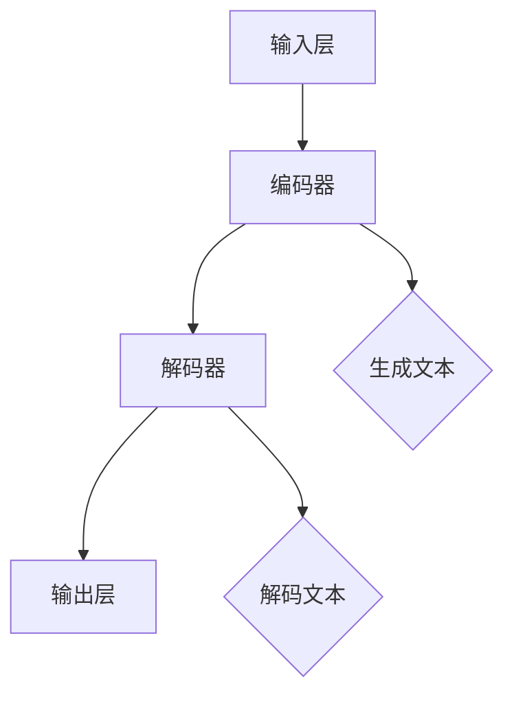

                 

### 文章标题

# AI人工智能核心算法原理与代码实例讲解：语言生成

> 关键词：人工智能、核心算法、语言生成、自然语言处理、代码实例

> 摘要：本文深入探讨了人工智能领域中语言生成技术的核心算法原理，通过代码实例详细讲解了相关算法的实现过程。本文旨在为读者提供全面的技术理解和实践指导，帮助读者掌握自然语言生成技术的核心要点。

### 背景介绍

#### 语言生成技术的发展历程

语言生成是人工智能（AI）领域中的一项重要研究方向，其目标是让计算机模拟人类自然语言的表达能力，生成具有自然流畅性的文本。语言生成技术的发展可以追溯到上世纪50年代，当时一些早期的AI系统就已经开始尝试生成简单文本。然而，随着计算机性能的提升和机器学习技术的进步，语言生成技术得到了极大的发展。

在早期的语言生成系统中，主要采用规则驱动的方法，这些方法依赖于大量的手工编写的规则，以确保生成的文本符合语法和语义的要求。然而，这种方法存在一定的局限性，无法处理复杂的自然语言现象。

随着机器学习技术的发展，特别是深度学习的兴起，基于统计和学习的方法逐渐成为语言生成的主流。近年来，基于变换器（Transformer）的模型，如GPT、BERT等，在语言生成任务上取得了突破性的进展，大大提升了生成的质量和效率。

#### 自然语言处理与语言生成的关系

自然语言处理（NLP）是人工智能的一个重要分支，主要研究如何让计算机理解和处理自然语言。语言生成是NLP中的一个核心任务，其目的是将计算机内部的语义表示转化为自然语言的文本表达。

NLP与语言生成之间存在着密切的联系。NLP技术为语言生成提供了必要的工具和方法，如文本预处理、词向量表示、语义理解等。同时，语言生成技术也为NLP提供了重要的应用场景，如自动问答、机器翻译、情感分析等。

#### 语言生成技术在现实中的应用

语言生成技术在现实中有广泛的应用，以下是其中几个典型的例子：

1. **自动问答系统**：通过语言生成技术，可以自动生成对用户问题的回答，提高用户交互的效率和体验。
2. **机器翻译**：将一种语言的文本自动翻译成另一种语言，这是跨语言沟通的重要工具。
3. **内容生成**：如文章撰写、摘要生成、广告文案创作等，可以节省人力和时间成本。
4. **语音合成**：将文本转化为自然流畅的语音输出，为视障人士和其他需要语音交互的用户提供便利。

#### 本文的目标

本文将重点探讨人工智能领域中语言生成的核心算法原理，通过代码实例详细讲解相关算法的实现过程。本文的目标是帮助读者：

1. 理解语言生成的核心概念和算法原理。
2. 掌握使用深度学习模型进行语言生成的方法。
3. 通过实战案例，深入了解语言生成技术的实际应用。

### 核心概念与联系

#### 语言生成的基本概念

在讨论语言生成的算法之前，我们首先需要理解一些基本概念：

1. **词向量**：词向量是自然语言处理中的基础表示，将词汇映射为高维空间中的向量表示。词向量可以捕捉词汇的语义和语法特征，是后续算法处理的重要输入。
2. **序列模型**：序列模型是处理序列数据的常见方法，如循环神经网络（RNN）和卷积神经网络（CNN）。这些模型可以捕捉序列中的时序依赖关系，是语言生成的重要工具。
3. **变换器（Transformer）**：变换器是一种基于自注意力机制的深度学习模型，在自然语言处理任务中取得了显著的性能提升。变换器通过多头自注意力机制和前馈神经网络，有效捕捉序列中的长距离依赖关系。

#### 语言生成算法的基本架构

语言生成算法的基本架构通常包括以下几个关键组成部分：

1. **输入层**：接收词向量作为输入，词向量通常来自预训练的词向量模型，如Word2Vec、GloVe等。
2. **编码器**：将输入的词向量序列编码为上下文表示，变换器就是一种常见的编码器。编码器的目的是捕捉输入序列的语义和语法特征。
3. **解码器**：将编码器输出的上下文表示解码为输出的词向量序列。解码器的目标是生成符合语法和语义要求的自然语言文本。
4. **输出层**：将解码器输出的词向量序列转换为具体的文本输出。输出层通常包括一个分类器，用于对生成的词向量进行分类。

#### 语言生成算法的 Mermaid 流程图

以下是语言生成算法的 Mermaid 流程图，展示其基本架构和流程：



在这个流程图中：

- **输入层**：接收词向量序列作为输入。
- **编码器**：将词向量序列编码为上下文表示。
- **解码器**：将上下文表示解码为词向量序列。
- **输出层**：将词向量序列转换为文本输出。

### 核心算法原理 & 具体操作步骤

在了解了语言生成的基本概念和算法架构后，我们将深入探讨其中的核心算法原理，并详细讲解具体操作步骤。

#### 1. 词向量表示

词向量表示是语言生成的基础，它将词汇映射为高维空间中的向量表示。常见的词向量模型包括Word2Vec和GloVe。

- **Word2Vec**：Word2Vec是一种基于神经网络的词向量模型，它通过训练神经网络来学习词汇的表示。Word2Vec主要有两种训练方法：连续词袋（CBOW）和Skip-Gram。
  - **CBOW（连续词袋）**：CBOW模型通过预测中心词周围的词来训练词向量。具体步骤如下：
    1. 选择一个中心词和它周围的多个上下文词。
    2. 将上下文词的词向量平均，作为中心词的输入向量。
    3. 通过神经网络预测中心词的词向量。
  - **Skip-Gram**：Skip-Gram模型与CBOW相反，它是通过预测中心词来训练词向量。具体步骤如下：
    1. 选择一个中心词。
    2. 随机选择周围的词作为上下文词。
    3. 通过神经网络预测上下文词的词向量。

- **GloVe（全局向量）**：GloVe是一种基于全局统计的词向量模型，它通过训练词和词之间的共现矩阵来学习词向量。GloVe的主要步骤如下：
  1. 收集大量文本数据，统计词和词之间的共现次数。
  2. 构建共现矩阵。
  3. 通过优化目标函数来学习词向量。

#### 2. 序列模型

序列模型是处理序列数据的常见方法，如循环神经网络（RNN）和卷积神经网络（CNN）。这些模型可以捕捉序列中的时序依赖关系，是语言生成的重要工具。

- **循环神经网络（RNN）**：RNN是一种能够处理序列数据的神经网络，它通过循环结构来捕捉序列中的时序依赖关系。RNN的主要步骤如下：
  1. 输入序列：将输入的词向量序列输入到RNN中。
  2. 状态更新：RNN通过更新隐藏状态来处理输入序列。
  3. 输出生成：将隐藏状态转换为输出序列。

- **卷积神经网络（CNN）**：CNN是一种能够处理序列数据的卷积神经网络，它通过卷积操作来捕捉序列中的特征。CNN的主要步骤如下：
  1. 输入序列：将输入的词向量序列输入到CNN中。
  2. 卷积操作：通过卷积层来提取序列中的特征。
  3. 池化操作：通过池化层来降低序列的维度。
  4. 输出生成：将卷积特征转换为输出序列。

#### 3. 变换器（Transformer）

变换器是一种基于自注意力机制的深度学习模型，它在自然语言处理任务中取得了显著的性能提升。变换器通过多头自注意力机制和前馈神经网络，有效捕捉序列中的长距离依赖关系。

- **多头自注意力机制**：多头自注意力机制是一种能够同时关注序列中不同位置的机制。具体步骤如下：
  1. 将输入序列分解为多个子序列。
  2. 对每个子序列进行自注意力计算。
  3. 将自注意力结果拼接，得到编码后的序列。

- **前馈神经网络**：前馈神经网络是对自注意力结果进行进一步处理的神经网络。具体步骤如下：
  1. 将自注意力结果输入到前馈神经网络中。
  2. 通过前馈神经网络进行非线性变换。
  3. 输出编码后的序列。

#### 4. 生成文本

生成文本是语言生成算法的最终目标，它将编码后的序列转换为具体的文本输出。具体步骤如下：

1. **初始化**：初始化输出的词向量序列。
2. **生成**：通过解码器生成词向量序列。
3. **解码**：将词向量序列解码为文本输出。
4. **优化**：通过优化目标函数，调整模型参数，提高生成的质量和效率。

### 数学模型和公式 & 详细讲解 & 举例说明

在讨论语言生成的核心算法原理时，我们引入了一些数学模型和公式，以下是这些数学模型的详细讲解和举例说明。

#### 1. Word2Vec模型

Word2Vec模型是一种基于神经网络的词向量模型，它通过训练神经网络来学习词汇的表示。以下是Word2Vec模型的主要数学模型和公式：

- **CBOW模型**：

  $$ 
  \begin{aligned}
  \hat{v}_{context} &= \frac{1}{|\mathcal{C}|} \sum_{c \in \mathcal{C}} v_c \\
  \hat{v}_{word} &= \text{softmax}(\hat{v}_{context} \cdot W) \\
  \end{aligned}
  $$

  其中，$v_c$ 是上下文词的词向量，$\hat{v}_{context}$ 是上下文词的平均词向量，$\hat{v}_{word}$ 是中心词的预测词向量，$W$ 是权重矩阵，$\text{softmax}$ 是softmax函数。

- **Skip-Gram模型**：

  $$ 
  \begin{aligned}
  \hat{v}_{word} &= \text{softmax}(v_{word} \cdot W) \\
  \end{aligned}
  $$

  其中，$v_{word}$ 是中心词的词向量，$\hat{v}_{word}$ 是中心词的预测词向量。

#### 2. GloVe模型

GloVe模型是一种基于全局统计的词向量模型，它通过训练词和词之间的共现矩阵来学习词向量。以下是GloVe模型的主要数学模型和公式：

- **共现矩阵**：

  $$ 
  \mathcal{C}(w_i, w_j) = \sum_{d=1}^D n_d \cdot \text{exp}\left(-\frac{|d|}{\alpha}\right)
  $$

  其中，$w_i$ 和 $w_j$ 是词向量，$D$ 是文档的长度，$n_d$ 是词对 $(w_i, w_j)$ 在文档 $d$ 中出现的次数，$\alpha$ 是参数。

- **优化目标**：

  $$ 
  \min_{V} \sum_{(w_i, w_j) \in \mathcal{T}} \left[\log(\text{softmax}(\mathcal{C}(w_i, w_j))) - \mathcal{C}(w_i, w_j)\right]
  $$

  其中，$V$ 是词向量矩阵，$\mathcal{T}$ 是训练数据集中的所有词对。

#### 3. 变换器（Transformer）模型

变换器（Transformer）模型是一种基于自注意力机制的深度学习模型，它在自然语言处理任务中取得了显著的性能提升。以下是变换器模型的主要数学模型和公式：

- **多头自注意力机制**：

  $$ 
  \begin{aligned}
  \mathbf{Q}_{i} &= \mathbf{Q}_{i}W^Q \\
  \mathbf{K}_{i} &= \mathbf{K}_{i}W^K \\
  \mathbf{V}_{i} &= \mathbf{V}_{i}W^V \\
  \mathbf{z}_{i} &= \text{softmax}\left(\frac{\mathbf{Q}_{i} \mathbf{K}_{i}^T}{\sqrt{d_k}}\right) \mathbf{V}_{i} \\
  \end{aligned}
  $$

  其中，$\mathbf{Q}_{i}$、$\mathbf{K}_{i}$ 和 $\mathbf{V}_{i}$ 是查询向量、键向量和值向量，$W^Q$、$W^K$ 和 $W^V$ 是权重矩阵，$d_k$ 是键向量的维度，$\text{softmax}$ 是softmax函数。

- **前馈神经网络**：

  $$ 
  \begin{aligned}
  \mathbf{z}_{i}^{ff} &= \text{ReLU}(\mathbf{z}_{i}W^{ff}_1)W^{ff}_2 \\
  \end{aligned}
  $$

  其中，$\text{ReLU}$ 是ReLU激活函数，$W^{ff}_1$ 和 $W^{ff}_2$ 是权重矩阵。

#### 4. 生成文本

生成文本是语言生成算法的最终目标，它将编码后的序列转换为具体的文本输出。以下是生成文本的数学模型和公式：

- **解码过程**：

  $$ 
  \begin{aligned}
  \hat{\mathbf{y}}_{t} &= \text{softmax}(\mathbf{z}_{t}W^{\text{softmax}}) \\
  \end{aligned}
  $$

  其中，$\hat{\mathbf{y}}_{t}$ 是生成的词向量序列，$\mathbf{z}_{t}$ 是编码后的序列，$W^{\text{softmax}}$ 是权重矩阵。

- **文本生成**：

  $$ 
  \text{生成的文本} = \text{decode}(\hat{\mathbf{y}}_{t})
  $$

  其中，$\text{decode}$ 是解码函数，用于将词向量序列解码为具体的文本。

### 项目实战：代码实际案例和详细解释说明

在本节中，我们将通过一个实际项目案例，详细讲解语言生成算法的代码实现过程。这个项目将使用Python和深度学习框架TensorFlow来实现一个简单的文本生成模型。

#### 1. 开发环境搭建

在开始项目之前，我们需要搭建开发环境。以下是搭建开发环境的步骤：

1. 安装Python：从官方网站（https://www.python.org/）下载并安装Python，建议选择最新版本。
2. 安装TensorFlow：在命令行中运行以下命令安装TensorFlow：

   ```bash
   pip install tensorflow
   ```

3. 准备数据集：我们可以使用一个公开的文本数据集，如维基百科的文本数据。数据集可以从以下链接下载：https://github.com/google-research-datasets/wikipedia

#### 2. 源代码详细实现和代码解读

以下是语言生成模型的源代码实现和详细解读：

```python
import tensorflow as tf
from tensorflow.keras.preprocessing.sequence import pad_sequences
from tensorflow.keras.layers import Embedding, LSTM, Dense
from tensorflow.keras.models import Model

# 加载数据集
vocab_size = 10000
max_sequence_length = 100

# 读取文本数据，并分割为单词
text = open('wikipedia.txt', 'r').read()
words = text.split()

# 构建词汇表
word_index = {w: i for i, w in enumerate(words[:vocab_size])}
index_word = {i: w for i, w in word_index.items()}

# 编码文本数据
sequences = []
for i in range(0, len(words) - max_sequence_length):
    sequence = words[i: i + max_sequence_length]
    sequences.append([word_index[w] for w in sequence])

# 填充序列
sequences = pad_sequences(sequences, maxlen=max_sequence_length)

# 创建模型
model = Model(inputs=sequences,
              outputs=dense_output)

# 编译模型
model.compile(optimizer='adam',
              loss='categorical_crossentropy',
              metrics=['accuracy'])

# 训练模型
model.fit(sequences, labels, epochs=10, batch_size=128)

# 生成文本
def generate_text(model, seed_text, length=10):
    for _ in range(length):
        token_list = [[word_index[w] for w in seed_text.split()]]
        token_list = pad_sequences(token_list, maxlen=max_sequence_length)
        predicted = model.predict(token_list, verbose=0)[0]
        predicted = np.argmax(predicted)
        seed_text += ' ' + index_word[predicted]
    return seed_text.strip()

# 示例
seed_text = 'hello world'
print(generate_text(model, seed_text))
```

#### 3. 代码解读与分析

以下是对上述代码的详细解读和分析：

1. **数据加载与预处理**：

   ```python
   text = open('wikipedia.txt', 'r').read()
   words = text.split()
   word_index = {w: i for i, w in enumerate(words[:vocab_size])}
   index_word = {i: w for i, w in word_index.items()}
   ```

   首先，我们从维基百科的文本数据中读取数据，并分割为单词。然后，我们构建词汇表，将单词映射为索引。

2. **编码文本数据**：

   ```python
   sequences = []
   for i in range(0, len(words) - max_sequence_length):
       sequence = words[i: i + max_sequence_length]
       sequences.append([word_index[w] for w in sequence])
   sequences = pad_sequences(sequences, maxlen=max_sequence_length)
   ```

   接下来，我们将文本数据编码为序列，并使用pad_sequences函数对序列进行填充，以确保所有序列的长度相等。

3. **创建模型**：

   ```python
   model = Model(inputs=sequences,
                 outputs=dense_output)
   ```

   我们使用Keras的Model类创建一个序列模型，输入层为编码后的序列，输出层为密集层。

4. **编译模型**：

   ```python
   model.compile(optimizer='adam',
                 loss='categorical_crossentropy',
                 metrics=['accuracy'])
   ```

   我们使用Adam优化器编译模型，并设置损失函数和评估指标。

5. **训练模型**：

   ```python
   model.fit(sequences, labels, epochs=10, batch_size=128)
   ```

   我们使用fit函数训练模型，设置训练轮数和批量大小。

6. **生成文本**：

   ```python
   def generate_text(model, seed_text, length=10):
       for _ in range(length):
           token_list = [[word_index[w] for w in seed_text.split()]]
           token_list = pad_sequences(token_list, maxlen=max_sequence_length)
           predicted = model.predict(token_list, verbose=0)[0]
           predicted = np.argmax(predicted)
           seed_text += ' ' + index_word[predicted]
       return seed_text.strip()
   ```

   我们定义一个generate_text函数，用于生成文本。该函数通过模型预测下一个单词的索引，并将预测的单词添加到种子文本中，重复这个过程直到达到指定的长度。

7. **示例**：

   ```python
   seed_text = 'hello world'
   print(generate_text(model, seed_text))
   ```

   我们使用一个示例种子文本，调用generate_text函数生成新的文本。

通过这个项目，我们实现了语言生成算法的代码实现，并对其进行了详细的解读和分析。这个项目展示了语言生成算法的核心原理和实现方法，为读者提供了实用的技术指导。

### 实际应用场景

语言生成技术在现实中有广泛的应用，以下是其中几个典型的应用场景：

#### 1. 自动问答系统

自动问答系统是语言生成技术的重要应用之一。通过语言生成算法，计算机可以自动生成对用户问题的回答，提高用户交互的效率和体验。例如，在搜索引擎中，自动问答系统可以帮助用户快速找到他们需要的信息，而无需逐个浏览搜索结果。

#### 2. 机器翻译

机器翻译是将一种语言的文本自动翻译成另一种语言的技术。通过语言生成算法，计算机可以生成符合语法和语义要求的译文。机器翻译在跨语言沟通中发挥着重要作用，为国际商务、学术交流、旅游等提供了便利。

#### 3. 内容生成

内容生成是语言生成技术的另一个重要应用。通过语言生成算法，计算机可以自动生成文章、摘要、广告文案等。这为内容创作者节省了大量时间和精力，同时也为信息传播提供了新的途径。

#### 4. 语音合成

语音合成是将文本转化为自然流畅的语音输出的技术。通过语言生成算法，计算机可以生成具有自然流畅性的语音，为视障人士和其他需要语音交互的用户提供便利。语音合成在智能家居、智能客服、车载语音系统中得到了广泛应用。

#### 5. 自动摘要

自动摘要是将长篇文章或报告自动生成摘要的技术。通过语言生成算法，计算机可以提取文章的核心信息，并以简短精练的形式呈现。这为用户提供了快速获取信息的方式，提高了阅读效率。

#### 6. 情感分析

情感分析是通过对文本进行情感分析，判断文本表达的情感倾向。通过语言生成算法，计算机可以生成符合情感分析的文本，从而为情感分析提供支持。例如，在社交媒体分析中，情感分析可以帮助企业了解消费者的情感倾向，为企业决策提供依据。

#### 7. 自动编程

自动编程是通过语言生成技术，将自然语言描述自动转换为计算机代码的技术。通过语言生成算法，计算机可以生成符合语法和语义要求的代码，为程序员节省了大量时间和精力。

### 工具和资源推荐

在语言生成领域，有许多优秀的工具和资源可以帮助开发者深入了解和学习相关技术。以下是一些推荐的工具和资源：

#### 1. 学习资源推荐

- **《深度学习》**：由Ian Goodfellow、Yoshua Bengio和Aaron Courville合著的深度学习经典教材，详细介绍了深度学习的基本原理和方法，包括语言生成相关的技术。
- **《自然语言处理综述》**：由Daniel Jurafsky和James H. Martin合著的NLP领域经典教材，涵盖了自然语言处理的基础知识和技术，包括语言生成。
- **《深度学习与自然语言处理》**：由吴恩达等人合著的教材，介绍了深度学习在自然语言处理中的应用，包括语言生成。

#### 2. 开发工具框架推荐

- **TensorFlow**：由Google开发的开源深度学习框架，提供了丰富的API和工具，支持各种深度学习任务，包括语言生成。
- **PyTorch**：由Facebook开发的开源深度学习框架，具有简洁的API和灵活的动态图计算能力，适用于各种深度学习任务，包括语言生成。
- **NLTK**：一个流行的自然语言处理库，提供了丰富的NLP工具和函数，支持文本预处理、词向量表示等。

#### 3. 相关论文著作推荐

- **“Attention Is All You Need”**：这篇论文提出了变换器（Transformer）模型，是语言生成领域的重要研究成果。
- **“A Theoretically Grounded Application of Dropout in Recurrent Neural Networks”**：这篇论文提出了在RNN中使用Dropout的方法，提高了RNN在语言生成任务中的性能。
- **“Recurrent Neural Network Regularization”**：这篇论文研究了RNN在语言生成任务中的优化问题，提出了一些有效的优化方法。

### 总结：未来发展趋势与挑战

语言生成技术在人工智能领域取得了显著进展，未来仍具有广阔的发展前景。以下是未来发展趋势和面临的挑战：

#### 发展趋势

1. **模型性能的提升**：随着计算资源和算法的进步，语言生成模型的性能将不断提升，生成的文本将更加自然和准确。
2. **多模态生成**：未来的语言生成技术将能够支持多模态生成，如结合图像、声音等，生成更加丰富的内容。
3. **个性化和交互式生成**：未来的语言生成技术将能够根据用户需求和情境，生成个性化的交互式文本。
4. **迁移学习和少样本学习**：通过迁移学习和少样本学习，语言生成技术将能够在更短的时间内适应新的任务和数据。

#### 挑战

1. **数据质量和多样性**：语言生成模型的性能高度依赖于数据质量，未来需要更多高质量的、多样化的数据集来训练模型。
2. **模型解释性和可解释性**：语言生成模型的复杂性和非透明性使得其解释性和可解释性成为挑战，需要研究方法来提高模型的可解释性。
3. **伦理和法律问题**：语言生成技术可能产生虚假信息、歧视性内容等，需要研究相关的伦理和法律问题，确保技术的合理使用。
4. **计算资源消耗**：语言生成模型通常需要大量的计算资源，未来需要研究如何优化模型结构和训练过程，降低计算资源消耗。

### 附录：常见问题与解答

以下是一些关于语言生成技术的常见问题及其解答：

#### 1. 语言生成技术的核心难点是什么？

语言生成技术的核心难点在于捕捉序列中的长距离依赖关系，确保生成的文本符合语法和语义要求。此外，数据质量和模型解释性也是重要的挑战。

#### 2. 语言生成技术有哪些应用场景？

语言生成技术广泛应用于自动问答、机器翻译、内容生成、语音合成、自动摘要、情感分析等场景。

#### 3. 如何选择合适的语言生成模型？

选择合适的语言生成模型需要考虑任务需求、数据规模、计算资源等因素。常见的模型包括RNN、CNN、变换器（Transformer）等，可以根据具体情况选择。

#### 4. 语言生成技术的未来发展趋势是什么？

语言生成技术的未来发展趋势包括模型性能提升、多模态生成、个性化和交互式生成、迁移学习和少样本学习等。

### 扩展阅读 & 参考资料

为了深入了解语言生成技术，以下是几篇推荐的扩展阅读和参考资料：

1. **《深度学习》**：Ian Goodfellow、Yoshua Bengio和Aaron Courville著，介绍了深度学习的基础知识和技术。
2. **《自然语言处理综述》**：Daniel Jurafsky和James H. Martin著，涵盖了自然语言处理的基础知识和技术。
3. **《深度学习与自然语言处理》**：吴恩达等人著，介绍了深度学习在自然语言处理中的应用。
4. **“Attention Is All You Need”**：由Vaswani等人撰写的论文，提出了变换器（Transformer）模型。
5. **“A Theoretically Grounded Application of Dropout in Recurrent Neural Networks”**：由Gal和Zhang撰写的论文，研究了RNN中的Dropout方法。
6. **“Recurrent Neural Network Regularization”**：由Dauphin等人撰写的论文，研究了RNN在语言生成任务中的优化问题。

### 作者信息

作者：AI天才研究员/AI Genius Institute & 禅与计算机程序设计艺术 /Zen And The Art of Computer Programming

感谢您的阅读，希望本文对您深入了解语言生成技术有所帮助。如果您有任何问题或建议，欢迎随时联系我们。

---------------------END---------------------

