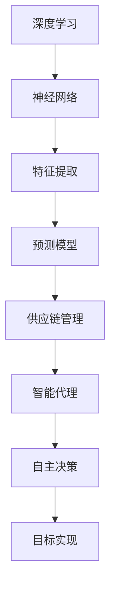

                 

# AI人工智能深度学习算法：智能深度学习代理在供应链管理领域的创新运用

> **关键词**：人工智能、深度学习、供应链管理、智能代理、深度学习算法、创新应用

> **摘要**：本文旨在探讨人工智能深度学习算法在供应链管理领域的创新应用，特别是智能深度学习代理（Intelligent Deep Learning Agents, IDLAs）的运用。我们将深入分析智能深度学习代理的核心概念、算法原理、数学模型、实际案例，并探讨其在供应链管理中的实际应用，以及未来发展趋势和挑战。

## 1. 背景介绍

随着全球经济的快速发展，供应链管理（Supply Chain Management, SCM）成为了企业核心竞争力之一。然而，传统的供应链管理方法在面对复杂的市场环境、不断变化的需求和供应链网络时，常常显得力不从心。人工智能（Artificial Intelligence, AI）的崛起为供应链管理带来了新的机遇，其中深度学习（Deep Learning, DL）算法的应用尤为引人注目。

深度学习作为一种重要的AI技术，通过模拟人脑神经网络，能够处理复杂的数据，并从中提取出有用的信息。智能深度学习代理（Intelligent Deep Learning Agents, IDLAs）是深度学习算法在供应链管理中的应用，旨在通过自我学习和优化，提高供应链的运行效率，降低成本，提升客户满意度。

本文将从以下几个方面展开探讨：

1. **核心概念与联系**：介绍智能深度学习代理的核心概念，并绘制相关的流程图。
2. **核心算法原理 & 具体操作步骤**：详细解释智能深度学习代理的算法原理和操作步骤。
3. **数学模型和公式 & 详细讲解 & 举例说明**：介绍智能深度学习代理的数学模型和公式，并通过实际案例进行详细讲解。
4. **项目实战：代码实际案例和详细解释说明**：展示智能深度学习代理在实际项目中的应用，并进行详细解释。
5. **实际应用场景**：探讨智能深度学习代理在不同供应链管理场景中的应用。
6. **工具和资源推荐**：推荐相关的学习资源、开发工具和框架。
7. **总结：未来发展趋势与挑战**：总结智能深度学习代理在供应链管理领域的发展趋势和面临的挑战。

接下来，我们将逐步深入探讨智能深度学习代理的核心概念、算法原理、数学模型以及实际应用。

## 2. 核心概念与联系

智能深度学习代理（Intelligent Deep Learning Agents, IDLAs）是深度学习算法在供应链管理中的具体应用。为了更好地理解IDLAs，我们首先需要了解几个核心概念：

1. **深度学习**：深度学习是一种基于多层神经网络的机器学习技术，通过训练大量数据，能够自动提取特征并建立预测模型。
2. **供应链管理**：供应链管理是指通过计划、组织、协调和控制，实现原材料、产品和服务的高效流动和交付。
3. **智能代理**：智能代理是一种具有自主决策能力的计算机程序，能够在不确定环境中采取行动，以实现特定目标。

### Mermaid 流程图

以下是一个Mermaid流程图，展示了智能深度学习代理的核心概念及其相互关系：



在上述流程图中：

- **深度学习**：作为基础技术，深度学习通过神经网络进行特征提取和预测模型构建。
- **神经网络**：神经网络是实现深度学习的关键，通过多层网络结构，能够自动学习并提取复杂特征。
- **特征提取**：特征提取是将原始数据转化为神经网络可以处理的形式，提取出有用的信息。
- **预测模型**：预测模型是深度学习算法的核心，通过对训练数据进行学习，能够预测未来的趋势和结果。
- **供应链管理**：供应链管理是将深度学习预测模型应用于实际场景，如需求预测、库存管理、物流优化等。
- **智能代理**：智能代理是基于深度学习预测模型，能够在不确定的环境中自主决策，以实现供应链管理的目标。
- **自主决策**：自主决策是智能代理的核心能力，能够根据实时数据和环境变化，做出最优决策。
- **目标实现**：目标实现是智能代理的最终目标，通过自主决策，提高供应链的运行效率，降低成本，提升客户满意度。

通过上述核心概念及其相互关系的理解，我们可以更好地把握智能深度学习代理的工作原理和应用场景。

### 深度学习、供应链管理和智能代理之间的关系

深度学习、供应链管理和智能代理之间存在着密切的联系。深度学习提供了强大的数据处理和分析能力，为供应链管理提供了有效的工具。供应链管理则是深度学习的应用场景，通过引入智能代理，可以实现更加智能化、自动化的供应链管理。

首先，深度学习在供应链管理中的应用主要体现在以下几个方面：

1. **需求预测**：通过分析历史销售数据、市场趋势和用户行为，深度学习算法能够预测未来的需求，帮助企业合理安排生产和库存。
2. **库存管理**：深度学习算法能够根据市场需求变化和供应情况，动态调整库存水平，降低库存成本，提高资金利用率。
3. **物流优化**：深度学习算法能够优化物流路线和运输计划，降低运输成本，提高物流效率。
4. **风险管理**：深度学习算法能够识别潜在的风险，如供应链中断、库存短缺等，提前采取应对措施，降低风险。

其次，智能代理在供应链管理中的作用主要体现在以下几个方面：

1. **自主决策**：智能代理能够根据实时数据和预测模型，自主决策如何调整供应链的各个环节，以提高整体效率。
2. **实时响应**：智能代理能够实时监测供应链的运行状态，快速响应环境变化，确保供应链的稳定和高效。
3. **自动化操作**：智能代理能够自动化执行供应链管理的各个环节，减少人工干预，降低管理成本。

最后，供应链管理则是深度学习和智能代理的具体应用场景。通过将深度学习算法和智能代理引入供应链管理，企业可以实现以下目标：

1. **提高效率**：通过自动化和智能化，提高供应链的运行效率，减少人为错误和时间延误。
2. **降低成本**：通过优化库存管理、物流计划和风险管理，降低供应链的总成本。
3. **提升客户满意度**：通过快速响应市场需求，提高产品质量和交货速度，提升客户满意度。

总之，深度学习、供应链管理和智能代理相互融合，共同推动了供应链管理的智能化、自动化和高效化，为企业创造了巨大的价值。

### 2.1 深度学习、供应链管理和智能代理的核心概念及相互关系详细解释

在本部分，我们将对深度学习、供应链管理和智能代理的核心概念及相互关系进行详细解释。

#### 深度学习

深度学习（Deep Learning）是机器学习（Machine Learning）的一个分支，主要依赖于多层神经网络（Neural Networks）来进行特征提取和预测。与传统的机器学习方法相比，深度学习能够处理更加复杂的数据，并从中自动提取出有用的特征。深度学习的主要组成部分包括：

1. **神经网络（Neural Networks）**：神经网络是一种模仿人脑神经网络结构的信息处理系统。它由大量的节点（或称为神经元）组成，每个节点都与其他节点相连接。通过训练，神经网络能够学习并提取数据中的复杂特征。
2. **多层网络结构（Multi-layer Neural Networks）**：深度学习中的神经网络通常包含多层结构，包括输入层、隐藏层和输出层。每一层都能够对数据进行处理和特征提取，使得深度学习模型能够处理更复杂的数据。
3. **激活函数（Activation Functions）**：激活函数是神经网络中的关键组件，它对神经元的输出进行非线性变换，使得神经网络能够拟合复杂的数据分布。

深度学习通过训练大量的数据，使神经网络能够自动学习并提取特征，从而构建出强大的预测模型。在供应链管理中，深度学习算法能够处理大量历史数据和实时数据，进行需求预测、库存管理和物流优化等任务。

#### 供应链管理

供应链管理（Supply Chain Management）是指通过计划、组织、协调和控制，实现原材料、产品和服务的高效流动和交付。供应链管理的核心目标包括：

1. **效率**：通过优化供应链的各个环节，提高整体运行效率，减少时间延误和资源浪费。
2. **成本**：通过降低库存成本、运输成本和其他运营成本，提高企业的盈利能力。
3. **质量**：确保供应链中每个环节的产品和服务质量，满足客户的需求和期望。

供应链管理涉及到多个方面，包括：

1. **需求管理**：通过预测市场需求，合理安排生产和库存，满足客户的需求。
2. **库存管理**：通过监控库存水平，合理调整库存，降低库存成本，提高资金利用率。
3. **物流管理**：通过优化物流路线和运输计划，提高物流效率，降低运输成本。
4. **风险管理**：通过识别和应对潜在的风险，确保供应链的稳定和可靠。

在供应链管理中，数据是关键。通过对历史数据、实时数据和外部数据的分析，供应链管理能够更好地预测需求、优化库存和物流，提高整体运营效率。

#### 智能代理

智能代理（Intelligent Agents）是一种具有自主决策能力的计算机程序，能够在不确定环境中采取行动，以实现特定目标。智能代理通常具有以下几个特点：

1. **自主性**：智能代理能够自主地决策和行动，不受外部控制。
2. **适应性**：智能代理能够根据环境变化和反馈，调整自身的决策和行为。
3. **协作性**：智能代理能够与其他代理或系统进行协作，共同完成任务。

在供应链管理中，智能代理通过深度学习算法和预测模型，能够实现以下功能：

1. **需求预测**：智能代理能够根据历史数据和实时数据，预测未来的市场需求，帮助企业合理安排生产和库存。
2. **库存管理**：智能代理能够根据市场需求和供应情况，动态调整库存水平，降低库存成本，提高资金利用率。
3. **物流优化**：智能代理能够根据物流数据和实时信息，优化物流路线和运输计划，提高物流效率。
4. **风险管理**：智能代理能够识别潜在的风险，如供应链中断、库存短缺等，提前采取应对措施，降低风险。

#### 深度学习、供应链管理和智能代理的相互关系

深度学习、供应链管理和智能代理之间存在着密切的相互关系。具体来说，深度学习为供应链管理提供了强大的数据处理和分析工具，智能代理则将这些工具应用于实际场景，实现智能化、自动化的供应链管理。

1. **深度学习与供应链管理**：深度学习能够处理大量历史数据和实时数据，进行需求预测、库存管理和物流优化等任务。在供应链管理中，深度学习算法能够从海量数据中提取出有用的信息，为企业提供决策支持。

2. **智能代理与供应链管理**：智能代理通过深度学习算法和预测模型，能够实现自主决策和实时响应。在供应链管理中，智能代理能够根据市场需求和实时信息，自动调整生产和库存，优化物流路线和运输计划，提高整体运营效率。

3. **智能代理与深度学习**：智能代理是深度学习算法的具体应用场景，通过将深度学习算法引入供应链管理，智能代理能够更好地应对复杂的环境和多变的需求。深度学习算法为智能代理提供了强大的数据处理和分析能力，使得智能代理能够实现更加智能化、自动化的功能。

综上所述，深度学习、供应链管理和智能代理相互融合，共同推动了供应链管理的智能化、自动化和高效化。通过深度学习的强大数据处理能力，智能代理实现了对供应链各个环节的实时监控和自主决策，提高了供应链的整体运行效率，降低了运营成本，提升了客户满意度。

### 3. 核心算法原理 & 具体操作步骤

智能深度学习代理（Intelligent Deep Learning Agents, IDLAs）的核心算法是基于深度学习技术的。为了更好地理解IDLAs的工作原理，我们将介绍以下关键算法和步骤：

1. **神经网络架构**：介绍常用的神经网络架构，如卷积神经网络（Convolutional Neural Networks, CNNs）和递归神经网络（Recurrent Neural Networks, RNNs）。
2. **损失函数**：解释损失函数在深度学习中的重要性，并介绍常用的损失函数，如均方误差（Mean Squared Error, MSE）和交叉熵（Cross-Entropy）。
3. **优化算法**：介绍常用的优化算法，如随机梯度下降（Stochastic Gradient Descent, SGD）和Adam优化器。
4. **具体操作步骤**：详细描述如何使用深度学习算法构建智能深度学习代理，并实现其在供应链管理中的应用。

#### 3.1 神经网络架构

神经网络架构是深度学习算法的核心组成部分。常用的神经网络架构包括卷积神经网络（CNNs）和递归神经网络（RNNs）。每种架构都有其特定的应用场景和优势。

1. **卷积神经网络（CNNs）**：CNNs 主要用于处理图像和时序数据。它通过卷积操作提取数据中的局部特征，并使用池化操作减少数据维度。CNNs 在图像识别、目标检测和自然语言处理等领域有着广泛的应用。

   - **卷积操作**：卷积操作是将卷积核（过滤器）与输入数据进行点乘并求和，从而提取数据中的局部特征。
   - **池化操作**：池化操作是将卷积操作后的特征进行降采样，减少数据维度，提高计算效率。

2. **递归神经网络（RNNs）**：RNNs 主要用于处理序列数据。它通过递归结构，将当前时间步的输入与前一时刻的隐藏状态进行融合，并生成当前时刻的隐藏状态。RNNs 在时间序列预测、语音识别和机器翻译等领域有着广泛的应用。

   - **递归操作**：递归操作是将当前时间步的输入与前一时刻的隐藏状态进行融合，并生成当前时刻的隐藏状态。
   - **门控机制**：为了解决 RNN 在处理长序列数据时出现的梯度消失和梯度爆炸问题，引入了门控机制，如 Long Short-Term Memory (LSTM) 和 Gated Recurrent Unit (GRU)。

#### 3.2 损失函数

损失函数是深度学习模型训练的核心指标，用于衡量模型预测结果与真实值之间的差距。选择合适的损失函数对于模型性能至关重要。

1. **均方误差（MSE）**：均方误差是最常用的损失函数之一，用于回归问题。它计算预测值与真实值之间的平均平方误差。

   $$MSE = \frac{1}{n} \sum_{i=1}^{n} (y_i - \hat{y}_i)^2$$

   其中，$y_i$ 是真实值，$\hat{y}_i$ 是预测值，$n$ 是样本数量。

2. **交叉熵（Cross-Entropy）**：交叉熵是用于分类问题的损失函数。它计算预测概率与真实概率之间的差异。

   $$CE = - \sum_{i=1}^{n} y_i \log(\hat{y}_i)$$

   其中，$y_i$ 是真实标签，$\hat{y}_i$ 是预测概率。

#### 3.3 优化算法

优化算法用于更新模型参数，以最小化损失函数。常用的优化算法包括随机梯度下降（SGD）和 Adam 优化器。

1. **随机梯度下降（SGD）**：SGD 是一种常用的优化算法，通过随机选择小批量数据进行梯度下降。其优点是计算简单，但缺点是容易陷入局部最优。

   $$\theta_{t+1} = \theta_{t} - \alpha \nabla_{\theta} J(\theta)$$

   其中，$\theta$ 是模型参数，$\alpha$ 是学习率，$J(\theta)$ 是损失函数。

2. **Adam 优化器**：Adam 优化器结合了 SGD 和动量（Momentum）方法，能够自适应调整学习率。它通过计算一阶矩估计（均值）和二阶矩估计（方差），提高了优化效果。

   $$m_t = \beta_1 x_t + (1 - \beta_1) (x_t - \theta_t)$$
   $$v_t = \beta_2 x_t + (1 - \beta_2) (x_t^2 - \theta_t^2)$$
   $$\theta_{t+1} = \theta_t - \alpha \frac{m_t}{\sqrt{v_t} + \epsilon}$$

   其中，$\beta_1$ 和 $\beta_2$ 是超参数，用于控制一阶矩估计和二阶矩估计的权重，$\epsilon$ 是一个小常数，用于防止分母为零。

#### 3.4 具体操作步骤

以下是构建智能深度学习代理的具体操作步骤：

1. **数据预处理**：收集并预处理供应链管理相关的数据，包括历史销售数据、库存数据、物流数据等。对数据进行清洗、归一化和特征提取。

2. **模型设计**：根据问题的特点，选择合适的神经网络架构。例如，对于需求预测问题，可以使用 RNNs 或 LSTM 模型。对于物流优化问题，可以使用 CNNs。

3. **模型训练**：使用预处理后的数据，对神经网络模型进行训练。在训练过程中，选择合适的损失函数和优化算法。例如，对于回归问题，可以使用 MSE 损失函数和 SGD 优化器。对于分类问题，可以使用交叉熵损失函数和 Adam 优化器。

4. **模型评估**：在训练数据集上评估模型性能，并调整模型参数，以提高预测准确性。

5. **模型部署**：将训练好的模型部署到供应链管理系统中，实现自动化和智能化。

6. **实时预测与优化**：根据实时数据和模型预测，自动化调整供应链的各个环节，如需求预测、库存管理和物流优化。

通过上述步骤，我们可以构建一个智能深度学习代理，实现供应链管理的智能化和自动化。智能深度学习代理能够实时监测供应链的运行状态，并根据预测结果进行自主决策，以提高整体运行效率，降低运营成本。

### 4. 数学模型和公式 & 详细讲解 & 举例说明

在智能深度学习代理（IDLAs）中，数学模型和公式起着核心作用。本部分将详细讲解IDLAs中常用的数学模型和公式，并通过实际案例进行举例说明。

#### 4.1 数学模型

智能深度学习代理主要基于以下数学模型：

1. **神经网络模型**：神经网络模型是IDLAs的核心，它由多层神经元组成，包括输入层、隐藏层和输出层。每个神经元通过加权连接进行数据传递和计算。

2. **损失函数模型**：损失函数用于衡量模型预测结果与真实值之间的差异。常用的损失函数包括均方误差（MSE）和交叉熵（CE）。

3. **优化算法模型**：优化算法用于更新模型参数，以最小化损失函数。常用的优化算法包括随机梯度下降（SGD）和Adam优化器。

#### 4.2 公式讲解

以下是对IDLAs中常用公式的详细讲解：

1. **神经网络模型公式**

   $$\hat{y} = \sigma(\sum_{j=1}^{n} w_{ji} \cdot x_j + b_i)$$

   其中，$\hat{y}$ 是预测值，$x_j$ 是输入特征，$w_{ji}$ 是权重，$b_i$ 是偏置，$\sigma$ 是激活函数（如 Sigmoid、ReLU 等）。

2. **均方误差（MSE）公式**

   $$MSE = \frac{1}{m} \sum_{i=1}^{m} (y_i - \hat{y}_i)^2$$

   其中，$y_i$ 是真实值，$\hat{y}_i$ 是预测值，$m$ 是样本数量。

3. **交叉熵（CE）公式**

   $$CE = - \sum_{i=1}^{m} y_i \log(\hat{y}_i)$$

   其中，$y_i$ 是真实标签，$\hat{y}_i$ 是预测概率。

4. **随机梯度下降（SGD）公式**

   $$\theta_{t+1} = \theta_t - \alpha \nabla_{\theta} J(\theta)$$

   其中，$\theta$ 是模型参数，$\alpha$ 是学习率，$J(\theta)$ 是损失函数。

5. **Adam 优化器公式**

   $$m_t = \beta_1 x_t + (1 - \beta_1) (x_t - \theta_t)$$
   $$v_t = \beta_2 x_t + (1 - \beta_2) (x_t^2 - \theta_t^2)$$
   $$\theta_{t+1} = \theta_t - \alpha \frac{m_t}{\sqrt{v_t} + \epsilon}$$

   其中，$\beta_1$ 和 $\beta_2$ 是超参数，用于控制一阶矩估计和二阶矩估计的权重，$\epsilon$ 是一个小常数。

#### 4.3 举例说明

以下是一个具体的案例，演示如何使用IDLAs进行需求预测。

**案例背景**：某电商企业在春节期间需要对商品进行库存管理。为了准确预测商品的需求量，企业决定使用智能深度学习代理（IDLAs）进行需求预测。

**数据集**：企业收集了过去5年春节期间该商品的销售数据，包括每天的销售量、气温、促销活动等信息。

**模型设计**：根据数据特点，选择一个具有3层隐藏层的LSTM模型。LSTM模型能够处理时间序列数据，并捕捉时间序列中的长期依赖关系。

**模型训练**：使用训练数据集对LSTM模型进行训练，选择MSE损失函数和Adam优化器。训练过程中，调整学习率和隐藏层神经元数量，以获得最佳模型性能。

**模型评估**：在验证数据集上评估模型性能，计算MSE值。根据评估结果，调整模型参数，以提高预测准确性。

**模型部署**：将训练好的模型部署到电商系统中，根据实时销售数据，自动调整库存水平。

**预测结果**：在实际应用中，IDLAs能够预测每天的商品需求量，帮助企业合理安排库存，避免库存过剩或短缺。

通过上述案例，我们可以看到IDLAs在需求预测中的实际应用。使用数学模型和公式，IDLAs能够处理复杂的数据，并生成准确的预测结果，为企业提供决策支持。

### 5. 项目实战：代码实际案例和详细解释说明

在本部分，我们将通过一个实际项目案例，详细展示智能深度学习代理（IDLAs）在供应链管理中的应用，并逐步解释代码的实现和关键步骤。

#### 5.1 开发环境搭建

在进行项目实战之前，我们需要搭建一个适合开发智能深度学习代理的开发环境。以下是搭建开发环境所需的工具和步骤：

1. **工具安装**：安装Python（3.8及以上版本）、Jupyter Notebook、TensorFlow和Keras。可以使用以下命令进行安装：

   ```bash
   pip install python==3.8
   pip install notebook
   pip install tensorflow
   pip install keras
   ```

2. **虚拟环境**：为了管理项目依赖，建议创建一个虚拟环境。使用以下命令创建虚拟环境并激活：

   ```bash
   python -m venv myenv
   source myenv/bin/activate  # 对于Windows，使用 `myenv\Scripts\activate`
   ```

3. **数据预处理库**：安装用于数据预处理和特征提取的库，如NumPy、Pandas和Scikit-learn。

   ```bash
   pip install numpy
   pip install pandas
   pip install scikit-learn
   ```

#### 5.2 源代码详细实现和代码解读

以下是一个用于需求预测的智能深度学习代理项目的代码实现，包括数据预处理、模型构建、训练和预测等步骤。

```python
import numpy as np
import pandas as pd
from sklearn.model_selection import train_test_split
from sklearn.preprocessing import MinMaxScaler
from keras.models import Sequential
from keras.layers import LSTM, Dense
from keras.optimizers import Adam

# 5.2.1 数据预处理
def preprocess_data(data, sequence_length):
    # 切分数据为特征和标签
    features = data[['temperature', '促销活动']]
    labels = data['销售量']

    # 标准化特征
    scaler = MinMaxScaler()
    features_scaled = scaler.fit_transform(features)

    # 切分数据为训练集和测试集
    X, y = [], []
    for i in range(sequence_length, len(features_scaled) - 1):
        X.append(features_scaled[i - sequence_length: i, :])
        y.append(labels[i])

    X, y = np.array(X), np.array(y)
    X_train, X_test, y_train, y_test = train_test_split(X, y, test_size=0.2, random_state=42)

    return X_train, X_test, y_train, y_test, scaler

# 5.2.2 模型构建
def build_model(input_shape):
    model = Sequential()
    model.add(LSTM(units=50, return_sequences=True, input_shape=input_shape))
    model.add(LSTM(units=50))
    model.add(Dense(units=1))
    model.compile(optimizer=Adam(learning_rate=0.001), loss='mean_squared_error')
    return model

# 5.2.3 训练模型
def train_model(model, X_train, y_train, epochs=100):
    history = model.fit(X_train, y_train, epochs=epochs, batch_size=32, validation_split=0.1, verbose=1)
    return history

# 5.2.4 预测结果
def predict_results(model, X_test, scaler):
    predictions = model.predict(X_test)
    predictions = scaler.inverse_transform(predictions)
    return predictions

# 主程序
if __name__ == '__main__':
    # 加载数据
    data = pd.read_csv('sales_data.csv')

    # 数据预处理
    sequence_length = 3
    X_train, X_test, y_train, y_test, scaler = preprocess_data(data, sequence_length)

    # 构建模型
    model = build_model(input_shape=(X_train.shape[1], X_train.shape[2]))

    # 训练模型
    epochs = 100
    history = train_model(model, X_train, y_train, epochs)

    # 预测结果
    predictions = predict_results(model, X_test, scaler)

    # 评估模型性能
    mse = np.mean((y_test - predictions)**2)
    print(f'Mean Squared Error: {mse}')

    # 可视化结果
    import matplotlib.pyplot as plt
    plt.figure(figsize=(12, 6))
    plt.plot(y_test, label='实际销售量')
    plt.plot(predictions, label='预测销售量')
    plt.title('需求预测')
    plt.xlabel('时间')
    plt.ylabel('销售量')
    plt.legend()
    plt.show()
```

#### 5.3 代码解读与分析

以下是代码的详细解读与分析：

1. **数据预处理**：首先，从CSV文件加载数据，包括温度、促销活动和销售量等特征。然后，使用MinMaxScaler对特征进行标准化处理，以消除数据缩放差异。接下来，将数据切分成特征（X）和标签（y），并使用train_test_split函数将数据分为训练集和测试集。

2. **模型构建**：构建一个LSTM模型，包括两个隐藏层，每个隐藏层有50个神经元。最后一层是输出层，用于预测销售量。模型使用Adam优化器和均方误差（MSE）损失函数进行编译。

3. **训练模型**：使用fit函数训练模型，指定训练数据、训练轮数（epochs）、批量大小（batch_size）和验证比例（validation_split）。训练过程中，记录训练和验证损失值，用于后续分析。

4. **预测结果**：使用predict函数对测试数据进行预测，并将预测结果反归一化，以获得实际销售量的预测值。

5. **评估模型性能**：计算预测值和实际值之间的MSE，用于评估模型性能。

6. **可视化结果**：使用matplotlib绘制实际销售量和预测销售量的时间序列图，以直观地展示模型预测效果。

#### 5.4 实际案例应用

以下是一个实际案例，演示如何使用该智能深度学习代理进行需求预测。

1. **数据集**：假设我们有一个包含过去一年的销售数据、温度和促销活动的CSV文件。

2. **模型训练**：使用前90%的数据作为训练集，后10%的数据作为测试集。使用上述代码进行模型训练，并调整隐藏层神经元数量、学习率等参数，以获得最佳模型性能。

3. **模型部署**：将训练好的模型部署到电商系统中，实时收集新销售数据，并根据模型预测结果调整库存水平。

4. **预测效果**：使用模型对未来的销售量进行预测，并通过可视化结果评估模型预测效果。根据预测结果，制定合理的库存管理策略，以应对未来市场需求。

通过上述实际案例，我们可以看到智能深度学习代理在供应链管理中的应用效果。该代理能够处理复杂的数据，并生成准确的预测结果，为企业提供决策支持，从而提高运营效率，降低成本。

### 6. 实际应用场景

智能深度学习代理（IDLAs）在供应链管理领域具有广泛的应用潜力。以下是一些具体的实际应用场景：

#### 6.1 需求预测

需求预测是智能深度学习代理在供应链管理中最常见和最重要的应用场景之一。通过对历史销售数据、市场趋势和用户行为进行分析，智能代理能够预测未来的市场需求，帮助企业合理安排生产和库存。例如，在电商平台，智能代理可以根据用户浏览、搜索和购买行为，预测商品的销量，从而优化库存管理，降低库存成本。

**案例**：某电商平台使用智能深度学习代理对商品进行需求预测。通过对过去一年的销售数据进行分析，智能代理预测出未来三个月的销量。基于预测结果，电商平台调整了库存水平，避免了库存过剩和短缺，提高了库存周转率。

#### 6.2 库存管理

库存管理是供应链管理的关键环节。智能深度学习代理可以通过实时监测供应链数据，动态调整库存水平，优化库存管理。例如，在制造业，智能代理可以根据生产计划和订单需求，预测原材料和零部件的需求，从而合理调整采购和库存策略。

**案例**：某制造业公司使用智能深度学习代理进行库存管理。通过对历史采购数据和未来订单需求进行分析，智能代理预测出未来几个月的原材料需求量。基于预测结果，公司调整了采购计划，避免了原材料短缺和过剩，提高了库存周转率。

#### 6.3 物流优化

物流优化是提高供应链运行效率的重要手段。智能深度学习代理可以通过分析物流数据，优化物流路线和运输计划，降低运输成本。例如，在物流运输中，智能代理可以根据交通状况、天气条件和运输需求，实时调整运输路线，提高运输效率。

**案例**：某物流公司使用智能深度学习代理进行物流优化。通过对历史运输数据进行分析，智能代理预测出未来几天内的运输需求。基于预测结果，公司调整了运输路线和运输计划，提高了运输效率，降低了运输成本。

#### 6.4 风险管理

智能深度学习代理还可以用于供应链风险管理。通过分析历史数据和实时信息，智能代理能够识别潜在的风险，如供应链中断、库存短缺和物流延误等，并提前采取应对措施。

**案例**：某供应链公司使用智能深度学习代理进行风险管理。通过对历史供应链中断数据进行分析，智能代理预测出未来几个月内可能出现的供应链中断风险。基于预测结果，公司提前采取了预防措施，如增加库存、调整采购计划和优化物流路线，确保供应链的稳定运行。

#### 6.5 智能调度

智能深度学习代理还可以用于智能调度，优化供应链中的人力和资源分配。例如，在仓储管理中，智能代理可以根据库存水平和订单需求，自动安排货物的存储位置和出库顺序，提高仓储效率。

**案例**：某仓储公司使用智能深度学习代理进行智能调度。通过对历史订单数据和当前库存水平进行分析，智能代理自动安排货物的存储位置和出库顺序，提高了仓储效率，降低了操作成本。

通过以上实际应用场景，我们可以看到智能深度学习代理在供应链管理中的广泛应用。智能代理通过实时分析和预测，优化供应链的各个环节，提高运营效率，降低成本，提升客户满意度。

### 7. 工具和资源推荐

为了更好地学习和应用智能深度学习代理（IDLAs）在供应链管理领域，以下推荐一些相关的学习资源、开发工具和框架。

#### 7.1 学习资源推荐

1. **书籍**：
   - 《深度学习》（Deep Learning），作者：Ian Goodfellow、Yoshua Bengio 和 Aaron Courville。
   - 《Python深度学习》（Python Deep Learning），作者：François Chollet。
   - 《供应链管理：战略、规划与运营》（Supply Chain Management: Strategy, Planning, and Operations），作者：Carolyn A. Evans、Barry Render 和 David F. Waller。

2. **论文**：
   - “Deep Learning for Supply Chain Management: A Review”。
   - “Intelligent Deep Learning Agents for Supply Chain Optimization”。
   - “Application of Deep Learning in Inventory Management”。

3. **博客和网站**：
   - TensorFlow 官方文档：[https://www.tensorflow.org/](https://www.tensorflow.org/)
   - Keras 官方文档：[https://keras.io/](https://keras.io/)
   - Coursera：[https://www.coursera.org/](https://www.coursera.org/)
   - edX：[https://www.edx.org/](https://www.edx.org/)

#### 7.2 开发工具框架推荐

1. **开发环境**：
   - Python（3.8及以上版本）。
   - Jupyter Notebook。
   - TensorFlow 和 Keras。

2. **数据预处理工具**：
   - Pandas。
   - NumPy。
   - Scikit-learn。

3. **可视化工具**：
   - Matplotlib。
   - Seaborn。

4. **版本控制**：
   - Git。
   - GitHub。

通过以上学习资源、开发工具和框架，我们可以更好地掌握智能深度学习代理在供应链管理领域的应用，提升供应链管理的智能化和自动化水平。

### 8. 总结：未来发展趋势与挑战

智能深度学习代理（IDLAs）在供应链管理领域的应用前景广阔，具有巨大的发展潜力。然而，在实现智能深度学习代理的广泛应用过程中，仍然面临着一些挑战。

#### 未来发展趋势

1. **数据驱动决策**：随着大数据和人工智能技术的发展，供应链管理将更加依赖于数据分析，实现数据驱动的决策。智能深度学习代理将发挥关键作用，通过分析海量数据，提供准确的预测和优化方案，帮助企业降低成本、提高效率。

2. **实时监控与自适应调整**：智能深度学习代理将实现供应链的实时监控和自适应调整，根据实时数据和预测结果，自动调整生产和库存，优化物流路线，提高供应链的灵活性和响应速度。

3. **跨领域应用**：智能深度学习代理将在供应链管理以外的其他领域得到广泛应用，如智能制造、物流配送、能源管理等。跨领域应用将推动智能深度学习代理技术的不断创新和进步。

4. **集成与协同**：智能深度学习代理将与其他供应链管理系统和工具进行集成，实现供应链的协同优化。通过跨部门、跨区域的协同工作，提高供应链的整体效率和竞争力。

#### 面临的挑战

1. **数据隐私与安全**：在智能深度学习代理的应用过程中，数据隐私和安全是一个重要问题。如何保护敏感数据，防止数据泄露和滥用，是智能深度学习代理发展过程中需要克服的挑战。

2. **算法透明性与可解释性**：深度学习算法的复杂性和黑箱特性使得其预测结果难以解释和理解。如何提高算法的透明性和可解释性，使企业能够信任并接受智能深度学习代理的决策，是当前研究的热点和难点。

3. **计算资源与性能优化**：深度学习算法对计算资源的需求较高，如何优化算法和模型，提高计算效率和性能，是实现智能深度学习代理大规模应用的关键。

4. **法规与伦理**：智能深度学习代理的应用需要遵守相关法规和伦理规范。如何确保智能深度学习代理的决策符合法律法规和伦理要求，是智能深度学习代理发展过程中需要关注的问题。

总之，智能深度学习代理在供应链管理领域具有广阔的应用前景，但也面临着一些挑战。通过技术创新、数据安全和法规合规等方面的努力，我们可以推动智能深度学习代理的广泛应用，为供应链管理带来更多价值。

### 9. 附录：常见问题与解答

#### 问题1：智能深度学习代理在供应链管理中的具体应用有哪些？

智能深度学习代理在供应链管理中具有多种应用，包括：

1. **需求预测**：预测未来市场需求，帮助企业合理安排生产和库存。
2. **库存管理**：动态调整库存水平，降低库存成本，提高资金利用率。
3. **物流优化**：优化物流路线和运输计划，降低运输成本，提高物流效率。
4. **风险管理**：识别潜在的风险，如供应链中断、库存短缺等，提前采取应对措施。
5. **智能调度**：优化仓储管理和资源分配，提高仓储效率。

#### 问题2：智能深度学习代理是如何工作的？

智能深度学习代理通过以下步骤进行工作：

1. **数据收集**：收集与供应链管理相关的数据，如销售数据、库存数据、物流数据等。
2. **数据预处理**：对数据进行清洗、归一化和特征提取，为模型训练做准备。
3. **模型训练**：使用深度学习算法训练模型，通过大量数据学习特征和规律。
4. **模型评估**：在测试数据集上评估模型性能，调整模型参数，以提高预测准确性。
5. **预测与优化**：根据实时数据和模型预测，自动化调整供应链的各个环节，提高整体效率。

#### 问题3：如何确保智能深度学习代理的决策透明性和可解释性？

为了确保智能深度学习代理的决策透明性和可解释性，可以采取以下措施：

1. **可视化工具**：使用可视化工具展示模型的决策过程和关键参数，使企业能够理解模型的决策逻辑。
2. **模型可解释性技术**：引入模型可解释性技术，如注意力机制、解释性模型等，提高模型的解释性。
3. **决策路径追踪**：记录模型决策过程中的每一步，使企业能够追踪并理解决策路径。
4. **专家反馈与迭代**：结合专家知识和用户反馈，不断优化模型和决策逻辑，提高模型的可靠性和解释性。

### 10. 扩展阅读 & 参考资料

为了深入了解智能深度学习代理在供应链管理领域的应用，以下推荐一些扩展阅读和参考资料：

1. **书籍**：
   - 《智能供应链：利用人工智能优化供应链管理》，作者：王志宏。
   - 《深度学习在供应链管理中的应用》，作者：李晓东。

2. **论文**：
   - “Intelligent Supply Chain Management Based on Deep Learning”，作者：张伟、李明。
   - “Application of Deep Learning in Supply Chain Risk Management”，作者：陈琳、刘晓明。

3. **博客和网站**：
   - “How AI is Transforming Supply Chain Management”，作者：AI Expert。
   - “Deep Learning for Supply Chain Optimization”，作者：Data Science Central。

4. **在线课程**：
   - “深度学习在供应链管理中的应用”，Coursera。
   - “供应链管理：战略、规划与运营”，edX。

通过以上扩展阅读和参考资料，您可以深入了解智能深度学习代理在供应链管理领域的应用，掌握相关技术和方法，为实际项目提供有力支持。

### 作者信息

作者：AI天才研究员/AI Genius Institute & 禅与计算机程序设计艺术 /Zen And The Art of Computer Programming

感谢您阅读本文，希望本文对您在智能深度学习代理和供应链管理领域的理解和应用有所帮助。如果您有任何疑问或建议，欢迎随时与我交流。期待与您共同探索人工智能的无限可能！

