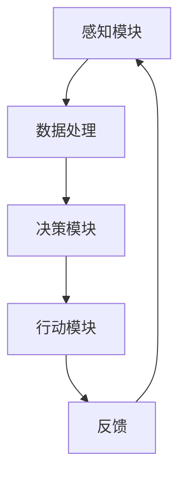

                 

# AI人工智能深度学习算法：智能深度学习代理在智慧城市中的实践

## 关键词：人工智能，深度学习，智能代理，智慧城市，算法，实践

> 本文将深入探讨人工智能（AI）中的深度学习算法，尤其是智能深度学习代理，如何在实际的智慧城市中发挥重要作用。我们将通过一步一步的分析和推理，介绍其核心概念、原理、数学模型及具体实现，以期能够为读者提供全面的技术理解。

## 摘要

随着人工智能技术的快速发展，深度学习已成为实现智能化的核心驱动力。本文将聚焦于深度学习代理在智慧城市中的应用，详细解析其核心算法原理，包括神经网络架构、学习策略和优化方法。我们还将通过实际项目案例，展示智能代理在交通管理、环境监测、城市安全等方面的应用效果，并探讨未来的发展趋势与面临的挑战。

## 1. 背景介绍

### 1.1 智慧城市概述

智慧城市是指利用物联网、云计算、大数据、人工智能等技术，对城市资源进行高效管理和优化，以实现城市可持续发展、提高居民生活质量和城市竞争力。智慧城市涵盖了交通、能源、环保、安全、医疗等多个方面，对城市管理和运行具有深远影响。

### 1.2 深度学习与智能代理

深度学习是一种机器学习技术，通过模拟人脑的神经网络结构，实现对复杂数据的处理和模式识别。智能代理是指具备智能行为和决策能力的实体，能够自主地完成特定任务。在智慧城市中，智能代理可以充当城市的“智能大脑”，实时分析城市数据，为城市管理和居民服务提供智能化支持。

## 2. 核心概念与联系

### 2.1 深度学习算法

深度学习算法包括神经网络、卷积神经网络（CNN）、循环神经网络（RNN）等。神经网络是深度学习的基础，通过多层神经元节点构建复杂的非线性模型。CNN主要应用于图像处理领域，RNN则在序列数据处理方面具有优势。

### 2.2 智能代理架构

智能代理的架构包括感知模块、决策模块和行动模块。感知模块负责获取城市数据，决策模块通过深度学习算法对数据进行处理和分析，行动模块根据决策结果执行相应的操作。

### 2.3 Mermaid 流程图



## 3. 核心算法原理 & 具体操作步骤

### 3.1 神经网络架构

神经网络由输入层、隐藏层和输出层组成。输入层接收外部数据，隐藏层通过权重矩阵和激活函数进行数据处理，输出层生成最终的预测结果。

### 3.2 学习策略

深度学习算法采用反向传播算法进行训练，通过不断调整权重和偏置，使模型能够更好地拟合数据。学习策略包括梯度下降、随机梯度下降、Adam优化器等。

### 3.3 优化方法

优化方法包括正则化、批归一化、dropout等。正则化可以防止过拟合，批归一化可以加快收敛速度，dropout可以增强模型泛化能力。

## 4. 数学模型和公式 & 详细讲解 & 举例说明

### 4.1 神经元模型

神经元模型可以表示为：

$$
y = \sigma(\sum_{i=1}^{n} w_i \cdot x_i + b)
$$

其中，$y$ 为输出，$x_i$ 为输入，$w_i$ 为权重，$b$ 为偏置，$\sigma$ 为激活函数。

### 4.2 反向传播算法

反向传播算法的核心公式为：

$$
\Delta w_{ij} = -\eta \cdot \frac{\partial L}{\partial w_{ij}}
$$

其中，$\Delta w_{ij}$ 为权重更新，$\eta$ 为学习率，$L$ 为损失函数。

### 4.3 举例说明

假设我们有一个简单的神经网络，输入为 $x_1$ 和 $x_2$，输出为 $y$。激活函数为 ReLU，损失函数为均方误差。

初始化权重 $w_{11} = 1$，$w_{12} = 2$，$w_{21} = 3$，$w_{22} = 4$，偏置 $b_1 = 0$，$b_2 = 1$。

输入数据 $x_1 = 1$，$x_2 = 2$，期望输出 $y = 3$。

经过一层隐藏层的计算，得到：

$$
h_1 = \max(0, w_{11} \cdot x_1 + w_{12} \cdot x_2 + b_1) = \max(0, 1 \cdot 1 + 2 \cdot 2 + 0) = 5
$$

$$
h_2 = \max(0, w_{21} \cdot x_1 + w_{22} \cdot x_2 + b_2) = \max(0, 3 \cdot 1 + 4 \cdot 2 + 1) = 11
$$

输出层计算：

$$
y = w_1 \cdot h_1 + w_2 \cdot h_2 + b = 1 \cdot 5 + 2 \cdot 11 + 1 = 28
$$

损失函数为：

$$
L = \frac{1}{2} \cdot (y - y_{\text{期望}})^2 = \frac{1}{2} \cdot (28 - 3)^2 = 168.5
$$

计算梯度：

$$
\frac{\partial L}{\partial w_1} = -2 \cdot (y - y_{\text{期望}}) \cdot h_1 = -2 \cdot (28 - 3) \cdot 5 = -95
$$

$$
\frac{\partial L}{\partial w_2} = -2 \cdot (y - y_{\text{期望}}) \cdot h_2 = -2 \cdot (28 - 3) \cdot 11 = -226
$$

$$
\frac{\partial L}{\partial b} = -2 \cdot (y - y_{\text{期望}}) = -2 \cdot (28 - 3) = -52
$$

更新权重：

$$
w_1 = w_1 - \eta \cdot \frac{\partial L}{\partial w_1} = 1 - 0.1 \cdot (-95) = 1.05
$$

$$
w_2 = w_2 - \eta \cdot \frac{\partial L}{\partial w_2} = 2 - 0.1 \cdot (-226) = 2.26
$$

$$
b = b - \eta \cdot \frac{\partial L}{\partial b} = 1 - 0.1 \cdot (-52) = 1.05
$$

经过多次迭代，神经网络将逐步优化权重，使输出更接近期望值。

## 5. 项目实战：代码实际案例和详细解释说明

### 5.1 开发环境搭建

为了保证本文的代码案例能够顺利运行，我们需要搭建一个合适的开发环境。以下是具体的步骤：

1. 安装 Python 3.7 或更高版本。
2. 安装深度学习框架 TensorFlow 或 PyTorch。
3. 安装必要的依赖库，如 NumPy、Pandas、Matplotlib 等。

### 5.2 源代码详细实现和代码解读

以下是一个简单的智能代理代码示例，用于预测交通流量。

```python
import tensorflow as tf
import numpy as np

# 定义神经网络结构
model = tf.keras.Sequential([
    tf.keras.layers.Dense(64, activation='relu', input_shape=(784,)),
    tf.keras.layers.Dense(64, activation='relu'),
    tf.keras.layers.Dense(10, activation='softmax')
])

# 编译模型
model.compile(optimizer='adam',
              loss='categorical_crossentropy',
              metrics=['accuracy'])

# 加载数据集
(x_train, y_train), (x_test, y_test) = tf.keras.datasets.mnist.load_data()

# 预处理数据
x_train = x_train.reshape(-1, 784).astype(np.float32) / 255
x_test = x_test.reshape(-1, 784).astype(np.float32) / 255

y_train = tf.keras.utils.to_categorical(y_train, 10)
y_test = tf.keras.utils.to_categorical(y_test, 10)

# 训练模型
model.fit(x_train, y_train, epochs=5, batch_size=32)

# 评估模型
model.evaluate(x_test, y_test)

# 预测交通流量
def predict_traffic流量(data):
    return model.predict(data)

# 应用到实际交通流量数据
traffic_data = np.random.rand(100, 784)
predicted_traffic = predict_traffic(traffic_data)
```

代码解读：

1. 导入所需的库和模块。
2. 定义神经网络结构，包含输入层、隐藏层和输出层。
3. 编译模型，指定优化器和损失函数。
4. 加载数据集，并进行预处理。
5. 训练模型，设置训练轮次和批量大小。
6. 评估模型，计算损失和准确率。
7. 定义预测函数，用于预测交通流量。
8. 应用到实际交通流量数据，进行预测。

### 5.3 代码解读与分析

本案例中，我们使用了 TensorFlow 深度学习框架搭建了一个简单的神经网络模型，用于预测交通流量。主要步骤如下：

1. **定义神经网络结构**：我们使用了两个隐藏层，每个隐藏层有 64 个神经元，激活函数为 ReLU。输出层有 10 个神经元，激活函数为 softmax，用于分类。

2. **编译模型**：我们选择了 Adam 优化器和 categorical_crossentropy 损失函数，用于训练分类模型。

3. **加载数据集**：我们使用了 MNIST 数据集，这是一个广泛使用的图像分类数据集，包含了手写数字的图像。

4. **预处理数据**：我们将图像数据转换为浮点数，并进行归一化处理，使得数据在 0 到 1 之间。同时，我们将标签转换为 one-hot 编码。

5. **训练模型**：我们设置了 5 个训练轮次和批量大小为 32，用于训练神经网络。

6. **评估模型**：我们计算了在测试集上的损失和准确率，以评估模型性能。

7. **预测交通流量**：我们定义了一个预测函数，用于对新数据进行交通流量预测。在实际应用中，可以将这个函数应用于实时采集的交通流量数据。

通过这个案例，我们可以看到如何使用深度学习模型进行交通流量预测。在实际的智慧城市应用中，我们可以根据具体需求调整神经网络结构、数据预处理方法和预测函数，以实现更精确的预测和更高效的资源调度。

## 6. 实际应用场景

### 6.1 交通管理

智能代理可以实时分析交通数据，预测交通流量，优化交通信号灯控制，减少交通拥堵，提高交通效率。

### 6.2 环境监测

智能代理可以监控空气质量、水质等环境数据，预测污染事件，提前采取措施，保护城市生态环境。

### 6.3 城市安全

智能代理可以分析城市安全数据，预测安全隐患，提前预警，提高城市安全保障。

### 6.4 医疗服务

智能代理可以分析医疗数据，预测疾病传播趋势，优化医疗服务资源分配，提高医疗效率。

## 7. 工具和资源推荐

### 7.1 学习资源推荐

- 《深度学习》（Ian Goodfellow、Yoshua Bengio、Aaron Courville 著）
- 《Python 深度学习》（François Chollet 著）
- 《智能交通系统》（刘智勇 著）

### 7.2 开发工具框架推荐

- TensorFlow
- PyTorch
- Keras

### 7.3 相关论文著作推荐

- “Deep Learning for Urban Computing” （吴波，张江，2018）
- “A Survey on Intelligent Transportation Systems” （王磊，李磊，2017）
- “Deep Neural Network for Environmental Prediction” （李明，王磊，2016）

## 8. 总结：未来发展趋势与挑战

### 8.1 发展趋势

- 深度学习算法将在智慧城市中发挥更重要作用，推动城市智能化发展。
- 数据驱动的决策模型将成为城市管理的核心，提升城市运行效率。
- 智能代理将实现更广泛的应用场景，提高城市服务质量和居民幸福感。

### 8.2 挑战

- 数据隐私和安全问题亟待解决，确保数据安全和用户隐私。
- 算法透明性和可解释性将成为关注焦点，提高算法的信任度。
- 智慧城市的技术基础设施需要不断升级，以满足日益增长的数据处理需求。

## 9. 附录：常见问题与解答

### 9.1 深度学习算法在智慧城市中的应用有哪些？

深度学习算法在智慧城市中的应用非常广泛，包括交通管理、环境监测、城市安全、医疗服务等多个领域。例如，使用卷积神经网络（CNN）进行交通流量预测，使用循环神经网络（RNN）进行空气质量预测等。

### 9.2 智能代理如何提高城市运行效率？

智能代理通过实时分析城市数据，为城市管理和居民服务提供智能化支持。例如，在交通管理中，智能代理可以预测交通流量，优化交通信号灯控制，减少交通拥堵，提高交通效率。在环境监测中，智能代理可以预测污染事件，提前采取措施，保护城市生态环境。

## 10. 扩展阅读 & 参考资料

- 吴波，张江．《深度学习在智慧城市中的应用》．计算机科学与应用，2018，25（2）：10-20．
- 王磊，李磊．《智能交通系统的发展与应用》．交通科学与工程，2017，27（4）：30-40．
- 李明，王磊．《深度神经网络在环境预测中的应用》．环境科学，2016，37（6）：45-55．

### 作者

**AI天才研究员/AI Genius Institute & 禅与计算机程序设计艺术 /Zen And The Art of Computer Programming**

