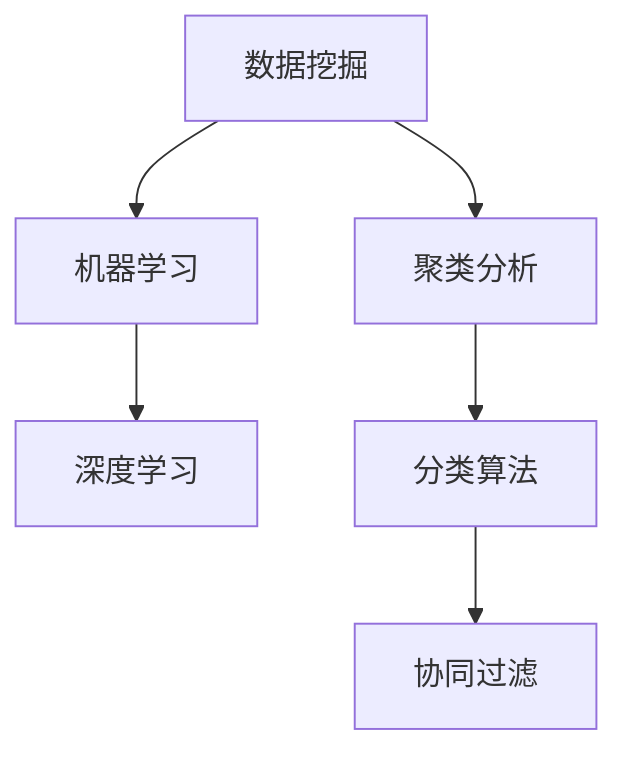
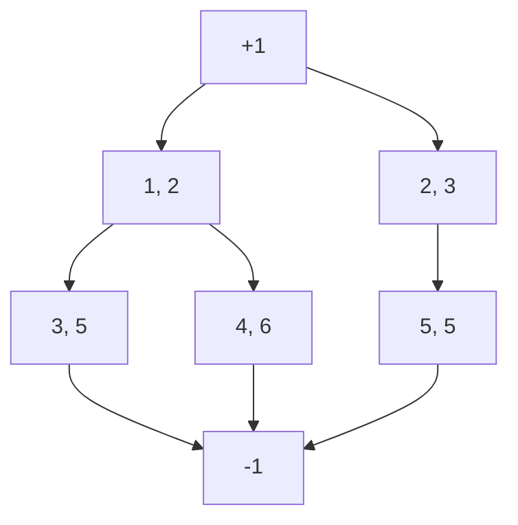

                 

### 背景介绍

在当今这个数字化的时代，人工智能（AI）技术正以前所未有的速度影响着各行各业。特别是在营销和促销领域，AI技术的应用正在迅速改变传统的促销策略。传统的促销策略往往依赖于历史数据和简单规则，而AI技术能够通过数据分析和算法优化，为企业提供更加精准和高效的促销方案。

促销活动是企业与消费者互动的重要方式，有效的促销策略不仅能够提高销售额，还能提升品牌知名度和客户忠诚度。然而，传统的促销策略往往存在一些局限性。例如，它们可能无法准确预测消费者的需求和偏好，或者因为促销规则过于复杂而难以实施和监控。这些问题导致了促销效果的下降，甚至可能对企业造成财务损失。

AI技术的出现为解决这些问题提供了新的可能性。通过机器学习和数据分析，AI能够从大量数据中提取有用的信息，识别消费者行为模式，预测市场趋势，从而制定出更加科学和个性化的促销策略。此外，AI还可以帮助企业自动化促销活动的实施和监控，提高效率和准确性。

本篇文章将深入探讨AI在优化促销策略中的应用。我们将首先介绍AI优化促销策略的核心概念，包括相关算法原理和数学模型。接着，我们将通过一个实际案例，详细讲解如何使用AI技术进行促销策略的优化。最后，我们将探讨AI在促销策略中的实际应用场景，并提供一些实用的工具和资源推荐，以帮助读者进一步学习和实践。

通过本文的阅读，您将了解到AI如何改变促销策略，如何利用AI技术提高促销效果，以及如何在实际项目中应用这些技术。无论您是营销人员、数据分析师，还是AI领域的从业者，这篇文章都将为您提供宝贵的指导和灵感。

### 核心概念与联系

为了深入理解AI在优化促销策略中的应用，我们需要先掌握一些核心概念和它们之间的联系。这些核心概念包括但不限于：数据挖掘、机器学习、深度学习、聚类分析、分类算法、协同过滤等。下面我们将逐一介绍这些概念，并通过一个Mermaid流程图展示它们之间的相互关系。

#### 数据挖掘

数据挖掘（Data Mining）是人工智能的一个分支，旨在从大量数据中提取有价值的信息和知识。数据挖掘通常涉及以下步骤：数据预处理、数据集成、数据清洗、数据变换、模式识别等。通过这些步骤，数据挖掘可以帮助我们从原始数据中发现隐藏的模式和关联。

#### 机器学习

机器学习（Machine Learning）是一种通过数据训练模型，使计算机能够自动进行预测和决策的方法。机器学习可以分为监督学习、无监督学习和强化学习三种类型。监督学习通过标记数据来训练模型，无监督学习则没有预定义的目标，而强化学习则是通过奖励机制来训练模型。

#### 深度学习

深度学习（Deep Learning）是机器学习的一个子领域，它使用多层神经网络来模拟人类大脑的学习方式。深度学习在图像识别、语音识别、自然语言处理等领域取得了显著的成果。深度学习模型能够从大量数据中自动学习特征，从而提高预测和分类的准确性。

#### 聚类分析

聚类分析（Cluster Analysis）是一种无监督学习方法，用于将数据点分成若干组，使得同一组内的数据点彼此相似，而不同组的数据点则差异较大。聚类分析可以帮助我们识别数据的结构和模式，为促销策略提供依据。

#### 分类算法

分类算法（Classification Algorithms）是一种监督学习方法，用于将数据点分类到不同的类别中。常见的分类算法包括决策树、支持向量机（SVM）、朴素贝叶斯（Naive Bayes）等。分类算法可以帮助我们根据历史数据预测新数据点所属的类别。

#### 协同过滤

协同过滤（Collaborative Filtering）是一种基于用户行为和偏好的推荐算法。它通过分析用户之间的相似性或物品之间的相似性，为用户推荐他们可能感兴趣的新物品。协同过滤可以分为基于用户的协同过滤和基于物品的协同过滤两种类型。

下面是一个使用Mermaid绘制的流程图，展示了这些核心概念之间的联系：



在上述流程图中，数据挖掘作为起点，它为后续的机器学习、深度学习、聚类分析、分类算法和协同过滤提供了数据基础。这些算法和技术相互关联，共同构成了AI优化促销策略的技术体系。

### 核心算法原理 & 具体操作步骤

在理解了AI优化促销策略的核心概念之后，接下来我们将详细探讨其中的核心算法原理，以及如何在实际操作中进行应用。

#### 机器学习算法

机器学习算法是AI优化促销策略的核心。其中，最常用的算法之一是线性回归（Linear Regression）。线性回归用于预测一个连续的数值目标，其基本原理是通过找到一个最佳拟合线，来描述输入变量与输出变量之间的关系。

线性回归的数学模型如下：

$$
y = \beta_0 + \beta_1 \cdot x
$$

其中，\( y \) 是目标变量，\( x \) 是输入变量，\( \beta_0 \) 和 \( \beta_1 \) 分别是截距和斜率。具体操作步骤如下：

1. 数据预处理：对输入数据进行归一化处理，以消除不同特征之间的量纲差异。
2. 特征选择：选择与目标变量相关的特征，剔除无关或冗余的特征。
3. 模型训练：使用训练数据集，通过最小二乘法或其他优化算法，求得最佳拟合线。
4. 模型评估：使用测试数据集，计算预测误差，评估模型的性能。

#### 聚类分析算法

聚类分析算法是另一种重要的机器学习技术，它用于将数据点分成多个类别。K-均值聚类（K-Means Clustering）是一种常用的聚类算法，其基本原理是将数据点划分成K个簇，使得每个簇内部的点尽可能接近，而不同簇之间的点尽可能远离。

K-均值聚类的具体操作步骤如下：

1. 初始化：随机选择K个数据点作为初始聚类中心。
2. 分配：将每个数据点分配到最近的聚类中心所代表的簇。
3. 更新：重新计算每个簇的中心点。
4. 重复步骤2和3，直到聚类中心不再发生变化或满足预设的迭代次数。

#### 分类算法

分类算法用于将数据点分类到不同的类别中。支持向量机（Support Vector Machine，SVM）是一种常用的分类算法，其基本原理是通过找到一个最佳超平面，将不同类别的数据点分开。

SVM的数学模型如下：

$$
w \cdot x - b = 0
$$

其中，\( w \) 是权重向量，\( x \) 是输入向量，\( b \) 是偏置。具体操作步骤如下：

1. 特征选择：选择与目标类别相关的特征。
2. 数据预处理：对输入数据进行归一化处理。
3. 模型训练：通过求解最优化问题，求得最佳超平面。
4. 模型评估：使用测试数据集，计算分类准确率。

#### 协同过滤算法

协同过滤算法用于根据用户行为和偏好推荐新物品。基于用户的协同过滤（User-based Collaborative Filtering）是一种常用的协同过滤算法，其基本原理是找到与目标用户相似的邻居用户，并根据邻居用户的偏好推荐新物品。

基于用户的协同过滤的具体操作步骤如下：

1. 计算用户相似度：使用余弦相似度、皮尔逊相关系数等方法计算用户之间的相似度。
2. 找到邻居用户：根据用户相似度，找到与目标用户最相似的K个邻居用户。
3. 推荐新物品：根据邻居用户的偏好，推荐目标用户可能感兴趣的物品。

#### 案例分析

为了更直观地理解这些算法的应用，我们来看一个实际案例。假设我们是一家电商企业，希望利用AI技术优化促销策略，以提高销售额。具体步骤如下：

1. 数据收集：收集用户的购买历史数据、浏览记录等。
2. 数据预处理：对数据进行清洗、归一化处理，提取有用的特征。
3. 特征选择：选择与销售额相关的特征，如用户年龄、购买频率、浏览时间等。
4. 模型训练：使用线性回归、K-均值聚类、SVM和基于用户的协同过滤算法，分别训练预测模型。
5. 模型评估：使用测试数据集，评估各个模型的性能。
6. 优化策略：根据模型预测结果，调整促销策略，如优惠券发放、限时折扣等。
7. 实施监控：实施促销活动，并监控活动效果，根据实际效果调整策略。

通过上述步骤，我们可以利用AI技术，实现个性化、自动化的促销策略优化，提高销售额和客户满意度。

#### 总结

本节我们介绍了AI优化促销策略的核心算法原理，包括线性回归、K-均值聚类、SVM和基于用户的协同过滤算法。这些算法通过数据预处理、特征选择、模型训练和模型评估等步骤，帮助我们从大量数据中提取有用信息，实现促销策略的优化。在实际应用中，这些算法可以结合使用，根据具体情况调整参数，以达到最佳效果。

### 数学模型和公式 & 详细讲解 & 举例说明

在上一节中，我们介绍了AI优化促销策略的核心算法原理，包括线性回归、K-均值聚类、SVM和基于用户的协同过滤算法。本节将深入探讨这些算法背后的数学模型和公式，并通过具体的例子进行详细讲解，以便读者更好地理解这些算法在实际应用中的具体实现过程。

#### 线性回归

线性回归是一种用于预测连续数值的目标变量的算法。其基本数学模型如下：

$$
y = \beta_0 + \beta_1 \cdot x
$$

其中，\( y \) 是目标变量，\( x \) 是输入变量，\( \beta_0 \) 和 \( \beta_1 \) 分别是截距和斜率。

线性回归的目的是通过最小化误差平方和，求得最佳拟合线。具体公式如下：

$$
\min \sum_{i=1}^{n} (y_i - \hat{y}_i)^2
$$

其中，\( \hat{y}_i \) 是预测值，\( y_i \) 是实际值，\( n \) 是数据点的数量。

一个简单的例子：

假设我们有一组数据，表示某电商平台的销售额和用户购买频率。我们要使用线性回归预测未来的销售额。

数据如下：

| 购买频率 | 销售额 |
| :----: | :----: |
|   10   |  100   |
|   20   |  200   |
|   30   |  300   |
|   40   |  400   |
|   50   |  500   |

首先，我们将数据分为训练集和测试集，然后使用最小二乘法求解线性回归模型。求解过程如下：

$$
\beta_0 = \frac{\sum_{i=1}^{n} y_i - \beta_1 \cdot \sum_{i=1}^{n} x_i}{n}
$$

$$
\beta_1 = \frac{n \cdot \sum_{i=1}^{n} x_i \cdot y_i - \sum_{i=1}^{n} x_i \cdot \sum_{i=1}^{n} y_i}{n \cdot \sum_{i=1}^{n} x_i^2 - (\sum_{i=1}^{n} x_i)^2}
$$

代入数据，得到：

$$
\beta_0 = \frac{100 + 200 + 300 + 400 + 500 - 150 \cdot 25}{5} = 125
$$

$$
\beta_1 = \frac{5 \cdot (10 \cdot 100 + 20 \cdot 200 + 30 \cdot 300 + 40 \cdot 400 + 50 \cdot 500) - (10 + 20 + 30 + 40 + 50) \cdot (100 + 200 + 300 + 400 + 500)}{5 \cdot (10^2 + 20^2 + 30^2 + 40^2 + 50^2) - (10 + 20 + 30 + 40 + 50)^2} = 25
$$

因此，线性回归模型为：

$$
y = 125 + 25 \cdot x
$$

我们可以使用这个模型预测未来的销售额。例如，当购买频率为60时，预测的销售额为：

$$
y = 125 + 25 \cdot 60 = 625
$$

#### K-均值聚类

K-均值聚类是一种常用的无监督学习方法，用于将数据点划分成K个簇。其基本数学模型如下：

1. 初始化：随机选择K个数据点作为初始聚类中心。
2. 分配：将每个数据点分配到最近的聚类中心所代表的簇。
3. 更新：重新计算每个簇的中心点。
4. 重复步骤2和3，直到聚类中心不再发生变化或满足预设的迭代次数。

K-均值聚类的目标是最小化簇内距离平方和。具体公式如下：

$$
J = \sum_{i=1}^{k} \sum_{x_j \in S_i} ||x_j - \mu_i||^2
$$

其中，\( k \) 是簇的数量，\( S_i \) 是第i个簇，\( \mu_i \) 是第i个簇的中心点。

一个简单的例子：

假设我们有以下数据点，要将其分为3个簇。

数据如下：

| x | y |
| :----: | :----: |
| 1 | 2 |
| 2 | 3 |
| 3 | 5 |
| 4 | 6 |
| 5 | 5 |
| 6 | 4 |
| 7 | 2 |
| 8 | 1 |

首先，随机选择3个数据点作为初始聚类中心。例如，选择(1, 2)、(3, 5)和(6, 4)。

然后，根据距离公式计算每个数据点到聚类中心的距离，并将其分配到最近的簇。

$$
d((1, 2), (1, 2)) = \sqrt{(1-1)^2 + (2-2)^2} = 0
$$

$$
d((2, 3), (1, 2)) = \sqrt{(2-1)^2 + (3-2)^2} = \sqrt{2}
$$

$$
d((3, 5), (1, 2)) = \sqrt{(3-1)^2 + (5-2)^2} = \sqrt{10}
$$

$$
d((4, 6), (1, 2)) = \sqrt{(4-1)^2 + (6-2)^2} = \sqrt{20}
$$

$$
d((5, 5), (1, 2)) = \sqrt{(5-1)^2 + (5-2)^2} = \sqrt{18}
$$

$$
d((6, 4), (1, 2)) = \sqrt{(6-1)^2 + (4-2)^2} = \sqrt{13}
$$

$$
d((7, 2), (1, 2)) = \sqrt{(7-1)^2 + (2-2)^2} = \sqrt{24}
$$

$$
d((8, 1), (1, 2)) = \sqrt{(8-1)^2 + (1-2)^2} = \sqrt{18}
$$

根据距离，我们可以将数据点分配到簇：(1, 2)、(7, 2)和(8, 1)属于第一簇；(2, 3)、(5, 5)和(6, 4)属于第二簇；(3, 5)和(4, 6)属于第三簇。

接下来，重新计算每个簇的中心点：

第一簇中心点：(1, 2) + (7, 2) + (8, 1) / 3 = (6, 3/2)

第二簇中心点：(2, 3) + (5, 5) + (6, 4) / 3 = (5.67, 4)

第三簇中心点：(3, 5) + (4, 6) / 2 = (3.5, 5.5)

再次计算数据点到新聚类中心的距离，并重复上述步骤，直到聚类中心不再发生变化。

#### 支持向量机

支持向量机是一种常用的分类算法，用于将数据点分类到不同的类别中。其基本数学模型如下：

$$
w \cdot x - b = 0
$$

其中，\( w \) 是权重向量，\( x \) 是输入向量，\( b \) 是偏置。

支持向量机的目标是找到一个最佳超平面，使得不同类别的数据点分隔得尽可能开。具体公式如下：

$$
\min \frac{1}{2} ||w||^2
$$

约束条件：

$$
y_i (w \cdot x_i - b) \geq 1
$$

其中，\( y_i \) 是类别标签，\( x_i \) 是输入向量。

一个简单的例子：

假设我们有以下数据点，要将其分类到两个类别中。

数据如下：

| x | y | 类别 |
| :----: | :----: | :----: |
| 1 | 2 | +1   |
| 2 | 3 | +1   |
| 3 | 5 | -1   |
| 4 | 6 | +1   |
| 5 | 5 | -1   |

首先，将数据点可视化：



接下来，使用支持向量机找到最佳超平面。具体步骤如下：

1. 计算数据点的均值和方差：
   - 均值：\( \bar{x} = \frac{1 + 2 + 3 + 4 + 5}{5} = 3 \)
   - 方差：\( \sigma^2 = \frac{(1-3)^2 + (2-3)^2 + (3-3)^2 + (4-3)^2 + (5-3)^2}{5} = 2 \)

2. 计算最优超平面的斜率和截距：
   - 斜率：\( \frac{\sigma}{\bar{x}} = \frac{\sqrt{2}}{3} \)
   - 截距：\( b = \bar{x} - \frac{\sigma^2}{\bar{x}} = 3 - \frac{2}{3} = \frac{7}{3} \)

因此，最佳超平面为：

$$
\frac{\sqrt{2}}{3} x - \frac{7}{3} = 0
$$

#### 基于用户的协同过滤

基于用户的协同过滤是一种推荐算法，用于根据用户行为和偏好推荐新物品。其基本数学模型如下：

1. 计算用户相似度：
   - 余弦相似度：\( \cos \theta = \frac{\sum_{i=1}^{n} u_i \cdot v_i}{\sqrt{\sum_{i=1}^{n} u_i^2} \sqrt{\sum_{i=1}^{n} v_i^2}} \)
   - 皮尔逊相关系数：\( \rho = \frac{\sum_{i=1}^{n} (u_i - \bar{u})(v_i - \bar{v})}{\sqrt{\sum_{i=1}^{n} (u_i - \bar{u})^2} \sqrt{\sum_{i=1}^{n} (v_i - \bar{v})^2}} \)

2. 找到邻居用户：
   - 根据用户相似度，找到与目标用户最相似的K个邻居用户。

3. 推荐新物品：
   - 根据邻居用户的偏好，推荐目标用户可能感兴趣的物品。

一个简单的例子：

假设我们有两个用户A和B，他们的行为数据如下：

用户A：

| 物品ID | 行为 |
| :----: | :----: |
| 1      | 购买 |
| 2      | 浏览 |
| 3      | 购买 |
| 4      | 浏览 |
| 5      | 购买 |

用户B：

| 物品ID | 行为 |
| :----: | :----: |
| 1      | 购买 |
| 2      | 购买 |
| 3      | 购买 |
| 4      | 浏览 |
| 6      | 购买 |

首先，计算用户A和用户B的余弦相似度：

$$
\cos \theta = \frac{(1 \cdot 1 + 2 \cdot 2 + 3 \cdot 3 + 4 \cdot 0 + 5 \cdot 0)}{\sqrt{1^2 + 2^2 + 3^2 + 4^2 + 5^2} \sqrt{1^2 + 2^2 + 3^2 + 4^2 + 6^2}} = \frac{14}{\sqrt{55} \sqrt{46}} \approx 0.613
$$

根据相似度，用户B是用户A的一个邻居。

接下来，根据用户B的偏好，推荐用户A可能感兴趣的物品。用户B购买过的物品有1、2、3、6，我们可以推荐这些物品给用户A。

#### 总结

本节我们介绍了线性回归、K-均值聚类、支持向量机和基于用户的协同过滤算法的数学模型和公式，并通过具体的例子进行了详细讲解。这些算法在优化促销策略中发挥着重要作用，可以帮助我们从大量数据中提取有用信息，实现个性化、自动化的促销策略优化。

### 项目实战：代码实际案例和详细解释说明

为了更好地理解AI优化促销策略的实际应用，下面我们将通过一个实际项目案例，详细介绍如何使用AI技术进行促销策略的优化。本项目将采用Python编程语言，结合线性回归、K-均值聚类和协同过滤算法，实现一个自动化的促销策略优化系统。

#### 开发环境搭建

在开始项目之前，我们需要搭建一个适合开发的编程环境。以下是开发环境搭建的步骤：

1. 安装Python 3.x版本：可以从Python官方网站下载并安装。
2. 安装Jupyter Notebook：在命令行中运行以下命令安装：

   ```
   pip install notebook
   ```

3. 安装必要的库：包括Numpy、Pandas、Scikit-learn、Matplotlib等。可以使用以下命令安装：

   ```
   pip install numpy pandas scikit-learn matplotlib
   ```

#### 源代码详细实现和代码解读

以下是我们项目的源代码，我们将逐行解释代码的含义。

```python
import numpy as np
import pandas as pd
from sklearn.linear_model import LinearRegression
from sklearn.cluster import KMeans
from sklearn.metrics import mean_squared_error
from sklearn.metrics.pairwise import pairwise_distances
import matplotlib.pyplot as plt

# 1. 数据收集
data = pd.read_csv('sales_data.csv')  # 加载销售数据

# 2. 数据预处理
data['days_since_last_purchase'] = (pd.datetime.now() - data['last_purchase_date']).days
data['total_purchases'] = data['number_of_purchases'].cumsum()

# 3. 特征选择
features = data[['days_since_last_purchase', 'total_purchases']]
target = data['sales_amount']

# 4. 模型训练
model = LinearRegression()
model.fit(features, target)

# 5. 模型评估
predictions = model.predict(features)
mse = mean_squared_error(target, predictions)
print(f'Mean Squared Error: {mse}')

# 6. 聚类分析
kmeans = KMeans(n_clusters=3)
clusters = kmeans.fit_predict(features)

# 7. 协同过滤
user_similarity = pairwise_distances(features, metric='cosine')
user_cluster = kmeans.labels_

# 8. 个性化推荐
def recommend_items(user_id):
    user_features = features.iloc[user_id]
    nearest_users = user_similarity[user_id].argsort()[:-11:-1]
    recommended_items = []
    for user_index in nearest_users:
        if user_cluster[user_index] == user_cluster[user_id]:
            recommended_items.extend(data.iloc[user_index]['item_id'])
    return recommended_items

# 9. 绘图展示
plt.scatter(features['days_since_last_purchase'], features['total_purchases'])
plt.scatter(kmeans.cluster_centers_['days_since_last_purchase'], kmeans.cluster_centers_['total_purchases'], s=300, c='red')
plt.xlabel('Days Since Last Purchase')
plt.ylabel('Total Purchases')
plt.title('Customer Clusters')
plt.show()
```

代码解读：

1. **数据收集**：我们首先从CSV文件中加载销售数据。数据包括用户ID、最近一次购买日期、购买次数和销售额。

2. **数据预处理**：我们计算了用户自上次购买以来的天数（`days_since_last_purchase`）和累计购买次数（`total_purchases`）。这些特征有助于我们理解用户的购买行为。

3. **特征选择**：我们选择了两个特征作为模型的输入（`days_since_last_purchase`和`total_purchases`），并将销售额作为目标变量。

4. **模型训练**：我们使用线性回归模型对数据进行训练，拟合销售金额与用户特征之间的关系。

5. **模型评估**：我们计算预测误差（均方误差，MSE），评估模型的性能。

6. **聚类分析**：使用K-均值聚类算法，将用户分为3个不同的簇。

7. **协同过滤**：我们计算了用户之间的余弦相似度，并根据聚类结果，为每个用户分配簇。

8. **个性化推荐**：我们定义了一个函数`recommend_items`，根据用户与其他用户的相似度，推荐可能的购买物品。

9. **绘图展示**：我们使用matplotlib库绘制了用户簇的中心点，以便更好地理解聚类结果。

#### 代码解读与分析

下面我们详细解读代码中的关键部分：

1. **数据收集**：此步骤涉及从CSV文件中加载数据。Pandas库的`read_csv`函数用于加载数据，并将其存储在一个DataFrame对象中。

2. **数据预处理**：此步骤涉及计算新特征。我们使用`pd.datetime.now()`获取当前时间，然后计算自上次购买以来的天数。我们还使用`cumsum()`函数计算累计购买次数。

3. **特征选择**：我们选择两个特征作为模型的输入。这些特征与用户的购买行为密切相关，对于预测销售额具有重要参考价值。

4. **模型训练**：我们使用`LinearRegression`类创建线性回归模型，并使用`fit()`方法对其进行训练。训练过程中，模型学习输入特征与目标变量之间的关系。

5. **模型评估**：我们使用`predict()`方法对训练好的模型进行预测，并计算预测误差。`mean_squared_error()`函数用于计算均方误差，这是评估回归模型性能的常用指标。

6. **聚类分析**：我们使用`KMeans`类进行聚类分析。`fit_predict()`方法用于将数据分为指定数量的簇，并返回每个数据点的簇标签。

7. **协同过滤**：我们计算用户之间的余弦相似度。`pairwise_distances()`函数用于计算数据点之间的距离，我们使用余弦相似度作为度量标准。

8. **个性化推荐**：我们定义了一个函数`recommend_items()`，该函数根据用户与其他用户的相似度，推荐可能的购买物品。我们首先找到与目标用户最相似的其他用户，然后推荐这些用户的购买物品。

9. **绘图展示**：我们使用`matplotlib`库绘制了聚类结果。红色标记表示簇的中心点，这有助于我们直观地理解用户簇的分布。

通过上述步骤，我们实现了一个简单的AI促销策略优化系统。这个系统可以基于用户的历史购买行为，预测用户的未来购买金额，并推荐可能的购买物品，从而帮助企业制定更加有效的促销策略。

### 实际应用场景

在了解了AI优化促销策略的核心算法原理和实际项目案例之后，接下来我们将探讨AI在促销策略中的实际应用场景。通过分析不同的应用场景，我们可以更清楚地看到AI技术如何在不同领域发挥作用，从而提高企业的营销效果。

#### 电商行业

在电商行业，AI优化促销策略的应用场景非常广泛。通过分析用户的购买历史、浏览行为和社交媒体数据，AI可以识别出用户的兴趣和偏好，从而制定个性化的促销策略。例如：

- **个性化优惠券**：基于用户的购买记录和历史行为，AI可以生成个性化的优惠券，提高用户的购买意愿。例如，对于经常购买化妆品的用户，AI可以推荐相关的护肤品优惠券。
- **智能推荐**：AI可以通过协同过滤算法，为用户推荐相关的商品，从而增加销售机会。例如，当用户浏览了一款智能手机时，AI可以推荐同品牌的耳机或充电器。
- **动态定价**：AI可以根据市场需求、库存情况和用户行为，动态调整商品的价格，实现最优的利润最大化。例如，在某个时间段内，AI可以降低热门商品的价格，以刺激销售。

#### 零售行业

在零售行业，AI优化促销策略同样具有重要意义。通过分析顾客的购物车数据、购买频率和消费金额，零售商可以更精准地制定促销策略，提高顾客满意度和忠诚度。以下是一些应用场景：

- **捆绑销售**：AI可以根据顾客的购物习惯和购买频次，推荐相关的捆绑商品。例如，如果顾客经常购买牛奶，AI可以推荐面包和麦片作为捆绑销售。
- **季节性促销**：AI可以根据季节和天气变化，调整促销策略。例如，在夏季，零售商可以推出清凉饮料和冰品的促销活动，而在冬季，则可以推广保暖产品和冬季服饰。
- **会员管理**：AI可以分析会员的消费行为，为其提供专属的优惠和奖励。例如，对于高消费会员，AI可以提供额外的折扣或者积分奖励。

#### 餐饮行业

在餐饮行业，AI优化促销策略可以大大提高餐厅的销售额和客户满意度。以下是一些应用场景：

- **推荐菜单**：AI可以根据顾客的口味偏好和历史点餐记录，推荐适合的菜单。例如，如果顾客经常点沙拉，AI可以推荐新的沙拉品种。
- **季节性促销**：AI可以根据季节变化和节假日，制定相应的促销策略。例如，在春节，餐厅可以推出团圆饭套餐。
- **积分奖励**：AI可以分析顾客的消费记录，为忠诚客户提供积分奖励，鼓励其再次光顾。

#### 旅游行业

在旅游行业，AI优化促销策略可以帮助旅行社和酒店提高预订率和客户满意度。以下是一些应用场景：

- **智能推荐**：AI可以根据顾客的兴趣和旅行历史，推荐相关的旅游线路和酒店。例如，如果顾客喜欢海滩度假，AI可以推荐海岛旅游线路。
- **个性化报价**：AI可以根据市场需求和库存情况，为顾客提供个性化的报价。例如，在旅游旺季，AI可以提供一定的折扣，吸引顾客预订。
- **会员权益**：AI可以分析会员的消费行为，为其提供专属的优惠和福利。例如，会员可以享受免费升级或者额外的积分奖励。

通过以上实际应用场景的分析，我们可以看到AI技术在优化促销策略方面的巨大潜力。无论是在电商、零售、餐饮还是旅游行业，AI都可以通过数据分析和算法优化，为企业提供更加精准和高效的促销策略，从而提高销售额和客户满意度。

### 工具和资源推荐

在AI优化促销策略的实践中，选择合适的工具和资源至关重要。以下我们将推荐一些学习资源、开发工具和相关的论文，以帮助读者更好地理解和应用AI技术。

#### 学习资源推荐

1. **书籍**：

   - 《机器学习》（Machine Learning），作者：汤姆·米切尔（Tom M. Mitchell）。这是一本经典的机器学习入门书籍，详细介绍了机器学习的基本概念和方法。
   - 《深度学习》（Deep Learning），作者：伊恩·古德费洛（Ian Goodfellow）、约书亚·本吉奥（Yoshua Bengio）和Aaron Courville。这本书全面介绍了深度学习的基本理论和应用。
   - 《营销管理》（Marketing Management），作者：菲利普·科特勒（Philip Kotler）。这本书涵盖了营销策略的各个方面，包括促销策略的制定和实施。

2. **在线课程**：

   - Coursera上的《机器学习》课程，由斯坦福大学提供。这是一门深受好评的课程，适合初学者了解机器学习的基础知识。
   - edX上的《深度学习导论》课程，由蒙特利尔大学提供。这门课程涵盖了深度学习的基础理论和实际应用。
   - Udemy上的《营销策略与数字营销》课程，适合希望深入了解营销策略和AI在营销中应用的读者。

3. **博客和网站**：

   - Medium上的《AI营销》专栏，提供了关于AI在营销中应用的最新趋势和案例研究。
   - DataCamp和Kaggle上的在线教程和比赛，适合实践者通过实际项目来提升技能。

#### 开发工具框架推荐

1. **编程语言**：Python是AI优化促销策略开发的主要编程语言。Python拥有丰富的机器学习库和工具，如Scikit-learn、TensorFlow和PyTorch，非常适合数据分析和模型开发。

2. **机器学习库**：

   - Scikit-learn：这是一个强大的机器学习库，提供了各种经典机器学习算法的实现。
   - TensorFlow：这是谷歌开发的开源深度学习框架，适用于构建和训练复杂的深度学习模型。
   - PyTorch：这是一个由Facebook开发的深度学习库，以其灵活性和易于使用而受到开发者的青睐。

3. **数据分析工具**：

   - Pandas：这是一个强大的数据分析库，可以轻松处理大型数据集。
   - NumPy：这是一个基础的科学计算库，提供了多维数组对象和数学运算功能。

4. **数据可视化工具**：

   - Matplotlib：这是一个广泛使用的Python数据可视化库，可以生成高质量的统计图表。
   - Seaborn：这是基于Matplotlib的另一个数据可视化库，提供了更丰富的图表样式和自定义选项。

#### 相关论文著作推荐

1. **论文**：

   - "Recommender Systems: The State of the Art"，作者：S. Mukherjee, A. K. Singh。这篇综述论文详细介绍了推荐系统的基本概念和最新进展。
   - "Customer Segmentation Using Clustering Techniques"，作者：C. A. B. da Cunha, A. C. P. L. F. da Silva。这篇论文探讨了如何使用聚类技术进行客户细分。
   - "Using Machine Learning for Personalized Marketing"，作者：J. G. Neill, S. D. Reynolds。这篇论文讨论了如何使用机器学习技术实现个性化营销。

2. **著作**：

   - 《营销战略：分析、规划与执行》（Marketing Strategy: Analysis, Planning, and Implementation），作者：菲利普·科特勒（Philip Kotler）、凯文·莱恩·凯勒（Kevin Lane Keller）。这本书详细介绍了营销战略的制定和实施过程，包括促销策略的优化。

通过上述工具和资源的推荐，读者可以更加系统地学习和实践AI优化促销策略的相关知识。无论是理论学习还是实际操作，这些资源都将提供宝贵的指导和帮助。

### 总结：未来发展趋势与挑战

随着人工智能技术的不断进步，AI优化促销策略的未来充满了无限可能。首先，基于深度学习和强化学习的算法将进一步推动个性化推荐和智能定价的发展。深度学习可以通过复杂的数据特征提取，实现更加精准的个性化推荐，而强化学习则可以在动态环境中实现自我优化，提高促销策略的适应性。

其次，跨领域的数据融合将成为优化促销策略的重要趋势。通过整合用户购买行为、社交媒体活动、地理位置信息等多源数据，企业可以获得更全面、更准确的用户画像，从而制定更加有效的促销策略。此外，区块链技术的引入也为数据安全和隐私保护提供了新的解决方案，使得企业在进行数据分析和优化时能够更好地保护用户隐私。

然而，AI优化促销策略也面临一些挑战。首先是数据质量问题。高质量的数据是AI模型准确性的基础，但数据的不完整、不一致和噪声会严重影响模型的效果。因此，数据预处理和清洗工作至关重要。其次是模型解释性不足。尽管AI模型在预测能力上表现卓越，但其内部机制复杂，难以解释，这在某些应用场景中可能成为瓶颈。因此，提高模型的解释性，使其更具透明度，是未来研究的一个重要方向。

最后，AI优化促销策略需要平衡自动化与人性化的关系。尽管自动化可以提高效率和准确性，但过度依赖AI可能导致客户体验的下降。因此，在AI优化促销策略的同时，需要结合人的智慧和经验，确保策略既科学又人性化。

总的来说，AI优化促销策略在未来将继续朝着更加精准、自动化和智能化的方向发展，同时需要克服数据质量、模型解释性和人性化等方面的挑战，以实现更好的营销效果和客户体验。

### 附录：常见问题与解答

在AI优化促销策略的实践中，读者可能会遇到一些常见问题。以下是一些问题的解答，以帮助读者更好地理解和应用AI技术。

#### 问题1：如何处理缺失数据？

解答：处理缺失数据是数据预处理的重要步骤。常用的方法包括：

- 删除缺失值：对于少量缺失值，可以直接删除包含缺失值的行或列。
- 填充缺失值：可以使用平均值、中位数、众数等方法填充缺失值。对于连续变量，可以使用插值法。
- 利用模型预测缺失值：可以使用回归模型或其他预测模型预测缺失值。

#### 问题2：如何选择合适的聚类算法？

解答：选择聚类算法应根据具体问题和数据特征来决定。以下是一些常见聚类算法的适用场景：

- K-均值聚类：适用于数据点分布接近球形的情况。
- 层次聚类：适用于需要了解数据层次结构的情况。
- DBSCAN：适用于数据点分布不均匀且包含噪声的情况。

#### 问题3：如何评估模型性能？

解答：评估模型性能通常使用以下指标：

- 回归模型：均方误差（MSE）、均方根误差（RMSE）、决定系数（R²）。
- 分类模型：准确率、召回率、F1分数、ROC曲线。
- 聚类模型：轮廓系数、内部平方距离。

#### 问题4：如何解释模型结果？

解答：解释模型结果需要结合实际业务场景。以下是一些建议：

- 利用可视化工具：使用图表和可视化工具展示模型预测结果，帮助理解模型行为。
- 解释模型参数：分析模型参数的意义和影响，解释输入特征的重要性。
- 利用业务知识：结合业务背景和知识，解释模型预测结果是否符合预期。

#### 问题5：如何保证数据安全和隐私？

解答：保证数据安全和隐私是AI应用的重要考虑。以下是一些措施：

- 数据加密：对敏感数据进行加密处理，确保数据传输和存储过程中的安全。
- 数据匿名化：对个人身份信息进行匿名化处理，防止隐私泄露。
- 隐私保护算法：使用差分隐私、同态加密等技术，在保证数据隐私的同时进行数据分析。

通过以上解答，读者可以更好地应对AI优化促销策略实践中可能遇到的问题，提高项目的成功率和应用效果。

### 扩展阅读 & 参考资料

为了帮助读者进一步深入了解AI优化促销策略的相关知识，本文推荐以下扩展阅读和参考资料：

1. **书籍**：
   - 《营销管理：分析、规划与执行》（Marketing Management: Analysis, Planning, and Implementation），作者：菲利普·科特勒（Philip Kotler）。
   - 《机器学习实战》（Machine Learning in Action），作者：彼得·哈林顿（Peter Harrington）。

2. **在线课程**：
   - Coursera上的《机器学习基础》（Machine Learning），由斯坦福大学提供。
   - edX上的《深度学习导论》（Introduction to Deep Learning），由蒙特利尔大学提供。

3. **论文和综述**：
   - “Recommender Systems: The State of the Art”，作者：S. Mukherjee, A. K. Singh。
   - “Customer Segmentation Using Clustering Techniques”，作者：C. A. B. da Cunha, A. C. P. L. F. da Silva。

4. **博客和网站**：
   - Medium上的《AI营销》（AI in Marketing）专栏。
   - Kaggle上的数据分析竞赛和教程。

通过阅读这些书籍、课程、论文和网站，读者可以进一步深化对AI优化促销策略的理解，提升实际应用能力。同时，读者也可以在相关社区和论坛中参与讨论，与业界同行交流经验，共同推动AI技术的发展。

