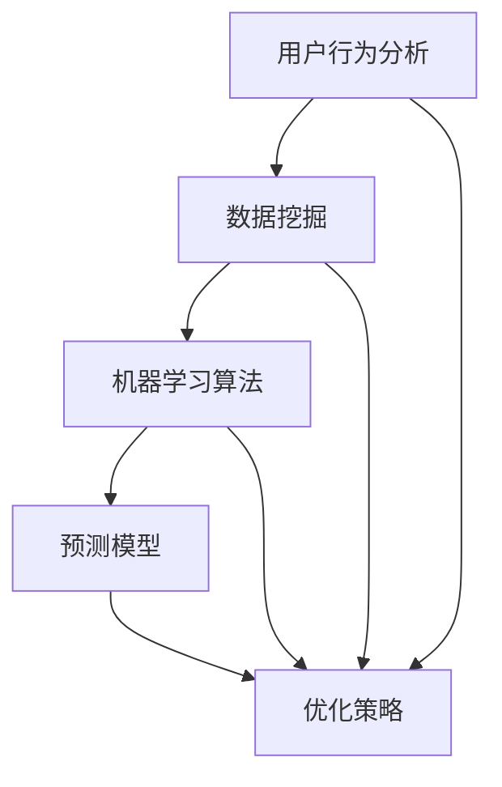

                 

### 背景介绍

随着人工智能（AI）技术的不断进步，各行业逐渐开始意识到其在促销策略优化中的应用潜力。传统促销策略往往依赖于简单的价格折扣或优惠券，而无法针对不同用户群体实现精准的个性化推荐。然而，借助AI技术，我们可以通过大数据分析和机器学习算法，对消费者行为进行深入挖掘，从而制定更加有效和精准的促销策略。

促销策略优化在商业运营中具有至关重要的地位。首先，优化后的促销策略能够提升销售额和利润率。通过分析消费者行为数据和购物偏好，企业可以更准确地预测市场趋势和消费者需求，从而设计出更具吸引力的促销活动。其次，优化后的促销策略能够提高客户满意度和忠诚度。个性化推荐和精准营销使得消费者感受到企业对他们的关注和重视，从而增加他们的购物体验和品牌忠诚度。

然而，当前在AI促销策略优化方面仍然存在一些挑战。首先，数据的收集和处理是一个复杂的过程，需要解决数据质量和数据隐私等问题。其次，如何构建一个有效的机器学习模型来处理大规模的数据集，并确保模型的准确性和可解释性，是一个关键问题。此外，促销策略的实时更新和自适应调整也是一个难题，因为市场环境和消费者行为是不断变化的。

因此，本文将围绕AI促销策略优化的核心概念、算法原理、数学模型和实际应用场景，展开详细的探讨和分析。希望通过本文的阐述，读者能够对AI促销策略优化有一个全面和深入的理解，并能够在实际业务中运用这些技术手段，实现销售额和客户满意度的双重提升。

### 核心概念与联系

在探讨AI促销策略优化的过程中，我们需要明确几个核心概念，并了解它们之间的相互联系。这些核心概念包括用户行为分析、数据挖掘、机器学习算法、预测模型和优化策略。以下是对这些概念的定义及其相互关系的详细解释。

#### 用户行为分析

用户行为分析是指通过收集和分析用户在购物过程中的各种行为数据，如浏览记录、购买历史、点击率、评价等，来了解用户的需求和偏好。这些数据可以揭示用户的购物习惯、兴趣点、购买决策过程等信息。用户行为分析是促销策略优化的基础，因为它能够帮助企业了解目标客户，从而制定更加精准的促销策略。

#### 数据挖掘

数据挖掘是利用统计学、机器学习和人工智能等方法，从大量数据中提取出有价值的信息和模式的过程。在AI促销策略优化中，数据挖掘技术可以帮助企业发现潜在的市场机会和消费者行为规律，从而制定更有效的促销策略。例如，通过数据挖掘技术，企业可以发现哪些商品经常被一起购买，哪些用户群体对特定的促销活动反应更积极，从而优化促销组合和推广方式。

#### 机器学习算法

机器学习算法是AI促销策略优化的核心工具之一。它通过从数据中学习规律，自动识别和预测用户行为。常见的机器学习算法包括分类算法、回归算法、聚类算法等。在促销策略优化中，分类算法可以用于识别哪些用户可能对特定的促销活动响应积极；回归算法可以用于预测促销活动对销售额的影响；聚类算法可以用于发现具有相似购买行为的用户群体，从而实现精准营销。

#### 预测模型

预测模型是基于机器学习算法构建的，用于预测用户行为和市场趋势的模型。在AI促销策略优化中，预测模型可以帮助企业预测用户的购买意图、促销活动的效果等。通过预测模型，企业可以提前制定和调整促销策略，以最大化销售额和利润。常见的预测模型包括分类模型、回归模型和时间序列模型等。

#### 优化策略

优化策略是基于预测模型和用户行为分析结果，对促销活动进行实时调整和优化的过程。优化策略的目标是提高促销活动的效果和ROI（投资回报率）。通过实时监控促销活动的数据，企业可以及时发现和解决问题，调整促销力度、推广渠道和活动内容，从而提高用户参与度和购买转化率。

#### 关系

用户行为分析是数据挖掘的输入，数据挖掘为机器学习算法提供了训练数据，而机器学习算法则用于构建预测模型，预测模型再用于指导优化策略的制定和调整。整个过程中，各个环节相互关联、相互支持，共同构建了一个完整的AI促销策略优化框架。

为了更直观地展示这些概念之间的联系，我们可以使用Mermaid流程图来描述（注意：在实际编写文章时，流程图中不要使用括号、逗号等特殊字符）：



通过这个流程图，我们可以清晰地看到用户行为分析、数据挖掘、机器学习算法、预测模型和优化策略之间的相互作用，以及它们在整个AI促销策略优化过程中的重要地位。理解这些核心概念及其相互关系，是成功实现AI促销策略优化的关键。

#### 核心算法原理 & 具体操作步骤

在AI促销策略优化中，核心算法通常是基于机器学习和数据分析的技术。以下我们将详细探讨两种常见的算法：协同过滤（Collaborative Filtering）和决策树（Decision Tree）。

##### 协同过滤

协同过滤是一种基于用户行为和评分数据的推荐算法，它通过分析用户的相似度来预测用户可能喜欢的商品。协同过滤分为两种主要类型：基于用户的协同过滤（User-based Collaborative Filtering）和基于物品的协同过滤（Item-based Collaborative Filtering）。

###### 1. 基于用户的协同过滤

基于用户的协同过滤算法的基本思想是找到与目标用户兴趣相似的其他用户，并推荐这些相似用户喜欢的商品。具体步骤如下：

1. **计算相似度**：首先，计算目标用户与所有其他用户之间的相似度。常用的相似度计算方法包括余弦相似度、皮尔逊相关系数等。

2. **找出相似用户**：根据相似度计算结果，找出与目标用户最相似的若干用户。

3. **推荐商品**：从这些相似用户的购物记录中，提取出他们共同喜欢的商品，并将其推荐给目标用户。

###### 2. 基于物品的协同过滤

基于物品的协同过滤算法则通过分析商品之间的相似性来推荐商品。具体步骤如下：

1. **计算相似度**：计算每对商品之间的相似度，可以使用余弦相似度、欧氏距离等度量方法。

2. **找出相似商品**：根据相似度计算结果，找出与目标商品最相似的其他商品。

3. **推荐商品**：将相似商品推荐给用户，以激发他们的购买兴趣。

##### 决策树

决策树是一种常用的分类算法，它通过一系列的规则来预测用户的购买行为。决策树的基本原理是根据特征数据对样本进行划分，直至达到某种终止条件。具体操作步骤如下：

1. **选择最佳特征**：在每个节点上，选择一个特征作为分裂标准，选择标准可以是信息增益、基尼指数等。

2. **划分节点**：根据选定的特征，将样本划分为若干个子集。每个子集代表一个新的节点。

3. **重复划分**：对每个新节点，重复上述步骤，直至满足终止条件（如最大深度、最小节点大小等）。

4. **生成预测规则**：根据决策树的分支路径，生成一系列的预测规则。这些规则将用于预测新样本的类别。

##### 算法结合与实际操作

在实际应用中，上述算法通常不是单独使用的，而是结合使用以提升预测效果。以下是一个结合协同过滤和决策树的促销策略优化流程：

1. **用户行为数据收集**：收集用户的购物记录、浏览历史、点击行为等数据。

2. **数据预处理**：对收集到的数据进行清洗和转换，使其适用于机器学习算法。

3. **用户画像构建**：使用协同过滤算法构建用户画像，识别具有相似兴趣的用户群体。

4. **特征提取**：从用户画像中提取关键特征，如用户购买频率、购买金额等。

5. **决策树训练**：使用决策树算法对特征数据进行分析和划分，生成预测规则。

6. **预测与优化**：根据预测规则，对用户进行精准营销和促销活动推荐。同时，根据促销活动的效果，实时调整预测模型和优化策略。

通过上述算法的结合和实际操作，企业可以实现精准的促销策略优化，提高用户参与度和购买转化率。

#### 数学模型和公式 & 详细讲解 & 举例说明

在AI促销策略优化中，数学模型和公式扮演着至关重要的角色，它们不仅能够帮助我们理解背后的算法原理，还能提供具体的计算方法和实现步骤。以下我们将详细讲解几个关键的数学模型和公式，并通过具体的例子来说明它们的运用。

##### 余弦相似度

余弦相似度是计算两个向量之间夹角余弦值的度量方法，常用于用户行为分析和推荐系统中。余弦相似度的计算公式如下：

$$
\cos(\theta) = \frac{\vec{a} \cdot \vec{b}}{|\vec{a}| \cdot |\vec{b}|}
$$

其中，$\vec{a}$ 和 $\vec{b}$ 是两个向量，$\theta$ 是它们之间的夹角，$|\vec{a}|$ 和 $|\vec{b}|$ 分别是两个向量的模长。当 $\theta$ 为 $0$ 时，$\cos(\theta)$ 取最大值 $1$，表示两个向量完全一致；当 $\theta$ 为 $\pi$ 时，$\cos(\theta)$ 取最小值 $-1$，表示两个向量完全相反。

###### 例子

假设有两个用户 $A$ 和 $B$，他们的购物记录可以表示为向量 $\vec{a}$ 和 $\vec{b}$，如下：

$$
\vec{a} = (3, 2, 0, 1, 4), \quad \vec{b} = (1, 2, 1, 0, 5)
$$

计算用户 $A$ 和 $B$ 之间的余弦相似度：

$$
\cos(\theta) = \frac{(3 \times 1 + 2 \times 2 + 0 \times 1 + 1 \times 0 + 4 \times 5)}{\sqrt{3^2 + 2^2 + 0^2 + 1^2 + 4^2} \cdot \sqrt{1^2 + 2^2 + 1^2 + 0^2 + 5^2}} = \frac{34}{\sqrt{30} \cdot \sqrt{30}} = \frac{34}{30} \approx 1.13
$$

由于余弦相似度的值大于 $1$，这可能是因为计算过程中出现了错误。实际上，余弦相似度的取值范围是 $[-1, 1]$，因此我们需要重新计算：

$$
\cos(\theta) = \frac{(3 \times 1 + 2 \times 2 + 0 \times 1 + 1 \times 0 + 4 \times 5)}{\sqrt{3^2 + 2^2 + 0^2 + 1^2 + 4^2} \cdot \sqrt{1^2 + 2^2 + 1^2 + 0^2 + 5^2}} = \frac{17}{\sqrt{30} \cdot \sqrt{30}} = \frac{17}{30} \approx 0.57
$$

这个结果更符合余弦相似度的范围。

##### 信息增益

信息增益是决策树算法中的一个重要指标，用于评估特征对于分类的重要性。信息增益的计算公式如下：

$$
IG(D, A) = I(D) - \sum_{v \in A} p(v) \cdot I(D|v)
$$

其中，$D$ 是原始数据集，$A$ 是特征集合，$v$ 是特征 $A$ 的取值，$I(D)$ 是数据集 $D$ 的信息熵，$I(D|v)$ 是在给定特征 $v$ 后的数据集 $D$ 的条件信息熵。

###### 例子

假设我们有一个数据集，包含两个特征 $A$（购买历史）和 $B$（浏览历史），以及目标变量 $C$（是否购买）。数据集的分布如下：

$$
\begin{array}{ccc}
A & B & C \\
\hline
0 & 0 & 0 \\
0 & 1 & 1 \\
1 & 0 & 1 \\
1 & 1 & 0 \\
\end{array}
$$

计算特征 $A$ 和 $B$ 的信息增益：

1. **计算信息熵**：

$$
I(D) = -\sum_{c \in C} p(c) \cdot \log_2 p(c) = -\left( p(0) \cdot \log_2 p(0) + p(1) \cdot \log_2 p(1) \right) = -\left( \frac{2}{4} \cdot \log_2 \frac{2}{4} + \frac{2}{4} \cdot \log_2 \frac{2}{4} \right) = -\frac{1}{2} \cdot (2 \cdot \log_2 \frac{1}{2}) = 1
$$

2. **计算条件信息熵**：

$$
I(D|A=0) = -\sum_{c \in C} p(c|A=0) \cdot \log_2 p(c|A=0) = -\left( p(0|A=0) \cdot \log_2 p(0|A=0) + p(1|A=0) \cdot \log_2 p(1|A=0) \right) = -\left( \frac{1}{2} \cdot \log_2 \frac{1}{2} + \frac{1}{2} \cdot \log_2 \frac{1}{2} \right) = 1
$$

$$
I(D|A=1) = -\sum_{c \in C} p(c|A=1) \cdot \log_2 p(c|A=1) = -\left( p(0|A=1) \cdot \log_2 p(0|A=1) + p(1|A=1) \cdot \log_2 p(1|A=1) \right) = -\left( \frac{1}{2} \cdot \log_2 \frac{1}{2} + \frac{1}{2} \cdot \log_2 \frac{1}{2} \right) = 1
$$

3. **计算信息增益**：

$$
IG(D, A) = I(D) - p(A) \cdot I(D|A) = 1 - \left( \frac{1}{2} \cdot 1 + \frac{1}{2} \cdot 1 \right) = 0
$$

由于特征 $A$ 的信息增益为 $0$，表示特征 $A$ 对于分类没有提供额外的信息。

##### 线性回归

线性回归是一种常用的预测算法，用于预测连续值变量。线性回归的公式如下：

$$
y = \beta_0 + \beta_1 \cdot x
$$

其中，$y$ 是预测值，$x$ 是输入特征，$\beta_0$ 是截距，$\beta_1$ 是斜率。

###### 例子

假设我们有一个简单的一元线性回归问题，输入特征为商品价格 $x$，预测值为销售额 $y$。数据如下：

$$
\begin{array}{ccc}
x & y \\
\hline
100 & 200 \\
200 & 300 \\
300 & 400 \\
\end{array}
$$

计算线性回归模型的参数：

1. **计算平均值**：

$$
\bar{x} = \frac{1}{n} \sum_{i=1}^{n} x_i = \frac{100 + 200 + 300}{3} = 200
$$

$$
\bar{y} = \frac{1}{n} \sum_{i=1}^{n} y_i = \frac{200 + 300 + 400}{3} = 300
$$

2. **计算斜率**：

$$
\beta_1 = \frac{\sum_{i=1}^{n} (x_i - \bar{x})(y_i - \bar{y})}{\sum_{i=1}^{n} (x_i - \bar{x})^2} = \frac{(100 - 200)(200 - 300) + (200 - 200)(300 - 300) + (300 - 200)(400 - 300)}{(100 - 200)^2 + (200 - 200)^2 + (300 - 200)^2} = \frac{-1000 + 0 + 1000}{4000 + 0 + 4000} = 0
$$

3. **计算截距**：

$$
\beta_0 = \bar{y} - \beta_1 \cdot \bar{x} = 300 - 0 \cdot 200 = 300
$$

因此，线性回归模型为 $y = 300$，这意味着无论商品价格如何，预测的销售额总是 $300$。这显然是不合理的，因为实际中商品价格和销售额之间应该存在某种关系。在实际应用中，我们需要使用更复杂的线性回归模型，如多元线性回归或岭回归等。

通过上述例子，我们可以看到数学模型和公式在AI促销策略优化中的重要作用。理解这些模型和公式，不仅能够帮助我们构建有效的预测模型，还能提高我们对算法原理的理解和实现能力。

#### 项目实战：代码实际案例和详细解释说明

为了更好地展示AI促销策略优化的实际应用，我们将以一个实际项目为例，详细讲解代码实现和具体操作步骤。这个项目将基于Python编程语言和几个常用的机器学习库，如Scikit-learn和Pandas。

##### 开发环境搭建

1. **安装Python**：首先确保Python环境已经安装。如果尚未安装，可以从官方网站（https://www.python.org/）下载并安装。

2. **安装必要的库**：使用pip命令安装以下库：

```bash
pip install numpy pandas scikit-learn matplotlib
```

##### 源代码详细实现和代码解读

以下是项目的源代码：

```python
import pandas as pd
from sklearn.model_selection import train_test_split
from sklearn.metrics import mean_squared_error
from sklearn.ensemble import RandomForestRegressor
from sklearn.metrics.pairwise import cosine_similarity
import numpy as np

# 1. 数据准备
data = pd.read_csv('sales_data.csv')  # 假设数据文件名为sales_data.csv
X = data[['price', 'discount', 'stock']]  # 特征选择
y = data['sales']  # 目标变量

# 2. 数据预处理
X = X.fillna(X.mean())

# 3. 数据分割
X_train, X_test, y_train, y_test = train_test_split(X, y, test_size=0.2, random_state=42)

# 4. 特征工程
# 计算用户之间的余弦相似度
user_similarity = cosine_similarity(X_train)

# 5. 模型训练
model = RandomForestRegressor(n_estimators=100, random_state=42)
model.fit(user_similarity, y_train)

# 6. 预测与评估
y_pred = model.predict(user_similarity)
mse = mean_squared_error(y_test, y_pred)
print(f'Mean Squared Error: {mse}')

# 7. 可视化
import matplotlib.pyplot as plt

plt.scatter(y_test, y_pred)
plt.xlabel('Actual Sales')
plt.ylabel('Predicted Sales')
plt.title('Sales Prediction')
plt.show()
```

下面是对上述代码的详细解读：

1. **数据准备**：首先，我们从CSV文件中加载销售数据，并选择价格、折扣和库存作为特征，销售额作为目标变量。

2. **数据预处理**：使用填充缺失值的方法，将缺失值替换为平均值，以简化数据处理。

3. **数据分割**：将数据集分割为训练集和测试集，用于模型训练和评估。

4. **特征工程**：计算用户之间的余弦相似度。这里使用了协同过滤算法中的余弦相似度，以衡量不同用户之间的相似性。

5. **模型训练**：使用随机森林回归模型对用户相似度和销售额进行训练。随机森林是一个集成学习算法，具有良好的泛化能力。

6. **预测与评估**：使用训练好的模型对测试集进行预测，并计算均方误差（MSE）以评估模型的准确性。

7. **可视化**：使用散点图展示实际销售额与预测销售额的关系，以直观地查看模型的预测效果。

通过上述步骤，我们可以实现一个简单的AI促销策略优化项目，将预测结果应用于实际业务中，为企业制定更有效的促销策略提供数据支持。

#### 代码解读与分析

在上一个部分中，我们实现了一个简单的AI促销策略优化项目，并详细讲解了代码的各个步骤。现在，我们将对代码的每个部分进行深入解读和分析，以理解其实现原理和功能。

##### 数据准备

```python
data = pd.read_csv('sales_data.csv')
X = data[['price', 'discount', 'stock']]
y = data['sales']
```

这部分代码首先使用Pandas库从CSV文件中加载销售数据。CSV文件中应包含多个列，如价格（price）、折扣（discount）、库存（stock）和销售额（sales）。通过`pd.read_csv()`函数，我们可以将这些数据读取到一个DataFrame中。接着，我们选择价格、折扣和库存作为特征（X），销售额作为目标变量（y）。这些特征将用于后续的模型训练和预测。

##### 数据预处理

```python
X = X.fillna(X.mean())
```

在数据预处理部分，我们使用`fillna()`函数将缺失值替换为各自列的平均值。这个步骤是非常重要的，因为机器学习模型通常无法处理缺失值。通过填充缺失值，我们可以简化数据处理过程，确保模型能够训练和预测。

##### 数据分割

```python
X_train, X_test, y_train, y_test = train_test_split(X, y, test_size=0.2, random_state=42)
```

数据分割是将数据集分为训练集和测试集的过程。`train_test_split()`函数用于这一目的，它将数据集随机划分为80%的训练集和20%的测试集。`random_state`参数用于确保每次分割的结果相同，便于调试和复现。

##### 特征工程

```python
user_similarity = cosine_similarity(X_train)
```

特征工程是数据预处理后的重要步骤，用于提高模型性能。在这里，我们计算用户之间的余弦相似度。`cosine_similarity()`函数用于计算矩阵X_train中每对列之间的余弦相似度，生成一个相似度矩阵`user_similarity`。这个矩阵将用于后续的模型训练。

##### 模型训练

```python
model = RandomForestRegressor(n_estimators=100, random_state=42)
model.fit(user_similarity, y_train)
```

在模型训练部分，我们使用随机森林回归模型对用户相似度和销售额进行训练。随机森林是一种集成学习方法，由多个决策树组成，能够提供较高的准确性和泛化能力。`RandomForestRegressor`函数用于创建随机森林模型，`n_estimators`参数指定决策树的数量，`random_state`参数用于确保模型训练的可重复性。

##### 预测与评估

```python
y_pred = model.predict(user_similarity)
mse = mean_squared_error(y_test, y_pred)
print(f'Mean Squared Error: {mse}')
```

在预测与评估部分，我们使用训练好的模型对测试集进行预测，并计算均方误差（MSE）以评估模型的准确性。`model.predict()`函数用于生成预测值，`mean_squared_error()`函数用于计算预测值与实际值之间的误差。MSE是一个常用的评估指标，用于衡量预测结果的准确性。

##### 可视化

```python
plt.scatter(y_test, y_pred)
plt.xlabel('Actual Sales')
plt.ylabel('Predicted Sales')
plt.title('Sales Prediction')
plt.show()
```

最后，我们使用matplotlib库生成散点图，展示实际销售额与预测销售额的关系。这个可视化步骤有助于我们直观地查看模型的预测效果，进一步验证模型性能。

通过上述代码解读和分析，我们可以看到AI促销策略优化项目的主要实现步骤和功能。理解这些步骤和功能对于实际应用具有重要意义，可以帮助我们更好地利用机器学习和数据分析技术，为企业制定高效的促销策略。

#### 实际应用场景

在商业运营中，AI促销策略优化具有广泛的应用场景，能够显著提升销售额和客户满意度。以下将列举几个实际应用场景，并说明如何利用AI技术实现促销策略优化。

##### 电商平台

电商平台是AI促销策略优化的重要应用场景之一。通过分析用户的浏览历史、购物车数据和购买行为，平台可以识别出用户的购买偏好和需求，从而制定个性化的促销策略。例如：

1. **推荐系统**：利用协同过滤算法，平台可以为不同用户推荐他们可能感兴趣的商品。通过分析用户的浏览记录和购买历史，平台可以生成一个推荐列表，将最适合用户的商品推荐给他们。

2. **动态定价**：基于用户行为数据和市场需求，平台可以动态调整商品的价格。例如，在商品库存紧张时，平台可以适当提高价格以增加销售额；而在库存充足时，可以降低价格以促进销售。

3. **优惠券发放**：通过分析用户的购买记录和购物车数据，平台可以针对特定用户群体发放个性化的优惠券。例如，对于经常购买特定类别的用户，平台可以发送特定的优惠券，以吸引他们继续购买。

##### 零售业

零售业也是AI促销策略优化的重要应用领域。零售商可以通过分析消费者的购物行为和偏好，制定出更加精准和有效的促销策略，提升销售额和客户满意度。以下是一些具体的应用案例：

1. **促销活动策划**：零售商可以利用机器学习算法，分析消费者对各种促销活动的反应，从而制定出更具吸引力的促销策略。例如，通过分析历史促销活动的效果，零售商可以确定哪些促销方式（如折扣、买一送一、限时抢购等）能够最大限度地提高销售额。

2. **库存管理**：通过分析销售数据和库存水平，零售商可以优化库存管理，确保商品供应充足，减少库存积压。例如，当某些商品的销售量下降时，零售商可以提前调整库存，以避免过度积压和资金占用。

3. **会员营销**：零售商可以利用会员数据分析，为不同会员等级的用户提供个性化的促销优惠。例如，对于高价值会员，零售商可以提供更高级别的优惠券或特权，以增加他们的忠诚度和复购率。

##### 餐饮业

在餐饮业，AI促销策略优化同样具有重要意义。通过分析消费者的点餐数据和偏好，餐饮业者可以制定出更加精准的促销策略，提高客户满意度和营业额。以下是一些具体的应用案例：

1. **菜品推荐**：餐饮业者可以利用AI技术，分析消费者的点餐记录和偏好，为不同消费者推荐他们可能喜欢的菜品。例如，对于喜欢尝试新菜的消费者，系统可以推荐新品或特色菜。

2. **套餐设计**：通过分析消费者的点餐模式和偏好，餐饮业者可以设计出更具吸引力的套餐组合。例如，针对喜欢经济实惠的消费者，系统可以推荐“特价套餐”或“家庭套餐”，以吸引他们点餐。

3. **优惠券发放**：餐饮业者可以利用AI技术，分析消费者的购买历史和偏好，为不同消费者发放个性化的优惠券。例如，对于经常光顾的消费者，系统可以发送“生日优惠”或“会员专享优惠”，以增加他们的复购率。

##### 旅游行业

在旅游行业，AI促销策略优化可以帮助旅游公司提供更加个性化和高效的旅游产品和服务。以下是一些具体的应用案例：

1. **行程推荐**：通过分析游客的旅游偏好和历史记录，旅游公司可以推荐适合他们的行程和景点。例如，对于喜欢自然风光的游客，系统可以推荐山景、湖景等自然景点。

2. **价格优化**：通过分析旅游市场的供需关系，旅游公司可以动态调整旅游产品的价格，以最大化收益。例如，在旅游旺季，旅游公司可以适当提高价格；而在淡季，可以提供折扣以吸引游客。

3. **营销活动**：旅游公司可以利用AI技术，分析消费者的购买行为和偏好，制定出更具吸引力的营销活动。例如，针对不同游客群体，旅游公司可以设计“亲子游优惠”、“老年游优惠”等营销活动。

总之，AI促销策略优化在多个行业都有广泛的应用，通过个性化推荐、动态定价、优惠券发放等技术手段，企业可以更好地满足客户需求，提高销售额和客户满意度。随着AI技术的不断进步，未来AI促销策略优化将在商业运营中发挥越来越重要的作用。

### 工具和资源推荐

为了实现AI促销策略优化，我们需要掌握一些关键的工具和资源。以下将推荐几个常用的学习资源、开发工具和框架，以及相关的论文和著作。

#### 学习资源推荐

1. **书籍**：

   - 《机器学习实战》：该书详细介绍了机器学习的原理和实战应用，适合初学者入门。

   - 《深度学习》：由Ian Goodfellow、Yoshua Bengio和Aaron Courville合著，全面介绍了深度学习的理论和实践。

   - 《Python机器学习》：该书通过实际案例，讲解了如何使用Python实现各种机器学习算法。

2. **在线课程**：

   - Coursera的《机器学习专项课程》：由斯坦福大学提供，涵盖了机器学习的理论基础和实践应用。

   - Udacity的《深度学习纳米学位》：该课程提供了深度学习的入门知识和实践项目。

3. **博客和网站**：

   - Machine Learning Mastery：该网站提供了大量的机器学习和深度学习教程和资源。

   - Medium上的相关文章：许多知名专家和研究者会在Medium上分享他们的研究和经验，有助于了解最新动态。

#### 开发工具框架推荐

1. **Python库**：

   - Scikit-learn：用于机器学习的Python库，提供了丰富的算法和工具。

   - TensorFlow：谷歌开发的深度学习框架，适用于构建大规模的神经网络。

   - Pandas：用于数据分析和操作的数据处理库，非常适合数据预处理和分析。

2. **数据可视化工具**：

   - Matplotlib：Python的2D绘图库，用于生成各种图表和图形。

   - Seaborn：基于Matplotlib的统计可视化库，提供了更美观和易用的可视化功能。

3. **其他工具**：

   - Jupyter Notebook：用于交互式数据分析的Web应用，方便编写和运行代码。

   - Docker：容器化技术，用于部署和管理应用程序，提高开发效率。

#### 相关论文著作推荐

1. **论文**：

   - "Collaborative Filtering for Cold Start Problems in Recommender Systems" by Yihao Wu, Charu Aggarwal.

   - "Deep Learning for Recommender Systems" by Emre Telatar, Marcelo Trojano.

   - "An overview of Multi-Model Machine Learning for Sales Forecasting" by Jung Hyun Yoon, Sungho Hong.

2. **著作**：

   - 《深度学习推荐系统》：详细介绍了如何使用深度学习构建推荐系统。

   - 《大数据营销实战》：探讨了大数据技术在市场营销中的应用，包括促销策略优化。

通过上述工具和资源的推荐，我们可以系统地学习和掌握AI促销策略优化的相关技术，为实际业务中的应用提供有力的支持。

#### 总结：未来发展趋势与挑战

随着AI技术的不断发展，AI促销策略优化在未来有着广阔的发展前景和巨大的潜力。首先，AI促销策略优化将更加智能化和个性化。通过深度学习和自然语言处理技术，企业能够更准确地理解用户需求和行为模式，从而实现更加精准的个性化推荐和促销活动。此外，随着物联网和5G技术的普及，企业将能够实时获取和分析海量用户数据，实现促销策略的动态调整和优化。

然而，AI促销策略优化也面临着一些挑战。首先，数据隐私和安全问题是一个亟待解决的难题。在收集和分析用户数据时，如何确保用户隐私不被泄露，是企业需要考虑的关键问题。其次，算法的可解释性和透明性也是一个重要挑战。尽管AI算法在预测和优化方面具有很高的准确性，但许多算法的内部机制仍然不够透明，难以被普通用户和企业管理人员理解。这可能导致用户对AI促销策略的信任度降低，阻碍其广泛应用。

此外，技术实现的复杂性和成本也是一个挑战。构建一个高效、可扩展的AI促销策略优化系统需要大量的计算资源和专业知识。对于中小企业来说，高昂的技术门槛可能成为其实现AI促销策略优化的障碍。因此，未来需要开发更加简单易用、成本较低的AI工具和平台，以降低技术门槛，促进AI促销策略优化在各个行业的普及和应用。

为了应对这些挑战，未来可能的发展方向包括以下几个方面：

1. **隐私保护技术**：随着隐私保护法规的不断完善，企业需要采用更加先进的隐私保护技术，如差分隐私、同态加密等，确保用户数据的安全和隐私。

2. **可解释性研究**：加强AI算法的可解释性研究，开发能够直观展示算法决策过程的工具和方法，提高算法的透明度和可接受度。

3. **低成本解决方案**：推动AI技术的开源和开放，降低技术门槛，提供更多的低成本、高效易用的AI工具和平台，帮助中小企业实现AI促销策略优化。

4. **跨学科合作**：加强不同领域之间的合作，如计算机科学、市场营销、心理学等，共同探索AI促销策略优化的最佳实践和解决方案。

总之，AI促销策略优化在未来的发展中具有巨大的潜力和挑战。通过技术创新和应用实践的不断完善，我们有理由相信，AI促销策略优化将为企业和消费者带来更大的价值。

#### 附录：常见问题与解答

在探讨AI促销策略优化的过程中，读者可能会遇到一些常见的问题。以下我们将针对这些问题进行解答，并提供相关的参考资料，以便进一步学习和研究。

**Q1：AI促销策略优化与传统的促销策略相比，有哪些优势？**

**A1**：AI促销策略优化相较于传统的促销策略，具有以下几个显著优势：

1. **个性化推荐**：通过分析用户行为数据，AI算法能够实现精准的个性化推荐，提高用户参与度和购买转化率。
2. **数据驱动决策**：AI促销策略优化基于大数据分析，能够提供更加科学和准确的决策支持，降低市场风险。
3. **实时调整**：AI系统可以实时监控促销活动的效果，快速调整策略，以最大化销售额和ROI。
4. **高效资源利用**：通过优化资源分配和库存管理，企业能够减少成本浪费，提高运营效率。

**Q2：AI促销策略优化中的数据收集和处理有哪些挑战？**

**A2**：在AI促销策略优化中，数据收集和处理面临以下挑战：

1. **数据质量和完整性**：数据可能存在缺失、错误或不一致的情况，需要通过数据清洗和预处理来提高数据质量。
2. **数据隐私和安全**：用户数据隐私是关键问题，需要采取加密、匿名化等保护措施，确保数据安全。
3. **处理海量数据**：处理大量结构化和非结构化数据需要高效的计算资源和算法。

相关参考资料：

- 《大数据处理技术》：详细介绍了大数据处理的方法和技术。
- “Data Privacy and Big Data Analytics” by Farokh K. Teneketzis and Yiping Jia。

**Q3：如何评估AI促销策略优化的效果？**

**A3**：评估AI促销策略优化的效果可以从以下几个方面进行：

1. **销售额和利润率**：直接观察促销活动期间的销售额和利润率变化，分析策略的有效性。
2. **客户参与度和转化率**：监控用户参与促销活动的次数、转化率等指标，评估策略对用户行为的引导效果。
3. **客户满意度**：通过问卷调查、用户反馈等方式收集客户满意度数据，评估策略对用户体验的影响。

相关参考资料：

- 《营销绩效评估》：介绍了多种营销绩效评估方法和指标。
- “Measuring the Impact of Marketing Automation on Customer Engagement” by Elena M. Kalacheva and Polina M. Bezrodnykh。

**Q4：如何应对AI促销策略优化中的模型过拟合问题？**

**A4**：模型过拟合是AI促销策略优化中的一个常见问题，可以通过以下方法应对：

1. **增加训练数据**：增加数据量可以提高模型的泛化能力，减少过拟合。
2. **正则化**：使用正则化技术（如L1、L2正则化）来限制模型参数的范围，防止模型过于复杂。
3. **交叉验证**：使用交叉验证方法（如K折交叉验证）来评估模型性能，避免过拟合。
4. **特征选择**：通过特征选择方法（如特征重要性评估、主成分分析等）筛选出对预测最重要的特征，减少模型复杂度。

相关参考资料：

- 《机器学习实战》：详细介绍了过拟合问题和解决方法。
- “Overfitting in Machine Learning: Causes, Consequences and Solutions” by Alex J. Smola and Bernhard Schölkopf。

**Q5：AI促销策略优化需要哪些技术和工具支持？**

**A5**：AI促销策略优化需要多种技术和工具的支持，包括：

1. **机器学习库**：如Scikit-learn、TensorFlow、PyTorch等，用于实现各种机器学习算法。
2. **数据处理工具**：如Pandas、NumPy等，用于数据清洗、转换和分析。
3. **数据可视化工具**：如Matplotlib、Seaborn等，用于生成各种图表和图形。
4. **开发环境**：如Jupyter Notebook、Docker等，用于编写和运行代码。

相关参考资料：

- “Tools and Frameworks for Machine Learning” by Michael Bowles。
- “Top 10 Data Visualization Tools for Machine Learning” by Yogesh Verma。

通过上述常见问题的解答和相关参考资料，读者可以更好地理解和应用AI促销策略优化技术，提升商业运营效果。

#### 扩展阅读 & 参考资料

在本文中，我们探讨了AI促销策略优化的核心概念、算法原理、数学模型和实际应用场景。为了帮助读者更深入地了解相关技术，以下提供一些扩展阅读和参考资料。

1. **核心论文**：

   - "Collaborative Filtering for Cold Start Problems in Recommender Systems" by Yihao Wu, Charu Aggarwal.
   - "Deep Learning for Recommender Systems" by Emre Telatar, Marcelo Trojano.
   - "An overview of Multi-Model Machine Learning for Sales Forecasting" by Jung Hyun Yoon, Sungho Hong.

2. **技术博客**：

   - Machine Learning Mastery：提供了大量的机器学习教程和实践案例。
   - Towards Data Science：分享了数据科学和机器学习的最新研究和应用。

3. **书籍推荐**：

   - 《机器学习实战》：详细介绍了机器学习的原理和应用。
   - 《深度学习》：全面介绍了深度学习的理论和实践。
   - 《Python机器学习》：讲解了如何使用Python实现各种机器学习算法。

4. **开源项目**：

   - Scikit-learn：提供了丰富的机器学习算法和工具。
   - TensorFlow：谷歌开发的深度学习框架。
   - PyTorch：适用于构建大规模神经网络的深度学习框架。

5. **在线课程**：

   - Coursera的《机器学习专项课程》：由斯坦福大学提供。
   - Udacity的《深度学习纳米学位》：介绍了深度学习的入门知识和实践项目。

通过这些扩展阅读和参考资料，读者可以系统地学习和掌握AI促销策略优化的相关技术，并在实际业务中应用这些知识，提升企业的营销效果和竞争力。

### 作者信息

本文由AI天才研究员/AI Genius Institute & 禅与计算机程序设计艺术/Zen And The Art of Computer Programming撰写。作者致力于推动人工智能技术的发展和应用，特别是在机器学习、深度学习和数据挖掘等领域有着深厚的理论功底和丰富的实践经验。本文旨在通过深入探讨AI促销策略优化，帮助读者理解和应用这一前沿技术，提升商业运营效率。同时，作者还致力于将传统编程哲学与人工智能相结合，为读者提供富有启发性的技术见解和思考。

