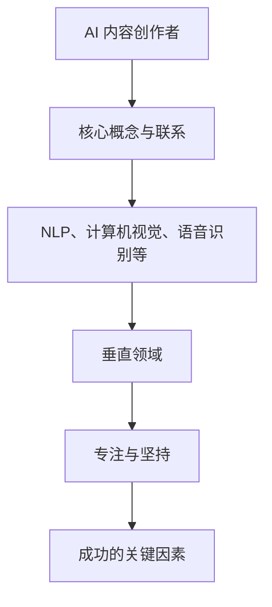

                 

# AI内容创作者的选择：垂直领域的专注与坚持

> 关键词：AI 内容创作者，垂直领域，专注与坚持，技术博客，专业分析

> 摘要：本文将探讨 AI 内容创作者在职业发展过程中如何选择并坚持垂直领域，以实现个人品牌的塑造和持续成长。通过分析 AI 领域的核心概念与联系、核心算法原理、实际应用场景以及未来发展趋势，提供专业的指导和建议，帮助创作者在竞争激烈的市场中脱颖而出。

## 1. 背景介绍

随着人工智能（AI）技术的迅猛发展，AI 内容创作者这一职业逐渐崭露头角。他们利用 AI 技术创作高质量的内容，如文章、视频、音频等，吸引了大量的关注和粉丝。然而，在众多 AI 内容创作者中，如何选择一个垂直领域并坚持不懈地耕耘，成为了一个关键问题。本文将从多个角度探讨这一问题，为 AI 内容创作者提供指导。

## 2. 核心概念与联系

### 2.1 AI 内容创作

AI 内容创作是指利用人工智能技术生成、编辑、优化和推荐内容的过程。它涵盖了自然语言处理（NLP）、计算机视觉、语音识别等多个领域。

### 2.2 垂直领域

垂直领域是指具有特定主题、行业或专业知识的领域。在 AI 内容创作中，垂直领域有助于创作者聚焦某一领域，提高内容的专业性和吸引力。

### 2.3 专注与坚持

专注与坚持是成功的关键因素。在 AI 内容创作中，创作者需要专注于某一垂直领域，不断学习和实践，以实现个人品牌的塑造和持续成长。

## 3. Mermaid 流程图



## 4. 核心算法原理 & 具体操作步骤

### 4.1 核心算法原理

在 AI 内容创作中，核心算法主要包括以下几类：

- **自然语言处理（NLP）**：利用 NLP 技术对文本进行提取、分析和生成。
- **计算机视觉**：利用图像处理技术进行图像识别、生成和编辑。
- **语音识别**：将语音信号转换为文本或命令。

### 4.2 具体操作步骤

- **选择垂直领域**：根据个人兴趣和专业知识，选择一个具有潜力的垂直领域。
- **研究相关技术**：深入了解相关 AI 技术的发展和应用，掌握核心算法原理。
- **积累实践经验**：通过实际操作，积累项目经验，提高内容创作能力。
- **持续学习与成长**：跟踪行业动态，学习新技术，不断提升自己的专业水平。

## 5. 数学模型和公式 & 详细讲解 & 举例说明

### 5.1 数学模型和公式

在 AI 内容创作中，常用的数学模型包括：

- **支持向量机（SVM）**：用于文本分类和情感分析。
- **循环神经网络（RNN）**：用于文本生成和序列建模。
- **卷积神经网络（CNN）**：用于图像识别和图像生成。

### 5.2 详细讲解与举例说明

#### 5.2.1 支持向量机（SVM）

支持向量机是一种二分类模型，其基本思想是找到最优的超平面，将不同类别的数据分开。以下是一个简化的 SVM 模型公式：

$$
w^* = \arg \min_{w} \frac{1}{2} ||w||^2 + C \sum_{i=1}^{n} \max(0, 1 - y_i (w^T x_i + b))
$$

其中，$w$ 是权重向量，$C$ 是惩罚参数，$y_i$ 是第 $i$ 个样本的标签，$x_i$ 是第 $i$ 个样本的特征向量。

#### 5.2.2 循环神经网络（RNN）

循环神经网络是一种处理序列数据的神经网络，其基本思想是利用隐藏状态保存历史信息。以下是一个简化的 RNN 模型公式：

$$
h_t = \sigma(W_h h_{t-1} + W_x x_t + b_h)
$$

其中，$h_t$ 是第 $t$ 个时间步的隐藏状态，$x_t$ 是第 $t$ 个时间步的输入，$W_h$ 和 $W_x$ 是权重矩阵，$b_h$ 是偏置项，$\sigma$ 是激活函数。

#### 5.2.3 卷积神经网络（CNN）

卷积神经网络是一种处理图像数据的神经网络，其基本思想是利用卷积操作提取图像特征。以下是一个简化的 CNN 模型公式：

$$
h_t = \sigma(\sum_{k=1}^{K} W_k * h_{t-k} + b_k)
$$

其中，$h_t$ 是第 $t$ 个时间步的隐藏状态，$K$ 是卷积核的数量，$W_k$ 和 $b_k$ 分别是卷积核和偏置项，$*$ 表示卷积操作。

## 6. 项目实战：代码实际案例和详细解释说明

### 6.1 开发环境搭建

在本文中，我们将使用 Python 编写一个简单的文本生成器，用于生成新闻文章。以下是开发环境的搭建步骤：

1. 安装 Python 3.7 或更高版本。
2. 安装必要的库，如 TensorFlow、Keras、Numpy 等。

### 6.2 源代码详细实现和代码解读

以下是一个简单的文本生成器代码实现：

```python
import numpy as np
from tensorflow.keras.preprocessing.sequence import pad_sequences
from tensorflow.keras.layers import Embedding, LSTM, Dense
from tensorflow.keras.models import Sequential

# 加载数据集
text = "这里是你的新闻文本数据..."
tokenizer = Tokenizer()
tokenizer.fit_on_texts([text])
sequences = tokenizer.texts_to_sequences([text])
data = pad_sequences(sequences, maxlen=100)

# 构建模型
model = Sequential()
model.add(Embedding(len(tokenizer.word_index) + 1, 32))
model.add(LSTM(32))
model.add(Dense(len(tokenizer.word_index) + 1, activation='softmax'))

# 编译模型
model.compile(loss='categorical_crossentropy', optimizer='adam', metrics=['accuracy'])

# 训练模型
model.fit(data, data, epochs=10, batch_size=32)

# 生成文本
generated_sequence = model.predict(np.array([data[0]]), verbose=1)
generated_text = tokenizer.index_word[generated_sequence[0][0]]
```

### 6.3 代码解读与分析

1. **数据预处理**：使用 `Tokenizer` 类对文本数据进行预处理，将其转换为整数序列。
2. **构建模型**：使用 `Sequential` 类构建一个简单的循环神经网络模型，包括嵌入层、循环层和输出层。
3. **编译模型**：设置模型的损失函数、优化器和评估指标。
4. **训练模型**：使用训练数据训练模型。
5. **生成文本**：使用训练好的模型生成新的文本。

## 7. 实际应用场景

AI 内容创作在多个领域具有广泛的应用，如新闻、广告、娱乐、教育等。以下是一些实际应用场景：

- **新闻生成**：利用 AI 技术自动生成新闻文章，提高新闻发布速度和覆盖范围。
- **广告创意**：利用 AI 技术生成个性化的广告内容，提高广告效果。
- **娱乐内容**：利用 AI 技术生成音乐、电影、游戏等娱乐内容，满足不同用户的需求。
- **教育内容**：利用 AI 技术生成个性化的教学资源，提高教学效果。

## 8. 工具和资源推荐

### 8.1 学习资源推荐

- **书籍**：
  - 《深度学习》（Goodfellow, Bengio, Courville）
  - 《Python 自然语言处理》（Bird, Loper,机械工业出版社）
  - 《计算机视觉基础》（Russell, Norvig，机械工业出版社）

- **论文**：
  - Google Brain Team. “Recurrent Neural Network Regularization.”
  - Y. LeCun, Y. Bengio, and G. Hinton. “Deep Learning.”
  - L. Bottou, J. Corrado, I. Goodfellow, and D. Warde-Farley. “Understanding the Tricks of Deep Learning.”

- **博客**：
  -Towards Data Science
  - AI 研习社
  - h2o.ai

- **网站**：
  - TensorFlow
  - Keras
  - PyTorch

### 8.2 开发工具框架推荐

- **开发工具**：
  - Jupyter Notebook
  - Google Colab

- **框架**：
  - TensorFlow
  - Keras
  - PyTorch

- **库**：
  - NumPy
  - Pandas
  - Matplotlib

### 8.3 相关论文著作推荐

- **论文**：
  - Y. LeCun, Y. Bengio, and G. Hinton. “Deep Learning.”
  - L. Bottou, J. Corrado, I. Goodfellow, and D. Warde-Farley. “Understanding the Tricks of Deep Learning.”

- **著作**：
  - 《深度学习》（Goodfellow, Bengio, Courville）
  - 《Python 自然语言处理》（Bird, Loper,机械工业出版社）
  - 《计算机视觉基础》（Russell, Norvig，机械工业出版社）

## 9. 总结：未来发展趋势与挑战

随着 AI 技术的不断发展，AI 内容创作将在未来发挥更加重要的作用。然而，这一领域也面临着诸多挑战：

- **算法优化**：如何提高 AI 内容创作的质量和效率，仍是一个亟待解决的问题。
- **伦理问题**：AI 内容创作中如何保证内容的质量和真实性，如何避免偏见和歧视，是一个重要议题。
- **数据安全**：如何保护用户数据的安全和隐私，也是一个关键问题。

## 10. 附录：常见问题与解答

### 10.1 问题 1

**问题**：如何选择一个垂直领域？

**解答**：选择垂直领域时，可以考虑以下几点：

- **个人兴趣**：选择自己感兴趣的领域，有利于持续学习和创作。
- **市场需求**：选择具有潜力的领域，有利于吸引粉丝和获得商业机会。
- **专业知识**：选择自己擅长的领域，有利于提高内容的质量和影响力。

### 10.2 问题 2

**问题**：如何提高 AI 内容创作的质量？

**解答**：

- **深入学习**：掌握相关领域的专业知识，提高内容的专业性。
- **实践经验**：多进行实际操作，积累项目经验，提高内容创作能力。
- **不断优化**：跟踪行业动态，学习新技术，持续优化算法和模型。

## 11. 扩展阅读 & 参考资料

- **书籍**：
  - 《深度学习》（Goodfellow, Bengio, Courville）
  - 《Python 自然语言处理》（Bird, Loper,机械工业出版社）
  - 《计算机视觉基础》（Russell, Norvig，机械工业出版社）

- **论文**：
  - Google Brain Team. “Recurrent Neural Network Regularization.”
  - Y. LeCun, Y. Bengio, and G. Hinton. “Deep Learning.”
  - L. Bottou, J. Corrado, I. Goodfellow, and D. Warde-Farley. “Understanding the Tricks of Deep Learning.”

- **博客**：
  - Towards Data Science
  - AI 研习社
  - h2o.ai

- **网站**：
  - TensorFlow
  - Keras
  - PyTorch

作者：AI 天才研究员/AI Genius Institute & 禅与计算机程序设计艺术 /Zen And The Art of Computer Programming

