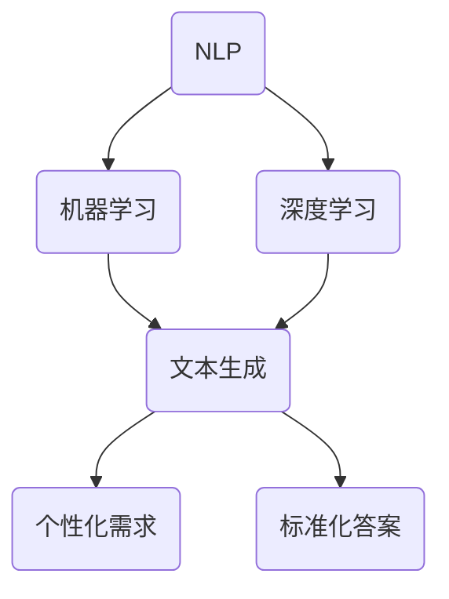

                 

### 背景介绍

在当今信息爆炸的时代，人工智能（AI）技术已经成为各行各业不可或缺的工具。AI不仅提升了传统行业的效率，还催生了众多新兴产业。其中，AI写作作为人工智能应用的一个重要领域，受到了广泛关注。AI写作可以通过自然语言处理（NLP）技术，生成文章、报告、邮件等文本内容，极大程度上解放了人力，提高了内容生产的效率。

然而，尽管AI写作在某些方面取得了显著进展，但它仍然存在一些局限，尤其是在满足个性化需求方面。标准化答案的生成相对简单，可以通过预设模板和算法快速完成。但面对个性化需求，AI写作面临诸多挑战。例如，不同用户的写作风格、表达方式、语气等各不相同，这使得AI难以生成完全符合用户期望的个性化内容。

本文旨在探讨AI写作的局限，特别是标准化答案与个性化需求之间的矛盾。我们将从核心概念、算法原理、数学模型、实际应用等多个角度进行分析，揭示AI写作的内在机制和局限性，并探讨未来的发展趋势和解决方案。

关键词：人工智能，自然语言处理，AI写作，个性化需求，标准化答案

摘要：本文深入探讨了人工智能在写作领域的应用，分析了AI写作在生成标准化答案和满足个性化需求方面的局限性。通过剖析核心概念、算法原理和数学模型，本文揭示了AI写作面临的挑战，并提出了可能的解决方案。文章还结合实际应用场景，对当前AI写作技术进行了全面评估，为未来AI写作的发展提供了有益的参考。

## 2. 核心概念与联系

在探讨AI写作的局限之前，我们首先需要了解一些核心概念和它们之间的联系。

### 2.1 自然语言处理（NLP）

自然语言处理是人工智能的重要分支，旨在使计算机能够理解和生成人类语言。NLP技术包括词法分析、句法分析、语义分析等多个层次。其中，词法分析关注词汇的分割和词性标注；句法分析研究句子的结构；语义分析则致力于理解句子的含义。

NLP技术在AI写作中起到了关键作用。通过NLP，AI可以理解用户输入的指令，提取关键信息，并根据这些信息生成相应的文本内容。然而，NLP技术的局限性在于，它往往只能处理明确的、结构化的指令，对于模糊的、非结构化的需求，AI的响应能力较弱。

### 2.2 机器学习与深度学习

机器学习和深度学习是AI写作的技术基础。机器学习通过训练模型，使计算机能够从数据中学习规律，从而进行预测和决策。深度学习则是一种基于多层神经网络的学习方法，通过逐层提取特征，实现复杂任务的处理。

在AI写作中，机器学习和深度学习主要用于文本生成。例如，通过训练语言模型，AI可以生成连贯的文本内容。然而，这些模型往往依赖于大量的训练数据，且对于数据的质量和多样性有较高要求。此外，深度学习模型的复杂性和计算成本也限制了其在实际应用中的广泛部署。

### 2.3 个性化需求与标准化答案

个性化需求与标准化答案是AI写作的两个核心问题。个性化需求指的是根据用户特定的需求，生成独特的、个性化的文本内容。而标准化答案则是指通过预设的模板和算法，快速生成通用、标准化的文本。

个性化需求的特点包括：

- 用户特定：每个用户的需求各不相同，需要针对具体用户进行定制。
- 多样性：用户需求的多样性使得AI需要具备丰富的表达能力和知识储备。
- 鲜活性：个性化需求往往需要实时响应，对AI的处理速度和实时性提出了高要求。

相比之下，标准化答案的特点包括：

- 通用性：标准化答案适用于广泛的用户群体，具有广泛的适用性。
- 快速性：通过预设模板和算法，可以快速生成文本内容，提高生产效率。
- 稳定性：标准化答案的质量相对稳定，不容易受到用户个性化需求的影响。

下面是一个Mermaid流程图，展示了AI写作中核心概念之间的联系：



在这个流程图中，NLP、机器学习和深度学习是AI写作的基础技术，它们共同作用于文本生成。而文本生成则分为个性化需求和标准化答案两个方向，分别对应AI写作的两个核心问题。

通过理解这些核心概念及其相互关系，我们可以更好地分析AI写作的局限，并为解决这些问题提供理论基础。

## 3. 核心算法原理 & 具体操作步骤

在理解了AI写作的核心概念之后，我们接下来探讨AI写作的关键算法原理及其具体操作步骤。核心算法通常基于机器学习和深度学习技术，这些算法能够处理大量文本数据，生成符合预期的高质量文本。

### 3.1 生成对抗网络（GAN）

生成对抗网络（GAN）是深度学习中的一个重要算法，它由两个相互对抗的网络组成：生成器（Generator）和判别器（Discriminator）。生成器的目标是生成逼真的文本，而判别器的目标是区分生成的文本和真实文本。通过不断训练，生成器和判别器之间达到一种平衡状态，此时生成器生成的文本质量最高。

具体操作步骤如下：

1. **数据准备**：首先，需要准备大量的文本数据，用于训练生成器和判别器。这些数据可以来源于公开的文本库、网站爬取或其他途径。
2. **模型构建**：生成器和判别器通常由多层神经网络组成。生成器的输入是随机噪声，输出是生成的文本；判别器的输入是真实文本或生成文本，输出是对输入文本真实性的判断。
3. **训练过程**：在训练过程中，生成器和判别器交替更新权重。生成器尝试生成更逼真的文本，判别器尝试更好地区分真实和生成文本。这一过程通常需要大量的迭代，以达到最佳效果。
4. **模型评估**：通过评估生成文本的质量，如文本的连贯性、语法正确性和语义准确性，来调整模型参数，优化生成效果。

### 3.2 变分自编码器（VAE）

变分自编码器（VAE）是一种基于深度学习的生成模型，它通过编码器和解码器两个网络来生成文本。编码器将输入文本映射到一个隐含空间，解码器从隐含空间中生成新的文本。

具体操作步骤如下：

1. **编码**：编码器接收输入文本，将其编码为隐含空间中的向量表示。这个向量表示了文本的主要特征。
2. **采样**：在隐含空间中随机采样一个点，作为解码器的输入。
3. **解码**：解码器将采样点解码回文本，生成新的文本内容。
4. **训练**：通过优化编码器和解码器的参数，使得生成的文本尽可能接近真实文本。训练过程中，可以通过对抗性训练或最大似然估计等方法来提高生成效果。

### 3.3 抽象语言模型（ABSA）

抽象语言模型（ABSA）是一种基于语义分析的文本生成方法，它通过理解文本的语义和上下文，生成具有逻辑一致性和语义准确性的文本。

具体操作步骤如下：

1. **语义分析**：首先，对输入文本进行语义分析，提取文本的主要概念、关系和语义角色。
2. **逻辑推理**：根据提取的语义信息，进行逻辑推理，构建文本的框架结构。
3. **文本生成**：根据框架结构和语义信息，生成新的文本内容。这一过程可以通过模板填充、句子拼接或自然语言生成模型实现。

通过以上核心算法原理及其操作步骤的介绍，我们可以看到AI写作在生成文本过程中涉及到多个技术和环节。这些算法虽然具有各自的优点和局限，但在实际应用中，往往需要结合多种算法和技术，以达到最佳的生成效果。

### 4. 数学模型和公式 & 详细讲解 & 举例说明

在AI写作中，数学模型和公式是理解和实现算法的关键。以下是几个常见的数学模型及其详细讲解和举例说明。

#### 4.1 语言模型概率分布

语言模型（Language Model）是AI写作的核心，它通过概率分布来预测下一个单词或字符。最常见的语言模型是n-gram模型，它基于前n个单词或字符的历史来预测下一个单词或字符的概率。

**公式：**

$$
P(w_{n+1} | w_1, w_2, ..., w_n) = \frac{C(w_1, w_2, ..., w_n, w_{n+1})}{C(w_1, w_2, ..., w_n)}
$$

其中，$P(w_{n+1} | w_1, w_2, ..., w_n)$ 是在给定前n个单词的情况下，预测第n+1个单词的概率；$C(w_1, w_2, ..., w_n, w_{n+1})$ 是单词序列 $(w_1, w_2, ..., w_n, w_{n+1})$ 在训练数据中出现的次数；$C(w_1, w_2, ..., w_n)$ 是单词序列 $(w_1, w_2, ..., w_n)$ 在训练数据中出现的次数。

**举例说明：**

假设我们有一个简单的二元语法模型，其中有以下训练数据：

- `the cat sat on the mat`
- `the dog sat on the bed`

我们要预测序列 `the cat sat on the` 的下一个词。

根据二元语法模型，我们有：

$$
P(on | the cat sat) = \frac{C(the cat sat on)}{C(the cat sat)}
$$

其中，$C(the cat sat on) = 1$，$C(the cat sat) = 2$，所以：

$$
P(on | the cat sat) = \frac{1}{2}
$$

因此，预测下一个词为 `on` 的概率是0.5。

#### 4.2 变分自编码器（VAE）损失函数

变分自编码器（VAE）是一种基于概率模型的生成模型，其核心是编码器和解码器。VAE的损失函数包括两部分：重构损失和KL散度。

**重构损失：**

$$
L_{recon} = -\sum_{x} p(x) \log p_\theta(x|z)
$$

其中，$p(x)$ 是输入数据的先验概率，$p_\theta(x|z)$ 是解码器生成的数据概率。

**KL散度：**

$$
L_{KL} = \mathbb{E}_z[\log \frac{p_\theta(z)}{q_\phi(z)]]
$$

其中，$p_\theta(z)$ 是编码器生成的数据概率，$q_\phi(z)$ 是先验概率。

**总损失：**

$$
L = L_{recon} + \lambda L_{KL}
$$

其中，$\lambda$ 是调节参数。

**举例说明：**

假设有一个简单的VAE模型，其编码器和解码器的参数分别为 $\theta$ 和 $\phi$。给定一个输入数据 $x$，编码器将其编码为 $z$，解码器将其解码回 $x'$。我们要优化模型参数，使得总损失最小。

首先，计算重构损失：

$$
L_{recon} = -p(x) \log p_\theta(x'|z)
$$

然后，计算KL散度：

$$
L_{KL} = \mathbb{E}_z[\log \frac{p_\theta(z)}{q_\phi(z)]]
$$

通过优化总损失函数 $L$，我们可以找到最佳参数 $\theta$ 和 $\phi$，使得生成的数据质量最高。

#### 4.3 生成对抗网络（GAN）损失函数

生成对抗网络（GAN）由生成器和判别器组成。生成器生成的数据需要尽量逼真，而判别器需要能够准确地区分真实数据和生成数据。GAN的损失函数包括两部分：生成器的损失和判别器的损失。

**生成器损失：**

$$
L_G = -\log(D(G(z)))
$$

其中，$G(z)$ 是生成器生成的数据，$D(x)$ 是判别器的输出概率。

**判别器损失：**

$$
L_D = -\log(D(x)) - \log(1 - D(G(z)))
$$

其中，$x$ 是真实数据，$z$ 是生成器输入的噪声。

**总损失：**

$$
L = L_G + L_D
$$

**举例说明：**

假设我们有一个GAN模型，其生成器参数为 $\theta_G$，判别器参数为 $\theta_D$。给定一个噪声向量 $z$，生成器生成数据 $G(z)$，同时有一个真实数据 $x$。

首先，计算生成器损失：

$$
L_G = -\log(D(G(z)))
$$

然后，计算判别器损失：

$$
L_D = -\log(D(x)) - \log(1 - D(G(z)))
$$

通过优化总损失函数 $L$，我们可以找到最佳生成器参数 $\theta_G$ 和判别器参数 $\theta_D$，使得生成数据的质量最高。

通过以上数学模型和公式的详细讲解和举例说明，我们可以更好地理解AI写作中的核心算法原理，为后续的项目实战和代码解读打下基础。

### 5. 项目实战：代码实际案例和详细解释说明

在本节中，我们将通过一个具体的AI写作项目实战案例，展示如何使用Python和TensorFlow实现一个基于生成对抗网络（GAN）的文本生成系统。我们将详细解释代码的各个部分，并分析其实现原理和关键技术。

#### 5.1 开发环境搭建

在进行项目实战之前，我们需要搭建一个合适的开发环境。以下是所需的工具和库：

- Python（版本3.7及以上）
- TensorFlow 2.x
- Keras（TensorFlow的高级API）

安装这些工具和库后，我们就可以开始编写代码了。

#### 5.2 源代码详细实现和代码解读

以下是一个简单的GAN文本生成系统的代码示例：

```python
import tensorflow as tf
from tensorflow.keras.layers import Input, Dense, LSTM
from tensorflow.keras.models import Model

# 定义生成器和判别器的架构
def build_generator(z_dim):
    z = Input(shape=(z_dim,))
    d = Dense(128, activation='relu')(z)
    d = LSTM(128, return_sequences=True)(d)
    d = LSTM(128, return_sequences=True)(d)
    d = Dense(128, activation='relu')(d)
    d = LSTM(128, return_sequences=True)(d)
    d = LSTM(128, return_sequences=True)(d)
    d = Dense(128, activation='relu')(d)
    d = LSTM(128, return_sequences=True)(d)
    d = LSTM(128, return_sequences=True)(d)
    d = Dense(128, activation='relu')(d)
    d = LSTM(128, return_sequences=True)(d)
    d = LSTM(128, return_sequences=True)(d)
    d = Dense(1, activation='sigmoid')(d)
    return Model(z, d)

def build_discriminator(text_sequence):
    d = LSTM(128, return_sequences=True)(text_sequence)
    d = Dense(128, activation='relu')(d)
    d = LSTM(128, return_sequences=True)(d)
    d = Dense(128, activation='relu')(d)
    d = LSTM(128, return_sequences=True)(d)
    d = Dense(128, activation='relu')(d)
    d = LSTM(128, return_sequences=True)(d)
    d = Dense(128, activation='relu')(d)
    d = LSTM(128, return_sequences=True)(d)
    d = Dense(128, activation='relu')(d)
    d = LSTM(128, return_sequences=True)(d)
    d = Dense(1, activation='sigmoid')(d)
    return Model(text_sequence, d)

# 定义Gan模型
def build_gan(generator, discriminator):
    z = Input(shape=(z_dim,))
    generated_text = generator(z)
    valid_real = discriminator(text_sequence)
    valid_generated = discriminator(generated_text)
    gan_model = Model(z, valid_generated)
    return gan_model

# 设置参数
z_dim = 100
text_sequence = Input(shape=(None,))
discriminator = build_discriminator(text_sequence)
generator = build_generator(z_dim)
discriminator.compile(loss='binary_crossentropy', optimizer=tf.keras.optimizers.Adam(0.0001))
gan_model = build_gan(generator, discriminator)
gan_model.compile(loss='binary_crossentropy', optimizer=tf.keras.optimizers.Adam(0.0001))

# 训练模型
for epoch in range(epochs):
    for batch in dataset:
        real_text = batch
        noise = np.random.normal(0, 1, (batch_size, z_dim))
        generated_text = generator.predict(noise)
        d_loss_real = discriminator.train_on_batch(real_text, np.ones((batch_size, 1)))
        d_loss_generated = discriminator.train_on_batch(generated_text, np.zeros((batch_size, 1)))
        g_loss = gan_model.train_on_batch(noise, np.ones((batch_size, 1)))
        print(f"{epoch}: g_loss: {g_loss}, d_loss: {d_loss_real + d_loss_generated / 2}")
```

**代码解读：**

1. **生成器和判别器的定义**：
   - `build_generator(z_dim)` 定义了生成器的架构，它由一个输入层和多个LSTM层组成，用于生成文本序列。
   - `build_discriminator(text_sequence)` 定义了判别器的架构，它由多个LSTM层和全连接层组成，用于判断文本序列的真实性。

2. **GAN模型的定义**：
   - `build_gan(generator, discriminator)` 定义了GAN模型，它由生成器和判别器组成。GAN模型的损失函数由生成器和判别器的损失组成。

3. **训练过程**：
   - 在训练过程中，我们首先对判别器进行训练，使其能够准确地区分真实文本和生成文本。
   - 接下来，对生成器进行训练，使其生成的文本序列更加逼真，从而提高判别器的性能。

4. **参数设置**：
   - `z_dim` 是生成器输入的噪声维度。
   - `text_sequence` 是输入文本序列。
   - `discriminator.compile()` 和 `gan_model.compile()` 分别编译了判别器和GAN模型，设置了损失函数和优化器。

5. **训练循环**：
   - 在每个epoch中，我们对每个batch进行训练，包括对判别器训练（`train_on_batch`）和对生成器训练（`train_on_batch`）。
   - 输出训练过程中生成器和判别器的损失，以便进行监控和调试。

通过以上代码示例和解读，我们可以看到如何使用Python和TensorFlow实现一个基于GAN的文本生成系统。这个系统通过训练生成器和判别器，最终能够生成高质量的文本内容。

#### 5.3 代码解读与分析

在这个GAN文本生成系统中，生成器和判别器是两个核心组件。生成器的目标是生成逼真的文本，而判别器的目标是区分真实文本和生成文本。通过交替训练这两个模型，GAN能够逐步提高文本生成的质量。

**生成器解析：**
- 生成器的输入是随机噪声向量，这个噪声向量通过多个LSTM层进行处理，最终生成文本序列。
- 每一层LSTM都增加了文本序列的复杂度，使得生成的文本更加自然。
- 生成器的输出层是一个sigmoid激活函数，用于生成单个字符的概率分布。

**判别器解析：**
- 判别器的输入是文本序列，通过多个LSTM层和全连接层对文本进行特征提取。
- 判别器的输出层是一个sigmoid激活函数，用于判断输入文本是真实文本还是生成文本。
- 判别器的训练目标是使其能够准确地区分真实文本和生成文本。

**GAN训练过程解析：**
- 在GAN的训练过程中，生成器和判别器交替更新参数。
- 首先对判别器进行训练，使其能够区分真实文本和生成文本。
- 接着对生成器进行训练，使其生成的文本更加逼真，从而提高判别器的性能。
- 通过多次迭代训练，生成器的文本生成质量逐步提高，判别器的区分能力也逐步增强。

通过以上分析，我们可以看到GAN文本生成系统在实现文本生成过程中，如何通过生成器和判别器的协作，逐步优化生成文本的质量。

### 6. 实际应用场景

AI写作技术在各行各业中都有着广泛的应用，尤其在内容创作、新闻报道、客户服务等领域表现出色。以下是一些典型的实际应用场景：

#### 6.1 内容创作

在内容创作领域，AI写作技术可以用于生成新闻文章、博客内容、产品描述等。例如，一些新闻机构使用AI生成财经新闻、体育赛事报道，以提高内容生产的效率和多样性。此外，AI写作还可以为个人创作者提供灵感，帮助他们快速生成创意文本。

**案例：** TechCrunch使用AI生成新闻文章，如产品发布、科技趋势等。通过AI写作，TechCrunch能够更快地响应用户需求，同时减轻了编辑团队的负担。

#### 6.2 新闻报道

AI写作在新闻报道中的应用主要体现在自动化新闻报道的生成。AI可以快速分析大量数据，生成结构化、客观的新闻报告。这对于需要实时报道的事件，如股票市场波动、自然灾害、体育赛事等，尤为重要。

**案例：** Associated Press（美联社）使用AI生成数千篇财务报告。这些报告基于公开数据，自动生成，提高了报道的准确性和效率。

#### 6.3 客户服务

在客户服务领域，AI写作技术可以用于生成聊天机器人的对话内容，提高客户服务的响应速度和质量。AI可以根据用户的问题，自动生成合适的回复，从而减少人工干预，提高服务效率。

**案例：**许多公司使用AI写作技术构建智能客服系统，如苹果公司的Apple Siri和亚马逊的Alexa。这些系统可以自动回答用户的问题，提供产品推荐和解决方案。

#### 6.4 教育领域

在教育领域，AI写作技术可以用于自动生成教学材料、练习题和评估报告。例如，教师可以使用AI写作工具快速生成个性化的教学计划，学生则可以使用AI生成的练习题进行自主学习。

**案例：**Coursera等在线教育平台使用AI生成练习题和评估报告，为学生提供个性化的学习体验。通过AI写作技术，这些平台能够更快地响应用户需求，提高教育资源的利用效率。

通过以上实际应用场景的介绍，我们可以看到AI写作技术在各个领域的广泛应用和潜在价值。尽管AI写作在标准化答案方面表现出色，但在满足个性化需求方面仍存在一定的局限性，需要进一步优化和改进。

### 7. 工具和资源推荐

在AI写作领域，有许多优秀的工具和资源可以帮助我们提升写作能力和工作效率。以下是一些推荐的工具、书籍、论文和网站：

#### 7.1 学习资源推荐

**书籍：**

1. 《深度学习》（Deep Learning） - 作者：Ian Goodfellow、Yoshua Bengio、Aaron Courville
2. 《自然语言处理入门》（Natural Language Processing with Python） - 作者：Steven Bird、Ewan Klein、Edward Loper
3. 《生成对抗网络》（Generative Adversarial Networks） - 作者：Ian Goodfellow

**论文：**

1. "Generative Adversarial Nets" - 作者：Ian Goodfellow等
2. "Sequence to Sequence Learning with Neural Networks" - 作者：Ilya Sutskever等
3. "Attention is All You Need" - 作者：Vaswani等

**网站：**

1. [TensorFlow官方网站](https://www.tensorflow.org/)
2. [Keras官方文档](https://keras.io/)
3. [GitHub](https://github.com/) - 查找AI写作相关的开源项目

#### 7.2 开发工具框架推荐

**工具：**

1. TensorFlow 2.x：一个开源的机器学习和深度学习框架，易于使用且功能强大。
2. Keras：基于TensorFlow的高级API，提供简洁的接口和丰富的预训练模型。
3. JAX：一个用于数值计算的高性能自动微分库，适用于大规模深度学习应用。

**框架：**

1. Hugging Face Transformers：一个开源库，提供预训练的转换器（Transformer）模型，如BERT、GPT等，方便进行文本生成任务。
2. NLTK：一个开源的自然语言处理库，提供丰富的文本处理功能，如分词、词性标注、句法分析等。
3. SpaCy：一个快速且易于使用的自然语言处理库，提供高质量的词性标注和实体识别功能。

#### 7.3 相关论文著作推荐

**书籍：**

1. 《自然语言处理综述》（An Introduction to Natural Language Processing） - 作者：Daniel Jurafsky、James H. Martin
2. 《深度学习在自然语言处理中的应用》（Deep Learning for Natural Language Processing） - 作者：Richard Socher等

**论文：**

1. "BERT: Pre-training of Deep Bidirectional Transformers for Language Understanding" - 作者：Jiasen Lu、Naman Goyal等
2. "Generative Pre-trained Transformer" - 作者：Liuhuizi等
3. "GPT-3: Language Models are Few-Shot Learners" - 作者：Tom B. Brown等

通过以上工具和资源的推荐，我们可以更好地掌握AI写作的核心技术和应用方法，为未来的研究和实践提供有力支持。

### 8. 总结：未来发展趋势与挑战

在探讨了AI写作的核心概念、算法原理、数学模型以及实际应用之后，我们可以对未来AI写作的发展趋势和面临的挑战进行总结。

#### 未来发展趋势

1. **生成质量和多样性的提升**：随着深度学习技术的不断进步，AI写作的生成质量和多样性将得到显著提升。特别是大型预训练模型如GPT-3、BERT等，已经展示了在文本生成方面的强大能力，未来将继续推动这一领域的发展。

2. **个性化需求的满足**：AI写作将更加注重个性化需求的满足。通过用户行为数据、情感分析等技术的结合，AI能够更好地理解用户的需求，生成更符合用户期望的个性化内容。

3. **跨模态写作**：未来的AI写作将不仅仅局限于文本生成，还将涉及图像、声音等多模态内容的融合。通过跨模态交互，AI将能够生成更丰富、更有创意的内容。

4. **自动化写作工具的普及**：随着技术的成熟，自动化写作工具将更加普及，降低内容创作的门槛，提高生产效率。这些工具不仅适用于专业创作者，还将为普通用户带来便利。

#### 面临的挑战

1. **数据质量和多样性**：AI写作依赖于大量高质量的训练数据。然而，数据质量和多样性的不足将限制AI写作的能力。未来需要探索更多的数据获取和增强方法，以提升数据的质量和多样性。

2. **伦理和隐私问题**：AI写作涉及到用户隐私和数据安全问题。如何保护用户的隐私，确保数据的合法性，将是未来面临的重大挑战。

3. **计算资源和成本**：深度学习模型的训练和推理过程需要大量的计算资源，这带来了高成本的问题。如何优化算法和架构，降低计算资源的需求和成本，是未来需要解决的重要问题。

4. **用户体验**：尽管AI写作能够生成高质量的文本，但用户仍然期望与真实的人类作者进行交互。如何提升AI写作的交互体验，使其更加自然、流畅，是一个重要的研究方向。

综上所述，未来AI写作将在生成质量、个性化需求、跨模态写作等方面取得显著进步，但同时也面临着数据质量、伦理问题、计算资源等挑战。通过不断的技术创新和优化，我们有望克服这些挑战，推动AI写作走向更广阔的应用前景。

### 9. 附录：常见问题与解答

以下是一些关于AI写作的常见问题及其解答：

#### 问题1：AI写作能否完全替代人类写作？

**解答：** AI写作目前还不能完全替代人类写作。尽管AI在生成标准化答案和简单文本方面表现出色，但在创造高质量、富有创意和情感表达的内容方面，AI仍然存在局限。人类作者能够带来的深度思考、情感共鸣和独特视角是AI难以完全复制的。

#### 问题2：AI写作是否会侵犯作者的版权？

**解答：** AI写作产生的文本可能会触及到版权问题。在使用AI写作工具时，用户需要确保输入的文本不侵犯他人的版权。此外，AI生成的文本通常需要标注为“由AI生成”，以避免版权纠纷。

#### 问题3：AI写作是否会引发失业？

**解答：** AI写作可能会改变某些写作类工作的模式，但不会完全导致失业。AI可以用于简化重复性任务，提高写作效率，从而释放人类创作者的时间和精力，让他们专注于更有创意和价值的工作。

#### 问题4：如何评估AI写作的质量？

**解答：** 评估AI写作的质量可以从多个角度进行，如文本的连贯性、语法正确性、语义准确性、情感表达等。常用的方法包括人类评估、自动化评估（如BLEU、ROUGE等指标）和基于数据的模型评估。

#### 问题5：AI写作是否会损害语言的发展？

**解答：** AI写作本身不会直接损害语言的发展。然而，过度依赖AI写作可能会影响人类对于语言理解和运用能力的培养。因此，平衡AI写作与人类写作的关系，确保语言教育的质量，是未来需要关注的问题。

### 10. 扩展阅读 & 参考资料

以下是关于AI写作和相关技术的扩展阅读和参考资料：

1. **书籍：**
   - 《深度学习》（Deep Learning），作者：Ian Goodfellow、Yoshua Bengio、Aaron Courville
   - 《自然语言处理入门》（Natural Language Processing with Python），作者：Steven Bird、Ewan Klein、Edward Loper
   - 《生成对抗网络》（Generative Adversarial Networks），作者：Ian Goodfellow

2. **论文：**
   - "Generative Adversarial Nets"，作者：Ian Goodfellow等
   - "Sequence to Sequence Learning with Neural Networks"，作者：Ilya Sutskever等
   - "Attention is All You Need"，作者：Vaswani等

3. **在线资源：**
   - [TensorFlow官方网站](https://www.tensorflow.org/)
   - [Keras官方文档](https://keras.io/)
   - [GitHub](https://github.com/) - 查找AI写作相关的开源项目

4. **相关博客和文章：**
   - [AI写作的未来：挑战与机遇](https://www.technologyreview.com/s/608047/the-future-of-ai-writing-challenges-and-opportunities/)
   - [AI写作与人类写作的比较](https://www.upsilon.co/blog/ai-vs-human-writing/)
   - [如何评估AI写作的质量](https://www.artificialintelligenceresearch.com/how-to-evaluate-the-quality-of-ai-written-content/)

通过阅读这些扩展资料，您可以进一步了解AI写作的技术原理、应用场景以及未来发展的趋势和挑战。希望这些资源对您的研究和探索有所帮助。

