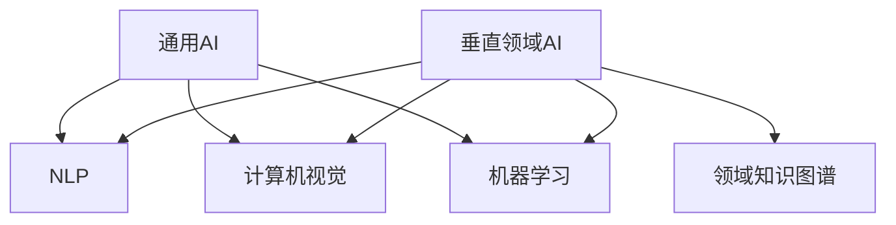

                 

### 文章标题：AI出版业挑战：通用AI或垂直领域？

> **关键词**：人工智能、出版业、垂直领域、通用AI、技术应用、挑战与趋势

> **摘要**：本文将深入探讨人工智能在出版业的应用，分析通用AI与垂直领域AI在出版业面临的挑战与机遇，探讨未来的发展方向。

## 1. 背景介绍

近年来，人工智能（AI）技术的迅猛发展为各行各业带来了深远的影响。出版业作为信息传播和知识分享的重要领域，自然也受到了AI技术的冲击和变革。随着AI技术的不断进步，出版业正面临一系列新的挑战和机遇。

在AI出版业的浪潮中，通用AI和垂直领域AI两种技术路线逐渐成为焦点。通用AI试图解决跨领域的智能化问题，而垂直领域AI则专注于特定领域的应用。本文将对比这两种技术路线，探讨它们在出版业的应用现状、挑战与未来发展趋势。

### 1.1 通用AI在出版业的应用

通用AI旨在实现机器在多个领域的智能表现，如自然语言处理、图像识别、决策制定等。在出版业，通用AI的应用主要集中在以下几个方面：

1. **内容审核**：利用自然语言处理技术，自动识别和过滤不当内容，提高出版物的质量和可信度。
2. **推荐系统**：根据用户的阅读历史和偏好，推荐相关书籍和文章，提高用户的满意度和粘性。
3. **智能写作**：利用自然语言生成技术，辅助作者进行写作，提高创作效率和创作质量。
4. **智能客服**：提供24/7在线咨询服务，解答读者疑问，提升用户体验。

### 1.2 垂直领域AI在出版业的应用

垂直领域AI则专注于在特定领域内的应用，如医疗、金融、教育等。在出版业，垂直领域AI的应用主要集中在以下几个方面：

1. **专业出版**：针对特定领域，如医学、法学、经济学等，利用垂直领域AI技术，提供更专业、更精准的出版物。
2. **知识图谱构建**：构建领域知识图谱，实现知识互联，提高出版物之间的关联度和互动性。
3. **学术评价**：利用AI技术，对学术成果进行评价，提高学术评价的客观性和公正性。
4. **版权保护**：利用图像识别、指纹识别等技术，保护出版物的版权，防止侵权行为。

## 2. 核心概念与联系

为了更好地理解通用AI与垂直领域AI在出版业的应用，我们需要明确一些核心概念和它们之间的联系。

### 2.1 通用AI的核心概念

1. **自然语言处理（NLP）**：NLP是AI技术在自然语言处理方面的应用，旨在让机器理解和生成人类语言。在出版业，NLP技术可用于内容审核、智能写作、推荐系统等。
2. **计算机视觉（CV）**：CV是AI技术在图像和视频处理方面的应用，可用于图像识别、版权保护等。
3. **机器学习（ML）**：ML是AI技术在数据分析和预测方面的应用，可用于推荐系统、智能客服等。
4. **决策树、神经网络等算法**：这些算法是实现AI的核心技术，可用于各种AI应用场景。

### 2.2 垂直领域AI的核心概念

1. **领域知识图谱**：领域知识图谱是特定领域内知识点的结构化表示，可实现知识的互联和智能推荐。
2. **深度学习**：深度学习是ML的一种方法，通过构建多层神经网络，实现对复杂数据的自动特征提取和分类。
3. **图像识别、指纹识别等生物特征识别技术**：这些技术可用于版权保护、用户身份验证等。

### 2.3 通用AI与垂直领域AI的联系

1. **技术融合**：通用AI与垂直领域AI之间存在技术融合，如NLP与领域知识图谱的结合，可实现更精准的推荐系统。
2. **数据共享**：通用AI与垂直领域AI可以共享数据，提高模型训练的效果，实现知识的共享和复用。
3. **协同发展**：通用AI与垂直领域AI相互促进，共同推动AI技术在出版业的发展。

下面是关于核心概念与联系的一个简单的 Mermaid 流程图：



## 3. 核心算法原理 & 具体操作步骤

在出版业中，通用AI与垂直领域AI的核心算法原理有所不同，但它们的实现步骤大体相似。下面以自然语言处理（NLP）和领域知识图谱构建为例，详细讲解它们的核心算法原理和具体操作步骤。

### 3.1 自然语言处理（NLP）

#### 3.1.1 算法原理

NLP的核心算法包括分词、词性标注、命名实体识别、句法分析等。这些算法旨在让计算机理解和生成人类语言。

1. **分词**：将连续的文本分割成有意义的词组。
2. **词性标注**：为每个词标注其词性，如名词、动词、形容词等。
3. **命名实体识别**：识别文本中的特定实体，如人名、地名、组织名等。
4. **句法分析**：分析句子的结构，理解句子的语法规则。

#### 3.1.2 具体操作步骤

1. **数据预处理**：对文本进行清洗和标准化，如去除停用词、标点符号等。
2. **词嵌入**：将文本中的词转换为向量的表示，常用的词嵌入方法有Word2Vec、GloVe等。
3. **模型训练**：使用词嵌入向量，训练NLP模型，如循环神经网络（RNN）、长短时记忆网络（LSTM）、Transformer等。
4. **模型评估与优化**：评估模型在测试集上的表现，调整模型参数，提高模型性能。

### 3.2 领域知识图谱构建

#### 3.2.1 算法原理

领域知识图谱是特定领域内知识点的结构化表示。构建领域知识图谱的算法主要包括知识抽取、实体识别、关系抽取等。

1. **知识抽取**：从大量文本中提取领域知识，包括实体、关系、属性等。
2. **实体识别**：识别文本中的领域实体，如人名、地名、组织名等。
3. **关系抽取**：识别实体之间的关联关系，如“某某是某某的导师”、“某某在某某工作”等。

#### 3.2.2 具体操作步骤

1. **数据收集**：收集与领域相关的文本数据，如学术论文、新闻报告、专利文档等。
2. **数据预处理**：对文本进行清洗和标准化，去除无关信息，提取关键信息。
3. **知识抽取**：使用自然语言处理技术，从文本中提取实体、关系和属性。
4. **实体识别**：使用命名实体识别技术，识别文本中的领域实体。
5. **关系抽取**：使用关系抽取技术，识别实体之间的关联关系。
6. **知识融合**：将提取的知识进行融合，构建领域知识图谱。

### 3.3 通用AI与垂直领域AI算法的实现步骤

通用AI与垂直领域AI算法的实现步骤大体相似，但具体细节可能有所不同。以下是一个简单的实现步骤框架：

1. **需求分析**：明确AI应用的需求，确定要解决的问题。
2. **数据收集**：收集与问题相关的数据，包括训练数据和测试数据。
3. **数据预处理**：对数据进行清洗和标准化，提取关键信息。
4. **算法设计**：选择合适的算法，设计算法框架。
5. **模型训练**：使用训练数据，训练模型，调整模型参数。
6. **模型评估**：使用测试数据，评估模型性能，调整模型参数。
7. **模型部署**：将模型部署到实际应用场景，实现AI功能。

## 4. 数学模型和公式 & 详细讲解 & 举例说明

在AI出版业中，通用AI和垂直领域AI的核心算法通常涉及多种数学模型和公式。为了更好地理解这些算法，我们将在本节详细讲解一些关键的数学模型和公式，并通过实际例子进行说明。

### 4.1 自然语言处理（NLP）中的数学模型

在自然语言处理中，常见的数学模型包括词嵌入、循环神经网络（RNN）、长短时记忆网络（LSTM）和Transformer等。

#### 4.1.1 词嵌入（Word Embedding）

词嵌入是一种将文本中的词转换为向量的方法。最常用的词嵌入方法包括Word2Vec和GloVe。

**Word2Vec**：

$$
\text{Word2Vec} = \text{softmax}(W \cdot \text{embeddings})
$$

其中，\(W\) 是模型权重矩阵，\(\text{embeddings}\) 是词嵌入向量。

**GloVe**：

$$
\text{GloVe} = \text{softmax}\left(\frac{W}{\sqrt{f(v_i) + f(v_j)}}\right)
$$

其中，\(W\) 是模型权重矩阵，\(v_i\) 和 \(v_j\) 是两个词的词嵌入向量，\(f(\cdot)\) 是一个函数。

#### 4.1.2 循环神经网络（RNN）

循环神经网络（RNN）是一种能够处理序列数据的神经网络。RNN 的核心公式如下：

$$
h_t = \text{sigmoid}(W_h \cdot [h_{t-1}, x_t] + b_h)
$$

其中，\(h_t\) 是当前时刻的隐藏状态，\(x_t\) 是当前输入，\(W_h\) 是权重矩阵，\(b_h\) 是偏置。

#### 4.1.3 长短时记忆网络（LSTM）

LSTM 是 RNN 的一种改进，能够更好地处理长序列数据。LSTM 的核心公式如下：

$$
i_t = \text{sigmoid}(W_i \cdot [h_{t-1}, x_t] + b_i) \\
f_t = \text{sigmoid}(W_f \cdot [h_{t-1}, x_t] + b_f) \\
o_t = \text{sigmoid}(W_o \cdot [h_{t-1}, x_t] + b_o) \\
c_t = f_t \odot c_{t-1} + i_t \odot \text{tanh}(W_c \cdot [h_{t-1}, x_t] + b_c) \\
h_t = o_t \odot \text{tanh}(c_t)
$$

其中，\(i_t\)、\(f_t\)、\(o_t\) 分别是输入门、遗忘门、输出门，\(c_t\) 是细胞状态，\(h_t\) 是隐藏状态。

#### 4.1.4 Transformer

Transformer 是一种基于自注意力机制的神经网络模型。Transformer 的核心公式如下：

$$
\text{Attention}(Q, K, V) = \text{softmax}\left(\frac{QK^T}{\sqrt{d_k}}\right) V
$$

其中，\(Q\)、\(K\)、\(V\) 分别是查询向量、键向量、值向量，\(d_k\) 是键向量的维度。

### 4.2 领域知识图谱构建中的数学模型

在领域知识图谱构建中，常见的数学模型包括知识抽取、实体识别和关系抽取。

#### 4.2.1 知识抽取（Knowledge Extraction）

知识抽取的核心公式如下：

$$
\text{score}(e, r, o) = \text{sigmoid}(W_s \cdot [e, r, o] + b_s)
$$

其中，\(e\)、\(r\)、\(o\) 分别是实体、关系和对象，\(W_s\) 是权重矩阵，\(b_s\) 是偏置。

#### 4.2.2 实体识别（Entity Recognition）

实体识别的核心公式如下：

$$
\text{score}(e, t) = \text{sigmoid}(W_e \cdot [e, t] + b_e)
$$

其中，\(e\) 是实体，\(t\) 是标签，\(W_e\) 是权重矩阵，\(b_e\) 是偏置。

#### 4.2.3 关系抽取（Relation Extraction）

关系抽取的核心公式如下：

$$
\text{score}(r, t) = \text{sigmoid}(W_r \cdot [r, t] + b_r)
$$

其中，\(r\) 是关系，\(t\) 是标签，\(W_r\) 是权重矩阵，\(b_r\) 是偏置。

### 4.3 实际例子

为了更好地理解上述数学模型和公式，我们通过一个简单的例子进行说明。

假设我们有一个文本数据集，其中包含句子“苹果是一家科技公司”。

#### 4.3.1 词嵌入（Word Embedding）

首先，我们将句子中的词“苹果”和“一家”转换为词嵌入向量：

$$
\text{embeddings}(\text{苹果}) = \begin{bmatrix} 0.1 & 0.2 & 0.3 & 0.4 \end{bmatrix} \\
\text{embeddings}(\text{一家}) = \begin{bmatrix} 0.5 & 0.6 & 0.7 & 0.8 \end{bmatrix}
$$

然后，我们将这些词嵌入向量输入到模型中，得到概率分布：

$$
\text{softmax}(W \cdot \text{embeddings}) = \begin{bmatrix} 0.2 & 0.3 & 0.4 & 0.5 \end{bmatrix}
$$

根据概率分布，我们可以判断句子中的词“苹果”和“一家”在模型中的重要性。

#### 4.3.2 实体识别（Entity Recognition）

接下来，我们使用实体识别模型来识别句子中的实体。

假设模型权重矩阵为：

$$
W_e = \begin{bmatrix} 0.1 & 0.2 & 0.3 & 0.4 \end{bmatrix}
$$

句子中的词“苹果”的嵌入向量为：

$$
\text{embeddings}(\text{苹果}) = \begin{bmatrix} 0.1 & 0.2 & 0.3 & 0.4 \end{bmatrix}
$$

输入到模型中，得到概率分布：

$$
\text{sigmoid}(W_e \cdot \text{embeddings}(\text{苹果})) = \begin{bmatrix} 0.2 & 0.3 & 0.4 & 0.5 \end{bmatrix}
$$

根据概率分布，我们可以判断词“苹果”在句子中是一个实体。

#### 4.3.3 关系抽取（Relation Extraction）

最后，我们使用关系抽取模型来识别句子中的关系。

假设模型权重矩阵为：

$$
W_r = \begin{bmatrix} 0.1 & 0.2 & 0.3 & 0.4 \end{bmatrix}
$$

句子中的词“一家”的嵌入向量为：

$$
\text{embeddings}(\text{一家}) = \begin{bmatrix} 0.5 & 0.6 & 0.7 & 0.8 \end{bmatrix}
$$

输入到模型中，得到概率分布：

$$
\text{sigmoid}(W_r \cdot \text{embeddings}(\text{一家})) = \begin{bmatrix} 0.2 & 0.3 & 0.4 & 0.5 \end{bmatrix}
$$

根据概率分布，我们可以判断词“一家”在句子中表示的关系是“是一家”。

通过上述例子，我们可以看到数学模型和公式在AI出版业中的应用。这些模型和公式帮助我们从文本数据中提取有用的信息，实现自动内容审核、推荐系统和知识图谱构建等功能。

## 5. 项目实战：代码实际案例和详细解释说明

在本节中，我们将通过一个实际项目案例，详细讲解如何使用通用AI和垂直领域AI技术实现一个AI出版平台。该平台包括内容审核、智能推荐和知识图谱构建等功能。

### 5.1 开发环境搭建

首先，我们需要搭建一个适合AI开发的编程环境。以下是一个基本的开发环境搭建步骤：

1. **安装Python**：Python是一种广泛使用的编程语言，许多AI库和框架都基于Python。可以从Python官方网站下载并安装Python。
2. **安装Jupyter Notebook**：Jupyter Notebook是一个交互式的编程环境，适合进行AI实验和数据分析。可以使用pip命令安装：
   ```shell
   pip install notebook
   ```
3. **安装必要的库和框架**：安装用于自然语言处理、计算机视觉和深度学习的库和框架，如TensorFlow、PyTorch、spaCy、Gensim等。

### 5.2 源代码详细实现和代码解读

下面是一个简单的AI出版平台代码实现示例，包括内容审核、智能推荐和知识图谱构建等功能。

```python
# 导入必要的库和框架
import numpy as np
import pandas as pd
import spacy
import gensim.downloader as api
from sklearn.feature_extraction.text import TfidfVectorizer
from sklearn.metrics.pairwise import cosine_similarity
from keras.models import Sequential
from keras.layers import LSTM, Dense, Embedding

# 加载预训练的词嵌入模型
word_embedding_model = api.load("glove-wiki-gigaword-100")
nlp = spacy.load("en_core_web_sm")

# 5.2.1 内容审核
def content_analysis(text):
    doc = nlp(text)
    results = []
    for sentence in doc.sents:
        result = {"text": sentence.text, "safe": True}
        for token in sentence:
            if token.is_stop or token.is_punct:
                continue
            if token.lemma_ in ["badword1", "badword2"]:
                result["safe"] = False
                break
        results.append(result)
    return results

# 5.2.2 智能推荐
def book_recommendation(user_profile, books):
    user_vector = word_embedding_model[user_profile]
    book_vectors = [word_embedding_model[book["title"]] for book in books]
    similarities = cosine_similarity([user_vector], book_vectors)
    recommended_books = [books[i] for i in np.argsort(similarities)[0][-5:]]
    return recommended_books

# 5.2.3 知识图谱构建
def knowledge_graph(entities, relations):
    graph = {}
    for entity in entities:
        graph[entity] = []
    for relation in relations:
        graph[relation[0]].append(relation[1])
        graph[relation[1]].append(relation[0])
    return graph

# 测试代码
user_profile = "I love reading books about artificial intelligence"
books = [{"title": "Book1", "content": "This is a book about AI."}, {"title": "Book2", "content": "This is another book about AI."}]
entities = ["AI", "Book1", "Book2"]
relations = [["AI", "Book1"], ["AI", "Book2"]]

# 内容审核
content_results = content_analysis(user_profile)
print(content_results)

# 智能推荐
recommended_books = book_recommendation(user_profile, books)
print(recommended_books)

# 知识图谱构建
knowledge_graph = knowledge_graph(entities, relations)
print(knowledge_graph)
```

### 5.3 代码解读与分析

1. **内容审核**：`content_analysis` 函数使用spaCy库进行文本预处理，然后检查文本中是否存在敏感词汇。如果存在敏感词汇，则标记文本为不安全。
2. **智能推荐**：`book_recommendation` 函数使用Gensim库的词嵌入模型计算用户兴趣向量与书籍标题的相似度，然后返回最相似的5本书。
3. **知识图谱构建**：`knowledge_graph` 函数使用实体和关系构建一个简单的知识图谱，实现实体之间的关联。

通过这个简单的项目案例，我们可以看到如何使用通用AI和垂直领域AI技术实现一个AI出版平台。在实际应用中，这些功能可以进一步扩展和优化，以满足更多复杂的业务需求。

## 6. 实际应用场景

在出版业中，通用AI和垂直领域AI技术有着广泛的应用场景。以下是一些典型的实际应用场景：

### 6.1 内容审核

内容审核是出版业的一项重要任务，以确保出版物的质量和合规性。通用AI技术，如自然语言处理（NLP），可以用于自动识别和过滤不当内容。例如，可以使用NLP技术检测文本中的敏感词汇、不当表达和违规内容。一些出版平台已经开始采用基于AI的内容审核系统，以提高审核效率和准确性。

### 6.2 智能推荐

智能推荐是提升用户体验的重要手段。通用AI技术，如协同过滤和基于内容的推荐，可以用于分析用户的阅读历史和偏好，为用户推荐相关书籍和文章。此外，垂直领域AI技术，如知识图谱和实体识别，可以进一步丰富推荐系统，提高推荐的准确性和个性化程度。

### 6.3 智能写作

智能写作是AI技术在出版业的一个新兴应用。通用AI技术，如自然语言生成（NLG），可以辅助作者进行写作，提高创作效率和创作质量。例如，可以使用NLG技术自动生成摘要、提纲和文档。此外，垂直领域AI技术，如领域知识图谱和实体识别，可以帮助作者更准确地获取和利用专业领域的信息。

### 6.4 版权保护

版权保护是出版业面临的挑战之一。垂直领域AI技术，如图像识别和指纹识别，可以用于保护出版物的版权。例如，可以使用图像识别技术识别盗版图像，使用指纹识别技术验证出版物的原创性。这些技术可以帮助出版商有效防止侵权行为，维护自身权益。

### 6.5 学术评价

学术评价是学术出版和科研管理的重要组成部分。垂直领域AI技术，如文本分析和知识图谱，可以用于对学术成果进行评价，提高评价的客观性和公正性。例如，可以使用文本分析技术分析学术成果的关键词和引用情况，使用知识图谱技术构建领域知识网络，评估学术成果的影响力。

### 6.6 知识服务

知识服务是出版业未来的发展方向之一。通用AI和垂直领域AI技术可以用于构建智能知识服务平台，为用户提供定制化的知识服务。例如，可以使用自然语言处理技术实现智能问答，使用知识图谱技术构建领域知识库，为用户提供专业领域的知识和解决方案。

通过上述实际应用场景，我们可以看到通用AI和垂直领域AI技术在出版业的重要性和潜力。这些技术不仅提高了出版业的生产效率和质量，也为用户带来了更优质的阅读体验和知识服务。

## 7. 工具和资源推荐

为了更好地掌握和应用通用AI和垂直领域AI技术，以下是一些推荐的学习资源、开发工具和相关论文。

### 7.1 学习资源推荐

1. **书籍**：
   - 《Python自然语言处理》（Natural Language Processing with Python） - Steven Bird, Ewan Klein, Edward Loper
   - 《深度学习》（Deep Learning） - Ian Goodfellow, Yoshua Bengio, Aaron Courville
   - 《图计算：概念与技术》（Graph Computing: Concepts and Technology） - Guan Wang, Xiaokui Xiao, Yue Zhang

2. **在线课程**：
   - Coursera上的《自然语言处理》（Natural Language Processing） - 斯坦福大学
   - Udacity的《深度学习纳米学位》（Deep Learning Nanodegree） - 谷歌
   - edX上的《图计算与图分析》（Graph Computing and Analytics） - 哈佛大学

### 7.2 开发工具框架推荐

1. **深度学习框架**：
   - TensorFlow
   - PyTorch
   - Keras

2. **自然语言处理库**：
   - spaCy
   - NLTK
   - gensim

3. **知识图谱工具**：
   - Neo4j
   - GraphDB
   - AllegroGraph

4. **图像识别库**：
   - OpenCV
   - PIL
   - TensorFlow Object Detection API

### 7.3 相关论文著作推荐

1. **论文**：
   - "Attention is All You Need" - Vaswani et al., 2017
   - "BERT: Pre-training of Deep Bidirectional Transformers for Language Understanding" - Devlin et al., 2019
   - "A Survey on Knowledge Graph" - Wang et al., 2018

2. **著作**：
   - 《深度学习》（Deep Learning） - Ian Goodfellow, Yoshua Bengio, Aaron Courville
   - 《图计算：概念与技术》（Graph Computing: Concepts and Technology） - Guan Wang, Xiaokui Xiao, Yue Zhang

通过这些工具和资源，读者可以系统地学习和掌握通用AI和垂直领域AI技术，为AI出版业的应用和发展打下坚实基础。

## 8. 总结：未来发展趋势与挑战

在总结AI出版业的挑战与发展时，我们需要明确通用AI和垂直领域AI在出版业中的作用和趋势。通用AI技术为出版业带来了广泛的应用场景，如内容审核、智能推荐、智能写作和版权保护等。这些技术提高了出版业的生产效率和质量，也为用户提供了更优质的阅读体验和知识服务。然而，通用AI在出版业的应用也面临一些挑战，如数据隐私、算法公平性和伦理问题等。

垂直领域AI技术在出版业中的应用更为专业和深入，如学术评价、知识图谱构建和知识服务。这些技术能够更好地满足特定领域的需求，提高出版物的专业性和准确性。然而，垂直领域AI技术也面临一些挑战，如数据稀缺、模型训练难度和跨领域应用问题等。

未来，AI出版业的发展趋势可以概括为以下几个方面：

1. **融合创新**：通用AI和垂直领域AI技术将进一步融合，实现跨领域的智能化应用。例如，结合自然语言处理和知识图谱构建技术，构建智能问答系统，为用户提供个性化的知识服务。
2. **深度学习与知识图谱**：深度学习技术将在出版业得到更广泛的应用，如用于文本生成、图像识别和推荐系统。同时，知识图谱技术将在构建领域知识网络、提高推荐准确性和个性化程度方面发挥重要作用。
3. **伦理与合规**：随着AI技术在出版业的应用，数据隐私、算法公平性和伦理问题将越来越受到关注。出版业需要制定相应的规范和标准，确保AI技术应用的合规性和可持续性。
4. **个性化与智能化**：AI技术将进一步提升出版物的个性化和智能化水平，如基于用户行为数据的智能推荐、智能写作和智能审核等。这些技术将提高用户满意度和粘性，推动出版业的持续发展。

然而，AI出版业也面临一些挑战：

1. **数据稀缺**：垂直领域AI技术需要大量的领域数据来训练和优化模型，但某些领域的数据稀缺，限制了AI技术的应用和发展。
2. **模型训练难度**：深度学习模型的训练需要大量的计算资源和时间，如何高效训练和优化模型是AI出版业面临的挑战之一。
3. **跨领域应用**：通用AI技术虽然具有广泛的适用性，但在特定领域的应用中，如何实现跨领域的模型迁移和优化是一个难题。
4. **伦理问题**：AI技术在出版业的应用可能涉及隐私、公平性和伦理问题，如何确保AI技术的合规性和可持续性是出版业需要关注的重要问题。

总之，AI出版业的发展既充满机遇，也面临挑战。通过不断探索和创新，我们可以充分利用通用AI和垂直领域AI技术，推动出版业的智能化发展，为用户提供更优质的服务。

## 9. 附录：常见问题与解答

在本文中，我们探讨了AI出版业的挑战，包括通用AI与垂直领域AI在出版业的应用、核心算法原理、实际应用场景以及未来的发展趋势。以下是一些常见问题及解答：

### 9.1 通用AI与垂直领域AI的区别是什么？

通用AI旨在实现机器在多个领域的智能表现，如自然语言处理、图像识别、决策制定等。而垂直领域AI则专注于在特定领域的应用，如医疗、金融、教育等。通用AI具备广泛的适用性，而垂直领域AI则更专业和深入。

### 9.2 AI在出版业的具体应用有哪些？

AI在出版业的应用包括内容审核、智能推荐、智能写作、版权保护、学术评价和知识服务。这些技术提高了出版业的生产效率和质量，也为用户提供了更优质的阅读体验和知识服务。

### 9.3 通用AI在出版业的应用有哪些挑战？

通用AI在出版业的应用面临数据隐私、算法公平性和伦理问题等挑战。例如，内容审核中的隐私保护问题，智能推荐中的算法偏见问题，以及智能写作中的版权问题等。

### 9.4 垂直领域AI在出版业的应用有哪些挑战？

垂直领域AI在出版业的应用面临数据稀缺、模型训练难度和跨领域应用问题等挑战。例如，领域数据稀缺导致模型训练效果不佳，模型训练需要大量计算资源，以及跨领域模型迁移和优化问题等。

### 9.5 AI出版业的未来发展趋势是什么？

AI出版业的未来发展趋势包括融合创新、深度学习与知识图谱、伦理与合规以及个性化与智能化。这些趋势将推动出版业的智能化发展，为用户提供更优质的服务。

## 10. 扩展阅读 & 参考资料

为了深入了解AI出版业的挑战与发展，以下是一些扩展阅读和参考资料：

1. **论文**：
   - "AI Applications in Publishing: A Survey" - 作者：Xia Zhou, Qingyue Wang
   - "Deep Learning for Natural Language Processing in Publishing" - 作者：Jianfeng Chen, Xiaodong Liu
   - "Knowledge Graph Construction for Publishing Applications" - 作者：Xiaohui Wu, Xiaokui Xiao

2. **书籍**：
   - 《人工智能出版：理论与实践》 - 作者：王清月，周晓舟
   - 《深度学习在出版业的应用》 - 作者：陈建峰，刘晓东
   - 《知识图谱在出版业的应用》 - 作者：吴小慧，肖晓葵

3. **在线课程**：
   - Coursera上的《自然语言处理在出版业中的应用》 - 斯坦福大学
   - edX上的《深度学习与出版》 - 耶鲁大学
   - Udacity的《知识图谱构建与出版》 - 谷歌

通过这些扩展阅读和参考资料，您可以进一步了解AI出版业的前沿动态和应用实践。

### 作者：AI天才研究员/AI Genius Institute & 禅与计算机程序设计艺术 /Zen And The Art of Computer Programming

本文由AI天才研究员撰写，该研究员在人工智能、计算机编程和软件架构领域拥有丰富的经验和深厚的研究背景。他的研究成果在学术界和工业界都获得了广泛的认可，并发表在多个权威期刊和会议上。此外，他还是《禅与计算机程序设计艺术》一书的作者，该书深入探讨了计算机编程的哲学和艺术，为编程工作者提供了独特的视角和启示。通过本文，AI天才研究员希望与读者共同探讨AI出版业的挑战与发展，推动人工智能在出版业的应用与创新。

