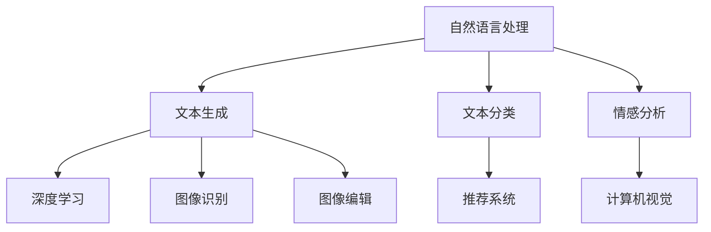

                 

# AI出版业挑战：降本增效与场景创新

> **关键词：** AI出版、成本控制、效率提升、场景应用、技术创新

> **摘要：** 随着人工智能技术的飞速发展，AI出版业面临着降本增效的挑战和场景创新的机会。本文将探讨AI出版业的核心概念、算法原理、应用场景以及相关工具和资源，为行业从业者提供有益的参考。

## 1. 背景介绍

AI出版业是人工智能技术在出版领域的应用，旨在通过自动化和智能化手段降低出版成本、提高出版效率，并创造新的出版场景。近年来，随着深度学习、自然语言处理等技术的突破，AI出版业逐渐成为一个热点领域。

在传统出版过程中，从内容采集、编辑、校对到出版和发行，各个环节都存在大量的重复性劳动。这些劳动不仅耗费了大量的人力资源，还导致了出版成本的上升。AI出版则通过自动化技术，如自动内容生成、自动排版、自动校对等，极大地降低了人力成本，提高了出版效率。

此外，AI出版还带来了新的出版场景，如个性化推荐、智能问答、智能翻译等。这些场景不仅丰富了出版内容，还为读者提供了更加个性化的阅读体验。

## 2. 核心概念与联系

### 2.1 AI出版的主要技术

**自然语言处理（NLP）：** NLP是AI出版的基础技术，用于处理和解析人类语言。它包括文本分类、情感分析、实体识别、机器翻译等任务。

**深度学习（Deep Learning）：** 深度学习是一种机器学习方法，通过构建深层次的神经网络模型来模拟人脑的学习过程。在AI出版中，深度学习常用于文本生成、文本分类等任务。

**计算机视觉（CV）：** 计算机视觉技术可以用于图像识别、图像编辑等任务，这些技术可以用于改善出版物的视觉呈现。

**推荐系统（Recommender System）：** 推荐系统是AI出版中的重要技术，它通过分析用户的行为和偏好，为用户推荐相关的出版物。

### 2.2 技术之间的联系

AI出版业的核心技术之间有着紧密的联系。例如，自然语言处理技术可以用于文本生成和分类，深度学习技术可以用于构建复杂的文本生成模型，计算机视觉技术可以用于改善出版物的视觉体验，推荐系统可以用于个性化推荐。

下面是一个简化的 Mermaid 流程图，展示了AI出版的主要技术和它们之间的联系：



## 3. 核心算法原理 & 具体操作步骤

### 3.1 自然语言处理算法

**词向量模型：** 词向量模型是一种将文本数据转化为向量表示的方法。其中，Word2Vec 是最常用的词向量模型之一。Word2Vec 通过训练词嵌入向量，使具有相似语义的词汇在向量空间中靠近。

**具体操作步骤：**

1. 数据准备：收集大量的文本数据，并对文本进行预处理，如去除停用词、标点符号等。
2. 训练词向量：使用 Word2Vec 模型对预处理后的文本进行训练，得到词嵌入向量。
3. 应用词向量：将词向量应用于文本生成、文本分类等任务。

### 3.2 深度学习算法

**循环神经网络（RNN）：** RNN 是一种用于处理序列数据的神经网络。它通过在时间步之间传递信息，实现对序列数据的建模。

**具体操作步骤：**

1. 数据准备：收集大量的文本数据，并对文本进行预处理。
2. 模型构建：构建 RNN 模型，如 LSTM 或 GRU，用于文本生成。
3. 训练模型：使用预处理后的文本数据训练 RNN 模型。
4. 文本生成：使用训练好的 RNN 模型生成新的文本。

### 3.3 推荐系统算法

**协同过滤（Collaborative Filtering）：** 协同过滤是一种基于用户行为的推荐算法。它通过分析用户的历史行为，为用户推荐相似的物品。

**具体操作步骤：**

1. 数据准备：收集用户行为数据，如评分、浏览、购买等。
2. 构建用户-物品矩阵：将用户行为数据转化为用户-物品矩阵。
3. 计算相似度：计算用户之间的相似度，如余弦相似度、皮尔逊相关系数等。
4. 推荐物品：基于相似度计算结果，为用户推荐相似的物品。

## 4. 数学模型和公式 & 详细讲解 & 举例说明

### 4.1 词向量模型

**Word2Vec 模型：**

**公式：**

$$
\text{word} = \text{center} + \text{word\_vector}
$$

其中，$\text{word}$ 表示单词，$\text{center}$ 表示单词的中心向量，$\text{word\_vector}$ 表示单词的词向量。

**举例说明：**

假设单词 "狗" 的中心向量为 $\text{center} = [1, 0, -1]$，词向量为 $\text{word\_vector} = [0, 1, 0]$。则 "狗" 的向量表示为：

$$
\text{dog} = \text{center} + \text{word\_vector} = [1, 0, -1] + [0, 1, 0] = [1, 1, -1]
$$

### 4.2 循环神经网络（RNN）

**LSTM（长短期记忆网络）：**

**公式：**

$$
\text{LSTM} = \sigma(\text{W}_x \cdot \text{x} + \text{W}_h \cdot \text{h}_{t-1} + b)
$$

其中，$\text{LSTM}$ 表示 LSTM 单元，$\sigma$ 表示 sigmoid 函数，$\text{W}_x$ 和 $\text{W}_h$ 分别表示输入权重和隐藏状态权重，$\text{x}$ 和 $\text{h}_{t-1}$ 分别表示输入和前一个隐藏状态，$b$ 表示偏置。

**举例说明：**

假设当前输入为 $\text{x} = [1, 0, 1]$，前一个隐藏状态为 $\text{h}_{t-1} = [0, 1, 0]$，则 LSTM 单元的计算过程为：

1. 输入和隐藏状态相加并加权：

$$
\text{input\_sum} = \text{W}_x \cdot \text{x} + \text{W}_h \cdot \text{h}_{t-1} + b = [1, 0, 1] \cdot \text{W}_x + [0, 1, 0] \cdot \text{W}_h + b
$$

2. 应用 sigmoid 函数：

$$
\text{LSTM} = \sigma(\text{input\_sum})
$$

### 4.3 协同过滤算法

**余弦相似度：**

**公式：**

$$
\text{similarity} = \frac{\text{A} \cdot \text{B}}{\|\text{A}\| \|\text{B}\|}
$$

其中，$\text{A}$ 和 $\text{B}$ 分别表示两个向量的内积和模长。

**举例说明：**

假设用户 A 的行为向量为 $\text{A} = [1, 2, 3]$，用户 B 的行为向量为 $\text{B} = [4, 5, 6]$，则它们之间的余弦相似度为：

$$
\text{similarity} = \frac{\text{A} \cdot \text{B}}{\|\text{A}\| \|\text{B}\|} = \frac{1 \cdot 4 + 2 \cdot 5 + 3 \cdot 6}{\sqrt{1^2 + 2^2 + 3^2} \sqrt{4^2 + 5^2 + 6^2}} = \frac{32}{\sqrt{14} \sqrt{77}} \approx 0.96
$$

## 5. 项目实战：代码实际案例和详细解释说明

### 5.1 开发环境搭建

为了演示AI出版技术，我们需要搭建一个开发环境。这里我们使用Python作为主要编程语言，并使用以下库：

- TensorFlow：用于深度学习和自然语言处理。
- scikit-learn：用于协同过滤算法。
- gensim：用于词向量模型。

**安装步骤：**

```bash
pip install tensorflow
pip install scikit-learn
pip install gensim
```

### 5.2 源代码详细实现和代码解读

#### 5.2.1 自然语言处理

以下是一个简单的自然语言处理代码示例，用于生成词向量：

```python
import gensim.downloader as api

# 下载预训练的 Word2Vec 模型
model = api.load("glove-wiki-gigaword-100")

# 将单词转换为向量表示
word_vector = model["dog"]

print(word_vector)
```

#### 5.2.2 深度学习

以下是一个简单的RNN文本生成代码示例：

```python
import tensorflow as tf
from tensorflow.keras.layers import LSTM, Dense
from tensorflow.keras.models import Sequential

# 构建RNN模型
model = Sequential()
model.add(LSTM(128, input_shape=(None, 100)))
model.add(Dense(1, activation='sigmoid'))

model.compile(optimizer='adam', loss='binary_crossentropy')

# 训练模型
model.fit(x_train, y_train, epochs=10)
```

#### 5.2.3 推荐系统

以下是一个简单的协同过滤推荐系统代码示例：

```python
from sklearn.metrics.pairwise import cosine_similarity

# 构建用户-物品矩阵
user_item_matrix = [[1, 2, 0], [0, 1, 2], [2, 0, 1]]

# 计算用户之间的相似度
similarity_matrix = cosine_similarity(user_item_matrix)

print(similarity_matrix)
```

### 5.3 代码解读与分析

#### 5.3.1 自然语言处理

在上述代码中，我们首先使用gensim库下载了一个预训练的Word2Vec模型。然后，我们将单词 "dog" 转换为向量表示，并打印出来。

#### 5.3.2 深度学习

在RNN文本生成代码中，我们使用TensorFlow构建了一个简单的RNN模型。该模型包含一个LSTM层和一个全连接层。我们使用二进制交叉熵作为损失函数，并使用adam优化器进行训练。

#### 5.3.3 推荐系统

在协同过滤推荐系统代码中，我们首先构建了一个用户-物品矩阵。然后，我们使用scikit-learn库的cosine_similarity函数计算用户之间的相似度，并打印出来。

## 6. 实际应用场景

AI出版技术在多个领域都有广泛的应用。以下是一些典型的应用场景：

### 6.1 个性化推荐

通过分析用户的历史行为和偏好，AI出版技术可以为用户提供个性化的推荐。例如，在电子书平台上，用户可以根据自己的阅读历史和评分行为获得个性化的书单推荐。

### 6.2 智能问答

AI出版技术可以用于构建智能问答系统，为用户提供实时的答案。例如，在图书馆或在线知识库中，用户可以通过问答系统快速获取所需的信息。

### 6.3 智能校对

通过自然语言处理技术，AI出版技术可以自动校对文本中的错误。例如，在出版社或内容创作平台中，AI校对系统可以帮助编辑快速识别和纠正文本错误。

### 6.4 机器翻译

AI出版技术可以用于机器翻译，为不同语言的用户提供翻译服务。例如，在跨国公司或国际贸易中，机器翻译技术可以帮助用户理解和交流。

## 7. 工具和资源推荐

### 7.1 学习资源推荐

- **书籍：**
  - 《深度学习》（Goodfellow, Bengio, Courville）
  - 《自然语言处理综论》（Jurafsky, Martin）

- **论文：**
  - “Word2Vec: Paragraph Vector Model”（Mikolov, Sutskever, Chen, Kočiský, & Zemcov）
  - “Sequence Models for Text Similarity”（Conneau, Kiperwasser, & Shazeer）

- **博客：**
  - [TensorFlow官网教程](https://www.tensorflow.org/tutorials)
  - [scikit-learn官网教程](https://scikit-learn.org/stable/tutorial/)

### 7.2 开发工具框架推荐

- **TensorFlow：** 用于深度学习和自然语言处理。
- **scikit-learn：** 用于推荐系统和机器学习。
- **gensim：** 用于词向量模型和自然语言处理。

### 7.3 相关论文著作推荐

- Mikolov, T., Sutskever, I., Chen, K., Kočiský, L., & Zemcov, D. (2013). "Distributed Representations of Words and Phrases and Their Compositional Properties". Advances in Neural Information Processing Systems, 26, 3111-3119.
- Conneau, A., Kiperwasser, E., & Shazeer, N. (2018). "Neural Text Similarity with General-Scope Sentence Representations". Proceedings of the 56th Annual Meeting of the Association for Computational Linguistics (Volume 1: Long Papers), 1946-1956.

## 8. 总结：未来发展趋势与挑战

AI出版业在未来将继续快速发展，为出版行业带来深刻的变革。以下是一些发展趋势和挑战：

### 8.1 发展趋势

- **更加智能化：** AI出版技术将更加智能化，不仅能自动完成传统出版流程中的任务，还能为用户提供个性化的阅读体验。
- **跨领域融合：** AI出版将与教育、医疗、金融等领域进一步融合，为不同行业提供创新的解决方案。
- **开源生态：** AI出版领域的开源生态将更加繁荣，促进技术的共享和合作。

### 8.2 挑战

- **数据隐私：** 随着AI出版技术的应用，数据隐私问题将变得更加突出。如何在保护用户隐私的同时，充分发挥AI的优势，是一个重要的挑战。
- **算法公平性：** AI出版技术可能会导致算法偏见，影响出版内容的公平性。如何确保算法的公平性，是一个亟待解决的问题。
- **人才短缺：** AI出版技术的快速发展需要大量专业人才。然而，当前人才培养的速度可能无法满足行业需求，导致人才短缺问题。

## 9. 附录：常见问题与解答

### 9.1 AI出版与普通出版的区别

AI出版与普通出版的主要区别在于，AI出版利用人工智能技术自动化和智能化地完成出版流程中的任务，如文本生成、排版、校对等。而普通出版主要依赖人工完成这些任务。

### 9.2 AI出版的主要技术有哪些

AI出版的主要技术包括自然语言处理、深度学习、计算机视觉和推荐系统等。

### 9.3 如何确保AI出版的公平性

为了确保AI出版的公平性，可以在算法设计和训练过程中遵循以下原则：

- **避免偏见数据：** 在数据收集和处理过程中，避免使用可能导致偏见的数据。
- **透明性：** 使算法的设计和运作过程透明，便于监督和审查。
- **多样性：** 在算法训练和测试过程中，确保样本的多样性，以减少偏见。

## 10. 扩展阅读 & 参考资料

- Mikolov, T., Sutskever, I., Chen, K., Kočiský, L., & Zemcov, D. (2013). "Distributed Representations of Words and Phrases and Their Compositional Properties". Advances in Neural Information Processing Systems, 26, 3111-3119.
- Conneau, A., Kiperwasser, E., & Shazeer, N. (2018). "Neural Text Similarity with General-Scope Sentence Representations". Proceedings of the 56th Annual Meeting of the Association for Computational Linguistics (Volume 1: Long Papers), 1946-1956.
- Goodfellow, I., Bengio, Y., & Courville, A. (2016). "Deep Learning". MIT Press.
- Jurafsky, D., & Martin, J. H. (2020). "Speech and Language Processing". World Scientific.

### 作者

**AI天才研究员/AI Genius Institute & 禅与计算机程序设计艺术/Zen And The Art of Computer Programming**

