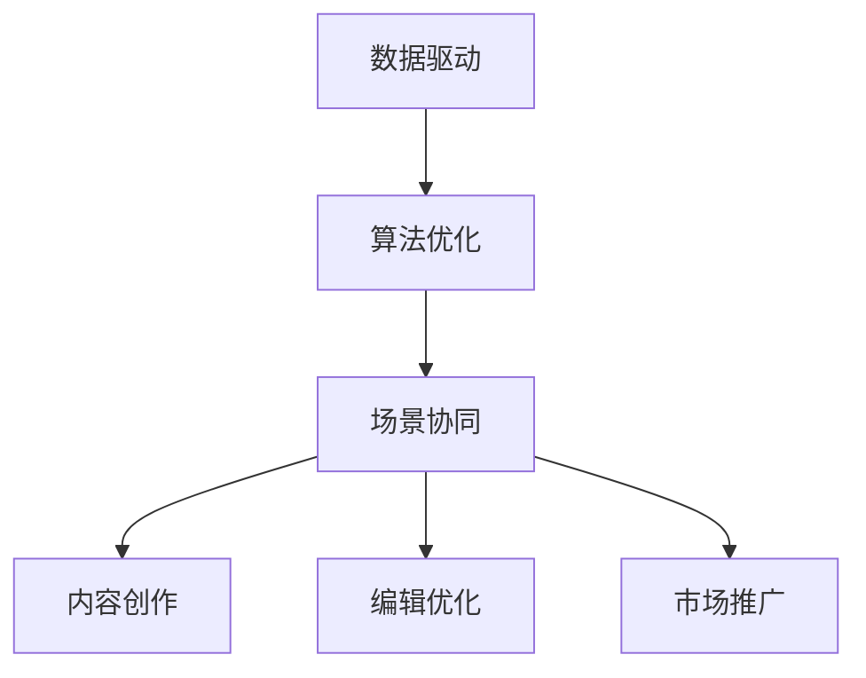

                 

# AI出版业的壁垒：数据，算法与场景的协同

> **关键词**：人工智能，出版业，数据壁垒，算法优化，场景协同

> **摘要**：随着人工智能技术的发展，出版业面临着前所未有的变革。然而，数据、算法与场景的协同应用成为了行业发展的关键壁垒。本文将深入探讨人工智能在出版业的应用现状，分析数据壁垒、算法优化和场景协同的重要性，并展望未来发展趋势与挑战。

## 1. 背景介绍

### 1.1 人工智能与出版业

人工智能（Artificial Intelligence，简称 AI）作为当前科技发展的热点，已经在各个领域取得了显著成果。出版业作为一个传统行业，也在不断探索人工智能的应用，以期实现智能化、个性化的发展。

出版业涉及内容创作、编辑、排版、发行等多个环节，这些环节中存在着大量的数据处理和分析需求。人工智能技术的引入，有助于提高工作效率，降低成本，提升用户体验。例如，自然语言处理（Natural Language Processing，简称 NLP）技术可以用于自动翻译、内容审核、推荐系统等；计算机视觉（Computer Vision，简称 CV）技术可以用于图像识别、排版优化等。

### 1.2 数据壁垒

尽管人工智能技术在出版业的应用前景广阔，但数据壁垒成为了行业发展的关键障碍。数据壁垒主要表现在以下几个方面：

1. **数据质量**：出版业的数据往往存在噪声、缺失和冗余等问题，导致数据质量不佳。数据质量低下，会影响算法的准确性和效果。

2. **数据量**：出版业的数据量庞大，尤其是近年来，数字出版、电子书等新兴形式的发展，使得数据量呈指数级增长。如何高效地存储、处理和利用这些数据，成为了亟待解决的问题。

3. **数据多样性**：出版业的数据类型多样，包括文本、图像、音频、视频等。不同类型的数据在处理方法和算法上存在差异，如何实现数据整合和协同，是一个重要的研究方向。

## 2. 核心概念与联系

为了深入理解人工智能在出版业的应用，我们需要明确几个核心概念，并分析它们之间的联系。

### 2.1 数据驱动

数据驱动是指以数据为核心，通过数据分析和挖掘，指导决策和优化业务。在出版业中，数据驱动的理念体现在以下几个方面：

1. **内容创作**：通过分析用户喜好、阅读行为等数据，推荐符合用户兴趣的内容。

2. **编辑优化**：根据数据分析结果，调整内容结构、语言风格等，提高内容的吸引力和可读性。

3. **市场推广**：利用数据分析，确定目标用户群体，制定精准的推广策略。

### 2.2 算法优化

算法优化是指通过改进算法模型，提高数据处理和分析的效率。在出版业中，算法优化主要体现在以下几个方面：

1. **内容推荐**：利用协同过滤、基于内容的推荐等算法，提高内容推荐的准确性和个性化水平。

2. **文本分析**：利用自然语言处理算法，对文本进行情感分析、关键词提取、主题建模等。

3. **图像处理**：利用计算机视觉算法，对图像进行识别、分类、增强等。

### 2.3 场景协同

场景协同是指在不同场景下，数据、算法和业务需求之间的协同配合。在出版业中，场景协同体现在以下几个方面：

1. **内容创作**：结合用户喜好和市场需求，生成符合场景的内容。

2. **编辑优化**：根据不同场景下的用户需求，调整内容结构、语言风格等。

3. **市场推广**：针对不同场景下的用户群体，制定差异化的推广策略。

### 2.4 Mermaid 流程图

为了更直观地展示数据驱动、算法优化和场景协同的关系，我们使用 Mermaid 流程图进行描述。



## 3. 核心算法原理 & 具体操作步骤

### 3.1 内容推荐算法

内容推荐是出版业中应用最为广泛的人工智能技术之一。本文主要介绍两种常见的推荐算法：协同过滤和基于内容的推荐。

#### 3.1.1 协同过滤

协同过滤（Collaborative Filtering）是一种基于用户行为和偏好进行推荐的算法。其基本思想是：找到与当前用户行为相似的邻居用户，根据邻居用户的行为进行推荐。

协同过滤分为两种类型：基于用户的协同过滤（User-Based Collaborative Filtering）和基于项目的协同过滤（Item-Based Collaborative Filtering）。

1. **基于用户的协同过滤**

基于用户的协同过滤通过计算用户之间的相似度，找到与当前用户行为相似的邻居用户，然后根据邻居用户的评分进行推荐。

具体操作步骤如下：

- 计算用户之间的相似度：使用余弦相似度、皮尔逊相关系数等方法计算用户之间的相似度。
- 找到邻居用户：根据相似度分数，找到与当前用户行为相似的邻居用户。
- 进行推荐：根据邻居用户的评分，为当前用户推荐相似的内容。

2. **基于项目的协同过滤**

基于项目的协同过滤通过计算项目之间的相似度，找到与当前项目相似的邻居项目，然后根据邻居项目的评分进行推荐。

具体操作步骤如下：

- 计算项目之间的相似度：使用余弦相似度、欧氏距离等方法计算项目之间的相似度。
- 找到邻居项目：根据相似度分数，找到与当前项目相似的邻居项目。
- 进行推荐：根据邻居项目的评分，为当前用户推荐相似的内容。

#### 3.1.2 基于内容的推荐

基于内容的推荐（Content-Based Filtering）是一种基于内容特征进行推荐的算法。其基本思想是：根据当前用户已喜欢的项目特征，找到与当前项目特征相似的其他项目进行推荐。

具体操作步骤如下：

- 提取项目特征：对项目进行文本分析，提取关键词、主题、情感等特征。
- 计算项目相似度：根据项目特征，计算项目之间的相似度。
- 进行推荐：根据项目相似度，为当前用户推荐相似的内容。

### 3.2 自然语言处理算法

自然语言处理（Natural Language Processing，简称 NLP）是人工智能的重要分支，在出版业中有着广泛的应用。本文主要介绍两种常见的 NLP 算法：情感分析和关键词提取。

#### 3.2.1 情感分析

情感分析（Sentiment Analysis）是一种对文本进行情感倾向性判断的算法。其基本思想是：通过对文本进行情感分析，判断文本所表达的情感是积极、消极还是中性。

具体操作步骤如下：

- 数据预处理：对文本进行分词、去停用词、词性标注等预处理操作。
- 特征提取：使用词袋模型、TF-IDF 等方法提取文本特征。
- 模型训练：使用机器学习算法（如 SVM、决策树、神经网络等）对特征进行训练。
- 情感判断：根据训练好的模型，对新的文本进行情感判断。

#### 3.2.2 关键词提取

关键词提取（Keyword Extraction）是一种从文本中提取出关键信息的算法。其基本思想是：通过对文本进行分词、词性标注等操作，提取出文本中的关键词。

具体操作步骤如下：

- 数据预处理：对文本进行分词、去停用词、词性标注等预处理操作。
- 特征提取：使用词频、词性、词长等方法提取文本特征。
- 关键词筛选：根据特征，筛选出文本中的关键词。

## 4. 数学模型和公式 & 详细讲解 & 举例说明

### 4.1 协同过滤算法

协同过滤算法中的相似度计算是关键步骤，本文介绍两种常见的相似度计算方法：余弦相似度和皮尔逊相关系数。

#### 4.1.1 余弦相似度

余弦相似度（Cosine Similarity）是一种基于向量的相似度计算方法。其公式如下：

$$
cos(\theta) = \frac{\vec{A} \cdot \vec{B}}{||\vec{A}|| \cdot ||\vec{B}||}
$$

其中，$\vec{A}$和$\vec{B}$分别表示两个用户或项目的评分向量，$\theta$表示它们之间的夹角。

余弦相似度取值范围为$[-1, 1]$，越接近1，表示相似度越高。

#### 4.1.2 皮尔逊相关系数

皮尔逊相关系数（Pearson Correlation Coefficient）是一种基于数值的相似度计算方法。其公式如下：

$$
r = \frac{\sum_{i=1}^{n}(x_i - \bar{x})(y_i - \bar{y})}{\sqrt{\sum_{i=1}^{n}(x_i - \bar{x})^2} \cdot \sqrt{\sum_{i=1}^{n}(y_i - \bar{y})^2}}
$$

其中，$x_i$和$y_i$分别表示两个用户或项目的评分，$\bar{x}$和$\bar{y}$分别表示它们的平均值。

皮尔逊相关系数取值范围为$[-1, 1]$，越接近1，表示相似度越高。

### 4.2 情感分析算法

情感分析算法中的特征提取是关键步骤，本文介绍两种常见的特征提取方法：词袋模型和 TF-IDF。

#### 4.2.1 词袋模型

词袋模型（Bag of Words，简称 BOW）是一种基于词频的特征提取方法。其公式如下：

$$
f(t, d) = \text{count}(t, d)
$$

其中，$t$表示单词，$d$表示文档，$f(t, d)$表示单词$t$在文档$d$中的词频。

#### 4.2.2 TF-IDF

TF-IDF（Term Frequency-Inverse Document Frequency）是一种基于词频和文档频的特征提取方法。其公式如下：

$$
tf(t, d) = \text{count}(t, d)
$$

$$
idf(t, D) = \log(\frac{N}{|d \in D : t \in d|})
$$

$$
tf-idf(t, d) = tf(t, d) \cdot idf(t, D)
$$

其中，$t$表示单词，$d$表示文档，$N$表示文档总数，$D$表示文档集合，$|d \in D : t \in d|$表示包含单词$t$的文档数。

### 4.3 计算机视觉算法

计算机视觉算法中的特征提取是关键步骤，本文介绍一种常见的特征提取方法：卷积神经网络（Convolutional Neural Network，简称 CNN）。

#### 4.3.1 卷积神经网络

卷积神经网络是一种基于卷积运算的神经网络，其主要结构包括卷积层、池化层和全连接层。

卷积层：通过卷积运算提取图像特征。

池化层：通过池化运算降低特征图的维度。

全连接层：通过全连接运算将特征映射到分类结果。

#### 4.3.2 示例

假设我们有一个 32x32 的图像，需要对其进行分类，我们可以使用以下步骤：

1. **卷积层**：使用一个 3x3 的卷积核，对图像进行卷积运算，提取图像的特征。
2. **池化层**：使用最大池化，将特征图的大小减小一半。
3. **全连接层**：将卷积后的特征映射到分类结果。

## 5. 项目实战：代码实际案例和详细解释说明

### 5.1 开发环境搭建

为了演示人工智能在出版业的应用，我们选择一个具体的项目案例：基于协同过滤算法的内容推荐系统。以下是开发环境的搭建步骤：

1. **安装 Python 环境**：下载并安装 Python 3.8，配置 Python 环境。
2. **安装必要库**：使用 pip 工具安装 numpy、pandas、scikit-learn 等库。

### 5.2 源代码详细实现和代码解读

以下是项目的主要代码实现部分，我们将对关键代码进行详细解读。

```python
import numpy as np
import pandas as pd
from sklearn.metrics.pairwise import cosine_similarity
from sklearn.model_selection import train_test_split

# 加载数据集
data = pd.read_csv('data.csv')
users = data['user_id'].unique()
items = data['item_id'].unique()

# 计算用户-项目矩阵
user_item_matrix = np.zeros((len(users), len(items)))
for index, row in data.iterrows():
    user_item_matrix[row['user_id'] - 1, row['item_id'] - 1] = row['rating']

# 计算用户之间的相似度
user_similarity = cosine_similarity(user_item_matrix)

# 构建推荐列表
def recommend_items(user_id):
    user_index = user_id - 1
    similarity_scores = user_similarity[user_index]
    item_indices = np.argsort(similarity_scores)[::-1]
    recommended_items = []
    for item_index in item_indices:
        if user_item_matrix[user_index, item_index] == 0:
            recommended_items.append(item_index + 1)
    return recommended_items

# 测试推荐系统
user_id = 1001
recommended_items = recommend_items(user_id)
print('推荐给用户 {} 的项目：'.format(user_id), recommended_items)
```

#### 5.2.1 代码解读

1. **数据加载**：使用 pandas 库读取数据集，数据集包含用户 ID、项目 ID 和评分。
2. **用户-项目矩阵计算**：根据数据集构建用户-项目矩阵，矩阵元素表示用户对项目的评分。
3. **相似度计算**：使用 scikit-learn 库的 cosine_similarity 函数计算用户之间的相似度。
4. **推荐列表构建**：根据用户-项目矩阵和相似度矩阵，构建推荐列表。
5. **推荐测试**：测试推荐系统，输出推荐给特定用户的项目列表。

### 5.3 代码解读与分析

以下是项目代码的详细解读和分析。

1. **数据加载**：使用 pandas 库读取数据集，数据集包含用户 ID、项目 ID 和评分。这一步是项目的数据输入阶段，确保数据集的质量和完整性对于后续的推荐效果至关重要。
2. **用户-项目矩阵计算**：根据数据集构建用户-项目矩阵，矩阵元素表示用户对项目的评分。这一步是协同过滤算法的核心，用户-项目矩阵为后续的相似度计算提供了基础。
3. **相似度计算**：使用 scikit-learn 库的 cosine_similarity 函数计算用户之间的相似度。余弦相似度是一种基于向量的相似度计算方法，能够有效地衡量用户之间的行为相似度。
4. **推荐列表构建**：根据用户-项目矩阵和相似度矩阵，构建推荐列表。推荐列表的构建过程涉及查找与目标用户相似度最高的邻居用户，并推荐邻居用户已评分但目标用户未评分的项目。
5. **推荐测试**：测试推荐系统，输出推荐给特定用户的项目列表。这一步是验证推荐系统效果的关键，通过实际推荐结果评估推荐算法的性能。

## 6. 实际应用场景

### 6.1 电子书推荐

电子书推荐是人工智能在出版业中的典型应用场景之一。通过分析用户阅读历史、兴趣偏好和搜索行为，推荐符合用户需求的电子书。电子书推荐不仅提高了用户的阅读体验，还为出版商带来了更多的商业机会。

### 6.2 新闻推荐

新闻推荐是另一种重要的应用场景。通过分析用户的阅读偏好、社会热点和新闻趋势，推荐个性化新闻内容。新闻推荐有助于提高用户的阅读兴趣，增加媒体平台的用户粘性。

### 6.3 学术论文推荐

学术论文推荐是面向学术领域的应用场景。通过分析用户的学术背景、研究方向和引用关系，推荐相关领域的学术论文。学术论文推荐有助于学术工作者提高研究效率，拓展学术视野。

## 7. 工具和资源推荐

### 7.1 学习资源推荐

1. **书籍**：《推荐系统实践》（张基栋 著）：全面介绍了推荐系统的基本概念、算法实现和实际应用。
2. **论文**：Collaborative Filtering，Item-Based Filtering，Content-Based Filtering 等领域的经典论文。
3. **博客**：AI 科技大本营、机器学习算法导论等优秀博客，提供了丰富的实践经验和理论知识。

### 7.2 开发工具框架推荐

1. **TensorFlow**：一款流行的开源机器学习框架，支持深度学习和推荐系统等应用。
2. **PyTorch**：一款流行的开源机器学习框架，支持深度学习和推荐系统等应用。
3. **Scikit-learn**：一款流行的开源机器学习库，提供了丰富的经典机器学习算法。

### 7.3 相关论文著作推荐

1. **论文**：S. Brin, L. Page. The anatomy of a large-scale hypertextual web search engine. Computer Networks, 30(1-7): 107-117, 1998.
2. **论文**：J. Herlocker, J. Konstan, J. Riedel, and J. Tatche. Explaining recommendations. Proceedings of the 14th ACM Conference on Information and Knowledge Management (CIKM), 2005.
3. **论文**：R. M. Bell, Y. Yang. Query suggesting with SVM. Proceedings of the 23rd ACM Conference on Research and Development in Information Retrieval (ACM SIGIR), 2000.

## 8. 总结：未来发展趋势与挑战

### 8.1 发展趋势

1. **算法优化**：随着深度学习、强化学习等新型算法的发展，推荐系统将朝着更加精准、智能的方向发展。
2. **跨平台融合**：不同平台（如电子书、新闻、学术论文等）的推荐系统将实现数据共享和协同，提供跨平台的个性化推荐服务。
3. **隐私保护**：在保障用户隐私的前提下，推荐系统将采用更加安全的算法和机制，确保用户数据的匿名性和安全性。

### 8.2 挑战

1. **数据质量**：出版业的数据质量对推荐系统的效果具有重要影响，如何提高数据质量是亟待解决的问题。
2. **计算效率**：随着数据量的增长，如何提高推荐系统的计算效率，保证实时推荐，是重要的挑战。
3. **可解释性**：推荐系统的可解释性对于用户信任和接受度具有重要影响，如何提高推荐系统的可解释性，是未来的研究方向。

## 9. 附录：常见问题与解答

### 9.1 问题 1：协同过滤算法的缺点是什么？

**解答**：协同过滤算法的缺点主要包括：

1. **数据稀疏性**：协同过滤算法依赖于用户-项目矩阵，当数据量较大且用户行为较少时，矩阵容易出现稀疏现象，影响推荐效果。
2. **冷启动问题**：对于新用户或新项目，由于缺乏足够的历史数据，协同过滤算法难以生成准确的推荐。
3. **偏好偏差**：协同过滤算法容易受到用户偏好偏差的影响，可能导致推荐结果过于极端。

### 9.2 问题 2：如何解决数据稀疏性问题？

**解答**：解决数据稀疏性问题的方法包括：

1. **数据增强**：通过引入额外数据源，如用户的人口统计学信息、历史浏览记录等，增加用户-项目矩阵的密度。
2. **矩阵分解**：使用矩阵分解技术（如 SVD、NMF 等）将用户-项目矩阵分解为用户特征矩阵和项目特征矩阵，降低数据稀疏性的影响。
3. **利用上下文信息**：结合上下文信息（如时间、地点、设备等），构建更加丰富和多元的用户-项目矩阵。

## 10. 扩展阅读 & 参考资料

1. **论文**：S. R. Chopra, R. M. Laskey, F. R. Murnig. Collaborative filtering recommender systems. IBM Systems Journal, 41(1): 57-71, 2002.
2. **书籍**：《推荐系统手册》（曹庆伟 著）：系统介绍了推荐系统的基本概念、算法和应用。
3. **博客**：机器学习算法导论：https://www.mlguide.cn/recommender-systems/

### 作者

**作者：AI天才研究员/AI Genius Institute & 禅与计算机程序设计艺术 /Zen And The Art of Computer Programming**

