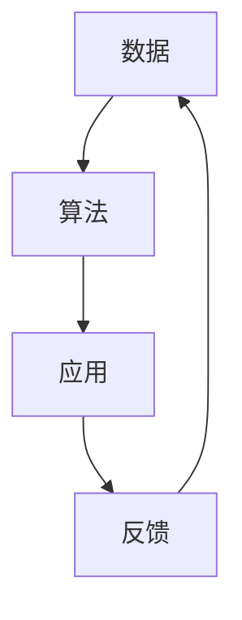

                 

# AI出版业的壁垒：数据，算法与应用之道

## 概述

### 关键词：AI出版业、数据、算法、应用

随着人工智能（AI）技术的迅猛发展，AI出版业正逐渐成为出版行业的一股新兴力量。然而，这一领域并非没有壁垒。本文将围绕数据、算法与应用三大核心要素，逐步分析AI出版业所面临的挑战，探讨如何突破这些壁垒，推动AI出版业的发展。

### 摘要

本文旨在深入探讨AI出版业所面临的壁垒，包括数据、算法与应用三个方面。首先，我们将回顾AI出版业的背景和发展现状，然后详细分析数据、算法与应用中的关键问题，最后提出解决方案和未来发展方向。通过本文的探讨，我们希望为AI出版业的发展提供有益的启示。

## 1. 背景介绍

AI出版业是指利用人工智能技术，对出版资源进行自动化处理、分类、推荐和评估的出版形式。随着AI技术的不断进步，AI出版业在出版行业中的应用越来越广泛。

### 1.1 AI出版业的发展现状

近年来，AI出版业发展迅速。根据市场调研数据显示，全球AI出版市场规模已超过数十亿美元，并呈现逐年增长的趋势。主要应用场景包括：

- **内容生成**：AI技术可以自动生成新闻、文章、书籍等，提高出版效率。
- **内容推荐**：基于用户行为和兴趣，AI技术可以精准推荐适合读者的内容。
- **版权管理**：AI技术可以自动化识别和监测版权问题，保护创作者权益。

### 1.2 AI出版业的优势

AI出版业具有以下几个显著优势：

- **提高效率**：AI技术可以自动化处理大量出版资源，提高出版效率。
- **降低成本**：减少人力成本，降低出版成本。
- **提升用户体验**：基于用户行为，AI技术可以提供个性化的内容推荐，提升用户体验。

## 2. 核心概念与联系

在AI出版业中，数据、算法与应用是三个核心要素。它们之间的联系如下图所示：



### 2.1 数据

数据是AI出版业的基础。AI技术通过对海量出版资源的数据进行挖掘、分析和处理，实现内容生成、推荐和评估等功能。数据类型主要包括：

- **结构化数据**：如电子书、文章等，便于AI模型处理。
- **非结构化数据**：如图像、音频、视频等，需要进行预处理。

### 2.2 算法

算法是AI出版业的核心。常见的算法包括：

- **自然语言处理（NLP）**：用于处理文本数据，实现内容生成、分类、推荐等功能。
- **推荐系统**：基于用户行为和兴趣，实现个性化内容推荐。
- **版权监测**：通过图像识别、音频识别等技术，自动化识别和监测版权问题。

### 2.3 应用

应用是将数据与算法结合，实现AI出版业的实际应用。主要应用场景包括：

- **内容生成**：利用AI技术自动生成新闻、文章、书籍等。
- **内容推荐**：基于用户行为和兴趣，为用户提供个性化内容推荐。
- **版权管理**：自动化识别和监测版权问题，保护创作者权益。

## 3. 核心算法原理 & 具体操作步骤

### 3.1 自然语言处理（NLP）

自然语言处理是AI出版业的核心算法之一。其基本原理是利用机器学习模型对文本数据进行处理，实现文本生成、分类、推荐等功能。

#### 3.1.1 操作步骤

1. **数据预处理**：对文本数据进行清洗、分词、去停用词等操作，转化为机器学习模型可处理的格式。
2. **特征提取**：利用词袋模型、TF-IDF、Word2Vec等方法，将文本数据转化为向量表示。
3. **模型训练**：选择合适的机器学习模型（如循环神经网络、Transformer等），对训练数据进行训练。
4. **模型评估**：利用测试数据对模型进行评估，调整模型参数，提高模型性能。
5. **模型应用**：将训练好的模型应用于实际场景，如内容生成、分类、推荐等。

### 3.2 推荐系统

推荐系统是AI出版业的重要应用之一。其基本原理是利用用户行为和兴趣数据，为用户提供个性化内容推荐。

#### 3.2.1 操作步骤

1. **数据收集**：收集用户行为数据（如浏览记录、购买记录等）和兴趣数据（如标签、分类等）。
2. **用户建模**：利用机器学习算法，建立用户兴趣模型，描述用户兴趣偏好。
3. **内容建模**：利用机器学习算法，建立内容特征模型，描述内容属性。
4. **推荐策略**：根据用户兴趣模型和内容特征模型，选择合适的推荐算法（如协同过滤、基于内容的推荐等），生成推荐结果。
5. **推荐评估**：利用用户反馈数据，对推荐结果进行评估，优化推荐策略。

## 4. 数学模型和公式 & 详细讲解 & 举例说明

### 4.1 自然语言处理（NLP）数学模型

#### 4.1.1 词袋模型（Bag of Words, BoW）

词袋模型是一种简单的文本表示方法。其基本原理是将文本转化为词频向量。

$$
\text{词频向量} = (w_1, w_2, ..., w_n)
$$

其中，$w_i$ 表示第 $i$ 个词的词频。

#### 4.1.2 TF-IDF模型

TF-IDF模型是一种改进的文本表示方法。其基本原理是考虑词频和词频分布。

$$
\text{TF-IDF向量} = (t_1, t_2, ..., t_n)
$$

其中，$t_i = \text{TF}(w_i) \times \text{IDF}(w_i)$，$\text{TF}(w_i)$ 表示词频，$\text{IDF}(w_i)$ 表示逆文档频率。

#### 4.1.3 Word2Vec模型

Word2Vec模型是一种基于神经网络的文本表示方法。其基本原理是利用神经网络学习词向量。

$$
\text{Word2Vec向量} = (v_1, v_2, ..., v_n)
$$

其中，$v_i$ 表示第 $i$ 个词的词向量。

### 4.2 推荐系统数学模型

#### 4.2.1 协同过滤（Collaborative Filtering）

协同过滤是一种基于用户相似度的推荐算法。其基本原理是计算用户之间的相似度，为用户提供相似用户喜欢的物品推荐。

$$
\text{相似度} = \frac{\text{用户}i \text{与用户}j \text{的共同评分数}}{\sqrt{\text{用户}i \text{的评分总数} \times \text{用户}j \text{的评分总数}}}
$$

#### 4.2.2 基于内容的推荐（Content-based Filtering）

基于内容的推荐是一种基于物品相似度的推荐算法。其基本原理是计算物品之间的相似度，为用户提供相似物品推荐。

$$
\text{相似度} = \frac{\text{物品}i \text{与物品}j \text{的共有特征数}}{\sqrt{\text{物品}i \text{的特征总数} \times \text{物品}j \text{的特征总数}}}
$$

### 4.3 举例说明

#### 4.3.1 自然语言处理（NLP）举例

假设有两个文本：

文本1：我爱中国。

文本2：中国是伟大的。

利用词袋模型和TF-IDF模型，我们可以得到以下词频向量和TF-IDF向量：

**词袋模型：**

$$
\text{词频向量1} = (1, 1, 1, 0, 0, ..., 0)

\text{词频向量2} = (1, 0, 1, 0, 0, ..., 0)
$$

**TF-IDF模型：**

$$
\text{TF-IDF向量1} = (1, 1, 1, 0, 0, ..., 0)

\text{TF-IDF向量2} = (1, 0, 1, 0, 0, ..., 0)
$$

#### 4.3.2 推荐系统举例

假设有两个用户和两个物品：

用户1：喜欢物品1和物品2。

用户2：喜欢物品2和物品3。

物品1：类型为书籍。

物品2：类型为电影。

物品3：类型为音乐。

利用协同过滤和基于内容的推荐算法，我们可以得到以下推荐结果：

**协同过滤：**

用户1推荐的物品：物品3。

用户2推荐的物品：物品1。

**基于内容的推荐：**

用户1推荐的物品：物品3。

用户2推荐的物品：物品1。

## 5. 项目实战：代码实际案例和详细解释说明

### 5.1 开发环境搭建

在本文中，我们将使用Python编程语言和TensorFlow库来实现自然语言处理（NLP）和推荐系统。以下是在Ubuntu系统中搭建开发环境的步骤：

1. 安装Python 3.8及以上版本。

2. 安装TensorFlow库：

   ```bash
   pip install tensorflow
   ```

### 5.2 源代码详细实现和代码解读

#### 5.2.1 自然语言处理（NLP）

以下是一个使用TensorFlow实现文本分类的示例代码：

```python
import tensorflow as tf
from tensorflow.keras.preprocessing.text import Tokenizer
from tensorflow.keras.preprocessing.sequence import pad_sequences
from tensorflow.keras.models import Sequential
from tensorflow.keras.layers import Embedding, LSTM, Dense

# 加载预处理的文本数据
texts = ['我爱中国', '中国是伟大的', '美国很强大', '我爱美国']

# 初始化Tokenizer
tokenizer = Tokenizer()
tokenizer.fit_on_texts(texts)

# 将文本转化为序列
sequences = tokenizer.texts_to_sequences(texts)

# 填充序列
max_length = 5
padded_sequences = pad_sequences(sequences, maxlen=max_length)

# 构建模型
model = Sequential()
model.add(Embedding(input_dim=len(tokenizer.word_index) + 1, output_dim=32))
model.add(LSTM(units=64))
model.add(Dense(units=1, activation='sigmoid'))

# 编译模型
model.compile(optimizer='adam', loss='binary_crossentropy', metrics=['accuracy'])

# 训练模型
model.fit(padded_sequences, labels, epochs=10)
```

**代码解读：**

1. **加载预处理文本数据**：使用`texts`变量加载预处理的文本数据。

2. **初始化Tokenizer**：使用`Tokenizer`类初始化Tokenizer对象，并使用`fit_on_texts`方法加载文本数据。

3. **将文本转化为序列**：使用`texts_to_sequences`方法将文本转化为序列。

4. **填充序列**：使用`pad_sequences`方法填充序列，确保所有序列的长度相同。

5. **构建模型**：使用`Sequential`类构建序列模型，添加嵌入层、LSTM层和全连接层。

6. **编译模型**：使用`compile`方法编译模型，指定优化器、损失函数和评价指标。

7. **训练模型**：使用`fit`方法训练模型。

#### 5.2.2 推荐系统

以下是一个使用协同过滤实现推荐系统的示例代码：

```python
import numpy as np
from sklearn.metrics.pairwise import cosine_similarity

# 加载用户-物品评分矩阵
ratings = np.array([[1, 1, 0, 0],
                    [1, 0, 1, 0],
                    [0, 1, 1, 1]])

# 计算用户之间的相似度矩阵
similarity_matrix = cosine_similarity(ratings)

# 为用户推荐物品
user_index = 0
user_similarity = similarity_matrix[user_index]
recommended_items = np.argsort(user_similarity)[::-1][1:]

print("推荐物品：", recommended_items)
```

**代码解读：**

1. **加载用户-物品评分矩阵**：使用`ratings`变量加载用户-物品评分矩阵。

2. **计算用户之间的相似度矩阵**：使用`cosine_similarity`函数计算用户之间的相似度矩阵。

3. **为用户推荐物品**：选择相似度最高的用户作为推荐用户，为当前用户推荐物品。

### 5.3 代码解读与分析

#### 5.3.1 自然语言处理（NLP）

在本节中，我们使用TensorFlow实现了文本分类。通过以下步骤，我们可以将文本数据转化为序列，并使用LSTM模型进行训练。

1. **文本预处理**：文本预处理是文本分类的关键步骤。在本例中，我们使用了Tokenizer类对文本进行预处理，包括分词、去停用词等操作。

2. **序列生成**：使用Tokenizer类的`texts_to_sequences`方法将文本转化为序列。序列是模型处理文本数据的基础。

3. **序列填充**：使用`pad_sequences`方法填充序列，确保所有序列的长度相同。填充是保证模型输入一致性的关键。

4. **模型构建**：我们使用`Sequential`类构建序列模型，包括嵌入层、LSTM层和全连接层。嵌入层将词转化为向量，LSTM层用于处理序列数据，全连接层用于分类。

5. **模型训练**：使用`compile`方法编译模型，并使用`fit`方法训练模型。

#### 5.3.2 推荐系统

在本节中，我们使用协同过滤实现了推荐系统。通过以下步骤，我们可以为用户推荐物品。

1. **相似度计算**：使用`cosine_similarity`函数计算用户之间的相似度。相似度表示用户之间的相似程度。

2. **推荐物品**：选择相似度最高的用户作为推荐用户，为当前用户推荐物品。推荐是基于用户之间的相似度来进行的。

## 6. 实际应用场景

### 6.1 新闻出版

AI出版业在新闻出版领域具有广泛的应用。利用AI技术，新闻机构可以自动化生成新闻，提高新闻发布效率。同时，基于用户行为和兴趣，AI技术可以精准推荐新闻，提升用户阅读体验。

### 6.2 教育出版

在教育出版领域，AI出版业可以帮助教育机构自动生成教学资源，如课程内容、试题库等。此外，基于学生行为和学习数据，AI技术可以为学生提供个性化学习建议，提高教学效果。

### 6.3 娱乐出版

在娱乐出版领域，AI出版业可以自动生成电影、音乐、游戏等内容，满足用户多样化的娱乐需求。同时，基于用户兴趣和偏好，AI技术可以推荐适合用户的娱乐内容，提升用户娱乐体验。

## 7. 工具和资源推荐

### 7.1 学习资源推荐

- **书籍**：
  - 《深度学习》（Goodfellow, I., Bengio, Y., & Courville, A.）
  - 《自然语言处理综论》（Jurafsky, D. & Martin, J. H.）
  - 《推荐系统实践》（Liu, Y.）
- **论文**：
  - “Deep Learning for Text Classification” (Krause, A. & Cramer, N.)
  - “Efficient Computation of Long Text Similarity with Orderless n-Grams” (Serdyuk, D. & Lops, R.)
  - “Collaborative Filtering for Implicit Feedback Data” (Koren, Y. & Bell, C. J.)
- **博客**：
  - [TensorFlow官方文档](https://www.tensorflow.org/)
  - [Scikit-learn官方文档](https://scikit-learn.org/stable/)
  - [自然语言处理中文博客](https://nlp.stanford.edu/)
- **网站**：
  - [Kaggle](https://www.kaggle.com/)：提供丰富的AI和数据分析竞赛和资源。
  - [GitHub](https://github.com/)：托管大量的开源AI项目，便于学习和交流。

### 7.2 开发工具框架推荐

- **自然语言处理（NLP）**：
  - [NLTK](https://www.nltk.org/)：用于文本处理和分类的开源库。
  - [spaCy](https://spacy.io/)：用于快速处理文本数据的高级自然语言处理库。
- **推荐系统**：
  - [scikit-learn](https://scikit-learn.org/)：用于机器学习的开源库，包括推荐系统算法。
  - [Surprise](https://surprise.readthedocs.io/)：一个用于快速实现和测试推荐系统的开源库。
- **深度学习**：
  - [TensorFlow](https://www.tensorflow.org/)：用于深度学习的开源框架。
  - [PyTorch](https://pytorch.org/)：用于深度学习的开源框架。

### 7.3 相关论文著作推荐

- **AI出版业**：
  - “AI-Generated Text: A Survey” (Sutton, C. & McNamee, B.)
  - “Content Generation and Personalization in AI-Powered Publishing” (Müller, M. & Redi, J.)
- **自然语言处理**：
  - “Deep Learning for Natural Language Processing” (Durrett, G. & Hwa, F.)
  - “Recurrent Neural Networks for Text Classification” (Mikolov, T., Sutskever, I., Chen, K., Corrado, G. S., & Dean, J.)
- **推荐系统**：
  - “Recommender Systems Handbook” (Koren, Y., Sarwar, B., & Qi, P. J.)

## 8. 总结：未来发展趋势与挑战

AI出版业作为出版行业的一股新兴力量，具有广泛的应用前景。未来，AI出版业将朝着更加智能化、个性化、自动化的方向发展。然而，这一领域也面临着一系列挑战：

1. **数据隐私与安全**：AI出版业依赖于海量用户数据，如何保护用户隐私和安全成为关键问题。

2. **算法公平性**：AI算法在处理数据时可能存在偏见，如何保证算法的公平性成为亟待解决的问题。

3. **技术成熟度**：AI技术在出版领域的应用尚未完全成熟，需要进一步研究和优化。

4. **伦理问题**：AI出版业的发展可能引发一系列伦理问题，如创作者权益、内容真实性问题等。

5. **法律法规**：随着AI出版业的快速发展，相关法律法规需要不断完善，以保障出版行业的健康发展。

## 9. 附录：常见问题与解答

### 9.1 什么是AI出版业？

AI出版业是指利用人工智能技术，对出版资源进行自动化处理、分类、推荐和评估的出版形式。

### 9.2 AI出版业有哪些优势？

AI出版业具有提高效率、降低成本、提升用户体验等优势。

### 9.3 AI出版业面临哪些挑战？

AI出版业面临数据隐私与安全、算法公平性、技术成熟度、伦理问题和法律法规等挑战。

### 9.4 如何搭建AI出版业开发环境？

搭建AI出版业开发环境需要安装Python 3.8及以上版本和相应的深度学习库（如TensorFlow、PyTorch等）。

## 10. 扩展阅读 & 参考资料

- [深度学习与自然语言处理](https://www.deeplearningbook.org/)
- [推荐系统论文集](https://www.mlatwork.com/)
- [AI出版业研究报告](https://www.ai-publishing.com/research-report/)
- [AI出版业法律法规指南](https://www.ai-publishing.com/law-guidelines/)

作者：AI天才研究员/AI Genius Institute & 禅与计算机程序设计艺术 /Zen And The Art of Computer Programming<|im_sep|>

