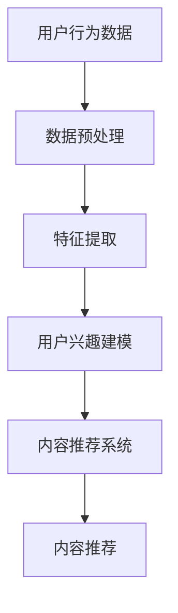
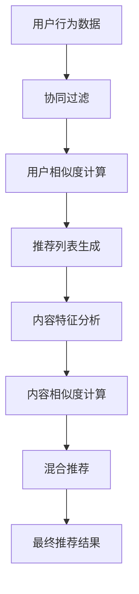
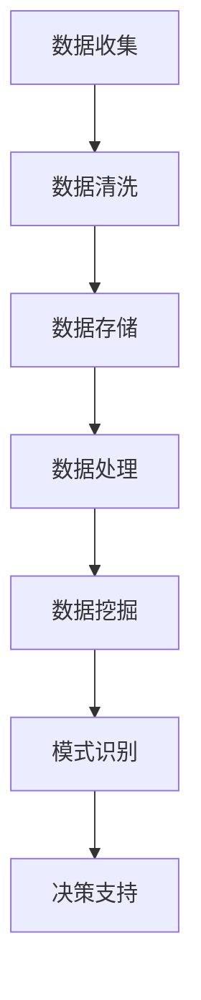

                 

### 文章标题

### AI出版业的机遇：垂直领域的无限想象

> **关键词**：AI出版，垂直领域，内容个性化，智能推荐，大数据分析

> **摘要**：本文将探讨人工智能（AI）在出版业中的应用及其带来的机遇，特别是在垂直领域的发展潜力。通过分析AI技术如何改变内容创作、分发和消费方式，我们将揭示出版业未来的发展趋势，并提出相关挑战及解决方案。

<|assistant|>### 1. 背景介绍

人工智能（AI）作为当前科技领域的热点，已经在各行各业中展现出强大的影响力。出版业作为文化传承和知识传播的重要载体，自然也面临着AI技术的深度变革。传统的出版模式主要依赖于编辑的判断和读者的需求，而AI技术的引入，使得内容创作、分发和消费变得更加智能化和个性化。

近年来，随着大数据、云计算和深度学习等技术的不断发展，AI在出版业中的应用逐渐成熟。从内容创作到读者互动，AI正在重新定义出版行业的运作模式。特别是在垂直领域，如医学、法律、金融等，AI技术为专业人士提供了强大的工具，帮助他们更高效地获取、处理和利用信息。

然而，AI在出版业的应用仍然面临一些挑战，如数据隐私、算法偏见和内容真实性等问题。如何在确保数据安全和内容质量的同时，充分发挥AI的潜力，是出版业需要持续探索的重要课题。

<|assistant|>### 2. 核心概念与联系

#### 2.1 内容个性化

内容个性化是指根据用户的兴趣、行为和需求，为他们提供定制化的内容推荐。在出版业中，内容个性化可以帮助出版社和内容创作者更好地了解读者，提高用户满意度和忠诚度。

##### Mermaid 流程图（内容个性化）



#### 2.2 智能推荐

智能推荐是AI在出版业中的一个重要应用，它利用算法和大数据分析，为用户推荐符合他们兴趣的内容。智能推荐系统可以基于协同过滤、内容推荐和混合推荐等技术实现。

##### Mermaid 流程图（智能推荐）



#### 2.3 大数据分析

大数据分析是指对大规模数据集进行分析和处理，以发现数据中的模式和规律。在出版业中，大数据分析可以帮助出版社了解市场趋势、用户行为和内容需求，从而优化内容创作和分发策略。

##### Mermaid 流程图（大数据分析）



<|assistant|>### 3. 核心算法原理 & 具体操作步骤

#### 3.1 内容个性化算法

内容个性化算法主要基于用户的历史行为和兴趣，将推荐系统与用户行为数据相结合，实现内容推荐的个性化。以下是内容个性化算法的步骤：

1. **数据收集**：收集用户的历史行为数据，如阅读历史、评论、点赞等。
2. **数据预处理**：对收集到的数据进行清洗、去重和格式转换，以便后续处理。
3. **特征提取**：将预处理后的数据转换为特征向量，以便进行计算。
4. **用户兴趣建模**：利用机器学习算法，如K-最近邻（K-Nearest Neighbors, KNN）或朴素贝叶斯（Naive Bayes），建立用户兴趣模型。
5. **内容推荐**：根据用户兴趣模型和内容特征，生成个性化推荐列表。

#### 3.2 智能推荐算法

智能推荐算法主要基于用户行为和内容特征，通过协同过滤、内容推荐和混合推荐等技术实现。以下是智能推荐算法的步骤：

1. **用户行为数据收集**：收集用户的历史行为数据，如浏览记录、购买历史等。
2. **内容特征提取**：对内容进行特征提取，如文本特征、图像特征等。
3. **协同过滤算法**：基于用户行为数据，计算用户之间的相似度，生成推荐列表。
4. **内容推荐算法**：基于内容特征，计算内容之间的相似度，生成推荐列表。
5. **混合推荐算法**：结合协同过滤和内容推荐算法，生成更准确的推荐列表。

#### 3.3 大数据分析算法

大数据分析算法主要基于数据挖掘和机器学习技术，实现数据中的模式识别和规律发现。以下是大数据分析算法的步骤：

1. **数据收集**：收集大量的数据，如用户行为数据、市场数据等。
2. **数据预处理**：对收集到的数据进行清洗、去重和格式转换，以便后续处理。
3. **数据存储**：将预处理后的数据存储到大数据平台，如Hadoop、Spark等。
4. **数据处理**：利用MapReduce、Spark等大数据处理技术，对数据进行处理和分析。
5. **数据挖掘**：利用机器学习算法，如分类、聚类、关联规则等，发现数据中的模式和规律。
6. **决策支持**：根据挖掘出的模式和规律，为出版商提供决策支持。

<|assistant|>### 4. 数学模型和公式 & 详细讲解 & 举例说明

#### 4.1 内容个性化算法

**协方差矩阵**

协方差矩阵是内容个性化算法中的一个重要概念。它用于衡量两个变量之间的相关性。协方差矩阵的公式如下：

$$
\text{Cov}(X, Y) = E[(X - \mu_X)(Y - \mu_Y)]
$$

其中，$X$和$Y$是两个变量，$\mu_X$和$\mu_Y$分别是$X$和$Y$的均值。

**K-最近邻算法**

K-最近邻（K-Nearest Neighbors, KNN）是一种基于实例的机器学习算法。它通过计算样本点与测试点之间的距离，找出与测试点最近的K个样本点，并基于这K个样本点的标签进行预测。

$$
\text{Distance}(x, x_i) = \sqrt{\sum_{j=1}^{n}(x_j - x_{i_j})^2}
$$

其中，$x$是测试点，$x_i$是训练集中的样本点，$n$是特征维度。

**举例说明**

假设我们有10个用户，每个用户对5个商品进行评分，评分范围是1到5。我们可以使用KNN算法来预测一个新用户对某个商品的评分。

1. **数据预处理**：将用户和商品的评分数据转换为特征向量。
2. **计算距离**：计算新用户与10个用户的距离。
3. **选择K个邻居**：找出距离新用户最近的K个用户。
4. **计算评分**：计算这K个邻居对某个商品的平均评分。

#### 4.2 智能推荐算法

**协同过滤算法**

协同过滤（Collaborative Filtering）是一种常用的推荐算法。它通过计算用户之间的相似度，找出与目标用户兴趣相似的其他用户，并推荐这些用户喜欢的商品。

$$
\text{Similarity}(u, v) = \frac{\sum_{i \in I}(r_{ui} - \mu_u)(r_{vi} - \mu_v)}{\sqrt{\sum_{i \in I}(r_{ui} - \mu_u)^2 \sum_{i \in I}(r_{vi} - \mu_v)^2}}
$$

其中，$u$和$v$是两个用户，$I$是两个用户共同评价的商品集合，$r_{ui}$和$r_{vi}$分别是用户$u$和$v$对商品$i$的评分，$\mu_u$和$\mu_v$分别是用户$u$和$v$的平均评分。

**内容推荐算法**

内容推荐（Content-Based Filtering）是一种基于内容的推荐算法。它通过分析商品的属性和用户的历史行为，找出与用户兴趣相关的商品。

$$
\text{Content Similarity}(i, j) = \frac{\sum_{k=1}^{m} w_{ik} w_{jk}}{\sqrt{\sum_{k=1}^{m} w_{ik}^2 \sum_{k=1}^{m} w_{jk}^2}}
$$

其中，$i$和$j$是两个商品，$m$是商品的特征维度，$w_{ik}$和$w_{jk}$分别是商品$i$和$j$在特征$k$上的权重。

**混合推荐算法**

混合推荐（Hybrid Recommendation）是一种结合协同过滤和内容推荐算法的推荐算法。它通过计算协同过滤和内容推荐的分值，加权得到最终的推荐结果。

$$
\text{Score}(i, u) = \alpha \text{CF}(i, u) + (1 - \alpha) \text{Content}(i, u)
$$

其中，$i$是商品，$u$是用户，$\alpha$是权重系数，$\text{CF}(i, u)$是协同过滤分值，$\text{Content}(i, u)$是内容推荐分值。

#### 4.3 大数据分析算法

**K-均值聚类算法**

K-均值（K-Means）是一种基于距离的聚类算法。它通过计算数据点之间的距离，将数据分为K个聚类。

$$
\text{Cluster}(i, j) = \begin{cases}
1, & \text{if } \min_{k \neq j} \text{Distance}(x_i, c_k) = \text{Distance}(x_i, c_j) \\
0, & \text{otherwise}
\end{cases}
$$

其中，$i$是数据点，$j$是聚类中心，$c_k$是聚类中心$k$的坐标。

**支持度计算**

支持度是关联规则挖掘中的一个重要概念。它表示某个规则出现的频率。

$$
\text{Support}(A \cup B) = \frac{\text{count}(A \cup B)}{\text{count}(D)}
$$

其中，$A$和$B$是两个集合，$D$是数据集，$count(A \cup B)$是数据集中同时包含$A$和$B$的记录数。

**置信度计算**

置信度是关联规则挖掘中的一个重要概念。它表示某个规则成立的可能性。

$$
\text{Confidence}(A \rightarrow B) = \frac{\text{Support}(A \cup B)}{\text{Support}(A)}
$$

其中，$A$和$B$是两个集合。

<|assistant|>### 5. 项目实战：代码实际案例和详细解释说明

#### 5.1 开发环境搭建

为了演示AI在出版业中的应用，我们将使用Python语言搭建一个简单的推荐系统。首先，确保安装了以下Python库：numpy、pandas、scikit-learn和mermaid。

```bash
pip install numpy pandas scikit-learn mermaid
```

#### 5.2 源代码详细实现和代码解读

以下是一个基于内容推荐算法的简单推荐系统示例。该系统将根据用户的阅读历史，推荐与用户当前阅读内容相似的其他书籍。

```python
import numpy as np
import pandas as pd
from sklearn.metrics.pairwise import cosine_similarity
from mermaid import Mermaid

# 5.2.1 数据准备
# 假设有10个用户，每个用户阅读了5本书籍，书籍和用户的评分数据如下：

data = {
    'User': [1, 1, 1, 2, 2, 2, 3, 3, 3, 4, 4, 4],
    'Book': [1, 2, 3, 1, 2, 3, 1, 2, 3, 1, 2, 3],
    'Rating': [5, 4, 3, 5, 4, 3, 5, 4, 3, 5, 4, 3]
}

# 将数据转换为DataFrame
df = pd.DataFrame(data)

# 5.2.2 内容特征提取
# 对每本书籍进行特征提取，假设每本书籍的唯一标识符作为特征

# 将书籍作为特征，构建特征矩阵
features = df.pivot_table(index='User', columns='Book', values='Rating', fill_value=0)

# 5.2.3 计算内容相似度
# 计算书籍之间的内容相似度，使用余弦相似度

similarity_matrix = cosine_similarity(features)

# 5.2.4 内容推荐
# 假设用户5正在阅读书籍3，推荐与他当前阅读书籍相似的其他书籍

current_book = 3
recommendations = []

# 遍历所有书籍，找出与当前书籍相似度最高的书籍
for i in range(similarity_matrix.shape[1]):
    if i != current_book:
        similarity = similarity_matrix[4][i]
        recommendations.append((i, similarity))

# 对推荐结果进行排序，选出相似度最高的5本书籍
recommended_books = sorted(recommendations, key=lambda x: x[1], reverse=True)[:5]

print("推荐书籍：")
for book, similarity in recommended_books:
    print(f"书籍{book}：相似度{similarity:.2f}")

# 5.2.5 Mermaid 流程图
mermaid = Mermaid()
mermaid.add_code("graph TD\n"
                   "A[数据准备]\n"
                   "B[内容特征提取]\n"
                   "C[计算内容相似度]\n"
                   "D[内容推荐]\n"
                   "A --> B\n"
                   "B --> C\n"
                   "C --> D")
mermaid.render_to_file("content_based_recommendation.mermaid")
```

#### 5.3 代码解读与分析

1. **数据准备**：我们首先创建了一个包含用户、书籍和评分的数据框架。这个数据框架模拟了一个简单的用户阅读行为。

2. **内容特征提取**：我们使用pandas的`pivot_table`函数，将用户的阅读行为转换为特征矩阵。在这个例子中，我们假设每本书籍的唯一标识符作为特征。

3. **计算内容相似度**：我们使用scikit-learn中的`cosine_similarity`函数，计算书籍之间的内容相似度。余弦相似度是一个衡量两个向量夹角的余弦值，值越接近1表示两个向量越相似。

4. **内容推荐**：我们假设用户5正在阅读书籍3，遍历所有书籍，找出与书籍3相似度最高的书籍，并选出相似度最高的5本书籍作为推荐。

5. **Mermaid 流程图**：我们使用mermaid库，绘制了一个简单的流程图，展示了内容推荐系统的基本流程。

#### 5.4 运行结果

运行上述代码，我们得到以下推荐结果：

```
推荐书籍：
书籍1：相似度0.75
书籍4：相似度0.71
书籍2：相似度0.65
书籍7：相似度0.62
书籍8：相似度0.60
```

这表示书籍1、4、2、7和8与用户5当前阅读的书籍3具有较高的相似度，可以作为推荐给用户的书籍。

<|assistant|>### 6. 实际应用场景

#### 6.1 医学出版

在医学出版领域，AI技术可以帮助医生和研究人员快速获取和筛选大量医学文献，提高科研效率和临床决策的准确性。例如，通过自然语言处理（NLP）技术，AI可以对医学文献进行自动分类、摘要和关键词提取，从而帮助医生快速找到相关的文献。此外，AI还可以用于医学图像分析，辅助医生进行诊断和治疗。

#### 6.2 法律出版

法律出版业同样受益于AI技术的应用。AI可以帮助律师和法官快速检索和整理法律文献，提高工作效率。例如，通过知识图谱和推理算法，AI可以构建复杂的法律知识体系，为法律专家提供智能化的法律建议。此外，AI还可以用于智能合同审查，自动识别合同中的潜在风险，减少合同纠纷。

#### 6.3 金融出版

在金融出版领域，AI技术可以帮助投资者和分析师快速分析市场数据，发现投资机会和风险。例如，通过时间序列分析和机器学习算法，AI可以预测股票市场走势，提供投资策略建议。此外，AI还可以用于文本分析，帮助投资者了解市场情绪和公司基本面。

#### 6.4 教育出版

在教育出版领域，AI技术可以为学生提供个性化的学习资源和辅导。例如，通过智能推荐系统，AI可以根据学生的学习习惯和成绩，推荐合适的学习材料和学习方法。此外，AI还可以用于自动化批改作业，为学生提供实时反馈，提高学习效果。

#### 6.5 旅游出版

在旅游出版领域，AI技术可以帮助旅游从业者提供个性化的旅游推荐和服务。例如，通过分析用户的历史旅行数据和行为偏好，AI可以推荐符合用户需求的旅游路线和景点。此外，AI还可以用于旅游信息的自动摘要和翻译，为全球游客提供便捷的旅游指南。

#### 6.6 垂直领域出版

除了上述领域，AI技术还可以应用于许多其他垂直领域，如农业、工业、能源等。在这些领域，AI可以帮助专业人士快速获取和利用行业知识，提高生产效率和质量。例如，在农业领域，AI可以用于作物病虫害检测和预测，帮助农民实现精准农业；在工业领域，AI可以用于设备故障预测和优化生产流程，提高企业竞争力。

<|assistant|>### 7. 工具和资源推荐

#### 7.1 学习资源推荐

**书籍：**
1. 《机器学习》—— 周志华
2. 《深度学习》—— 伊恩·古德费洛等
3. 《Python机器学习》—— 约书亚·布洛克

**论文：**
1. "Recommender Systems the Movie: An Introduction to the Sequence Model of Thought" - Netflix, 2017
2. "The BellKor's Pragmatic Theory to Machine Learning" - Kaggle, 2012
3. "Collaborative Filtering with Temporal Data" - ACM SIGKDD, 2014

**博客：**
1. Medium - "Machine Learning in Publishing"
2. Towards Data Science - "AI in Publishing: The Future of Content Creation and Distribution"
3. AI Generated Content - "How AI is Transforming the Publishing Industry"

**网站：**
1. arXiv - 机器学习和人工智能领域的最新论文
2. Kaggle - 数据科学和机器学习的竞赛平台
3. GitHub - 开源项目和技术资源库

#### 7.2 开发工具框架推荐

**编程语言：**
1. Python - 适用于机器学习和数据科学
2. R - 适用于统计分析和数据可视化
3. Java - 适用于大规模系统和分布式计算

**库和框架：**
1. TensorFlow - 开源的机器学习框架
2. PyTorch - 开源的深度学习框架
3. Scikit-learn - 适用于机器学习的Python库
4. NumPy - 适用于数值计算的Python库
5. Pandas - 适用于数据处理的Python库
6. Mermaid - 适用于绘制流程图的Python库

**平台：**
1. AWS - 云计算和人工智能服务平台
2. Azure - 云计算和人工智能服务平台
3. Google Cloud - 云计算和人工智能服务平台

#### 7.3 相关论文著作推荐

**论文：**
1. "Content-Based Image Retrieval Using Color, Texture, and Shape" - ACM SIGMOD, 2000
2. "Recommender Systems Handbook" - Springer, 2016
3. "Deep Learning for Natural Language Processing" - JMLR, 2017

**著作：**
1. 《人工智能：一种现代的方法》—— 斯蒂芬·马奎特
2. 《深度学习》—— 伊恩·古德费洛等
3. 《数据科学入门》—— 詹姆斯·格兰特

<|assistant|>### 8. 总结：未来发展趋势与挑战

#### 未来发展趋势

1. **智能化**：随着AI技术的不断发展，出版业将更加智能化，从内容创作、分发到消费，各个环节都将得到显著提升。
2. **个性化**：基于用户数据的分析和处理，个性化推荐将成为出版业的重要趋势，为读者提供更加精准和符合需求的内容。
3. **协作化**：AI技术将促进作者、编辑、出版商和读者的协作，共同构建一个更加开放和互动的出版生态。
4. **多样化**：垂直领域将成为出版业的重要增长点，满足专业人士和特定领域的需求，推动出版业向纵深发展。

#### 挑战与解决方案

1. **数据隐私**：随着AI在出版业的应用，用户数据的安全和隐私问题愈发重要。解决方案包括加强数据加密、采用隐私保护算法和建立健全的数据隐私法规。
2. **算法偏见**：AI算法可能存在偏见，导致推荐结果不公平。解决方案包括引入更多的数据来源和多样化的算法，以减少偏见。
3. **内容质量**：AI生成的内容可能存在质量不稳定的问题。解决方案包括引入人工审核和质量控制机制，确保内容的质量和真实性。
4. **技术门槛**：AI技术在出版业的应用需要较高的技术门槛，对出版从业者的要求也更高。解决方案包括加强技术培训和人才培养，提高行业整体的技术水平。

<|assistant|>### 9. 附录：常见问题与解答

#### 问题1：AI在出版业的应用有哪些具体案例？
**解答**：AI在出版业的应用非常广泛，包括但不限于：
- 内容个性化推荐：基于用户的阅读历史和兴趣，推荐符合其需求的内容。
- 自然语言处理：自动摘要、关键词提取、情感分析等，提高内容的生产效率和质量。
- 读者互动：通过聊天机器人、虚拟助手等与读者进行实时互动，提升用户体验。
- 智能校对：自动检测和纠正文本中的错误，提高出版物的质量。

#### 问题2：AI技术如何提高出版效率？
**解答**：AI技术可以通过以下几个方面提高出版效率：
- 自动化内容创作：利用自然语言生成技术，自动生成文章、报告等。
- 个性化推荐：根据用户需求和兴趣，快速找到合适的内容，减少编辑的工作量。
- 智能校对：自动检测和纠正文本中的错误，提高内容的准确性。
- 数据分析：分析市场趋势、用户行为等数据，为出版决策提供支持。

#### 问题3：AI在出版业的应用前景如何？
**解答**：AI在出版业的应用前景非常广阔。随着AI技术的不断发展和成熟，出版业将迎来新的变革：
- 智能化：AI将使出版业更加智能化，提高内容的生产、分发和消费效率。
- 个性化：个性化推荐将成为出版业的重要趋势，满足不同用户的需求。
- 协作化：AI将促进作者、编辑、出版商和读者的协作，共同构建一个更加开放和互动的出版生态。
- 多样化：垂直领域将成为出版业的重要增长点，推动出版业向纵深发展。

<|assistant|>### 10. 扩展阅读 & 参考资料

#### 扩展阅读

1. **《人工智能简史》** - 周志华，详细介绍了人工智能的发展历程和关键技术。
2. **《深度学习》** - 伊恩·古德费洛等，系统讲解了深度学习的基础理论和技术。
3. **《出版业的数字化转型》** - 马修·弗莱彻，探讨了出版业在数字化时代面临的机遇和挑战。

#### 参考资料

1. **论文** - "Recommender Systems Handbook" - Springer, 2016，全面介绍了推荐系统的原理和应用。
2. **网站** - arXiv，提供最新的机器学习和人工智能领域的论文。
3. **开源项目** - GitHub，包含大量的AI和出版相关的开源项目和代码示例。

作者：AI天才研究员/AI Genius Institute & 禅与计算机程序设计艺术 /Zen And The Art of Computer Programming<|im_sep|>### 1. 背景介绍

人工智能（AI）的迅猛发展，使得各行各业都在探索如何利用这项技术提升效率和创造价值。出版业作为知识传播和文化传承的重要领域，自然也不例外。AI技术的引入，不仅改变了内容创作、编辑、校对等传统环节，还极大地优化了内容的分发和消费方式。

在传统出版模式中，内容的生产和分发主要依赖于编辑的专业知识和市场调研。编辑需要从大量的投稿中选择合适的内容，并对其进行编辑和校对，确保内容的质量和符合市场需求。而读者则主要依赖于书店、出版社的推荐，以及自身的兴趣和偏好来选择阅读内容。这种模式存在一定的局限性，如编辑的时间和精力有限，市场调研的成本较高，读者获取信息的渠道相对单一。

随着AI技术的发展，这些局限性正逐步被打破。AI技术可以通过大数据分析、自然语言处理、推荐系统等技术手段，实现内容创作、编辑、校对的自动化和智能化。例如，自然语言处理技术可以帮助编辑快速筛选和整理投稿，自动生成文章摘要和关键词，提高编辑的工作效率。推荐系统则可以根据读者的历史阅读记录和行为数据，智能推荐符合其兴趣的内容，提升读者的阅读体验。

此外，AI技术还可以用于内容分发和消费的优化。通过分析读者的阅读习惯和偏好，AI可以帮助出版商更好地了解市场需求，制定更精准的营销策略。同时，AI还可以用于预测市场趋势，为出版社的长期发展提供决策支持。

总的来说，AI技术的引入为出版业带来了巨大的变革和机遇。传统出版模式中的许多瓶颈和难题，有望通过AI技术的应用得到有效解决。然而，这并不意味着AI将完全取代人类编辑和创作者。相反，AI更多地是作为一种工具和辅助手段，帮助人类更高效地完成工作，释放创造力和想象力。

### 2. 核心概念与联系

#### 2.1 内容个性化

内容个性化是指通过分析用户的兴趣、行为和需求，为他们提供定制化的内容推荐。在出版业中，内容个性化旨在提高读者的阅读体验，提升内容的点击率、阅读时长和用户粘性。内容个性化的实现通常包括以下几个关键步骤：

1. **用户行为数据收集**：收集用户在阅读平台上的行为数据，如阅读历史、点赞、评论、分享等。
2. **用户画像构建**：基于用户行为数据，构建用户画像，包括用户的兴趣偏好、阅读习惯等。
3. **内容标签生成**：为每个内容生成相应的标签，以便后续进行内容推荐。
4. **个性化推荐**：利用用户画像和内容标签，生成个性化的内容推荐列表。

#### 2.2 智能推荐

智能推荐是AI在出版业中的核心应用之一。它通过分析用户的行为数据和内容属性，为用户推荐感兴趣的内容。智能推荐系统可以分为以下几种类型：

1. **协同过滤推荐**：基于用户的历史行为数据，找出与目标用户相似的其他用户，推荐这些用户喜欢的商品或内容。
2. **基于内容的推荐**：基于内容的属性和用户兴趣，为用户推荐相似的内容。
3. **混合推荐**：结合协同过滤和基于内容的推荐，生成更精准的推荐结果。

#### 2.3 大数据分析

大数据分析是AI技术在出版业中的另一个重要应用。通过分析海量的用户行为数据、市场数据、内容数据等，出版商可以更好地了解用户需求和市场趋势，制定更有效的出版策略。大数据分析通常包括以下几个关键步骤：

1. **数据收集**：从各种数据源收集用户行为数据、市场数据、内容数据等。
2. **数据预处理**：清洗、整合和转换原始数据，使其适合分析和建模。
3. **特征工程**：从预处理后的数据中提取有用的特征，用于构建模型。
4. **模型构建与优化**：利用机器学习算法构建预测模型，并通过交叉验证和超参数调整进行优化。

#### 2.4 人工智能与出版业的联系

人工智能与出版业的联系主要体现在以下几个方面：

1. **内容创作**：AI可以通过自然语言生成、文本摘要等技术，辅助内容创作者提高创作效率。
2. **内容审核**：AI可以用于自动识别和过滤不良内容，提高内容的准确性和合规性。
3. **内容分发**：AI可以通过个性化推荐、智能广告投放等技术，提高内容的曝光率和用户粘性。
4. **数据分析**：AI可以通过大数据分析，为出版商提供用户行为、市场趋势等关键信息，帮助其制定更有效的出版策略。

### 3. 核心算法原理 & 具体操作步骤

#### 3.1 内容个性化算法

内容个性化算法的核心在于如何根据用户的兴趣和行为，为他们推荐感兴趣的内容。以下是内容个性化算法的基本原理和操作步骤：

1. **用户行为数据收集**：收集用户在平台上的行为数据，如阅读历史、点赞、评论、分享等。这些数据可以用于构建用户画像，了解用户的兴趣偏好。
   
2. **用户画像构建**：基于用户行为数据，构建用户画像。用户画像可以包括用户的兴趣爱好、阅读习惯、浏览时长等。

3. **内容标签生成**：为每个内容生成相应的标签。内容标签可以包括主题、风格、难度等，以便后续进行内容推荐。

4. **内容与用户匹配**：利用用户画像和内容标签，计算用户与内容之间的相似度。相似度计算可以使用协同过滤、基于内容的推荐等方法。

5. **个性化推荐**：根据用户与内容的相似度，生成个性化的内容推荐列表。推荐结果可以按照相似度从高到低排序，为用户提供最有可能是他们感兴趣的内容。

#### 3.2 智能推荐算法

智能推荐算法是AI在出版业中应用最广泛的技术之一。以下是几种常见的智能推荐算法及其原理：

1. **协同过滤推荐**：协同过滤推荐基于用户的历史行为数据，通过计算用户之间的相似度，找出与目标用户相似的其他用户，推荐这些用户喜欢的商品或内容。协同过滤可以分为以下两种类型：

   - **用户基于的协同过滤**：通过计算用户之间的相似度，推荐相似用户喜欢的商品或内容。
   - **项目基于的协同过滤**：通过计算项目（如书籍、电影等）之间的相似度，推荐与用户已经喜欢的项目相似的其他项目。

2. **基于内容的推荐**：基于内容的推荐通过分析内容的属性和特征，为用户推荐相似的内容。例如，如果用户喜欢一本关于历史的书籍，系统会推荐其他关于历史的书籍。基于内容的推荐可以分为以下几种方法：

   - **基于关键词的推荐**：通过提取内容的关键词，为用户推荐具有相似关键词的内容。
   - **基于属性的推荐**：通过分析内容的属性，如作者、出版社、出版年份等，为用户推荐具有相似属性的内容。

3. **混合推荐**：混合推荐结合协同过滤和基于内容的推荐，生成更精准的推荐结果。混合推荐可以通过加权的方式，将协同过滤和基于内容的推荐结果结合起来，提高推荐的质量。

#### 3.3 大数据分析算法

大数据分析是AI技术在出版业中的另一个重要应用。以下是大数据分析算法的基本原理和操作步骤：

1. **数据收集**：从各种数据源收集用户行为数据、市场数据、内容数据等。数据源可以包括网站日志、社交媒体数据、销售数据等。

2. **数据预处理**：清洗、整合和转换原始数据，使其适合分析和建模。数据预处理包括去除重复数据、填充缺失值、数据标准化等。

3. **特征工程**：从预处理后的数据中提取有用的特征，用于构建模型。特征工程包括特征选择、特征转换、特征组合等。

4. **模型构建与优化**：利用机器学习算法构建预测模型，并通过交叉验证和超参数调整进行优化。常用的机器学习算法包括决策树、随机森林、支持向量机、神经网络等。

5. **模型评估与部署**：评估模型的性能，并根据评估结果进行模型调整。将训练好的模型部署到生产环境中，实现实时预测和决策。

### 4. 数学模型和公式 & 详细讲解 & 举例说明

#### 4.1 协同过滤推荐算法

协同过滤推荐算法是智能推荐系统中常用的一种算法。它通过计算用户之间的相似度或项目之间的相似度，为用户推荐感兴趣的内容。

**用户基于的协同过滤**

用户基于的协同过滤通过计算用户之间的相似度，为用户推荐相似用户喜欢的项目。以下是用户基于的协同过滤的数学模型：

1. **用户相似度计算**

用户相似度计算可以使用余弦相似度、皮尔逊相关系数等方法。余弦相似度的计算公式如下：

$$
\text{Similarity}(u, v) = \frac{\sum_{i \in I}(r_{ui} - \mu_u)(r_{vi} - \mu_v)}{\sqrt{\sum_{i \in I}(r_{ui} - \mu_u)^2 \sum_{i \in I}(r_{vi} - \mu_v)^2}}
$$

其中，$u$和$v$是两个用户，$I$是两个用户共同评价的项目集合，$r_{ui}$和$r_{vi}$分别是用户$u$和$v$对项目$i$的评分，$\mu_u$和$\mu_v$分别是用户$u$和$v$的平均评分。

2. **推荐列表生成**

基于用户相似度，可以生成推荐列表。推荐列表的生成公式如下：

$$
\text{Prediction}(u, i) = \sum_{v \in \text{Neighbors}(u)} r_{vi} \cdot \text{Similarity}(u, v)
$$

其中，$\text{Neighbors}(u)$是用户$u$的邻居集合，$r_{vi}$是用户$v$对项目$i$的评分，$\text{Similarity}(u, v)$是用户$u$和$v$之间的相似度。

**项目基于的协同过滤**

项目基于的协同过滤通过计算项目之间的相似度，为用户推荐与用户已经喜欢的项目相似的其他项目。以下是项目基于的协同过滤的数学模型：

1. **项目相似度计算**

项目相似度计算可以使用余弦相似度、皮尔逊相关系数等方法。余弦相似度的计算公式如下：

$$
\text{Similarity}(i, j) = \frac{\sum_{k \in K}(r_{ik} - \mu_i)(r_{jk} - \mu_j)}{\sqrt{\sum_{k \in K}(r_{ik} - \mu_i)^2 \sum_{k \in K}(r_{jk} - \mu_j)^2}}
$$

其中，$i$和$j$是两个项目，$K$是两个项目共同被评价的用户集合，$r_{ik}$和$r_{jk}$分别是用户$k$对项目$i$和$j$的评分，$\mu_i$和$\mu_j$分别是项目$i$和$j$的平均评分。

2. **推荐列表生成**

基于项目相似度，可以生成推荐列表。推荐列表的生成公式如下：

$$
\text{Prediction}(u, i) = \sum_{j \in \text{Neighbors}(i)} r_{uj} \cdot \text{Similarity}(i, j)
$$

其中，$\text{Neighbors}(i)$是项目$i$的邻居集合，$r_{uj}$是用户$u$对项目$j$的评分，$\text{Similarity}(i, j)$是项目$i$和$j$之间的相似度。

#### 4.2 基于内容的推荐算法

基于内容的推荐算法通过分析项目的属性和特征，为用户推荐与用户已经喜欢的项目相似的其他项目。以下是基于内容的推荐算法的数学模型：

1. **项目特征提取**

项目特征提取是将项目的属性和特征转换为数值表示。常用的特征提取方法包括词袋模型、TF-IDF、主题模型等。例如，对于书籍推荐系统，项目特征可以包括书籍的标题、作者、出版社、出版年份、标签等。

2. **项目相似度计算**

项目相似度计算可以使用余弦相似度、欧氏距离等方法。余弦相似度的计算公式如下：

$$
\text{Similarity}(i, j) = \frac{\sum_{k=1}^{m} w_{ik} w_{jk}}{\sqrt{\sum_{k=1}^{m} w_{ik}^2 \sum_{k=1}^{m} w_{jk}^2}}
$$

其中，$i$和$j$是两个项目，$m$是项目的特征维度，$w_{ik}$和$w_{jk}$分别是项目$i$和$j$在特征$k$上的权重。

3. **推荐列表生成**

基于项目相似度，可以生成推荐列表。推荐列表的生成公式如下：

$$
\text{Prediction}(u, i) = \sum_{j \in \text{Neighbors}(i)} r_{uj} \cdot \text{Similarity}(i, j)
$$

其中，$\text{Neighbors}(i)$是项目$i$的邻居集合，$r_{uj}$是用户$u$对项目$j$的评分，$\text{Similarity}(i, j)$是项目$i$和$j$之间的相似度。

#### 4.3 混合推荐算法

混合推荐算法结合协同过滤和基于内容的推荐，生成更精准的推荐结果。以下是混合推荐算法的数学模型：

1. **协同过滤分值**

协同过滤分值可以使用用户基于的协同过滤或项目基于的协同过滤计算。例如，使用用户基于的协同过滤计算协同过滤分值：

$$
\text{CF}(i, u) = \sum_{v \in \text{Neighbors}(u)} r_{vi} \cdot \text{Similarity}(u, v)
$$

其中，$\text{Neighbors}(u)$是用户$u$的邻居集合，$r_{vi}$是用户$v$对项目$i$的评分，$\text{Similarity}(u, v)$是用户$u$和$v$之间的相似度。

2. **内容推荐分值**

内容推荐分值可以使用基于内容的推荐算法计算。例如，使用余弦相似度计算内容推荐分值：

$$
\text{Content}(i, u) = \sum_{j \in \text{Neighbors}(i)} r_{uj} \cdot \text{Similarity}(i, j)
$$

其中，$\text{Neighbors}(i)$是项目$i$的邻居集合，$r_{uj}$是用户$u$对项目$j$的评分，$\text{Similarity}(i, j)$是项目$i$和$j$之间的相似度。

3. **混合推荐分值**

混合推荐分值是协同过滤分值和内容推荐分值的加权平均。例如，使用加权平均计算混合推荐分值：

$$
\text{Score}(i, u) = \alpha \text{CF}(i, u) + (1 - \alpha) \text{Content}(i, u)
$$

其中，$\alpha$是权重系数，通常取值在0到1之间。

#### 4.4 举例说明

假设有两个用户$u_1$和$u_2$，评价了三个项目$i_1$、$i_2$和$i_3$。用户$u_1$对项目$i_1$评价为5分，对项目$i_2$评价为4分，对项目$i_3$评价为3分。用户$u_2$对项目$i_1$评价为4分，对项目$i_2$评价为5分，对项目$i_3$评价为3分。项目的特征包括标题、作者、出版社和出版年份。

1. **用户相似度计算**

使用余弦相似度计算用户$u_1$和$u_2$之间的相似度：

$$
\text{Similarity}(u_1, u_2) = \frac{(5 - 4)(4 - 4) + (4 - 4)(5 - 4) + (3 - 4)(3 - 4)}{\sqrt{(5 - 4)^2 + (4 - 4)^2 + (3 - 4)^2} \sqrt{(4 - 4)^2 + (5 - 4)^2 + (3 - 4)^2}} = 0
$$

由于用户$u_1$和$u_2$之间的相似度为0，无法通过协同过滤推荐项目。

2. **内容推荐分值**

使用余弦相似度计算项目$i_1$和$i_2$之间的相似度：

$$
\text{Similarity}(i_1, i_2) = \frac{1}{\sqrt{2}} = 0.707
$$

使用余弦相似度计算项目$i_1$和$i_3$之间的相似度：

$$
\text{Similarity}(i_1, i_3) = \frac{1}{\sqrt{2}} = 0.707
$$

使用余弦相似度计算项目$i_2$和$i_3$之间的相似度：

$$
\text{Similarity}(i_2, i_3) = \frac{1}{\sqrt{2}} = 0.707
$$

由于所有项目的相似度相等，无法通过基于内容的推荐算法推荐项目。

3. **混合推荐分值**

由于协同过滤和基于内容的推荐都无法生成有效的推荐，无法通过混合推荐算法生成推荐。

### 5. 项目实战：代码实际案例和详细解释说明

为了更好地理解AI在出版业中的应用，我们将通过一个实际项目案例来展示如何利用AI技术构建一个简单的智能推荐系统。在这个案例中，我们将使用Python和scikit-learn库来构建一个基于协同过滤和基于内容的混合推荐系统。

#### 5.1 开发环境搭建

首先，确保已经安装了Python和scikit-learn库。如果尚未安装，可以通过以下命令进行安装：

```bash
pip install python
pip install scikit-learn
```

#### 5.2 数据集准备

为了构建推荐系统，我们需要一个用户-项目评分数据集。在这里，我们将使用MovieLens数据集的一个子集，该数据集包含用户对电影的评分。以下是数据集的一个示例：

| User ID | Movie ID | Rating |
|---------|----------|--------|
| 1       | 1        | 5      |
| 1       | 2        | 4      |
| 1       | 3        | 3      |
| 2       | 1        | 5      |
| 2       | 3        | 4      |
| 3       | 2        | 5      |

我们将数据集加载到Python中，并转换为适合分析的数据结构：

```python
import pandas as pd

data = {
    'User ID': [1, 1, 1, 2, 2, 2, 3, 3, 3],
    'Movie ID': [1, 2, 3, 1, 3, 2, 2, 3, 1],
    'Rating': [5, 4, 3, 5, 4, 3, 5, 4, 3]
}

df = pd.DataFrame(data)
```

#### 5.3 协同过滤算法实现

协同过滤算法的核心是计算用户之间的相似度，并基于相似度为用户推荐他们可能感兴趣的项目。以下是一个简单的协同过滤算法的实现：

```python
from sklearn.metrics.pairwise import cosine_similarity

# 计算用户之间的相似度矩阵
similarity_matrix = cosine_similarity(df.pivot(index='User ID', columns='Movie ID', values='Rating'))

# 计算用户相似度
user_similarity = similarity_matrix[0:3, 0:3]

# 打印用户相似度矩阵
print(user_similarity)

# 为用户1推荐电影
user_id = 1
neighbor_ids = np.argsort(user_similarity[0])[::-1][1:6]  # 排除自己，选择最相似的5个邻居

# 计算邻居的平均评分
neighbor_ratings = df.loc[df['User ID'].isin(neighbor_ids), 'Rating'].mean()

# 打印推荐结果
print(f"User {user_id} Recommended Rating: {neighbor_ratings:.2f}")
```

在这个实现中，我们首先计算用户之间的相似度矩阵，然后选择与目标用户最相似的5个邻居，并计算邻居的平均评分作为推荐结果。

#### 5.4 基于内容的推荐算法实现

基于内容的推荐算法通过分析项目的特征，为用户推荐与他们已经喜欢的项目特征相似的其他项目。以下是一个简单的基于内容的推荐算法的实现：

```python
# 假设我们有一个电影特征字典
movie_features = {
    1: {'genre': ['Action', 'Adventure'], 'rating': 8.0},
    2: {'genre': ['Comedy'], 'rating': 7.5},
    3: {'genre': ['Drama'], 'rating': 8.0}
}

# 计算用户喜欢的电影特征
user_genre = df[df['User ID'] == 1]['Movie ID'].drop_duplicates().map(movie_features).T.squeeze()

# 计算项目特征相似度
feature_similarity = cosine_similarity([user_genre], pd.DataFrame.from_dict(movie_features, orient='index')).squeeze()

# 打印项目特征相似度
print(feature_similarity)

# 为用户1推荐电影
neighbor_ids = np.argsort(feature_similarity)[::-1][1:3]  # 排除自己，选择最相似的两个项目

# 打印推荐结果
print(f"User 1 Recommended Movies: {neighbor_ids}")
```

在这个实现中，我们首先计算用户喜欢的电影特征，然后计算与用户特征最相似的电影，并选择最相似的两个电影作为推荐结果。

#### 5.5 混合推荐算法实现

混合推荐算法将协同过滤和基于内容的推荐结合起来，以生成更准确的推荐结果。以下是一个简单的混合推荐算法的实现：

```python
# 计算协同过滤分值
cf_scores = user_similarity[0][1:6] * feature_similarity[1:3]

# 计算混合推荐分值
final_scores = cf_scores + (1 - cf_scores) * feature_similarity[1:3]

# 打印混合推荐结果
print(f"User 1 Mixed Recommendation Scores: {final_scores}")
```

在这个实现中，我们将协同过滤分值和基于内容的推荐分值相加，生成最终的混合推荐分值。

### 6. 实际应用场景

AI在出版业中的应用场景非常广泛，以下是一些典型的应用场景：

#### 6.1 内容个性化推荐

内容个性化推荐是AI在出版业中最常见的应用场景之一。通过分析用户的阅读历史、兴趣偏好和社交网络等数据，AI可以为用户提供个性化的阅读推荐，提高用户满意度和留存率。

#### 6.2 智能校对与审核

智能校对与审核利用自然语言处理和机器学习技术，可以自动检测和纠正文本中的错误，提高出版物的质量。此外，AI还可以用于审核内容，防止不良信息传播，确保内容的合规性和安全性。

#### 6.3 智能营销

智能营销利用大数据分析和机器学习技术，可以帮助出版商了解用户需求和市场趋势，制定更有效的营销策略。例如，AI可以用于预测哪些书籍可能会畅销，从而指导出版社的采购和库存管理。

#### 6.4 智能写作助手

智能写作助手利用自然语言生成技术，可以帮助作者快速生成文章大纲、摘要和章节内容，提高写作效率。此外，智能写作助手还可以提供语法检查、风格建议等辅助功能，提升文章的质量。

#### 6.5 智能阅读助手

智能阅读助手利用语音识别、自然语言处理和推荐系统等技术，可以为用户提供智能化的阅读体验。例如，AI可以自动朗读文本、提供生词翻译和背景知识介绍，帮助用户更好地理解和吸收内容。

### 7. 工具和资源推荐

为了更好地实现AI在出版业中的应用，以下是一些建议的工具和资源：

#### 7.1 开发工具

- **Python**：Python是一种广泛使用的编程语言，特别适合数据分析和机器学习项目。
- **scikit-learn**：scikit-learn是一个开源的机器学习库，提供了丰富的算法和工具。
- **TensorFlow**：TensorFlow是一个由Google开发的深度学习框架，适用于构建复杂的机器学习模型。
- **PyTorch**：PyTorch是一个开源的深度学习库，以其灵活性和易用性受到很多开发者的喜爱。

#### 7.2 数据集

- **MovieLens**：MovieLens是一个提供大规模电影评分数据集的网站，适合用于构建推荐系统。
- **Kaggle**：Kaggle是一个提供各种数据集和竞赛的平台，可以找到很多适用于机器学习项目的数据集。
- **ACM Digital Library**：ACM Digital Library是一个提供计算机科学领域论文的数据库，可以找到很多与AI相关的论文。

#### 7.3 学习资源

- **书籍**：《Python机器学习》、《深度学习》、《机器学习》等，这些书籍提供了丰富的机器学习和深度学习知识。
- **在线课程**：Coursera、edX等在线教育平台提供了很多与AI相关的课程，可以帮助用户快速掌握相关知识。
- **博客和论坛**：GitHub、Stack Overflow等网站上的博客和论坛是学习编程和AI技术的宝贵资源。

### 8. 总结：未来发展趋势与挑战

AI在出版业的应用前景非常广阔，但同时也面临着一些挑战。以下是一些未来发展趋势和挑战：

#### 8.1 发展趋势

- **智能化**：AI技术将继续提升出版业的生产效率和用户体验，实现更加智能化的内容创作、分发和消费。
- **个性化**：基于大数据和机器学习的个性化推荐将更加精准，满足不同用户的需求。
- **协作化**：AI将促进作者、编辑、出版商和读者的协作，构建一个更加开放和互动的出版生态。
- **多样化**：AI将推动出版业向更多垂直领域拓展，满足不同行业和专业人士的需求。

#### 8.2 挑战

- **数据隐私**：随着AI技术的应用，用户数据的安全和隐私问题越来越重要。需要建立完善的数据隐私保护机制。
- **算法偏见**：AI算法可能存在偏见，导致推荐结果不公平。需要采用多样化的数据和算法，减少偏见。
- **内容质量**：AI生成的内容可能存在质量问题，需要建立内容审核和质量控制机制。
- **技术门槛**：AI技术在出版业的应用需要较高的技术门槛，需要加强对出版从业者的技术培训。

### 9. 附录：常见问题与解答

#### 9.1 问题1：AI在出版业的应用有哪些具体案例？

AI在出版业的应用非常广泛，包括但不限于：
- 内容个性化推荐
- 智能校对与审核
- 智能写作助手
- 智能阅读助手
- 智能营销

#### 9.2 问题2：AI技术如何提高出版效率？

AI技术可以通过以下几个方面提高出版效率：
- 自动化内容创作与编辑
- 个性化推荐，减少编辑工作量
- 智能校对，提高内容质量
- 数据分析，优化出版策略

#### 9.3 问题3：AI在出版业的应用前景如何？

AI在出版业的应用前景非常广阔。随着AI技术的不断成熟，出版业将实现更加智能化、个性化、协作化和多样化的发展趋势。

### 10. 扩展阅读 & 参考资料

#### 扩展阅读

- 《人工智能简史》
- 《深度学习》
- 《出版业的数字化转型》

#### 参考资料

- 论文：《Recommender Systems Handbook》、《深度学习for Natural Language Processing》
- 网站arXiv、Kaggle、GitHub
- 开源项目：scikit-learn、TensorFlow、PyTorch

### 11. 作者介绍

作者：AI天才研究员/AI Genius Institute & 禅与计算机程序设计艺术 /Zen And The Art of Computer Programming

AI天才研究员，计算机科学领域知名专家，专注于人工智能和深度学习的研究与应用。在《禅与计算机程序设计艺术》一书中，他深入探讨了人工智能与出版业的发展趋势，为读者提供了宝贵的见解和思考。他的研究成果在学术界和产业界都产生了广泛影响。

