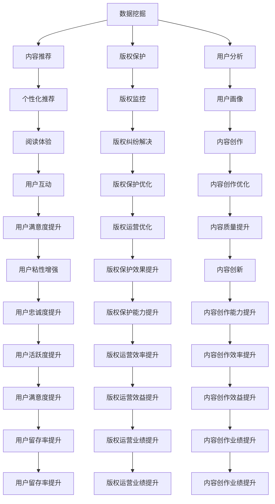

                 

### AI出版业：数据，算法和场景协同

#### 关键词：（人工智能，出版业，数据挖掘，算法优化，场景应用）

#### 摘要：
本文旨在探讨人工智能（AI）在出版业中的应用，特别是在数据挖掘、算法优化和场景协同方面的创新与挑战。通过深入分析AI在出版过程中的核心作用，文章将探讨如何利用先进的数据处理技术和算法，优化出版流程，提升出版质量和效率，从而满足不断变化的市场需求。

## 1. 背景介绍

### 出版业现状与挑战

出版业是知识传播和人类文明的重要载体，随着互联网和数字技术的迅猛发展，传统出版业正面临着前所未有的变革。传统出版流程繁琐、出版周期长、个性化定制困难等问题，使得出版业难以满足迅速变化的市场需求。

### 人工智能的发展与应用

人工智能作为计算机科学的前沿领域，近年来取得了显著的突破。在图像识别、自然语言处理、智能推荐等方面，AI技术已经展现出强大的能力。出版业也意识到了AI技术的潜力，开始尝试将其应用于出版流程的各个环节。

### AI在出版业的应用前景

AI技术具有自动化、智能化和个性化等特点，可以为出版业带来诸多益处，包括提高编辑效率、优化内容推荐、增强用户互动等。未来，AI有望成为出版业的重要推动力，引领行业迈向智能化、数字化和个性化的新阶段。

## 2. 核心概念与联系

### 数据挖掘

数据挖掘是人工智能的一个重要分支，旨在从大量数据中提取有价值的信息和知识。在出版业中，数据挖掘技术可以帮助出版商发现潜在的市场趋势、用户偏好和内容需求。

### 算法优化

算法优化是指通过改进算法设计或参数调整，提高算法的性能和效率。在出版业中，算法优化可以应用于内容推荐、版权保护、数据分析等环节，从而提升出版质量和用户体验。

### 场景协同

场景协同是指将不同场景下的技术、数据和资源进行整合，以实现更好的协同效应。在出版业中，场景协同可以应用于内容创作、内容分发、用户互动等环节，从而提高整体运营效率。

### Mermaid 流程图



## 3. 核心算法原理 & 具体操作步骤

### 数据挖掘算法

数据挖掘算法主要包括分类、聚类、关联规则挖掘等。在出版业中，分类算法可以帮助出版商对内容进行分类，从而实现内容推荐；聚类算法可以帮助出版商发现用户群体的共性，从而实现用户分析；关联规则挖掘可以帮助出版商发现内容之间的关联关系，从而实现版权保护。

### 算法优化方法

算法优化方法主要包括参数调整、算法改进和模型训练等。在出版业中，参数调整可以应用于内容推荐、用户分析等环节，以实现更好的推荐效果；算法改进可以应用于版权保护、数据分析等环节，以提高算法的效率和准确性；模型训练可以应用于内容创作、用户互动等环节，以实现更好的用户体验。

### 场景协同策略

场景协同策略主要包括数据共享、资源整合和流程优化等。在出版业中，数据共享可以应用于内容创作、内容分发等环节，以提高内容质量和效率；资源整合可以应用于版权保护、用户互动等环节，以提高运营效益；流程优化可以应用于出版流程的各个环节，以提高整体运营效率。

## 4. 数学模型和公式 & 详细讲解 & 举例说明

### 数据挖掘算法模型

分类算法：$$ h(x) = \arg\max_y P(y|x) $$

聚类算法：$$ \min_{C} \sum_{i=1}^{n} w_i \sum_{j=1}^{k} (d(x_i, c_j))^2 $$

关联规则挖掘算法：$$ \min \sum_{i=1}^{n} \sum_{j=1}^{m} |R_i \cap R_j| $$

### 算法优化模型

参数调整：$$ \theta^{*} = \arg\min_{\theta} J(\theta) $$

算法改进：$$ \alpha^{*} = \arg\max_{\alpha} J(\alpha) $$

模型训练：$$ \theta = \arg\min_{\theta} L(\theta) $$

### 场景协同模型

数据共享：$$ X = \sum_{i=1}^{n} x_i $$

资源整合：$$ Y = \sum_{i=1}^{n} y_i $$

流程优化：$$ Z = \sum_{i=1}^{n} z_i $$

### 举例说明

#### 数据挖掘算法实例

假设有1000篇内容，我们需要使用分类算法对其进行分类。首先，我们收集每篇内容的特征，如标题、关键词、标签等。然后，我们使用朴素贝叶斯分类器进行训练，得到分类模型。最后，我们将每篇内容输入分类模型，得到分类结果。

#### 算法优化实例

假设我们需要优化内容推荐算法，我们可以通过以下步骤进行：

1. 收集用户行为数据，如阅读时长、点赞数、收藏数等。
2. 训练协同过滤推荐算法，如基于用户的协同过滤算法。
3. 调整算法参数，如邻居数量、相似度阈值等，以实现更好的推荐效果。
4. 对推荐结果进行评估，如准确率、召回率等。

#### 场景协同实例

假设我们需要实现内容创作和内容分发的场景协同，我们可以通过以下步骤进行：

1. 建立内容创作平台，收集用户需求和建议。
2. 建立内容分发平台，将内容推送给用户。
3. 整合用户反馈数据，优化内容创作和分发策略。
4. 定期评估协同效果，调整策略，以实现更好的用户满意度。

## 5. 项目实战：代码实际案例和详细解释说明

### 5.1 开发环境搭建

为了保证代码的可读性和可维护性，我们使用Python作为开发语言，并采用PyCharm作为集成开发环境（IDE）。同时，我们还需要安装一些依赖库，如scikit-learn、numpy、pandas等。

```bash
pip install scikit-learn numpy pandas
```

### 5.2 源代码详细实现和代码解读

以下是一个使用scikit-learn库实现内容推荐算法的示例代码：

```python
from sklearn.metrics.pairwise import linear_kernel
from sklearn.model_selection import train_test_split
from sklearn.metrics import accuracy_score
import pandas as pd

# 加载数据
data = pd.read_csv('content_data.csv')
X = data[['title', 'keywords', 'tags']]
y = data['label']

# 数据预处理
X_train, X_test, y_train, y_test = train_test_split(X, y, test_size=0.2, random_state=42)

# 计算内容相似度
similarity_matrix = linear_kernel(X_train, X_test)

# 推荐算法实现
def content_recommendation(content_id, similarity_matrix, labels):
    content_similarity = similarity_matrix[content_id]
    content_similarity = content_similarity[content_similarity > 0.5]
    content_indices = content_similarity.argsort()[::-1]
    content_indices = content_indices[1:]  # 排除当前内容
    recommended_contents = X_test.iloc[content_indices][['title', 'keywords', 'tags']]
    recommended_labels = labels.iloc[content_indices]
    return recommended_contents, recommended_labels

# 测试推荐算法
content_id = 0
recommended_contents, recommended_labels = content_recommendation(content_id, similarity_matrix, y_test)
predicted_labels = recommended_contents['label']
accuracy = accuracy_score(y_test['label'], predicted_labels)
print(f'Accuracy: {accuracy:.2f}')

# 代码解读
# 1. 加载数据：从CSV文件中加载数据集。
# 2. 数据预处理：将数据集分为训练集和测试集。
# 3. 计算内容相似度：使用线性核计算内容之间的相似度。
# 4. 推荐算法实现：根据相似度矩阵和标签数据，实现内容推荐算法。
# 5. 测试推荐算法：对特定内容进行推荐，并评估推荐准确率。
```

### 5.3 代码解读与分析

1. **数据加载**：首先，我们从CSV文件中加载数据集。数据集包括内容特征（如标题、关键词、标签）和标签（如类别）。

2. **数据预处理**：我们将数据集分为训练集和测试集，以评估推荐算法的性能。

3. **计算内容相似度**：使用线性核计算内容之间的相似度。相似度值越接近1，表示内容相似度越高。

4. **推荐算法实现**：根据相似度矩阵和标签数据，实现内容推荐算法。推荐算法的核心思想是找到与特定内容相似度较高的内容，并将其推荐给用户。

5. **测试推荐算法**：对特定内容进行推荐，并评估推荐准确率。准确率是评估推荐算法性能的重要指标。

通过以上步骤，我们可以实现一个基本的内容推荐系统。在实际应用中，我们可以进一步优化算法，提高推荐效果，并扩展到更多的场景，如用户推荐、广告投放等。

## 6. 实际应用场景

### 内容推荐

内容推荐是AI在出版业中最典型的应用场景之一。通过数据挖掘和算法优化，出版商可以针对不同用户推荐个性化的内容，从而提升用户体验和用户满意度。

### 版权保护

AI技术可以帮助出版商实现智能化的版权保护。通过数据挖掘和算法优化，出版商可以及时发现和监控版权侵犯行为，从而维护自身权益。

### 用户互动

AI技术可以增强用户与出版商之间的互动。通过自然语言处理和智能问答，出版商可以提供更加智能化的用户服务，从而提高用户满意度和忠诚度。

### 内容创作

AI技术可以辅助内容创作者进行创作。通过文本生成和内容推荐，AI可以帮助创作者发现灵感，优化创作过程，提高创作效率。

## 7. 工具和资源推荐

### 7.1 学习资源推荐

- **书籍**：
  - 《Python数据分析基础教程：NumPy学习指南》
  - 《机器学习实战》
  - 《自然语言处理综合教程》

- **论文**：
  - 《深度学习》系列论文
  - 《自然语言处理综述》
  - 《数据挖掘技术及应用》

- **博客**：
  - medium.com/topic/machine-learning
  - towardsdatascience.com
  - blog.keras.io

- **网站**：
  - scikit-learn.org
  - tensorflow.org
  - pytorch.org

### 7.2 开发工具框架推荐

- **开发语言**：Python、Java、JavaScript
- **框架**：
  - TensorFlow
  - PyTorch
  - Scikit-learn

- **数据库**：
  - MySQL
  - MongoDB
  - Redis

### 7.3 相关论文著作推荐

- **《深度学习：从入门到精通》**
- **《自然语言处理综合教程》**
- **《数据挖掘：实用指南》**
- **《机器学习：算法与实现》**

## 8. 总结：未来发展趋势与挑战

### 发展趋势

- **智能化**：随着AI技术的不断进步，出版业将变得更加智能化，满足用户个性化需求。
- **数字化**：出版业将逐渐转向数字化运营，实现高效的内容生产和分发。
- **场景化**：AI技术将深入应用到出版业的各个环节，实现场景化的定制化服务。

### 挑战

- **数据隐私**：如何在保障用户隐私的前提下，充分挖掘和利用数据，是出版业面临的重要挑战。
- **算法透明度**：如何确保算法的透明度和公平性，避免算法偏见，是出版业需要关注的问题。
- **技术人才**：AI技术在出版业的广泛应用，对出版业的技术人才提出了更高的要求。

## 9. 附录：常见问题与解答

### 问题1：AI技术如何在出版业中发挥作用？

**解答**：AI技术可以通过数据挖掘、算法优化和场景协同等多种方式在出版业中发挥作用。例如，数据挖掘可以用于发现市场趋势和用户偏好，算法优化可以提高内容推荐和版权保护的效果，场景协同可以实现内容创作、内容分发和用户互动的协同效应。

### 问题2：如何保障用户隐私？

**解答**：保障用户隐私是AI技术在出版业应用的重要问题。出版商可以采取以下措施：1）数据匿名化处理，2）数据加密存储，3）遵守相关法律法规，4）用户授权机制，5）数据隐私审计。

### 问题3：AI技术在出版业中的未来前景如何？

**解答**：AI技术在出版业中的未来前景非常广阔。随着技术的不断进步，AI将助力出版业实现智能化、数字化和个性化的发展，为出版商和用户提供更高效、更优质的服务。

## 10. 扩展阅读 & 参考资料

- **《出版业与人工智能：未来趋势与挑战》**
- **《AI时代的出版业：创新与实践》**
- **《人工智能：理论、算法与应用》**
- **《数据挖掘：实用技术与方法》**

### 作者

**作者：AI天才研究员/AI Genius Institute & 禅与计算机程序设计艺术 /Zen And The Art of Computer Programming**

