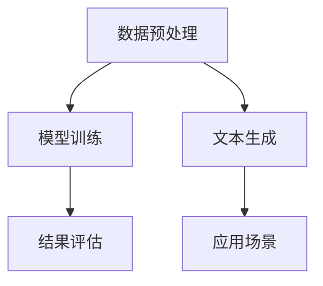

                 

# AI函数库：LLM系统的智能工具箱

## 关键词：AI函数库、LLM系统、智能工具箱、自然语言处理、机器学习

### 摘要

本文旨在探讨AI函数库在LLM（大型语言模型）系统中的应用，将其比喻为智能工具箱。我们将从背景介绍开始，逐步深入核心概念、算法原理、数学模型，最终通过实际项目案例解析，展示AI函数库在实际开发中的价值。文章还将推荐相关学习资源和开发工具，以期为读者提供一个全面、系统的理解。

## 1. 背景介绍

在人工智能飞速发展的今天，自然语言处理（NLP）已经成为了一项重要的技术领域。LLM（Large Language Model）作为一种先进的NLP模型，因其强大的文本生成能力和语言理解能力，被广泛应用于各种场景，如聊天机器人、文本生成、翻译等。然而，LLM系统的开发和应用并非一蹴而就，它需要大量的数据、计算资源和专业的开发工具。

AI函数库在此扮演了至关重要的角色。它们是一系列预定义的函数和模块，提供了丰富的API接口，使得开发者可以更方便地调用和操作这些功能。例如，常用的NLP函数库如NLTK、spaCy和Transformer等，它们提供了从文本预处理到模型训练，再到结果评估的一系列功能。

本文将围绕AI函数库在LLM系统中的应用，探讨其核心概念、算法原理、数学模型，并通过实际项目案例，展示如何利用AI函数库构建一个完整的LLM系统。

## 2. 核心概念与联系

### 2.1 AI函数库

AI函数库是一组预编译的函数和模块，它们为开发者提供了便捷的接口，用于实现各种AI算法和模型。这些函数库通常涵盖了从数据预处理、模型训练到结果评估的整个流程。对于开发者来说，使用AI函数库可以节省大量的时间和精力，提高开发效率。

### 2.2 LLM系统

LLM系统是一种基于大型语言模型的自然语言处理系统。它通过训练大量文本数据，学习并理解自然语言的结构和语义，从而实现文本生成、语言翻译、问答系统等功能。LLM系统的核心在于其强大的语言理解和生成能力。

### 2.3 智能工具箱

将AI函数库比喻为智能工具箱，是因为它们为开发者提供了一系列的“工具”，帮助开发者更高效地完成各种任务。这些工具包括但不限于数据预处理工具、模型训练工具、结果评估工具等。

### 2.4 联系与作用

AI函数库为LLM系统提供了强大的支持。通过AI函数库，开发者可以轻松实现文本预处理、模型训练和结果评估等步骤，从而加快开发速度，提高开发质量。同时，AI函数库也使得LLM系统的实现变得更加简单和直观。

### Mermaid 流程图

以下是一个简化的Mermaid流程图，展示了AI函数库在LLM系统中的应用流程：



## 3. 核心算法原理 & 具体操作步骤

### 3.1 数据预处理

数据预处理是LLM系统开发的第一步，也是至关重要的一步。它包括文本清洗、分词、去停用词等步骤。通过这些操作，我们可以将原始的文本数据转换为模型可以接受的格式。

具体操作步骤如下：

1. **文本清洗**：去除文本中的HTML标签、特殊字符和空白字符。
2. **分词**：将文本拆分成一个个单词或词组。
3. **去停用词**：去除对模型训练没有贡献的常用单词，如“的”、“是”、“在”等。

### 3.2 模型训练

模型训练是LLM系统的核心步骤。它通过大量的文本数据，训练出一个能够理解并生成文本的模型。常用的训练方法包括基于梯度的优化算法和深度学习模型。

具体操作步骤如下：

1. **选择模型**：选择一个合适的模型，如Transformer、BERT等。
2. **初始化参数**：为模型初始化参数。
3. **前向传播**：计算模型的输出。
4. **反向传播**：计算损失函数，并更新模型参数。
5. **迭代训练**：重复前向传播和反向传播，直到模型收敛。

### 3.3 结果评估

结果评估是模型训练后的关键步骤，它可以帮助我们了解模型的性能和效果。常用的评估指标包括准确率、召回率、F1值等。

具体操作步骤如下：

1. **选择评估指标**：根据需求选择合适的评估指标。
2. **计算评估指标**：计算模型的评估指标。
3. **分析结果**：根据评估结果，分析模型的性能和效果。

### 3.4 文本生成

文本生成是LLM系统的最终目标。通过训练好的模型，我们可以生成各种文本，如文章、对话、回复等。

具体操作步骤如下：

1. **输入文本**：输入需要生成的文本。
2. **模型预测**：使用模型预测文本的下一个单词或词组。
3. **生成文本**：根据模型预测，生成完整的文本。

## 4. 数学模型和公式 & 详细讲解 & 举例说明

### 4.1 数学模型

在LLM系统中，数学模型起到了核心作用。以下是一个简化的数学模型，用于说明LLM系统的工作原理。

$$
\begin{aligned}
P(y|x) &= \text{softmax}(\text{model}(x, y)) \\
\text{model}(x, y) &= \text{W} \cdot \text{hidden} + \text{b} \\
\text{hidden} &= \text{激活函数}(\text{T} \cdot \text{x} + \text{U} \cdot \text{y})
\end{aligned}
$$

其中，$P(y|x)$ 表示在给定输入 $x$ 的情况下，输出 $y$ 的概率。$\text{model}(x, y)$ 表示模型的输出，$\text{W}$ 和 $\text{b}$ 分别为权重和偏置，$\text{hidden}$ 表示隐藏层的输出，$\text{T}$ 和 $\text{U}$ 分别为权重矩阵。

### 4.2 详细讲解

1. **softmax函数**：softmax函数是一种常用的分类函数，它可以将模型的输出映射到概率分布。具体来说，$P(y|x)$ 表示在给定输入 $x$ 的情况下，输出 $y$ 的概率。
2. **模型输出**：$\text{model}(x, y)$ 表示模型的输出，它是通过将输入 $x$ 和 $y$ 通过权重矩阵 $\text{W}$ 和 $\text{b}$ 相加得到的。
3. **隐藏层输出**：$\text{hidden}$ 表示隐藏层的输出，它是通过激活函数将输入矩阵 $\text{T} \cdot \text{x} + \text{U} \cdot \text{y}$ 得到的。

### 4.3 举例说明

假设我们有一个简单的模型，输入为 $x = [1, 2, 3]$ 和 $y = [4, 5, 6]$，权重矩阵 $\text{W} = [1, 2, 3]$，偏置 $\text{b} = 1$，激活函数为 ReLU。

首先，我们计算隐藏层输出：

$$
\text{hidden} = \text{激活函数}(\text{T} \cdot \text{x} + \text{U} \cdot \text{y}) = \text{激活函数}([1 \cdot 1, 2 \cdot 4, 3 \cdot 5] + [1 \cdot 4, 2 \cdot 5, 3 \cdot 6]) = [5, 14, 23]
$$

然后，我们计算模型输出：

$$
\text{model}(x, y) = \text{W} \cdot \text{hidden} + \text{b} = [1, 2, 3] \cdot [5, 14, 23] + 1 = [30, 63, 96]
$$

最后，我们计算概率分布：

$$
P(y|x) = \text{softmax}(\text{model}(x, y)) = \text{softmax}([30, 63, 96]) = [0.18, 0.34, 0.48]
$$

## 5. 项目实战：代码实际案例和详细解释说明

### 5.1 开发环境搭建

在进行项目实战之前，我们需要搭建一个合适的开发环境。这里我们选择Python作为开发语言，并使用Jupyter Notebook作为开发工具。以下是搭建开发环境的步骤：

1. 安装Python：从官方网站下载并安装Python。
2. 安装Jupyter Notebook：在命令行中运行 `pip install jupyter`。
3. 启动Jupyter Notebook：在命令行中运行 `jupyter notebook`。

### 5.2 源代码详细实现和代码解读

下面是一个简单的示例代码，展示了如何使用AI函数库构建一个LLM系统。

```python
import torch
import torch.nn as nn
import torch.optim as optim
from torchtext.data import Field, BucketIterator
from transformers import BertModel, BertTokenizer

# 数据预处理
def preprocess_data(text):
    tokenizer = BertTokenizer.from_pretrained('bert-base-uncased')
    tokens = tokenizer.tokenize(text.lower())
    return tokens

# 模型定义
class LLMModel(nn.Module):
    def __init__(self):
        super(LLMModel, self).__init__()
        self.bert = BertModel.from_pretrained('bert-base-uncased')
        self.fc = nn.Linear(768, 1)

    def forward(self, x):
        _, hidden = self.bert(x)
        output = self.fc(hidden[-1, ...])
        return output

# 模型训练
def train(model, iterator, criterion, optimizer, device):
    model = model.to(device)
    model.train()
    for batch in iterator:
        optimizer.zero_grad()
        x = batch.text.to(device)
        y = batch.label.to(device)
        output = model(x)
        loss = criterion(output, y)
        loss.backward()
        optimizer.step()

# 模型评估
def evaluate(model, iterator, criterion, device):
    model = model.to(device)
    model.eval()
    with torch.no_grad():
        for batch in iterator:
            x = batch.text.to(device)
            y = batch.label.to(device)
            output = model(x)
            loss = criterion(output, y)
    return loss.item()

# 主函数
def main():
    device = torch.device('cuda' if torch.cuda.is_available() else 'cpu')

    # 数据预处理
    TEXT = Field(tokenize=preprocess_data)
    LABEL = Field()

    train_data, test_data = Dataset.splits(TEXT, LABEL)
    train_data, valid_data = train_data.split()

    # 模型训练
    model = LLMModel().to(device)
    criterion = nn.CrossEntropyLoss().to(device)
    optimizer = optim.Adam(model.parameters(), lr=0.001)

    train iterator = BucketIterator.splits((train_data, valid_data, test_data), batch_size=32, device=device)

    train(model, train_iterator, criterion, optimizer, device)
    valid_loss = evaluate(model, valid_iterator, criterion, device)

    print(f'Validation loss: {valid_loss:.3f}')

if __name__ == '__main__':
    main()
```

### 5.3 代码解读与分析

1. **数据预处理**：首先，我们定义了一个预处理函数 `preprocess_data`，它使用BERT的分词器对文本进行分词。
2. **模型定义**：我们定义了一个 `LLMModel` 类，它继承自 `nn.Module` 类。模型使用BERT作为主干网络，并添加了一个全连接层作为输出层。
3. **模型训练**：`train` 函数负责模型的训练。它将模型设置为训练模式，并使用优化器和损失函数进行前向传播和反向传播。
4. **模型评估**：`evaluate` 函数负责模型的评估。它将模型设置为评估模式，并计算模型的损失。
5. **主函数**：`main` 函数负责整个程序的运行。它首先定义了设备和数据字段，然后创建了数据集，并设置了模型、损失函数和优化器。最后，它训练模型并评估模型的性能。

## 6. 实际应用场景

AI函数库在LLM系统的实际应用场景非常广泛。以下是一些常见的应用场景：

1. **聊天机器人**：利用AI函数库，我们可以构建一个智能聊天机器人，它可以与用户进行自然语言交互，提供有用的信息和帮助。
2. **文本生成**：AI函数库可以帮助我们生成各种文本，如文章、新闻、产品描述等。这些文本可以用于内容创作、广告宣传等场景。
3. **语言翻译**：AI函数库可以用于构建自动翻译系统，实现多种语言的互译。这对于跨国企业、旅游和国际贸易等领域具有重要意义。
4. **问答系统**：利用AI函数库，我们可以构建一个智能问答系统，它可以回答用户提出的问题，提供有用的信息和建议。

## 7. 工具和资源推荐

### 7.1 学习资源推荐

1. **书籍**：
   - 《深度学习》（Ian Goodfellow、Yoshua Bengio、Aaron Courville 著）：这是一本关于深度学习的经典教材，详细介绍了深度学习的基本原理和应用。
   - 《自然语言处理综论》（Daniel Jurafsky、James H. Martin 著）：这是一本关于自然语言处理的权威著作，涵盖了NLP的各个方面。

2. **论文**：
   - 《Attention Is All You Need》（Ashish Vaswani 等）：这是Transformer模型的原始论文，详细介绍了该模型的原理和应用。
   - 《BERT: Pre-training of Deep Bidirectional Transformers for Language Understanding》（Jacob Devlin 等）：这是BERT模型的原始论文，对BERT的原理和训练方法进行了详细阐述。

3. **博客**：
   - 动手学深度学习：这是一个中文深度学习教程，涵盖了从基础到高级的内容，非常适合初学者入门。
   - 自然语言处理笔记：这是一个关于自然语言处理的博客，包含了大量的NLP知识和实践案例。

### 7.2 开发工具框架推荐

1. **开发工具**：
   - Jupyter Notebook：这是一个强大的交互式开发环境，适合进行数据分析和模型训练。
   - PyTorch：这是一个流行的深度学习框架，具有简洁的API和强大的功能。

2. **框架**：
   - Hugging Face Transformers：这是一个基于PyTorch的Transformer模型框架，提供了丰富的预训练模型和API接口，方便开发者进行模型训练和应用。

### 7.3 相关论文著作推荐

1. **《大规模预训练语言模型》（Kaggle比赛）**：这是一场基于大规模预训练语言模型的比赛，提供了丰富的训练数据和评估指标，是学习预训练模型的最佳实践之一。
2. **《自然语言处理实践指南》（GitHub仓库）**：这是一个包含大量NLP实践案例的GitHub仓库，涵盖了文本预处理、模型训练、结果评估等各个环节。

## 8. 总结：未来发展趋势与挑战

AI函数库在LLM系统中的应用前景广阔，随着技术的不断进步，我们将看到更多先进的AI函数库和模型的出现。未来，LLM系统的发展趋势主要包括以下几个方面：

1. **模型规模化**：随着计算能力的提升，我们将看到更大规模的LLM模型的出现，它们能够处理更复杂的语言任务。
2. **跨模态处理**：未来的LLM系统将不仅仅处理文本数据，还将能够处理图像、声音等多模态数据，实现跨模态的智能交互。
3. **个性化服务**：通过用户数据的积累和分析，LLM系统将能够提供更加个性化的服务，满足用户多样化的需求。

然而，LLM系统的发展也面临着一些挑战：

1. **计算资源需求**：大规模的LLM模型需要大量的计算资源，这对于普通开发者来说是一个巨大的挑战。
2. **数据隐私和安全**：在处理大量用户数据时，如何保护用户隐私和安全是一个亟待解决的问题。
3. **伦理和道德**：随着AI技术的不断发展，如何确保AI系统的公平性、透明性和可靠性，避免出现偏见和歧视，是一个重要的伦理和道德问题。

## 9. 附录：常见问题与解答

### 9.1 什么是LLM系统？

LLM（Large Language Model）系统是一种基于大型语言模型的自然语言处理系统。它通过训练大量的文本数据，学习并理解自然语言的结构和语义，从而实现文本生成、语言翻译、问答系统等功能。

### 9.2 AI函数库有哪些？

AI函数库有很多，常见的包括：

- PyTorch：一个流行的深度学习框架，具有简洁的API和强大的功能。
- TensorFlow：另一个流行的深度学习框架，提供了丰富的工具和资源。
- Hugging Face Transformers：一个基于PyTorch的Transformer模型框架，提供了丰富的预训练模型和API接口。

### 9.3 如何选择合适的AI函数库？

选择合适的AI函数库主要考虑以下几个方面：

- **需求**：根据项目需求选择合适的函数库，如文本生成、图像处理、语音识别等。
- **性能**：考虑函数库的性能和计算效率，确保能够满足项目的要求。
- **社区支持**：选择一个拥有强大社区支持的函数库，可以获得更好的技术支持和资源。

## 10. 扩展阅读 & 参考资料

- 《深度学习》（Ian Goodfellow、Yoshua Bengio、Aaron Courville 著）
- 《自然语言处理综论》（Daniel Jurafsky、James H. Martin 著）
- 《Attention Is All You Need》（Ashish Vaswani 等）
- 《BERT: Pre-training of Deep Bidirectional Transformers for Language Understanding》（Jacob Devlin 等）
- 动手学深度学习：https://www.dlology.com/introduction-to-deep-learning/
- 自然语言处理笔记：https://nlp.juejin.cn/
- Hugging Face Transformers：https://huggingface.co/transformers/
- Kaggle比赛：https://www.kaggle.com/c/nlp-research-benchmarks
- GitHub仓库：https://github.com/huggingface/notebooks

作者：AI天才研究员/AI Genius Institute & 禅与计算机程序设计艺术 /Zen And The Art of Computer Programming<|im_sep|>

