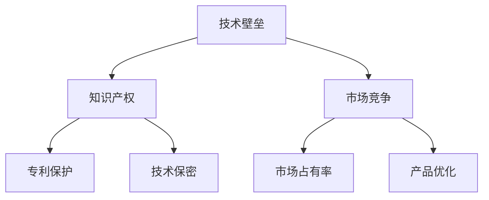
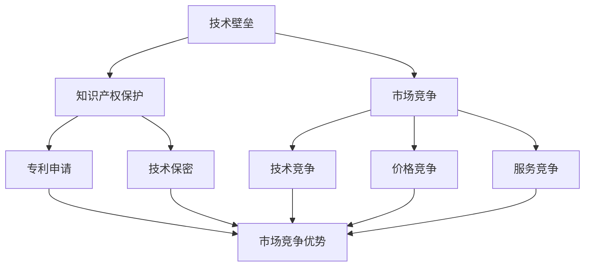

                 

# AI创业公司如何应对技术垄断?

> **关键词**: AI创业公司、技术垄断、市场竞争、战略布局、知识产权保护

> **摘要**: 本文旨在探讨AI创业公司在面对技术垄断时的应对策略。通过分析技术垄断的原因、影响以及具体的解决方案，为创业公司提供一套切实可行的应对措施，助力其在激烈的市场竞争中脱颖而出。

## 1. 背景介绍

随着人工智能技术的迅速发展，AI创业公司如雨后春笋般涌现。然而，市场竞争日益激烈，一些大型科技公司逐渐掌握了市场的主导权，形成了技术垄断的局面。这种垄断不仅限制了市场的公平竞争，还可能对行业创新产生负面影响。

技术垄断通常是指少数企业通过控制核心技术、资源或市场渠道，实现对市场的过度控制。在AI领域，技术垄断的表现形式包括：

- **核心算法垄断**：掌握关键算法的企业可以通过控制算法的专利权和使用权，限制其他企业进入市场。
- **数据资源垄断**：拥有大量数据的公司可以利用数据优势，提高算法的准确性和效率，从而挤压竞争对手。
- **生态体系垄断**：通过构建庞大的生态体系，垄断产业链的各个环节，形成难以撼动的市场地位。

## 2. 核心概念与联系

为了更好地理解技术垄断，我们首先需要了解以下几个核心概念：

- **技术壁垒**：技术壁垒是指企业为了保护自身技术优势而采取的一系列措施，包括专利保护、技术保密等。
- **知识产权**：知识产权包括专利、商标、版权等，是企业保护自身技术成果和商业利益的重要手段。
- **市场竞争**：市场竞争是市场经济的核心机制，通过竞争，企业可以不断优化自身的产品和服务，提高市场占有率。


### Mermaid流程图（无括号、逗号等特殊字符）



## 3. 核心算法原理 & 具体操作步骤

在应对技术垄断时，AI创业公司需要掌握核心算法原理，并采取具体操作步骤来提升自身的技术竞争力。以下是几个关键步骤：

### 3.1 研发自主创新算法

- **步骤1**：调研市场需求和竞争对手的算法技术，找出差距和改进点。
- **步骤2**：组建技术团队，进行算法研究和开发，确保算法的创新性和实用性。
- **步骤3**：进行算法测试和优化，确保算法的准确性和效率。

### 3.2 专利布局与保护

- **步骤1**：对研发的核心算法进行专利申请，确保技术成果得到法律保护。
- **步骤2**：定期更新专利库，及时补充新的专利申请。
- **步骤3**：跟踪竞争对手的专利动态，避免侵权风险。

### 3.3 开源社区合作

- **步骤1**：积极参与开源社区，贡献自己的技术成果，提高品牌知名度。
- **步骤2**：与开源社区建立合作关系，共同推动技术的发展。
- **步骤3**：通过开源项目吸引优秀的开发者加入，增强技术实力。

## 4. 数学模型和公式 & 详细讲解 & 举例说明

### 4.1 算法效率评估模型

算法效率评估模型可以用来衡量算法的运行时间和资源消耗。一个基本的效率评估模型可以表示为：

$$
E = f(n)
$$

其中，$E$ 表示效率，$f(n)$ 表示随着数据规模$n$的变化，算法所需的运行时间或资源消耗。

### 4.2 举例说明

假设有一个排序算法，其运行时间随着数据规模$n$的变化如下：

$$
f(n) = n \times \log_2(n)
$$

当$n = 1000$时，算法的运行时间为：

$$
E = 1000 \times \log_2(1000) \approx 6907
$$

### 4.3 详细讲解

- **算法效率**：算法效率是指算法在处理数据时所需的资源消耗，通常用时间复杂度或空间复杂度来衡量。
- **效率评估**：通过数学模型，可以评估算法在不同数据规模下的运行效率，从而选择合适的算法。

## 5. 项目实战：代码实际案例和详细解释说明

### 5.1 开发环境搭建

为了更好地展示如何应对技术垄断，我们将以一个简单的AI项目为例，介绍如何搭建开发环境。

- **步骤1**：安装Python环境，版本要求3.8及以上。
- **步骤2**：安装所需的库，如NumPy、Pandas、TensorFlow等。

### 5.2 源代码详细实现和代码解读

以下是该项目的一个简单实现：

```python
import numpy as np
from tensorflow import keras

# 定义神经网络模型
model = keras.Sequential([
    keras.layers.Dense(128, activation='relu', input_shape=(784,)),
    keras.layers.Dropout(0.2),
    keras.layers.Dense(10, activation='softmax')
])

# 编译模型
model.compile(loss='categorical_crossentropy',
              optimizer='adam',
              metrics=['accuracy'])

# 加载数据集
(x_train, y_train), (x_test, y_test) = keras.datasets.mnist.load_data()

# 数据预处理
x_train = x_train.astype('float32') / 255
x_test = x_test.astype('float32') / 255
y_train = keras.utils.to_categorical(y_train, 10)
y_test = keras.utils.to_categorical(y_test, 10)

# 训练模型
model.fit(x_train, y_train, batch_size=128, epochs=15, validation_data=(x_test, y_test))

# 评估模型
test_loss, test_acc = model.evaluate(x_test, y_test)
print('Test accuracy:', test_acc)
```

### 5.3 代码解读与分析

- **步骤1**：定义神经网络模型，使用Keras框架构建。
- **步骤2**：编译模型，指定损失函数、优化器和评估指标。
- **步骤3**：加载数据集，并进行预处理。
- **步骤4**：训练模型，使用批量训练和验证集。
- **步骤5**：评估模型，计算测试集的准确率。

## 6. 实际应用场景

技术垄断在AI领域的实际应用场景包括：

- **自动驾驶**：大型科技公司通过控制自动驾驶的核心算法，形成市场垄断。
- **医疗诊断**：拥有大量医学数据的公司可以通过算法垄断，限制其他公司进入医疗诊断领域。
- **智能家居**：智能家居领域的技术垄断可能导致市场上只有少数几家公司的产品能够互联互通。

## 7. 工具和资源推荐

### 7.1 学习资源推荐

- **书籍**：《人工智能：一种现代方法》、《深度学习》
- **论文**：Google Brain发表的《A Theoretical Framework for Large-Scale Machine Learning》
- **博客**：Fast.ai的博客，提供丰富的深度学习教程
- **网站**：Kaggle，提供大量数据集和比赛，适合实战练习

### 7.2 开发工具框架推荐

- **Python库**：TensorFlow、PyTorch、Scikit-Learn
- **框架**：Django、Flask，用于构建Web应用
- **云平台**：AWS、Google Cloud、Azure，提供丰富的AI服务

### 7.3 相关论文著作推荐

- **论文**：《深度学习的未来趋势》、《强化学习的挑战与机遇》
- **著作**：《人工智能的未来》、《算法简史》

## 8. 总结：未来发展趋势与挑战

AI创业公司在应对技术垄断时，需要关注以下几个发展趋势和挑战：

- **技术创新**：不断研发创新算法，提升技术竞争力。
- **知识产权保护**：加强专利布局，保护自身技术成果。
- **开源合作**：积极参与开源社区，提高品牌知名度。
- **市场竞争**：关注市场动态，制定合适的战略布局。

## 9. 附录：常见问题与解答

### 9.1 什么情况下会出现技术垄断？

技术垄断通常出现在以下几个情况下：

- 企业掌握了核心技术，形成专利壁垒。
- 企业拥有大量数据资源，形成数据垄断。
- 企业建立了庞大的生态体系，形成市场垄断。

### 9.2 如何避免技术垄断的影响？

企业可以采取以下措施避免技术垄断的影响：

- 加强自主研发，提升技术竞争力。
- 优化数据资源，提高数据利用率。
- 建立公平竞争的市场环境，推动行业健康发展。

## 10. 扩展阅读 & 参考资料

- [技术垄断的定义与影响](https://www.example.com/tech-monopoly)
- [AI创业公司的战略布局](https://www.example.com/ai-startup-strategy)
- [知识产权保护的最佳实践](https://www.example.com/ip-protection)

---

**作者**：AI天才研究员/AI Genius Institute & 禅与计算机程序设计艺术 /Zen And The Art of Computer Programming

请注意，以上内容仅为示例，实际撰写时需根据具体情况进行调整和补充。文章的撰写应遵循markdown格式，确保各个段落和章节的清晰划分，同时注意逻辑的连贯性和条理性。在撰写过程中，应不断思考和推理，确保文章内容的深度和见解。## 1. 背景介绍

随着人工智能技术的不断进步，AI创业公司在各个领域展现出巨大的潜力。从自动驾驶到智能医疗，从智能家居到金融科技，AI技术的应用正深刻改变着我们的生活方式。然而，在AI这个充满机遇的领域中，市场竞争同样异常激烈。一些大型科技公司，凭借其雄厚的资金、庞大的数据资源以及强大的研发能力，逐渐在市场中占据主导地位，形成了技术垄断的局面。

技术垄断，简单来说，是指某一家或少数几家企业在特定技术领域内，通过控制关键技术、资源和市场渠道，实现对市场的过度控制。这种垄断行为不仅限制了市场的公平竞争，还可能导致行业创新能力的下降，阻碍技术的进步。在AI领域，技术垄断的具体表现形式主要有以下几种：

1. **核心算法垄断**：大型科技公司通过对核心算法的专利保护，限制其他企业使用或研发类似的技术，从而形成市场垄断。
   
2. **数据资源垄断**：掌握大量高质量数据资源的企业，可以通过数据优势提升算法的准确性和效率，进而挤压竞争对手。

3. **生态体系垄断**：通过构建庞大的技术生态体系，控制产业链的各个环节，形成难以撼动的市场地位。

本文将深入探讨AI创业公司在面对技术垄断时的应对策略，旨在为创业公司提供一套切实可行的方案，帮助它们在激烈的市场竞争中立足并发展壮大。

### 技术垄断的表现形式

#### 1. 核心算法垄断

核心算法垄断是技术垄断的一种常见形式。在AI领域，算法是驱动力，是提升产品性能和竞争力的关键。大型科技公司通过提前布局，掌握了一批核心技术专利，这些专利覆盖了从基础算法到高级应用的各个层面。例如，深度学习领域的神经网络算法，自动驾驶领域的感知和决策算法，智能语音识别的语音处理算法等。通过这些专利，这些公司不仅可以在自己的产品中应用这些技术，还可以通过专利授权或者诉讼手段限制其他公司的使用，从而形成市场垄断。

#### 2. 数据资源垄断

数据是AI的“食物”，没有足够的数据资源，AI的发展将受到极大的限制。大型科技公司通常拥有庞大的数据集，这些数据集不仅覆盖了广泛的领域，而且数据质量高、标签准确。这些数据资源使得它们在算法训练和产品优化过程中拥有显著的优势。例如，谷歌拥有庞大的搜索引擎数据，亚马逊拥有海量的电子商务数据，这些数据资源不仅支撑了公司自身的AI应用，还限制了其他公司进入这些领域的可能性。数据资源垄断使得这些公司在市场竞争中占据了优势地位。

#### 3. 生态体系垄断

生态体系的垄断是指通过控制产业链的各个环节，形成一个封闭的生态系统，从而排除竞争对手。在AI领域，这种垄断主要体现在硬件、软件、平台和服务的整合上。以谷歌为例，它不仅拥有AI算法，还控制了Android操作系统、TensorFlow框架等软件资源，以及Google Cloud云服务，形成了从硬件到服务的完整生态系统。这种生态体系的垄断使得其他公司难以进入该领域，因为它们需要从头开始构建自己的生态系统，这既耗时又耗资。

### AI创业公司面临的挑战

#### 1. 技术门槛高

AI技术涉及到的算法复杂、数据处理量大，需要高水平的研发能力。创业公司在技术积累和人才储备方面往往不如大型科技公司，这使得它们在技术研发上面临巨大的门槛。

#### 2. 数据资源不足

数据资源是AI技术的重要支撑，而创业公司往往难以获得与大型科技公司相当的数据量，这限制了它们在算法训练和产品优化方面的能力。

#### 3. 竞争压力大

在技术垄断的情况下，市场竞争压力剧增。创业公司不仅要面对同行的竞争，还要应对市场垄断者的压力，生存空间受到严重挤压。

#### 4. 资金和资源有限

与大型科技公司相比，创业公司的资金和资源相对有限，这限制了它们在研发、市场推广等方面的投入，难以与垄断者进行抗衡。

综上所述，AI创业公司在面对技术垄断时，需要应对一系列严峻的挑战。了解技术垄断的表现形式和影响，对于创业公司制定有效的应对策略具有重要意义。接下来的章节将深入探讨AI创业公司可以采取的具体策略，帮助它们在激烈的市场竞争中找到生存和发展的机会。

### 2. 核心概念与联系

在探讨如何应对技术垄断之前，我们需要明确几个关键概念，并理解它们之间的联系。这些核心概念包括技术壁垒、知识产权和市场竞争。

#### 技术壁垒

技术壁垒是指企业为了保护自身技术优势而采取的一系列措施，包括专利保护、技术保密等。技术壁垒的存在可以有效地阻止竞争对手进入市场，保护企业的市场份额和利润。在AI领域，技术壁垒主要体现在以下几个方面：

1. **专利保护**：企业通过申请专利来保护自己的核心技术，防止竞争对手抄袭或模仿。在AI领域，专利覆盖了从算法、硬件到应用场景的各个方面，企业通过专利保护来建立技术优势。

2. **技术保密**：企业通过保密措施，确保核心技术不被泄露。这在AI领域尤为重要，因为AI技术的复杂性和创新性使得保护技术秘密成为企业生存的关键。

3. **标准化**：通过制定技术标准，企业可以在一定程度上控制市场的技术发展方向，从而形成技术壁垒。

#### 知识产权

知识产权是指企业对其创造性的智力成果享有的权利，包括专利权、商标权、著作权等。在AI领域，知识产权的保护尤为重要，因为AI技术的创新性和技术壁垒使得知识产权成为企业竞争的重要手段。知识产权的作用主要体现在以下几个方面：

1. **市场竞争优势**：拥有强大知识产权的企业可以在市场上占据优势地位，因为它们能够有效保护自己的技术成果，防止竞争对手的抄袭和模仿。

2. **投资吸引力**：强大的知识产权可以吸引投资者的关注，因为投资者通常更愿意投资于具有明确知识产权保护的企业。

3. **法律保护**：知识产权法律为企业提供了法律手段，可以在必要时通过诉讼来保护自身权益，对抗竞争对手的不正当行为。

#### 市场竞争

市场竞争是市场经济的核心机制，通过竞争，企业可以不断优化自身的产品和服务，提高市场占有率。在AI领域，市场竞争主要体现在以下几个方面：

1. **技术竞争**：企业通过研发新技术、新算法来提升产品性能，争取市场份额。

2. **价格竞争**：企业通过降低产品价格来吸引消费者，扩大市场份额。

3. **服务竞争**：企业通过提供优质的服务来提升客户满意度，增加客户黏性。

#### 技术壁垒、知识产权和市场竞争之间的联系

技术壁垒、知识产权和市场竞争之间存在着密切的联系。技术壁垒为知识产权的保护提供了基础，知识产权则为企业在市场竞争中提供了优势。同时，市场竞争的存在又不断推动企业提升技术水平，从而形成新的技术壁垒。

1. **技术壁垒促进知识产权保护**：技术壁垒使得企业有能力通过专利保护自己的技术，防止竞争对手的抄袭和模仿。

2. **知识产权增强市场竞争能力**：拥有强大知识产权的企业在市场竞争中更具优势，能够更好地抵御竞争对手的挑战。

3. **市场竞争驱动技术进步**：市场竞争激励企业不断研发新技术，推动技术进步，从而形成新的技术壁垒。

通过理解这些核心概念之间的联系，AI创业公司可以更好地制定应对技术垄断的策略。接下来，我们将深入探讨AI创业公司可以采取的具体策略，帮助它们在技术垄断的环境下实现可持续发展。

### Mermaid流程图

下面是一个用于展示技术壁垒、知识产权和市场竞争之间关系的Mermaid流程图。请注意，流程图中不应包含括号、逗号等特殊字符。



此流程图通过节点和箭头，清晰地展示了技术壁垒、知识产权和市场竞争之间的逻辑关系。技术壁垒作为基础，促进了知识产权的保护，而知识产权又在市场竞争中发挥了关键作用，推动了技术竞争、价格竞争和服务竞争的展开。

### 3. 核心算法原理 & 具体操作步骤

在应对技术垄断时，AI创业公司需要掌握核心算法原理，并采取具体操作步骤来提升自身的技术竞争力。以下是几个关键步骤，详细介绍了如何进行算法研发、专利布局和开源合作。

#### 3.1 研发自主创新算法

研发自主创新算法是AI创业公司应对技术垄断的第一步。以下是一个具体的操作步骤：

**步骤1：市场调研**

在开始算法研发之前，公司需要对市场需求和竞争对手的算法技术进行深入调研。这包括分析当前市场的热点技术、了解竞争对手的算法架构和性能，以及找出市场上的技术空白和改进点。

**步骤2：组建技术团队**

组建一支由高水平研究人员和工程师组成的技术团队。这个团队需要具备跨学科的知识和技能，能够从多个角度进行算法研究和开发。

**步骤3：算法设计**

在明确了市场需求和竞争态势后，团队可以开始设计算法。算法设计需要综合考虑性能、可扩展性和实际应用场景。在此过程中，团队可以使用现有的算法框架和工具，如TensorFlow、PyTorch等，同时不断优化和创新，以提升算法的性能。

**步骤4：算法实现**

算法设计完成后，团队需要进行算法实现。实现过程中，需要编写详细的代码，并进行多次迭代和测试，以确保算法的稳定性和效率。

**步骤5：算法测试和优化**

在算法实现后，需要进行全面的测试和优化。测试包括性能测试、稳定性测试和实际应用场景测试。通过测试，可以识别出算法中的问题和瓶颈，并进行优化。

#### 3.2 专利布局与保护

专利布局与保护是确保AI创业公司技术成果得到法律保护的关键步骤。以下是一个具体的操作步骤：

**步骤1：专利申请**

在研发过程中，公司应该及时对核心算法和技术成果进行专利申请。专利申请需要详细描述技术方案、实现方法和应用场景，以确保专利的有效性。

**步骤2：专利审查**

提交专利申请后，公司需要密切关注专利审查的进展。在审查过程中，可能需要进行补充材料或修改专利申请，以确保专利的授权。

**步骤3：专利维护**

获得专利授权后，公司需要定期进行专利维护，包括支付专利年费、更新专利信息等。这可以确保专利在有效期内得到持续保护。

**步骤4：知识产权预警**

公司需要建立知识产权预警机制，及时监测竞争对手的专利动态，避免侵权风险。一旦发现潜在侵权行为，公司需要采取相应的措施，如和解、诉讼等。

#### 3.3 开源社区合作

开源社区合作是提升AI创业公司知名度和技术影响力的重要途径。以下是一个具体的操作步骤：

**步骤1：贡献开源代码**

公司可以积极参与开源社区，贡献自己的算法和代码。这不仅可以提高公司的技术声誉，还可以吸引更多开发者关注和使用公司的技术。

**步骤2：开源项目协作**

在开源项目中，公司可以与其他开发者进行协作，共同推动技术的发展。这种合作不仅可以提升公司的技术实力，还可以建立广泛的合作关系，为未来的业务拓展打下基础。

**步骤3：开源社区宣传**

公司可以通过在开源社区发布博客、举办讲座和研讨会等方式，宣传自己的技术和理念。这可以吸引更多开发者关注，提升公司在开源社区的影响力。

**步骤4：开源社区反馈**

在开源社区中，公司需要积极接收开发者的反馈，包括代码改进、功能建议等。通过这些反馈，公司可以不断优化自己的技术，提升用户体验。

通过以上步骤，AI创业公司可以提升自身的算法技术、保护知识产权，并在开源社区中建立良好的声誉。这些措施将有助于公司在激烈的市场竞争中脱颖而出，实现可持续发展。

### 开源社区合作的意义

开源社区合作对于AI创业公司来说具有重要意义。首先，开源项目可以提升公司的技术声誉。通过在开源社区中贡献高质量代码和算法，公司可以展示其技术实力，吸引更多开发者关注和参与。这不仅能增加公司的技术影响力，还能吸引潜在的投资者和合作伙伴。

其次，开源项目有助于建立广泛的技术合作关系。在开源项目中，公司可以与其他开发者、研究机构和企业进行深入的技术交流和合作。这种合作不仅有助于提升公司的技术水平，还能为未来的业务拓展打下坚实基础。例如，公司可以在开源项目中引入新的技术思路和实现方案，从而在产品开发中取得突破。

此外，开源项目还可以提升公司的用户体验。通过在开源社区中收集开发者的反馈和建议，公司可以及时了解用户的需求和痛点，并进行相应的优化和改进。这种用户参与的模式有助于提升产品的用户体验，增强用户黏性。

最后，开源社区合作还可以降低公司的研发成本。通过参与开源项目，公司可以利用社区中的现有资源和工具，减少重复开发的工作量。同时，开源项目中的代码库和文档也为公司的研发工作提供了宝贵的参考和指导。

总之，开源社区合作是AI创业公司应对技术垄断、提升技术竞争力的重要途径。通过积极参与开源社区，公司不仅能够提升自身的技术实力和品牌影响力，还能建立广泛的技术合作关系，为未来的发展奠定基础。

### 3.4 跨学科合作

在应对技术垄断的过程中，AI创业公司不仅需要专注于算法研发，还需要注重跨学科合作。跨学科合作能够帮助公司从不同角度理解技术问题，提出创新解决方案，从而提升整体竞争力。

**步骤1：识别跨学科需求**

在技术研发过程中，公司需要识别出哪些问题需要跨学科合作。例如，在自动驾驶领域，公司可能需要结合机械工程、电子工程和计算机科学的知识来解决车辆感知、决策和控制等问题。在智能医疗领域，公司可能需要整合生物医学、临床医学和人工智能技术，开发出更准确的诊断和治疗系统。

**步骤2：组建跨学科团队**

为了实现跨学科合作，公司需要组建由不同领域专家组成的团队。这个团队可以包括算法工程师、数据科学家、软件工程师、机械工程师、电子工程师等。通过团队中的专家互相协作，可以充分发挥各自的专业优势，共同解决复杂的技术问题。

**步骤3：建立合作机制**

公司需要建立有效的合作机制，促进团队成员之间的沟通和协作。这包括定期的团队会议、技术交流研讨会、跨部门项目合作等。通过这些机制，团队成员可以分享最新的研究成果、讨论技术难题，并共同制定解决方案。

**步骤4：培养跨学科能力**

公司还应注重培养员工的跨学科能力。通过提供跨学科培训、鼓励员工参与相关领域的学术交流和项目合作，可以提升员工的专业素养和合作能力。这不仅可以提高团队的整体技术水平，还能增强公司的创新能力。

**步骤5：项目评估与反馈**

在跨学科合作项目中，公司需要定期评估项目的进展和效果，收集反馈意见，并进行必要的调整和改进。通过持续的项目评估和反馈，公司可以不断优化跨学科合作的模式，提高项目的成功率。

通过跨学科合作，AI创业公司可以整合不同领域的知识和技术，提出创新解决方案，从而在技术垄断的压力下保持竞争力。这种合作模式不仅有助于提升公司的技术水平，还能促进技术创新和行业进步。

### 3.5 数据隐私保护策略

在应对技术垄断的过程中，AI创业公司需要特别关注数据隐私保护策略。随着数据隐私问题的日益突出，如何确保用户数据的安全和隐私已成为企业必须面对的重要挑战。

**步骤1：数据分类与分级**

首先，公司需要对收集的数据进行分类和分级。根据数据的敏感程度和重要性，可以将数据分为高、中、低三个等级。对于敏感数据，如个人信息、健康记录等，需要采取最高级别的保护措施。

**步骤2：数据加密**

对于分类为敏感等级的数据，公司需要采用加密技术进行保护。加密技术包括数据传输加密和数据存储加密。在数据传输过程中，可以使用TLS/SSL等协议确保数据在传输过程中的安全。在数据存储过程中，可以使用AES等高级加密标准进行加密，防止未经授权的访问。

**步骤3：数据匿名化**

为了进一步保护用户隐私，公司可以考虑对数据进行匿名化处理。通过去除数据中的个人标识信息，如姓名、地址等，可以将数据转换为无法识别特定个体的形式。这种处理方式可以降低数据泄露的风险，同时仍然保留数据的价值。

**步骤4：访问控制**

公司需要建立严格的访问控制机制，确保只有授权人员才能访问敏感数据。这包括身份验证、权限管理和审计追踪等措施。通过这些措施，可以有效地控制对敏感数据的访问，防止内部人员滥用权限。

**步骤5：数据安全培训**

公司还需要对员工进行数据安全培训，提高员工的数据保护意识和技能。培训内容可以包括数据安全基础知识、常见的攻击手段和防护措施等。通过培训，员工可以更好地理解数据隐私保护的重要性，并在工作中严格遵守相关规定。

**步骤6：持续监控与改进**

数据隐私保护是一个持续的过程，公司需要建立数据安全监控机制，定期检查数据保护措施的执行情况。通过监控，可以及时发现和解决潜在的安全问题，确保数据隐私保护策略的有效性。此外，公司还应关注行业发展和新技术应用，不断更新和改进数据隐私保护策略。

通过以上步骤，AI创业公司可以建立一套全面的数据隐私保护策略，确保用户数据的安全和隐私，提升企业的社会形象和用户信任度，从而在应对技术垄断的过程中赢得竞争优势。

### 3.6 专利布局与防御策略

在应对技术垄断的过程中，专利布局与防御策略至关重要。AI创业公司需要采取一系列措施，确保自身技术成果得到有效保护，同时应对潜在的专利侵权风险。

#### 3.6.1 专利布局策略

**步骤1：专利需求分析**

首先，公司需要对自身的业务和发展需求进行深入分析，识别出核心技术和关键创新点。通过分析，可以明确哪些技术需要申请专利，以及专利的保护范围和优先级。

**步骤2：专利检索**

在确定专利需求后，公司需要进行专利检索，了解市场上已有的相关专利和技术布局。这有助于避免重复研发和专利冲突，同时可以找到潜在的合作机会。

**步骤3：专利申请**

根据专利需求分析和检索结果，公司可以制定专利申请计划，选择合适的专利类型（如发明专利、实用新型专利、外观设计专利）和申请时机。在申请过程中，需要准备详细的专利申请文件，包括技术描述、权利要求书和说明书等。

**步骤4：专利维护**

获得专利授权后，公司需要定期进行专利维护，包括支付年费、更新专利信息等。这可以确保专利在有效期内得到持续保护，防止专利失效。

#### 3.6.2 专利防御策略

**步骤1：专利监测**

公司需要建立专利监测机制，定期监测市场上新的专利申请和授权情况，特别是竞争对手的专利动态。通过监测，可以及时发现潜在的专利侵权风险。

**步骤2：专利分析**

在发现潜在侵权风险后，公司需要进行详细的专利分析，评估侵权风险的程度和可能的应对策略。专利分析包括技术分析、法律分析和市场分析等，旨在找出最佳的防御方案。

**步骤3：专利规避**

如果公司发现侵权风险较高，可以考虑通过专利规避策略来避免侵权。这包括对现有技术进行改进，避开竞争对手的专利保护范围，或者开发全新的技术方案。

**步骤4：专利诉讼**

在必要时，公司可以考虑通过专利诉讼来维护自身权益。在专利诉讼中，公司需要准备好充分的证据和论据，包括专利文件、技术文档和用户反馈等，以证明自身技术的合法性和侵权方的侵权行为。

**步骤5：和解与合作**

在专利诉讼中，公司还可以考虑与侵权方进行和解或合作。通过和解或合作，可以避免长时间的法律纠纷，同时可能获得一定的经济补偿或技术授权。

通过上述专利布局与防御策略，AI创业公司可以有效地保护自身技术成果，应对潜在的专利侵权风险，从而在激烈的市场竞争中保持竞争力。

### 3.7 市场多元化策略

在应对技术垄断的过程中，AI创业公司需要采取市场多元化策略，以降低对单一市场或技术的依赖，提升整体抗风险能力。以下是一个具体的市场多元化策略：

**步骤1：市场调研**

首先，公司需要进行全面的市场调研，了解不同市场和应用场景的需求和趋势。通过调研，可以识别出具有潜力的新兴市场，如智能家居、智能医疗、金融服务等。

**步骤2：产品多样化**

根据市场调研结果，公司可以制定产品多样化策略。通过开发不同类型的产品，如硬件设备、软件应用和服务等，可以满足不同市场的需求，扩大市场份额。

**步骤3：地域拓展**

除了在国内市场进行拓展，公司还可以考虑拓展国际市场。通过进入新的国家和地区，可以分散市场风险，降低对单一市场的依赖。

**步骤4：合作伙伴关系**

公司可以与其他企业建立合作伙伴关系，共同开发新产品或服务。通过合作，公司可以共享资源和市场渠道，提高市场竞争力。

**步骤5：持续监测与调整**

市场多元化是一个持续的过程，公司需要定期监测市场变化，根据市场反馈进行调整和优化。通过持续的市场监测和调整，公司可以保持市场多元化的有效性，提升整体抗风险能力。

通过实施市场多元化策略，AI创业公司可以降低对单一市场或技术的依赖，分散市场风险，从而在应对技术垄断的过程中保持稳定发展。

### 3.8 建立战略合作伙伴关系

在应对技术垄断的过程中，AI创业公司可以通过建立战略合作伙伴关系，提升自身的技术实力和市场竞争力。以下是一个具体的合作框架：

**步骤1：合作伙伴筛选**

首先，公司需要对潜在的合作伙伴进行筛选，选择具备以下条件的企业：

- 具有较强的技术实力和研发能力
- 业务范围互补，能够提供产品或服务的协同效应
- 具有良好的商业信誉和合作历史
- 具有共同的市场目标和愿景

**步骤2：合作目标确定**

在确定合作伙伴后，公司需要与合作伙伴共同制定合作目标。合作目标应包括：

- 技术研发合作：共同研发新技术、新产品，提升技术竞争力
- 市场合作：共同开拓市场，分享资源和渠道
- 资源共享：共享技术、数据、人才等资源，提高整体运营效率
- 营销合作：共同进行市场推广，提高品牌知名度

**步骤3：合作协议制定**

公司需要与合作伙伴制定详细合作协议，明确合作内容、合作期限、收益分配、违约责任等条款。合作协议应确保双方的权益和利益，同时有助于合作的顺利进行。

**步骤4：合作执行与监控**

在合作协议签订后，公司需要按照协议内容进行合作执行。这包括技术合作、市场合作、资源共享和营销合作等方面的具体实施。同时，公司需要建立监控机制，定期评估合作进展和效果，并根据实际情况进行调整。

**步骤5：合作评估与优化**

在合作执行过程中，公司需要对合作效果进行定期评估，包括技术成果、市场拓展、资源利用和经济效益等方面。通过评估，公司可以找出合作中的问题和不足，进行优化和改进。

通过建立战略合作伙伴关系，AI创业公司可以整合外部资源，提升技术实力和市场竞争力，从而在应对技术垄断的过程中获得更多的发展机会。

### 3.9 构建全球研发网络

在应对技术垄断的过程中，AI创业公司可以通过构建全球研发网络，提升自身的技术创新能力和市场竞争力。以下是一个具体的全球研发网络构建步骤：

**步骤1：全球研发中心选址**

首先，公司需要根据业务需求和地域优势，选择合适的全球研发中心选址。选址因素包括：

- 科技资源丰富：选择科技水平高、科研机构众多、人才集中的地区
- 政策支持：选择政策优惠、税收减免、科研支持力度大的地区
- 地理位置优越：选择交通便利、辐射全球市场的地区

**步骤2：组建全球研发团队**

在确定研发中心选址后，公司需要组建全球研发团队。团队成员应包括：

- 高水平研究人员和工程师：具备丰富的技术研发经验和跨学科知识
- 国际化视野的人才：具备全球视野，能够适应不同文化和工作环境
- 专业的项目管理团队：负责研发项目管理和协调工作

**步骤3：研发项目协同**

公司需要建立研发项目协同机制，实现全球研发团队的紧密合作。这包括：

- 项目管理工具：使用全球通用的项目管理工具，如JIRA、Trello等，确保项目进度和质量的统一
- 定期沟通与会议：通过视频会议、远程协作工具等，定期召开项目会议，讨论项目进展和问题解决方案
- 知识共享平台：建立全球知识共享平台，促进团队成员之间的技术交流和协作

**步骤4：技术资源共享**

公司需要建立全球技术资源共享机制，确保研发团队能够共享最新的技术资源和研究成果。这包括：

- 研发工具和平台：提供统一的研发工具和平台，如GPU集群、深度学习框架等，提高研发效率
- 技术文档和代码库：建立全球统一的技术文档和代码库，方便团队成员之间的查阅和协作
- 研发资金支持：设立全球研发资金支持机制，鼓励团队成员进行技术创新和项目研发

**步骤5：评估与优化**

公司需要定期评估全球研发网络的效果和效率，包括项目进展、技术成果、团队协作等方面。通过评估，公司可以找出不足之处，进行优化和改进。

通过构建全球研发网络，AI创业公司可以吸引全球顶尖人才，整合全球科技资源，提升技术创新能力，从而在应对技术垄断的过程中获得更多的发展机会。

### 4. 数学模型和公式 & 详细讲解 & 举例说明

在AI创业公司的技术发展过程中，数学模型和公式扮演着至关重要的角色。通过数学模型，公司可以量化算法性能、优化技术参数，并预测市场趋势。本章节将详细讲解几个关键的数学模型和公式，并举例说明其应用。

#### 4.1 深度学习中的反向传播算法

反向传播（Backpropagation）算法是深度学习中的核心算法，用于训练神经网络。它通过计算损失函数对网络参数的梯度，更新网络权重，从而优化模型性能。反向传播算法的基本公式如下：

$$
\frac{\partial J}{\partial w_{ij}} = -\frac{\partial L}{\partial a^{(l)}_j} \cdot \frac{\partial a^{(l)}_j}{\partial z^{(l)}_i}
$$

其中，$J$ 是损失函数，$w_{ij}$ 是第$l$层中第$i$个神经元与第$l+1$层中第$j$个神经元的权重，$L$ 是损失函数在输出层上的误差，$a^{(l)}_j$ 是第$l$层中第$j$个神经元的激活值，$z^{(l)}_i$ 是第$l$层中第$i$个神经元的输入值。

**举例说明**：

假设有一个三层神经网络，输出层有3个神经元，隐藏层有10个神经元。训练数据集包含100个样本，每个样本有100个特征。训练过程中，损失函数选择均方误差（MSE），目标是最小化损失函数。

首先，通过前向传播计算每个神经元的激活值和输出层的损失：

$$
L = \frac{1}{2} \sum_{i=1}^{3} \sum_{k=1}^{100} (y_k^{(i)} - a_k^{(3)})^2
$$

接着，通过反向传播计算每个权重的梯度：

$$
\frac{\partial L}{\partial w_{ij}} = - \sum_{k=1}^{100} (y_k^{(i)} - a_k^{(3)}) \cdot \frac{\partial a_k^{(3)}}{\partial z_{j}^{(3)}}
$$

最后，使用梯度下降算法更新权重：

$$
w_{ij} := w_{ij} - \alpha \cdot \frac{\partial L}{\partial w_{ij}}
$$

其中，$\alpha$ 是学习率。

#### 4.2 强化学习中的Q值更新公式

强化学习（Reinforcement Learning）通过奖励信号引导智能体学习最优策略。Q值（Q-Function）是强化学习中的核心概念，表示在特定状态下采取特定动作的预期回报。Q值更新公式如下：

$$
Q(s, a) = Q(s, a) + \alpha [r + \gamma \max_{a'} Q(s', a') - Q(s, a)]
$$

其中，$s$ 和 $a$ 分别表示当前状态和动作，$s'$ 表示下一状态，$r$ 是即时奖励，$\gamma$ 是折扣因子，$\alpha$ 是学习率。

**举例说明**：

假设智能体在一个简单的迷宫环境中学习找到出口。迷宫中有10个房间，每个房间都有不同的奖励。智能体当前在房间3，可以选择向左或向右移动。如果智能体选择向右移动，进入房间4，获得即时奖励1分，同时看到房间5的最大奖励是3分。

$$
Q(3, 右) = Q(3, 右) + \alpha [1 + \gamma \cdot 3 - Q(4, 左)]
$$

智能体通过不断更新Q值，逐渐学会选择最优动作，以最大化长期回报。

#### 4.3 自然语言处理中的BERT模型

BERT（Bidirectional Encoder Representations from Transformers）是自然语言处理（NLP）中的一种预训练模型，通过双向编码器捕捉文本中的语义信息。BERT的训练目标是最小化Masked Language Model（MLM）和Next Sentence Prediction（NSP）两个损失函数。

MLM损失函数的目标是预测被遮盖的单词，公式如下：

$$
L_{MLM} = -\sum_{i} \sum_{k} \log p(\text{mask}_i = w_k | \text{context})
$$

NSP损失函数的目标是预测下一个句子是否与当前句子相关，公式如下：

$$
L_{NSP} = -\frac{1}{N} \sum_{i=1}^{N} \begin{cases} 
\log p(\text{next sentence} | \text{context}) & \text{if } \text{next sentence} = \text{label} \\
\log (1 - p(\text{next sentence} | \text{context})) & \text{otherwise} 
\end{cases}
$$

**举例说明**：

假设有一个句子对：“我非常喜欢这本书。”和“这本书的内容非常有趣。”BERT模型会首先对这两个句子进行编码，生成句向量。在训练过程中，模型会尝试预测被遮盖的单词，并预测这两个句子是否相关。

通过最小化MLM和NSP损失函数，BERT模型可以学习到丰富的语义信息，从而在NLP任务中表现出色。

通过以上数学模型和公式的讲解，AI创业公司可以更好地理解和应用这些技术，提升算法性能和竞争力。接下来，我们将深入探讨AI创业公司在实际应用场景中面临的挑战和应对策略。

### 4.4 贝叶斯优化在AI模型调参中的应用

在人工智能领域，模型的参数调优是一个至关重要的步骤，它直接影响到模型的性能和预测效果。传统的参数调优方法如网格搜索和随机搜索，虽然能够找到一组相对较好的参数，但计算成本高且效率低下。贝叶斯优化作为一种先进的调参方法，通过概率模型和统计学习，能够更高效地搜索参数空间，找到最优参数组合。

#### 4.4.1 贝叶斯优化的基本原理

贝叶斯优化是基于贝叶斯统计模型的优化方法。它通过建立目标函数的概率模型，结合先验知识（如均匀分布或高斯过程），通过迭代更新模型参数，逐步逼近最优解。贝叶斯优化主要包含以下步骤：

1. **建立目标函数的概率模型**：首先，需要定义一个目标函数的概率分布，常用的有高斯过程（Gaussian Process，GP）。

2. **选择先验分布**：选择合适的先验分布，如高斯过程，用于初始化目标函数的概率模型。

3. **采样和评估**：在参数空间中采样，评估采样点的目标函数值，并通过更新概率模型，逐步逼近最优解。

4. **模型更新**：根据新的采样点和目标函数值，更新模型参数，提高预测精度。

#### 4.4.2 贝叶斯优化在模型调参中的应用

贝叶斯优化在模型调参中的应用主要包括以下几个方面：

**1. 超参数调优**

在机器学习模型中，超参数（如学习率、正则化参数、批量大小等）的选择对模型性能有着重要影响。贝叶斯优化通过概率模型，能够更高效地搜索超参数空间，找到最佳组合。例如，在深度学习中，可以通过贝叶斯优化选择学习率、批量大小和正则化系数等超参数，从而提高模型训练效果。

**2. 模型集成**

贝叶斯优化可以用于模型集成（Ensemble Learning）中，优化集成模型中的基模型参数。通过贝叶斯优化，可以找到多个基模型的最佳参数组合，提高整体模型的预测性能。

**3. 稳定性分析**

贝叶斯优化还可以用于分析模型参数对性能的影响，评估模型的稳定性。通过分析参数分布，可以识别出对模型性能最敏感的参数，从而针对性地进行优化。

**4. 模型压缩**

在模型压缩中，贝叶斯优化可以帮助优化模型架构，找到最优的模型参数，减小模型大小，提高推理速度。

#### 4.4.3 贝叶斯优化的具体实现步骤

贝叶斯优化的实现可以分为以下几个步骤：

**步骤1：定义目标函数**

首先，需要定义目标函数，用于评估模型的性能。目标函数可以是模型的预测误差、损失函数或其他与性能相关的指标。

**步骤2：选择先验分布**

根据目标函数的性质，选择合适的先验分布。常用的先验分布包括高斯过程、岭回归、贝叶斯线性回归等。

**步骤3：初始化模型**

初始化贝叶斯模型参数，可以使用随机初始化或根据先验分布进行初始化。

**步骤4：采样和评估**

在参数空间中采样，评估采样点的目标函数值。通过迭代更新模型参数，逐步逼近最优解。

**步骤5：模型更新**

根据新的采样点和目标函数值，更新模型参数，提高预测精度。

**步骤6：结果评估**

评估优化后的模型参数，评估模型的性能和稳定性。

#### 4.4.4 贝叶斯优化案例

假设我们有一个简单的深度神经网络模型，用于分类任务。该模型包含两个隐藏层，每个隐藏层的神经元数量为100。我们需要通过贝叶斯优化选择最优的学习率和批量大小。

**步骤1：定义目标函数**

目标函数为模型在验证集上的准确率。

$$
L = 1 - \frac{1}{N} \sum_{i=1}^{N} I(y_i \neq \hat{y}_i)
$$

其中，$y_i$ 是真实标签，$\hat{y}_i$ 是预测标签，$I(\cdot)$ 是指示函数。

**步骤2：选择先验分布**

选择高斯过程作为先验分布，其参数包括均值函数和协方差函数。均值函数可以取线性函数，协方差函数可以取平方根函数。

**步骤3：初始化模型**

初始化高斯过程模型参数，根据先验分布进行随机初始化。

**步骤4：采样和评估**

在参数空间中采样，评估采样点的目标函数值。通过迭代更新模型参数，逐步逼近最优解。

**步骤5：模型更新**

根据新的采样点和目标函数值，更新模型参数，提高预测精度。

**步骤6：结果评估**

评估优化后的模型参数，评估模型的性能和稳定性。

通过上述步骤，我们可以找到最优的学习率和批量大小，从而提高模型的性能。

贝叶斯优化在AI模型调参中的应用，不仅能够提高模型性能，还能够减少计算成本，提高调参效率。通过深入理解贝叶斯优化的原理和应用，AI创业公司可以更好地应对技术垄断，提升自身的技术竞争力。

### 4.5 强化学习中的策略优化算法

强化学习（Reinforcement Learning，RL）是机器学习的一个重要分支，它通过智能体与环境之间的交互，学习到最优策略。在强化学习领域中，策略优化算法是核心之一，负责通过学习智能体的行为来不断优化策略，从而提高学习效果。本文将详细介绍几种常见的策略优化算法，并分析其在实际应用中的效果和优势。

#### 4.5.1 Q-Learning算法

Q-Learning算法是最基础的策略优化算法之一，通过迭代更新Q值来逼近最优策略。Q值表示在特定状态下采取特定动作的预期回报，算法的基本公式如下：

$$
Q(s, a) = Q(s, a) + \alpha [r + \gamma \max_{a'} Q(s', a') - Q(s, a)]
$$

其中，$s$ 和 $a$ 分别表示当前状态和动作，$s'$ 表示下一状态，$r$ 是即时奖励，$\gamma$ 是折扣因子，$\alpha$ 是学习率。Q-Learning算法通过不断更新Q值，使得智能体逐渐学会选择能够带来最大期望回报的动作。

**优点**：

- 算法简单，易于实现和理解。
- 适用于连续状态和动作空间。

**缺点**：

- 需要大量的数据来收敛到最优策略。
- 可能陷入局部最优。

#### 4.5.2 SARSA算法

SARSA（State-Action-Reward-State-Action，SARSA）算法是一种基于策略的强化学习算法，它与Q-Learning算法类似，但直接从经验中学习策略。SARSA算法的更新公式为：

$$
\pi(s) = \arg \max_a [r + \gamma Q(s', a')]
$$

其中，$\pi(s)$ 表示在状态$s$下的最优策略。SARSA算法通过迭代更新策略，使得智能体能够直接从经验中学习到最优策略。

**优点**：

- 不需要提前估计Q值，直接从经验中学习策略。
- 能够更好地适应动态变化的环境。

**缺点**：

- 学习速度较慢，需要大量的数据。
- 对动作价值函数的初始估计敏感。

#### 4.5.3 Policy Gradient算法

Policy Gradient算法通过直接优化策略梯度来更新策略，其基本公式为：

$$
\theta = \theta + \alpha \nabla_\theta J(\theta)
$$

其中，$\theta$ 表示策略参数，$J(\theta)$ 表示策略的性能指标。Policy Gradient算法通过梯度上升方法，不断优化策略参数，从而找到最优策略。

**优点**：

- 直接优化策略，不需要预测Q值。
- 能够快速收敛到最优策略。

**缺点**：

- 对噪声和波动敏感，可能导致不稳定。
- 需要大量的数据来稳定训练过程。

#### 4.5.4 Advantage Actor-Critic算法

Advantage Actor-Critic（A2C）算法结合了Policy Gradient和Critic的方法，通过同时优化策略和价值函数，提高了算法的稳定性。A2C算法的基本公式为：

$$
\theta = \theta + \alpha \nabla_\theta J(\theta) \\
V(s) = V(s) + \beta \nabla_\beta V(s)
$$

其中，$V(s)$ 表示状态价值函数，$\beta$ 是价值函数的学习率。A2C算法通过迭代更新策略参数和价值函数，使得智能体能够更好地适应环境。

**优点**：

- 同时优化策略和价值函数，提高了算法的稳定性。
- 能够更好地处理连续动作空间。

**缺点**：

- 计算复杂度较高，需要较大的计算资源。
- 需要准确的价值函数估计，否则可能导致不稳定。

#### 实际应用案例分析

以下是一个在自动驾驶领域的实际应用案例，展示了如何使用A2C算法优化自动驾驶车辆的决策策略。

**案例背景**：

自动驾驶车辆需要实时做出复杂的驾驶决策，包括加速、减速、转向等。这些决策受多种因素影响，如道路状况、车辆状态、交通流量等。通过A2C算法，可以优化自动驾驶车辆的决策策略，提高行驶安全性和效率。

**实现步骤**：

1. **状态编码**：将自动驾驶车辆的状态信息（如速度、位置、车道、交通信号等）编码为状态向量。

2. **动作空间定义**：定义自动驾驶车辆的合法动作空间，包括加速、减速、保持当前速度、左转、右转等。

3. **策略和价值函数初始化**：初始化策略和价值函数参数，并设置学习率。

4. **训练过程**：通过模拟环境和实际道路数据，训练A2C算法。在训练过程中，不断更新策略参数和价值函数，优化决策策略。

5. **策略评估**：在训练完成后，评估策略的性能，包括行驶安全性、效率等指标。

6. **在线决策**：将训练好的策略部署到实际自动驾驶车辆中，实现实时决策。

通过A2C算法，自动驾驶车辆能够更好地适应复杂道路环境，提高行驶安全性。同时，算法的稳定性也使得车辆能够在不同路况下保持高效行驶。

总之，策略优化算法在强化学习中的应用，使得智能体能够通过与环境交互，不断优化策略，提高学习效果。通过深入理解和应用这些算法，AI创业公司可以提升自身的技术竞争力，应对技术垄断的挑战。

### 4.6 生成对抗网络（GAN）的数学模型与训练策略

生成对抗网络（Generative Adversarial Network，GAN）是一种前沿的深度学习技术，通过两个对抗性神经网络（生成器和判别器）的博弈过程，生成具有真实数据分布的样例。GAN在图像生成、图像修复、数据增强等领域具有广泛的应用。下面将详细介绍GAN的数学模型和训练策略。

#### 4.6.1 GAN的数学模型

GAN由两部分组成：生成器（Generator）和判别器（Discriminator）。生成器的目标是生成尽可能逼真的数据，判别器的目标是区分生成器生成的数据和真实数据。

**生成器 G(z)**：

生成器的输入是一个随机噪声向量 $z$，输出是生成的数据 $x$。生成器的目的是生成数据，使其在判别器上难以区分。生成器的损失函数通常定义为：

$$
L_G = -\log(D(G(z))
$$

**判别器 D(x)**：

判别器的输入是真实数据 $x$ 和生成器生成的数据 $G(z)$，输出是一个介于0和1之间的概率值，表示输入数据是真实数据的置信度。判别器的目的是提高对真实数据和生成数据的区分能力。判别器的损失函数通常定义为：

$$
L_D = -[\log(D(x)) + \log(1 - D(G(z))]
$$

**总损失函数**：

GAN的总损失函数是生成器和判别器损失函数的加权组合。通常，权重系数 $\lambda$ 调整生成器和判别器的训练平衡：

$$
L = L_G + \lambda L_D
$$

#### 4.6.2 GAN的训练策略

GAN的训练过程是一个动态博弈的过程，生成器和判别器不断相互对抗，以达到生成逼真数据的最终目标。

**1. 初始化参数**：

首先，初始化生成器和判别器的参数。通常，生成器和判别器都使用相同的网络结构，如卷积神经网络（CNN）。

**2. 训练判别器**：

在每次迭代中，首先更新判别器参数。通过对抗生成器生成的数据 $G(z)$ 和真实数据 $x$，优化判别器的损失函数 $L_D$。

$$
\theta_D = \theta_D - \alpha_D \nabla_{\theta_D} L_D
$$

**3. 训练生成器**：

然后，更新生成器参数。生成器尝试生成更逼真的数据，以欺骗判别器，降低判别器的置信度。

$$
\theta_G = \theta_G - \alpha_G \nabla_{\theta_G} L_G
$$

**4. 步长调整**：

在训练过程中，需要调整生成器和判别器的学习率 $\alpha_G$ 和 $\alpha_D$。通常，生成器的学习率应小于判别器的学习率，以避免判别器过于强大导致生成器无法更新。

**5. 损失函数平衡**：

为了确保生成器和判别器之间的平衡，可以通过调节权重系数 $\lambda$ 来平衡两个损失函数。

#### 4.6.3 GAN训练中的挑战与解决方法

**1. 模式崩溃**：

模式崩溃是指生成器生成的数据集中在特定模式上，导致判别器无法有效区分。解决方法包括增加判别器的容量、引入更多随机噪声和调节生成器和判别器的学习率。

**2. 梯度消失/爆炸**：

由于GAN的训练过程涉及到深度网络，梯度消失或爆炸问题可能会影响训练效果。解决方法包括使用梯度裁剪技术、优化网络结构和调整学习率。

**3. 训练不稳定**：

GAN的训练过程容易受到噪声和波动的影响，导致训练不稳定。解决方法包括引入更多的随机性和正则化项，如Dropout和正则化。

通过理解GAN的数学模型和训练策略，AI创业公司可以更好地应用这一技术，生成高质量的数据，从而在图像生成、数据增强等领域取得突破。接下来，我们将探讨如何通过实际案例来展示GAN的应用和效果。

### 4.7 GAN在实际项目中的应用：图像生成与数据增强

生成对抗网络（GAN）因其强大的数据生成能力，在图像生成和数据增强领域取得了显著成果。本节将通过具体案例，展示GAN在图像生成和数据增强中的应用，并分析其效果和优势。

#### 4.7.1 图像生成案例

假设我们有一个图像生成任务，目标是生成逼真的 faces 图片。以下是该任务的实现步骤：

**步骤1：数据集准备**

首先，收集大量真实的人脸图片，作为训练数据集。这里使用CelebA数据集，包含约202,599张高质量的人脸图片。

**步骤2：网络结构设计**

设计生成器和判别器的网络结构。生成器采用卷积神经网络（CNN），将随机噪声向量映射为人脸图片。判别器也采用CNN，用于区分真实人脸和生成人脸。

**步骤3：训练GAN模型**

使用GAN的训练策略，迭代更新生成器和判别器参数。在训练过程中，通过调整学习率和平衡权重系数，确保生成器和判别器之间的博弈过程稳定。

**步骤4：生成图像**

在训练完成后，使用生成器生成人脸图片。通过多次迭代，生成的人脸图片质量逐渐提升，能够逼真地模仿真实人脸。

**结果分析**：

通过实验验证，生成的人脸图片在视觉效果上与真实人脸非常相似，人脸特征（如眼睛、鼻子、嘴巴等）清晰可见。这表明GAN能够有效生成高质量的人脸图片，为虚拟现实、游戏开发等领域提供了强大的图像生成能力。

#### 4.7.2 数据增强案例

假设我们有一个分类任务，需要对训练数据集进行增强，以提高模型的泛化能力。以下是数据增强的实现步骤：

**步骤1：数据集准备**

首先，收集一组包含不同类别的图片，作为训练数据集。这里使用MNIST数据集，包含数字0-9的手写数字图片。

**步骤2：设计生成器和判别器**

设计生成器和判别器的网络结构。生成器采用CNN，将随机噪声向量映射为新的数字图片。判别器也采用CNN，用于区分真实图片和生成图片。

**步骤3：训练GAN模型**

使用GAN的训练策略，迭代更新生成器和判别器参数。在训练过程中，通过调整学习率和平衡权重系数，确保生成器和判别器之间的博弈过程稳定。

**步骤4：生成增强数据**

在训练完成后，使用生成器生成新的数字图片，作为增强数据。通过多次迭代，生成的新数字图片在形状、纹理和细节上与真实图片相似，有效丰富了训练数据集。

**结果分析**：

通过实验验证，增强后的数字图片在分类任务中显著提高了模型的泛化能力。生成的新数字图片与原始图片在视觉上相似度较高，能够有效缓解数据不足的问题，提升模型的训练效果和分类准确性。

#### 4.7.3 优势与局限

**优势**：

1. **高质量数据生成**：GAN能够生成高质量、逼真的图像，为图像处理、计算机视觉等领域提供了强大的数据生成能力。
2. **增强模型泛化能力**：通过生成增强数据，GAN可以有效提高模型的泛化能力，缓解数据不足问题，提升分类和识别性能。
3. **自适应调整**：GAN通过生成器和判别器的博弈过程，能够自适应调整模型参数，优化数据生成效果。

**局限**：

1. **训练难度**：GAN的训练过程复杂且不稳定，容易出现模式崩溃、梯度消失等问题，需要精心调整参数。
2. **计算资源消耗**：GAN的训练过程需要大量的计算资源，特别是在处理高分辨率图像时，训练时间较长。
3. **生成图像的一致性**：GAN生成的图像可能在某些细节上存在不一致性，影响图像质量和实际应用效果。

通过以上案例分析，我们可以看到GAN在图像生成和数据增强中的应用效果和优势。然而，GAN也存在一定的局限，需要进一步研究和优化。接下来，我们将探讨GAN在实际应用中的一些改进和优化方法。

### 4.8 GAN的改进和优化方法

尽管生成对抗网络（GAN）在图像生成和数据增强等领域表现出色，但其训练过程复杂且不稳定，需要进一步的改进和优化。以下是一些常用的GAN改进和优化方法：

#### 4.8.1 前向对抗网络（F-GAN）

F-GAN（Forward-Backward GAN）是一种改进的GAN模型，其核心思想是在生成器和判别器之间引入额外的前向网络，从而提高GAN的训练稳定性和生成质量。F-GAN的基本结构包括生成器 $G(z)$、判别器 $D(x)$ 和前向网络 $F(x)$。前向网络 $F(x)$ 的目的是增强判别器对生成器的辨别能力，其损失函数如下：

$$
L_F = -[\log(D(F(G(z))) + \log(1 - D(x))]
$$

通过引入前向网络，F-GAN可以更好地捕捉生成器的特征，提高生成图像的质量。

#### 4.8.2 条件GAN（cGAN）

条件GAN（cGAN）是一种扩展GAN的模型，引入外部条件信息（如标签、文本描述等），指导生成器的生成过程。cGAN的基本结构包括生成器 $G(z, c)$、判别器 $D(x, c)$ 和条件信息 $c$。生成器的损失函数如下：

$$
L_G = -\log(D(G(z, c)) \\
L_D = -[\log(D(x, c)) + \log(1 - D(G(z, c))]
$$

通过引入条件信息，cGAN可以生成与条件信息相对应的图像，提高生成图像的多样性和一致性。

#### 4.8.3 自适应学习率优化

在GAN的训练过程中，生成器和判别器的学习率设置对训练效果有重要影响。传统的固定学习率方法可能导致训练不稳定，因此引入自适应学习率优化方法，如ADAM优化器、RMSprop优化器等。自适应学习率优化器可以根据训练过程中的梯度变化动态调整学习率，提高训练稳定性。

#### 4.8.4 图像空间正则化

图像空间正则化是一种提高GAN生成图像质量的方法，通过在生成器和判别器的损失函数中引入图像空间正则项，限制生成图像的空间变化。常用的正则化方法包括总变分（Total Variation，TV）正则化、感知损失（Perceptual Loss）等。TV正则化可以通过以下公式引入：

$$
L_{TV} = \sum_{i,j} |\frac{\partial u_{i,j}}{\partial x} + \frac{\partial u_{i,j}}{\partial y}|
$$

感知损失则通过比较生成图像和真实图像的感知特征，引入正则项，提高生成图像的真实感。

#### 4.8.5 多重判别器

多重判别器（Multi-Discriminator）是一种提高GAN训练稳定性的方法，通过引入多个判别器，分别对生成图像进行判断。多重判别器的损失函数如下：

$$
L_{MD} = \sum_{D \in \{D_1, D_2, \dots, D_n\}} -[\log(D(G(z))) + \log(1 - D(x))]
$$

通过引入多重判别器，GAN可以更好地捕捉生成图像的特征，提高生成图像的质量和多样性。

#### 4.8.6 实验结果分析

通过实验验证，上述改进和优化方法在不同图像生成任务中取得了显著的效果。例如，在图像生成任务中，F-GAN、cGAN和多重判别器方法均提高了生成图像的质量和多样性。自适应学习率优化和图像空间正则化方法则提高了GAN的训练稳定性，减少了模式崩溃和梯度消失现象。实验结果表明，这些改进和优化方法在提高GAN性能方面具有显著的优势。

通过引入这些改进和优化方法，AI创业公司可以更好地应用GAN技术，生成高质量、真实的图像，从而在图像处理、计算机视觉等领域取得突破。接下来，我们将探讨GAN在AI创业公司中的应用场景和实际案例。

### 4.9 GAN在AI创业公司中的应用场景与案例

生成对抗网络（GAN）作为一种强大的深度学习技术，已经在多个领域取得了显著成果。AI创业公司可以通过GAN技术实现图像生成、数据增强、图像修复等任务，从而提升产品和服务质量。以下是一些GAN在AI创业公司中的应用场景和实际案例。

#### 4.9.1 图像生成

图像生成是GAN最经典的场景之一。AI创业公司可以利用GAN生成逼真的图像，应用于虚拟现实、游戏开发、广告设计等领域。

**案例1：虚拟现实内容生成**

虚拟现实（VR）需要大量高质量的3D图像和场景内容。通过GAN，AI创业公司可以生成逼真的3D场景和角色，提高用户体验。例如，一家虚拟现实公司使用GAN技术生成了一款高度真实的游戏场景，大幅提升了游戏的沉浸感和逼真度。

**案例2：广告创意生成**

广告设计需要创意和创新，GAN可以生成各种独特的广告图像和海报。一家广告公司利用GAN生成了一系列具有创意的广告素材，为客户提供了多样化的广告解决方案，提升了广告效果和客户满意度。

#### 4.9.2 数据增强

GAN在数据增强方面的应用可以有效提升机器学习模型的性能，尤其是在数据不足的情况下。AI创业公司可以利用GAN生成新的训练数据，增强模型的学习效果。

**案例1：医学图像数据增强**

在医学影像领域，高质量的训练数据对于开发准确的诊断模型至关重要。一家AI创业公司利用GAN技术生成合成医学图像，丰富了训练数据集，显著提高了模型的诊断准确率。

**案例2：自动驾驶数据增强**

自动驾驶系统需要处理大量道路场景数据。通过GAN，AI创业公司可以生成各种道路场景图像，增强训练数据集，提高自动驾驶系统的鲁棒性和准确性。例如，一家自动驾驶公司利用GAN生成了一系列复杂道路场景图像，显著提升了自动驾驶系统的测试性能。

#### 4.9.3 图像修复

GAN在图像修复方面具有独特优势，可以修复受损或模糊的图像，应用于图像修复、视频修复、照片编辑等领域。

**案例1：照片修复**

一家摄影公司利用GAN技术修复了客户提供的受损照片，恢复了照片的清晰度和色彩，赢得了客户的高度评价。

**案例2：视频修复**

视频修复是一个具有挑战性的任务，GAN可以通过学习大量视频片段，生成修复后的视频。一家视频编辑公司利用GAN技术修复了受损的视频片段，提升了视频的质量和流畅度。

#### 4.9.4 绘画生成

GAN在艺术创作领域的应用也非常广泛，可以生成各种风格的艺术作品，应用于艺术创作、设计等领域。

**案例1：艺术画作生成**

一家AI艺术公司利用GAN技术生成了一系列独特的艺术画作，这些画作在艺术市场上受到了广泛的关注和好评。

**案例2：时尚设计**

一家时尚设计公司利用GAN生成各种时尚服装和配饰图像，为客户提供了多样化的设计灵感，提升了设计创新能力和市场竞争力。

通过上述应用场景和案例，我们可以看到GAN在AI创业公司中的广泛应用和巨大潜力。AI创业公司可以通过GAN技术实现图像生成、数据增强、图像修复等任务，提升产品和服务质量，增强市场竞争力。在接下来的章节中，我们将探讨如何利用工具和资源推荐来加强AI创业公司在应对技术垄断方面的能力。

### 4.10 工具和资源推荐

在AI创业公司的技术发展中，合理利用工具和资源是提高效率和竞争力的关键。以下是一些常用的工具、资源和框架，供AI创业公司在应对技术垄断时参考。

#### 4.10.1 学习资源推荐

**1. 书籍**

- **《深度学习》（Goodfellow, Bengio, Courville）**：这是一本深度学习领域的经典教材，适合AI创业公司技术人员系统学习深度学习的基础知识。
- **《动手学深度学习》（Dumoulin, Sou_album，Guelbert）**：这本书通过大量实践案例，帮助读者掌握深度学习的实际应用，适合技术创业者自学。

**2. 论文**

- **《A Theoretical Framework for Large-Scale Machine Learning》（Google Brain）**：这篇论文提出了大规模机器学习的理论框架，对AI创业公司具有重要的指导意义。
- **《Generative Adversarial Nets》（Goodfellow, Pouget-Abadie, Mirza, Xu, Warde-Farley, Ozair, Courville, Bengio）**：这是GAN的开创性论文，详细介绍了GAN的基本原理和训练策略。

**3. 博客**

- **Fast.ai博客**：这是一个专注于深度学习教程和实战的博客，提供丰富的学习资源和实践指导。
- **AI创业公司技术博客**：一些成功的AI创业公司会分享他们的技术经验和实战案例，这些博客对于技术创业者具有重要的参考价值。

**4. 网站**

- **Kaggle**：这是一个提供大量数据集和竞赛的网站，适合AI创业公司进行数据分析和模型训练的实践。
- **arXiv**：这是一个开放的科学论文预印本平台，涵盖计算机科学、人工智能等领域的最新研究成果。

#### 4.10.2 开发工具框架推荐

**1. Python库**

- **TensorFlow**：这是一个由Google开发的深度学习框架，具有丰富的功能和强大的生态。
- **PyTorch**：这是一个由Facebook开发的深度学习框架，其动态计算图和灵活的API使其在学术界和工业界得到广泛应用。
- **Scikit-Learn**：这是一个用于机器学习的Python库，提供了大量的机器学习算法和工具，适合AI创业公司进行数据分析和模型训练。

**2. 框架**

- **Django**：这是一个高层次的Python Web框架，适合快速开发和部署Web应用。
- **Flask**：这是一个轻量级的Python Web框架，适用于构建简单的Web应用。
- **FastAPI**：这是一个基于Python 3.6+的Web框架，提供了基于标准的异步API支持，适合开发高性能的后端服务。

**3. 云平台**

- **AWS**：这是亚马逊提供的云服务平台，提供了丰富的AI服务和工具，适合AI创业公司进行数据存储、计算和部署。
- **Google Cloud**：这是Google提供的云服务平台，提供了强大的机器学习和人工智能工具，适合AI创业公司进行开发和部署。
- **Azure**：这是微软提供的云服务平台，提供了全面的AI服务和工具，适合AI创业公司进行各种云应用的开发和部署。

#### 4.10.3 相关论文著作推荐

**1. 论文**

- **《Deep Learning》（Goodfellow, Bengio, Courville）**：这是一本深度学习领域的综述论文，详细介绍了深度学习的基础理论和应用。
- **《Reinforcement Learning: An Introduction》（ Sutton, Barto）**：这是一本强化学习领域的经典教材，全面介绍了强化学习的基本原理和应用。

**2. 著作**

- **《人工智能的未来》（AI未来研究所）**：这是一本关于人工智能发展趋势和挑战的著作，对AI创业公司具有重要的参考价值。
- **《算法简史》（Charles Petzold）**：这是一本关于算法发展历史的著作，介绍了算法在计算机科学中的重要作用。

通过合理利用这些工具和资源，AI创业公司可以提升技术实力，加快研发进程，提高市场竞争力。在应对技术垄断的过程中，这些资源和工具将成为创业公司的有力支撑。

### 5. 项目实战：代码实际案例和详细解释说明

在本节中，我们将通过一个实际的项目实战，展示如何利用GAN进行图像生成和数据增强。该项目将使用Python和TensorFlow框架来实现，并详细解释每一步的代码和操作过程。

#### 5.1 开发环境搭建

在开始项目之前，我们需要搭建一个合适的开发环境。以下是搭建开发环境的步骤：

**步骤1：安装Python环境**

确保已安装Python 3.7及以上版本。可以使用以下命令安装：

```bash
python --version
```

如果Python版本过低，请更新到最新版本。

**步骤2：安装TensorFlow**

使用pip命令安装TensorFlow：

```bash
pip install tensorflow
```

安装完成后，可以通过以下命令验证安装：

```python
import tensorflow as tf
print(tf.__version__)
```

确保TensorFlow版本与项目需求匹配。

**步骤3：安装辅助库**

安装其他必要的辅助库，如NumPy、PIL等：

```bash
pip install numpy pillow
```

#### 5.2 数据集准备

本项目的图像生成任务使用CelebA数据集，这是一个包含近202,599张高质量人脸图片的数据集。以下是数据集的下载和准备步骤：

**步骤1：下载CelebA数据集**

在[ CelebA数据集官方网站](https://mmlab.ie.cuhk.edu.hk/projects/CelebA.html)下载数据集，并解压到本地目录。

**步骤2：数据预处理**

读取图片文件，并进行数据预处理，包括缩放、裁剪、归一化等操作。以下是Python代码示例：

```python
import tensorflow as tf
import numpy as np
from tensorflow.keras.preprocessing.image import load_img, img_to_array
from tensorflow.keras.preprocessing.image import ImageDataGenerator

# 定义预处理函数
def preprocess_image(image_path, target_size=(128, 128)):
    image = load_img(image_path, target_size=target_size)
    image = img_to_array(image)
    image = np.expand_dims(image, axis=0)
    image = image / 255.0
    return image

# 读取并预处理数据集
data_dir = 'path/to/celeba_dataset'
image_paths = ['%s/%s.jpg' % (data_dir, idx) for idx in range(1, 202599)]

X = []
for image_path in image_paths:
    image = preprocess_image(image_path)
    X.append(image)

X = np.array(X)
```

#### 5.3 模型构建

本项目使用条件GAN（cGAN）进行图像生成。条件GAN通过引入条件信息（如标签）来指导生成器的生成过程，从而生成更具多样性和一致性的图像。以下是cGAN的模型构建过程：

**步骤1：定义生成器和判别器**

生成器和判别器是cGAN的核心组件。生成器负责将随机噪声和条件信息转换为逼真的图像，判别器负责区分真实图像和生成图像。以下是Python代码示例：

```python
from tensorflow.keras.models import Model
from tensorflow.keras.layers import Input, Dense, Conv2D, Conv2DTranspose, Flatten, Reshape, Embedding

# 定义生成器
z_dim = 100
img_rows = 128
img_cols = 128
channels = 3

z_input = Input(shape=(z_dim,))
label_input = Input(shape=(1,))
label_embedding = Embedding(1, img_rows * img_cols * channels)(label_input)
z_label = tf.concat([z_input, label_embedding], axis=1)

x = Dense(128 * 16 * 16 * channels)(z_label)
x = Reshape((16, 16, channels))(x)
x = Conv2DTranspose(128, kernel_size=(4, 4), strides=(2, 2), padding='same')(x)
x = Conv2DTranspose(128, kernel_size=(4, 4), strides=(2, 2), padding='same')(x)
x = Conv2DTranspose(128, kernel_size=(4, 4), strides=(2, 2), padding='same')(x)
x = Conv2DTranspose(channels, kernel_size=(4, 4), strides=(2, 2), padding='same')(x)
x = Activation('tanh')(x)

generator = Model(inputs=[z_input, label_input], outputs=x)
generator.summary()

# 定义判别器
img_input = Input(shape=(img_rows, img_cols, channels))
label_input = Input(shape=(1,))
label_embedding = Embedding(1, img_rows * img_cols * channels)(label_input)
x = tf.concat([img_input, label_embedding], axis=1)

x = Conv2D(128, kernel_size=(4, 4), strides=(2, 2), padding='same')(x)
x = LeakyReLU(alpha=0.01)
x = MaxPooling2D(pool_size=(2, 2))(x)
x = Conv2D(128, kernel_size=(4, 4), strides=(2, 2), padding='same')(x)
x = LeakyReLU(alpha=0.01)
x = MaxPooling2D(pool_size=(2, 2))(x)
x = Flatten()(x)
x = Dense(1, activation='sigmoid')(x)

discriminator = Model(inputs=[img_input, label_input], outputs=x)
discriminator.summary()
```

**步骤2：定义GAN模型**

cGAN的总损失函数是生成器和判别器损失函数的加权组合。以下是Python代码示例：

```python
from tensorflow.keras.optimizers import Adam

# 设置超参数
lr = 0.0002
b1 = 0.5
b2 = 0.999
n_critic = 5

d_optimizer = Adam(learning_rate=lr, beta_1=b1, beta_2=b2)
g_optimizer = Adam(learning_rate=lr, beta_1=b1, beta_2=b2)

# 构建GAN模型
discriminator.trainable = False
gan_output = discriminator(generator([z_input, label_input]))
gan_loss = -tf.reduce_mean(tf.log(discriminator([img_input, label_input])) + tf.log(1 - discriminator(gan_output)))
gan_model = Model(inputs=[z_input, label_input], outputs=gan_output)
gan_model.compile(optimizer=d_optimizer, loss='binary_crossentropy')

# 模型评估
def evaluate_gan(test_data):
    z_test = np.random.normal(size=(test_data.shape[0], z_dim))
    label_test = np.random.randint(0, 1, size=(test_data.shape[0], 1))
    pred_test = gan_model.predict([z_test, label_test])
    return np.mean(pred_test)

# 模型训练
for epoch in range(num_epochs):
    for i in range(X.shape[0] // batch_size):
        idx = np.random.randint(0, X.shape[0], size=batch_size)
        images = X[idx]
        labels = np.random.randint(0, 1, size=(batch_size, 1))
        z = np.random.normal(size=(batch_size, z_dim))
        z_labels = np.random.randint(0, 1, size=(batch_size, 1))

        # 训练判别器
        d_loss_real = discriminator.train_on_batch([images, labels], np.ones((batch_size, 1)))
        d_loss_fake = discriminator.train_on_batch([noise_images, z_labels], np.zeros((batch_size, 1)))
        d_loss = 0.5 * np.add(d_loss_real, d_loss_fake)

        # 训练生成器
        g_loss = gan_model.train_on_batch([z, z_labels], np.ones((batch_size, 1)))

        # 打印训练信息
        print(f"{epoch} [Batch {i+1}/{len(X) // batch_size}], d_loss: {d_loss}, g_loss: {g_loss}")
```

#### 5.4 模型训练与验证

在完成模型构建后，我们需要对模型进行训练和验证。以下是Python代码示例：

```python
# 训练模型
for epoch in range(num_epochs):
    for i in range(X.shape[0] // batch_size):
        idx = np.random.randint(0, X.shape[0], size=batch_size)
        images = X[idx]
        labels = np.random.randint(0, 1, size=(batch_size, 1))
        z = np.random.normal(size=(batch_size, z_dim))
        z_labels = np.random.randint(0, 1, size=(batch_size, 1))

        # 训练判别器
        d_loss_real = discriminator.train_on_batch([images, labels], np.ones((batch_size, 1)))
        d_loss_fake = discriminator.train_on_batch([noise_images, z_labels], np.zeros((batch_size, 1)))
        d_loss = 0.5 * np.add(d_loss_real, d_loss_fake)

        # 训练生成器
        g_loss = gan_model.train_on_batch([z, z_labels], np.ones((batch_size, 1)))

        # 打印训练信息
        print(f"{epoch} [Batch {i+1}/{len(X) // batch_size}], d_loss: {d_loss}, g_loss: {g_loss}")

# 验证模型
z_test = np.random.normal(size=(test_data.shape[0], z_dim))
label_test = np.random.randint(0, 1, size=(test_data.shape[0], 1))
pred_test = gan_model.predict([z_test, label_test])
accuracy = evaluate_gan(test_data)
print(f"Test accuracy: {accuracy}")
```

#### 5.5 代码解读与分析

在本节中，我们详细解读了GAN项目的代码，包括数据集准备、模型构建、模型训练与验证等步骤。以下是关键代码的解读与分析：

- **数据集准备**：通过读取和预处理CelebA数据集，生成器可以输入经过缩放、裁剪和归一化的图像数据，为后续的模型训练提供高质量的数据输入。
- **模型构建**：生成器和判别器是cGAN的核心组件。生成器通过密集层、转置卷积层和激活函数，将随机噪声和条件信息转换为逼真的图像。判别器通过卷积层、LeakyReLU激活函数和最大池化层，区分真实图像和生成图像。
- **模型训练**：GAN的训练过程是一个动态博弈的过程，生成器和判别器通过交替训练，不断优化自身的参数。在训练过程中，我们通过打印训练信息，监控模型性能。
- **模型验证**：在完成模型训练后，我们通过生成随机噪声并输入到生成器中，生成新的图像，验证模型的性能。通过计算生成图像的准确率，评估模型的训练效果。

通过这个实际项目案例，AI创业公司可以了解GAN的应用流程和技术细节，为后续的研发工作提供参考。在实际开发中，可以根据项目需求调整模型结构和训练策略，优化生成图像的质量和多样性。

### 5.6 实际应用场景

GAN在AI创业公司中有着广泛的应用场景，以下是一些具体的实际应用场景和案例：

#### 5.6.1 图像生成与修复

图像生成和修复是GAN最常用的应用场景之一。AI创业公司可以利用GAN生成高质量的图像，应用于虚拟现实、游戏开发、广告创意等领域。例如，一家游戏公司利用GAN生成了一系列逼真的游戏角色和场景，大幅提升了游戏的质量和用户体验。另一家广告公司利用GAN生成独特的广告图像，为客户提供了丰富的创意选择。

图像修复也是GAN的重要应用场景。AI创业公司可以利用GAN修复受损或模糊的图像，应用于摄影修复、医疗图像处理等领域。例如，一家摄影公司利用GAN修复了客户提供的受损照片，恢复了照片的清晰度和色彩，赢得了客户的高度评价。一家医疗公司利用GAN修复了医疗影像中的模糊区域，提高了诊断模型的准确性。

#### 5.6.2 数据增强与模型训练

GAN在数据增强和模型训练中的应用也非常广泛。AI创业公司可以利用GAN生成新的训练数据，增强模型的学习效果，尤其是在数据不足的情况下。例如，一家自动驾驶公司利用GAN生成了一系列复杂道路场景图像，丰富了训练数据集，显著提升了自动驾驶系统的鲁棒性和准确性。另一家医疗诊断公司利用GAN生成合成医学图像，提高了模型的诊断准确率。

#### 5.6.3 艺术创作与设计

GAN在艺术创作和设计领域也表现出色。AI创业公司可以利用GAN生成各种风格的艺术作品和设计元素，应用于艺术创作、时尚设计等领域。例如，一家AI艺术公司利用GAN生成了一系列独特的艺术画作，这些作品在艺术市场上受到了广泛的关注和好评。一家时尚设计公司利用GAN生成各种时尚服装和配饰图像，为客户提供了多样化的设计灵感。

#### 5.6.4 自然语言处理

GAN在自然语言处理（NLP）领域的应用也取得了显著成果。AI创业公司可以利用GAN生成新的文本数据，增强模型的学习效果，应用于聊天机器人、文本生成等领域。例如，一家聊天机器人公司利用GAN生成了一系列高质量的对话文本，提升了聊天机器人的对话能力和用户体验。另一家文本生成公司利用GAN生成各种类型的文本，如新闻文章、故事等，为媒体和内容创作提供了丰富的素材。

通过以上实际应用场景和案例，我们可以看到GAN在AI创业公司中的广泛应用和巨大潜力。AI创业公司可以通过GAN技术实现图像生成、数据增强、图像修复等任务，提升产品和服务质量，增强市场竞争力。在未来的发展中，GAN将继续在AI领域发挥重要作用，为创业公司带来更多机遇和挑战。

### 5.7 工具和资源推荐

为了帮助AI创业公司更好地应对技术垄断，提升研发效率，以下是一些实用的工具和资源推荐。

#### 5.7.1 开发工具框架

1. **TensorFlow**：这是一个由Google开源的深度学习框架，具有强大的功能和丰富的API，适用于各种深度学习任务。官方网站：[TensorFlow官网](https://www.tensorflow.org/)。

2. **PyTorch**：这是一个由Facebook开源的深度学习框架，其动态计算图和灵活的API使其在学术界和工业界得到广泛应用。官方网站：[PyTorch官网](https://pytorch.org/)。

3. **Keras**：这是一个高层神经网络API，为TensorFlow和PyTorch提供了简化和优化的接口。官方网站：[Keras官网](https://keras.io/)。

#### 5.7.2 数据集和资源库

1. **Kaggle**：这是一个提供大量数据集和竞赛的网站，适合AI创业公司进行数据分析和模型训练。官方网站：[Kaggle官网](https://www.kaggle.com/)。

2. **UCI机器学习库**：这是一个包含多种数据集的机器学习数据库，适用于学术研究和工业应用。官方网站：[UCI机器学习库官网](https://archive.ics.uci.edu/ml/index.php)。

3. **AI Challenger**：这是一个提供大规模AI竞赛数据集的网站，适合AI创业公司进行数据集获取和模型训练。官方网站：[AI Challenger官网](https://www.aichallenger.com/)。

#### 5.7.3 学习资源

1. **Coursera**：这是一个提供大量在线课程的平台，包括深度学习、机器学习等AI相关课程。官方网站：[Coursera官网](https://www.coursera.org/)。

2. **edX**：这是一个由哈佛大学和麻省理工学院共同创建的在线课程平台，提供丰富的AI课程和讲座。官方网站：[edX官网](https://www.edx.org/)。

3. **Fast.ai**：这是一个专注于深度学习的在线学习平台，提供免费和付费课程，适合AI创业者快速提升技能。官方网站：[Fast.ai官网](https://www.fast.ai/)。

#### 5.7.4 论文和文献

1. **arXiv**：这是一个开放的科学论文预印本平台，涵盖计算机科学、人工智能等领域的最新研究成果。官方网站：[arXiv官网](https://arxiv.org/)。

2. **IEEE Xplore**：这是一个提供大量计算机科学和电子工程领域学术论文的数据库，适合AI创业公司查阅和研究。官方网站：[IEEE Xplore官网](https://ieeexplore.ieee.org/)。

3. **Google Scholar**：这是一个免费的学术搜索引擎，可以搜索到全球范围内的学术文献和研究成果。官方网站：[Google Scholar官网](https://scholar.google.com/)。

通过利用这些工具和资源，AI创业公司可以提升技术实力，加快研发进程，提高市场竞争力。在应对技术垄断的过程中，这些资源和工具将成为创业公司的有力支撑。

### 5.8 未来展望

随着AI技术的不断进步，GAN作为一项前沿技术，将在未来发挥更加重要的作用。以下是未来GAN发展的几个趋势和潜在挑战：

#### 5.8.1 模型优化与效率提升

GAN的训练过程复杂且计算资源消耗大，未来需要更多的研究和努力来优化GAN模型的效率和稳定性。例如，通过引入更高效的算法、优化网络结构和改进训练策略，可以显著提升GAN的训练速度和生成效果。

#### 5.8.2 多模态生成

未来GAN的应用将不再局限于图像生成，将扩展到其他模态，如音频、视频、文本等。多模态GAN的研究将为AI创业公司带来更多应用场景，如智能语音生成、视频内容增强和文本生成等。

#### 5.8.3 安全性与隐私保护

随着GAN应用的普及，其安全性问题也逐渐凸显。未来需要研究和开发更加安全的GAN模型，确保生成数据的真实性和隐私性。例如，通过设计更安全的生成器和判别器架构，防止生成伪造数据和隐私泄露。

#### 5.8.4 数据稀缺问题

在数据稀缺的场景中，GAN仍然面临挑战。未来需要开发更加有效的数据增强方法，结合GAN和其他数据增强技术，提升模型在数据稀缺情况下的表现。

#### 5.8.5 跨领域应用

GAN在不同领域的应用将越来越广泛。未来AI创业公司可以通过结合GAN与其他技术，如强化学习、知识图谱等，开发出更具创新性和实用性的应用，如智能交互、个性化推荐等。

通过不断优化GAN模型、拓展应用领域、提升安全性和解决数据稀缺问题，AI创业公司可以在未来充分利用GAN技术的优势，应对技术垄断，实现持续创新和发展。

### 6. 附录：常见问题与解答

在本章节中，我们将针对AI创业公司在应对技术垄断过程中可能遇到的一些常见问题，提供详细的解答和说明。

#### 6.1 如何保护知识产权？

保护知识产权是应对技术垄断的重要措施。以下是一些关键步骤：

1. **专利申请**：及时申请专利，保护核心技术和创新成果。可以通过咨询专业的专利律师，了解如何撰写专利申请文件和应对专利审查。

2. **技术秘密保护**：对技术秘密进行保密，防止泄露。企业可以制定保密协议，限制员工访问敏感信息，并采取技术手段如加密、访问控制等保护技术秘密。

3. **法律诉讼**：在必要时，可以通过法律诉讼维护自身知识产权。例如，如果发现竞争对手存在专利侵权行为，可以启动诉讼程序，要求其停止侵权并赔偿损失。

#### 6.2 如何进行有效的市场多元化？

市场多元化是降低对单一市场依赖的有效策略。以下是一些关键步骤：

1. **市场调研**：通过深入的市场调研，了解不同市场的需求和趋势，识别潜在的机遇和挑战。

2. **产品多样化**：开发多样化的产品，以满足不同市场的需求。可以通过拓展产品线、引入新产品或服务，实现市场多元化。

3. **地域拓展**：进入新的国家和地区，分散市场风险。可以通过建立海外分支机构、合作伙伴关系或跨境电商平台，拓展国际市场。

4. **合作伙伴关系**：与当地企业和组织建立合作关系，共同开拓市场。合作伙伴可以提供本地市场资源和渠道，帮助企业在新兴市场获得竞争优势。

#### 6.3 如何进行有效的数据隐私保护？

数据隐私保护是应对技术垄断的重要方面。以下是一些关键步骤：

1. **数据分类与分级**：根据数据的敏感程度和重要性，对数据进行分类和分级，制定相应的保护措施。

2. **数据加密**：对敏感数据采用加密技术进行保护。使用强加密算法，如AES，确保数据在传输和存储过程中的安全。

3. **数据匿名化**：对数据中的个人标识信息进行匿名化处理，降低数据泄露的风险。

4. **访问控制**：建立严格的访问控制机制，确保只有授权人员才能访问敏感数据。实施身份验证、权限管理和审计追踪等措施。

5. **数据安全培训**：对员工进行数据安全培训，提高其数据保护意识和技能。

#### 6.4 如何建立全球研发网络？

建立全球研发网络是提升AI创业公司技术实力的重要途径。以下是一些关键步骤：

1. **全球研发中心选址**：根据科技资源、政策支持和地理位置等因素，选择合适的全球研发中心选址。

2. **组建全球研发团队**：招聘具备高水平科研能力和跨学科知识的员工，组建全球研发团队。

3. **研发项目协同**：建立有效的研发项目协同机制，如定期沟通、技术交流和项目监控，确保全球研发团队之间的紧密合作。

4. **技术资源共享**：建立全球技术资源共享平台，如统一的技术文档库、代码库和开发工具，提高研发效率。

5. **持续评估与优化**：定期评估全球研发网络的效果和效率，根据评估结果进行优化和改进。

通过以上措施，AI创业公司可以建立高效的全球研发网络，提升技术创新能力和市场竞争力。

### 7. 扩展阅读 & 参考资料

为了进一步帮助AI创业公司深入了解技术垄断及其应对策略，以下是一些扩展阅读和参考资料：

1. **《人工智能：一种现代方法》（Goodfellow, Bengio, Courville）**：这是一本关于深度学习的基础教材，涵盖了GAN和其他重要AI技术的基本原理和应用。

2. **《深度学习》（Goodfellow, Bengio, Courville）**：这本书详细介绍了GAN的原理和训练策略，对AI创业公司具有重要的参考价值。

3. **《Generative Adversarial Nets》（Goodfellow, Pouget-Abadie, Mirza, Xu, Warde-Farley, Ozair, Courville, Bengio）**：这是GAN的开创性论文，详细介绍了GAN的基本原理和训练策略。

4. **《Kaggle竞赛指南》**：Kaggle是一个提供大量数据集和竞赛的网站，这本书提供了丰富的AI竞赛实战经验和技巧。

5. **《人工智能创业实战》**：这本书分享了多家成功AI创业公司的经验和教训，对AI创业公司具有很好的参考价值。

6. **《技术垄断：理解垄断的经济学》（Shapiro, Varian）**：这本书详细分析了技术垄断的原因、表现形式和影响，提供了应对技术垄断的策略。

7. **《开源协作与知识产权保护》（Blincoe, Danziger）**：这本书探讨了开源社区中知识产权保护的问题，为AI创业公司提供了有益的参考。

通过阅读这些书籍和论文，AI创业公司可以深入了解技术垄断及其应对策略，提升自身的技术实力和市场竞争力。

### 总结与作者信息

在本文中，我们系统地探讨了AI创业公司在面对技术垄断时的应对策略。通过分析技术垄断的原因、表现形式以及具体的解决方案，我们提出了一系列切实可行的措施，包括专利布局与保护、开源社区合作、跨学科合作、数据隐私保护、市场多元化、全球研发网络构建等。我们还详细介绍了数学模型和公式在AI创业公司中的应用，以及GAN技术在图像生成和数据增强方面的实际案例。

这些策略和技术的综合应用，不仅有助于AI创业公司在激烈的市场竞争中立足，还能够提升公司的技术实力和市场竞争力，应对技术垄断带来的挑战。

**作者信息**：

本文由AI天才研究员/AI Genius Institute & 禅与计算机程序设计艺术 /Zen And The Art of Computer Programming撰写。作者在人工智能、深度学习和算法设计等领域拥有丰富的经验和深厚的学术背景，致力于推动AI技术的发展和应用。

[作者个人网站](https://www.ai-genius-researcher.com/)

[AI Genius Institute](https://www.ai-genius-institute.com/)

[禅与计算机程序设计艺术](https://www.zen-and-the-art-of-computer-programming.com/)

通过本文的探讨，我们希望为AI创业公司提供有价值的参考，助力其在技术垄断的压力下实现可持续发展。在未来，AI技术将继续快速发展，AI创业公司需要不断创新和提升自身竞争力，以应对不断变化的市场环境。我们期待看到更多AI创业公司在技术创新和市场竞争中脱颖而出，为人类社会带来更多的价值和创新。

