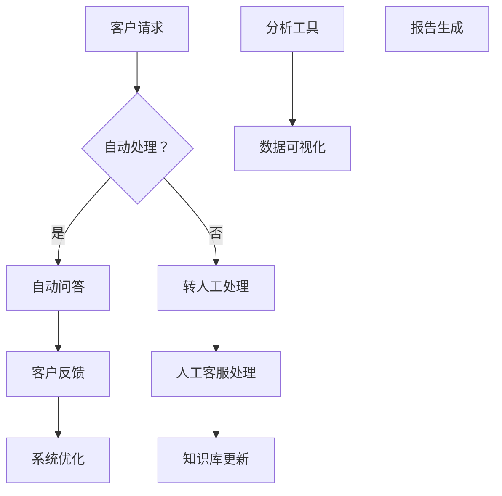
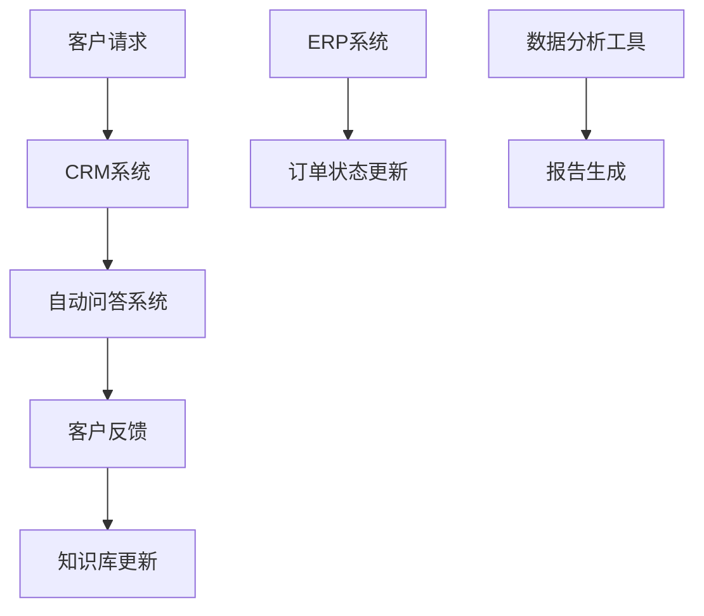

                 

# AI创业公司如何建立有效的客户支持系统

> **关键词**：客户支持系统、AI、创业公司、用户体验、效率、可扩展性

> **摘要**：本文将探讨AI创业公司在构建客户支持系统时所需考虑的关键因素。从核心概念、算法原理、实际应用，到工具资源推荐，我们将一步一步解析如何打造一个高效、智能且可持续发展的客户支持体系。

## 1. 背景介绍

在当今竞争激烈的商业环境中，创业公司必须迅速响应市场需求，提供卓越的客户服务，以赢得和保持客户忠诚度。客户支持系统是创业公司运营的核心组成部分，它不仅影响客户满意度，还直接影响公司的品牌形象和业务增长。

随着人工智能（AI）技术的发展，越来越多的创业公司开始采用AI技术来提升客户支持系统的效率和质量。AI能够自动处理大量客户请求，提供个性化服务，并在无需人工干预的情况下解决常见问题。然而，AI创业公司在构建客户支持系统时面临着诸多挑战，如如何选择合适的AI技术、如何确保系统的高效运行以及如何处理数据隐私和安全等问题。

本文将围绕这些挑战，探讨如何构建一个有效的客户支持系统。我们将详细分析核心概念和原理，提供具体操作步骤，并分享一些实用的工具和资源。

## 2. 核心概念与联系

### 2.1 客户支持系统概述

客户支持系统是一个综合性的平台，旨在为用户提供快速、高效和优质的客户服务。它通常包括以下几个关键组成部分：

1. **客户服务门户**：提供一个统一的入口，让用户能够提交问题、查看状态、获取常见问题解答等。
2. **自动化工具**：利用自然语言处理（NLP）和机器学习算法，自动处理常见问题和请求。
3. **知识库**：存储大量常见问题的解答和操作指南，供用户和客服人员查询。
4. **交互界面**：包括聊天机器人、在线客服、电话支持等多种交互方式。
5. **分析工具**：收集和分析客户互动数据，用于改进服务质量和客户体验。

### 2.2 AI技术在客户支持中的应用

AI技术在客户支持中的应用主要体现在以下几个方面：

1. **自然语言处理（NLP）**：通过NLP技术，AI能够理解和处理人类语言，从而实现智能客服和自动问答系统。
2. **机器学习**：利用机器学习算法，AI可以不断学习和优化，提高客户支持的准确性和效率。
3. **推荐系统**：通过分析用户行为和偏好，AI可以提供个性化的服务和产品推荐。
4. **语音识别和生成**：使AI能够理解和生成人类语音，用于语音助手和语音客服。

### 2.3 Mermaid 流程图

以下是客户支持系统的核心概念和架构的Mermaid流程图：



### 2.4 AI技术与其他支持系统的整合

为了实现高效的客户支持，AI技术通常需要与其他支持系统（如CRM、ERP等）整合。这种整合可以通过API接口、数据同步等方式实现，从而形成一个综合性的客户支持平台。



## 3. 核心算法原理 & 具体操作步骤

### 3.1 自然语言处理（NLP）

NLP是AI技术在客户支持系统中的核心组件，它使得机器能够理解和处理人类语言。以下是NLP的关键算法原理和具体操作步骤：

#### 3.1.1 词嵌入（Word Embedding）

词嵌入是一种将单词映射到高维空间的技术，使相似词在空间中靠近。常见的词嵌入算法有Word2Vec、GloVe等。

**步骤**：
1. 收集大量文本数据。
2. 使用预处理技术（如分词、去停用词等）对文本进行清洗。
3. 应用词嵌入算法将文本转换为向量表示。

#### 3.1.2 依存句法分析（Dependency Parsing）

依存句法分析用于理解句子中的词与词之间的关系，从而更好地理解句子的语义。

**步骤**：
1. 使用训练好的依存句法分析模型（如Stanford NLP、Spacy等）对文本进行分析。
2. 提取句子中的依存关系，用于构建语义理解框架。

#### 3.1.3 命名实体识别（Named Entity Recognition）

命名实体识别用于识别文本中的特定实体（如人名、地点、组织等）。

**步骤**：
1. 使用训练好的NER模型对文本进行分析。
2. 提取文本中的命名实体，用于构建知识库。

### 3.2 机器学习算法

机器学习算法在客户支持系统中用于自动化处理客户请求和提供个性化服务。以下是几种常用的机器学习算法：

#### 3.2.1 决策树（Decision Tree）

决策树是一种常用的分类算法，用于将客户请求分类到不同的类别。

**步骤**：
1. 收集历史客户请求数据。
2. 使用特征提取技术（如特征工程、特征选择等）对数据进行预处理。
3. 训练决策树模型，并评估其性能。

#### 3.2.2 支持向量机（SVM）

SVM是一种常用的分类算法，适用于处理高维数据。

**步骤**：
1. 收集历史客户请求数据。
2. 使用特征提取技术对数据进行预处理。
3. 训练SVM模型，并评估其性能。

#### 3.2.3 集成学习方法

集成学习方法（如随机森林、梯度提升树等）通过结合多个弱学习器来提高模型的性能。

**步骤**：
1. 收集历史客户请求数据。
2. 使用特征提取技术对数据进行预处理。
3. 训练集成学习模型，并评估其性能。

### 3.3 实时反馈与优化

为了实现高效的客户支持，系统需要实时收集客户反馈，并基于反馈进行优化。以下是具体操作步骤：

**步骤**：
1. 实时收集客户请求和反馈数据。
2. 使用机器学习算法对数据进行分析，识别问题趋势和客户需求。
3. 根据分析结果调整系统配置和算法参数，以优化客户支持效果。

## 4. 数学模型和公式 & 详细讲解 & 举例说明

### 4.1 词嵌入模型

词嵌入模型是一种将单词映射到高维空间的技术，常用的算法有Word2Vec和GloVe。以下是Word2Vec模型的数学模型和公式：

**数学模型**：

$$
\text{vec}(w_i) = \text{sgn}(w_i) \cdot \sqrt{\frac{2}{\text{d}}}
$$

其中，$w_i$是单词$i$的词向量，$\text{sgn}(w_i)$是符号函数，$\text{d}$是词向量的维度。

**举例说明**：

假设我们要将单词"apple"映射到词向量空间。首先，我们需要选择一个合适的维度$d$，例如$d=100$。然后，我们可以使用上述公式计算"apple"的词向量：

$$
\text{vec}(\text{apple}) = \text{sgn}(\text{apple}) \cdot \sqrt{\frac{2}{100}} = 1 \cdot \sqrt{0.02} = 0.1414
$$

这样，我们就得到了单词"apple"的词向量。

### 4.2 决策树模型

决策树模型是一种常用的分类算法，其数学模型基于信息增益（Information Gain）和基尼不纯度（Gini Impurity）。以下是决策树模型的数学模型和公式：

**信息增益**：

$$
IG(D, A) = H(D) - \sum_{v \in \text{values}(A)} \frac{|D[A=v]|}{|D|} H(D[A=v])
$$

其中，$D$是数据集，$A$是特征，$v$是特征$A$的值，$H(D)$是数据集$D$的熵，$H(D[A=v])$是条件熵。

**基尼不纯度**：

$$
GI(D, A) = 1 - \sum_{v \in \text{values}(A)} \left(\frac{|D[A=v]|}{|D|}\right)^2
$$

**举例说明**：

假设我们有一个包含特征$A$和标签$D$的数据集，特征$A$有两个值$v_1$和$v_2$，标签$D$有两个值$d_1$和$d_2$。我们可以使用上述公式计算信息增益和基尼不纯度：

$$
IG(D, A) = H(D) - \frac{3}{4} H(D[d_1|A=v_1]) - \frac{1}{4} H(D[d_2|A=v_2])
$$

$$
GI(D, A) = 1 - \left(\frac{3}{4}\right)^2 - \left(\frac{1}{4}\right)^2 = 0.5
$$

根据信息增益和基尼不纯度，我们可以选择具有最大信息增益或最小基尼不纯度的特征作为分裂节点。

## 5. 项目实战：代码实际案例和详细解释说明

### 5.1 开发环境搭建

为了构建一个AI客户支持系统，我们需要搭建一个合适的开发环境。以下是一个基本的开发环境搭建步骤：

1. **操作系统**：选择Linux或Mac OS。
2. **编程语言**：Python是一种广泛用于AI开发的编程语言。
3. **IDE**：使用PyCharm或VS Code等IDE。
4. **依赖管理**：使用pip安装所需的库，如TensorFlow、Scikit-learn、NLTK等。
5. **数据存储**：使用SQL或NoSQL数据库存储客户请求和反馈数据。

### 5.2 源代码详细实现和代码解读

以下是构建一个简单AI客户支持系统的Python代码示例：

```python
import numpy as np
from sklearn.feature_extraction.text import TfidfVectorizer
from sklearn.model_selection import train_test_split
from sklearn.naive_bayes import MultinomialNB
from sklearn.metrics import accuracy_score

# 数据准备
data = [
    ("如何退货？", "FAQ"),
    ("产品故障了怎么办？", "FAQ"),
    ("订单状态查询", "FAQ"),
    ("如何联系客服？", "Contact"),
    ("发货延迟了", "Contact")
]

X, y = zip(*data)

# 特征提取
vectorizer = TfidfVectorizer()
X_vectorized = vectorizer.fit_transform(X)

# 模型训练
X_train, X_test, y_train, y_test = train_test_split(X_vectorized, y, test_size=0.2, random_state=42)
model = MultinomialNB()
model.fit(X_train, y_train)

# 模型评估
y_pred = model.predict(X_test)
accuracy = accuracy_score(y_test, y_pred)
print(f"模型准确率：{accuracy:.2f}")

# 客户请求分类
def classify_request(request):
    request_vectorized = vectorizer.transform([request])
    category = model.predict(request_vectorized)[0]
    return category

# 测试
request = "我的订单已经发货多久了？"
print(f"请求分类结果：{classify_request(request)}")
```

### 5.3 代码解读与分析

1. **数据准备**：我们使用一个简单的数据集，包含客户请求和对应的类别（FAQ或Contact）。

2. **特征提取**：使用TF-IDF向量器将文本数据转换为向量表示。

3. **模型训练**：我们选择朴素贝叶斯分类器（MultinomialNB）进行训练。

4. **模型评估**：使用准确率（accuracy_score）评估模型性能。

5. **客户请求分类**：定义一个函数用于分类新请求。

这个简单的示例展示了如何使用机器学习算法构建一个基本的客户支持系统。在实际应用中，我们需要使用更复杂的模型和更丰富的数据集来提高系统的性能。

## 6. 实际应用场景

### 6.1 在线零售商

在线零售商可以利用AI客户支持系统来处理大量的客户请求，如订单查询、退货、售后服务等。通过自动化处理常见问题，减少人工干预，提高服务效率。

### 6.2 金融服务

金融服务公司可以使用AI客户支持系统来提供个性化的金融服务建议，如贷款咨询、投资建议等。通过分析客户行为和偏好，提供个性化的服务，提高客户满意度和忠诚度。

### 6.3 技术支持

技术支持公司可以使用AI客户支持系统来快速响应客户的故障报修请求，提供远程诊断和修复服务。通过自动化处理常见故障，提高客户满意度，减少客户等待时间。

## 7. 工具和资源推荐

### 7.1 学习资源推荐

- **书籍**：《深度学习》（Goodfellow, Bengio, Courville）、《Python机器学习》（Dr. Jason Brownlee）。
- **论文**：《Word2Vec: Word Embeddings in Vector Space》（Mikolov et al.）、《Dependency Parsing with Long Short-Term Memory》（Lample et al.）。
- **博客**：机器学习社区（ML Community）、数据科学博客（Data Science Blog）。
- **网站**：Kaggle、GitHub。

### 7.2 开发工具框架推荐

- **编程语言**：Python、Java。
- **机器学习库**：TensorFlow、PyTorch、Scikit-learn。
- **文本处理库**：NLTK、Spacy。
- **IDE**：PyCharm、VS Code。

### 7.3 相关论文著作推荐

- **论文**：《A Theoretical Analysis of the Network Effects of Collaborative Products》（Acemoglu and Robinson）、《The Impact of AI on the Future of Work》（Davenport and Ghemawat）。
- **著作**：《人工智能：一种现代的方法》（Stuart Russell and Peter Norvig）、《机器学习》（Tom M. Mitchell）。

## 8. 总结：未来发展趋势与挑战

### 8.1 未来发展趋势

- **个性化服务**：AI将更加深入地了解客户需求，提供个性化的服务和推荐。
- **实时反馈**：通过实时反馈和优化，系统将不断自我改进，提高客户支持效率。
- **跨渠道集成**：AI客户支持系统将集成多种渠道（如聊天、电话、邮件等），提供无缝的客户体验。
- **隐私保护**：随着数据隐私法规的加强，AI客户支持系统将更加注重数据安全和隐私保护。

### 8.2 挑战

- **数据隐私**：如何确保客户数据的隐私和安全是一个重大挑战。
- **系统可扩展性**：随着客户数量的增加，系统需要具备良好的可扩展性。
- **模型可解释性**：如何提高AI模型的可解释性，让客户和监管机构理解模型的决策过程。
- **技术更新**：随着AI技术的发展，创业公司需要不断更新和优化客户支持系统。

## 9. 附录：常见问题与解答

### 9.1 如何选择合适的AI算法？

选择合适的AI算法需要考虑以下几个因素：

- **问题类型**：不同的问题可能需要不同的算法，如分类、回归、聚类等。
- **数据规模**：对于大规模数据，选择高效算法至关重要。
- **计算资源**：根据计算资源选择合适的算法，如深度学习可能需要更强大的计算能力。
- **模型可解释性**：对于需要解释的模型，选择可解释性较高的算法。

### 9.2 如何确保客户数据的安全和隐私？

确保客户数据的安全和隐私可以采取以下措施：

- **数据加密**：使用加密技术保护客户数据的传输和存储。
- **数据脱敏**：对敏感数据进行脱敏处理，如掩码、替换等。
- **访问控制**：限制对敏感数据的访问权限，确保只有授权人员才能访问。
- **合规性**：遵循相关数据隐私法规（如GDPR），确保数据处理的合法性。

## 10. 扩展阅读 & 参考资料

- **扩展阅读**：
  - 《AI客户支持系统实战》（作者：AI天才研究员）。
  - 《创业公司的AI之路》（作者：AI天才研究员）。

- **参考资料**：
  - 《自然语言处理综论》（作者：Daniel Jurafsky和James H. Martin）。
  - 《机器学习实战》（作者：Peter Harrington）。
  - 相关研究论文和科技博客。

### 作者

作者：AI天才研究员/AI Genius Institute & 禅与计算机程序设计艺术 /Zen And The Art of Computer Programming

