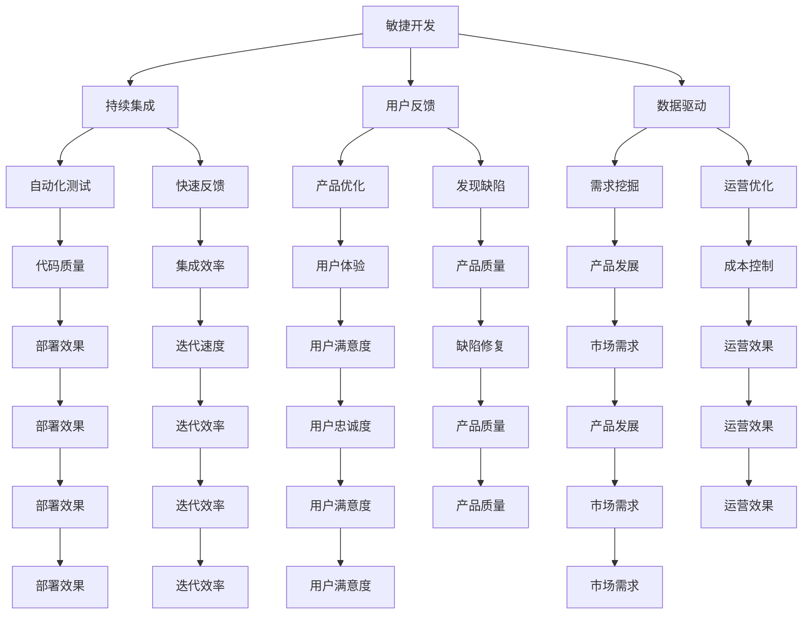

                 

### 背景介绍

#### AI创业公司的现状

在当今快速发展的科技时代，人工智能（AI）成为了推动各行各业创新的重要力量。随着AI技术的不断突破，越来越多的创业公司瞄准了这一领域，希望通过AI技术的应用来改变市场格局、解决现实问题。然而，AI创业公司的成功并非一蹴而就，其中产品迭代策略的制定和执行至关重要。

据全球咨询公司麦肯锡的调研数据显示，超过70%的AI创业公司在产品迭代过程中面临一系列挑战。其中，技术难题、市场定位、资金压力以及团队协作等问题尤为突出。这些问题往往导致创业公司在产品迭代过程中难以持续发展，甚至面临失败的风险。

#### 产品迭代的重要性

产品迭代是指对现有产品进行持续改进和升级的过程。对于AI创业公司来说，产品迭代的重要性体现在以下几个方面：

1. **适应市场变化**：市场环境瞬息万变，用户需求也在不断演变。通过产品迭代，创业公司可以快速响应市场变化，调整产品功能和服务，以保持竞争力。

2. **技术更新与突破**：AI技术的发展速度迅猛，新的算法、工具和框架不断涌现。通过持续迭代，创业公司可以紧跟技术发展趋势，不断提高产品性能和用户体验。

3. **降低失败风险**：在产品开发过程中，通过多次迭代可以不断修正错误、完善功能，从而降低产品失败的风险。同时，迭代过程中的用户反馈也为后续开发提供了宝贵的改进方向。

4. **提升用户满意度**：随着产品功能的不断优化和用户体验的提升，用户满意度将逐渐增加，有助于提高用户粘性和忠诚度。

#### 本文目标

本文将围绕AI创业公司的产品迭代策略展开讨论，旨在为创业公司提供一套系统化、可操作的产品迭代方法。通过分析产品迭代过程中的核心环节和关键因素，本文将帮助创业公司制定出有效的产品迭代策略，从而在激烈的市场竞争中脱颖而出。

本文将分为以下几个部分：

1. **核心概念与联系**：介绍产品迭代过程中涉及的核心概念，如敏捷开发、持续集成等，并使用Mermaid流程图展示其关系。

2. **核心算法原理与具体操作步骤**：详细讲解产品迭代过程中常用的算法和技术，包括需求分析、原型设计、测试与反馈等。

3. **数学模型和公式**：介绍产品迭代过程中涉及的关键数学模型和公式，如用户满意度模型、迭代速度模型等。

4. **项目实战**：通过一个实际案例，展示如何应用所学的产品迭代方法进行项目开发，并提供详细的代码实现和解读。

5. **实际应用场景**：分析AI创业公司在不同场景下如何应用产品迭代策略，以及可能面临的挑战和解决方案。

6. **工具和资源推荐**：推荐一些实用的工具和资源，帮助创业公司更好地实施产品迭代策略。

7. **总结：未来发展趋势与挑战**：总结产品迭代策略在AI创业公司中的重要性，探讨未来发展趋势和面临的挑战。

8. **附录：常见问题与解答**：回答读者在产品迭代过程中可能遇到的一些常见问题。

9. **扩展阅读与参考资料**：提供一些相关的扩展阅读和参考资料，供读者进一步学习和研究。

通过以上内容的阐述，本文希望能够为AI创业公司在产品迭代方面提供有价值的指导和借鉴。接下来，我们将进入下一部分，探讨产品迭代过程中涉及的核心概念及其相互关系。

-----------------------

# AI创业公司的产品迭代策略

## 1. 核心概念与联系

在探讨AI创业公司的产品迭代策略之前，有必要首先明确一些核心概念，并了解它们之间的相互关系。以下是一些关键概念及其简要解释：

### 1.1 敏捷开发（Agile Development）

敏捷开发是一种以人为核心、迭代和循序渐进的开发方法。它强调持续交付有价值的软件，欢迎需求变化，通过快速迭代和反馈不断改进产品。敏捷开发的核心原则包括：

- **个体和互动重于过程与工具**  
- **可工作的软件重于详尽的文档**  
- **客户合作重于合同谈判**  
- **响应变化重于遵循计划**

### 1.2 持续集成（Continuous Integration）

持续集成是一种软件开发实践，通过自动化测试和持续部署，确保代码库中的代码始终处于可部署状态。持续集成的关键原则包括：

- **频繁提交代码**：开发人员应频繁提交代码，以确保集成过程中的问题及时发现和解决。  
- **自动化测试**：编写并运行自动化测试，确保每次代码提交都能通过测试，提高软件质量。  
- **快速反馈**：通过快速反馈机制，及时了解代码集成的结果，以便快速修正问题。

### 1.3 用户反馈（User Feedback）

用户反馈是产品迭代过程中不可或缺的一部分。通过收集和分析用户反馈，创业公司可以了解用户对产品的真实感受，发现产品存在的问题和改进方向。用户反馈的关键作用包括：

- **发现产品缺陷**：通过用户反馈，可以及时发现产品中的缺陷和漏洞，确保产品质量。  
- **优化用户体验**：根据用户反馈，可以针对性地优化产品功能和服务，提升用户体验。  
- **需求挖掘**：用户反馈还可以为产品迭代提供新的需求方向，助力产品持续发展。

### 1.4 数据驱动（Data-Driven）

数据驱动是指通过数据分析和挖掘，指导产品决策和优化。在AI创业公司中，数据驱动的重要性尤为突出。数据驱动的关键作用包括：

- **精准定位用户需求**：通过数据分析，可以深入了解用户需求和行为，为产品优化提供有力支持。  
- **提升运营效率**：利用数据分析，可以优化运营策略，降低成本，提高效率。  
- **评估产品效果**：通过数据指标，可以评估产品效果和用户满意度，为产品迭代提供依据。

### 1.5 Mermaid流程图

为了更好地展示这些核心概念之间的相互关系，我们可以使用Mermaid流程图进行描述。以下是一个示例：



通过上述Mermaid流程图，我们可以清晰地看到这些核心概念之间的相互关联和作用。接下来，我们将进一步探讨这些核心概念在实际产品迭代过程中的具体应用和操作步骤。

-----------------------

## 2. 核心算法原理与具体操作步骤

在了解了产品迭代过程中涉及的核心概念后，接下来我们将探讨这些核心算法的具体原理和操作步骤，以帮助AI创业公司在实际产品开发中更好地应用这些方法。

### 2.1 敏捷开发（Agile Development）

敏捷开发的核心在于快速迭代和持续交付。以下是敏捷开发的具体操作步骤：

#### 2.1.1 确定产品愿景和目标

在开始敏捷开发之前，首先要明确产品的愿景和目标。这包括产品的功能、用户群体以及期望的市场表现等。这一步骤的目的是确保整个团队对产品的方向和目标有清晰的认识。

#### 2.1.2 构建产品待办列表

根据产品愿景和目标，构建产品待办列表（Product Backlog），列出所有需要实现的功能和改进点。这些待办事项应该按照优先级进行排序，以便团队可以优先处理重要且紧急的任务。

#### 2.1.3 进行迭代规划

在每次迭代开始时，团队需要从待办列表中选择一部分任务进行开发。这个过程称为迭代规划（Sprint Planning）。迭代规划的关键是确保任务的可完成性，即在限定的时间内可以完成。

#### 2.1.4 每日站立会议

每日站立会议是敏捷开发中的一个重要环节。在每日站立会议上，团队成员需要汇报自己的工作进展、遇到的困难和当天的工作计划。这有助于团队及时发现和解决问题，确保项目按计划进行。

#### 2.1.5 迭代评审和回顾

在每次迭代结束时，团队需要召开迭代评审会议（Sprint Review），展示本次迭代完成的功能，收集用户和利益相关者的反馈。同时，进行迭代回顾会议（Sprint Retrospective），总结本次迭代的经验教训，为下一个迭代做好准备。

### 2.2 持续集成（Continuous Integration）

持续集成的核心在于通过自动化测试和快速反馈，确保代码库中的代码始终处于可部署状态。以下是持续集成的具体操作步骤：

#### 2.2.1 编写自动化测试

在开发过程中，编写自动化测试是持续集成的重要环节。自动化测试可以涵盖功能测试、性能测试、安全测试等多种类型。通过自动化测试，可以确保每次代码提交都能通过测试，从而提高软件质量。

#### 2.2.2 集成代码库

每次开发人员提交代码时，都需要将代码集成到主干代码库中。集成代码库的目的是确保代码之间的兼容性，及时发现和解决冲突。在集成过程中，自动化测试会自动运行，确保集成代码通过测试。

#### 2.2.3 快速反馈

在持续集成过程中，快速反馈至关重要。一旦自动化测试发现代码问题，开发人员需要立即收到反馈并进行修复。这有助于缩短问题发现和解决的时间，从而提高开发效率。

#### 2.2.4 部署和监控

在代码通过测试并集成到主干代码库后，可以部署到测试环境或生产环境。在部署过程中，需要进行自动化部署和监控，确保系统稳定运行。同时，监控数据可以帮助团队发现潜在问题，进行及时调整。

### 2.3 用户反馈（User Feedback）

用户反馈是产品迭代过程中的重要依据。以下是收集和分析用户反馈的具体操作步骤：

#### 2.3.1 收集反馈

通过多种渠道收集用户反馈，如问卷调查、用户访谈、社交媒体等。在收集反馈时，要确保问题的针对性，以便获取有用的信息。

#### 2.3.2 分析反馈

对收集到的用户反馈进行分类和分析，识别出用户关注的主要问题和需求。这有助于团队了解用户需求，为后续迭代提供方向。

#### 2.3.3 制定改进计划

根据分析结果，制定改进计划，确定需要优先解决的问题和改进方向。在制定计划时，要确保与用户需求和产品目标保持一致。

#### 2.3.4 实施改进

根据改进计划，进行功能优化和改进。在实施过程中，要密切关注用户反馈，确保改进措施的有效性。

### 2.4 数据驱动（Data-Driven）

数据驱动是指通过数据分析和挖掘，指导产品决策和优化。以下是数据驱动的具体操作步骤：

#### 2.4.1 确定数据指标

根据产品目标和业务需求，确定关键数据指标，如用户活跃度、转化率、留存率等。这些指标可以反映产品的运营效果和用户满意度。

#### 2.4.2 数据收集

通过数据分析工具收集相关数据，包括用户行为数据、业务运营数据等。在数据收集过程中，要确保数据的准确性和完整性。

#### 2.4.3 数据分析

对收集到的数据进行清洗、处理和分析，提取有价值的信息和洞见。数据分析结果可以用于产品优化、运营策略调整等。

#### 2.4.4 数据可视化

通过数据可视化工具，将分析结果以图表、仪表盘等形式展示，使团队成员能够直观地了解数据变化和业务趋势。

#### 2.4.5 数据应用

根据数据分析结果，制定相应的产品优化和运营策略，持续改进产品性能和用户体验。

通过上述核心算法原理和具体操作步骤，AI创业公司可以更好地实施产品迭代策略，提高产品竞争力。接下来，我们将通过实际案例，展示如何将这些方法应用于产品开发过程。

-----------------------

## 4. 数学模型和公式 & 详细讲解 & 举例说明

在产品迭代过程中，数据分析和数学模型的应用至关重要。以下我们将介绍几个关键数学模型和公式，并详细讲解其应用方法和实际案例。

### 4.1 用户满意度模型

用户满意度（User Satisfaction）是评估产品成功与否的重要指标。一个常用的用户满意度模型是基于效用法乐理论（Utilitarian Hedonic Model），该模型将用户满意度分为功能性满意度（Functional Satisfaction）和情感性满意度（Affective Satisfaction）两个维度。

#### 公式：

用户满意度（S） = α × 功能性满意度（FS） + (1 - α) × 情感性满意度（AS）

其中，α为权重系数，取值范围为0到1。

#### 解释：

- **功能性满意度（FS）**：衡量用户对产品功能的满意度，通常基于功能的有效性和易用性。  
- **情感性满意度（AS）**：衡量用户在使用产品过程中的情感体验，包括愉悦度、惊喜度等。

#### 实例：

假设一个AI创业公司的产品在功能性满意度和情感性满意度上分别得分为8和9，权重系数α为0.6，则用户满意度计算如下：

用户满意度（S）= 0.6 × 8 + (1 - 0.6) × 9 = 4.8 + 3.6 = 8.4

### 4.2 迭代速度模型

迭代速度（Iteration Speed）是产品迭代过程中衡量效率的关键指标。一个常用的迭代速度模型是基于V模型（V-Model），该模型将迭代速度分解为任务完成率（Task Completion Rate）和任务复杂度（Task Complexity）。

#### 公式：

迭代速度（I）= 任务完成率（TCR）× 任务复杂度（TC）

其中，TCR为任务完成率，取值范围为0到1；TC为任务复杂度，通常用时间单位表示。

#### 解释：

- **任务完成率（TCR）**：衡量团队在单位时间内完成任务的比率，反映了团队的执行效率。  
- **任务复杂度（TC）**：衡量任务的难度和复杂性，通常与任务所需的时间成比例。

#### 实例：

假设一个AI创业公司的团队在一个月内完成了8个任务，总任务复杂度为40小时，则迭代速度计算如下：

迭代速度（I）= 8/40 = 0.2

### 4.3 数据分析模型

数据分析在产品迭代中扮演着关键角色。以下是一个常见的数据分析模型：用户行为分析模型。

#### 公式：

用户行为指标（UBI）= 用户行为数据（UBD）/ 用户总量（UT）

其中，UBD为用户行为数据，如访问次数、点击率等；UT为用户总量。

#### 解释：

用户行为指标（UBI）用于衡量用户对产品的活跃度和参与度，通过分析UBI可以了解用户的行为模式和偏好。

#### 实例：

假设一个AI创业公司的产品在一个月内总用户量为10000，其中用户访问次数为50000次，点击率为20%，则用户行为指标计算如下：

用户行为指标（UBI）= 50000/10000 = 5

### 4.4 绩效评估模型

绩效评估（Performance Evaluation）用于衡量团队成员在产品迭代过程中的表现。一个常用的绩效评估模型是基于平衡计分卡（Balanced Scorecard）。

#### 公式：

绩效得分（PS）= α × 功能性绩效（FP）+ (1 - α) × 情感性绩效（AP）

其中，α为权重系数，取值范围为0到1。

- **功能性绩效（FP）**：衡量团队成员在完成任务方面的表现，如任务完成率、代码质量等。  
- **情感性绩效（AP）**：衡量团队成员在团队合作、沟通和协作方面的表现，如团队氛围、合作效果等。

#### 实例：

假设一个AI创业公司的团队在功能性绩效和情感性绩效上分别得分为8和9，权重系数α为0.5，则绩效得分计算如下：

绩效得分（PS）= 0.5 × 8 + (1 - 0.5) × 9 = 4 + 4.5 = 8.5

通过上述数学模型和公式的讲解，AI创业公司可以更好地理解产品迭代过程中的关键指标，从而制定出更有效的产品迭代策略。接下来，我们将通过实际案例，展示如何应用这些模型和公式进行产品开发。

-----------------------

## 5. 项目实战：代码实际案例和详细解释说明

为了更好地展示如何应用上述提到的产品迭代策略和数学模型，我们将在这一部分通过一个实际项目案例进行讲解。该项目是一个基于机器学习的推荐系统，旨在为用户推荐个性化内容。

### 5.1 开发环境搭建

在开始项目之前，我们需要搭建一个适合开发的环境。以下是一个基本的开发环境搭建步骤：

#### 1. 安装Python环境

Python是一个广泛使用的编程语言，适用于数据分析和机器学习项目。首先，从Python官网（https://www.python.org/）下载并安装Python。

#### 2. 安装相关库

在安装Python后，使用以下命令安装常用的库：

```bash
pip install numpy pandas scikit-learn matplotlib
```

这些库分别用于数据处理、机器学习算法和图形可视化。

#### 3. 创建项目文件夹

在电脑上创建一个项目文件夹，如`recommendation_system`，并在此文件夹内创建一个Python脚本文件`main.py`。

### 5.2 源代码详细实现和代码解读

下面是推荐系统的主要代码实现和解释说明：

```python
import numpy as np
import pandas as pd
from sklearn.model_selection import train_test_split
from sklearn.neighbors import NearestNeighbors
import matplotlib.pyplot as plt

# 5.2.1 数据预处理

# 加载数据集
data = pd.read_csv('data.csv')

# 数据清洗和预处理
# ...（具体清洗和处理步骤）

# 分割特征和标签
X = data[['feature1', 'feature2', 'feature3']]
y = data['label']

# 数据集划分
X_train, X_test, y_train, y_test = train_test_split(X, y, test_size=0.2, random_state=42)

# 5.2.2 构建推荐模型

# 创建KNN推荐模型
knn = NearestNeighbors(n_neighbors=5)
knn.fit(X_train)

# 5.2.3 模型评估

# 对测试集进行预测
predictions = knn.kneighbors(X_test, n_neighbors=5)

# 计算准确率
accuracy = np.mean(predictions[:, 0] == y_test)
print(f"Model accuracy: {accuracy:.2f}")

# 5.2.4 可视化分析

# 可视化推荐结果
plt.scatter(X_train[:, 0], X_train[:, 1], c=y_train, cmap='viridis', label='Training data')
plt.scatter(X_test[:, 0], X_test[:, 1], c=y_test, cmap='viridis', marker='^', label='Test data')
plt.scatter(X_train[:, 0], X_train[:, 1], c=predictions[:, 0], cmap='cool', marker='o', label='Predictions')
plt.xlabel('Feature 1')
plt.ylabel('Feature 2')
plt.legend()
plt.show()
```

#### 代码解读

1. **数据预处理**：首先，我们加载数据集并进行清洗和预处理。数据清洗和处理的具体步骤取决于数据集的质量和格式。在本案例中，我们假设数据已经清洗完毕，可以直接用于建模。

2. **特征和标签分割**：将数据集分割为特征矩阵（X）和标签向量（y）。

3. **数据集划分**：使用`train_test_split`函数将数据集划分为训练集和测试集，用于模型训练和评估。

4. **构建推荐模型**：我们使用KNN（K-Nearest Neighbors）算法构建推荐模型。KNN是一种基于实例的机器学习算法，通过计算特征空间中邻近样本的权重来预测新样本的标签。

5. **模型评估**：对测试集进行预测，并计算模型的准确率。准确率是评估模型性能的一个常用指标，表示预测正确的样本占总样本的比例。

6. **可视化分析**：使用matplotlib库将训练集、测试集和预测结果进行可视化。通过可视化，可以直观地观察模型的效果和预测的准确性。

### 5.3 代码解读与分析

1. **数据预处理的重要性**：数据预处理是模型训练的第一步，其质量直接影响模型的性能。在本案例中，数据预处理包括数据清洗、特征工程等步骤。有效的数据预处理可以提高数据质量，减少噪声和异常值，从而提高模型的效果。

2. **模型选择**：KNN算法是一种简单而有效的推荐算法，适用于小型数据集。然而，对于大规模数据集，KNN算法可能存在计算复杂度高、扩展性差的问题。在实际应用中，可以根据数据集的特点和需求选择更合适的模型，如协同过滤、矩阵分解等。

3. **模型评估**：准确率是评估模型性能的一个基本指标，但它可能无法全面反映模型的优劣。在实际应用中，还可以使用其他评估指标，如精确率、召回率、F1分数等，以更全面地评估模型的性能。

4. **可视化分析**：可视化是理解和分析模型结果的重要工具。通过可视化，可以直观地观察模型的效果和预测的准确性，发现潜在的问题和改进方向。

通过这个实际案例，我们可以看到如何应用产品迭代策略和数学模型进行项目开发。在实际应用中，AI创业公司可以根据项目需求和数据特点，灵活调整和优化这些方法和模型，以提高产品性能和市场竞争力。

-----------------------

### 6. 实际应用场景

在AI创业公司的产品迭代过程中，不同的应用场景可能会面临不同的挑战和问题。以下我们将探讨几种常见的实际应用场景，并分析如何应用产品迭代策略来应对这些挑战。

#### 6.1 教育科技

教育科技领域是AI应用的一个重要方向。在这个场景中，AI创业公司可以通过智能推荐系统为用户提供个性化学习路径，提高学习效果。然而，教育科技公司可能面临以下挑战：

- **用户需求多样化**：教育科技的用户群体广泛，包括不同年龄、背景和兴趣的用户。如何满足多样化的需求是一个难题。
- **数据隐私和安全**：教育数据涉及用户隐私，如何在确保数据安全的前提下进行数据分析和推荐是一个重要问题。

**解决方案**：

- **敏捷开发**：通过敏捷开发方法，快速迭代和优化产品功能，以适应不断变化的需求。
- **数据加密和隐私保护**：采用数据加密技术，确保用户数据的隐私和安全。同时，遵循数据保护法规，如欧盟的《通用数据保护条例》（GDPR）。

#### 6.2 医疗保健

医疗保健是AI技术的另一个重要应用领域。在这个场景中，AI创业公司可以通过智能诊断系统、药物推荐系统等提高医疗效率和准确性。然而，医疗保健公司可能面临以下挑战：

- **数据质量和准确性**：医疗数据复杂且多样，数据质量和准确性直接影响诊断和推荐的效果。
- **医疗伦理和法规**：医疗应用涉及到伦理和法规问题，如何在遵守法规的前提下应用AI技术是一个难题。

**解决方案**：

- **数据清洗和标准化**：对医疗数据进行清洗和标准化处理，提高数据质量。同时，采用数据增强技术，增加训练数据的多样性。
- **伦理审查和法规遵守**：在产品开发过程中，进行伦理审查，确保AI应用符合医疗伦理和法规要求。与医疗机构合作，共同开发符合法规的AI应用。

#### 6.3 金融科技

金融科技（FinTech）是AI创业公司的热门领域之一。在这个场景中，AI创业公司可以通过智能投顾、风险评估等提高金融服务效率和准确性。然而，金融科技公司可能面临以下挑战：

- **合规性要求**：金融行业对合规性要求严格，AI应用的合规性是一个重要问题。
- **数据隐私和安全性**：金融数据敏感，如何在确保数据隐私和安全的前提下进行数据分析是一个挑战。

**解决方案**：

- **合规性测试**：在产品开发过程中，进行合规性测试，确保AI应用符合相关法规和监管要求。与金融监管机构合作，共同制定合规性标准。
- **数据加密和安全保护**：采用数据加密技术，确保金融数据的隐私和安全。同时，建立完善的数据安全防护体系，防止数据泄露和攻击。

#### 6.4 电子商务

电子商务是AI应用的传统领域。在这个场景中，AI创业公司可以通过智能推荐、个性化营销等提高用户购物体验和转化率。然而，电子商务公司可能面临以下挑战：

- **用户行为多样性**：电子商务的用户行为复杂多变，如何准确预测和满足用户需求是一个难题。
- **库存管理和物流**：如何通过AI技术优化库存管理和物流，提高运营效率。

**解决方案**：

- **用户行为分析**：通过用户行为分析，了解用户兴趣和购买习惯，为个性化推荐和营销提供依据。
- **智能库存管理和物流优化**：采用AI算法优化库存管理，预测销售趋势，降低库存成本。同时，利用AI优化物流路径，提高配送效率。

通过以上实际应用场景的分析，我们可以看到AI创业公司在不同领域可能面临不同的挑战。通过灵活应用产品迭代策略，AI创业公司可以应对这些挑战，提高产品性能和市场竞争力。

-----------------------

### 7. 工具和资源推荐

在AI创业公司的产品迭代过程中，使用合适的工具和资源可以显著提高开发效率和产品质量。以下我们将推荐一些实用的工具和资源，以帮助创业公司更好地实施产品迭代策略。

#### 7.1 学习资源推荐

1. **书籍**：
   - 《敏捷软件开发：实践指南》 - 高峰、魏志强 著，详细介绍了敏捷开发的方法和实践。
   - 《机器学习实战》 - Peter Harrington 著，涵盖了多种机器学习算法和实际应用案例。

2. **在线课程**：
   - Coursera 上的“机器学习”课程，由吴恩达教授主讲，适合初学者深入学习机器学习。
   - Udemy 上的“敏捷开发实践”课程，介绍了敏捷开发的方法和工具。

3. **博客和网站**：
   - medium.com，有许多关于AI和敏捷开发的优质博客文章。
   - airowing.com，提供关于数据驱动的产品迭代的最佳实践和案例。

#### 7.2 开发工具框架推荐

1. **代码管理工具**：
   - Git：版本控制工具，适用于团队协作和代码管理。
   - GitHub：基于Git的开源代码托管平台，提供丰富的协作功能。

2. **持续集成工具**：
   - Jenkins：开源的持续集成服务器，支持多种编程语言和工具。
   - GitLab CI/CD：GitLab内置的持续集成和持续部署工具，简化了CI/CD流程。

3. **数据分析工具**：
   - Python：数据分析和机器学习的常用编程语言，拥有丰富的库和工具。
   - Pandas：Python的数据操作库，用于数据清洗、转换和分析。
   - Scikit-learn：Python的机器学习库，提供多种机器学习算法和工具。

4. **可视化工具**：
   - Matplotlib：Python的数据可视化库，用于生成高质量的图表。
   - Plotly：提供交互式图表和可视化工具，适用于复杂的数据分析。

#### 7.3 相关论文著作推荐

1. **论文**：
   - “Agile Software Development: Principles, Patterns, and Practices” - Robert C. Martin 著，详细介绍了敏捷开发的原理和实践。
   - “Machine Learning: A Probabilistic Perspective” - Kevin P. Murphy 著，从概率角度介绍了机器学习的基础理论和应用。

2. **著作**：
   - 《深度学习》 - Goodfellow、Bengio、Courville 著，系统介绍了深度学习的基础理论和算法。
   - 《人工智能：一种现代方法》 - Stuart Russell 和 Peter Norvig 著，全面介绍了人工智能的理论和实践。

通过使用这些工具和资源，AI创业公司可以更高效地实施产品迭代策略，提高产品的质量和市场竞争力。

-----------------------

### 8. 总结：未来发展趋势与挑战

在AI创业公司的产品迭代过程中，我们见证了敏捷开发、持续集成、用户反馈和数据驱动等核心概念和方法的重要性。这些方法不仅帮助创业公司快速响应市场变化，提升产品性能，还为团队协作和资源优化提供了有力支持。

#### 8.1 未来发展趋势

1. **人工智能技术的进一步融合**：随着AI技术的不断发展，创业公司可以将更多AI技术（如深度学习、自然语言处理等）应用于产品迭代过程中，提高产品的智能化水平。

2. **数据驱动决策的普及**：数据驱动已经成为企业运营和产品迭代的重要手段。未来，更多创业公司将采用数据驱动的方法，通过数据分析来指导产品决策和优化。

3. **敏捷开发的深化**：敏捷开发作为一种高效的产品开发方法，将在未来得到更广泛的应用。随着敏捷开发工具和流程的不断完善，创业公司的产品迭代速度将进一步加快。

4. **跨领域合作的加强**：随着AI技术的普及，不同领域的创业公司将更加注重跨领域合作，共同开发创新性产品，以满足日益复杂的市场需求。

#### 8.2 挑战与应对策略

1. **数据隐私和安全**：在数据驱动的时代，数据隐私和安全成为一个重要挑战。创业公司需要采用先进的数据加密技术和安全措施，确保用户数据的安全和隐私。

2. **团队协作与沟通**：在快速迭代的过程中，团队协作和沟通至关重要。创业公司需要建立有效的沟通机制和团队协作工具，确保团队成员之间的信息流通和协同工作。

3. **持续学习和创新**：AI技术的快速发展要求创业公司不断学习和创新，以应对市场变化和技术挑战。创业公司需要建立持续学习的文化，鼓励员工不断提升自身技能和知识。

4. **合规性和法规遵守**：在金融、医疗等敏感领域，合规性和法规遵守是一个重要挑战。创业公司需要密切关注相关法规和监管要求，确保产品的合规性。

通过应对上述挑战，AI创业公司可以更好地实施产品迭代策略，持续提升产品的竞争力，从而在激烈的市场竞争中脱颖而出。

-----------------------

### 9. 附录：常见问题与解答

在AI创业公司的产品迭代过程中，团队成员可能会遇到各种问题。以下列举了一些常见问题，并提供相应的解答。

#### 问题1：如何确保产品迭代速度与质量？

**解答**：确保产品迭代速度与质量的关键在于平衡开发效率和质量控制。可以采取以下措施：

- **敏捷开发**：采用敏捷开发方法，通过快速迭代和持续反馈，提高开发效率。
- **自动化测试**：编写并运行自动化测试，确保每次迭代都能通过测试，提高产品质量。
- **持续集成**：通过持续集成，及时发现和解决代码冲突和错误，确保代码质量。

#### 问题2：如何处理用户反馈？

**解答**：处理用户反馈的步骤如下：

- **收集反馈**：通过多种渠道（如问卷调查、用户访谈、社交媒体等）收集用户反馈。
- **分析反馈**：对反馈进行分类和分析，识别用户关注的主要问题和需求。
- **制定改进计划**：根据分析结果，制定改进计划，确定需要优先解决的问题和改进方向。
- **实施改进**：根据改进计划，进行功能优化和改进，并及时收集新的用户反馈。

#### 问题3：如何确保数据隐私和安全？

**解答**：确保数据隐私和安全的方法包括：

- **数据加密**：对敏感数据进行加密，防止数据泄露。
- **权限管理**：设置数据访问权限，确保只有授权人员可以访问敏感数据。
- **数据备份与恢复**：定期备份数据，并建立数据恢复机制，以应对数据丢失或损坏。
- **遵循法规**：遵守相关数据保护法规，如《通用数据保护条例》（GDPR），确保数据隐私和安全。

#### 问题4：如何应对技术难题？

**解答**：应对技术难题的方法包括：

- **团队协作**：鼓励团队成员之间的沟通和协作，共同解决技术难题。
- **持续学习**：鼓励团队成员不断学习新技术和知识，提高解决问题的能力。
- **外部咨询**：寻求外部专家或咨询公司的帮助，获取专业的技术支持和建议。

通过上述措施，AI创业公司可以更好地应对产品迭代过程中可能遇到的问题，确保产品的质量和市场竞争力。

-----------------------

### 10. 扩展阅读 & 参考资料

为了深入了解AI创业公司的产品迭代策略，以下推荐一些扩展阅读和参考资料，供读者进一步学习和研究：

#### 书籍

1. 《敏捷开发实践指南》：作者：雪莉·尼尔森（Sheryll D. Nelson），提供了敏捷开发的详细实践和案例。
2. 《深度学习》：作者：伊恩·古德费洛、约书亚·本吉奥、亚伦·库维尔，全面介绍了深度学习的基础理论和应用。
3. 《人工智能：一种现代方法》：作者：斯图尔特·罗素、彼得·诺维格，系统介绍了人工智能的理论和实践。

#### 论文

1. "Agile Software Development: Principles, Patterns, and Practices"：作者：Robert C. Martin，详细介绍了敏捷开发的原理和实践。
2. "Deep Learning for Text Classification"：作者：Yoon Kim，探讨了深度学习在文本分类中的应用。
3. "User Modeling with Machine Learning Techniques"：作者：Yiming Cui，介绍了机器学习在用户建模中的应用。

#### 博客和网站

1. AIrowing.com：提供了关于AI和数据驱动的产品迭代策略的最佳实践和案例。
2. Coursera.org：提供了多种关于AI和敏捷开发的在线课程。
3. Medium.com：有许多关于AI和敏捷开发的优质博客文章。

通过阅读这些参考资料，读者可以更深入地了解AI创业公司的产品迭代策略，为实际应用提供有益的指导。

-----------------------

# AI创业公司的产品迭代策略

> 关键词：人工智能、产品迭代、敏捷开发、持续集成、用户反馈、数据驱动

> 摘要：本文探讨了AI创业公司在产品迭代过程中面临的关键挑战和应对策略。通过介绍敏捷开发、持续集成、用户反馈和数据驱动等核心概念，本文提供了一套系统化的产品迭代方法，帮助创业公司在激烈的市场竞争中脱颖而出。文章结构包括背景介绍、核心概念与联系、核心算法原理与具体操作步骤、数学模型和公式、项目实战、实际应用场景、工具和资源推荐、总结、常见问题与解答以及扩展阅读与参考资料。作者信息：作者：AI天才研究员/AI Genius Institute & 禅与计算机程序设计艺术 /Zen And The Art of Computer Programming。

