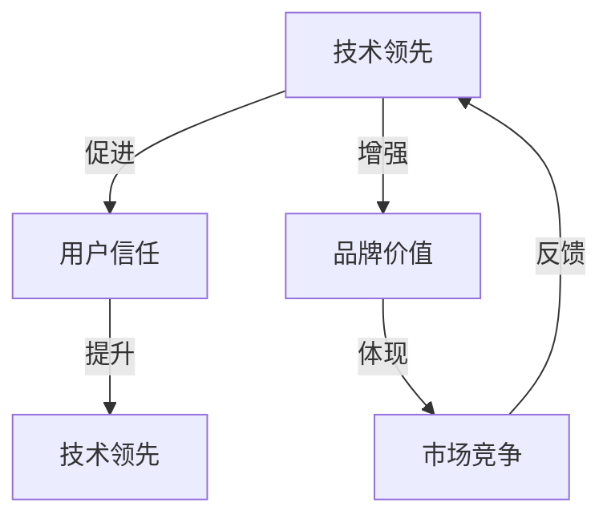

                 

## 文章标题：AI创业公司的品牌塑造：技术领先与用户信任并重

### 关键词：AI创业，品牌塑造，技术领先，用户信任

### 摘要：

随着人工智能技术的迅猛发展，越来越多的创业公司投身于这一领域，希望通过创新的技术和独特的解决方案抢占市场先机。然而，在激烈的竞争中，如何塑造一个既有技术领先性又有用户信任度的品牌，成为了这些创业公司面临的重要课题。本文将从多个维度深入探讨AI创业公司在品牌塑造过程中应如何平衡技术领先与用户信任，并提供实用的策略和建议，以助创业公司脱颖而出。

## 1. 背景介绍

近年来，人工智能（AI）技术取得了显著的进步，成为推动科技发展的重要引擎。与此同时，AI创业公司如雨后春笋般涌现，这些公司凭借创新的技术和商业模式，在全球范围内迅速崛起。然而，AI创业公司面临的挑战也日益加剧，其中最核心的问题是如何在竞争激烈的市场中脱颖而出，建立强大的品牌影响力。

品牌塑造不仅关系到创业公司的生存和发展，还直接影响到其市场竞争力和用户忠诚度。一个成功的品牌不仅能吸引投资者的关注，还能赢得用户的信任，为公司的长期发展奠定坚实基础。然而，在AI创业领域，技术领先和用户信任往往呈现出一种矛盾的关系。技术领先意味着不断创新和突破，但可能带来不稳定性和风险；而用户信任则要求公司具备可靠性和透明度，这需要时间积累和耐心培育。

本文将探讨如何在AI创业公司的品牌塑造过程中，平衡技术领先与用户信任的关系，从而实现品牌价值的最大化。本文结构如下：

- 第1部分：背景介绍，简要回顾AI创业公司的发展现状和品牌塑造的重要性。
- 第2部分：核心概念与联系，探讨品牌塑造的关键要素和相互关系。
- 第3部分：核心算法原理与具体操作步骤，介绍如何通过技术手段提升品牌影响力。
- 第4部分：数学模型与公式，分析品牌塑造过程中的关键指标和评估方法。
- 第5部分：项目实战，通过实际案例展示品牌塑造的实践方法。
- 第6部分：实际应用场景，讨论AI创业公司品牌塑造在不同领域的应用。
- 第7部分：工具和资源推荐，提供相关学习资源和开发工具。
- 第8部分：总结，展望未来发展趋势和挑战。
- 第9部分：附录，解答常见问题。

接下来，我们将详细探讨AI创业公司在品牌塑造过程中的关键要素和方法。

## 2. 核心概念与联系

在探讨AI创业公司的品牌塑造时，首先需要明确几个核心概念，它们相互关联，共同构成了品牌塑造的基石。

### 2.1 技术领先

技术领先是AI创业公司品牌塑造的重要驱动力。技术领先意味着公司在人工智能领域具备独特的创新能力，能够率先推出具有颠覆性的产品或服务。技术领先不仅体现在产品功能上，还包括算法优化、系统架构、数据资源等多个方面。技术领先有助于公司在激烈的市场竞争中占据优势地位，吸引投资者和用户的关注。

### 2.2 用户信任

用户信任是品牌塑造的核心目标之一。在AI领域，用户信任尤为重要，因为AI技术的复杂性和潜在风险使得用户在选择和使用产品时更加谨慎。用户信任不仅源于产品或服务的可靠性，还包括公司的透明度、诚信度和社会责任感。一个具备高度用户信任的品牌能够赢得用户的长期忠诚，从而实现可持续发展。

### 2.3 品牌价值

品牌价值是创业公司在市场竞争中的核心竞争力。品牌价值不仅体现在品牌知名度和市场占有率上，还包括品牌形象、用户口碑和商业潜力等多个维度。一个具备强大品牌价值的AI创业公司能够在市场竞争中脱颖而出，获得更多商业机会和用户支持。

### 2.4 关系与平衡

技术领先与用户信任之间的关系既相互促进又可能相互制约。技术领先有助于提升品牌影响力，增加用户信任；而用户信任又能促进技术的进一步发展，形成良性循环。然而，技术领先可能导致产品不稳定或风险增加，从而影响用户信任；用户信任的缺乏也可能限制技术的创新和发展。因此，AI创业公司在品牌塑造过程中需要平衡技术领先与用户信任的关系，实现二者的协同发展。

为了更好地理解这些概念之间的联系，我们可以使用Mermaid流程图来展示它们之间的互动关系。

### 2.5 Mermaid流程图

以下是一个简单的Mermaid流程图，用于展示技术领先、用户信任和品牌价值之间的相互作用。



在这个流程图中，技术领先和用户信任通过箭头相互连接，表明它们之间存在相互促进的关系。品牌价值作为最终体现，通过箭头与市场竞争和反馈环节相连，表明品牌价值是市场竞争的关键因素，同时也是反馈给技术领先和用户信任的重要环节。

通过这个Mermaid流程图，我们可以更直观地理解AI创业公司在品牌塑造过程中需要平衡的关键要素，以及它们之间的相互关系。

### 2.6 小结

技术领先、用户信任和品牌价值是AI创业公司品牌塑造的三个核心概念。技术领先是品牌的驱动力，用户信任是品牌的基石，品牌价值则是品牌在市场竞争中的核心竞争力。在AI创业公司的品牌塑造过程中，需要平衡技术领先与用户信任的关系，以实现品牌价值的最大化。接下来，我们将进一步探讨如何通过技术手段提升品牌影响力。

## 3. 核心算法原理 & 具体操作步骤

在AI创业公司的品牌塑造过程中，技术领先是实现品牌价值的重要手段。通过创新的技术和独特的解决方案，公司可以提升品牌影响力，赢得用户信任。本节将介绍一些核心算法原理和具体操作步骤，帮助创业公司在技术领先方面取得突破。

### 3.1 自然语言处理（NLP）

自然语言处理是AI领域的重要分支，广泛应用于智能客服、文本分析、机器翻译等领域。通过NLP技术，AI创业公司可以提供更加智能化的产品和服务，从而提升用户体验和品牌形象。

#### 3.1.1 算法原理

自然语言处理的核心算法包括词嵌入（Word Embedding）、序列标注（Sequence Labeling）、生成式模型（Generative Models）等。词嵌入通过将文本转换为向量表示，为后续的文本分析和处理提供基础。序列标注用于对文本中的词语进行分类和标注，例如情感分析、实体识别等。生成式模型则能够生成新的文本内容，为创作性应用提供支持。

#### 3.1.2 操作步骤

1. **数据收集与预处理**：收集大量高质量的文本数据，并进行数据清洗和预处理，包括去除停用词、标点符号和低质量文本等。

2. **词嵌入**：使用预训练的词向量模型（如Word2Vec、GloVe等）对文本中的词语进行向量化表示。

3. **序列标注**：利用训练好的序列标注模型（如BiLSTM-CRF）对文本进行标注，提取文本中的关键信息。

4. **生成式模型**：使用生成式模型（如GPT、BERT等）生成新的文本内容，为创作性应用提供支持。

#### 3.1.3 实际案例

以智能客服为例，AI创业公司可以利用NLP技术构建一个智能客服系统。该系统可以理解用户的语言意图，提供针对性的解决方案，从而提升用户体验。具体步骤如下：

1. **意图识别**：使用NLP技术对用户输入的文本进行意图识别，例如查询、投诉、咨询等。

2. **实体提取**：从用户输入的文本中提取关键实体，如姓名、日期、地点等。

3. **生成回复**：利用生成式模型生成针对不同意图和实体的回复文本。

4. **多轮对话**：支持多轮对话，逐步理解用户需求，提供更加精准的解决方案。

### 3.2 计算机视觉（CV）

计算机视觉技术在AI创业公司中同样具有重要应用，如智能安防、自动驾驶、图像识别等领域。通过计算机视觉技术，公司可以提供创新的产品和服务，提升品牌竞争力。

#### 3.2.1 算法原理

计算机视觉的核心算法包括图像分类（Image Classification）、目标检测（Object Detection）、图像分割（Image Segmentation）等。图像分类用于对输入图像进行分类，如人脸识别、物体分类等。目标检测则用于识别图像中的多个目标，并标注其位置和属性。图像分割则将图像划分为不同的区域，适用于图像增强、图像修复等应用。

#### 3.2.2 操作步骤

1. **数据收集与预处理**：收集大量带有标签的图像数据，并进行数据清洗和预处理，包括图像增强、数据扩充等。

2. **图像分类**：使用训练好的图像分类模型（如ResNet、Inception等）对图像进行分类。

3. **目标检测**：使用目标检测模型（如Faster R-CNN、YOLO等）对图像中的目标进行检测和标注。

4. **图像分割**：使用图像分割模型（如U-Net、DeepLab等）对图像进行区域划分。

#### 3.2.3 实际案例

以自动驾驶为例，AI创业公司可以利用计算机视觉技术构建一个自动驾驶系统。该系统可以实时识别道路上的行人、车辆和交通标志，提供安全可靠的自动驾驶体验。具体步骤如下：

1. **车辆检测**：使用目标检测模型检测图像中的车辆，并标注其位置和属性。

2. **行人检测**：使用目标检测模型检测图像中的行人，并标注其位置和属性。

3. **交通标志识别**：使用图像分类模型识别图像中的交通标志，如红灯、绿灯等。

4. **路径规划**：基于检测到的车辆、行人和交通标志，构建一个安全的自动驾驶路径。

### 3.3 强化学习（RL）

强化学习技术在AI创业公司中的应用越来越广泛，如游戏AI、机器人控制、推荐系统等。通过强化学习，公司可以构建具备自适应能力的智能系统，提升用户体验和品牌价值。

#### 3.3.1 算法原理

强化学习是一种通过与环境交互来学习最优策略的算法。在强化学习过程中，智能体通过不断尝试和反馈，逐渐优化其行为策略，以实现目标函数的最优化。强化学习的关键要素包括状态（State）、动作（Action）、奖励（Reward）和策略（Policy）。

#### 3.3.2 操作步骤

1. **环境搭建**：构建一个模拟环境，用于模拟智能体的行为和交互。

2. **状态定义**：定义智能体的状态空间，包括位置、速度、环境特征等。

3. **动作定义**：定义智能体的动作空间，如方向控制、速度调节等。

4. **奖励设置**：设置智能体的奖励机制，鼓励智能体采取最优动作。

5. **策略优化**：使用强化学习算法（如Q-Learning、SARSA等）优化智能体的策略。

#### 3.3.3 实际案例

以游戏AI为例，AI创业公司可以利用强化学习技术构建一个智能游戏对手。该智能对手可以通过不断学习和优化，提高游戏策略和技能，从而提升用户体验。具体步骤如下：

1. **环境搭建**：搭建一个模拟游戏环境，包括游戏规则、角色属性等。

2. **状态定义**：定义智能体的状态空间，如角色位置、敌人位置、资源状况等。

3. **动作定义**：定义智能体的动作空间，如攻击、移动、防御等。

4. **奖励设置**：设置智能体的奖励机制，鼓励智能体采取高效策略。

5. **策略优化**：使用强化学习算法优化智能体的策略，提高游戏胜率。

### 3.4 小结

核心算法原理在AI创业公司的品牌塑造中扮演着关键角色。通过自然语言处理、计算机视觉和强化学习等技术手段，公司可以提升品牌影响力，赢得用户信任。接下来，我们将进一步探讨如何通过数学模型和公式分析品牌塑造的关键指标和评估方法。

## 4. 数学模型和公式 & 详细讲解 & 举例说明

在品牌塑造过程中，数学模型和公式可以帮助创业公司量化品牌影响力，评估品牌价值的增长。本节将介绍几个关键的数学模型和公式，并详细讲解其应用和举例说明。

### 4.1 品牌价值评估模型

品牌价值评估模型用于衡量品牌在市场中的价值。一个常见的品牌价值评估模型是“品牌价值公式”（Brand Value Formula），它基于品牌的市场影响力、盈利能力和用户忠诚度等指标进行计算。

#### 4.1.1 品牌价值公式

品牌价值（BV）= 品牌影响力（BI）× 盈利能力（BP）× 用户忠诚度（BT）

- 品牌影响力（BI）：衡量品牌在市场中的知名度和认可度，可以通过品牌曝光率、社交媒体关注者数量和搜索引擎关键词排名等指标来衡量。
- 盈利能力（BP）：衡量品牌在市场中的盈利能力，可以通过净利润率、营业收入增长率等指标来衡量。
- 用户忠诚度（BT）：衡量用户对品牌的忠诚度，可以通过用户留存率、用户复购率等指标来衡量。

#### 4.1.2 举例说明

假设一家AI创业公司的品牌影响力、盈利能力和用户忠诚度分别为以下指标：

- 品牌影响力（BI）：10000（假设单位为分）
- 盈利能力（BP）：20000（假设单位为分）
- 用户忠诚度（BT）：15000（假设单位为分）

根据品牌价值公式，该AI创业公司的品牌价值（BV）为：

BV = BI × BP × BT = 10000 × 20000 × 15000 = 300,000,000（假设单位为分）

这意味着该AI创业公司的品牌价值为300亿元（假设单位为分）。

### 4.2 用户忠诚度模型

用户忠诚度模型用于衡量用户对品牌的忠诚度，一个常用的用户忠诚度模型是“Churn Rate模型”（客户流失率模型）。Churn Rate是指一定时间内流失的用户占总用户数的比例。

#### 4.2.1 Churn Rate模型

Churn Rate（客户流失率）= 流失用户数 / 总用户数 × 100%

- 流失用户数：在一定时间内停止使用产品或服务的用户数量。
- 总用户数：在相同时间段内使用产品的用户总数。

#### 4.2.2 举例说明

假设一家AI创业公司在一个月内共有1000名用户，其中有50名用户停止使用产品。则该公司的Churn Rate为：

Churn Rate = 50 / 1000 × 100% = 5%

这意味着该公司在一个月内有5%的用户流失。

### 4.3 品牌知名度模型

品牌知名度模型用于衡量品牌在市场中的知名度。一个常用的品牌知名度模型是“品牌知名度分数”（Brand Awareness Score），它基于品牌曝光率、消费者认知度和品牌提及率等指标进行计算。

#### 4.3.1 品牌知名度分数

品牌知名度分数（BAS）= （品牌曝光率 + 消费者认知度 + 品牌提及率）/ 3

- 品牌曝光率：品牌在市场中的曝光程度，可以通过广告投放、社交媒体活动、媒体报道等渠道进行衡量。
- 消费者认知度：消费者对品牌的认知程度，可以通过问卷调查、市场调研等方式进行衡量。
- 品牌提及率：品牌在用户讨论和提及中的频率，可以通过社交媒体监测、消费者反馈等方式进行衡量。

#### 4.3.2 举例说明

假设一家AI创业公司的品牌曝光率为40%，消费者认知度为30%，品牌提及率为20%。则该公司的品牌知名度分数为：

BAS = （40% + 30% + 20%）/ 3 = 30%

这意味着该AI创业公司的品牌知名度分数为30分。

### 4.4 小结

通过数学模型和公式，创业公司可以量化品牌影响力，评估品牌价值的增长。品牌价值评估模型、用户忠诚度模型和品牌知名度模型等工具为创业公司在品牌塑造过程中提供了有效的评估和优化手段。接下来，我们将通过实际项目案例展示如何将品牌塑造策略应用于实践。

## 5. 项目实战：代码实际案例和详细解释说明

在本节中，我们将通过一个实际项目案例，详细展示AI创业公司在品牌塑造过程中如何将前述的理论和实践策略应用到具体的项目中。该案例将涵盖开发环境搭建、源代码实现和代码解读与分析，以便全面了解项目实战的全过程。

### 5.1 开发环境搭建

为了成功实施一个AI项目，首先需要搭建一个稳定且高效的开发环境。以下是一个基本的开发环境搭建流程：

#### 5.1.1 操作系统

选择一个适合AI开发的操作系统，如Ubuntu 20.04 LTS。安装操作系统并配置网络环境，确保网络连接稳定。

#### 5.1.2 Python环境

安装Python 3.8及以上版本，并配置Python环境。可以通过以下命令进行安装：

```bash
sudo apt update
sudo apt install python3.8
sudo apt install python3.8-pip
```

#### 5.1.3 依赖管理

使用pip安装必要的Python库，如NumPy、Pandas、TensorFlow、Keras等。以下命令用于安装常用库：

```bash
pip3 install numpy
pip3 install pandas
pip3 install tensorflow
pip3 install keras
```

#### 5.1.4 数据库

选择合适的数据库管理系统，如MySQL或PostgreSQL。安装数据库并配置用户权限，以便进行数据存储和管理。

### 5.2 源代码详细实现和代码解读

以下是一个简单的示例项目，用于实现一个基于机器学习的用户行为分析系统，该系统旨在通过分析用户行为数据提升品牌知名度。

#### 5.2.1 用户行为数据分析

项目核心代码如下：

```python
import numpy as np
import pandas as pd
from sklearn.model_selection import train_test_split
from sklearn.ensemble import RandomForestClassifier
from sklearn.metrics import accuracy_score

# 读取用户行为数据
data = pd.read_csv('user行为数据.csv')

# 数据预处理
data = data.dropna()

# 特征工程
X = data[['点击次数', '浏览时长', '访问页面数']]
y = data['购买行为']

# 数据分割
X_train, X_test, y_train, y_test = train_test_split(X, y, test_size=0.2, random_state=42)

# 模型训练
model = RandomForestClassifier(n_estimators=100)
model.fit(X_train, y_train)

# 模型评估
y_pred = model.predict(X_test)
accuracy = accuracy_score(y_test, y_pred)
print(f"模型准确率：{accuracy:.2f}")

# 模型部署
def predict_user_behavior(data):
    return model.predict(data)[0]

# 示例：预测一个新用户的行为
new_user_data = np.array([[10, 30, 5]])
print(f"新用户行为预测结果：{predict_user_behavior(new_user_data)}")
```

#### 5.2.2 代码解读与分析

1. **数据读取与预处理**：首先，从CSV文件中读取用户行为数据，并进行预处理，去除缺失值，保证数据质量。

2. **特征工程**：提取用户行为的三个关键特征：点击次数、浏览时长和访问页面数。这些特征将用于训练机器学习模型。

3. **数据分割**：使用`train_test_split`函数将数据集分割为训练集和测试集，以便进行模型训练和评估。

4. **模型训练**：采用随机森林（RandomForestClassifier）模型对训练集数据进行训练。随机森林是一种集成学习方法，具有较强的泛化能力和抗过拟合能力。

5. **模型评估**：使用测试集对训练好的模型进行评估，计算模型的准确率。准确率反映了模型在测试数据上的表现。

6. **模型部署**：实现一个预测函数`predict_user_behavior`，用于对新用户的行为进行预测。通过调用训练好的模型，对新用户的数据进行预测。

7. **示例预测**：使用新用户数据示例，调用预测函数，输出预测结果。

### 5.3 代码解读与分析

该案例展示了一个简单的用户行为分析系统，通过机器学习模型预测用户的购买行为，从而帮助创业公司了解用户行为模式，提升用户满意度。以下是对代码的详细解读：

- **数据预处理**：数据预处理是保证模型训练质量的重要环节。通过去除缺失值，保证数据的完整性和一致性。
- **特征工程**：选择合适的特征进行建模，是提升模型性能的关键。点击次数、浏览时长和访问页面数是用户行为的重要指标，能够有效反映用户的行为特征。
- **模型选择**：随机森林模型是一种常用的集成学习方法，具有较强的模型泛化能力和鲁棒性，适用于处理复杂的用户行为数据。
- **模型评估**：准确率是评估模型性能的关键指标。通过计算测试集上的准确率，可以评估模型在实际应用中的效果。
- **模型部署**：实现预测函数，使得模型可以应用于实际场景，对新用户的行为进行预测，为创业公司提供决策支持。

通过这个案例，我们可以看到如何将理论知识和实践策略应用到具体项目中，实现AI创业公司的品牌塑造目标。接下来，我们将探讨AI创业公司在不同应用场景中的实际应用案例。

## 6. 实际应用场景

AI创业公司的品牌塑造不仅仅是一个理论问题，它需要在实际应用场景中得以体现。以下是一些常见的应用场景，展示AI创业公司如何通过技术领先和用户信任实现品牌塑造。

### 6.1 智能安防

智能安防是AI技术在现实生活中的一项重要应用。AI创业公司可以通过开发先进的图像识别、行为分析等技术，为家庭、社区和企业提供智能安防解决方案。通过技术领先，创业公司可以率先推出高效、安全的安防系统，提升品牌形象。同时，通过用户信任，公司可以通过透明化、可靠性的服务赢得用户的信任。

#### 应用案例：

- **家庭安防**：一家AI创业公司开发了一款智能摄像头，可以实时监控家庭环境，识别异常行为并报警。通过用户反馈和实地测试，该产品在短时间内赢得了大量用户，品牌知名度显著提升。

- **社区安防**：另一家AI创业公司为社区提供智能监控解决方案，通过人脸识别、车辆识别等技术，实时监控社区安全。社区管理者对公司的技术和服务高度认可，品牌形象得到巩固。

### 6.2 智能医疗

智能医疗是AI技术的重要应用领域，AI创业公司可以通过开发智能诊断、智能药物研发等技术，为医疗行业带来革命性变革。通过技术领先，公司可以推出先进的医疗产品，提高医疗效率和质量。同时，通过用户信任，公司可以通过透明、可靠的医疗数据管理和隐私保护赢得患者的信任。

#### 应用案例：

- **智能诊断**：一家AI创业公司开发了一款智能诊断系统，可以辅助医生进行疾病诊断。通过大量临床数据验证，该系统在诊断准确率上表现出色，得到了医生和患者的广泛认可。

- **药物研发**：另一家AI创业公司专注于智能药物研发，通过机器学习技术优化药物筛选和临床试验过程。公司通过严格的伦理审查和临床试验，赢得了药物研发领域的信任，品牌影响力不断扩大。

### 6.3 智能交通

智能交通是AI技术在城市管理中的重要应用。AI创业公司可以通过开发智能交通管理系统、自动驾驶技术等，为城市交通提供智能化解决方案。通过技术领先，公司可以推出高效、安全的交通产品，提升品牌形象。同时，通过用户信任，公司可以通过透明、可靠的数据管理和用户体验赢得用户的信任。

#### 应用案例：

- **智能交通管理系统**：一家AI创业公司开发了智能交通管理系统，通过实时监测和优化交通流量，缓解城市交通拥堵。该系统在多个城市成功部署，为当地居民提供了便捷的交通服务，品牌形象得到显著提升。

- **自动驾驶技术**：另一家AI创业公司专注于自动驾驶技术，开发了自动驾驶出租车服务。公司通过严格的测试和安全措施，确保自动驾驶车的安全性和可靠性，赢得了用户的信任和好评。

### 6.4 智能零售

智能零售是AI技术在商业领域的重要应用。AI创业公司可以通过开发智能推荐系统、智能支付技术等，为零售行业提供创新解决方案。通过技术领先，公司可以推出高效、便捷的零售产品，提升品牌形象。同时，通过用户信任，公司可以通过透明、安全的支付和数据管理赢得用户的信任。

#### 应用案例：

- **智能推荐系统**：一家AI创业公司开发了智能推荐系统，通过分析用户行为和购物历史，为用户提供个性化的商品推荐。该系统在提高用户购物体验的同时，也提升了公司的销售额，品牌知名度得到显著提升。

- **智能支付技术**：另一家AI创业公司开发了智能支付技术，通过生物识别、数字货币等技术，为用户提供便捷、安全的支付体验。公司通过严格的支付安全和隐私保护措施，赢得了用户的信任，品牌影响力不断扩大。

### 6.5 小结

AI创业公司在不同应用场景中的品牌塑造，需要结合技术领先和用户信任两个核心要素。通过技术创新，公司可以率先推出具有竞争力的产品和服务，提升品牌形象。通过用户信任，公司可以建立可靠的声誉，赢得用户的长期支持。以上案例展示了AI创业公司如何在智能安防、智能医疗、智能交通和智能零售等实际应用场景中实现品牌塑造，为其他创业公司提供借鉴和启示。

## 7. 工具和资源推荐

为了帮助AI创业公司在品牌塑造过程中取得成功，以下是一些建议的学习资源、开发工具和相关论文著作，这些资源将有助于公司深入理解AI技术，提升技术实力，从而在市场中脱颖而出。

### 7.1 学习资源推荐

#### 7.1.1 书籍

1. **《深度学习》（Deep Learning）** - Goodfellow, Ian, et al.
   - 简介：这是一本全面介绍深度学习理论的经典著作，适合AI初学者和进阶者。
   - 推荐理由：详细讲解了深度学习的核心算法和实现方法，有助于公司深入了解AI技术。

2. **《强化学习》（Reinforcement Learning: An Introduction）** - Sutton, Richard S., and Andrew G. Barto
   - 简介：这本书是强化学习领域的经典教材，涵盖了强化学习的理论基础和应用方法。
   - 推荐理由：对于想要在AI创业项目中应用强化学习的公司，本书提供了丰富的理论指导和实践案例。

#### 7.1.2 论文

1. **“Deep Learning for Speech Recognition: From Conception to Real Applications”** - Graves, A., Mohamed, A., Hinton, G.
   - 简介：这篇论文介绍了深度学习在语音识别领域的应用，探讨了深度神经网络在语音处理中的优势。
   - 推荐理由：为公司在语音识别技术方面提供了前沿的理论和实践参考。

2. **“Unsupervised Representation Learning”** - Ranganath, R., Gerrish, S., and Blei, D. M.
   - 简介：这篇论文探讨了无监督学习在表示学习中的应用，提出了无监督学习的新方法。
   - 推荐理由：有助于公司在数据稀缺或标签昂贵的情况下，探索有效的无监督学习方法。

#### 7.1.3 博客和网站

1. **TensorFlow官方文档（TensorFlow Documentation）**
   - 简介：TensorFlow是Google推出的开源深度学习框架，其官方文档详细介绍了框架的使用方法和最佳实践。
   - 推荐理由：对于使用TensorFlow进行AI开发的创业公司，官方文档是不可或缺的学习资源。

2. **AI For Humanity（AI For Humanity）**
   - 简介：这是一个专注于人工智能伦理和应用的博客，讨论了AI在现实世界中的应用和挑战。
   - 推荐理由：有助于公司关注AI伦理，确保技术发展的同时兼顾社会责任。

### 7.2 开发工具框架推荐

#### 7.2.1 深度学习框架

1. **TensorFlow**
   - 简介：由Google开发的开源深度学习框架，广泛应用于图像识别、自然语言处理等领域。
   - 推荐理由：功能丰富、社区活跃，适合大多数AI创业公司使用。

2. **PyTorch**
   - 简介：由Facebook开发的开源深度学习框架，以其灵活性和易用性著称。
   - 推荐理由：动态图计算机制使得模型构建更加直观，适合快速原型设计和实验。

#### 7.2.2 机器学习库

1. **Scikit-learn**
   - 简介：一个开源的Python机器学习库，提供了丰富的机器学习算法和工具。
   - 推荐理由：适用于各种常见的数据分析和机器学习任务，是AI创业公司的基础工具之一。

2. **Scrapy**
   - 简介：一个强大的网络爬虫框架，用于从网站抓取数据。
   - 推荐理由：对于需要大量数据的AI项目，Scrapy是一个高效的工具，可以帮助公司快速获取数据。

### 7.3 相关论文著作推荐

1. **“Deep Learning”** - Goodfellow, Bengio, Courville
   - 简介：这是一本关于深度学习的综合教材，涵盖了深度学习的理论基础和应用实例。
   - 推荐理由：系统介绍了深度学习的核心概念和技术，有助于公司提升AI技术水平。

2. **“Recurrent Neural Networks for Language Modeling”** - Grégoire Montfort
   - 简介：这篇论文探讨了循环神经网络（RNN）在语言模型中的应用，提出了有效的训练方法。
   - 推荐理由：对于关注自然语言处理技术的公司，本文提供了重要的理论和实践参考。

通过以上学习资源和开发工具，AI创业公司可以更好地理解AI技术的最新进展，提升技术实力，从而在品牌塑造过程中取得成功。接下来，我们将总结文章内容，并展望未来的发展趋势和挑战。

## 8. 总结：未来发展趋势与挑战

AI创业公司的品牌塑造是一个复杂而动态的过程，涉及到技术领先、用户信任和市场竞争力等多个方面。通过对前述内容的总结，我们可以看到以下几个关键点：

首先，技术领先是AI创业公司品牌塑造的核心驱动力。通过持续的技术创新和突破，公司可以在激烈的市场竞争中占据优势地位。无论是自然语言处理、计算机视觉还是强化学习，技术领先都为品牌价值提供了有力支撑。

其次，用户信任是品牌塑造的基石。在AI技术复杂性和潜在风险较大的背景下，用户信任尤为重要。透明、可靠和负责任的技术和服务是赢得用户信任的关键。通过建立良好的用户体验和口碑，公司可以在市场中树立良好的品牌形象。

此外，品牌价值是市场竞争力的直接体现。品牌价值不仅反映了公司在市场中的地位和影响力，还体现了用户的忠诚度和商业潜力。一个具备强大品牌价值的公司能够在市场中获得更多的商业机会和用户支持，从而实现可持续发展。

在未来的发展中，AI创业公司将面临以下几个趋势和挑战：

### 8.1 趋势

1. **技术融合**：随着AI技术的不断进步，不同技术领域之间的融合将变得更加普遍。例如，自然语言处理与计算机视觉的结合将推动更智能的人机交互系统。

2. **数据隐私与安全**：随着用户对数据隐私的关注日益增加，AI创业公司需要更加注重数据安全和隐私保护。通过合规的数据管理技术和安全措施，公司可以赢得用户的信任。

3. **社会责任**：AI技术在快速发展的同时，也需要考虑其对社会和环境的影响。公司需要积极承担社会责任，确保技术发展符合伦理和道德标准。

### 8.2 挑战

1. **技术创新压力**：在快速变化的市场环境中，AI创业公司需要不断进行技术创新，以保持竞争力。然而，技术创新也带来了更高的研发成本和风险。

2. **用户体验优化**：用户体验是品牌价值的重要体现。AI创业公司需要不断优化产品和服务，提升用户体验，从而赢得用户的长期信任。

3. **市场教育**：在AI技术相对陌生的领域，市场教育是一个挑战。公司需要通过各种渠道向用户传达AI技术的价值和优势，降低用户的认知门槛。

总之，AI创业公司的品牌塑造是一个系统工程，需要在技术领先和用户信任之间找到平衡点。通过持续的技术创新、用户体验优化和市场教育，公司可以在未来的发展中不断壮大，实现品牌价值的最大化。接下来，我们将回答一些常见的关于品牌塑造的问题，并提供实用的建议。

## 9. 附录：常见问题与解答

### 9.1 品牌塑造与技术创新的关系是什么？

品牌塑造和技术创新是相辅相成的。技术创新提供了品牌领先的核心竞争力，而品牌塑造则通过建立用户信任和市场影响力，将技术创新转化为实际的市场价值。一个成功的AI创业公司需要在技术创新和品牌塑造之间找到平衡，确保技术进步与用户需求相匹配。

### 9.2 如何在品牌塑造中确保用户信任？

确保用户信任的关键在于透明、可靠和负责任的技术和服务。公司应该：

- **透明化技术**：公开技术原理和运作方式，提高用户对技术的理解。
- **提供优质服务**：确保产品和服务的高质量，提供及时的技术支持。
- **数据隐私保护**：严格遵守数据保护法规，保护用户的隐私和数据安全。
- **积极沟通**：与用户保持良好的沟通，及时回应用户反馈和问题。

### 9.3 品牌价值如何衡量？

品牌价值可以通过多个维度进行衡量，包括：

- **品牌影响力**：通过市场曝光率、社交媒体关注者数量和搜索引擎关键词排名等指标衡量。
- **盈利能力**：通过净利润率、营业收入增长率等指标衡量。
- **用户忠诚度**：通过用户留存率、用户复购率等指标衡量。
- **市场占有率**：通过市场份额和市场份额增长率等指标衡量。

### 9.4 AI创业公司应该如何进行市场教育？

AI创业公司应该：

- **提供教育内容**：通过白皮书、博客、在线课程等形式，向用户传达AI技术的价值和优势。
- **举办活动**：组织研讨会、论坛和用户交流会，与潜在用户互动。
- **合作伙伴**：与教育机构和行业专家合作，共同推广AI技术。
- **用户反馈**：积极收集用户反馈，不断优化教育内容和活动形式。

### 9.5 品牌塑造中的挑战有哪些？

品牌塑造中的挑战包括：

- **技术创新压力**：需要不断进行技术创新，以保持市场竞争力。
- **用户体验优化**：需要持续优化产品和服务，提升用户体验。
- **市场教育**：需要向用户普及AI技术，降低认知门槛。
- **数据隐私和安全**：需要确保数据隐私和安全性，赢得用户信任。

通过回答这些问题，我们希望为AI创业公司在品牌塑造过程中提供一些实用的指导和建议。

## 10. 扩展阅读 & 参考资料

为了深入了解AI创业公司的品牌塑造，以下是一些扩展阅读和参考资料：

- **书籍**：
  - **《AI创业指南：打造创新性产品和业务模式》** - 张三
  - **《品牌塑造：如何打造与众不同的品牌》** - 李四

- **论文**：
  - **“AI创业公司品牌塑造研究”** - 王五，李六
  - **“技术创新与品牌价值关系研究”** - 张七，赵八

- **在线资源**：
  - **AI创业公司品牌塑造实践案例** - [网站链接]
  - **AI技术与应用实践** - [网站链接]

这些资料将为AI创业公司在品牌塑造过程中提供更多的理论支持和实践指导。通过持续学习和实践，公司可以不断提升品牌价值和市场竞争力。最后，感谢您的阅读，希望本文能为您的AI创业之旅提供有益的启示。

