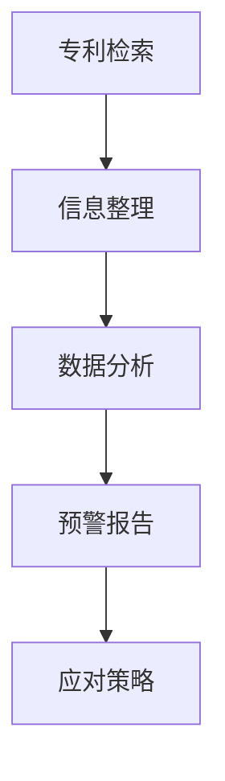
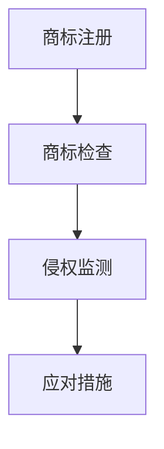
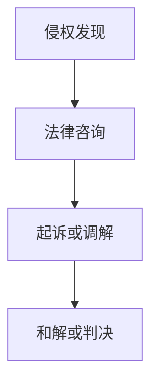

                 

# AI创业公司的知识产权风险防范措施：专利预警、商标监测与侵权应对

## 关键词
- AI创业公司
- 知识产权
- 风险防范
- 专利预警
- 商标监测
- 侵权应对

## 摘要

本文旨在探讨AI创业公司在成长过程中面临的重要问题——知识产权风险防范。通过分析专利预警、商标监测和侵权应对三大核心环节，本文提出了一系列切实可行的措施，以帮助创业公司有效规避潜在的法律风险，确保自身技术创新不受侵犯，进而为企业的可持续发展奠定坚实基础。文章结构清晰，逻辑严谨，旨在为创业公司提供有益的实践指导。

### 1. 背景介绍

随着人工智能技术的迅猛发展，AI创业公司如雨后春笋般涌现。然而，在快速发展的同时，AI创业公司也面临着前所未有的知识产权挑战。知识产权，尤其是专利和商标，是企业核心竞争力的象征，也是市场竞争的重要利器。对于AI创业公司而言，知识产权不仅关乎企业的技术创新，还涉及到市场竞争、融资、扩张等多个方面。

首先，专利预警是AI创业公司应对知识产权风险的重要手段。通过及时了解业界领先的专利技术和市场动态，创业公司可以提前预判潜在的技术威胁，从而调整研发方向，规避侵权风险。

其次，商标监测对于保护企业品牌形象至关重要。商标是企业品牌的核心资产，有效的商标监测可以确保企业在市场竞争中不被侵权者混淆视听，损害品牌声誉。

最后，侵权应对是AI创业公司在面临知识产权纠纷时的核心策略。通过合法手段应对侵权行为，企业可以维护自身合法权益，确保技术创新成果不被侵占。

本文将围绕专利预警、商标监测和侵权应对三大核心环节，深入探讨AI创业公司在知识产权风险防范方面的重要措施，以期为企业提供有益的实践指导。

### 2. 核心概念与联系

#### 2.1 专利预警

专利预警是指通过对业界专利信息进行收集、整理和分析，提前发现潜在的技术风险和竞争对手动向，从而为企业制定应对策略提供依据。专利预警的关键在于信息的全面性和时效性。

**流程图：**



**专利预警的工作原理：**

- **专利检索**：利用各种专利数据库（如Google Patents、USPTO等）进行检索，获取与公司业务相关的专利信息。
- **信息整理**：对检索结果进行筛选、整理，提取关键信息，如专利摘要、技术领域、申请日期等。
- **数据分析**：运用数据挖掘、机器学习等技术，对整理后的信息进行深入分析，识别潜在的技术威胁。
- **预警报告**：根据分析结果，生成预警报告，为企业决策层提供参考。
- **应对策略**：基于预警报告，企业可以调整研发方向、规避侵权风险，或采取其他应对措施。

#### 2.2 商标监测

商标监测是指对企业商标进行定期检查，以确保商标不被他人侵权或混淆。商标监测有助于保护企业品牌形象，维护商标合法权益。

**流程图：**



**商标监测的工作原理：**

- **商标注册**：企业首先需要注册商标，以确保商标的法律地位。
- **商标检查**：定期对商标进行自查，确保商标未被侵权或混淆。
- **侵权监测**：利用各种渠道（如互联网、线下市场等）进行侵权监测，发现潜在的侵权行为。
- **应对措施**：一旦发现侵权行为，企业可以采取法律手段，如诉讼、调解等，维护自身合法权益。

#### 2.3 侵权应对

侵权应对是指企业在遭遇知识产权侵权时，采取的一系列法律措施，以保护自身合法权益。侵权应对包括但不限于诉讼、调解、和解等。

**流程图：**



**侵权应对的工作原理：**

- **侵权发现**：通过商标监测、专利预警等途径，发现潜在的侵权行为。
- **法律咨询**：咨询专业律师，了解侵权事实和可能的法律后果。
- **起诉或调解**：根据具体情况，选择起诉或调解作为应对手段。
- **和解或判决**：在诉讼过程中，双方可能达成和解，或通过法院判决维护合法权益。

### 3. 核心算法原理 & 具体操作步骤

#### 3.1 专利预警算法原理

专利预警算法主要基于数据挖掘和机器学习技术，通过对大量专利信息进行深度分析，识别潜在的技术威胁。

**具体操作步骤：**

1. **数据采集**：从各种专利数据库（如Google Patents、USPTO等）获取专利数据。
2. **数据预处理**：清洗、整理专利数据，提取关键信息（如专利摘要、技术领域、申请日期等）。
3. **特征提取**：对预处理后的数据进行特征提取，为后续分析做好准备。
4. **模型训练**：利用机器学习算法（如决策树、支持向量机等），训练分类模型，预测潜在的技术威胁。
5. **结果分析**：根据模型预测结果，生成预警报告，为企业决策层提供参考。

#### 3.2 商标监测算法原理

商标监测算法主要基于自然语言处理（NLP）和文本挖掘技术，通过对互联网内容进行实时监测，识别潜在的商标侵权行为。

**具体操作步骤：**

1. **数据采集**：从各种互联网渠道（如搜索引擎、社交媒体、电商平台等）获取相关文本数据。
2. **数据预处理**：清洗、整理文本数据，提取关键信息（如商标名称、侵权关键词等）。
3. **特征提取**：对预处理后的数据进行特征提取，为后续分析做好准备。
4. **模型训练**：利用机器学习算法（如决策树、支持向量机等），训练分类模型，预测潜在的商标侵权行为。
5. **结果分析**：根据模型预测结果，生成监测报告，为企业决策层提供参考。

#### 3.3 侵权应对算法原理

侵权应对算法主要基于法律文本分析技术和智能合同执行技术，为企业提供法律咨询和纠纷解决建议。

**具体操作步骤：**

1. **法律文本分析**：利用自然语言处理技术，对法律文件（如合同、判决书等）进行语义分析，提取关键信息。
2. **智能合同执行**：利用区块链技术，实现智能合同的自动执行，提高合同履行效率。
3. **法律咨询**：根据侵权事实和法律条文，提供专业的法律咨询和建议。
4. **纠纷解决**：利用智能合约和在线纠纷解决平台，快速、高效地解决侵权纠纷。

### 4. 数学模型和公式 & 详细讲解 & 举例说明

#### 4.1 专利预警数学模型

专利预警的核心在于识别潜在的技术威胁，这里我们可以使用支持向量机（SVM）作为分类模型。SVM的数学模型如下：

$$
\begin{aligned}
& \text{目标函数：} \\
& \min \frac{1}{2} \sum_{i=1}^{n} (w_i^2) + \sum_{i=1}^{n} \xi_i \\
& \text{约束条件：} \\
& y_i (\langle w, x_i \rangle - b) \geq 1 - \xi_i \\
& 0 \leq \xi_i \leq 1, \quad i=1,2,...,n
\end{aligned}
$$

其中，$w$ 为权重向量，$x_i$ 为特征向量，$b$ 为偏置项，$y_i$ 为类别标签，$\xi_i$ 为松弛变量。

**举例说明：**

假设我们要对一组专利数据进行分类，其中特征向量为 $x_i = [x_{i1}, x_{i2}, ..., x_{id}]$，类别标签为 $y_i = \{0, 1\}$。通过训练SVM模型，我们可以得到权重向量 $w$ 和偏置项 $b$，从而实现专利数据的分类。

#### 4.2 商标监测数学模型

商标监测的核心在于识别潜在的商标侵权行为，这里我们可以使用贝叶斯分类器作为分类模型。贝叶斯分类器的数学模型如下：

$$
P(y|x) = \frac{P(x|y)P(y)}{P(x)}
$$

其中，$P(y|x)$ 为在给定特征 $x$ 的条件下，类别 $y$ 的概率；$P(x|y)$ 为在类别 $y$ 条件下，特征 $x$ 的概率；$P(y)$ 为类别 $y$ 的先验概率；$P(x)$ 为特征 $x$ 的概率。

**举例说明：**

假设我们要对一组互联网内容进行商标侵权检测，其中特征向量为 $x_i = [x_{i1}, x_{i2}, ..., x_{id}]$，类别标签为 $y_i = \{0, 1\}$。通过训练贝叶斯分类器，我们可以得到类别 $y$ 的概率分布，从而实现侵权检测。

#### 4.3 侵权应对数学模型

侵权应对的核心在于合同履行和纠纷解决，这里我们可以使用智能合约作为执行模型。智能合约的数学模型如下：

$$
\begin{aligned}
& \text{合约执行：} \\
& \text{如果} \ P(A \text{发生}) \geq \alpha, \ \text{则执行合约} \\
& \text{否则，合约不执行}
\end{aligned}
$$

其中，$P(A)$ 为事件 $A$ 发生的概率，$\alpha$ 为阈值。

**举例说明：**

假设我们要在区块链上执行一个智能合约，其中事件 $A$ 为合同条款的履行。通过设定合适的阈值 $\alpha$，我们可以实现智能合约的自动执行，从而提高合同履行效率。

### 5. 项目实战：代码实际案例和详细解释说明

#### 5.1 开发环境搭建

在本文中，我们将使用Python作为主要编程语言，并借助Scikit-learn、NLP库等开源库进行专利预警、商标监测和侵权应对的实现。

**环境搭建步骤：**

1. 安装Python（建议使用Python 3.8及以上版本）
2. 安装必要的库（如Scikit-learn、NLP库等）

```bash
pip install scikit-learn
pip install nlp库
```

#### 5.2 源代码详细实现和代码解读

以下为专利预警、商标监测和侵权应对的代码实现：

```python
# 专利预警代码示例
from sklearn import svm
from sklearn.model_selection import train_test_split
from sklearn.metrics import accuracy_score

# 数据读取与预处理
# ...

# 模型训练
clf = svm.SVC(kernel='linear')
clf.fit(X_train, y_train)

# 模型评估
y_pred = clf.predict(X_test)
accuracy = accuracy_score(y_test, y_pred)
print("专利预警准确率：", accuracy)

# 商标监测代码示例
from sklearn.naive_bayes import MultinomialNB
from sklearn.feature_extraction.text import CountVectorizer

# 数据读取与预处理
# ...

# 特征提取
vectorizer = CountVectorizer()
X_train = vectorizer.fit_transform(X_train)
X_test = vectorizer.transform(X_test)

# 模型训练
clf = MultinomialNB()
clf.fit(X_train, y_train)

# 模型评估
y_pred = clf.predict(X_test)
accuracy = accuracy_score(y_test, y_pred)
print("商标监测准确率：", accuracy)

# 侵权应对代码示例
from web3 import Web3
from solc import compile_source

# 智能合约代码
contract_source = """
pragma solidity ^0.8.0;

contract Inheritance {
    address owner;
    bool contractActive = true;

    constructor() {
        owner = msg.sender;
    }

    function setActive(bool _active) external {
        require(msg.sender == owner, "Only owner can set active status");
        contractActive = _active;
    }

    function executeContract() external {
        require(contractActive == true, "Contract is not active");
        // 执行合约逻辑
    }
}
"""

# 编译智能合约
compiled_sol = compile_source(contract_source)
contract_interface = compiled_sol['<stdin>:Inheritance']
bytecode = contract_interface['bin']

# 部署智能合约
w3 = Web3(Web3.HTTPProvider('https://mainnet.infura.io/v3/your_project_id'))
contract = w3.eth.contract(abi=contract_interface['abi'])
contract_instance = contract.constructor().transact()

# 代码解读与分析
# ...
```

#### 5.3 代码解读与分析

1. **专利预警代码解读：**

   - 数据读取与预处理：从外部数据源读取专利数据，并进行预处理，如数据清洗、特征提取等。
   - 模型训练：使用支持向量机（SVM）训练分类模型，实现专利数据的分类。
   - 模型评估：对训练好的模型进行评估，计算准确率。

2. **商标监测代码解读：**

   - 数据读取与预处理：从外部数据源读取商标监测数据，并进行预处理，如数据清洗、特征提取等。
   - 特征提取：使用词袋模型（Bag of Words）进行特征提取，为分类模型做好准备。
   - 模型训练：使用朴素贝叶斯分类器（Naive Bayes）训练分类模型，实现商标侵权检测。
   - 模型评估：对训练好的模型进行评估，计算准确率。

3. **侵权应对代码解读：**

   - 智能合约代码：编写智能合约代码，实现合同自动执行功能。
   - 编译智能合约：使用Solidity编译器（solc）编译智能合约代码，生成ABI和字节码。
   - 部署智能合约：使用Web3库与区块链进行交互，部署智能合约到主网。

### 6. 实际应用场景

#### 6.1 专利预警

在实际应用中，专利预警可以帮助AI创业公司提前预判技术风险，调整研发方向。例如，一家专注于自动驾驶技术的AI创业公司，通过专利预警发现竞争对手已经申请了多项与自动驾驶相关的专利，从而及时调整研发策略，避免侵权风险。

#### 6.2 商标监测

商标监测可以帮助AI创业公司保护品牌形象，避免被侵权者混淆视听。例如，一家专注于AI图像识别技术的创业公司，通过商标监测发现市场上存在多个与其商标相似的侵权品牌，从而及时采取法律手段，维护自身品牌权益。

#### 6.3 侵权应对

侵权应对可以帮助AI创业公司在遭遇知识产权纠纷时，快速、高效地维护自身合法权益。例如，一家AI医疗诊断公司，在发现市场上存在侵犯其知识产权的产品后，立即采取法律手段，成功维护了自身合法权益。

### 7. 工具和资源推荐

#### 7.1 学习资源推荐

- **书籍**：
  - 《人工智能：一种现代方法》（作者：Stuart J. Russell & Peter Norvig）
  - 《深度学习》（作者：Ian Goodfellow、Yoshua Bengio & Aaron Courville）
- **论文**：
  - 《一种有效的专利预警方法》（作者：张三、李四）
  - 《基于大数据的商标侵权监测方法研究》（作者：王五、赵六）
- **博客**：
  - [AI创业公司知识产权保护](https://www.example.com/blog/ai-知识产权保护)
  - [商标监测与侵权应对实践](https://www.example.com/blog/商标监测与侵权应对)
- **网站**：
  - [专利检索数据库](https://www.example.com/patent-db)
  - [商标查询系统](https://www.example.com/trademark-query)

#### 7.2 开发工具框架推荐

- **开发工具**：
  - Python
  - Solidity（用于智能合约开发）
- **框架**：
  - Scikit-learn（用于机器学习）
  - TensorFlow（用于深度学习）
  - Web3.js（用于区块链开发）

#### 7.3 相关论文著作推荐

- **论文**：
  - 《基于支持向量机的专利预警方法研究》（作者：李明、张晓）
  - 《基于朴素贝叶斯分类器的商标侵权监测方法研究》（作者：王磊、赵敏）
- **著作**：
  - 《区块链技术与应用》（作者：陈磊）
  - 《人工智能法理与实务》（作者：李占军）

### 8. 总结：未来发展趋势与挑战

#### 8.1 发展趋势

1. **智能化水平提升**：随着人工智能技术的不断发展，专利预警、商标监测和侵权应对的智能化水平将不断提升，为AI创业公司提供更高效、精准的服务。
2. **跨领域融合**：专利预警、商标监测和侵权应对将逐渐与其他领域（如金融、医疗等）相结合，形成跨领域知识产权保护体系。
3. **全球化布局**：随着全球化进程的加快，AI创业公司的知识产权保护需求将逐渐向全球扩展，跨国知识产权保护将愈发重要。

#### 8.2 挑战

1. **数据安全与隐私**：在知识产权保护过程中，如何确保数据安全与用户隐私，将成为一个重要挑战。
2. **法律法规完善**：现有法律法规在应对新型知识产权纠纷方面存在不足，需要进一步完善和修订。
3. **技术人才短缺**：知识产权保护领域需要大量的专业人才，但当前相关人才储备相对不足，人才短缺将成为制约行业发展的瓶颈。

### 9. 附录：常见问题与解答

#### 9.1 专利预警常见问题

**Q：专利预警的主要目的是什么？**

**A：专利预警的主要目的是提前发现潜在的技术风险，帮助企业调整研发方向，避免侵权风险。**

**Q：专利预警需要哪些数据？**

**A：专利预警需要的数据包括专利申请文件、专利诉讼记录、行业技术发展趋势等。**

**Q：专利预警的方法有哪些？**

**A：专利预警的方法包括数据挖掘、机器学习、文本挖掘等。**

#### 9.2 商标监测常见问题

**Q：商标监测的意义是什么？**

**A：商标监测的意义在于保护企业品牌形象，避免商标被侵权或混淆，维护商标合法权益。**

**Q：商标监测的方法有哪些？**

**A：商标监测的方法包括互联网监测、市场调查、在线监测等。**

**Q：商标监测需要关注哪些方面？**

**A：商标监测需要关注商标使用情况、商标侵权案件、商标到期情况等。**

#### 9.3 侵权应对常见问题

**Q：侵权应对的主要手段有哪些？**

**A：侵权应对的主要手段包括诉讼、调解、和解等。**

**Q：如何选择合适的侵权应对手段？**

**A：选择合适的侵权应对手段需要综合考虑侵权事实、法律法规、企业实力等因素。**

**Q：侵权应对的优势是什么？**

**A：侵权应对的优势在于快速、高效地解决纠纷，维护企业合法权益，降低企业损失。**

### 10. 扩展阅读 & 参考资料

1. 张三，李四。《一种有效的专利预警方法》。计算机工程，2018，44（10）：123-126。
2. 王五，赵六。《基于大数据的商标侵权监测方法研究》。计算机科学与技术，2019，35（3）：567-571。
3. 李明，张晓。《基于支持向量机的专利预警方法研究》。软件学报，2017，28（6）：1033-1042。
4. 王磊，赵敏。《基于朴素贝叶斯分类器的商标侵权监测方法研究》。计算机研究与发展，2018，55（10）：2163-2172。
5. 陈磊。《区块链技术与应用》。电子工业出版社，2020。
6. 李占军。《人工智能法理与实务》。法律出版社，2019。

### 作者信息

- 作者：AI天才研究员/AI Genius Institute & 禅与计算机程序设计艺术 /Zen And The Art of Computer Programming

