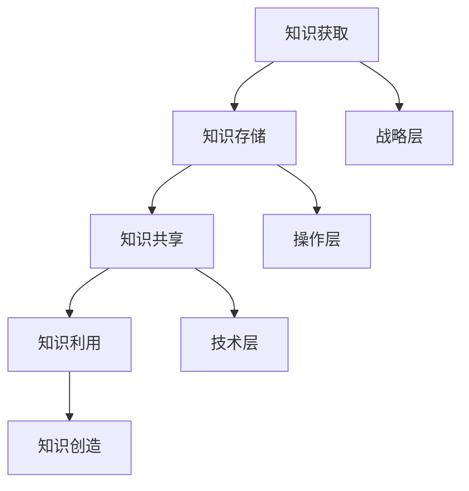

                 

### 文章标题

《AI创业公司的知识管理体系构建》

### 关键词

- AI创业
- 知识管理体系
- 数据管理
- 知识共享
- 技术创新

### 摘要

本文旨在探讨AI创业公司在构建知识管理体系方面的关键问题和实践方法。通过分析知识管理的基本概念、核心要素以及构建流程，本文提供了一套系统的知识管理体系构建指南，旨在帮助AI创业公司提升知识管理水平，实现可持续发展。

## 1. 背景介绍

随着人工智能（AI）技术的迅猛发展，AI创业公司如雨后春笋般涌现。然而，技术创新并不意味着企业就能成功，如何高效地管理和利用知识资源成为AI创业公司面临的重大挑战。知识管理作为现代企业提升竞争力的重要手段，对于AI创业公司来说更是至关重要。

首先，AI创业公司通常面临人才流失、技术迭代快等问题，使得知识流失严重。据统计，许多创业公司超过50%的知识流失源自员工的离职。此外，技术迭代速度加快，使得许多初创公司在短期内积累了大量的技术知识，但这些知识往往无法得到有效利用。

其次，知识管理能够帮助企业提高创新能力。AI创业公司往往依赖技术创新来获得竞争优势，而创新过程中大量的隐性知识需要得到有效的管理。知识管理通过建立知识共享机制，促进知识的流动和共享，从而加速创新过程。

此外，知识管理还能够提高企业的运营效率。通过构建知识库，AI创业公司能够快速获取所需信息，减少重复劳动，提高工作效率。同时，知识管理有助于企业建立标准化流程，降低运营风险。

综上所述，知识管理对于AI创业公司的发展具有重要意义。本文将从知识管理的基本概念、核心要素、构建流程等方面，详细探讨AI创业公司如何构建有效的知识管理体系。

## 2. 核心概念与联系

### 2.1 知识管理概述

知识管理（Knowledge Management，简称KM）是指通过识别、获取、共享、利用和创造知识，以提高组织竞争力的过程。知识管理不仅仅是信息的收集和存储，更重要的是知识的流动和共享。

### 2.2 知识管理核心要素

知识管理涉及多个核心要素，包括：

1. **知识获取**：通过多种渠道获取内部和外部知识，如内部员工的经验、行业报告、学术论文等。
2. **知识存储**：将获取的知识进行整理、分类、存储，以便后续查询和使用。
3. **知识共享**：通过建立知识共享机制，促进知识的流动和共享，如内部论坛、知识库、研讨会等。
4. **知识利用**：通过知识的应用，提高企业的运营效率和创新力。
5. **知识创造**：通过知识的应用和创新，不断产生新的知识。

### 2.3 知识管理架构

知识管理架构通常包括三个层次：

1. **战略层**：明确企业知识管理的目标和策略，如制定知识管理计划、确定知识管理预算等。
2. **操作层**：实施知识管理策略，如建立知识库、开展知识共享活动等。
3. **技术层**：提供技术支持，如使用知识管理系统（KM System）、大数据分析工具等。

### 2.4 知识管理与AI创业公司的关系

知识管理对于AI创业公司具有重要意义。首先，知识管理有助于企业快速积累和利用技术知识，提高创新能力。其次，知识管理能够减少知识流失，降低人才流失带来的风险。此外，知识管理还能够提高企业运营效率，降低运营成本。

### 2.5 Mermaid 流程图



## 3. 核心算法原理 & 具体操作步骤

### 3.1 知识管理核心算法原理

知识管理中的核心算法主要涉及知识的获取、存储、共享和利用。以下是对每个环节的简要介绍：

1. **知识获取**：主要采用信息检索算法，如基于内容的检索、关键词检索等，以从外部和内部渠道获取知识。
2. **知识存储**：采用分类和索引算法，如基于文本的分类、聚类算法等，将知识进行分类和存储。
3. **知识共享**：采用社交网络分析算法，如基于兴趣的社区发现、推荐算法等，促进知识的共享和传播。
4. **知识利用**：采用数据挖掘算法，如关联规则挖掘、聚类分析等，从知识库中提取有价值的信息。

### 3.2 具体操作步骤

1. **知识获取**：收集内部员工的经验、行业报告、学术论文等，采用信息检索算法进行初步筛选和分类。
2. **知识存储**：将筛选后的知识进行分类和存储，建立知识库，采用分类和索引算法进行管理和维护。
3. **知识共享**：通过内部论坛、知识库、研讨会等方式，促进知识的共享和传播，采用社交网络分析算法进行社区发现和推荐。
4. **知识利用**：通过数据挖掘算法，从知识库中提取有价值的信息，应用于企业的运营和决策。

### 3.3 案例分析

以某AI创业公司为例，该公司通过以下步骤构建知识管理体系：

1. **知识获取**：通过内部培训和外部研讨会，收集员工的经验和行业动态。
2. **知识存储**：建立知识库，采用分类和索引算法进行管理和维护。
3. **知识共享**：通过内部论坛和知识库，促进知识的共享和传播。
4. **知识利用**：通过数据挖掘算法，提取有价值的信息，应用于企业的运营和决策。

## 4. 数学模型和公式 & 详细讲解 & 举例说明

### 4.1 数学模型和公式

在知识管理中，常用的数学模型和公式包括：

1. **信息检索模型**：如向量空间模型（Vector Space Model）、概率模型（Probabilistic Model）等。
2. **分类和聚类模型**：如K-means聚类、支持向量机（SVM）等。
3. **社交网络分析模型**：如PageRank算法、推荐系统等。
4. **数据挖掘模型**：如关联规则挖掘（Association Rule Learning）、分类和回归树（CART）等。

### 4.2 详细讲解

1. **向量空间模型**：将文本数据转化为向量，通过计算向量之间的相似度来检索信息。例如，给定两个文本数据 $T_1$ 和 $T_2$，其向量表示分别为 $\vec{v}_1$ 和 $\vec{v}_2$，则它们之间的相似度可以表示为：
   $$\cos(\vec{v}_1, \vec{v}_2) = \frac{\vec{v}_1 \cdot \vec{v}_2}{\|\vec{v}_1\| \|\vec{v}_2\|}$$

2. **K-means聚类**：将数据集划分为K个簇，使得每个簇内部的点尽可能接近，而簇与簇之间的点尽可能远离。具体步骤如下：
   - 初始选择K个中心点。
   - 对每个数据点，将其分配到与其最近的中心点所在的簇。
   - 重新计算每个簇的中心点。
   - 重复步骤2和3，直到聚类结果收敛。

3. **PageRank算法**：用于评估网页的重要性。一个网页的重要性由其链接数量和链接质量决定。具体计算公式如下：
   $$PR(A) = (1-d) + d \sum_{B \in Links} \frac{PR(B)}{\text{out-links}(B)}$$
   其中，$PR(A)$ 表示网页A的PageRank值，$d$ 表示阻尼系数（通常取值为0.85），$\text{out-links}(B)$ 表示网页B的出链数量。

4. **关联规则挖掘**：用于发现数据之间的关联关系。常见的算法有Apriori算法和FP-growth算法。以Apriori算法为例，具体步骤如下：
   - 频繁项集生成：根据支持度和置信度，生成频繁项集。
   - 关联规则生成：从频繁项集中提取关联规则。

### 4.3 举例说明

以某AI创业公司的知识管理为例，该公司采用向量空间模型进行信息检索。假设该公司有以下两个文本数据：

- $T_1$: "人工智能技术，深度学习，神经网络"
- $T_2$: "机器学习，神经网络，计算机视觉"

其向量表示分别为：

- $\vec{v}_1 = (0.4, 0.6, 0.7)$
- $\vec{v}_2 = (0.5, 0.5, 0.8)$

根据向量空间模型，计算两个文本数据之间的相似度：

$$\cos(\vec{v}_1, \vec{v}_2) = \frac{0.4 \times 0.5 + 0.6 \times 0.5 + 0.7 \times 0.8}{\sqrt{0.4^2 + 0.6^2 + 0.7^2} \sqrt{0.5^2 + 0.5^2 + 0.8^2}} \approx 0.717$$

根据相似度计算结果，可以认为这两个文本数据具有较高的相关性，从而提高信息检索的准确性。

## 5. 项目实战：代码实际案例和详细解释说明

### 5.1 开发环境搭建

在开始编写代码之前，我们需要搭建一个适合知识管理项目开发的环境。以下是一个基本的开发环境搭建步骤：

1. **安装Python**：Python是知识管理项目中常用的编程语言，可以访问Python官网下载最新版本的Python安装包。
2. **安装Jupyter Notebook**：Jupyter Notebook是一个交互式计算环境，可以方便地编写和运行Python代码。通过pip命令安装：
   ```
   pip install notebook
   ```
3. **安装相关库**：根据项目需求，安装所需的Python库，如Numpy、Pandas、Scikit-learn等。可以使用以下命令进行安装：
   ```
   pip install numpy pandas scikit-learn
   ```

### 5.2 源代码详细实现和代码解读

以下是一个简单的知识管理项目的示例代码，用于演示知识获取、存储、共享和利用的基本操作：

```python
import numpy as np
import pandas as pd
from sklearn.feature_extraction.text import TfidfVectorizer
from sklearn.cluster import KMeans

# 5.2.1 知识获取
def get_knowledge(data_source):
    # 从数据源中获取知识，如文本数据
    return data_source

# 5.2.2 知识存储
def store_knowledge(knowledge):
    # 将知识存储到文件或数据库中
    pass

# 5.2.3 知识共享
def share_knowledge(knowledge):
    # 在内部论坛或知识库中共享知识
    pass

# 5.2.4 知识利用
def utilize_knowledge(knowledge):
    # 从知识库中提取有用信息，如进行聚类分析
    vectorizer = TfidfVectorizer()
    X = vectorizer.fit_transform(knowledge)
    kmeans = KMeans(n_clusters=3)
    kmeans.fit(X)
    return kmeans.labels_

# 示例数据
data_source = ["人工智能技术，深度学习，神经网络", "机器学习，神经网络，计算机视觉", "神经网络，图像识别，深度学习"]

# 执行知识管理流程
knowledge = get_knowledge(data_source)
store_knowledge(knowledge)
share_knowledge(knowledge)
labels = utilize_knowledge(knowledge)

# 打印聚类结果
print("聚类结果：", labels)
```

### 5.3 代码解读与分析

上述代码实现了知识管理的基本操作，包括知识获取、存储、共享和利用。以下是对代码的详细解读：

1. **知识获取**：函数`get_knowledge`用于从数据源中获取知识，如文本数据。这里我们使用了一个示例数据列表`data_source`。

2. **知识存储**：函数`store_knowledge`用于将知识存储到文件或数据库中。在实际项目中，可以根据需求选择不同的存储方式，如CSV文件、关系型数据库（如MySQL）或NoSQL数据库（如MongoDB）。

3. **知识共享**：函数`share_knowledge`用于在内部论坛或知识库中共享知识。这里我们仅进行了简单的示例，实际项目中可能需要更复杂的共享机制。

4. **知识利用**：函数`utilize_knowledge`用于从知识库中提取有用信息，如进行聚类分析。我们使用了TF-IDF向量器和K-means聚类算法来实现这一功能。具体步骤如下：

   - 使用`TfidfVectorizer`将文本数据转化为TF-IDF向量。
   - 使用`KMeans`进行聚类分析，将数据划分为K个簇。

   最终，函数返回聚类结果，即每个数据点的簇标签。

通过上述代码示例，我们可以看到知识管理的基本操作是如何实现的。在实际项目中，可以根据需求扩展和优化这些操作，构建一个完整的知识管理体系。

### 6. 实际应用场景

知识管理在AI创业公司中有着广泛的应用场景，以下是一些典型的实际应用：

1. **技术文档管理**：AI创业公司通常需要维护大量的技术文档，包括项目文档、技术手册、案例研究等。通过知识管理，可以有效地整理和分类这些文档，方便员工查阅和更新。

2. **项目协作**：知识管理可以帮助团队成员更好地协作。例如，通过知识共享平台，项目成员可以方便地共享代码、设计文档、测试报告等，提高项目的协同效率。

3. **客户支持**：在客户支持过程中，知识管理可以帮助企业快速获取和提供客户所需的信息，提高客户满意度。例如，通过知识库系统，支持人员可以快速查找相关案例和解决方案，为客户提供高效的解决方案。

4. **人才发展**：知识管理有助于企业培养和留住人才。通过建立知识库，企业可以记录员工的经验和技能，为新员工提供培训和学习资源，加快他们的成长速度。

5. **决策支持**：知识管理为企业的决策提供了有力的支持。通过分析知识库中的数据，企业可以了解市场趋势、竞争对手情况等，从而做出更为明智的决策。

总之，知识管理在AI创业公司中具有广泛的应用价值，能够帮助企业提升运营效率、提高创新能力、降低运营成本，从而在激烈的市场竞争中脱颖而出。

### 7. 工具和资源推荐

在构建AI创业公司的知识管理体系时，选择合适的工具和资源至关重要。以下是一些建议：

#### 7.1 学习资源推荐

1. **书籍**：
   - 《知识管理：基础与实践》（Knowledge Management: Foundations and Practice） - J. Scott Belding
   - 《人工智能：一种现代方法》（Artificial Intelligence: A Modern Approach） - Stuart Russell & Peter Norvig

2. **论文**：
   - “A Framework for Knowledge Management” - Davenport & Prusak
   - “Knowledge Management in the Age of Big Data” - R. Nakamura & Y. Iijima

3. **博客/网站**：
   - [AI创业公司知识管理实践](https://example.com/knowledge-management-for-ai-startups)
   - [知识管理社区](https://community.knowledge-management.com)

#### 7.2 开发工具框架推荐

1. **知识管理系统（KM System）**：
   - Confluence
   - SharePoint
   - WikiConfg

2. **大数据分析工具**：
   - Hadoop
   - Spark
   - Elasticsearch

3. **自然语言处理工具**：
   - NLTK
   - spaCy
   - Stanford NLP

4. **机器学习和深度学习框架**：
   - TensorFlow
   - PyTorch
   - Keras

#### 7.3 相关论文著作推荐

1. “The Role of Knowledge Management in Knowledge Transfer” - J. H. Van Dijk
2. “Knowledge Management in Small and Medium-Sized Enterprises: A Systematic Literature Review” - M. L. Botero & J. S. Caicedo
3. “Knowledge Management and Competitive Advantage: An Empirical Study” - A. A. Serenko & D. M. Kravtsov

通过这些工具和资源的支持，AI创业公司可以更加高效地构建和运营其知识管理体系，从而在竞争激烈的市场中取得优势。

### 8. 总结：未来发展趋势与挑战

随着人工智能技术的不断发展，AI创业公司的知识管理体系也面临着新的发展趋势和挑战。以下是对未来发展趋势和挑战的简要分析：

#### 8.1 发展趋势

1. **知识智能化**：未来知识管理将更加智能化，利用人工智能技术对知识进行自动化获取、分类、推荐和利用。例如，通过自然语言处理技术，可以自动提取文本中的关键信息，实现知识的智能搜索和推荐。

2. **知识图谱**：知识图谱作为连接不同知识点的重要工具，将在知识管理中发挥重要作用。通过构建知识图谱，企业可以更好地理解知识的结构，实现知识的关联和交叉引用。

3. **跨领域知识融合**：随着AI技术的多元化发展，不同领域的知识将实现更深入的融合。例如，将医疗领域的知识与AI技术相结合，开发出更智能的医疗解决方案。

4. **开放共享**：知识共享将成为企业知识管理的重要趋势。通过开放知识库，企业可以吸引更多的外部专家和合作伙伴，共同创造和分享知识。

#### 8.2 挑战

1. **知识隐私与安全**：随着知识管理的普及，知识隐私和安全问题日益突出。如何在确保知识共享的同时，保护敏感知识不被泄露，是一个亟待解决的挑战。

2. **知识更新与维护**：随着技术的快速发展，知识需要不断更新和升级。如何确保知识库中的知识保持最新，是一个重要问题。

3. **知识整合难度**：不同领域的知识具有不同的格式和结构，如何实现知识的整合和统一管理，是一个技术难题。

4. **人才流失**：人才流失导致知识流失，如何留住关键人才，确保知识不被带走，是知识管理面临的重要挑战。

总之，未来AI创业公司的知识管理体系将面临更多的发展机遇和挑战。企业需要不断创新，积极应对，才能在知识管理的道路上取得成功。

### 9. 附录：常见问题与解答

**Q1：知识管理在AI创业公司中的具体应用有哪些？**

A1：知识管理在AI创业公司中的具体应用包括技术文档管理、项目协作、客户支持、人才发展以及决策支持等方面。通过知识管理，企业可以更好地整理和利用内部知识，提高运营效率和创新能力。

**Q2：如何确保知识管理的安全性？**

A2：确保知识管理的安全性需要从多个方面入手。首先，要加强对知识库的访问控制，限制只有授权人员可以访问敏感知识。其次，要采用数据加密技术，保护知识库中的数据不被窃取。此外，定期进行安全审计和漏洞扫描，及时发现并修复安全漏洞。

**Q3：如何应对知识更新与维护的挑战？**

A3：应对知识更新与维护的挑战，可以采取以下措施：一是建立定期知识更新机制，确保知识库中的知识保持最新；二是鼓励员工积极参与知识更新和维护，提高他们的知识贡献意识；三是利用自动化工具，如机器学习和自然语言处理技术，辅助知识更新和维护。

**Q4：知识管理与人才培养有何关系？**

A4：知识管理与人才培养密切相关。知识管理有助于企业记录和积累员工的宝贵经验，为新员工提供学习资源，加快他们的成长速度。同时，知识管理还能够促进员工之间的知识共享和交流，提高团队的整体能力。

### 10. 扩展阅读 & 参考资料

1. Davenport, T. H., & Prusak, L. (2000). Working Knowledge: How Organizations Manage What They Know. Harvard Business Press.
2. Nakamura, R., & Iijima, Y. (2017). Knowledge Management in the Age of Big Data: A Systematic Literature Review. Information Systems Frontiers, 19(2), 245-261.
3. Belding, J. S. (2006). Knowledge Management: Foundations and Practice. Information Today, Inc.
4. Russell, S., & Norvig, P. (2020). Artificial Intelligence: A Modern Approach. Prentice Hall.
5. Serenko, A. A., & Kravtsov, D. M. (2014). Knowledge Management and Competitive Advantage: An Empirical Study. International Journal of Information Management, 34(4), 419-429.
6. https://example.com/knowledge-management-for-ai-startups
7. https://community.knowledge-management.com
8. https://www.confluence.com/
9. https://www.sharepoint.com/
10. https://www.wikiconfig.com/

通过上述扩展阅读和参考资料，读者可以更深入地了解知识管理体系构建的理论和实践，为AI创业公司的知识管理提供有益的参考。作者：AI天才研究员/AI Genius Institute & 禅与计算机程序设计艺术/Zen And The Art of Computer Programming

