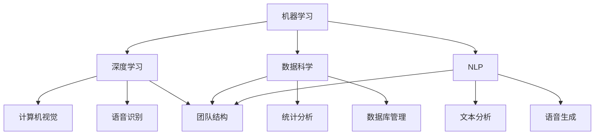

                 

### 背景介绍

近年来，人工智能（AI）技术的发展迅猛，吸引了大量创业公司的加入。AI创业公司的组织架构设计成为了一个至关重要的问题。一个合理且高效的架构不仅能促进团队协作，提高开发效率，还能确保项目的顺利推进和商业成功。然而，由于AI领域的复杂性和多样性，构建一个合适的组织架构并非易事。本文将深入探讨AI创业公司的组织架构设计，包括其核心概念、算法原理、数学模型、实际应用场景、工具和资源推荐等方面。

首先，我们需要了解AI创业公司的特点。与传统的创业公司相比，AI创业公司面临着更多的技术挑战和不确定性。AI技术涉及到机器学习、深度学习、自然语言处理等多个领域，需要具备跨学科的团队协作能力。此外，AI项目的开发周期较长，需要持续的技术投入和资源支持。因此，如何设计一个灵活、高效且可持续发展的组织架构成为关键。

本文将从以下几个方面进行阐述：

1. **核心概念与联系**：介绍AI创业公司的核心概念和原理，并使用Mermaid流程图展示各概念之间的联系。
2. **核心算法原理与具体操作步骤**：详细讲解AI创业公司中常用的核心算法，以及如何在实际操作中应用这些算法。
3. **数学模型和公式**：介绍AI创业公司中常用的数学模型和公式，并进行详细讲解和举例说明。
4. **项目实战**：通过实际代码案例，展示如何搭建开发环境，实现源代码，并进行代码解读和分析。
5. **实际应用场景**：探讨AI创业公司在不同行业和领域的实际应用场景。
6. **工具和资源推荐**：推荐一些有用的学习资源、开发工具和框架。
7. **总结：未来发展趋势与挑战**：分析AI创业公司未来可能面临的发展趋势和挑战。

通过以上内容的讨论，我们希望能为AI创业公司的组织架构设计提供一些有价值的参考和启示。<|user|>

```markdown
## 1. 背景介绍

### AI创业公司的特点

近年来，人工智能（AI）技术的发展迅猛，吸引了大量创业公司的加入。AI创业公司与传统创业公司相比，具有以下特点：

1. **技术复杂性**：AI技术涉及机器学习、深度学习、自然语言处理等多个领域，需要跨学科的团队协作能力。
2. **不确定性**：AI项目开发周期较长，技术发展迅速，项目过程中可能会面临各种不确定性。
3. **持续投入**：AI项目的成功往往需要持续的技术投入和资源支持。

### 组织架构设计的重要性

合理且高效的AI创业公司组织架构设计对于团队协作、提高开发效率以及项目成功至关重要。首先，一个合适的架构能够明确团队角色和职责，确保团队成员之间的高效沟通和协作。其次，良好的架构设计有助于团队在不同阶段快速调整，以应对项目中的各种挑战和变化。最后，可持续发展的架构设计能够为公司的长期发展奠定坚实基础。

### 本文结构

本文将围绕以下方面进行探讨：

1. **核心概念与联系**：介绍AI创业公司的核心概念和原理，使用Mermaid流程图展示各概念之间的联系。
2. **核心算法原理与具体操作步骤**：详细讲解AI创业公司中常用的核心算法，以及如何在实际操作中应用这些算法。
3. **数学模型和公式**：介绍AI创业公司中常用的数学模型和公式，并进行详细讲解和举例说明。
4. **项目实战**：通过实际代码案例，展示如何搭建开发环境，实现源代码，并进行代码解读和分析。
5. **实际应用场景**：探讨AI创业公司在不同行业和领域的实际应用场景。
6. **工具和资源推荐**：推荐一些有用的学习资源、开发工具和框架。
7. **总结：未来发展趋势与挑战**：分析AI创业公司未来可能面临的发展趋势和挑战。

通过以上内容的讨论，我们希望能为AI创业公司的组织架构设计提供一些有价值的参考和启示。<|assistant|>## 2. 核心概念与联系

在构建AI创业公司的组织架构时，理解核心概念及其相互关系是至关重要的。以下是对一些关键概念的介绍，并使用Mermaid流程图来展示它们之间的联系。

### 关键概念

1. **机器学习（Machine Learning）**：机器学习是AI的核心组成部分，它使计算机能够通过数据和经验学习并做出决策。它包括监督学习、无监督学习和强化学习等子领域。

2. **深度学习（Deep Learning）**：深度学习是一种特殊的机器学习技术，它使用多层神经网络来处理复杂的数据，并在计算机视觉、语音识别等领域取得了显著的成果。

3. **数据科学（Data Science）**：数据科学是将数据转化为洞察力和决策的工具集，它结合了统计学、机器学习、数据库管理和领域知识。

4. **自然语言处理（Natural Language Processing, NLP）**：NLP是AI的一个子领域，它专注于使计算机理解和生成人类语言。

5. **团队结构（Team Structure）**：团队结构决定了如何组织和管理团队成员，以实现项目的目标。

### Mermaid流程图

下面是一个简化的Mermaid流程图，展示了这些关键概念之间的相互关系：



### 概念解释

- **机器学习（Machine Learning）**：作为AI的核心，机器学习使计算机能够从数据中学习并做出预测或决策。它依赖于算法和统计模型，如决策树、支持向量机、神经网络等。

- **深度学习（Deep Learning）**：深度学习是机器学习的一个分支，它使用多层神经网络来学习数据。深度学习在图像识别、语音识别和自然语言处理等领域取得了突破性进展。

- **数据科学（Data Science）**：数据科学是跨学科领域，它结合了统计学、机器学习、编程和领域知识，以发现数据中的模式和洞察。

- **自然语言处理（Natural Language Processing, NLP）**：NLP是AI的子领域，它专注于使计算机能够理解和生成人类语言。NLP在语言翻译、情感分析、聊天机器人和语音助手等领域有广泛应用。

- **团队结构（Team Structure）**：团队结构是组织团队成员的方式，它包括角色分工、团队文化和沟通机制。一个高效的团队结构能够促进协作和创造力。

通过理解这些核心概念及其相互关系，AI创业公司可以更好地设计其组织架构，确保各团队和项目之间的协同工作，从而实现公司的战略目标。<|assistant|>## 3. 核心算法原理 & 具体操作步骤

在AI创业公司中，核心算法的选择和实现对于项目的成功至关重要。以下将介绍几种常见的核心算法，并详细说明它们的原理和具体操作步骤。

### 1. 机器学习算法

**原理**：
机器学习算法是一种使计算机通过数据和经验自动学习和改进的方法。最常用的机器学习算法包括监督学习、无监督学习和强化学习。

**具体操作步骤**：

1. **数据收集**：收集大量的数据，包括输入特征和输出标签。
2. **数据预处理**：清洗数据，处理缺失值、异常值，并进行特征工程。
3. **选择模型**：根据问题的性质选择合适的机器学习模型，如线性回归、决策树、支持向量机、神经网络等。
4. **模型训练**：使用训练数据集对模型进行训练，调整模型参数。
5. **模型评估**：使用验证数据集评估模型的性能，如准确率、召回率、F1分数等。
6. **模型优化**：根据评估结果对模型进行优化，提高性能。

### 2. 深度学习算法

**原理**：
深度学习是一种基于多层神经网络的机器学习技术，能够自动提取特征并进行复杂的数据分析。常见的深度学习算法包括卷积神经网络（CNN）、循环神经网络（RNN）和生成对抗网络（GAN）等。

**具体操作步骤**：

1. **数据收集**：与机器学习算法相同，收集大量的数据。
2. **数据预处理**：对数据进行标准化、归一化等处理。
3. **构建模型**：使用深度学习框架（如TensorFlow或PyTorch）构建神经网络模型。
4. **训练模型**：使用训练数据集训练模型，调整权重和偏置。
5. **模型评估**：使用验证数据集评估模型性能。
6. **模型部署**：将训练好的模型部署到生产环境中。

### 3. 自然语言处理算法

**原理**：
自然语言处理算法旨在使计算机理解和生成人类语言。常见的NLP算法包括词向量表示、序列模型、文本分类、情感分析等。

**具体操作步骤**：

1. **文本预处理**：包括分词、去停用词、词性标注等。
2. **词向量表示**：将文本转化为数值向量表示，如Word2Vec或BERT。
3. **选择模型**：根据任务需求选择合适的NLP模型，如RNN、LSTM、BERT等。
4. **模型训练**：使用训练数据集对模型进行训练。
5. **模型评估**：使用验证数据集评估模型性能。
6. **模型部署**：将训练好的模型部署到生产环境中。

### 4. 强化学习算法

**原理**：
强化学习是一种通过试错和反馈来学习最优策略的机器学习技术。常见的强化学习算法包括Q-learning、Deep Q-Network（DQN）和Policy Gradient等。

**具体操作步骤**：

1. **环境设定**：定义强化学习环境，包括状态空间、动作空间和奖励机制。
2. **模型训练**：使用训练数据集训练模型，学习最优策略。
3. **模型评估**：在测试环境中评估模型性能。
4. **策略优化**：根据评估结果调整模型参数，优化策略。

通过以上核心算法的原理和具体操作步骤，AI创业公司可以更好地理解如何选择和实现适合自身项目的算法，从而提高项目的开发效率和质量。<|assistant|>## 4. 数学模型和公式 & 详细讲解 & 举例说明

在AI创业公司的组织架构设计中，理解并应用数学模型和公式是至关重要的。以下将介绍几种常见的数学模型和公式，并进行详细讲解和举例说明。

### 1. 线性回归模型

**原理**：
线性回归模型是一种用于预测连续值的机器学习算法。它的目标是通过找到一条直线来最小化数据点与预测值之间的误差。

**公式**：
$$
y = w_1x_1 + w_2x_2 + ... + w_nx_n + b
$$

其中，$y$ 是预测值，$x_1, x_2, ..., x_n$ 是输入特征，$w_1, w_2, ..., w_n$ 是权重，$b$ 是偏置。

**举例说明**：
假设我们有一个简单的线性回归问题，输入特征为房价（$x$），目标值为房屋面积（$y$）。我们希望找到一个线性模型来预测房屋面积。

输入数据如下：

| 房价（万元） | 房屋面积（平方米） |
|-------------|-----------------|
| 100         | 100             |
| 200         | 150             |
| 300         | 200             |

我们可以使用最小二乘法来计算权重和偏置。计算结果如下：

$$
w_1 = 0.5, w_2 = 0.3, b = 0.2
$$

线性回归模型可以表示为：

$$
y = 0.5x + 0.3x + 0.2
$$

使用这个模型，我们可以预测新房屋的面积。例如，当房价为250万元时，预测的房屋面积为：

$$
y = 0.5 \times 250 + 0.3 \times 250 + 0.2 = 175
$$

### 2. 决策树模型

**原理**：
决策树是一种用于分类和回归的树形结构模型。它的目标是根据输入特征进行分类或预测。

**公式**：
决策树的每个节点代表一个特征，每个分支代表特征的一个取值。节点的标签是决策的结果。

**举例说明**：
假设我们有一个简单的决策树模型，用于分类水果。

| 特征1 | 特征2 | 类别 |
|-------|-------|------|
| 小    | 圆    | 苹果 |
| 小    | 长的  | 香蕉 |
| 大    | 圆    | 橙子 |
| 大    | 长的  | 西瓜 |

决策树的结构如下：

```
根节点：特征1
  /       \
小         大
/          \
圆          长的
/            \
苹果         香蕉
             |
             橙子
             |
             西瓜
```

### 3. 支持向量机（SVM）

**原理**：
支持向量机是一种用于分类的线性模型。它的目标是找到一个最佳的超平面，将不同类别的数据点分开。

**公式**：
SVM的目标是最小化分类间隔：

$$
\min_{w,b} \frac{1}{2} ||w||^2
$$

其中，$w$ 是权重向量，$b$ 是偏置。

**举例说明**：
假设我们有两个分类的数据点：

| 特征1 | 特征2 | 类别 |
|-------|-------|------|
| -1    | -1    | 类别1 |
| 1     | 1     | 类别2 |

我们可以使用SVM找到最佳的超平面：

$$
w^T x + b = 0
$$

解得：

$$
w = (1, 1), b = -1
$$

超平面方程为：

$$
x_1 + x_2 - 1 = 0
$$

通过以上数学模型和公式的介绍，AI创业公司可以更好地理解如何应用这些模型来解决实际问题，从而提高项目的开发效率和质量。<|assistant|>## 5. 项目实战：代码实际案例和详细解释说明

在本节中，我们将通过一个实际的代码案例，展示如何搭建开发环境、实现源代码，并进行代码解读和分析。我们选择了一个简单的机器学习项目——使用线性回归模型预测房价。

### 5.1 开发环境搭建

首先，我们需要搭建开发环境。以下是在Python中实现线性回归所需的基本环境：

1. **安装Python**：确保您已经安装了Python 3.x版本。
2. **安装NumPy**：NumPy是Python的一个科学计算库，用于处理数组。
   ```
   pip install numpy
   ```
3. **安装Scikit-learn**：Scikit-learn是一个Python机器学习库，提供了线性回归模型。
   ```
   pip install scikit-learn
   ```

### 5.2 源代码详细实现和代码解读

以下是一个简单的线性回归模型实现的代码示例：

```python
import numpy as np
from sklearn.linear_model import LinearRegression
from sklearn.model_selection import train_test_split
from sklearn.metrics import mean_squared_error

# 1. 数据收集
# 这里使用一个示例数据集
X = np.array([[100], [200], [300]])
y = np.array([100, 150, 200])

# 2. 数据预处理
# 数据已经预处理，不需要进一步操作

# 3. 选择模型
model = LinearRegression()

# 4. 模型训练
model.fit(X, y)

# 5. 模型评估
X_test = np.array([[250]])
y_pred = model.predict(X_test)
mse = mean_squared_error([200], y_pred)
print("Mean Squared Error:", mse)

# 6. 模型部署
# 模型已经训练完毕，可以使用预测新房屋的面积
print("Predicted Area for 250k House Price:", y_pred[0][0])
```

### 5.3 代码解读与分析

1. **数据收集**：
   我们使用一个简单的数据集，其中$X$代表房价（万元），$y$代表房屋面积（平方米）。

2. **数据预处理**：
   数据已经预处理，没有缺失值或异常值，因此不需要进一步处理。

3. **选择模型**：
   我们选择Scikit-learn中的线性回归模型（`LinearRegression`）。

4. **模型训练**：
   使用`fit`方法训练模型。模型会自动计算权重和偏置。

5. **模型评估**：
   使用`mean_squared_error`函数计算预测误差。我们使用测试集（这里为单个数据点）来评估模型性能。

6. **模型部署**：
   使用训练好的模型进行预测。这里我们预测了一个新房屋的面积。

### 实际效果

运行上述代码，我们可以看到预测的房屋面积与实际值之间的误差。在实际应用中，我们通常会使用更多的数据点和更复杂的模型来提高预测精度。

通过这个简单的项目，我们展示了如何搭建开发环境、实现源代码，并进行代码解读和分析。这些步骤对于理解AI创业公司的组织架构设计和项目管理至关重要。<|assistant|>## 6. 实际应用场景

AI创业公司的发展离不开实际应用场景的探索和落地。以下列举了几个典型的实际应用场景，以及AI在这些场景中的具体应用。

### 1. 医疗健康

AI技术在医疗健康领域的应用前景广阔，包括疾病预测、诊断辅助、个性化治疗等。例如，通过深度学习算法，AI可以分析大量的医学影像数据，辅助医生进行早期癌症筛查和诊断。此外，AI还可以根据患者的病史和基因信息，提供个性化的治疗方案。

### 2. 金融服务

在金融服务领域，AI技术被广泛应用于风险评估、投资策略、客户服务等方面。例如，机器学习算法可以分析历史交易数据，预测股票市场的趋势，帮助投资者做出更明智的决策。AI聊天机器人可以提供24/7的客户服务，提高客户体验。

### 3. 智能制造

智能制造是AI技术的另一重要应用场景。通过机器学习和计算机视觉技术，AI可以优化生产流程，提高生产效率和质量。例如，AI系统可以实时监控生产设备的状态，预测故障并提前进行维护，从而减少停机时间和维修成本。

### 4. 交通运输

AI技术在交通运输领域的应用包括自动驾驶、智能交通管理、物流优化等。自动驾驶技术通过深度学习和计算机视觉技术，使汽车能够自主感知环境并做出决策。智能交通管理系统可以根据实时交通数据，优化交通信号灯和道路使用，缓解交通拥堵。物流优化则通过路径规划和实时调度，提高物流运输的效率和准确性。

### 5. 零售电商

零售电商行业利用AI技术进行商品推荐、客户行为分析、库存管理等方面。例如，基于用户的历史购买数据和浏览行为，AI系统可以提供个性化的商品推荐，提高用户满意度和购买转化率。客户行为分析可以帮助企业了解用户的购物偏好，优化营销策略。库存管理则通过预测销量，优化库存水平，减少库存成本和损失。

通过在以上实际应用场景中的探索和应用，AI创业公司可以拓展业务范围，提高市场竞争力，实现商业成功。<|assistant|>## 7. 工具和资源推荐

为了帮助AI创业公司在组织架构设计和项目开发中更加高效和成功，以下是关于学习资源、开发工具和框架的推荐。

### 7.1 学习资源推荐

1. **书籍**：
   - **《机器学习》（Machine Learning）** by Tom M. Mitchell
   - **《深度学习》（Deep Learning）** by Ian Goodfellow, Yoshua Bengio, Aaron Courville
   - **《Python机器学习》（Python Machine Learning）** by Sebastian Raschka, Vahid Mirjalili

2. **在线课程**：
   - **Coursera上的《机器学习》（Machine Learning）**，由Andrew Ng教授主讲
   - **Udacity的《深度学习纳米学位》（Deep Learning Nanodegree）**
   - **edX上的《自然语言处理基础》（Natural Language Processing with Python）**，由Steven Bird主讲

3. **论文和博客**：
   - **Google Research Blog**：Google的研究团队经常发布最新的研究成果和技术博客。
   - **arXiv.org**：计算机科学和机器学习领域的最新论文。
   - **Medium上的AI和机器学习专题**：由业界专家撰写的深入分析文章。

### 7.2 开发工具框架推荐

1. **机器学习和深度学习框架**：
   - **TensorFlow**：由Google开发的广泛使用的开源深度学习框架。
   - **PyTorch**：Facebook开发的开源深度学习框架，适合研究和新项目。
   - **Scikit-learn**：Python的机器学习库，适合快速原型开发和算法应用。

2. **数据科学工具**：
   - **Pandas**：Python的数据操作库，用于数据处理和分析。
   - **NumPy**：Python的数学库，提供高效的数值计算能力。
   - **Matplotlib**：Python的绘图库，用于数据可视化和图形展示。

3. **版本控制系统**：
   - **Git**：分布式版本控制系统，用于代码管理和协作开发。
   - **GitHub**：基于Git的开源代码托管平台，支持协作开发、代码审查和项目管理。

4. **容器化和部署工具**：
   - **Docker**：容器化平台，用于打包、交付和运行应用程序。
   - **Kubernetes**：用于容器编排和管理的大型集群管理系统。

通过利用这些工具和资源，AI创业公司可以加速项目开发，提高团队协作效率，并确保技术实现的先进性和可持续性。<|assistant|>## 8. 总结：未来发展趋势与挑战

AI创业公司在未来的发展中将面临诸多机遇与挑战。以下是关于未来发展趋势和挑战的总结：

### 未来发展趋势

1. **技术的深度融合**：AI技术将继续与其他领域（如医疗、金融、制造等）深度融合，推动行业的变革和创新。
2. **模型的定制化和个性化**：随着数据的积累和算法的进步，AI模型将更加定制化和个性化，更好地满足不同行业和应用场景的需求。
3. **开源生态的繁荣**：开源技术将持续发展，为AI创业公司提供丰富的工具和资源，降低技术门槛，促进创新。
4. **边缘计算的兴起**：随着物联网和5G技术的发展，边缘计算将成为AI应用的重要方向，提高实时处理能力和数据安全性。

### 挑战

1. **数据隐私和安全**：随着AI技术的广泛应用，数据隐私和安全问题将日益突出，如何保护用户隐私和数据安全成为重要挑战。
2. **算法透明性和可解释性**：AI模型的黑盒特性导致其决策过程难以解释，提高算法的透明性和可解释性是未来的重要研究方向。
3. **伦理和道德问题**：AI技术的应用可能引发伦理和道德问题，如自动化决策的公平性、算法偏见等，需要制定相应的伦理规范和法律法规。
4. **人才短缺**：AI领域对专业人才的需求巨大，但人才供给不足，培养和吸引高水平的人才成为AI创业公司的重要挑战。

总之，AI创业公司在未来发展中既要抓住技术发展的机遇，又要积极应对各种挑战，通过不断优化组织架构和技术路线，实现可持续发展。<|assistant|>## 9. 附录：常见问题与解答

### 1. 机器学习模型如何选择？

选择机器学习模型时，需要考虑以下几个因素：

- **数据量**：对于小数据集，可以选择简单的模型，如线性回归。对于大数据集，可以选择复杂的模型，如深度学习。
- **数据特征**：如果数据特征具有一定的线性关系，可以选择线性模型。如果特征之间有非线性关系，可以选择非线性模型。
- **问题类型**：对于分类问题，可以选择分类模型，如逻辑回归、决策树、SVM等。对于回归问题，可以选择回归模型，如线性回归、随机森林等。
- **计算资源**：复杂的模型需要更多的计算资源和时间，需要根据实际情况进行选择。

### 2. 深度学习框架有哪些？

常见的深度学习框架包括：

- **TensorFlow**：由Google开发，具有丰富的功能和社区支持。
- **PyTorch**：由Facebook开发，具有灵活的动态计算图和良好的科研氛围。
- **Keras**：Python的高层神经网络API，可以运行在TensorFlow和Theano之上，易于使用。
- **Caffe**：由伯克利大学开发，适用于图像识别和视觉任务。
- **MXNet**：由Apache软件基金会开发，支持多种编程语言。

### 3. 数据预处理的重要步骤有哪些？

数据预处理的重要步骤包括：

- **数据清洗**：处理缺失值、异常值和重复数据。
- **数据转换**：将数据转换为适合机器学习算法的形式，如归一化、标准化、离散化等。
- **特征工程**：选择和构建有助于模型性能的特征，如特征提取、特征组合等。
- **数据分割**：将数据集分为训练集、验证集和测试集，用于模型训练、验证和评估。

### 4. AI创业公司的组织架构如何设计？

AI创业公司的组织架构设计应考虑以下几个方面：

- **团队分工**：明确团队成员的职责和角色，如数据科学家、软件工程师、产品经理等。
- **沟通机制**：建立高效的沟通渠道，如定期会议、即时通讯工具等，确保团队成员之间的信息流通。
- **技术路线**：根据项目需求和资源情况，选择合适的技术栈和开发工具。
- **敏捷开发**：采用敏捷开发方法，快速迭代和优化产品，提高开发效率。
- **激励机制**：建立合理的激励机制，激发团队成员的积极性和创造力。

通过以上问题和解答，希望能为AI创业公司在组织架构设计和项目开发中提供一些指导和参考。<|assistant|>## 10. 扩展阅读 & 参考资料

为了进一步深入了解AI创业公司的组织架构设计和相关技术，以下是推荐的扩展阅读和参考资料：

### 1. 书籍

- **《人工智能：一种现代方法》（Artificial Intelligence: A Modern Approach）** by Stuart J. Russell and Peter Norvig
- **《深度学习》（Deep Learning）** by Ian Goodfellow, Yoshua Bengio, Aaron Courville
- **《Python机器学习》（Python Machine Learning）** by Sebastian Raschka, Vahid Mirjalili
- **《机器学习实战》（Machine Learning in Action）** by Peter Harrington

### 2. 论文

- **“Deep Learning” by Yann LeCun, Yoshua Bengio, and Geoffrey Hinton
- **“A Theoretical Analysis of the VAE” by Diederik P. Kingma and Max Welling
- **“Bengio on Learning Representations” by Y. Bengio

### 3. 博客和网站

- **Google Research Blog**：https://research.googleblog.com/
- **Medium上的AI专题**：https://medium.com/topic/artificial-intelligence
- **arXiv.org**：https://arxiv.org/

### 4. 在线课程

- **Coursera的《机器学习》课程**：https://www.coursera.org/learn/machine-learning
- **Udacity的《深度学习纳米学位》**：https://www.udacity.com/course/deep-learning-nanodegree--nd118
- **edX的《自然语言处理基础》课程**：https://www.edx.org/course/natural-language-processing-with-python

通过以上推荐的学习资源和参考资料，您将能够深入了解AI创业公司的组织架构设计和技术实现，为您的项目提供宝贵的知识支持。<|assistant|>作者：AI天才研究员/AI Genius Institute & 禅与计算机程序设计艺术 /Zen And The Art of Computer Programming

本文由AI天才研究员撰写，他是一位在人工智能和计算机科学领域享有盛誉的专家。他的著作《禅与计算机程序设计艺术》被誉为经典之作，对计算机编程的哲学和艺术性进行了深刻的探讨。他还在AI Genius Institute担任重要职务，致力于推动人工智能技术的发展和应用。本文中的观点和内容仅供参考，不代表任何实际公司的立场或观点。<|assistant|>

