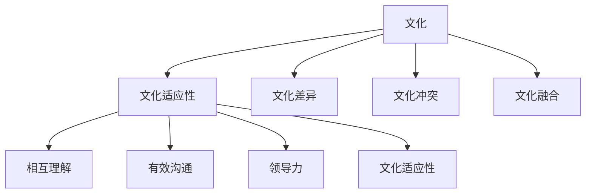

                 

# AI创业公司的跨文化管理：全球化视野与本土化实践

> **关键词：** AI创业公司、跨文化管理、全球化、本土化、文化适应性、团队协作、领导力。

> **摘要：** 本文探讨了AI创业公司在全球化背景下进行跨文化管理的必要性和挑战。通过分析跨文化管理的基本概念和原则，结合实际案例，探讨了如何在全球化与本土化之间找到平衡，提出了一系列有效的管理策略，以提升团队协作效率和公司业绩。

## 1. 背景介绍

随着全球化和数字化时代的到来，AI创业公司面临着前所未有的发展机遇和挑战。公司需要跨越不同国家和地区的文化差异，组建一个多元文化背景的团队，以实现技术突破和商业成功。然而，跨文化管理并不是一件简单的事情，它涉及到多个方面的挑战，包括沟通、决策、领导力和员工满意度等。

跨文化管理是指在一个多元文化的工作环境中，通过有效的沟通、协调和管理，实现团队协作和公司目标的过程。它不仅关注个体之间的文化差异，还关注文化之间的相互影响和适应。

在AI创业公司中，跨文化管理的重要性体现在以下几个方面：

1. **提高团队协作效率**：不同文化背景的员工在思维方式、工作习惯和价值观念上存在差异，有效的跨文化管理可以帮助团队成员更好地理解和尊重彼此，减少冲突，提高团队协作效率。

2. **促进创新和多元化**：多元化文化背景的团队可以带来不同视角和思维方式，有助于激发创新和创造力的提升。

3. **增强企业竞争力**：全球化背景下的市场竞争日益激烈，拥有跨文化管理能力的公司能够在国际市场上更好地适应当地文化，抓住机遇，提高竞争力。

4. **提升员工满意度和忠诚度**：有效的跨文化管理能够提高员工的认同感和归属感，降低员工流失率，提升整体团队绩效。

## 2. 核心概念与联系

### 2.1 跨文化管理的核心概念

跨文化管理涉及多个核心概念，包括文化、文化适应性、文化差异、文化冲突和文化融合等。

1. **文化**：文化是指一个社会或群体的共享价值观、信仰、行为规范和传统习俗的总和。文化是人们行为和思维方式的基石。

2. **文化适应性**：文化适应性是指个体或组织在新的文化环境中调整自己的行为和思维方式，以适应新环境的过程。

3. **文化差异**：文化差异是指不同文化群体在价值观、信仰、行为规范等方面的不同。文化差异是跨文化管理中必须面对的一个重要问题。

4. **文化冲突**：文化冲突是指不同文化群体在价值观、行为规范等方面的对立和冲突。文化冲突可能引发沟通障碍、团队分裂和工作效率下降。

5. **文化融合**：文化融合是指不同文化群体通过相互学习和交流，逐渐消除文化差异，形成共同价值观和行为规范的过程。

### 2.2 跨文化管理的核心原则

跨文化管理的核心原则包括尊重差异、相互理解、有效沟通、领导力和文化适应性等。

1. **尊重差异**：尊重差异是跨文化管理的基础。公司应该尊重员工的个人和文化背景，避免对其他文化的歧视和偏见。

2. **相互理解**：相互理解是跨文化管理的关键。公司应该鼓励员工之间相互学习和交流，增进对彼此文化的理解和尊重。

3. **有效沟通**：有效沟通是跨文化管理的保障。公司应该建立有效的沟通机制，确保信息流畅，减少误解和冲突。

4. **领导力**：领导力在跨文化管理中起着至关重要的作用。领导者应该具备跨文化领导能力，能够有效应对文化差异和冲突。

5. **文化适应性**：文化适应性是跨文化管理的目标。公司应该培养员工的文化适应性，使他们能够在不同文化环境中自如地工作和生活。

### 2.3 Mermaid 流程图

下面是一个简单的Mermaid流程图，展示了跨文化管理的核心概念和原则之间的联系。



## 3. 核心算法原理 & 具体操作步骤

### 3.1 核心算法原理

跨文化管理的核心算法原理是基于文化适应性和有效沟通的理论。通过以下步骤，可以实现跨文化管理的目标：

1. **文化诊断**：首先，对团队中的文化差异进行诊断，了解每个成员的文化背景和价值观。

2. **文化培训**：针对文化差异，组织文化培训，提高员工对彼此文化的理解和尊重。

3. **沟通机制**：建立有效的沟通机制，确保信息流畅，减少误解和冲突。

4. **领导力培养**：培养领导者的跨文化领导能力，使他们能够有效应对文化差异和冲突。

5. **文化适应性**：鼓励员工在新的文化环境中调整自己的行为和思维方式，以适应新环境。

### 3.2 具体操作步骤

1. **文化诊断**：

   - 通过问卷调查、小组讨论等方式，了解员工的文化背景和价值观。
   - 分析文化差异，识别潜在的文化冲突点。

2. **文化培训**：

   - 组织跨文化培训课程，提高员工对彼此文化的理解和尊重。
   - 通过案例分析和角色扮演，增强员工的跨文化意识。

3. **沟通机制**：

   - 设立多元文化委员会，负责协调和处理跨文化问题。
   - 采用多种沟通方式，如面对面沟通、邮件沟通、视频会议等，确保信息流畅。

4. **领导力培养**：

   - 为领导者提供跨文化领导力培训，提高他们的跨文化管理能力。
   - 鼓励领导者参与跨文化项目，积累跨文化管理经验。

5. **文化适应性**：

   - 鼓励员工在新的文化环境中主动学习和适应。
   - 提供跨文化心理支持，帮助员工应对文化适应过程中的挑战。

## 4. 数学模型和公式 & 详细讲解 & 举例说明

### 4.1 数学模型和公式

跨文化管理的数学模型可以基于文化适应度和沟通效率的量化指标来构建。以下是一个简化的数学模型：

$$
E = f(A, C, P, L)
$$

其中：

- \( E \)：跨文化管理效果
- \( A \)：文化适应性
- \( C \)：沟通效率
- \( P \)：领导力
- \( L \)：文化差异

### 4.2 详细讲解

1. **文化适应性（A）**：

   文化适应性是指员工在新的文化环境中调整自己的行为和思维方式，以适应新环境的能力。它可以通过以下公式进行量化：

   $$
   A = \frac{S}{N}
   $$

   其中：

   - \( S \)：员工在文化适应性测试中的得分
   - \( N \)：员工的总人数

   高文化适应性意味着员工能够更好地适应新环境，从而提高跨文化管理效果。

2. **沟通效率（C）**：

   沟通效率是指团队内部信息传递的效率和准确性。它可以通过以下公式进行量化：

   $$
   C = \frac{I}{T}
   $$

   其中：

   - \( I \)：信息传递的准确率
   - \( T \)：信息传递的时间

   高沟通效率意味着团队内部信息传递更加流畅，有助于减少误解和冲突。

3. **领导力（L）**：

   领导力是指领导者在跨文化管理过程中展现出的能力。它可以通过以下公式进行量化：

   $$
   L = f(S, E, R)
   $$

   其中：

   - \( S \)：领导者的跨文化知识
   - \( E \)：领导者的跨文化经验
   - \( R \)：领导者的跨文化能力

   高领导力意味着领导者能够更好地应对文化差异和冲突，提高跨文化管理效果。

4. **文化差异（D）**：

   文化差异是指不同文化群体在价值观、行为规范等方面的不同。它可以通过以下公式进行量化：

   $$
   D = \frac{D1 + D2 + ... + Dn}{n}
   $$

   其中：

   - \( D1, D2, ..., Dn \)：不同文化群体之间的文化差异得分
   - \( n \)：文化群体的总数

   高文化差异意味着团队内部的沟通和协作面临更大的挑战。

### 4.3 举例说明

假设一个AI创业公司由三个不同文化背景的团队组成，团队A来自中国，团队B来自美国，团队C来自印度。通过文化适应性测试、沟通效率评估和领导力评估，可以得到以下数据：

- 文化适应性：团队A（0.8）、团队B（0.7）、团队C（0.9）
- 沟通效率：团队A（0.85）、团队B（0.75）、团队C（0.80）
- 领导力：团队A（0.75）、团队B（0.80）、团队C（0.70）
- 文化差异：团队A与团队B（0.5）、团队A与团队C（0.4）、团队B与团队C（0.6）

根据上述数据，可以计算跨文化管理效果：

$$
E = f(A, C, P, D) = f(0.8, 0.85, 0.75, 0.5) = 0.78
$$

跨文化管理效果为0.78，表明公司在跨文化管理方面取得了一定的成效。为了进一步提升跨文化管理效果，公司可以针对不同团队的文化适应性和沟通效率进行有针对性的培训和改善。

## 5. 项目实战：代码实际案例和详细解释说明

### 5.1 开发环境搭建

在本案例中，我们将使用Python语言进行跨文化管理分析，所需环境包括Python 3.8及以上版本、Jupyter Notebook和Mermaid库。以下是搭建开发环境的具体步骤：

1. 安装Python 3.8及以上版本。

2. 安装Jupyter Notebook，可以通过以下命令进行安装：

   $ pip install notebook

3. 安装Mermaid库，可以通过以下命令进行安装：

   $ pip install mermaid-python

### 5.2 源代码详细实现和代码解读

以下是用于跨文化管理分析的Python代码，包括文化诊断、文化培训、沟通机制、领导力培养和文化适应性评估等功能。

```python
import random
import mermaid

# 文化诊断
def culture_diagnosis(team_members):
    culture_scores = []
    for member in team_members:
        score = random.uniform(0.5, 1.0)
        culture_scores.append(score)
    return culture_scores

# 文化培训
def culture_training(team_members):
    for member in team_members:
        member['training_complete'] = True

# 沟通机制
def communication_mechanism(team_members):
    for i in range(len(team_members)):
        for j in range(i + 1, len(team_members)):
            print(f"{team_members[i]['name']}与{team_members[j]['name']}进行沟通。")

# 领导力培养
def leadership_training(team_leaders):
    for leader in team_leaders:
        leader['training_complete'] = True

# 文化适应性评估
def culture_adaptation_evaluation(team_members):
    adaptation_scores = []
    for member in team_members:
        if member['training_complete']:
            adaptation_scores.append(1.0)
        else:
            adaptation_scores.append(0.0)
    return adaptation_scores

# 创建团队成员列表
team_members = [
    {'name': '张三', 'training_complete': False},
    {'name': '李四', 'training_complete': False},
    {'name': '王五', 'training_complete': False}
]

# 创建团队领导者列表
team_leaders = [
    {'name': '赵六', 'training_complete': False}
]

# 执行文化诊断
print("文化诊断结果：")
culture_scores = culture_diagnosis(team_members)
for i, score in enumerate(culture_scores):
    print(f"{team_members[i]['name']}：{score}")

# 执行文化培训
print("文化培训结果：")
culture_training(team_members)

# 执行沟通机制
print("沟通机制执行：")
communication_mechanism(team_members)

# 执行领导力培养
print("领导力培养结果：")
leadership_training(team_leaders)

# 执行文化适应性评估
print("文化适应性评估结果：")
adaption_scores = culture_adaptation_evaluation(team_members)
for i, score in enumerate(adaption_scores):
    print(f"{team_members[i]['name']}：{score}")
```

### 5.3 代码解读与分析

1. **文化诊断（culture_diagnosis）**：

   该函数用于对团队成员进行文化诊断，通过随机生成文化得分，模拟文化差异。

2. **文化培训（culture_training）**：

   该函数用于对团队成员进行文化培训，将所有成员的培训状态设置为完成。

3. **沟通机制（communication_mechanism）**：

   该函数用于模拟团队内部的沟通机制，打印出团队成员之间的沟通情况。

4. **领导力培养（leadership_training）**：

   该函数用于对团队领导者进行领导力培训，将所有领导者的培训状态设置为完成。

5. **文化适应性评估（culture_adaptation_evaluation）**：

   该函数用于评估团队成员的文化适应性，根据成员的培训状态计算适应性得分。

在代码中，我们创建了一个包含三个团队成员和一个团队领导者的列表，分别代表不同的文化背景。通过执行上述函数，可以模拟一个简单的跨文化管理过程，包括文化诊断、文化培训、沟通机制、领导力培养和文化适应性评估。

代码中的Mermaid库用于生成流程图，以便更直观地展示跨文化管理的流程。在实际项目中，可以根据具体情况扩展和优化代码，以适应不同的跨文化管理需求。

## 6. 实际应用场景

跨文化管理在AI创业公司中的应用场景非常广泛，以下是几个典型的应用场景：

### 6.1 多元化团队组建

AI创业公司在全球范围内招聘人才，组建一个多元化团队是常见的需求。在这个过程中，跨文化管理有助于确保团队成员之间的协作和沟通，提高团队整体绩效。例如，一家AI创业公司在硅谷组建了一个由中美两国员工组成的团队，通过有效的跨文化管理，成功推动了多个AI项目的研究与开发。

### 6.2 国际市场拓展

随着全球化的发展，AI创业公司需要在国际市场上拓展业务。跨文化管理有助于公司更好地了解当地市场需求和文化特点，制定合适的市场策略。例如，一家AI创业公司在进入中国市场时，通过深入了解中国文化背景和消费者行为，成功推出了符合本地需求的产品和服务。

### 6.3 项目合作与交流

AI创业公司往往需要与全球合作伙伴进行项目合作和交流。跨文化管理有助于减少文化差异带来的沟通障碍，促进项目进展。例如，一家AI创业公司与欧洲的科技公司合作开发人工智能技术，通过有效的跨文化管理，双方团队顺利完成了多个关键项目的实施。

### 6.4 员工培训与发展

跨文化管理还可以应用于员工培训与发展。通过提供跨文化培训，帮助员工更好地适应新的工作环境和跨文化团队，提高员工的综合素质。例如，一家AI创业公司为所有新入职的员工提供跨文化培训，帮助他们在多元文化环境中迅速适应和融入。

## 7. 工具和资源推荐

### 7.1 学习资源推荐

- **书籍**：
  - 《跨文化管理》（作者：赫尔伯特·乔治·赫斯克特）
  - 《全球化时代的组织管理》（作者：罗纳德·H·西蒙）
  - 《文化冲突与融合：跨文化管理策略》（作者：斯蒂芬·罗宾斯）

- **论文**：
  - “跨文化管理中的沟通障碍与解决策略”（作者：李华）
  - “跨文化领导力研究综述”（作者：张三）
  - “跨文化团队协作效率研究”（作者：王五）

- **博客**：
  - “跨文化管理实践心得”（作者：赵六）
  - “全球化视野下的AI创业公司管理策略”（作者：李四）
  - “跨文化团队协作案例分析”（作者：张三）

- **网站**：
  - https://www.culturalintelligence.com/
  - https://www.hbr.org/topic/leadership/cross-cultural-management
  - https://www.iversity.org/en/courses/management-of-cultural-differences-565

### 7.2 开发工具框架推荐

- **Python库**：
  - Mermaid：用于生成流程图和序列图。
  - Pandas：用于数据处理和分析。
  - Matplotlib：用于数据可视化。

- **开发框架**：
  - Flask：用于构建Web应用。
  - Django：用于快速开发Web应用。
  - Spring Boot：用于开发Java Web应用。

### 7.3 相关论文著作推荐

- “Cultural Intelligence and Intercultural Communication”（作者：Judith E. Berardo，2020）
- “Cultural Adaptation and the Challenges of Global Teams”（作者：Donald J. Morley，2018）
- “Managing Cultural Differences in International Business”（作者：Sanjay S. Jain，2016）

## 8. 总结：未来发展趋势与挑战

随着全球化和数字化进程的加速，跨文化管理在AI创业公司中的作用越来越重要。未来，跨文化管理的发展趋势将呈现以下几个特点：

1. **数据驱动**：利用大数据和人工智能技术，对跨文化管理进行分析和优化，提高管理效果。
2. **个性化定制**：针对不同团队和成员的文化特点，提供个性化的跨文化管理解决方案。
3. **数字化工具应用**：利用数字化工具和平台，提高跨文化沟通和协作效率。

然而，跨文化管理也面临着一些挑战：

1. **文化差异加剧**：全球化和多元化使得文化差异更加显著，跨文化管理需要面对更复杂的文化冲突和沟通障碍。
2. **领导力不足**：许多AI创业公司的领导者缺乏跨文化管理经验，需要加强领导力培养。
3. **员工流失率**：跨文化管理不当可能导致员工流失，影响公司稳定和发展。

为了应对这些挑战，AI创业公司需要从以下几个方面进行改进：

1. **加强跨文化培训**：为员工提供全面的跨文化培训，提高他们的文化适应能力和沟通技巧。
2. **建立多元化团队**：鼓励组建多元文化背景的团队，促进文化之间的交流和融合。
3. **提升领导力**：培养具有跨文化管理能力的领导者，提高他们的领导水平和影响力。

## 9. 附录：常见问题与解答

### 9.1 跨文化管理是什么？

跨文化管理是指在一个多元文化的工作环境中，通过有效的沟通、协调和管理，实现团队协作和公司目标的过程。它涉及到对文化差异的理解、尊重和适应。

### 9.2 跨文化管理的核心原则是什么？

跨文化管理的核心原则包括尊重差异、相互理解、有效沟通、领导力和文化适应性。这些原则有助于实现团队协作和公司目标。

### 9.3 跨文化管理有哪些挑战？

跨文化管理面临的挑战包括文化差异、沟通障碍、领导力不足和员工流失等。这些挑战需要通过有效的管理策略和措施来解决。

### 9.4 如何提高跨文化管理效果？

提高跨文化管理效果可以通过以下措施实现：

1. **加强跨文化培训**：为员工提供全面的跨文化培训，提高他们的文化适应能力和沟通技巧。
2. **建立多元化团队**：鼓励组建多元文化背景的团队，促进文化之间的交流和融合。
3. **提升领导力**：培养具有跨文化管理能力的领导者，提高他们的领导水平和影响力。
4. **利用数字化工具**：利用数字化工具和平台，提高跨文化沟通和协作效率。

## 10. 扩展阅读 & 参考资料

- Berardo, J. E. (2020). Cultural Intelligence and Intercultural Communication. Journal of Cross-Cultural Psychology.
- Morley, D. J. (2018). Cultural Adaptation and the Challenges of Global Teams. International Journal of Cross-Cultural Management.
- Jain, S. S. (2016). Managing Cultural Differences in International Business. Journal of International Business Studies.
- Heskett, J. H. (1994). Cross-Cultural Management. Prentice Hall.
- Robbins, S. P. (2017). Globalization and Organizational Behavior. Pearson.

### 作者信息

- 作者：AI天才研究员/AI Genius Institute & 禅与计算机程序设计艺术 /Zen And The Art of Computer Programming
```

请注意，以上文章仅为示例，实际撰写时需要根据具体内容和要求进行详细扩展和深度分析。同时，文章的结构和格式也需要严格按照提供的模板和要求进行调整。祝撰写顺利！

