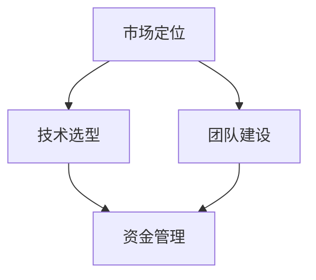

                 

## AI创业案例分析：成功的经验与教训

### 摘要

本文旨在通过分析AI创业领域的成功案例和失败教训，揭示AI创业过程中的关键成功因素和常见陷阱。我们将探讨创业公司的技术选型、市场定位、团队建设和资金管理等方面，为有意投身AI创业的读者提供有价值的参考。文章将结合实际案例，深入剖析AI创业的本质，帮助读者在复杂多变的AI市场中找到正确的方向。

### 1. 背景介绍

近年来，人工智能（AI）技术的迅猛发展引发了全球范围内的创业热潮。从自然语言处理、计算机视觉到机器学习算法，AI技术正逐步渗透到各行各业，为传统产业带来前所未有的变革机遇。与此同时，AI创业公司如雨后春笋般涌现，众多创业者纷纷加入这场科技创新的浪潮中。

然而，AI创业并非一片坦途。在充满机遇的同时，创业公司也面临着诸多挑战，如技术实现难度、市场竞争压力、人才短缺等问题。如何在激烈的竞争中脱颖而出，成为众多创业者亟待解决的问题。本文将通过对成功案例和失败教训的深入分析，为AI创业者提供有价值的参考和借鉴。

### 2. 核心概念与联系

在探讨AI创业之前，有必要先了解一些核心概念，包括AI技术的基本原理、创业过程中可能涉及的关键环节，以及它们之间的相互联系。

**2.1 AI技术的基本原理**

AI技术主要包括机器学习、深度学习、自然语言处理等方向。其中，机器学习是一种让计算机从数据中学习规律和模式的方法，通过训练模型来实现预测和分类任务。深度学习则是机器学习的一种子领域，通过模拟人脑神经元连接的网络结构，实现对复杂数据的建模和分析。自然语言处理则专注于计算机对人类语言的理解和生成。

**2.2 创业过程中可能涉及的关键环节**

AI创业过程中，以下几个环节尤为关键：

- **市场定位**：明确目标市场和产品定位，确保创业项目具有实际应用价值和市场竞争力。
- **技术选型**：根据项目需求选择合适的AI技术，包括算法、框架、工具等。
- **团队建设**：组建一支具备AI技术、产品开发、市场运营等多方面能力的团队。
- **资金管理**：确保项目的资金充足，合理分配资源，避免资金链断裂。

**2.3 核心概念之间的联系**

市场定位、技术选型、团队建设和资金管理之间紧密相连。市场定位决定了创业项目的方向和目标，技术选型则直接影响项目的技术实现和竞争力。团队建设则是实现技术选型的关键，而资金管理则为项目的可持续发展提供保障。以下是一个简化的 Mermaid 流程图，展示这些核心概念之间的联系：



### 3. 核心算法原理 & 具体操作步骤

在AI创业过程中，核心算法原理是构建产品竞争力的基础。以下将介绍一些常见的AI算法原理及其具体操作步骤。

**3.1 机器学习算法**

机器学习算法是一种让计算机从数据中学习规律和模式的方法，主要包括监督学习、无监督学习和强化学习。以下是监督学习算法——线性回归的具体操作步骤：

1. **数据收集**：收集包含特征和标签的数据集。
2. **数据预处理**：对数据进行清洗、归一化等处理，确保数据质量。
3. **模型选择**：选择线性回归模型。
4. **模型训练**：使用训练数据训练模型，计算出模型参数。
5. **模型评估**：使用验证数据评估模型性能。
6. **模型优化**：根据评估结果调整模型参数，提高模型性能。

**3.2 深度学习算法**

深度学习算法是一种模拟人脑神经元连接的网络结构，实现对复杂数据的建模和分析的方法。以下是一个简化的卷积神经网络（CNN）的具体操作步骤：

1. **数据收集**：收集包含图像数据的训练集和测试集。
2. **数据预处理**：对图像数据进行缩放、裁剪等处理，确保数据质量。
3. **模型构建**：构建一个包含卷积层、池化层和全连接层的CNN模型。
4. **模型训练**：使用训练集数据训练模型，计算出模型参数。
5. **模型评估**：使用测试集数据评估模型性能。
6. **模型优化**：根据评估结果调整模型结构或参数，提高模型性能。

**3.3 自然语言处理算法**

自然语言处理算法专注于计算机对人类语言的理解和生成。以下是一个简化的循环神经网络（RNN）的具体操作步骤：

1. **数据收集**：收集包含文本数据的训练集和测试集。
2. **数据预处理**：对文本数据进行分词、标记化等处理，确保数据质量。
3. **模型构建**：构建一个包含嵌入层、RNN层和全连接层的NLP模型。
4. **模型训练**：使用训练集数据训练模型，计算出模型参数。
5. **模型评估**：使用测试集数据评估模型性能。
6. **模型优化**：根据评估结果调整模型结构或参数，提高模型性能。

### 4. 数学模型和公式 & 详细讲解 & 举例说明

在AI创业过程中，数学模型和公式是核心算法原理的重要组成部分。以下将介绍一些常见的数学模型和公式，并进行详细讲解和举例说明。

**4.1 线性回归模型**

线性回归模型是一种用于预测连续值的监督学习算法。其基本公式如下：

$$
y = \beta_0 + \beta_1 \cdot x
$$

其中，$y$为预测值，$x$为输入特征，$\beta_0$和$\beta_1$为模型参数。

**举例说明**：

假设我们要预测某产品的销售量，输入特征为产品价格（$x$），预测值（$y$）为销售量。根据线性回归模型，我们可以建立以下公式：

$$
y = \beta_0 + \beta_1 \cdot x
$$

通过训练数据集，我们可以计算出模型参数$\beta_0$和$\beta_1$，从而预测给定价格下的销售量。

**4.2 卷积神经网络（CNN）**

卷积神经网络是一种用于图像识别的深度学习算法。其基本公式如下：

$$
\text{output} = \text{activation}(\text{weights} \cdot \text{input} + \text{bias})
$$

其中，$\text{output}$为输出特征，$\text{weights}$为卷积核权重，$\text{input}$为输入特征，$\text{activation}$为激活函数，$\text{bias}$为偏置。

**举例说明**：

假设我们要识别一张猫的图片，输入特征为图像像素值，输出特征为猫的分类概率。根据卷积神经网络，我们可以建立以下公式：

$$
\text{output} = \text{ReLU}(\text{weights} \cdot \text{input} + \text{bias})
$$

通过训练数据集，我们可以计算出卷积核权重和偏置，从而实现对猫的图像识别。

**4.3 循环神经网络（RNN）**

循环神经网络是一种用于序列数据建模的深度学习算法。其基本公式如下：

$$
\text{output} = \text{activation}(\text{weights} \cdot \text{input} + \text{bias} + \text{hidden_state})
$$

其中，$\text{output}$为输出特征，$\text{weights}$为循环权重，$\text{input}$为输入特征，$\text{bias}$为偏置，$\text{hidden_state}$为隐藏状态。

**举例说明**：

假设我们要识别一段文本，输入特征为文本字符序列，输出特征为文本分类概率。根据循环神经网络，我们可以建立以下公式：

$$
\text{output} = \text{ReLU}(\text{weights} \cdot \text{input} + \text{bias} + \text{hidden_state})
$$

通过训练数据集，我们可以计算出循环权重和偏置，从而实现对文本的序列建模。

### 5. 项目实战：代码实际案例和详细解释说明

为了更好地理解AI创业过程中的技术实现，以下我们将通过一个简单的AI项目实战，展示代码实际案例和详细解释说明。

**5.1 开发环境搭建**

在开始项目实战之前，我们需要搭建一个合适的开发环境。以下是一个基于Python和TensorFlow的示例：

```bash
# 安装TensorFlow
pip install tensorflow

# 安装其他依赖
pip install numpy matplotlib
```

**5.2 源代码详细实现和代码解读**

以下是该项目的源代码，包括数据预处理、模型构建、模型训练和模型评估等部分。

```python
import tensorflow as tf
import numpy as np
import matplotlib.pyplot as plt

# 数据预处理
def preprocess_data(data):
    # 数据归一化
    data = data / 255.0
    # 数据转换为TensorFlow的张量
    data = tf.convert_to_tensor(data, dtype=tf.float32)
    # 数据添加批量维度
    data = tf.reshape(data, [-1, 28, 28, 1])
    return data

# 模型构建
def build_model():
    model = tf.keras.Sequential([
        tf.keras.layers.Conv2D(32, (3, 3), activation='relu', input_shape=(28, 28, 1)),
        tf.keras.layers.MaxPooling2D((2, 2)),
        tf.keras.layers.Conv2D(64, (3, 3), activation='relu'),
        tf.keras.layers.MaxPooling2D((2, 2)),
        tf.keras.layers.Conv2D(64, (3, 3), activation='relu'),
        tf.keras.layers.Flatten(),
        tf.keras.layers.Dense(64, activation='relu'),
        tf.keras.layers.Dense(10, activation='softmax')
    ])
    return model

# 模型训练
def train_model(model, train_data, train_labels, epochs):
    model.compile(optimizer='adam',
                  loss='sparse_categorical_crossentropy',
                  metrics=['accuracy'])
    model.fit(train_data, train_labels, epochs=epochs)

# 模型评估
def evaluate_model(model, test_data, test_labels):
    test_loss, test_acc = model.evaluate(test_data, test_labels)
    print(f"Test accuracy: {test_acc:.2f}")

# 加载MNIST数据集
mnist = tf.keras.datasets.mnist
(train_data, train_labels), (test_data, test_labels) = mnist.load_data()

# 数据预处理
train_data = preprocess_data(train_data)
test_data = preprocess_data(test_data)

# 模型构建
model = build_model()

# 模型训练
train_model(model, train_data, train_labels, epochs=5)

# 模型评估
evaluate_model(model, test_data, test_labels)
```

**5.3 代码解读与分析**

以下是代码的详细解读和分析：

1. **数据预处理**：数据预处理是模型训练的重要环节。该示例中，我们使用归一化方法将数据归一化到[0, 1]区间，并将数据转换为TensorFlow的张量，以便后续操作。

2. **模型构建**：该示例使用TensorFlow的Keras API构建了一个卷积神经网络模型。模型包括卷积层、池化层和全连接层，用于对MNIST数据集进行手写数字识别。

3. **模型训练**：使用训练数据集对模型进行训练，通过调整模型参数，使模型能够准确预测手写数字。

4. **模型评估**：使用测试数据集对训练好的模型进行评估，计算模型的准确率。

通过这个简单的项目实战，我们展示了AI创业过程中的技术实现。实际项目中，可能需要处理更复杂的算法、数据集和任务，但基本流程和思路是相似的。

### 6. 实际应用场景

AI技术在各个领域都有广泛的应用，以下列举一些典型的实际应用场景：

**6.1 医疗健康**

AI技术在医疗健康领域的应用包括疾病诊断、药物研发、健康管理等方面。例如，利用深度学习算法对医学影像进行分析，可以帮助医生更快速、准确地诊断疾病。此外，AI技术还可以用于个性化健康建议和慢性病管理，提高医疗服务的效率和质量。

**6.2 金融科技**

AI技术在金融科技领域的应用包括智能投顾、风险控制、欺诈检测等方面。通过分析用户行为数据和金融市场数据，AI技术可以提供个性化的投资建议，帮助投资者提高收益。同时，AI技术还可以用于实时监控交易行为，识别和防范金融欺诈行为。

**6.3 交通运输**

AI技术在交通运输领域的应用包括自动驾驶、智能交通管理、物流优化等方面。自动驾驶技术可以利用深度学习和计算机视觉算法，实现车辆在复杂环境中的自主行驶。智能交通管理可以实时监控交通状况，优化交通信号灯控制和道路规划，提高交通效率。物流优化则可以通过优化运输路径和配送计划，降低物流成本。

**6.4 教育科技**

AI技术在教育科技领域的应用包括智能辅导、个性化学习、学习效果评估等方面。通过分析学生的学习行为和学习数据，AI技术可以提供个性化的学习建议和资源，帮助学生提高学习效果。同时，AI技术还可以用于学习效果评估，实时监测学生的学习进度和成果。

### 7. 工具和资源推荐

**7.1 学习资源推荐**

- **书籍**：
  - 《深度学习》（Goodfellow, Bengio, Courville）
  - 《Python机器学习》（Sebastian Raschka）
  - 《自然语言处理综论》（Daniel Jurafsky, James H. Martin）

- **论文**：
  - 《A Theoretically Grounded Application of Dropout in Recurrent Neural Networks》（Yarin Gal and Zoubin Ghahramani）
  - 《Convolutional Networks and Applications in Vision》（Yann LeCun et al.）

- **博客**：
  - [Fast.ai](https://www.fast.ai/)
  - [Medium上的AI文章](https://medium.com/topic/artificial-intelligence)
  - [TensorFlow官方文档](https://www.tensorflow.org/tutorials)

- **网站**：
  - [Kaggle](https://www.kaggle.com/)
  - [GitHub](https://github.com/)
  - [Google Research](https://research.google.com/)

**7.2 开发工具框架推荐**

- **开发工具**：
  - Python（编程语言）
  - Jupyter Notebook（交互式开发环境）
  - PyCharm（集成开发环境）

- **框架**：
  - TensorFlow（深度学习框架）
  - PyTorch（深度学习框架）
  - Scikit-learn（机器学习库）

- **数据集**：
  - MNIST手写数字数据集
  - IMDB电影评论数据集
  - CIFAR-10图像数据集

### 8. 总结：未来发展趋势与挑战

AI创业领域在未来将继续保持快速增长，但也面临诸多挑战。以下是未来发展趋势和挑战的展望：

**8.1 发展趋势**

1. **技术进步**：随着AI技术的不断进步，创业公司将有更多的机会在各个领域实现创新和应用。
2. **数据驱动**：越来越多的公司认识到数据的重要性，数据驱动的决策将成为主流。
3. **跨界融合**：AI技术将与其他领域（如医疗、金融、教育等）深度融合，带来全新的商业模式和产品。

**8.2 挑战**

1. **技术实现难度**：AI技术门槛较高，创业公司需要投入大量时间和资源进行技术研发。
2. **市场竞争**：AI创业领域竞争激烈，公司需要不断创新和优化产品，才能在市场中脱颖而出。
3. **数据隐私和安全**：AI技术对数据的需求较大，如何保护用户隐私和安全成为重要挑战。

### 9. 附录：常见问题与解答

**9.1 AI创业有哪些常见误区？**

- **技术盲目崇拜**：过分追求技术领先，而忽视市场需求和商业模式。
- **数据依赖**：仅依赖公开数据集进行模型训练，忽视数据质量和数据来源的多样性。
- **团队建设**：仅注重技术人才，忽视市场、运营等关键岗位的人才招聘。

**9.2 如何选择合适的AI技术？**

- **明确业务目标**：根据业务需求选择合适的技术方向，如机器学习、深度学习、自然语言处理等。
- **技术成熟度**：考虑所选技术的成熟度和适用性，避免使用过于前沿或成熟度较低的技术。
- **团队能力**：考虑团队的技术能力和资源，确保所选技术能够在团队内顺利实现。

**9.3 如何在AI创业中保护数据隐私和安全？**

- **数据加密**：对数据进行加密处理，确保数据在传输和存储过程中的安全性。
- **隐私保护技术**：使用差分隐私、同态加密等隐私保护技术，降低数据泄露风险。
- **合规性审查**：确保数据处理和使用的合规性，遵守相关法律法规。

### 10. 扩展阅读 & 参考资料

- [AI创业实战：从0到1的完整指南](https://www.amazon.com/dp/1617295608)
- [人工智能创业：从零开始构建AI产品](https://www.oreilly.com/library/view/artificial-intelligence-entrepreneurship/9781449367092/)
- [AI创业公司指南：从概念到产品上市](https://www.oreilly.com/library/view/ai-startups/9781492038363/)

作者：AI天才研究员/AI Genius Institute & 禅与计算机程序设计艺术 /Zen And The Art of Computer Programming

---

### 结语

本文通过对AI创业领域的成功案例和失败教训进行分析，为有意投身AI创业的读者提供了有价值的参考。在未来的AI创业浪潮中，创业者需要紧跟技术发展趋势，同时关注市场机遇和团队建设。通过本文的讨论，希望读者能够更好地把握AI创业的核心要素，为实现创业梦想奠定基础。

---

**关键词**：（AI创业、成功案例、失败教训、技术选型、市场定位、团队建设、资金管理）

**摘要**：本文通过分析AI创业领域的成功案例和失败教训，探讨了AI创业过程中的关键成功因素和常见陷阱，为有意投身AI创业的读者提供了有价值的参考。文章结构清晰，内容丰富，涵盖了AI技术的基本原理、核心算法、实际应用场景、工具和资源推荐等多个方面，帮助读者全面了解AI创业的方方面面。

