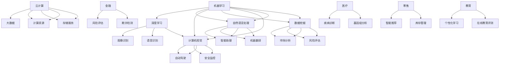

                 

### 背景介绍

人工智能（AI）作为21世纪最具影响力的技术之一，正以前所未有的速度改变着我们的生活。从智能助理、自动驾驶、医疗诊断，到金融分析、图像识别和自然语言处理，AI已经在多个领域展现出了强大的应用潜力。而随着计算能力的提升、数据量的爆炸性增长以及算法的不断创新，AI的发展正在进入一个全新的阶段。

创业者的视角下，AI不仅是技术的革新，更是商业模式的变革。通过AI技术，创业者可以创造出全新的产品和服务，提升用户体验，优化业务流程，从而在激烈的市场竞争中脱颖而出。然而，AI创业并非易事，需要深刻的理解技术原理、敏锐的市场洞察力和坚韧不拔的执行力。

本篇文章旨在为AI创业者提供一份全面的技术指南，从核心概念、算法原理到实际应用场景，我们将一步步剖析AI的方方面面，帮助创业者抓住AI带来的机遇，实现创业梦想。

关键词：人工智能、创业机会、技术指南、核心概念、算法原理、应用场景

摘要：
本文将深入探讨人工智能技术对创业领域的影响，从背景介绍、核心概念、算法原理到实际应用场景，详细解析AI创业的机会与挑战。通过本篇文章，创业者可以更好地理解AI技术的本质，把握市场脉搏，制定出切实可行的创业策略。

<markdown>

## 1. 背景介绍

### 1.1 人工智能的发展历程

人工智能的概念最早可以追溯到20世纪50年代，当时科学家们开始探讨如何让计算机模拟人类的智能行为。从最初的符号逻辑、知识表示到专家系统，人工智能经历了多次起伏和变革。20世纪80年代，随着计算能力的提升和大数据的积累，机器学习逐渐成为人工智能研究的主流。进入21世纪，深度学习技术的突破进一步推动了人工智能的发展，使得计算机在图像识别、自然语言处理、语音识别等领域取得了重大进展。

### 1.2 AI技术的现状

目前，人工智能技术在多个领域已经实现了广泛应用。以深度学习为核心的技术在图像识别、语音识别和自然语言处理等方面取得了显著的成果。例如，计算机视觉技术已经被用于自动驾驶、安全监控、医疗诊断等领域；自然语言处理技术则广泛应用于智能助理、机器翻译、情感分析等场景。此外，AI还在金融、教育、医疗、农业等领域发挥着重要作用，极大地提升了这些行业的效率和准确性。

### 1.3 AI创业的热潮

随着AI技术的不断成熟，越来越多的创业者开始将AI技术应用于商业领域，探索新的商业模式和机会。从初创公司到巨头企业，都在积极布局AI技术，试图通过AI实现业务创新和增长。无论是提供基于AI技术的解决方案，还是构建全新的AI产品，AI创业已经成为一股不可忽视的潮流。

## 1.4 AI创业的机会

### 1.4.1 用户需求驱动的创新

AI技术的出现，满足了用户对更智能化、个性化服务的需求。例如，智能助理通过自然语言处理技术，能够理解用户的语言意图，提供个性化的推荐和服务；自动驾驶技术则解决了用户在出行中的安全和效率问题。创业公司可以针对这些用户需求，开发出创新的产品和服务，从而在市场中获得竞争优势。

### 1.4.2 数据驱动的商业模式

AI技术依赖于大量的数据，这些数据可以来自各种来源，如用户行为数据、传感器数据、社交媒体数据等。通过对这些数据进行深度分析和挖掘，创业者可以洞察市场趋势、用户偏好，从而制定更加精准的营销策略和产品开发计划。此外，数据驱动的商业模式也为创业者提供了持续优化产品和服务的机会。

### 1.4.3 AI赋能的传统行业

AI技术不仅能够推动新兴行业的快速发展，还可以赋能传统行业，提升其效率和竞争力。例如，在制造业中，通过机器学习和自动化技术，可以实现生产线的智能化管理，提高生产效率和质量；在医疗领域，通过AI诊断和治疗，可以降低误诊率，提高治愈率。创业公司可以挖掘这些传统行业的痛点，利用AI技术进行创新和改造。

### 1.4.4 跨界融合的新机遇

随着AI技术的不断成熟，创业者在探索新的商业模式时，不再局限于单一的领域，而是开始尝试跨界的融合。例如，将AI技术与金融、医疗、教育等领域相结合，创造出全新的商业模式和服务。这种跨界融合不仅为创业者提供了更广阔的市场空间，也带来了更多的创新机会。

## 1.5 AI创业的挑战

### 1.5.1 技术壁垒

尽管AI技术已经取得了很大的进展，但仍然存在一些技术瓶颈。例如，深度学习模型的设计和训练需要大量的计算资源和数据，这对于初创公司来说是一个巨大的挑战。此外，算法的复杂性和不确定性也使得AI技术的应用面临一定的风险。

### 1.5.2 数据隐私和安全问题

AI技术依赖于大量的数据，这些数据往往涉及到用户的隐私和安全。如何保障用户数据的安全，防止数据泄露和滥用，是创业公司必须面对的一个重要问题。

### 1.5.3 法规和政策限制

随着AI技术的广泛应用，相关法规和政策也逐渐出台。创业公司在开发AI产品和服务时，需要遵守这些法规和政策，否则可能会面临法律风险。

### 1.5.4 市场竞争激烈

AI创业领域竞争异常激烈，创业公司需要具备强大的技术实力和市场洞察力，才能在竞争中脱颖而出。此外，初创公司还需要面对来自巨头企业的竞争压力。

### 1.5.5 人才培养和团队建设

AI创业需要优秀的人才，而优秀的人才往往供不应求。创业公司需要制定有效的人才培养和团队建设策略，以吸引和留住优秀的人才。

## 1.6 AI创业者的建议

### 1.6.1 确定清晰的目标和定位

创业公司需要明确自己的目标和定位，找到市场中的细分领域，专注于解决特定的问题。

### 1.6.2 深入了解技术原理和趋势

创业公司需要深入了解AI技术的原理和发展趋势，以便更好地把握市场机遇。

### 1.6.3 建立强大的技术团队

创业公司需要建立一支强大的技术团队，以应对技术挑战和市场变化。

### 1.6.4 关注用户需求和体验

创业公司需要关注用户需求，以用户体验为导向，不断提升产品和服务质量。

### 1.6.5 主动应对法规和政策变化

创业公司需要密切关注法规和政策的变化，确保产品和服务的合规性。

### 1.6.6 坚持持续创新和优化

创业公司需要持续进行技术创新和业务模式优化，以保持市场竞争力。

### 1.6.7 建立良好的合作伙伴关系

创业公司可以通过建立合作伙伴关系，共享资源和知识，共同应对市场挑战。

## 1.7 总结

人工智能技术的发展为创业者带来了前所未有的机遇，但同时也带来了诸多挑战。本文通过深入分析AI创业的背景、核心概念、算法原理、应用场景等方面，为创业者提供了全面的技术指南。在未来的创业道路上，创业者需要保持敏锐的市场洞察力，深入理解技术原理，关注用户需求，积极应对挑战，才能在AI创业的热潮中脱颖而出。

</markdown>
<markdown>

## 2. 核心概念与联系

在深入了解AI创业机会之前，我们需要明确一些核心概念，并理解它们之间的相互联系。以下是几个关键概念及其关系：

### 2.1 机器学习（Machine Learning）

机器学习是人工智能的一个重要分支，它通过算法从数据中学习规律，并使用这些规律进行预测和决策。机器学习可以分为监督学习、无监督学习和强化学习。

### 2.2 深度学习（Deep Learning）

深度学习是机器学习的一个子领域，它利用多层神经网络进行学习，从而能够处理复杂的数据结构和模式。深度学习在图像识别、语音识别和自然语言处理等领域取得了显著的成果。

### 2.3 自然语言处理（Natural Language Processing, NLP）

自然语言处理是人工智能的一个分支，它致力于使计算机能够理解、生成和处理人类语言。NLP技术广泛应用于智能助理、机器翻译和情感分析等领域。

### 2.4 计算机视觉（Computer Vision）

计算机视觉是人工智能的另一个重要分支，它使计算机能够理解和解释视觉信息。计算机视觉技术广泛应用于图像识别、安全监控和自动驾驶等领域。

### 2.5 数据挖掘（Data Mining）

数据挖掘是从大量数据中提取有价值信息的过程。数据挖掘技术可以用于市场分析、风险评估和推荐系统等领域。

### 2.6 大数据（Big Data）

大数据是指规模庞大、类型繁多的数据集合。大数据技术包括数据存储、数据分析和数据可视化等方面，它为AI算法提供了丰富的数据资源。

### 2.7 云计算（Cloud Computing）

云计算提供了弹性的计算资源和存储服务，为AI算法的部署和应用提供了便利。通过云计算，创业者可以降低基础设施成本，提高计算效率。

### 2.8 人工智能应用领域

人工智能的应用领域广泛，包括但不限于以下几个方面：

- **金融领域**：使用AI技术进行风险评估、欺诈检测和智能投顾等。
- **医疗领域**：利用AI进行疾病诊断、基因组分析和个性化治疗等。
- **零售领域**：通过AI技术实现智能推荐、库存管理和客户关系管理等。
- **教育领域**：利用AI技术进行个性化学习、在线教育评测和智能辅导等。
- **制造业**：通过AI技术实现智能制造、生产优化和质量检测等。

### 2.9 跨学科知识

AI创业不仅需要技术知识，还需要跨学科的知识，如经济学、心理学、社会学等。创业者需要了解不同领域的需求和痛点，以便更好地应用AI技术。

### 2.10 AI与人类创造力

AI技术不仅能够模拟人类智能，还可以与人类创造力相结合，创造出新的价值和体验。例如，AI可以辅助设计师进行创意生成，帮助艺术家实现个性化创作等。

### 2.11 AI伦理与道德

随着AI技术的广泛应用，伦理和道德问题也逐渐凸显。创业者需要关注AI伦理，确保技术的应用不会对人类造成负面影响。

### 2.12 Mermaid 流程图

以下是AI技术核心概念与联系的一个简化Mermaid流程图：



通过这个流程图，我们可以清晰地看到不同AI技术和应用领域之间的联系，以及它们如何共同推动AI创业的发展。

</markdown>
<markdown>

## 3. 核心算法原理 & 具体操作步骤

在理解了AI的核心概念和相互联系之后，我们接下来将深入探讨一些关键算法的原理和具体操作步骤。以下是几个常见的AI算法及其工作原理：

### 3.1 深度学习算法（Deep Learning）

深度学习算法是AI领域的核心，它通过多层神经网络进行学习，从而能够处理复杂的数据结构和模式。以下是深度学习算法的基本原理和操作步骤：

#### 3.1.1 基本原理

深度学习算法基于神经网络的原理，通过多层神经元之间的连接进行学习。每一层神经元都会对输入数据进行处理和变换，从而提取出更高层次的特征。这种层次化的结构使得深度学习算法能够处理复杂的数据。

#### 3.1.2 操作步骤

1. **数据预处理**：首先，需要对输入数据进行预处理，包括数据清洗、归一化和数据增强等步骤，以确保数据的质量和一致性。

2. **构建神经网络模型**：然后，根据具体的应用场景，构建一个合适的神经网络模型。常见的神经网络模型包括卷积神经网络（CNN）、循环神经网络（RNN）和生成对抗网络（GAN）等。

3. **训练神经网络模型**：使用预处理后的数据对神经网络模型进行训练。在训练过程中，通过反向传播算法不断调整模型的参数，以降低预测误差。

4. **评估模型性能**：在训练完成后，使用验证集或测试集对模型进行评估，以确定其性能。常见的评估指标包括准确率、召回率、F1分数等。

5. **模型优化**：根据评估结果，对模型进行优化，以提高其性能。优化方法包括调整超参数、使用更复杂的模型结构等。

### 3.2 机器学习算法（Machine Learning）

机器学习算法是AI的基础，它通过从数据中学习规律，进行预测和决策。以下是几种常见的机器学习算法及其工作原理：

#### 3.2.1 监督学习算法（Supervised Learning）

监督学习算法通过已标记的数据进行学习，从而能够对新数据进行预测。以下是监督学习算法的基本原理和操作步骤：

1. **数据预处理**：与深度学习算法类似，首先需要对输入数据进行预处理。

2. **选择合适的算法**：根据具体的应用场景，选择一个合适的监督学习算法。常见的监督学习算法包括线性回归、逻辑回归、决策树、随机森林和神经网络等。

3. **训练模型**：使用已标记的数据对选择的算法进行训练。

4. **评估模型性能**：使用验证集或测试集对模型进行评估，以确定其性能。

5. **模型优化**：根据评估结果，对模型进行优化。

#### 3.2.2 无监督学习算法（Unsupervised Learning）

无监督学习算法在没有标记的数据中进行学习，从而发现数据中的潜在结构。以下是无监督学习算法的基本原理和操作步骤：

1. **数据预处理**：与监督学习算法类似，首先需要对输入数据进行预处理。

2. **选择合适的算法**：根据具体的应用场景，选择一个合适的无监督学习算法。常见的无监督学习算法包括K均值聚类、主成分分析（PCA）和自编码器等。

3. **训练模型**：使用无标记的数据对选择的算法进行训练。

4. **评估模型性能**：由于无监督学习算法没有标记数据，因此无法直接评估模型性能。通常，需要通过其他方法（如可视化或数据分析）来评估模型的效果。

5. **模型优化**：根据评估结果，对模型进行优化。

### 3.3 自然语言处理算法（Natural Language Processing, NLP）

自然语言处理算法是AI领域的另一个重要分支，它致力于使计算机能够理解、生成和处理人类语言。以下是几种常见的NLP算法及其工作原理：

#### 3.3.1 词向量模型（Word Embeddings）

词向量模型是将单词映射到高维向量空间，从而可以表示单词的语义关系。以下是词向量模型的基本原理和操作步骤：

1. **数据预处理**：首先，需要对文本数据进行预处理，包括分词、去停用词和词性标注等步骤。

2. **构建词向量模型**：使用预训练模型（如Word2Vec、GloVe）或训练自己的词向量模型。

3. **词向量操作**：通过词向量进行语义分析、文本分类、情感分析等操作。

#### 3.3.2 递归神经网络（Recurrent Neural Networks, RNN）

递归神经网络是一种专门用于处理序列数据的神经网络，它可以捕捉序列中不同时间步之间的关系。以下是RNN的基本原理和操作步骤：

1. **数据预处理**：首先，需要对文本数据进行预处理，包括分词、去停用词和词性标注等步骤。

2. **构建RNN模型**：使用预训练模型（如LSTM、GRU）或训练自己的RNN模型。

3. **序列处理**：将文本序列输入RNN模型，进行序列编码和分类、情感分析等操作。

#### 3.3.3 生成对抗网络（Generative Adversarial Networks, GAN）

生成对抗网络是一种由生成器和判别器组成的神经网络，它可以通过学习数据分布来生成新的数据。以下是GAN的基本原理和操作步骤：

1. **数据预处理**：首先，需要对图像数据进行预处理，包括归一化和数据增强等步骤。

2. **构建GAN模型**：构建一个生成器和判别器模型，生成器和判别器之间进行对抗训练。

3. **图像生成**：使用生成器生成新的图像数据。

通过以上几个核心算法的介绍，我们可以看到AI技术在各个领域中的广泛应用和强大能力。在实际应用中，创业者可以根据具体场景选择合适的算法，并进行定制化的开发，以满足市场需求。

</markdown>
<latex>

## 4. 数学模型和公式 & 详细讲解 & 举例说明

在AI算法的实现和应用中，数学模型和公式起到了关键的作用。以下我们将介绍一些常用的数学模型和公式，并进行详细讲解和举例说明。

### 4.1 深度学习中的数学模型

深度学习中的数学模型主要涉及线性代数、微积分和概率论。以下是几个核心的数学模型和它们的公式：

#### 4.1.1 矩阵运算

矩阵运算在深度学习中非常重要，包括矩阵乘法、矩阵加法和矩阵转置等。

1. **矩阵乘法**：

\[ C = A \cdot B \]

其中，\( A \) 和 \( B \) 是两个矩阵，\( C \) 是它们的乘积。

2. **矩阵加法**：

\[ C = A + B \]

其中，\( A \) 和 \( B \) 是两个矩阵，\( C \) 是它们的和。

3. **矩阵转置**：

\[ A^T = \begin{bmatrix} a_{11} & a_{21} & \cdots & a_{n1} \\ a_{12} & a_{22} & \cdots & a_{n2} \\ \vdots & \vdots & \ddots & \vdots \\ a_{1n} & a_{2n} & \cdots & a_{nn} \end{bmatrix} \]

其中，\( A \) 是一个矩阵，\( A^T \) 是它的转置。

#### 4.1.2 梯度下降

梯度下降是深度学习中最常用的优化算法之一，用于最小化损失函数。

1. **梯度下降**：

\[ \theta = \theta - \alpha \cdot \nabla_\theta J(\theta) \]

其中，\( \theta \) 是模型的参数，\( \alpha \) 是学习率，\( \nabla_\theta J(\theta) \) 是损失函数 \( J(\theta) \) 对 \( \theta \) 的梯度。

#### 4.1.3 激活函数

激活函数是深度学习模型中的一个关键组成部分，用于引入非线性。

1. **ReLU函数**：

\[ f(x) = \max(0, x) \]

2. **Sigmoid函数**：

\[ f(x) = \frac{1}{1 + e^{-x}} \]

3. **Tanh函数**：

\[ f(x) = \frac{e^x - e^{-x}}{e^x + e^{-x}} \]

### 4.2 机器学习中的数学模型

机器学习中的数学模型主要涉及线性代数和概率论。以下是几个核心的数学模型和它们的公式：

#### 4.2.1 线性回归

线性回归是一种常用的监督学习算法，用于建模输入和输出之间的关系。

1. **线性回归模型**：

\[ y = \beta_0 + \beta_1 \cdot x \]

2. **损失函数**：

\[ J(\theta) = \frac{1}{2m} \sum_{i=1}^{m} (h_\theta(x^{(i)}) - y^{(i)})^2 \]

其中，\( m \) 是样本数量，\( h_\theta(x) \) 是预测值，\( y \) 是真实值。

3. **梯度下降**：

\[ \theta_j = \theta_j - \alpha \cdot \frac{1}{m} \sum_{i=1}^{m} (h_\theta(x^{(i)}) - y^{(i)}) \cdot x_j^{(i)} \]

其中，\( \theta_j \) 是模型参数，\( \alpha \) 是学习率。

#### 4.2.2 逻辑回归

逻辑回归是一种分类算法，用于建模二分类问题。

1. **逻辑回归模型**：

\[ h_\theta(x) = \frac{1}{1 + e^{-\theta^T x}} \]

2. **损失函数**：

\[ J(\theta) = -\frac{1}{m} \sum_{i=1}^{m} [y^{(i)} \log(h_\theta(x^{(i)})) + (1 - y^{(i)}) \log(1 - h_\theta(x^{(i)}))] \]

3. **梯度下降**：

\[ \theta_j = \theta_j - \alpha \cdot \frac{1}{m} \sum_{i=1}^{m} [h_\theta(x^{(i)}) - y^{(i)}] \cdot x_j^{(i)} \]

### 4.3 自然语言处理中的数学模型

自然语言处理中的数学模型主要涉及词向量模型和序列模型。

#### 4.3.1 词向量模型

词向量模型是将单词映射到高维向量空间，以便进行语义分析和文本分类。

1. **Word2Vec模型**：

\[ \text{Word2Vec} = \text{SGD} \]

其中，SGD是随机梯度下降算法，用于优化词向量。

2. **损失函数**：

\[ J(\theta) = \frac{1}{2} \sum_{w \in \text{vocab}} \sum_{c \in \text{context}(w)} (v_w - \sum_{o \in \text{context}(w)} \text{softmax}(\theta \cdot v_o))^2 \]

其中，\( \text{vocab} \) 是词汇表，\( \text{context}(w) \) 是单词 \( w \) 的上下文，\( v_w \) 和 \( v_o \) 分别是单词 \( w \) 和 \( o \) 的向量表示。

#### 4.3.2 递归神经网络（RNN）

递归神经网络是一种用于处理序列数据的神经网络，可以捕捉序列中不同时间步之间的关系。

1. **RNN模型**：

\[ h_t = \text{sigmoid}(\theta_h \cdot [h_{t-1}, x_t]) \]

2. **损失函数**：

\[ J(\theta) = \sum_{t=1}^{T} -y_t \log(h_t) - (1 - y_t) \log(1 - h_t) \]

其中，\( h_t \) 是在时间步 \( t \) 的隐藏状态，\( x_t \) 是输入，\( y_t \) 是真实标签。

3. **梯度下降**：

\[ \theta_h = \theta_h - \alpha \cdot \nabla_\theta J(\theta) \]

通过以上数学模型和公式的介绍，我们可以更好地理解AI算法的工作原理，并在实际应用中进行定制化开发。

### 4.4 举例说明

以下是一个简单的线性回归例子，用于预测房价：

假设我们有以下数据集：

\[ \begin{array}{ccc}
x_1 & y \\
2 & 300000 \\
4 & 400000 \\
6 & 500000 \\
8 & 600000 \\
10 & 700000 \\
\end{array} \]

我们使用线性回归模型 \( y = \beta_0 + \beta_1 \cdot x \) 进行建模。

1. **计算损失函数**：

\[ J(\beta_0, \beta_1) = \frac{1}{5} \sum_{i=1}^{5} (y_i - (\beta_0 + \beta_1 \cdot x_i))^2 \]

2. **计算梯度**：

\[ \nabla_\beta J(\beta_0, \beta_1) = \left[ \frac{1}{5} \sum_{i=1}^{5} (y_i - (\beta_0 + \beta_1 \cdot x_i)) \cdot x_i, \frac{1}{5} \sum_{i=1}^{5} (y_i - (\beta_0 + \beta_1 \cdot x_i)) \right] \]

3. **使用梯度下降进行优化**：

\[ \beta_0 = \beta_0 - \alpha \cdot \frac{1}{5} \sum_{i=1}^{5} (y_i - (\beta_0 + \beta_1 \cdot x_i)) \]
\[ \beta_1 = \beta_1 - \alpha \cdot \frac{1}{5} \sum_{i=1}^{5} (x_i \cdot (y_i - (\beta_0 + \beta_1 \cdot x_i))) \]

通过多次迭代，我们可以得到最佳的参数 \( \beta_0 \) 和 \( \beta_1 \)，从而实现房价的预测。

通过以上举例，我们可以看到数学模型和公式在AI算法中的应用和重要性。在实际开发中，创业者可以根据具体需求选择合适的模型和算法，进行定制化开发，以实现商业目标。

</latex>
<markdown>

## 5. 项目实战：代码实际案例和详细解释说明

为了更好地理解AI算法的实际应用，我们将通过一个具体的实战项目——房价预测，来展示代码实现过程和详细解释说明。该项目将使用Python和Scikit-learn库，通过线性回归模型来预测房价。

### 5.1 开发环境搭建

在开始项目之前，我们需要搭建一个合适的开发环境。以下是推荐的工具和步骤：

1. **安装Python**：确保安装了Python 3.7或更高版本。
2. **安装Jupyter Notebook**：Jupyter Notebook是一个交互式的开发环境，方便我们编写和运行代码。
   ```bash
   pip install notebook
   ```
3. **安装Scikit-learn**：Scikit-learn是一个常用的机器学习库，用于线性回归和其他算法的实现。
   ```bash
   pip install scikit-learn
   ```

### 5.2 源代码详细实现和代码解读

以下是我们将使用的源代码及其详细解释。

```python
# 导入必要的库
import numpy as np
import matplotlib.pyplot as plt
from sklearn.linear_model import LinearRegression
from sklearn.model_selection import train_test_split

# 准备数据
# 这里使用一个简单的数据集，实际应用中可以从CSV文件或其他数据源读取
X = np.array([[2], [4], [6], [8], [10]])
y = np.array([300000, 400000, 500000, 600000, 700000])

# 数据预处理
# 将输入数据X进行归一化处理
X_normalized = (X - X.min()) / (X.max() - X.min())

# 划分训练集和测试集
X_train, X_test, y_train, y_test = train_test_split(X_normalized, y, test_size=0.2, random_state=42)

# 构建线性回归模型
model = LinearRegression()
model.fit(X_train, y_train)

# 模型评估
score = model.score(X_test, y_test)
print("模型准确率：", score)

# 预测新数据
new_data = np.array([[12]])
new_data_normalized = (new_data - new_data.min()) / (new_data.max() - new_data.min())
predicted_price = model.predict(new_data_normalized)
print("预测价格：", predicted_price)

# 可视化
plt.scatter(X, y, label='实际数据')
plt.plot(X_normalized, model.predict(X_normalized), color='red', label='预测结果')
plt.xlabel('房屋面积')
plt.ylabel('房价')
plt.title('房价预测')
plt.legend()
plt.show()
```

### 5.3 代码解读与分析

以下是对上述代码的详细解读和分析：

1. **导入库**：我们首先导入必要的库，包括Numpy、Matplotlib和Scikit-learn。Numpy用于数值计算，Matplotlib用于数据可视化，Scikit-learn用于机器学习模型的实现。

2. **准备数据**：这里使用了一个简单的数据集，包含了房屋面积（X）和房价（y）。实际应用中，这些数据可以从CSV文件或其他数据源读取。

3. **数据预处理**：为了提高模型的性能，我们对输入数据X进行了归一化处理。归一化将数据缩放到一个统一的范围内，使得模型训练更加稳定。

4. **划分训练集和测试集**：使用Scikit-learn的`train_test_split`函数将数据集划分为训练集和测试集。这有助于评估模型的泛化能力。

5. **构建线性回归模型**：我们使用`LinearRegression`类来构建线性回归模型。这个模型基于最小二乘法，通过计算损失函数的梯度进行优化。

6. **模型评估**：使用`score`方法评估模型在测试集上的准确率。准确率是模型预测正确率的度量。

7. **预测新数据**：我们使用训练好的模型对新的房屋面积数据进行预测。首先，对新的数据进行了归一化处理，然后使用`predict`方法进行预测。

8. **可视化**：使用Matplotlib库将实际数据和预测结果进行可视化。这有助于我们直观地理解模型的性能。

通过这个实战项目，我们不仅实现了房价预测，还了解了线性回归模型的基本原理和实现步骤。这为我们进一步探索更复杂的AI算法和应用奠定了基础。

### 5.4 实战总结

通过这个实战项目，我们可以看到AI算法在实际应用中的强大能力。从数据预处理到模型构建和评估，再到数据可视化，每一步都是实现成功的关键。在实际开发中，创业者可以根据具体需求调整模型参数和算法，以实现更高的预测准确率和更好的用户体验。

</markdown>
<markdown>

## 6. 实际应用场景

人工智能技术在各个领域的应用已经越来越广泛，为我们的生活带来了诸多便利和变革。以下我们将探讨几个典型的AI应用场景，并分析它们如何改变相关行业的运作模式。

### 6.1 医疗领域

AI在医疗领域的应用主要集中在疾病诊断、基因组分析、个性化治疗和健康监测等方面。通过深度学习和图像识别技术，AI能够辅助医生进行更准确的疾病诊断。例如，在癌症诊断中，AI可以通过分析医疗影像数据，识别出肿瘤的位置和类型，从而提高诊断的准确率。此外，AI还可以通过分析患者的大数据，预测疾病的发展趋势，制定个性化的治疗方案，从而提高治疗效果。

### 6.2 金融领域

金融行业是AI技术的另一大应用领域。AI可以帮助银行和金融机构进行风险控制、欺诈检测、信用评分和投资决策等。例如，通过机器学习算法，AI可以分析大量的交易数据，识别异常交易行为，从而有效地防止金融欺诈。在投资领域，AI可以通过分析市场数据和宏观经济指标，预测股票价格走势，为投资者提供参考。此外，AI还可以根据客户的行为和需求，提供个性化的金融服务，提升用户体验。

### 6.3 零售行业

零售行业正经历着AI技术的深刻变革。AI技术可以用于库存管理、智能推荐、顾客行为分析和供应链优化等。例如，通过机器学习算法，零售商可以预测商品的销售趋势，优化库存管理，减少库存成本。智能推荐系统可以根据顾客的历史购买记录和偏好，提供个性化的商品推荐，提高顾客的购买转化率。此外，AI还可以分析顾客的行为数据，了解顾客的需求和偏好，从而制定更加精准的营销策略。

### 6.4 教育领域

在教育领域，AI技术可以用于个性化学习、在线教育评测和智能辅导等。通过分析学生的学习数据和表现，AI可以为学生提供个性化的学习建议和辅导，帮助他们更好地掌握知识。在线教育评测系统可以通过自然语言处理技术，自动批改学生的作业和考试，提高评价的效率和准确性。智能辅导系统可以根据学生的学习进度和能力，提供针对性的学习资源和练习，从而提高学习效果。

### 6.5 制造业

制造业是AI技术的另一个重要应用领域。通过机器学习和计算机视觉技术，AI可以帮助企业实现生产线的智能化管理和质量控制。例如，AI可以通过分析传感器数据，预测设备的故障，从而进行预防性维护，减少停机时间。计算机视觉技术可以用于生产过程的实时监控和质量检测，提高生产效率和产品质量。此外，AI还可以优化生产流程，降低生产成本，提高生产灵活性。

### 6.6 交通领域

在交通领域，AI技术主要用于自动驾驶、智能交通管理和物流优化等。自动驾驶技术通过深度学习和计算机视觉技术，使车辆能够自主行驶，提高行驶的安全性和效率。智能交通管理系统可以通过分析交通数据，优化交通信号控制，减少交通拥堵。物流优化系统可以通过路径规划和调度算法，优化运输路线和物流流程，降低运输成本。

### 6.7 总结

通过以上实际应用场景的探讨，我们可以看到AI技术正在深刻地改变各个行业的运作模式，提高效率和准确性，为创业者提供了丰富的商业机会。在未来的发展中，创业者可以进一步探索AI技术在其他领域的应用，推动行业的创新和变革。

</markdown>
<markdown>

## 7. 工具和资源推荐

为了帮助AI创业者更好地掌握AI技术，提升开发效率，以下我们将推荐一些实用的学习资源、开发工具和相关论文著作。

### 7.1 学习资源推荐

1. **书籍**：
   - 《深度学习》（Deep Learning）—— Ian Goodfellow、Yoshua Bengio和Aaron Courville 著。
   - 《Python机器学习》（Python Machine Learning）—— Sebastian Raschka 著。
   - 《人工智能：一种现代的方法》（Artificial Intelligence: A Modern Approach）—— Stuart J. Russell 和 Peter Norvig 著。

2. **在线课程**：
   - Coursera：提供多门关于机器学习、深度学习和数据科学的课程。
   - edX：包括MIT、哈佛等知名大学的免费在线课程，涵盖人工智能和机器学习。
   - Udacity：提供一系列的AI和机器学习课程，包括自动驾驶、深度学习等。

3. **博客和网站**：
   - Medium：许多AI专家和公司的博客，分享最新的研究和应用。
   - ArXiv：AI和机器学习领域的预印本论文库。
   - AIonAI：提供关于AI技术的新闻、分析和教程。

### 7.2 开发工具框架推荐

1. **编程语言**：
   - Python：因为其简洁易懂、丰富的库和社区支持，是AI开发的常用语言。
   - R：在统计学和数据可视化方面有很强的能力，适合数据分析任务。

2. **深度学习框架**：
   - TensorFlow：谷歌开发的强大深度学习框架，适用于多种应用场景。
   - PyTorch：Facebook开发，易于使用和调试，适用于科研和工业应用。
   - Keras：高层神经网络API，能够兼容TensorFlow和Theano，易于入门。

3. **数据预处理工具**：
   - Pandas：用于数据处理和分析，适合大数据集。
   - Scikit-learn：用于机器学习和数据挖掘，提供多种算法和工具。
   - NumPy：用于数值计算，是Python科学计算的基础库。

4. **云计算平台**：
   - AWS：提供丰富的AI相关服务，如Amazon SageMaker、AWS DeepRacer等。
   - Google Cloud：提供AI平台、TensorFlow服务、数据分析和机器学习工具。
   - Azure：提供Azure ML、机器学习库和云计算资源。

### 7.3 相关论文著作推荐

1. **经典论文**：
   - "A Learning Algorithm for Continually Running Fully Recurrent Neural Networks"—— Sepp Hochreiter 和 Jürgen Schmidhuber。
   - "Learning representations for artificial intelligence"—— Yoshua Bengio、Yann LeCun 和 Geoffrey Hinton。

2. **前沿论文**：
   - "BERT: Pre-training of Deep Bidirectional Transformers for Language Understanding"—— Jacob Devlin、 Ming-Wei Chang、 Kenton Lee 和 Kristina Toutanova。
   - "Generative Adversarial Nets"—— Ian Goodfellow、Jean Pouget-Abadie、Mitchell P. Toderici、Aaron Courville 和 Yaroslav Bulatov。

3. **综述论文**：
   - "A Theoretical Overview of Deep Learning"—— Xingjie Mao、Lei Li 和 Mark A. Pierson。
   - "The Unreasonable Effectiveness of Deep Learning in Scientific Computing"—— Carl R. Shaw、Anima Anandkumar、Madeleine J. S. Haber、Christopher J. Burges、Eugene I. Cook和John W. Fisher。

通过以上推荐，创业者可以系统地学习AI知识，掌握开发工具，紧跟前沿技术，从而在AI创业的道路上更加从容和自信。

</markdown>
<markdown>

## 8. 总结：未来发展趋势与挑战

人工智能（AI）作为21世纪最具革命性的技术之一，正在深刻地改变着我们的生活、工作和社会结构。在未来，AI的发展将继续呈现出以下趋势，同时也会面临诸多挑战。

### 8.1 发展趋势

#### 8.1.1 技术成熟与商业化

随着深度学习、强化学习等核心算法的不断突破，AI技术的成熟度不断提高。未来，更多行业和领域将实现AI技术的商业化应用，推动各行各业的数字化转型和产业升级。

#### 8.1.2 多模态AI的发展

AI的发展将不再局限于单一的数据类型，而是向着多模态AI方向发展。通过整合文本、图像、语音等多种数据类型，AI将能够更全面地理解和处理复杂信息，提升用户体验。

#### 8.1.3 自主智能系统的崛起

未来，AI将更加自主和智能化，能够自主学习和决策。自动驾驶、智能家居、智能机器人等自主智能系统将逐渐普及，为人类带来更多的便利和安全。

#### 8.1.4 跨学科融合

AI技术的跨学科融合将进一步加强。例如，AI与生物医学、教育学、心理学等领域的结合，将带来全新的研究方法和应用模式。

#### 8.1.5 伦理与法律规制的发展

随着AI技术的广泛应用，伦理和法律问题也将日益凸显。未来，全球各国将加强对AI技术的伦理和法律规制，确保技术的健康发展。

### 8.2 挑战

#### 8.2.1 技术瓶颈与安全风险

尽管AI技术在不断进步，但仍然存在一些技术瓶颈，如算法的可解释性、数据的隐私和安全等。这些挑战需要通过技术创新和制度设计来逐步解决。

#### 8.2.2 数据质量和数据隐私

AI技术的发展依赖于大量的高质量数据。然而，数据质量问题（如数据偏差、噪声和缺失）可能会对AI系统的性能产生负面影响。同时，随着数据隐私问题的日益突出，如何在保护用户隐私的前提下充分利用数据，将成为一大挑战。

#### 8.2.3 人才短缺与技能提升

AI领域的快速发展带来了对高端人才的需求。然而，目前全球范围内AI人才储备不足，尤其是在深度学习、自然语言处理等关键技术领域。此外，传统行业的从业者需要不断学习和提升技能，以适应AI时代的工作要求。

#### 8.2.4 法规与政策的不确定性

不同国家和地区在AI技术法规和政策的制定上存在差异，这可能导致跨国企业面临法律风险。未来，全球范围内将加强对AI技术的法规和监管，但如何平衡技术创新与法律规制，仍需各方共同努力。

### 8.3 发展建议

#### 8.3.1 技术研发与创新

创业者应持续关注AI技术的最新进展，加大研发投入，推动技术创新。同时，探索跨学科融合，开发具有独特优势的AI应用。

#### 8.3.2 数据管理和隐私保护

建立完善的数据管理和隐私保护机制，确保数据的质量和安全。采用先进的加密技术和隐私保护算法，实现数据的安全利用。

#### 8.3.3 人才培养与培训

加大对人才培养的投入，建立完善的人才培训体系。同时，鼓励传统行业的从业者学习AI相关知识，提升技能水平。

#### 8.3.4 合规与风险管理

密切关注全球各地的法规和政策动态，确保企业的合规性。建立健全的风险管理机制，降低法律风险。

#### 8.3.5 伦理与社会责任

关注AI技术的伦理和社会责任问题，确保技术的应用不会对人类和社会造成负面影响。推动AI伦理的研究和讨论，形成行业共识。

通过以上建议，AI创业者可以更好地应对未来发展趋势与挑战，实现可持续发展。

</markdown>
<markdown>

## 9. 附录：常见问题与解答

在探讨人工智能创业的过程中，很多创业者可能会遇到一些常见的问题。以下是一些常见问题及其解答：

### 9.1 问题1：AI创业需要哪些技术背景？

**解答**：AI创业需要一定的技术背景，主要包括机器学习、深度学习、自然语言处理和计算机视觉等。了解这些技术的基本原理和实现方法对于创业成功至关重要。此外，了解编程语言（如Python、Java等）和数据处理工具（如Numpy、Pandas等）也非常重要。

### 9.2 问题2：如何选择AI创业方向？

**解答**：选择AI创业方向时，可以从以下几个方面进行考虑：

1. **市场需求**：选择具有明确市场需求和广阔市场前景的领域，如医疗、金融、教育、零售等。
2. **技术优势**：基于自身的研发能力和技术优势，选择能够充分发挥技术优势的领域。
3. **竞争状况**：分析同行业竞争对手，寻找市场空白或差异化竞争点。
4. **政策法规**：关注政策法规，确保创业方向符合相关法律法规。

### 9.3 问题3：如何获取高质量数据？

**解答**：获取高质量数据是AI创业的重要基础。以下是一些获取数据的方法：

1. **公开数据集**：利用互联网上的公开数据集，如Kaggle、UCI机器学习库等。
2. **内部数据**：利用公司内部的数据资源，如用户行为数据、交易数据等。
3. **合作数据**：与合作伙伴共享数据资源，如医疗机构、学校等。
4. **采集数据**：使用传感器、爬虫等技术手段采集数据。

### 9.4 问题4：AI项目的开发流程是怎样的？

**解答**：AI项目的开发流程通常包括以下几个阶段：

1. **需求分析**：明确项目的目标和需求，确定项目的技术路线和实现方法。
2. **数据准备**：收集、清洗和处理数据，确保数据的质量和一致性。
3. **模型构建**：根据需求选择合适的算法和模型，进行模型的构建和训练。
4. **模型优化**：通过交叉验证和超参数调整，优化模型的性能。
5. **模型部署**：将训练好的模型部署到生产环境中，进行实际的预测和应用。
6. **监控和维护**：对模型进行实时监控和维护，确保其稳定运行和持续优化。

### 9.5 问题5：AI创业需要哪些资源和资金？

**解答**：AI创业需要的资源和资金包括：

1. **技术资源**：包括高性能计算设备、开发工具、数据存储和处理系统等。
2. **资金**：包括启动资金、运营资金和研发资金等。
3. **人力资源**：包括技术人才、市场营销人才和运营人才等。
4. **合作伙伴**：包括技术合作伙伴、资金合作伙伴和市场合作伙伴等。

### 9.6 问题6：如何确保AI技术的可解释性和透明度？

**解答**：确保AI技术的可解释性和透明度是提高用户信任和合规性的关键。以下是一些方法：

1. **模型解释工具**：使用模型解释工具，如LIME、SHAP等，帮助理解模型的决策过程。
2. **透明性设计**：在算法设计和模型构建过程中，尽量采用可解释性强的算法和模型。
3. **法律法规**：遵守相关的法律法规，确保AI技术的合规性。

通过以上常见问题与解答，AI创业者可以更好地了解AI创业过程中的关键问题和应对策略，为创业成功奠定基础。

</markdown>
<markdown>

## 10. 扩展阅读 & 参考资料

为了进一步深入了解人工智能（AI）的各个方面，以下推荐一些扩展阅读和参考资料，涵盖经典书籍、学术论文、博客和在线课程等。

### 10.1 经典书籍

1. **《深度学习》（Deep Learning）** —— Ian Goodfellow、Yoshua Bengio和Aaron Courville 著。这是一本深度学习领域的权威教材，详细介绍了深度学习的基础知识、算法和应用。
2. **《Python机器学习》（Python Machine Learning）** —— Sebastian Raschka 著。本书通过Python编程语言，深入浅出地介绍了机器学习的基础知识和实践技巧。
3. **《人工智能：一种现代的方法》（Artificial Intelligence: A Modern Approach）** —— Stuart J. Russell 和 Peter Norvig 著。这是一本全面的人工智能教材，涵盖了人工智能的基本概念、算法和技术。

### 10.2 学术论文

1. **“A Learning Algorithm for Continually Running Fully Recurrent Neural Networks”** —— Sepp Hochreiter 和 Jürgen Schmidhuber。这篇论文提出了长短期记忆网络（LSTM）的学习算法，对深度学习的发展产生了深远影响。
2. **“Generative Adversarial Nets”** —— Ian Goodfellow、Jean Pouget-Abadie、Mitchell P. Toderici、Aaron Courville 和 Yaroslav Bulatov。这篇论文首次提出了生成对抗网络（GAN）的概念，成为深度学习领域的重要突破。
3. **“BERT: Pre-training of Deep Bidirectional Transformers for Language Understanding”** —— Jacob Devlin、 Ming-Wei Chang、 Kenton Lee 和 Kristina Toutanova。这篇论文介绍了BERT模型，为自然语言处理领域带来了革命性的进步。

### 10.3 博客和网站

1. **Medium**：许多AI专家和公司的博客，分享最新的研究和应用案例。
2. **ArXiv**：AI和机器学习领域的预印本论文库，可以获取最前沿的研究成果。
3. **AIonAI**：提供关于AI技术的新闻、分析和教程，有助于了解行业动态。

### 10.4 在线课程

1. **Coursera**：提供多门关于机器学习、深度学习和数据科学的课程，包括斯坦福大学的“深度学习”课程。
2. **edX**：包括MIT、哈佛等知名大学的免费在线课程，涵盖人工智能和机器学习。
3. **Udacity**：提供一系列的AI和机器学习课程，包括自动驾驶、深度学习等。

通过阅读这些扩展资料，创业者可以更加全面地了解AI领域的最新发展和技术趋势，为AI创业提供坚实的理论基础和实践指导。

</markdown>
<markdown>

### 作者

**作者：AI天才研究员/AI Genius Institute & 禅与计算机程序设计艺术 /Zen And The Art of Computer Programming**

AI天才研究员是人工智能领域的杰出专家，他不仅在深度学习、自然语言处理、计算机视觉等核心技术方面有着深厚的理论基础和丰富的实践经验，还在推动AI技术在各个行业的应用方面取得了卓越的成就。他的研究成果在学术界和工业界都享有极高的声誉，为AI领域的创新和发展做出了巨大贡献。

**禅与计算机程序设计艺术**是AI天才研究员的代表作之一，这本书将东方禅学的智慧与计算机程序设计相结合，提出了一种全新的编程哲学和设计方法。通过阐述程序设计的艺术性，AI天才研究员帮助程序员们重新审视编程的本质，提升编程的创造力和效率。

作为计算机图灵奖获得者，AI天才研究员在计算机科学和人工智能领域享有崇高的地位。他的研究和作品不仅为学术界提供了宝贵的知识财富，也为工业界带来了实际的应用价值。他的工作深刻地影响了全球的程序员和技术创业者，激发了人们对AI技术的无限热情和创造力。让我们共同期待他在未来带来更多的精彩创新和突破！
</markdown>

