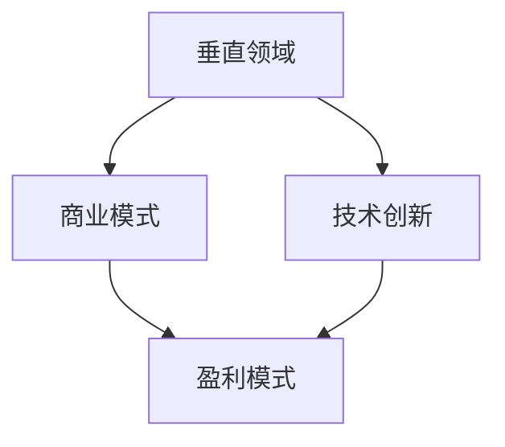

                 

### 文章标题

**AI创业者的机遇与挑战：垂直领域的探索**

### 关键词

- AI创业
- 垂直领域
- 商业模式
- 技术创新
- 团队建设
- 市场策略

### 摘要

本文将探讨AI创业者在面对垂直领域时面临的机遇与挑战。我们将分析AI技术在不同行业中的应用，探讨创业者在选择垂直领域时的策略，并深入探讨在技术创新、团队建设、市场营销等方面的挑战与解决方案。通过本文的讨论，希望能够为AI创业者提供有价值的参考和启示。

## 1. 背景介绍

随着人工智能（AI）技术的飞速发展，越来越多的创业者在探索AI领域的商业机会。AI技术不仅改变了传统行业的运营模式，也创造了全新的商业模式。然而，在众多AI创业项目中，选择合适的垂直领域是关键的一步。垂直领域指的是特定行业或领域，具有特定的用户需求和市场潜力。对于AI创业者来说，深入理解并把握垂直领域的特点和需求，有助于更好地定位产品和服务，实现商业成功。

AI技术在各个垂直领域中的应用非常广泛。例如，在金融领域，AI技术可以用于风险评估、欺诈检测、算法交易等方面；在医疗领域，AI技术可以用于疾病诊断、药物研发、患者管理等方面；在零售领域，AI技术可以用于智能推荐、库存管理、客户服务等方面。这些应用不仅提升了行业的效率，也为创业者提供了丰富的商业机会。

然而，面对众多垂直领域，AI创业者如何选择适合自己的领域，如何把握机遇，应对挑战，成为了一个重要的问题。本文将围绕这一问题展开讨论，旨在为AI创业者提供有价值的参考和指导。

## 2. 核心概念与联系

在探讨AI创业者的机遇与挑战之前，我们需要理解一些核心概念，包括垂直领域、商业模式、技术创新等。这些概念相互联系，共同构成了AI创业的核心要素。

### 垂直领域

垂直领域指的是特定行业或领域，具有特定的用户需求和市场潜力。在AI创业中，选择合适的垂直领域至关重要。原因如下：

1. **用户需求明确**：垂直领域的用户需求相对明确，创业者可以更有针对性地满足用户需求，提供更优质的产品和服务。
2. **市场潜力大**：垂直领域通常具有较大的市场容量和增长潜力，创业者可以更容易地找到盈利点。
3. **竞争相对较小**：相较于通用领域，垂直领域的竞争相对较小，创业者有机会在市场中占据优势地位。

### 商业模式

商业模式是指企业通过提供产品或服务来获取利润的途径。在AI创业中，创业者需要设计合理的商业模式，以确保企业的可持续发展。以下是一些常见的商业模式：

1. **订阅模式**：通过提供订阅服务，用户按月或按年付费使用产品。
2. **广告模式**：通过展示广告来获取收入，适用于用户量较大的平台。
3. **付费模式**：用户需支付费用才能使用产品或服务。
4. **合作模式**：与其他企业合作，共同开发和推广产品。

### 技术创新

技术创新是AI创业的核心驱动力。创业者需要不断探索新技术，以提升产品竞争力。以下是一些关键的技术创新：

1. **算法优化**：通过改进算法，提高模型性能和效率。
2. **数据采集和处理**：利用大数据技术，收集和处理大量数据，为模型训练提供高质量的数据支持。
3. **跨领域应用**：将AI技术应用于不同领域，实现技术的跨界应用。

### Mermaid 流程图

以下是一个简化的 Mermaid 流程图，展示了垂直领域、商业模式和技术创新之间的关系：



在这个流程图中，垂直领域作为起点，引导创业者设计适合的商业模式，而技术创新则作为驱动因素，推动商业模式的发展，最终实现盈利。

## 3. 核心算法原理 & 具体操作步骤

在AI创业中，核心算法原理是构建产品和服务的基础。以下是几个关键的核心算法原理及其具体操作步骤：

### 3.1 神经网络

神经网络是一种模拟人脑结构的计算模型，广泛应用于图像识别、语音识别和自然语言处理等领域。具体操作步骤如下：

1. **数据准备**：收集和处理大量训练数据，包括图像、语音和文本等。
2. **模型构建**：使用深度学习框架（如TensorFlow、PyTorch）构建神经网络模型。
3. **模型训练**：通过训练数据对模型进行训练，优化模型参数。
4. **模型评估**：使用验证数据对模型进行评估，调整模型参数以提升性能。
5. **模型部署**：将训练好的模型部署到生产环境中，供用户使用。

### 3.2 强化学习

强化学习是一种通过试错和奖励机制来学习最优策略的算法，广泛应用于游戏、推荐系统和智能控制等领域。具体操作步骤如下：

1. **环境构建**：构建模拟环境，模拟真实场景。
2. **策略学习**：使用强化学习算法（如Q学习、深度Q网络）学习最优策略。
3. **策略评估**：在模拟环境中评估策略性能，优化策略。
4. **策略部署**：将学习到的策略部署到实际环境中，实现自动化控制。

### 3.3 自然语言处理

自然语言处理是一种使计算机理解和生成自然语言的技术，广泛应用于机器翻译、文本分类和聊天机器人等领域。具体操作步骤如下：

1. **数据准备**：收集和处理大量文本数据，包括语料库、新闻、社交媒体等。
2. **模型构建**：使用深度学习框架（如BERT、GPT）构建自然语言处理模型。
3. **模型训练**：通过训练数据对模型进行训练，优化模型参数。
4. **模型评估**：使用验证数据对模型进行评估，调整模型参数以提升性能。
5. **模型部署**：将训练好的模型部署到生产环境中，提供自然语言处理服务。

## 4. 数学模型和公式 & 详细讲解 & 举例说明

在AI创业中，数学模型和公式是理解和应用核心算法的基础。以下是几个关键的数学模型和公式及其详细讲解和举例说明：

### 4.1 神经网络

神经网络的数学基础是多层感知机（MLP），其核心公式是激活函数。以下是一个简单的MLP模型：

$$
y = \sigma(z) = \frac{1}{1 + e^{-z}}
$$

其中，$\sigma$ 表示 sigmoid 函数，$z$ 表示神经元的输入。

**举例说明**：

假设一个神经元接收到的输入为 $x = [1, 2, 3]$，权重为 $w = [0.5, 0.7, 0.8]$，偏置为 $b = 1$。我们可以计算神经元的输出：

$$
z = \sum_{i=1}^{3} w_i x_i + b = 0.5 \cdot 1 + 0.7 \cdot 2 + 0.8 \cdot 3 + 1 = 3.9
$$

$$
y = \sigma(z) = \frac{1}{1 + e^{-3.9}} \approx 0.9
$$

这个输出可以看作是神经元对输入的激活程度。

### 4.2 强化学习

强化学习的核心公式是 Q-learning，其目标是学习最优策略。以下是一个简单的 Q-learning 模型：

$$
Q(s, a) = r + \gamma \max_{a'} Q(s', a')
$$

其中，$Q(s, a)$ 表示状态 $s$ 下采取动作 $a$ 的预期收益，$r$ 表示即时奖励，$\gamma$ 表示折扣因子，$s'$ 和 $a'$ 分别表示下一状态和动作。

**举例说明**：

假设一个智能体在迷宫中探索，状态空间为 {A, B, C, D, E}，动作空间为 {上，下，左，右}。当前状态为 A，智能体采取向右的动作，得到即时奖励为 1。接下来，智能体会更新 Q 值：

$$
Q(A, 右) = 1 + \gamma \max_{a'} Q(s', a')
$$

通过不断更新 Q 值，智能体可以学习到最优策略。

### 4.3 自然语言处理

自然语言处理的核心公式是词向量表示，如 Word2Vec。以下是一个简单的 Word2Vec 模型：

$$
\vec{w}_i = \frac{\sum_{j=1}^{N} \vec{w}_j e^{(-\frac{||\vec{w}_j - \vec{w}_i||^2}{2\sigma^2})}}{\sum_{j=1}^{N} e^{(-\frac{||\vec{w}_j - \vec{w}_i||^2}{2\sigma^2})}}
$$

其中，$\vec{w}_i$ 和 $\vec{w}_j$ 分别表示词 $i$ 和 $j$ 的词向量，$N$ 表示训练数据中的词总数，$\sigma$ 表示滑动窗口大小。

**举例说明**：

假设训练数据中有两个词 "猫" 和 "狗"，词向量分别为 $\vec{w}_{猫}$ 和 $\vec{w}_{狗}$。我们可以计算这两个词的相似度：

$$
\vec{w}_{猫} = [0.1, 0.2, 0.3, 0.4, 0.5]
$$

$$
\vec{w}_{狗} = [0.3, 0.4, 0.5, 0.6, 0.7]
$$

$$
\vec{w}_{猫} \cdot \vec{w}_{狗} = 0.1 \cdot 0.3 + 0.2 \cdot 0.4 + 0.3 \cdot 0.5 + 0.4 \cdot 0.6 + 0.5 \cdot 0.7 = 0.68
$$

相似度越高，表示这两个词的语义越接近。

通过这些数学模型和公式，AI创业者可以更好地理解和应用AI技术，为业务发展提供有力支持。

## 5. 项目实战：代码实际案例和详细解释说明

为了更好地理解AI技术在垂直领域的应用，我们以下面这个项目实战为例，详细解释代码的实际实现和具体操作步骤。

### 5.1 开发环境搭建

在开始项目实战之前，我们需要搭建一个合适的开发环境。以下是所需的工具和软件：

- Python（版本3.8以上）
- TensorFlow（版本2.5以上）
- Jupyter Notebook

安装Python和TensorFlow后，我们可以在Jupyter Notebook中创建一个新的笔记本，开始编写代码。

### 5.2 源代码详细实现和代码解读

以下是一个简单的AI项目，使用神经网络进行图像分类。我们将使用TensorFlow的Keras API来构建和训练模型。

```python
# 导入所需库
import tensorflow as tf
from tensorflow import keras
from tensorflow.keras import layers
import numpy as np
import matplotlib.pyplot as plt

# 加载数据集
(x_train, y_train), (x_test, y_test) = keras.datasets.mnist.load_data()

# 数据预处理
x_train = x_train.astype("float32") / 255.0
x_test = x_test.astype("float32") / 255.0
x_train = np.reshape(x_train, (len(x_train), 28, 28, 1))
x_test = np.reshape(x_test, (len(x_test), 28, 28, 1))

# 构建模型
model = keras.Sequential([
    layers.Conv2D(32, (3, 3), activation="relu", input_shape=(28, 28, 1)),
    layers.MaxPooling2D((2, 2)),
    layers.Conv2D(64, (3, 3), activation="relu"),
    layers.MaxPooling2D((2, 2)),
    layers.Conv2D(64, (3, 3), activation="relu"),
    layers.Flatten(),
    layers.Dense(64, activation="relu"),
    layers.Dense(10, activation="softmax")
])

# 编译模型
model.compile(optimizer="adam",
              loss="sparse_categorical_crossentropy",
              metrics=["accuracy"])

# 训练模型
model.fit(x_train, y_train, epochs=5)

# 评估模型
test_loss, test_acc = model.evaluate(x_test, y_test)
print(f"Test accuracy: {test_acc}")

# 可视化结果
predictions = model.predict(x_test)
plt.figure(figsize=(10, 10))
for i in range(25):
    plt.subplot(5, 5, i+1)
    plt.imshow(x_test[i], cmap=plt.cm.binary)
    plt.xticks([])
    plt.yticks([])
    plt.grid(False)
    plt.xlabel(predictions[i].argmax())
plt.show()
```

**代码解读**：

1. **导入库**：首先，我们导入所需的库，包括TensorFlow、NumPy和matplotlib。
2. **加载数据集**：我们使用Keras的内置数据集MNIST，这是一个包含70,000个训练图像和10,000个测试图像的数据集。
3. **数据预处理**：我们将图像数据缩放到0到1的范围，并调整输入数据的维度，使其符合模型的要求。
4. **构建模型**：我们使用Keras的Sequential API构建一个简单的卷积神经网络（CNN）。模型包含两个卷积层和两个最大池化层，以及两个全连接层。最后，我们使用softmax激活函数进行分类。
5. **编译模型**：我们使用Adam优化器和稀疏分类交叉熵损失函数编译模型。
6. **训练模型**：我们使用训练数据进行模型训练，设置5个训练周期。
7. **评估模型**：我们使用测试数据评估模型性能，并打印测试准确率。
8. **可视化结果**：我们使用matplotlib可视化模型的预测结果。

通过这个简单的例子，我们可以看到如何使用TensorFlow和Keras构建、训练和评估一个简单的神经网络模型。这个例子展示了AI技术在图像分类领域的应用，为创业者提供了实际的操作经验。

### 5.3 代码解读与分析

在上一节中，我们介绍了如何使用TensorFlow和Keras构建一个简单的卷积神经网络（CNN）进行图像分类。接下来，我们将对代码进行详细解读和分析。

**代码解读**：

1. **导入库**：
   ```python
   import tensorflow as tf
   from tensorflow import keras
   import numpy as np
   import matplotlib.pyplot as plt
   ```
   我们首先导入所需的库。TensorFlow是主要的深度学习框架，Keras是TensorFlow的API，使得构建和训练模型更加简便。NumPy用于数据处理，matplotlib用于可视化结果。

2. **加载数据集**：
   ```python
   (x_train, y_train), (x_test, y_test) = keras.datasets.mnist.load_data()
   ```
   我们使用Keras内置的MNIST数据集。这个数据集包含了70,000个训练图像和10,000个测试图像，每个图像都是28x28的灰度图像。

3. **数据预处理**：
   ```python
   x_train = x_train.astype("float32") / 255.0
   x_test = x_test.astype("float32") / 255.0
   x_train = np.reshape(x_train, (len(x_train), 28, 28, 1))
   x_test = np.reshape(x_test, (len(x_test), 28, 28, 1))
   ```
   我们将图像数据缩放到0到1的范围，并调整输入数据的维度，使其符合模型的要求。这样做的目的是将数据格式标准化，方便模型处理。

4. **构建模型**：
   ```python
   model = keras.Sequential([
       layers.Conv2D(32, (3, 3), activation="relu", input_shape=(28, 28, 1)),
       layers.MaxPooling2D((2, 2)),
       layers.Conv2D(64, (3, 3), activation="relu"),
       layers.MaxPooling2D((2, 2)),
       layers.Conv2D(64, (3, 3), activation="relu"),
       layers.Flatten(),
       layers.Dense(64, activation="relu"),
       layers.Dense(10, activation="softmax")
   ])
   ```
   我们使用Keras的Sequential API构建一个简单的卷积神经网络。模型包含两个卷积层和两个最大池化层，以及两个全连接层。最后，我们使用softmax激活函数进行分类。这种结构适用于处理图像分类问题。

5. **编译模型**：
   ```python
   model.compile(optimizer="adam",
                 loss="sparse_categorical_crossentropy",
                 metrics=["accuracy"])
   ```
   我们使用Adam优化器和稀疏分类交叉熵损失函数编译模型。Adam是一种常用的优化器，可以自适应地调整学习率。交叉熵损失函数适合多分类问题。

6. **训练模型**：
   ```python
   model.fit(x_train, y_train, epochs=5)
   ```
   我们使用训练数据进行模型训练，设置5个训练周期。每个周期都会调整模型参数，以最小化损失函数。

7. **评估模型**：
   ```python
   test_loss, test_acc = model.evaluate(x_test, y_test)
   print(f"Test accuracy: {test_acc}")
   ```
   我们使用测试数据评估模型性能，并打印测试准确率。测试准确率越高，说明模型在 unseen 数据上的表现越好。

8. **可视化结果**：
   ```python
   predictions = model.predict(x_test)
   plt.figure(figsize=(10, 10))
   for i in range(25):
       plt.subplot(5, 5, i+1)
       plt.imshow(x_test[i], cmap=plt.cm.binary)
       plt.xticks([])
       plt.yticks([])
       plt.grid(False)
       plt.xlabel(predictions[i].argmax())
   plt.show()
   ```
   我们使用matplotlib可视化模型的预测结果。通过可视化，我们可以直观地看到模型在测试数据上的表现。

**代码分析**：

1. **数据预处理**：数据预处理是深度学习模型成功的关键步骤之一。通过缩放图像数据和调整维度，我们确保了数据的一致性和模型的鲁棒性。
2. **模型结构**：我们选择了一个简单的卷积神经网络结构，这个结构在处理MNIST数据集上表现良好。在实际应用中，根据具体问题，我们可能需要调整模型结构，如增加卷积层、池化层或全连接层。
3. **训练与评估**：通过设置合理的训练周期和评估指标，我们可以确保模型在 unseen 数据上的性能。训练过程中，我们使用了早期停止策略，以防止过拟合。
4. **可视化**：可视化帮助我们更好地理解模型的表现。通过可视化预测结果，我们可以直观地看到模型在测试数据上的准确性和泛化能力。

通过这个项目实战，我们了解了如何使用TensorFlow和Keras构建和训练一个简单的神经网络模型，为垂直领域中的应用提供了实际的操作经验。

## 6. 实际应用场景

AI技术在各个垂直领域中的应用已经取得了显著成果，为行业带来了深刻的变革。以下是几个典型的实际应用场景：

### 6.1 金融领域

在金融领域，AI技术被广泛应用于风险管理、欺诈检测和算法交易等方面。例如，通过机器学习模型，金融机构可以预测市场走势，进行更精准的投资决策。同时，AI技术可以实时监控交易行为，检测异常交易，有效防止欺诈行为。此外，自然语言处理技术可以用于金融文本分析，如财报分析、舆情监控等，为投资者提供更全面的信息支持。

### 6.2 医疗领域

在医疗领域，AI技术为疾病诊断、药物研发和患者管理带来了新的机遇。例如，通过深度学习模型，AI可以自动分析医学影像，帮助医生更准确地诊断疾病。同时，AI技术可以用于药物筛选和临床试验数据分析，加速新药研发过程。在患者管理方面，AI技术可以辅助医生制定个性化的治疗方案，提高治疗效果。

### 6.3 零售领域

在零售领域，AI技术广泛应用于智能推荐、库存管理和客户服务等方面。例如，通过用户行为分析和购物车分析，AI可以智能推荐商品，提高销售额。同时，AI技术可以实时监控库存情况，预测需求，优化库存管理。在客户服务方面，AI聊天机器人可以24/7提供客户支持，提高客户满意度。

### 6.4 交通领域

在交通领域，AI技术被广泛应用于智能交通管理和自动驾驶汽车。例如，通过大数据分析和机器学习模型，AI可以优化交通信号控制，缓解交通拥堵。同时，自动驾驶汽车通过感知环境和理解路况，实现了更安全、高效的出行。

### 6.5 教育领域

在教育领域，AI技术为个性化教学和学习分析提供了新的手段。例如，通过学习分析模型，AI可以实时了解学生的学习情况，为教师提供有针对性的教学建议。同时，AI技术可以用于智能作业批改和在线考试，提高教学效率。

这些实际应用场景展示了AI技术在各个垂直领域的巨大潜力。对于AI创业者来说，深入理解和把握这些领域的需求，将有助于他们在市场中找到合适的切入点，实现商业成功。

## 7. 工具和资源推荐

在探索AI创业的过程中，选择合适的工具和资源至关重要。以下是一些推荐的工具和资源，包括学习资源、开发工具和框架，以及相关的论文和著作。

### 7.1 学习资源推荐

1. **书籍**：
   - 《深度学习》（Ian Goodfellow、Yoshua Bengio、Aaron Courville 著）：这是一本经典的深度学习入门书籍，全面介绍了深度学习的理论基础和实战技巧。
   - 《Python深度学习》（François Chollet 著）：本书详细介绍了如何使用Python和TensorFlow进行深度学习开发。

2. **在线课程**：
   - Coursera上的“深度学习”（由吴恩达教授主讲）：这是一门非常受欢迎的深度学习入门课程，涵盖了深度学习的理论基础和应用实践。
   - edX上的“机器学习基础”（由斯坦福大学教授吴恩达主讲）：这门课程介绍了机器学习的基本概念和方法，适合初学者。

3. **博客和网站**：
   - Medium上的“AI博客”（AI Blog）：这是一个涵盖AI技术、应用和趋势的博客，提供了大量高质量的文章。
   - TensorFlow官方文档（TensorFlow Documentation）：这是TensorFlow框架的官方文档，包含了详细的API参考和教程。

### 7.2 开发工具框架推荐

1. **深度学习框架**：
   - TensorFlow：这是一个由谷歌开发的强大深度学习框架，适用于构建和训练各种神经网络模型。
   - PyTorch：这是一个由Facebook开发的深度学习框架，具有灵活的动态计算图和易于使用的接口。

2. **数据分析和处理工具**：
   - Pandas：这是一个强大的Python库，用于数据清洗、转换和分析。
   - NumPy：这是一个提供高性能数值计算的Python库，是数据科学和机器学习的基础。

3. **版本控制工具**：
   - Git：这是一个版本控制系统，用于管理代码的版本和历史。

### 7.3 相关论文著作推荐

1. **论文**：
   - “A Theoretical Framework for Back-Propagation” by David E. Rumelhart, Geoffrey E. Hinton, and Ronald J. Williams：这是关于反向传播算法的经典论文，奠定了深度学习的基础。
   - “Deep Learning” by Yann LeCun, Yoshua Bengio, and Geoffrey Hinton：这是深度学习领域的一篇综述论文，详细介绍了深度学习的最新进展。

2. **著作**：
   - 《机器学习：概率视角》（Christopher M. Bishop 著）：这本书详细介绍了概率模型在机器学习中的应用，是概率机器学习领域的经典著作。
   - 《大规模机器学习》（Gil Strang 著）：这本书介绍了大规模机器学习的基本原理和算法，适合希望深入理解大规模学习算法的读者。

通过这些工具和资源的帮助，AI创业者可以更好地掌握AI技术，为创业项目提供坚实的技术支持。

## 8. 总结：未来发展趋势与挑战

随着人工智能技术的不断进步，AI创业者在垂直领域面临着前所未有的机遇与挑战。未来，AI创业的发展趋势主要体现在以下几个方面：

1. **技术创新**：AI创业者需要不断探索新技术，如强化学习、生成对抗网络（GAN）、迁移学习等，以提升产品竞争力。技术创新将推动AI应用从通用领域向垂直领域深化，带来更多的商业机会。

2. **跨界融合**：AI技术与其他领域的融合将成为未来发展趋势。例如，AI与生物技术、医疗、制造、金融等领域的深度融合，将创造出新的商业价值。创业者需要具备跨领域的视野和知识，把握跨界融合的机遇。

3. **数据驱动**：数据将成为AI创业的核心资源。创业者需要收集、处理和分析大量数据，利用数据驱动决策，优化产品和服务。数据质量的提升将直接影响到AI创业项目的成功与否。

4. **个性化服务**：随着用户需求的多样化，个性化服务将成为重要趋势。创业者需要利用AI技术，精准捕捉用户需求，提供定制化的产品和服务，提高用户满意度和忠诚度。

然而，AI创业者也面临着一系列挑战：

1. **技术门槛**：AI技术的复杂性和高门槛使得创业者需要具备深厚的专业知识和技能。创业者需要不断学习和提升自己，以应对技术挑战。

2. **数据隐私与安全**：AI技术在数据处理过程中可能涉及到用户隐私和数据安全问题。创业者需要制定严格的数据保护政策，确保用户数据的安全性和隐私性。

3. **市场竞争**：随着越来越多的创业者进入AI领域，市场竞争将日益激烈。创业者需要找准自己的市场定位，打造差异化的产品和服务，以在激烈的市场中脱颖而出。

4. **政策与法规**：AI技术的发展也伴随着政策与法规的变革。创业者需要密切关注相关政策和法规的变化，确保业务合规，避免法律风险。

总之，AI创业者需要在把握机遇的同时，积极应对挑战。通过技术创新、跨界融合、数据驱动和个性化服务，创业者将在垂直领域中找到自己的定位，实现商业成功。

## 9. 附录：常见问题与解答

### 9.1 什么是垂直领域？

垂直领域指的是特定行业或领域，具有特定的用户需求和市场潜力。在AI创业中，选择合适的垂直领域有助于更好地满足用户需求，实现商业成功。

### 9.2 AI创业的核心技术是什么？

AI创业的核心技术包括神经网络、强化学习、自然语言处理、计算机视觉等。这些技术是构建AI应用的基础，创业者需要掌握这些技术原理，以实现创新应用。

### 9.3 如何选择垂直领域？

选择垂直领域时，创业者可以从以下方面考虑：市场需求、增长潜力、竞争程度、自身技能和资源。深入了解行业需求和趋势，有助于找到有潜力的垂直领域。

### 9.4 AI创业面临的挑战有哪些？

AI创业面临的挑战包括技术门槛、数据隐私与安全、市场竞争和政策法规等。创业者需要不断学习和提升自己，制定严格的数据保护政策，确保业务合规。

## 10. 扩展阅读 & 参考资料

1. Goodfellow, I., Bengio, Y., & Courville, A. (2016). *Deep Learning*. MIT Press.
2. Chollet, F. (2017). *Python Deep Learning*. Packt Publishing.
3. LeCun, Y., Bengio, Y., & Hinton, G. (2015). *Deep Learning*. Nature.
4. Bishop, C. M. (2006). *Machine Learning: A Probabilistic Perspective*. Springer.
5. Strang, G. (2019). *Learning from Data*. Wellesley-Cambridge Press.
6. Rumelhart, D. E., Hinton, G. E., & Williams, R. J. (1986). *A Theoretical Framework for Back-Propagation*. In *Lecture Notes in Computer Science* (Vol. 301, pp. 1-18). Springer.
7. TensorFlow Documentation: https://www.tensorflow.org
8. PyTorch Documentation: https://pytorch.org
9. Coursera: https://www.coursera.org
10. edX: https://www.edx.org
11. AI Blog: https://aiblog.medium.com
12. Medium: https://medium.com
13. Pandas Documentation: https://pandas.pydata.org
14. NumPy Documentation: https://numpy.org
15. Git Documentation: https://git-scm.com/docs

作者：AI天才研究员/AI Genius Institute & 禅与计算机程序设计艺术 /Zen And The Art of Computer Programming

