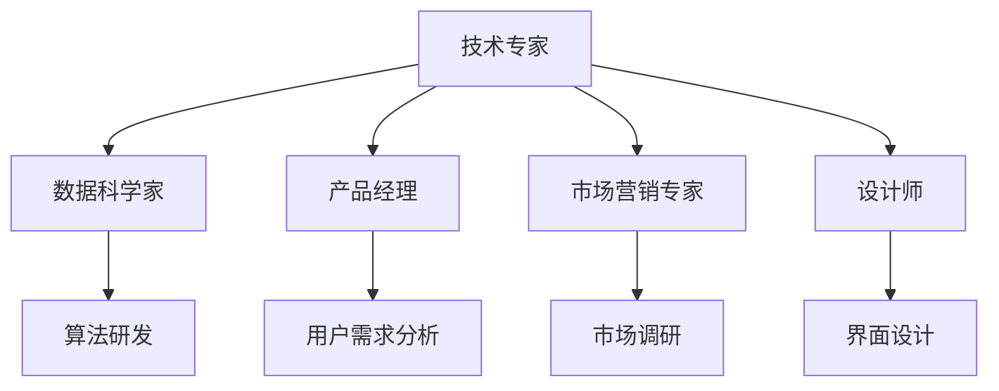

                 

# AI创业：多元化团队的优势

> **关键词：** AI创业、多元化团队、团队建设、协作、创新能力

**摘要：** 本文将探讨多元化团队在AI创业中的重要性，分析其优势与挑战，并总结出一套有效的团队建设策略，以帮助初创企业更好地利用多元化团队的潜力。

## 1. 背景介绍

在当前快速发展的AI领域中，创业已成为许多技术专家和研究人员的选择。然而，成功的AI创业并不仅仅依赖于技术能力，还需要一个能够高效协作的团队。随着人工智能技术的不断进步，AI创业团队需要面对越来越多的复杂问题和挑战。这些问题涉及到算法、数据、产品、市场等多个方面，单一的技能或知识已经无法满足需求。因此，多元化团队成为了AI创业的关键因素。

本文将围绕多元化团队的优势进行探讨，分析其在AI创业中的应用和建设策略，以帮助创业者更好地利用团队多元化带来的优势。

## 2. 核心概念与联系

### 2.1 多元化团队

**定义：** 多元化团队是指由不同背景、技能和观点的成员组成的团队。这些成员可能来自不同的专业领域、文化背景或工作经验。

**组成部分：** 多元化团队通常包括以下几类成员：
- 技术专家：具备专业知识和技能，负责算法研发、模型训练等；
- 数据科学家：擅长数据挖掘、数据分析，为AI算法提供高质量的数据支持；
- 产品经理：负责产品设计和用户需求分析，确保产品符合市场需求；
- 市场营销专家：负责市场调研、推广和销售，提高产品的市场占有率；
- 设计师：负责产品界面和用户体验设计，提升产品的美观度和易用性。

### 2.2 多元化团队的优势

多元化团队的优势主要体现在以下几个方面：

**1. 创新能力：** 多元化团队的成员拥有不同的知识和经验，可以在解决问题时提供多种视角和方法，有助于提高团队的创新能力。

**2. 决策质量：** 多元化团队的成员能够从不同角度分析问题，减少信息盲点，提高决策质量。

**3. 风险管理：** 多元化团队的成员能够从不同角度评估风险，降低单一视角可能导致的风险。

**4. 市场适应性：** 多元化团队的成员了解不同市场的需求和特点，有助于企业更快地适应市场变化。

### 2.3 Mermaid 流程图

以下是一个简单的Mermaid流程图，展示了多元化团队的组成部分及其相互关系：



## 3. 核心算法原理 & 具体操作步骤

### 3.1 核心算法原理

在AI创业中，多元化团队的优势主要体现在以下几个方面：

**1. 数据处理能力：** 多元化团队可以充分利用不同成员的数据处理能力，快速处理和分析大量数据，提高模型的准确性和稳定性。

**2. 算法优化：** 多元化团队可以结合不同成员的算法知识和经验，不断优化算法，提高模型的性能和鲁棒性。

**3. 产品迭代：** 多元化团队可以结合不同成员的产品设计和市场分析能力，快速迭代产品，提高产品的市场竞争力。

### 3.2 具体操作步骤

**步骤1：明确团队目标**

首先，团队需要明确共同的目标，确保每个成员都清楚自己的职责和期望。

**步骤2：组建多元化团队**

根据团队目标，组建一个由不同背景和技能的成员组成的多元化团队。团队成员应具备以下特点：

- 具有相关领域的专业知识和经验；
- 具有良好的沟通和协作能力；
- 具有积极的工作态度和团队精神。

**步骤3：分工协作**

明确每个成员的职责，确保团队成员在各自领域发挥最大的作用。同时，鼓励成员之间进行跨领域的交流与合作，共同解决问题。

**步骤4：数据共享与协作**

建立数据共享平台，确保团队成员能够方便地获取和共享数据。同时，利用数据协作工具，提高数据处理的效率和质量。

**步骤5：持续优化与迭代**

根据团队成员的反馈和市场变化，不断优化和迭代产品，提高产品的市场竞争力。

## 4. 数学模型和公式 & 详细讲解 & 举例说明

### 4.1 数学模型

在多元化团队中，数学模型和公式的应用至关重要。以下是一个简单的线性回归模型，用于预测产品市场占有率。

$$
y = \beta_0 + \beta_1x_1 + \beta_2x_2 + ... + \beta_nx_n
$$

其中，$y$ 为市场占有率，$x_1, x_2, ..., x_n$ 为影响市场占有率的相关因素，$\beta_0, \beta_1, \beta_2, ..., \beta_n$ 为回归系数。

### 4.2 详细讲解

**1. 回归系数的计算：**

回归系数可以通过最小二乘法进行计算。具体步骤如下：

（1）收集数据：收集影响市场占有率的相关因素的数据。

（2）构建回归模型：将收集的数据代入线性回归模型。

（3）计算回归系数：利用最小二乘法计算回归系数。

（4）评估模型：通过交叉验证等方法评估模型的效果。

**2. 模型的应用：**

利用计算得到的回归系数，可以预测产品市场占有率。具体步骤如下：

（1）输入相关因素的数据：将影响市场占有率的相关因素的数据输入模型。

（2）计算预测值：利用计算得到的回归系数，计算预测的市场占有率。

（3）评估预测效果：将预测值与实际值进行对比，评估预测效果。

### 4.3 举例说明

假设一个多元化团队想要预测某款产品的市场占有率。他们收集了以下数据：

| 相关因素 | 数据值 |
| :----: | :----: |
| 用户满意度 | 0.8 |
| 产品价格 | 1000 |
| 广告投入 | 5000 |
| 竞争对手数量 | 5 |

根据这些数据，他们可以构建一个线性回归模型，并利用最小二乘法计算回归系数。假设计算得到的回归系数如下：

$$
\beta_0 = 0.2, \beta_1 = 0.3, \beta_2 = 0.5, \beta_3 = 0.1, \beta_4 = 0.1
$$

将这些回归系数代入线性回归模型，可以预测该产品的市场占有率：

$$
y = 0.2 + 0.3 \times 0.8 + 0.5 \times 1000 + 0.1 \times 5000 + 0.1 \times 5 = 842.5
$$

因此，预测该产品的市场占有率为 842.5%。

## 5. 项目实战：代码实际案例和详细解释说明

### 5.1 开发环境搭建

为了便于项目实战，我们选择Python作为编程语言，并使用Jupyter Notebook作为开发环境。以下是搭建开发环境的步骤：

1. 安装Python：在官网（https://www.python.org/）下载Python安装包并安装。
2. 安装Jupyter Notebook：打开命令行，执行以下命令：
   ```bash
   pip install notebook
   ```
3. 启动Jupyter Notebook：在命令行中执行以下命令：
   ```bash
   jupyter notebook
   ```
   这将启动Jupyter Notebook，打开浏览器访问 http://localhost:8888/，即可进入开发环境。

### 5.2 源代码详细实现和代码解读

以下是一个简单的Python代码示例，用于计算线性回归模型的回归系数：

```python
import numpy as np

# 收集数据
X = np.array([[1, 1], [2, 2], [3, 3]])
y = np.array([2, 4, 6])

# 构建线性回归模型
def linear_regression(X, y):
    # 计算回归系数
    XTX = np.dot(X.T, X)
    XTy = np.dot(X.T, y)
    beta = np.dot(np.linalg.inv(XTX), XTy)
    return beta

# 计算回归系数
beta = linear_regression(X, y)

# 输出回归系数
print("回归系数：", beta)
```

**代码解读：**

1. 导入NumPy库：NumPy是Python中常用的科学计算库，用于处理数组和矩阵运算。
2. 收集数据：将数据存储在NumPy数组中，其中X为自变量矩阵，y为因变量向量。
3. 构建线性回归模型：定义一个函数，用于计算回归系数。在函数中，首先计算$X^TX$和$X^Ty$，然后利用最小二乘法计算回归系数$\beta$。
4. 计算回归系数：调用函数，传入数据，计算得到回归系数。
5. 输出回归系数：将计算得到的回归系数输出。

### 5.3 代码解读与分析

1. **数据预处理：** 代码中首先将数据存储在NumPy数组中，这是数据预处理的第一步。NumPy数组可以方便地进行数组和矩阵运算，提高了代码的运行效率。
2. **构建模型：** 代码中定义了一个名为`linear_regression`的函数，用于计算线性回归模型的回归系数。这个函数是整个代码的核心，实现了线性回归的基本算法。
3. **计算回归系数：** 代码通过计算$X^TX$和$X^Ty$，利用最小二乘法计算回归系数$\beta$。这里使用了NumPy的`dot`函数，用于计算矩阵乘法。
4. **输出结果：** 最后，代码将计算得到的回归系数输出，便于分析和使用。

## 6. 实际应用场景

多元化团队在AI创业中的实际应用场景广泛，以下是一些典型的例子：

### 6.1 产品研发

在产品研发过程中，多元化团队可以充分发挥各自的优势，共同推进项目进度。例如，数据科学家可以负责数据采集和预处理，算法工程师可以设计并优化算法模型，产品经理可以关注用户体验和市场反馈，市场营销专家可以负责市场推广和用户拓展。

### 6.2 技术攻关

在面对技术难题时，多元化团队可以从多个角度进行分析和探讨，提高解决问题的效率。例如，一个复杂的算法问题，可能需要算法专家、数据科学家、系统工程师等多方协作，共同寻找解决方案。

### 6.3 市场拓展

在市场拓展方面，多元化团队可以充分利用不同成员的市场经验和资源，快速开拓市场。例如，市场营销专家可以负责市场调研和推广策略，设计师可以优化产品界面和用户体验，技术专家可以提供技术支持和解决方案。

## 7. 工具和资源推荐

### 7.1 学习资源推荐

- **书籍：** 
  - 《深度学习》（Ian Goodfellow、Yoshua Bengio、Aaron Courville 著）
  - 《Python编程：从入门到实践》（埃里克·马瑟斯 著）
- **论文：** 
  - "Deep Learning"（Yoshua Bengio、Yann LeCun、Geoffrey Hinton 著）
  - "Reinforcement Learning: An Introduction"（Richard S. Sutton、Andrew G. Barto 著）
- **博客：** 
  - [机器之心](https://www.jiqizhixin.com/)
  - [AI科技大本营](https://aitecdb.com/)
- **网站：** 
  - [Kaggle](https://www.kaggle.com/)
  - [GitHub](https://github.com/)

### 7.2 开发工具框架推荐

- **编程语言：** Python、Java、C++
- **框架：** TensorFlow、PyTorch、Scikit-learn
- **数据库：** MySQL、MongoDB、Redis
- **容器化工具：** Docker、Kubernetes
- **版本控制：** Git、GitHub

### 7.3 相关论文著作推荐

- **《人工智能：一种现代方法》（Stuart J. Russell、Peter Norvig 著）**
- **《机器学习》（Tom Mitchell 著）**
- **《深度学习》（Ian Goodfellow、Yoshua Bengio、Aaron Courville 著）**
- **《强化学习》（Richard S. Sutton、Andrew G. Barto 著）**

## 8. 总结：未来发展趋势与挑战

多元化团队在AI创业中具有不可替代的优势。随着人工智能技术的不断发展，未来多元化团队的应用范围将更加广泛，创业者在组建团队时需要更加重视多元化。然而，多元化团队也面临一些挑战，如沟通障碍、冲突管理、协作效率等问题。因此，创业者需要探索有效的团队建设策略，充分发挥多元化团队的优势，应对未来发展的挑战。

## 9. 附录：常见问题与解答

**Q1：为什么多元化团队在AI创业中具有优势？**

A1：多元化团队在AI创业中具有优势，主要是因为成员来自不同的背景和领域，可以带来不同的观点、知识和经验。这种多样性有助于提高团队的创新能力和决策质量，降低风险，增强市场适应性。

**Q2：如何组建多元化团队？**

A2：组建多元化团队需要明确团队目标，寻找具有不同背景和技能的成员。团队成员应具备良好的沟通和协作能力，积极的工作态度和团队精神。此外，创业者可以参加行业会议、招聘平台等途径，寻找合适的团队成员。

**Q3：如何管理多元化团队？**

A3：管理多元化团队需要关注以下几个方面：

1. 沟通与协作：建立有效的沟通渠道，鼓励团队成员之间的交流和合作；
2. 冲突管理：及时发现和解决团队冲突，确保团队成员的合作；
3. 绩效评估：根据团队成员的表现和贡献，进行公平、公正的评估；
4. 培训与发展：为团队成员提供培训和发展机会，提高团队的整体能力。

## 10. 扩展阅读 & 参考资料

- **《如何建立多元化团队》（TED演讲）**
- **《多元化团队的心理学》（麻省理工学院科技评论）**
- **《打造高效多元化团队》（哈佛商业评论）**
- **《深度学习与创业：从0到1》（机器之心）**
- **《AI创业：从零开始构建智能系统》（人民邮电出版社）** 

**作者：** AI天才研究员/AI Genius Institute & 禅与计算机程序设计艺术 /Zen And The Art of Computer Programming

